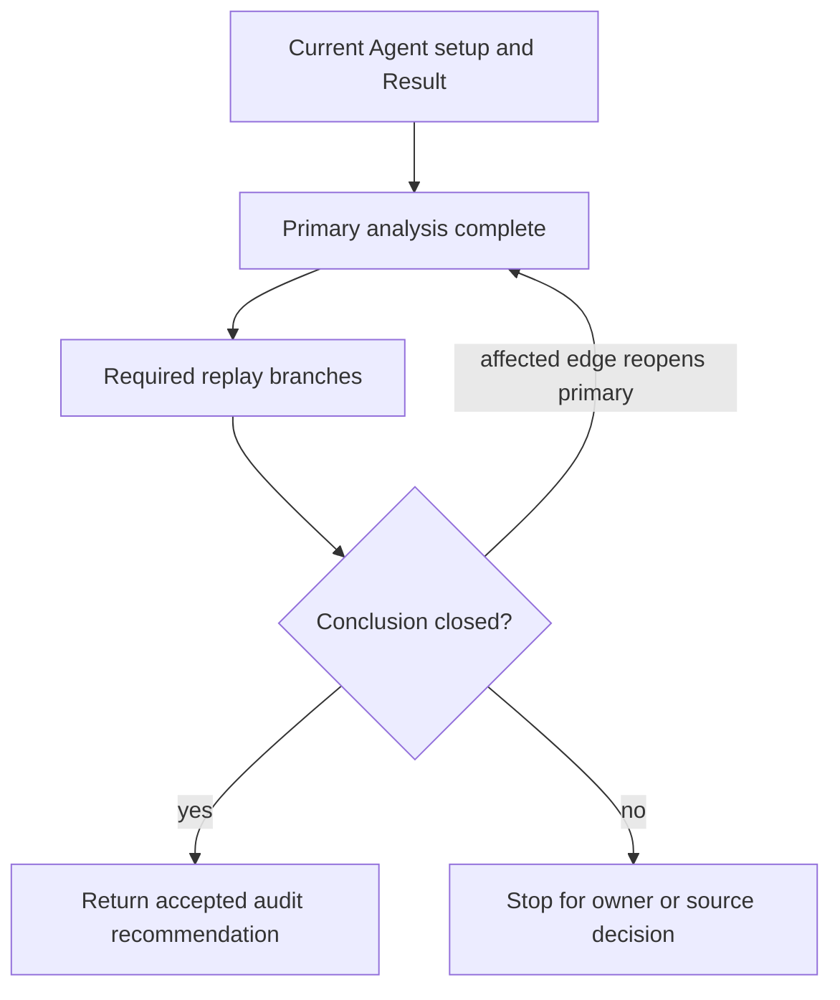

# Agent-Centered Candidate Audit Brief

**Status:** active controller brief

**Scope:** the 51 admitted Agents not including the completed Yidhari and Manato
correction

**Artifact boundary:** read-only audit sequencing, not product authority, an
Agent candidate answer catalogue, an active implementation plan, or evidence
that any current candidate or representative is correct

## Purpose

Audit every remaining through-2.8 Agent deeply enough to determine whether its
current W-Engine, Drive Disc, main-stat, substat, and prepared representative
choices remain competitive under the current permanent rules. The audit starts
from the current authored choices and bounded nearest competitors rather than
rebuilding a catalogue of every legal item.

The service goal governs every conclusion: preserve a small, deterministic set
of materially valuable setup directions that helps a user choose and understand
a complete setup. Legality, positivity, rarity, a different label, a large
clause count, or guide presence does not independently admit a candidate.

This brief owns no candidate conclusion. A settled local outcome belongs in the
applicable current Agent requirement and content. A shared rule change must
follow the permanent-authority change process before dependent work continues.

## Authority And Current Consumers

Apply the permanent owners before interpreting current content:

- read all five permanent Markdown authorities completely before U1; later
  units reopen every applicable owner rather than inheriting U1's conclusions;

- `SW-004`: candidate preparation dependency;
- `SW-005`: Agent-realized W-Engine package inspection and acquisition-role
  comparison;
- `SW-006`: complete Drive Disc package inspection;
- `SW-007`: finite effective-substat opportunity and selected pressure;
- `SW-008`: representative-relative competitive range and materially distinct
  setup directions;
- `SW-009`: deterministic zero-supplied-substat preparation;
- `SW-010`: one admitted W-Engine set before full/non-limited pool derivation;
- `SW-014`: fully enabled reachability, including repeatable routes and the
  distinct-category boundary;
- `SW-015`: Party Apply, target rebuild, direct edit, reconciliation, and
  incomplete-Result lifecycle;
- `FM-007`: exact formula-family stat and modifier consumption;
- `FM-008`: delivery applicability and modifier-scope composition;
- `GV-006`: holder, trigger, affected scope, recipient, and action remain
  separate relationships;
- `SF-001` through `SF-004`: minimum current-consumer source retention;
- `UI-001` and `UI-004`: source-owned complete Setup package and
  consumer-specific Result projection.

Reuse current implementation as secondary evidence through these sources:

| Meaning | Current source |
| --- | --- |
| identity, Specialty, Attribute, Focus eligibility | `src/workbench/content/agents.ts` |
| setup and Result formula participation | `src/workbench/content/setup-options.ts` |
| W-Engine facts, candidates, and pool derivation | `src/workbench/content/engines.ts` |
| Drive Disc candidates and contextual opportunities | `src/workbench/content/discs.ts` |
| deterministic prepared first choices | `src/workbench/content/representatives.ts` |
| contextual candidates and selected pressure | `src/workbench/candidate-context.ts`, `src/workbench/candidates.ts` |
| Apply, rebuild, edit, and reconciliation lifecycle | `src/workbench/state.ts` |
| retained Agent and equipment relationships | `src/workbench/content/agent-sources/` |

Existing requirements, accepted audit records, tests, arrays, representatives,
and guides are evidence to inspect. None validates its own semantic conclusion.

## Candidate Decision Boundary

The procedure below is a routing aid derived from the cited current permanent
owners. It adds no admission, compression, Attribute, or acquisition rule. If
this summary and a permanent owner diverge, the owner governs and this brief
must be corrected before another unit begins.

### Agent-centered audit procedure

For every Agent and every equipment or stat surface:

1. Reconstruct the Agent's current formula consumers, operating interval,
   actions or outcomes, fixed main-stat supply, and remaining finite substat
   opportunity.
2. Inspect the current candidate set and only the bounded omitted legal
   competitors needed to test its nearest same-direction and materially
   different directions.
3. Establish the strongest Agent-appropriate complete setup as the
   representative benchmark. The benchmark defines a material competitive
   range; it is not a rule that excludes every weaker option.
4. Keep the owner-required acquisition roles separate: the full-pool
   representative benchmark, the strongest standard S/A non-limited direction,
   other limited challengers when any exist, and any partial limited package
   whose realized value may compete with the non-limited route.
5. Treat every unusable clause as exactly zero. It is not a penalty, while
   activating more clauses is not an independent completeness bonus.
6. Use Base ATK only as a secondary discriminator when realized package values
   are otherwise close. Rank and a modest Base ATK difference do not decide
   admission.
7. Remove materially remote packages. Within the competitive range, compress
   the same practical setup direction by acquisition role and preserve close
   alternatives that materially change allocation, action coverage, operation,
   threshold, formula, or another finite investment direction.
8. Derive `full` from every admitted candidate and `non-limited` by removing
   limited S-Rank items only. Do not re-admit or independently author a second
   pool.

The acquisition roles in this procedure are the roles supplied by the permanent
owner. Do not invent a second standard-S/A role from craftability, event
distribution, common pairing, or another availability label. Accessibility may
distinguish a material user choice only through the owner's normal competitive
comparison; it does not preserve a same-direction standard-S/A package that a
stronger package in that role dominates. Do not use `signature`, release
association, or character association as a value term. Name the realized
package and the reason it wins the complete-setup comparison instead.

Apply the same user-centered principle to Drive Disc 4-piece, 2-piece, main
stat, and substat choices. Disc inspection compares a complete legal 4pc+2pc
and main/substat package. A positive stat is not automatically competitive when
fixed supply or another finite investment opportunity makes the direction
materially inferior.

### Pre-conclusion adversarial gates

Before classifying a candidate conclusion as keep, remove, add, unresolved, or
mismatch, run these gates in order on the ephemeral worksheet. They operationalize
the cited owners and do not add another admission rule or equipment catalogue.

1. **Owner and relationship-grammar closure.** Resolve every applicable owner
   default before interpreting a secondary requirement, guide, current
   structure, or external claim. Normalize each decision-relevant sentence into
   source or actor, trigger predicate, Boolean connector and quantifier, state
   transition, accumulation unit, cap or reset, affected scope, and recipient.
   Keep only edges the grammar or an applicable owner states. Co-occurrence does
   not create correspondence: a list of alternative predicates beside a count,
   cap, progression, or second list does not imply one slot per alternative,
   one-to-one mapping, uniqueness, or exhaustiveness. In particular,
   `SF-004`/`SW-014` treat repeatable alternative trigger routes as routes to the
   same cap unless exact game meaning requires distinct categories. A
   countermodel may deny an inferred edge; it may not introduce an unstated
   mapping or cardinality and then use that invention as a source gap.
2. **Complete source extraction.** Read the shared equipment fact and record the
   whole decision-relevant package at the applicable refinement or fully enabled
   maximum. Keep unconditional supply, activation, affected scope, holder,
   recipient, and action as separate relationships. Omitting an applicable
   clause or reading a base value where the current surface consumes a maximum
   is an incomplete audit, not evidence of an authority gap.
3. **Qualifying consequence.** Name the exact current consumer and state whether
   it proves eligibility, activation, applicability, candidate membership,
   preparation, or Result projection. Reachability and an existing consumer do
   not prove competitiveness. Current arrays, requirements, tests, and guides
   remain secondary even when they agree. A source discrepancy is a current
   product mismatch only when the trace identifies a reachable candidate,
   representative, selected-applicability, Setup, or Result consequence that
   actually changes.
4. **Bounded competitive value.** Before admitting, removing, selecting, or
   same-direction-compressing a choice, recompose both sides through the exact
   realized package, zero-supplied-substat setup, fixed Slot 4/5/6 supply,
   remaining finite main-stat and substat opportunity, representative-calibrated
   range, and applicable acquisition role. Record which setup input or future
   allocation changes and why the stronger package dominates or fails to
   dominate it. A shared broad label such as CRIT, ATK, damage, resource, or
   DEF-region is only an inspection route; it does not prove the same practical
   setup direction. Conversely, a different label or changed allocation is not
   automatic admission. A complete package, different trigger, positive clause,
   or different direction is likewise insufficient by itself. Do not require
   runtime action share, trigger frequency, uptime, or rotation to close
   direction-defining action or output coverage: `SW-004` assigns that boundary
   to bounded authored competitive-practice judgment. A prohibited runtime
   detail cannot become the missing edge that makes a candidate unresolved.
5. **External-conflict admissibility.** Separate a primary mechanics fact or
   exact source sentence from a guide's interpretation, ranking, silence, or
   calculation. Record both the page-update date and the actual build or
   calculation version when they differ. A guide interpretation locates a
   question but cannot override the source grammar or an applicable permanent
   owner default. An inaccessible official table, guide omission, stale
   comparison, or lack of duplicate external wording is not a positive conflict
   with a retained shared fact. Reopen a source edge only when credible positive
   evidence states an incompatible relationship and the qualifying-consequence
   gate shows which current candidate, representative, applicability, Setup, or
   Result would change.
6. **Pressure versus selected value.** Distinguish pressure that removes or
   changes a candidate-bearing input from a selected source relationship that
   still enters its formula consumer. Pressure does not turn a retained selected
   stat or modifier into zero unless the applicable permanent formula and exact
   current consumer do so. A clause is zero only because its own holder,
   activation, affected-scope, recipient, action, or formula relationship is
   unusable; zero remains neither a penalty nor an admission bonus.
7. **Countermodel and classification.** Construct one countermodel that preserves
   the normalized source grammar and every applicable owner rule while denying
   the proposed edge. Reject it immediately if it adds an unstated relationship,
   correspondence, or cardinality, or contradicts an owner-supplied default. If
   it survives, name the exact unresolved owner-eligible relationship. If
   rejecting it would require a runtime model, future consumer, guide-silence
   inference, or current-array agreement, the conclusion has not passed the
   preceding gates.

### Conclusion completion contract

A proposed keep, remove, add, same-direction compression, or representative
change is closed only when its ephemeral comparison records all of the
following:

1. the representative benchmark and the candidate's exact owner-defined
   acquisition role;
2. both realized packages, including usable clauses and zero-valued unusable
   clauses without a completeness bonus or penalty;
3. both zero-supplied-substat complete setups, including 4-piece, 2-piece,
   Slot 4/5/6, fixed supply, and remaining finite main-stat or substat
   opportunity;
4. the nearest same-role same-direction competitor and, for a limited
   challenger other than the representative, the strongest non-limited route
   required by `SW-005` and `SW-008`;
5. the exact setup allocation, action or operation coverage, threshold or cap,
   formula consumption, or other user-visible decision that changes between
   the two setups; and
6. the decisive dominance or competitive-range reason plus one contrary case
   that would reverse or deny the conclusion.

An isolated stat total, guide rank, different label, unique action clause, or
statement that an allocation changes cannot substitute for this comparison.
If any required side is absent, classify the edge as `unresolved`; do not infer
the missing side, preserve the current array by default, count agreement as
proof, or close the unit. This is a report-completeness gate, not a numeric
runtime cutoff, optimizer, persisted worksheet, or new candidate rule.

For every proposed addition, removal, unresolved edge, or product mismatch, the
report must preserve the compact output of these gates. An unchanged conclusion
may cite the same completed gate once when several local surfaces share that
exact proof; do not repeat it per item or Agent.

### Attribute as a conditional structural axis

Do not group Agents merely because they share an Attribute, and do not discard
Attribute because role or operation is similar. Use this audit question; it is
not a new permanent Attribute rule:

> Change exactly one Attribute locus: holder identity, effect/calculation,
> trigger or affected scope, or recipient. If that change alters candidate
> eligibility, clause usability, finite investment, provider delivery,
> prepared choice, or visible Result through an exact current consumer,
> Attribute is a material unit or replay edge. If none changes, it is contrast
> metadata rather than the unit's organizing principle.

Attribute is therefore material for holder and trigger gates, affected scopes,
Attribute DMG and buildup, RES relationships, same-Attribute qualification,
Slot 5 competition, and holder-derived recipient effects. It is not a shortcut
for role, formula family, operating interval, or party identity.

### Potential and external guidance

- Audit the current full Potential as the default setup. Inspect a lower
  Potential only when a current retained relationship, candidate, or prepared
  consequence actually changes there; do not author a candidate catalogue per
  Potential level.
- Prefer current official source facts for retained mechanics and compare two
  independent current build guides where credible sources exist.
- Record guide version, date, team, Potential, and accessibility assumptions.
  A republished or derivative guide is not independent.
- Use an older guide as an omission-risk signal, not final value proof. Do not
  fill a source gap with a low-confidence guide or controller intuition.
- External recommendations locate questions. The controller recomposes the
  complete package and finite investment before accepting a conclusion.

## Two-Layer Audit Shape

Each Agent belongs to exactly one primary unit. Cross-unit replays verify only
the named relationship and never silently reopen or inherit the other Agent's
candidate conclusion.

### Primary units

| Unit | Agents | Candidate decision surface | Attribute consequence |
| --- | --- | --- | --- |
| U1 Pilot | Cissia, Orphie | off-field Attack, ER/ATK Slot 6, action-local damage, party output, Bellicose/Cordis directions | Electric/Fire equipment clauses and Slot 5 remain exact contrasts |
| U2 | Anby: Soldier 0, Seed, Anton | CRIT Attack market, Basic/Aftershock/Shock, Cordis/Severed/Marcato directions | Electric equipment and Shock recipient relationships materially change outcomes |
| U3 | Evelyn, Soldier 11, Ellen | on-field CRIT, Heartstring/Severed/Cordis, Slot 4/5 allocation | Fire/Ice changes Disc and Slot 5 directions inside a shared investment market |
| U4 | Hugo, Zhu Yuan, Harumasa | Stun-window or burst damage, conditional action scope, CRIT stability | Attribute clauses stay local while burst operation organizes the unit |
| U5 | Corin, Nekomata, Billy, Ye Shunguang | Physical/Honed CRIT market, back/action conditions, Cloudcleave/Steel/Cordis | Physical and Honed-to-Physical mapping changes equipment and main-stat value |
| U6 | Yixuan, Banyue, Starlight Billy | Rupture/Sheer, HP/ATK opportunity, Rupture acquisition roles | inspect matching equipment/Result clauses, Slot 5, and provider/RES edges where currently consumed |
| U7 | Piper, Jane, Alice | Physical Anomaly, Assault/Disorder, AP/ATK/AM | Physical outcomes and Fanged/Stinger directions are material |
| U8 | Grace, Yanagi | Electric Anomaly, Timeweaver/Practiced/Fusion, Thunder/Chaos/Freedom | Electric and Shock/Polarity consumers directly shape candidates |
| U9 | Burnice, Vivian | off-field Anomaly secondary actions, Afterburn/Abloom, AP/ATK/AM/interval | Fire/Ether activation remains an exact package contrast |
| U10 | Aria, Promeia, Nangong Yu | on-field Abloom/AM investment, Phaethon/Freedom, AM-derived output | Ether/Ice and holder gates distinguish candidate and Result projection |
| U11 | Miyabi | general-damage-led Frost Anomaly, CRIT and AM opportunity | Frost-to-Ice mapping is a direct calculation and equipment boundary |
| U12 | Astra Yao, Soukaku, Lucy, Sunna | ATK-scaling providers, Support engines, Moonlight/Astral, ER/ATK | broad provider packages organize the unit; recipients are replayed separately |
| U13 | Yuzuha, Nicole, Rina | utility providers, buildup/DEF/PEN, Support engine and residual setup | recipient Attribute remains exact for delivered effects |
| U14 | Pan Yinhu, Ben, Caesar, Seth | Defense W-Engine market, DEF/ATK basis, shield and provider directions | basis and acquisition role organize the unit; Attribute clauses stay local |
| U15 | Zhao, Lucia | HP-basis providers, HP/ER opportunity, absent personal damage | Attribute participates only through a current consumed clause |
| U16 | Dialyn, Koleda, Anby, Pulchra | ordinary Stun market, Impact/ER, King/Astral/Shockstar | Attribute DMG and party qualification remain explicit contrasts |
| U17 | Trigger, Qingyi | target-side Stun/DEF delivery, CRIT/Impact, external Quick Assist | Electric recipient and RES/DEF relationships are material |
| U18 | Ju Fufu, Lycaon, Lighter | party stat/element providers, Initial Impact, thresholds, action-local scaling | Fire/Ice provider applicability changes Result delivery |

The roster contains 51 unique Agents. Yidhari and Manato are excluded only
because their current correction was completed immediately before this audit;
their accepted outcomes remain contrasts rather than proof for another Agent.
Every Attribute consequence in the table is a known routing edge to inspect,
not a claim that no other current Attribute consumer exists. Only the completed
unit may close that negative conclusion.

### Cross-unit dependency replays

| Replay | Relationship to verify | Closure effect |
| --- | --- | --- |
| D1 | Sunna to one general-damage and one anomaly recipient; Rina to Anton and an Electric anomaly recipient | candidate-bearing whenever formula/Attribute applicability changes realized provider or selected-equipment value, finite opportunity, membership, representative, or broad DEF pressure; prerequisite for U12/U13 where applicable |
| D2 | Cissia/Orphie/Pulchra off-field and action relationships; Burnice/Vivian Flamemaker and Angel interval contrasts | candidate-bearing equipment and pressure applicability |
| D3 | Vivian, Aria, Promeia, and Nangong Yu Abloom parent/action inheritance and recipient applicability | mechanism-only unless holder or package applicability changes |
| D4 | Dialyn received-Ultimate Puffer admission, repeated-Quick-Assist Astral admission, and Qingyi external-Quick-Assist admission as distinct opportunities | candidate-bearing contextual membership and preparation |
| D5 | Seed, Cissia, Alice, Sunna, Qingyi, Ye Shunguang, and currently selected equipment that emits broad pre-PEN through one shared classifier and lifecycle | candidate-bearing pressure and representative consequence |
| D6 | Trigger delivery and Ye Shunguang basis cap/Result replacement without duplicate Stun DMG composition | mechanism-only Result composition |
| D7 | King allocation among Stun holders and Moonlight/Astral allocation among Support holders through preparation and reconciliation | candidate-bearing allocation and preparation |
| D8 | Anton Shock-conditioned `general_damage` versus Grace/Yanagi anomaly formulas, plus Miyabi Frost buildup with `general_damage` | mechanism-only unless formula identity changes a setup candidate |
| D9 | Frost-to-Ice, Honed-to-Physical, Angel holder gates, Flight trigger versus affected scope, and Freedom Blues holder-derived Attribute | candidate-bearing equipment edges plus mechanism-only formula mappings |

A replay uses the nearest qualifying current consumer and one formula,
Attribute, action, or interval contrast that denies the invalid edge. For
selected equipment, inspect only a source currently selected by a prepared or
directly selectable qualifying Setup. Record the relationship edge and
contrast, then only `changed`, `unchanged`, and any reopened primary unit; do
not copy the primary unit's candidate inventory into a second record.

When a shared consumer changes, trace its affected current consumer paths and
reopen every primary unit whose realized package, candidate membership, or
prepared representative may change. Replay-only closure is allowed only when
that trace proves no candidate-bearing consequence.

## Per-Unit Audit Contract

For every Agent, use an ephemeral controller worksheet to inspect:

1. applicable owner Rule IDs before the conclusion;
2. retained Agent, equipment, action, formula, recipient, and interval facts;
3. exact current consumer and visible Setup/Result boundary;
4. current W-Engine candidates and representative, plus the minimum contrary
   omitted legal comparator only where the admission boundary is uncertain;
5. only the usable or unusable clauses capable of changing the decision, with
   unusable value treated as zero;
6. the full-pool representative benchmark, strongest standard S/A non-limited
   direction, other limited challengers when any exist, partial limited
   realized value versus the non-limited route, and same-direction compression;
7. complete 4pc+2pc, main-stat, and substat opportunity comparison;
8. full and non-limited representative consequence after one admitted set;
9. applicable party, Focus, pressure, allocation, direct-edit, rebuild, and
   incomplete-Result lifecycle;
10. nearest similar Agent and a contrast that denies an invalid inferred edge;
11. external-guide freshness and assumptions, including an explicit source gap
    when evidence is thin; and
12. the completed two-sided comparison required by the conclusion completion
    contract for every changed membership, compression, or representative
    conclusion; and
13. a Testing delta or a conclusion that existing shared coverage is
    sufficient.

Classify every audited conclusion as one of:

- current product mismatch;
- retained/shared structural risk without a current qualifying consumer;
- correct derived relationship;
- unsupported product claim;
- under-specified authority decision; or
- correct local outcome with duplicated or wrong-layer coverage.

The worksheet is disposable task context. Do not persist its candidate lists,
clause inventory, rejected comparators, guide metadata, or evidence graph in
this brief, another registry, tests, or a new per-Agent report archive. Persist
only an accepted local outcome in its existing owner and a compact unit status
needed to coordinate unfinished work. When a shared mechanism is already
established, cite that proof once and inspect only the Agent-specific delta;
do not repeat the same mechanism trace for every member of the unit.

Keep that compact status in the supervising task handoff, not a new repository
registry. It may contain only unit ID, audited base SHA, state (`primary analysis
complete`, `replay blocked`, `reopened`, or `closed`), required replay IDs,
blocker or reopened-unit IDs, accepting task/report reference, and acceptance
date. It contains no candidate, comparator, guide, or semantic evidence.

## U1 Pilot Contract

U1 is a controller-method pilot, not a semantic baseline for later units. It is
read-only until the supervising controller accepts its reasoning.

### Why U1

- Cissia and Orphie share an off-field Attack and ER/ATK investment problem
  despite different Attributes.
- Their overlapping Attack W-Engine market allows acquisition-role and
  same-direction comparison without relying on identical candidate arrays.
- Cissia's broad DEF relationship and Orphie's Aftershock action-local DEF
  relationship must produce different candidate-pressure consequences.
- Cissia's contextual Puffer/Astral opportunities and Orphie's authored
  Shadow/Astral choices exercise different admission and lifecycle paths.
- Electric and Fire clauses remain exact, proving that role-centered grouping
  does not erase Attribute.

### U1 required output

Return one compact report that includes, for both Agents:

- current candidate and representative inventory;
- keep, remove, add, and unresolved recommendations with complete package and
  finite-opportunity reasoning;
- full-pool representative benchmark, strongest standard S/A non-limited
  direction, other limited challengers when any exist, partial limited value
  versus that non-limited route, and the resulting two pool representatives;
- Disc 4pc/2pc, main-stat, and substat conclusions;
- Attribute counterfactuals and interval/action applicability;
- pressure present, absent, and reselected behavior where applicable;
- nearest similar and contrasting cases;
- external-source quality and any evidence gap;
- Testing delta; and
- provisional unit readiness.

Do not treat agreement with current arrays as success. The pilot passes only if
the derivation applies the same Agent-centered rule to both Agents, preserves
material Attribute consequences, rejects countermodels before inferring a
relationship, and stops rather than inventing a missing owner or source fact.
It must also prove that every retained choice is a materially distinct user
decision or an owner-preserved acquisition role, decide whether the nearest
same-direction competitor compresses away, and produce deterministic full and
non-limited representatives. Candidate count and removal count are never pass
targets. It also fails when it uses a qualifying consumer as competitiveness
proof, omits a decision-relevant source clause or fully enabled maximum, turns
candidate pressure into an unsupported zero selected value, or makes prohibited
runtime action share, uptime, or rotation a prerequisite for candidate closure.

### U1 evidence manifest

Before deriving a candidate conclusion, read the applicable permanent owners
and these bounded secondary sources completely:

- `docs/brainstorms/2026-08-09-seed-cissia-astra-vertical-requirements.md`;
- `docs/brainstorms/2026-08-10-dialyn-puffer-electro-contextual-candidate-requirements.md`;
- `docs/brainstorms/2026-08-13-disc-inspection-routing-requirements.md`;
- `docs/brainstorms/2026-08-14-orphie-pulchra-vertical-requirements.md`;
- `docs/brainstorms/2026-08-26-relationship-driven-broad-pre-pen-refactor-requirements.md`;
- `docs/solutions/workflow-issues/prevent-secondary-requirements-from-validating-themselves-2026-08-12.md`.

Inspect the Cissia and Orphie entries and current consumers in
`src/workbench/content/engines.ts`, `discs.ts`, `setup-options.ts`,
`representatives.ts`, and `agent-sources/attack.ts`; then trace
`activeContextualFourPieceCases`, `activeCandidatePressures`,
`effectiveFourPieceIds`, party and target preparation, zero initialization, and
reconciliation. This manifest bounds discovery; none of these secondary files
proves its own conclusion. Every later unit must define a similarly compact
manifest before dispatch rather than inheriting U1's sources by analogy.

### U1 required replay states

U1 completes its primary analysis first, then runs its applicable D2, D4, and
D5 branches before it may close. Inspect only the states each relationship can
actually change:

- D2: holder and interval applicability, plus selected Setup and Result
  projection for a qualifying and contrasting interval;
- D4: contextual source absent, present but unqualified, present and qualified,
  removed, and added again, including membership and prepared consequence; and
- D5: pressure absent, present but inapplicable, present and applicable,
  removed, and reselected, including invalid clearing without fallback or
  edit-history restoration.

Then run one composed D4+D5 flow through Party Apply, pool-only rebuild,
Mindscape-only rebuild, direct edit, zero-supplied-substat initialization,
reconciliation, and an incomplete required selection. Party Apply prepares all
three through whole-party allocation from authored and contextual choices.
Pool and Mindscape changes rebuild only the target from the other two current
established-holder selections. Mark a state not applicable only by naming the
exact relationship that makes it irrelevant, and preserve one contrasting
Agent unaffected by the source.

### U1 stop conditions

Stop and return the exact unresolved edge when any of the following appears:

- permanent authority cannot decide a required candidate or representative
  meaning;
- an external source conflicts with a retained shared fact and the
  pre-conclusion trace identifies a changed current candidate, representative,
  applicability, Setup, or Result consequence;
- the bounded nearest-comparator review cannot support admission or exclusion
  after complete source extraction and bounded competitive-practice judgment,
  without requiring a prohibited runtime model;
- a proposed result needs a new formula, recipient, interval, action, pressure,
  allocation, or lifecycle mechanism;
- a candidate correction expands to another primary unit before its dependency
  replay is defined; or
- the task would need a requirement, implementation, test, commit, or GitHub
  mutation not separately authorized.

## Execution Sequence

1. The dispatch supplies `audit_base_sha`, expected `origin/main`, required
   ancestry, branch identity, the bounded unit and replay scope, mutation
   boundary, required output, and the path or commit containing this brief. It
   points to the pre-conclusion gates instead of restating candidate policy or
   embedding expected named conclusions. The new isolated task verifies HEAD,
   origin/main, index, and worktree cleanliness and stops on any mismatch.
2. Run U1 from that verified checkpoint and return only the read-only report.
   U1 executes its scoped D2, D4, and D5 branches before closure.
3. The supervising controller reviews the derivation, countermodels, source
   quality, and candidate comparisons rather than merely comparing rosters.
4. If U1 passes, audit U2 through U5 to close the general-damage Attack markets.
5. Audit U6 through U11 to close Rupture, ordinary Anomaly, Abloom, and Miyabi.
6. Audit U12 through U18 to close Support, Defense, and Stun setup markets.
7. A unit is `primary analysis complete` until all candidate-bearing replay
   prerequisites have passed; only then is it `closed`. Run D1-D9 again at
   phase boundaries only when a shared source/consumer or directly dependent
   unit conclusion changed. Do not blanket-rerun unchanged replay families.
8. Perform one final cross-unit pass over equipment identities changed during
   the audit or referenced as a current candidate/representative by two or more
   settled units, plus any changed shared allocation consumer. Do not inspect
   every legal equipment identity, restart all Agent audits, or create a
   rejected-candidate registry.

One unit may expose several proposed local corrections, but requirement and
implementation work stays bounded by the repository's protected governance and
fresh exact-head approval gates. A unit report does not authorize mutation.

## Testing Delta And Documentation Boundary

An audit conclusion does not automatically add a test. Before proposing one,
record the new relationship, formula, lifecycle transition, or materially
distinct visible failure; the nearest existing shared test; what it cannot
prove; and whether an equivalent unnamed fixture preserves the assertion. Add
no test when shared coverage already proves the mechanism.

Do not add named candidate rosters, representative values, excluded-item
catalogues, or guide recommendations to tests. Persist a settled Agent-local
candidate or representative change only in the applicable current requirement
and content. Persist a reusable workflow learning in `docs/solutions/` only
when the completed audit demonstrates a general failure pattern beyond this
temporary unit roster.

## Completion

The audit is complete only when all 51 Agents have one accepted primary-unit
review with its candidate-bearing replay prerequisites closed, every applicable
D1-D9 consistency pass is closed, unresolved product decisions have either
completed the authority process or remain explicit blockers, and a final
cross-unit consistency pass finds no unreviewed consequence among the changed
or multiply referenced equipment and allocation consumers defined above.
