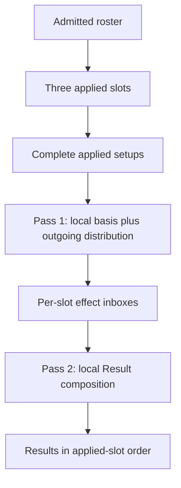

# Applied Party Calculation Boundary

## Summary

Separate the admitted Agent roster from the three-slot applied party, then calculate that party through one provider pass and one recipient composition pass. The current Yixuan, Dialyn, and Lucia experience remains visually and numerically unchanged while the calculation boundary becomes ready for later Agent admission and party editing.

---

## Problem Frame

The first vertical is complete, but several current structures treat its three Agents as both the complete roster and the active party. The same names determine setup ownership, completeness, slot order, focus, layout, and calculation order. This is harmless for one fixed trio but would make the next vertical implicitly join the active party or require another named calculation path.

The current calculations also know neighboring Agents directly even though the retained effects already have provider, recipient, timing, source, and action meaning. That makes valid cross-Agent behavior work today, but obscures the minimum semantic sequence and makes expansion depend on editing existing Agent-specific paths.

The prose requirements govern if this diagram and the text ever differ.

---

## Actors

- A1. Setup workbench user: adjusts one of the three current Agent setups and reads the resulting setup direction, values, breakdowns, action differences, and gauges.
- A2. Workbench calculation: prepares and validates the applied party, resolves retained effects, and projects only materially relevant effects into each Agent's Result.
- A3. Future content author: admits another researched Agent without redefining the current three-slot product or copying a vertical-specific calculation pipeline.

---

## Key Flows

- F1. Current party preparation and editing
  - **Trigger:** The workbench opens, or the user changes an applied Agent's Mindscape or availability pool.
  - **Actors:** A1, A2
  - **Steps:** The workbench owns one setup per applied slot; it explicitly prepares the affected setup according to the existing lifecycle; it leaves unaffected setups intact; it recalculates all Results after a completed change.
  - **Outcome:** The current trio preserves its prepared choices and visible behavior without hidden setups for non-applied roster Agents.
  - **Covered by:** R1, R2, R3, R4
- F2. Complete-party Result calculation
  - **Trigger:** All required selections are complete for the three applied slots.
  - **Actors:** A2
  - **Steps:** Each provider resolves its local Initial/basis values and outgoing retained effects; those effects are distributed by recipient; each recipient composes its Result from its local context and inbox; Results retain applied-slot order.
  - **Outcome:** Cross-Agent effects are independent of traversal order while current Result semantics remain unchanged.
  - **Covered by:** R5, R6, R7, R8, R9, R10
- F3. Later Agent admission
  - **Trigger:** A3 adds a researched Agent in a later vertical.
  - **Actors:** A2, A3
  - **Steps:** The Agent becomes available in the admitted roster; the existing applied trio does not change until party editing explicitly changes it; the new Agent uses the same slot and calculation boundaries when applied.
  - **Outcome:** Roster expansion does not silently become party expansion or require another named vertical pipeline.
  - **Covered by:** R1, R2, R11, R12

---

## Requirements

**Roster, party, and setup ownership**

- R1. The admitted Agent roster and the applied party must be distinct concepts. The applied party contains exactly three ordered slots; admitting content does not itself place that Agent in the party.
- R2. Each applied slot owns its current Agent and current setup. The workbench must not keep hidden prepared setup copies for roster Agents that are not applied.
- R3. Completeness must be evaluated only for the three applied setups. Result remains empty until every required selection in those setups is complete.
- R4. Preserve the current setup lifecycle: an applied-Agent, slot-order, or focus change will rebuild all three setups when party editing is later introduced; a Mindscape or availability-pool change rebuilds only the changed slot's Agent setup from the current pool, keeps the other two setups, and recalculates every Result.

**Slot and presentation context**

- R5. Result order, compact-slot order, keyboard order, expanded-slot selection, and focus must follow applied slot position rather than Agent identity. The viewed/expanded slot is independent from the focus slot: viewing Dialyn or Lucia does not move focus from the current first slot containing Yixuan.
- R6. The current Yixuan, Dialyn, and Lucia party, prepared setups, controls, layout, labels, values, sources, action outcomes, gauges, responsive behavior, and interaction behavior must remain unchanged. No party editor or new identity presentation is introduced in this work.

**Minimum calculation sequence**

- R7. Calculation must use two party-wide passes. Pass 1 visits every applied slot to resolve provider-local Initial/basis values and outgoing retained effects, distributing each effect immediately by its recipient policy. A recipient-basis percentage retains its source, recipient, and conversion relationship in this pass rather than pretending to be an absolute amount. Pass 2 visits every applied slot to resolve such relationships from the recipient's local basis and compose its final Initial, Combat, and Fully Enabled Result from local context plus its inbox.
- R8. Provider-local observation and outgoing-effect collection/distribution belong to the same first pass; they must not be split into separate party traversals without a current dependency that requires it.
- R9. Slot traversal order is deterministic output order only. No current Agent's calculated values may depend on whether its slot is visited before or after another slot within the same pass.
- R10. Preserve the current genuine dependency boundaries: Lucia's Initial MAX HP can determine Squad Sheer; Dialyn's Initial CRIT Rate can determine King of the Summit output; recipient surface HP or ATK can determine Rupture conversion; and Stun duration replacement remains explicit non-additive composition.

**Effect delivery and Result projection**

- R11. Each retained effect must keep its provider, source, recipient, value or conversion relationship, activation, and action scope/outcome meaning needed by the current consumer. Stat and modifier effects also keep their earliest surface. A retained operation keeps one scalar source-owned action or state outcome without a display surface. Recipient handling must cover only the currently required self, focus-Agent, all-party, other-party, and enemy-context distinctions.
- R12. Delivery and presentation are separate decisions. An effect is delivered according to its recipient, then each Agent-local Result projector consumes it only if it changes that Agent's current setup direction, formula, action difference, visible quantity, breakdown, or gauge.
- R13. An unconsumed or inactive effect must not create a zero row, generic explanation, evidence payload, or placeholder. Existing source disclosure and highlighting appear only with the Result behavior they explain.
- R14. Self effects use the same bounded delivery boundary as cross-Agent effects. No Agent calculator may read another Agent's setup merely to reconstruct an outgoing effect that the provider pass can resolve.
- R15. If later content introduces an outgoing effect whose value depends on any received effect, regardless of surface, implementation must stop and establish an explicit additional phase. This work must not prebuild iteration, fixed-point solving, or a dependency graph for that hypothetical case.

---

## Acceptance Examples

- AE1. **Covers R1, R2, R3, R6.** Given the current admitted roster and applied trio, when the workbench opens, exactly Yixuan, Dialyn, and Lucia own setups and appear in the same three slots; Result stays empty if any one applied setup is incomplete.
- AE2. **Covers R4, R6.** Given three completed setups, when Dialyn's Mindscape changes, Dialyn alone receives a newly prepared setup from the current pool, Yixuan and Lucia keep their setup selections, and all three Results recalculate.
- AE3. **Covers R4, R5, R6.** Given Yixuan is the first-slot focus, when the user expands Dialyn or Lucia, only the viewed slot changes; focus-recipient effects, prepared setups, and calculated focus remain Yixuan's.
- AE4. **Covers R7, R9, R10, R12.** Given Lucia provides MAX HP and Squad Sheer effects, when Results calculate, Yixuan's recipient surface HP includes the delivered HP before Rupture conversion and the current visible Yixuan values match the completed vertical regardless of slot traversal order.
- AE5. **Covers R7, R9, R10.** Given Dialyn uses King of the Summit and receives Lucia's later-surface CRIT Rate effect, when her outgoing King effect resolves, it uses Dialyn's own Initial CRIT Rate rather than a received Combat or Fully Enabled value.
- AE6. **Covers R11, R12, R13.** Given all Agents are M0, when no retained RES Ignore effect is active for a Result consumer, no RES Ignore row or source explanation appears; when Dialyn M1, Lucia M1, or Yixuan M2 supplies a retained applicable RES Ignore effect, only the affected Result/action surfaces disclose it.
- AE7. **Covers R10, R11, R14.** Given Yixuan M2 changes the applicable Stun duration outcome, when Dialyn's Result is composed, the existing replacement outcome and Yixuan source disclosure appear without Dialyn reading Yixuan's setup directly.
- AE8. **Covers R1, R5, R11.** Given a future admitted Agent that is not in the applied party, when current Results calculate, that Agent neither receives effects nor changes completeness, order, focus, setup state, or visible Results.
- AE9. **Covers R11, R12, R13, R14.** Given the current retained effects, when delivery runs, a focus-recipient effect reaches only Yixuan; an all-party effect includes its provider but creates rows only for relevant consumers; an other-party effect excludes its provider; an enemy-context effect appears only in the affected Result action or operation; and a self effect remains local.

---

## Success Criteria

- The completed first vertical is behaviorally and visually unchanged for users.
- Admitted roster membership, applied-slot membership, setup ownership, and presentation order no longer share one named-Agent constant or identity-dependent view state.
- Current outgoing effects resolve from provider-local setup and Initial/basis context, reach the intended current recipients, and are consumed only by relevant Agent-local Result projectors.
- The calculation has exactly the two passes required by current dependencies and no speculative solver or universal content model.
- Behavior-bearing unit and integration coverage can distinguish this boundary from the previous fixed-trio implementation without testing private structure for its own sake.

---

## Scope Boundaries

- No party editor, draft state, Agent picker, replacement flow, Cancel/Apply flow, or roster browsing UI.
- No new Agent, W-Engine, Drive Disc, Mindscape, or game-mechanics research or content.
- No universal Agent, setup, effect, recipient, formula, Result-row, or calculator registry beyond the smallest current consumer-owned structures.
- No vertical-specific replacement calculator and no preservation of named-Agent calculation order as a compatibility layer.
- No iterative solver, fixed-point calculation, general dependency graph, combat simulator, optimizer, rotation model, raw or final damage simulation, evidence system, or persistence.
- No identity-card/rank/portrait consolidation, Dialyn equipment-branch cleanup, broad file cleanup, unrelated test expansion, or UI stabilization/redesign.

---

## Key Decisions

- A vertical is a development and review batch, not a runtime product entity.
- The applied party is the runtime calculation boundary; the admitted roster is content availability.
- Two slot passes are the current minimum because outgoing effects need provider Initial/basis values, while some recipient formulas consume delivered effects.
- Effect delivery follows recipient meaning; Result projection follows the recipient Agent's current setup direction and visible consumer boundary.
- Current exceptional semantics remain explicit, especially Rupture conversion and Stun duration replacement, instead of being forced into generic additive rows.

---

## Dependencies / Assumptions

- The current applied party contains three distinct Agents, so current effect distribution can identify a provider and recipients unambiguously.
- No retained current outgoing effect depends on an effect received at Combat or Fully Enabled; current code and completed first-vertical behavior establish this boundary.
- Party editing remains the point at which users can replace an applied Agent and will be specified only after another vertical is admitted.

---

## Outstanding Questions

No product or planning blocker remains. A future received-effect-dependent provider is an explicit boundary trigger under R15, not an unresolved requirement for this implementation.
