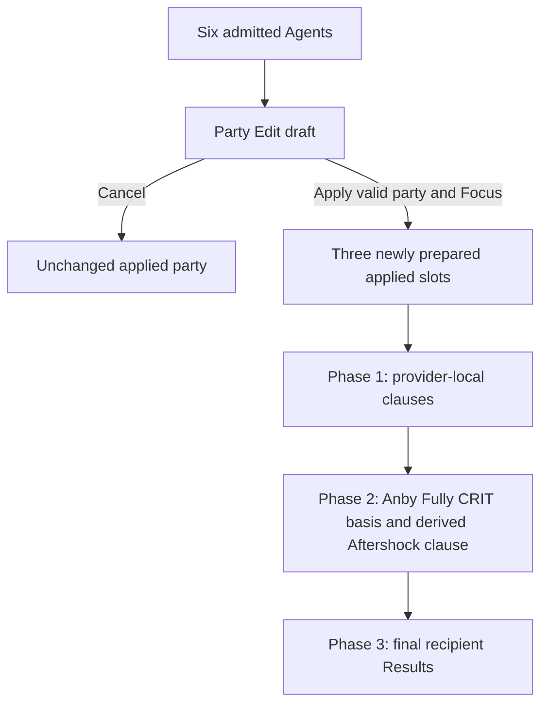

# Soldier 0 Second Vertical

## Summary

Admit Anby: Soldier 0, Trigger, and Astra Yao as the second complete setup-workbench vertical, with Anby as the authored Focus. Add the authority-defined Party Edit flow, derive current candidates from direction roles, formula participation, stat-supply opportunity, and active effect pressure, and use the smallest explicit three-phase calculation needed for Anby's received-CRIT-dependent Aftershock relationship. Preserve the completed Yixuan, Dialyn, and Lucia prepared baseline, Result semantics, and interaction grammar when it is reapplied; later-authorized competitive candidates may extend a local selector without changing that prepared baseline.

---

## Problem Frame

The workbench currently admits exactly the first applied trio. It has no way to compose a party from a larger admitted roster, and its two-pass calculation intentionally stops when an outgoing value depends on a received value. The approved second trio introduces both current consumers at once: Party Edit must distinguish six admitted Agents from three applied slots, while Anby's source-stated Aftershock effect must read her Fully Enabled CRIT DMG after Trigger and Astra have delivered their buffs.

The extension must remain a setup workbench. It may expose setting-relevant stats, formula regions, action differences, thresholds, caps, and source identities, but it must not become a damage simulator, rotation model, catalogue, runtime optimizer, evidence system, or universal effect engine.

The first contextual candidate pass treated prior Agent-indexed Slot 5
membership as a proxy for formula applicability. That reproduces Anby and
Dialyn pressure but cannot explain why Trigger should regain PEN Ratio without
broad pre-PEN pressure, why Yixuan never consumes it, or why a Stun direction
can invest CRIT Rate for King of the Summit without displacing unavailable
Impact or Daze substats.

The prose requirements govern if this diagram and the text ever differ.

---

## Actors

- A1. Setup workbench user: composes one valid three-Agent party, chooses Focus when required, adjusts its competitive setup inputs, and reads current Result values and differences.
- A2. Workbench session: owns the applied party, Party Edit draft, setup lifecycle, completeness, and synchronous Result recalculation.
- A3. Party calculation: resolves provider-local effects, the one approved received-dependent outgoing relationship, and final recipient projections without order dependence or feedback.
- A4. Content author: admits only researched competitive candidates and deterministic first choices without building a catalogue or optimizer.

---

## Key Flows

- F1. Second-vertical application
  - **Trigger:** The user opens Party Edit from the preserved first vertical.
  - **Actors:** A1, A2
  - **Steps:** The user targets draft slots, selects three distinct admitted Agents from the shared pool, resolves Focus, and applies Anby, Trigger, and Astra.
  - **Outcome:** All three slots receive complete authored setups, Anby is Focus, and complete Results appear immediately.
  - **Covered by:** R1-R12, R18-R25
- F2. Draft isolation and cancellation
  - **Trigger:** The user changes draft slots, filters, or Focus but does not apply.
  - **Actors:** A1, A2
  - **Steps:** Draft state changes independently while the applied party, Focus, setups, viewed slot, and Result remain current; Cancel discards the draft.
  - **Outcome:** No draft interaction changes applied behavior or loses setup work.
  - **Covered by:** R4-R10
- F3. Setup adjustment
  - **Trigger:** The user changes one applied Agent's Mindscape, pool, equipment, main stat, or effective substat count.
  - **Actors:** A1, A2
  - **Steps:** Mindscape or pool rebuilds only that Agent; direct setup edits preserve every unrelated selection; active effects and effective candidates are reevaluated for all three applied setups; all Results recalculate only when all required inputs are complete.
  - **Outcome:** The authored preparation lifecycle remains visible and deterministic while cross-Agent candidate invalidation never becomes cross-Agent preparation.
  - **Covered by:** R11-R25
- F4. Three-phase calculation
  - **Trigger:** Every applied setup is complete.
  - **Actors:** A3
  - **Steps:** Independent outgoing clauses are distributed; Anby's Fully Enabled CRIT DMG is composed from her local basis and delivered clauses; the derived 35% Aftershock clause is distributed; final Agent Results are projected.
  - **Outcome:** Anby and Trigger receive the correct Aftershock value independently of slot and provider traversal order, without iteration or feedback.
  - **Covered by:** R26-R38
- F5. First-vertical reapplication
  - **Trigger:** The user reapplies Yixuan, Dialyn, and Lucia.
  - **Actors:** A1, A2, A3
  - **Steps:** The applied party is prepared using the existing first choices and calculated through the extended boundary.
  - **Outcome:** Its complete setup, Result, source, interaction, and responsive behavior matches the preserved baseline.
  - **Covered by:** R26-R33, R44-R49

---

## Requirements

### Admitted roster, roles, and Focus

- R1. Admit exactly six current Agents: Yixuan, Dialyn, Lucia, Anby: Soldier 0, Trigger, and Astra Yao. Admission must not change the applied party until Party Edit is applied.
- R2. Retain Anby as an ordinary ATK-based general-damage contributor and the authored Focus for the selected second trio.
- R3. Retain Trigger as an off-field Daze contributor and buffer with a retained Aftershock tag consumer; retain Astra as a low-field party buffer. Trigger's Stun DMG Multiplier and party CRIT DMG are concrete buffer outputs rather than separate setup roles. Neither Agent is Focus-eligible for the current directions.
- R4. Focus eligibility is explicit authored content rather than inferred from Specialty. If a draft contains exactly one eligible Agent, select it automatically; if it contains more than one, require the user to choose; if it contains none, keep Apply unavailable.

### Party Edit and setup lifecycle

- R5. Party Edit creates a draft without changing the applied party, Focus, setups, underlying viewed/expanded slot state, derived Result, or source interaction state. While editing, the applied rail temporarily renders as three compact inactive cards and hides setup and Result; Cancel restores the preserved viewed slot presentation.
- R5a. Opening Party Edit initializes its three draft slots and Focus from the current applied party. The draft is never an empty initial composition after a party has already been applied.
- R6. Entering Party Edit shows three equal compact draft slots. Selecting a slot makes it the replacement target and reveals one shared admitted-Agent pool below the three slots.
- R7. Selecting an available candidate replaces only the targeted draft slot, closes the pool, and clears the target. Agents already occupying a draft slot remain visible in the pool but are unavailable and non-selectable.
- R8. The shared pool exposes one Attribute filter and one Specialty filter. Each starts at all candidates, admits one value, combines by intersection, and never admits content outside the six-Agent roster.
- R9. Cancel discards the draft and leaves applied state unchanged. Apply is available only for three distinct admitted Agents with resolved Focus.
- R9a. Each eligible draft slot exposes one explicit Focus choice. Replacing a draft Agent recomputes the eligible set: one eligible Agent is selected automatically; none remains unresolved; more than one becomes unresolved when the eligible set changed and requires an explicit choice. Apply is disabled unless the resolved draft party order or Focus differs from the applied context.
- R10. Applying a changed party or Focus commits both atomically and prepares all three slots. An unchanged Agent keeps its current Mindscape and pool before its setup is rebuilt for the new party context; a newly applied Agent starts at rank-default Mindscape and full pool. A departed Agent keeps no hidden setup.
- R11. Changing one applied Agent's Mindscape or pool rebuilds only that Agent's setup. Direct equipment, refinement, main-stat, and effective-substat edits preserve unrelated selections. Either transition reevaluates active effects and effective candidates across the applied party without rebuilding another Agent.
- R12. Result remains empty while any required selection in the applied party is incomplete. Draft incompleteness never empties the still-applied Result. When one transition invalidates multiple applied selections, repairing only a subset keeps Result empty.

### Candidate and prepared setup policy

- R13. Candidate arrays are competitive bounded choices, not catalogues. Full pool includes every admitted candidate; non-limited excludes limited S-Ranks while retaining admitted standard S-Ranks and A-Ranks. S-Ranks default to W1 and A-Ranks to W5.
- R14. Anby's full W-Engine candidates are Severed Innocence, Cordis Germina,
  Heartstring Nocturne, The Brimstone, and Marcato Desire; non-limited retains
  The Brimstone and Marcato. Full prepares Severed Innocence W1 and non-limited
  prepares Marcato Desire W5. Heartstring's mixed-CRIT package remains distinct
  at zero supplied substats even though its Fire RES Ignore is unusable by
  Electric Anby. The CRIT DMG enters Anby's existing received-dependent
  Aftershock basis; no Fire RES Ignore row is created. Brimstone displaces
  Starlight in the same non-limited broad-ATK role through its stronger usable
  package; neither changes Marcato's prepared priority.
- R15. Anby prepares Shadow Harmony 4-piece. Her retained 2-piece candidates are
  Woodpecker Electro, Branch & Blade Song, Puffer Electro, Thunder Metal, and
  Hormone Punk. Puffer preserves the DEF-region alternative while no material
  broad pre-PEN DEF Reduction or DEF Ignore pressures that finite choice; an
  admitted broad source removes it through the shared pressure lifecycle, while
  action-scoped Cordis DEF Ignore does not. Thunder Metal preserves the matching
  Electric DMG axis, while Hormone Punk is the authored ATK% identity because
  neither member of the Hormone Punk/Astral Voice pair has a 4-piece role for
  Anby. Slot 4 offers CRIT Rate and CRIT DMG;
  Slot 5 offers Electric DMG, ATK%, and PEN Ratio; Slot 6 offers ATK%; effective
  substats are CRIT Rate, CRIT DMG, and ATK%.
- R16. Anby's base prepared setup is Shadow Harmony plus Woodpecker in both
  pools. Full uses CRIT Rate / Electric DMG / ATK%; non-limited uses CRIT DMG /
  Electric DMG / ATK%. At M2+, when another applied Stun or Support Agent
  qualifies Anby's Additional Ability, authorized preparation changes only the
  2-piece to Branch & Blade; full keeps CRIT Rate Slot 4 and non-limited keeps
  CRIT DMG Slot 4. The qualification supplies 10% and M2 supplies 12% CRIT Rate,
  so this complete-package balance avoids wasting the bounded future CRIT Rate
  opportunity. M0 or an unqualified M2+ party keeps the base Woodpecker package.
  All effective-substat counts start at zero, and direct party/equipment edits
  do not dynamically reprepare the selection.
- R17. Dialyn retains Precious Fossilized Core W5 alongside Yesterday Calls and
  Hellfire Gears. Its advanced Impact and fully enabled thresholded Daze
  package are usable, while Dialyn's representative remains Yesterday
  Calls/full and Hellfire/non-limited with King plus Woodpecker, CRIT
  Rate/ATK%/Energy Regen. Steam Oven is excluded after the current
  Agent-centered comparison: at W5 its Energy-Regen/Impact package produces the
  same prepared inputs and practical resource direction as Hellfire W1, but
  supplies less Fully Enabled Impact. Its A-Rank accessibility does not create
  another acquisition role inside the shared standard-S/A comparison.
- R18. Trigger's full W-Engine candidates are Spectral Gaze, Blazing Laurel,
  Ice-Jade Teapot, The Restrained, Hellfire Gears, and Precious Fossilized
  Core; non-limited retains The Restrained, Hellfire, and Precious. Hellfire's
  broad Impact package and automatic off-field Energy
  remain competitive beside Restrained's aligned Basic/Aftershock direction;
  neither changes the authored Restrained non-limited first choice. Steam Oven
  is excluded after the current Agent-centered comparison: Trigger's off-field
  interval makes its Energy/Impact package reproduce Hellfire's selected
  automatic-Energy Result and prepared resource direction with less Fully
  Enabled Impact. Its A-Rank accessibility does not create another acquisition
  role inside the shared standard-S/A comparison.
  Blazing Laurel is a full-pool alternate rather than a new representative:
  Trigger can activate and consume its Impact package, and her Basic-category
  Aftershocks can establish the Fire/Ice squad CRIT DMG package. That recipient
  clause projects only to current Fire or Ice damage consumers. Spectral Gaze
  remains the general-damage representative and Ice-Jade Teapot remains the
  Sheer-focus adjustment because candidate admission does not imply prepared
  priority. Her retained 4-piece candidates are King of the Summit, Astral
  Voice, and Shockstar Disco. Her
  retained 2-piece candidates are Shockstar Disco, King of the Summit,
  Woodpecker Electro, and Swing Jazz, subject to the existing same-set
  piece-role conflict rule. Swing Jazz is the authored Energy Regen identity
  because neither Swing Jazz nor Moonlight Lullaby has a 4-piece role for
  Trigger; Moonlight's exact source fact remains retained without presenting a
  duplicate 2-piece decision. Slot 4 offers CRIT Rate; Slot 5 base candidates
  are Electric DMG, ATK%, and PEN Ratio; Slot 6 offers Impact. CRIT Rate is her
  only effective substat while her exact Additional Ability party condition is
  active or selected King pressure is present; Woodpecker follows the same
  current CRIT consumer. When both pressures are absent, those inputs leave the
  effective set and an edited substat count is cleared. Reselecting King
  reintroduces CRIT Rate at zero without restoring history.
- R19. Trigger's local representative full setup is Spectral Gaze W1 with King of the Summit 4-piece and Shockstar Disco 2-piece. Her local representative non-limited setup is The Restrained W1 with the same King/Shockstar package. Both retain CRIT Rate/Electric DMG/Impact as their prepared mains. Authorized preparation may replace only the representative W-Engine or complete Disc package through R23d-R23g; those adjustments do not change candidate membership.
- R20. Astra W-Engine candidates are Elegant Vanity, Bashful Demon, The Vault,
  and Kaboom the Cannon. Full prepares Elegant Vanity W1; non-limited prepares
  Kaboom the Cannon W5. Kaboom's four qualifying distinct-squad stacks are
  reachable with the ordinary Bangboo party member without exposing Bangboo as
  an independent workbench variable, so its complete Energy/party-ATK package
  is usable. Bashful remains a direct alternative, but its
  ATK-only supply does not replace Kaboom's zero-substat Energy/party-ATK
  balance. Astra's off-field Tremolo counts as repeated Ether EX Special use,
  so The Vault's short target-DMG and holder-Energy package is activatable and
  competitive as a distinct selectable route; its short window and lower
  cap-facing package do not replace either representative. Do not admit Weeping
  Cradle for Astra.
- R21. Astra's retained 4-piece candidates are Astral Voice and Moonlight
  Lullaby. Her ATK% 2-piece choice uses the authored Hormone Punk/Astral Voice
  relationship, and her Energy Regen choice uses the authored Swing
  Jazz/Moonlight Lullaby relationship. Selecting Astral Voice 4-piece exposes
  Hormone Punk and Moonlight Lullaby as the legal complements; selecting
  Moonlight Lullaby 4-piece exposes Astral Voice and Swing Jazz. The user never
  sees both members of one same-effect relationship at once, while the displayed
  exact identity keeps its artwork, source, and different-set legality. Slot 4
  and Slot 5 offer ATK%; Slot 6 offers ATK% and Energy Regen; effective substats
  are ATK% and flat ATK.
- R22. Astra's local representative full setup is Elegant Vanity W1, Astral Voice 4-piece + Moonlight Lullaby 2-piece; her non-limited setup is Kaboom W5 with the same Astral Voice 4-piece + Moonlight Lullaby 2-piece package. Full pool uses ATK% in Slots 4/5 and Energy Regen in Slot 6 at every Mindscape: after reserving eight ATK% and eight flat-ATK hits, the complete Elegant Vanity package reaches the M0-M1 Core cap without spending Slot 6 on the same axis. Non-limited M0-M1 keeps ATK% in Slot 6; the reserved substats and Kaboom package still reach the Core cap without Hormone Punk, so Moonlight spends the remaining 2-piece choice on Energy Regen. At M2-M6 the lower ATK need changes only Slot 6 to Energy Regen. All effective-substat counts still start at zero, so the visible prepared setups may begin below cap. An authorized holder-allocation adjustment may replace the complete Disc package as stated in R23f; when Moonlight becomes the 4-piece identity, both pools use Astral Voice 2-piece as the legal member of the authored ATK% pair.
- R23. Base candidate policy begins from the authored direction's roles, supported formula families and relationships, and the legal setup inputs that can supply their components. A selected candidate may then change the currently offered competitive main-stat or set pressure only where a researched current consumer requires it; it must not reset unrelated current selections or create runtime scoring. Candidate policy consumes provider-neutral effect/formula pressure rather than Agent, W-Engine, or Disc identity.
- R23a. Spectral Gaze's active broad enemy DEF Reduction supplies the current material pre-PEN pressure. It removes Slot 5 PEN Ratio from every admitted setup that offers PEN and whose primary or residual direction consumes the DEF region; Anby, Dialyn, and Trigger are the original representative acceptance party rather than a closed recipient list. Candidate pressure follows formula participation even when an Agent has no current Spectral or DEF Result projector. Cordis Germina's Basic/Ultimate-only DEF Ignore does not remove PEN Ratio by itself.
- R23b. Directly selecting a pressure-producing W-Engine changes that engine and its Rank-default refinement while preserving the provider's Discs, mains, and substats. One reconciliation clears every selected recipient main stat outside its effective candidates, chooses no fallback, and restores no history. Party/focus Apply may prepare all three later; Mindscape/pool may prepare only its changed Agent later.
- R23c. A direction without the damage-contributor role may retain competitive residual personal-damage choices only in a variable main-stat slot that cannot strengthen its daze-contributor or buffer roles or another retained relationship. The exception does not admit personal-damage W-Engines, 4-piece or 2-piece sets, effective substats, Mindscapes, or Result rows. King CRIT Rate supply is not residual personal damage: its Daze 2-piece effect, party CRIT threshold, Dialyn's CRIT-derived Daze relationship, and Trigger's party-qualified CRIT-derived Daze relationship strengthen retained roles directly.
- R23d. Authorized preparation resolves two semantic party directions before active selected-equipment pressure: the focused damage contributor's primary formula consumption, then non-stacking party-effect holder allocation. These decisions consume authored formula participation, competitive alternatives, candidate availability, and established holder state rather than named party combinations, Result values, runtime scores, or provider identity.
- R23e. For the current full-pool Trigger consumer, a Yixuan Focus makes `sheer_damage` the primary damage direction, so Spectral Gaze's DEF-region package is not usable by that output and Trigger prepares Ice-Jade Teapot instead. An Anby Focus keeps `general_damage`, so Trigger prepares Spectral Gaze. Trigger keeps King of the Summit in either case unless the separate holder-allocation rule applies. Non-limited Trigger keeps The Restrained because Ice-Jade Teapot is unavailable and no admitted non-limited candidate is authored as an equivalent party-direction replacement.
- R23f. Holder allocation prefers the less-flexible competitive holder without changing candidate membership. When Trigger and Dialyn are prepared together, Dialyn keeps her only retained 4-piece, King of the Summit, and Trigger prepares Astral Voice 4-piece + Shockstar Disco 2-piece. Exact Trigger Additional qualification governs her CRIT substat and Woodpecker pressure after King is removed; it does not rewrite this established non-overlap allocation. When Astra is prepared while another established party member already holds Astral Voice, Astra prepares Moonlight Lullaby 4-piece + Astral Voice 2-piece in either pool. An all-party preparation begins from all three local representatives and resolves the allocation without slot-order dependence.
- R23g. Party or Focus Apply performs the two preparation adjustments for all three Agents. A Mindscape or pool transition performs them only for the changed Agent and may read non-target equipment as already-established holder context; it never prepares another Agent. Direct equipment edits invoke neither adjustment and may temporarily create duplicate non-stacking holders or a non-representative allocation. Existing selected-equipment pressure and effective-candidate reconciliation run only after the authorized equipment preparation, remain one-pass, and may clear invalid downstream mains without selecting fallbacks.
- R24. Mindscapes apply cumulatively. Ordinary-skill level tiers are read only for Astra's retained Cadenza table: M0-M2 level 12, M3-M4 level 14, and M5-M6 level 16.
- R25. Prepared choices remain authored policy. Result values never feed back into automatic preparation.
- R25a. The numerical tables below are the complete bounded Agent fact contract
  for this vertical. Equipment and investment inputs enter by reference through
  the identities and local relationships admitted in R13-R22.

#### Admitted Agent identity facts

| Agent | Attribute | Specialty | Focus eligible | Retained setup role | Candidate-relevant formula or relationship |
|---|---|---|---|---|---|
| Yixuan | Auric Ink | Rupture | Yes | Sheer damage contributor | `sheer_damage`; Rupture current-ATK/current-Max-HP-to-Sheer conversion |
| Dialyn | Physical | Stun | No | Daze contributor and buffer | `daze_buildup`; Initial-CRIT-to-Impact; party modifiers; residual `general_damage` Slot 5 |
| Lucia | Ether | Support | No | Buffer | Initial-HP scaling and caps; automatic per-second Energy recovery; party modifiers |
| Anby: Soldier 0 | Electric | Attack | Yes | General-damage contributor | `general_damage`; retained Aftershock tag relationships |
| Trigger | Electric | Stun | No | Off-field Daze contributor, buffer, and retained Aftershock tag consumer | `daze_buildup`; CRIT-to-Aftershock-Daze; party modifiers; residual `general_damage` Slot 5 |
| Astra Yao | Ether | Support | No | Low-field buffer | Initial-ATK scaling and cap; event-conditioned Energy passive; party modifiers |

Party Edit Attribute/Specialty filters and the party predicates in R40 consume
the explicit identity fields. Focus eligibility remains independently authored
and is not inferred from Specialty. The final column is one candidate-policy
input rather than a complete ranking rule. It does not add an unsupported
personal-damage Result or make formula family, role, Specialty, and source
relationship one hierarchy.

#### Retained completed Agent inputs

| Agent | Current consumed inputs |
|---|---|
| Anby: Soldier 0 | Agent ATK 929; CRIT Rate 19.4%; CRIT DMG 50% |
| Trigger | CRIT Rate 5%; CRIT DMG 50%; Impact 131 |
| Astra Yao | Agent ATK 715; Energy Regen 1.56/s |

`Agent ATK` is the completed Agent-side value before selected W-Engine Base ATK, percentage ATK, and fixed Slot 2 ATK enter the existing ATK composition.

#### Anby retained sources

| Source identity | Exact retained value | Earliest surface | Recipient / action scope |
|---|---|---|---|
| Core Passive | personal DMG +25% against Silver Star | Fully Enabled | Anby, applicable general damage |
| Additional Ability | allied Aftershock DMG +50% against Silver Star at completed Potential when Anby is Focus/on-field and the Stun/Support predicate holds | Fully Enabled | current Anby/Trigger `AFTERSHOCK` outcomes |
| Core Passive | additional Aftershock CRIT DMG = 35% of Anby's current Fully Enabled CRIT DMG at completed Potential | Fully Enabled after Phase 2 | enemy/action clause for current Anby/Trigger `AFTERSHOCK` outcomes |
| Additional Ability | CRIT Rate +10% when another Stun or Support Agent is applied | Fully Enabled | Anby |
| Mindscape · M2 | CRIT Rate +12% | Combat | Anby |
| Mindscape · M4 | Electric RES Ignore +12% against Silver Star | Fully Enabled | Anby Electric general damage |

Selected Severed, Cordis, Marcato, and Starlight facts supply Anby's admitted
CRIT/ATK packages; Cordis's Basic/Ultimate DEF Ignore and Severed's Aftershock
package reach their narrower current consumers.

#### Trigger retained sources

| Source identity | Exact retained value | Earliest surface | Recipient / action scope |
|---|---|---|---|
| Core Passive | target Stun DMG Multiplier +35 percentage points; +55 at Trigger M1 | Fully Enabled | enemy context for applicable party damage |
| Additional Ability | each Fully CRIT point above 40 grants Aftershock Daze +1.5%, capped at +75% when Fully CRIT reaches 90 | Fully Enabled / Phase 3 | Trigger Aftershock Daze gauge |
| Mindscape · M2 | party CRIT DMG +6% per stack, 4 stacks, maximum +24% | Fully Enabled | all current applicable damage contributors |

Selected Spectral, Blazing, Ice-Jade, Restrained, Precious, and Steam facts
supply Trigger's admitted CRIT, Impact, Daze, Energy, and applicable party
packages; Blazing's Fire-only portion remains recipient-conditional.

#### Astra retained sources

| Source identity | Exact retained value | Earliest surface | Recipient / action scope |
|---|---|---|---|
| Core Passive | flat ATK = `min(35% of Astra Initial ATK, 1,200)` at M0-M1 | Fully Enabled | each compatible Quick Assist entrant; repeated assists within the retained duration can keep multiple current party recipients enabled together |
| Core Passive · M2 | flat ATK = `min(54% of Astra Initial ATK, 1,600)` | Fully Enabled | same recipients |
| Special Attack | Idyllic Cadenza · level 12: party DMG +20%; CRIT DMG +25% | Fully Enabled | all party members, including Astra; only current applicable damage consumers project a row at M0-M2 |
| Special Attack | Idyllic Cadenza · level 14: party DMG +22%; CRIT DMG +28% | Fully Enabled | all party members, including Astra; only current applicable damage consumers project a row at M3-M4 |
| Special Attack | Idyllic Cadenza · level 16: party DMG +24%; CRIT DMG +31% | Fully Enabled | all party members, including Astra; only current applicable damage consumers project a row at M5-M6 |
| Mindscape · M1 | all-attribute RES Reduction +6% per stack, 3 stacks, total +18% | Fully Enabled | enemy context for applicable party damage |
| Mindscape · M4 | next Quick Assist Daze +50%, represented as a 1.5 source-stated action scale | Fully Enabled | applied Stun recipient; Trigger in the selected trio |

Selected Elegant, Bashful, and Kaboom facts supply Astra's party-facing
packages; Elegant's event-Energy clause remains Setup-only rather than becoming
a Result operation.

#### Retained Drive Disc relationships

Shadow supplies the operation-fitting Aftershock/Dash package; Shockstar and
King supply distinct Daze/recipient directions; Astral and Moonlight supply
non-stacking party packages; Hormone, Woodpecker, and Branch preserve the
independent ATK/CRIT directions needed by the authored candidates.

#### Retained main-stat and effective-substat relationships

The candidate rosters and representatives in R15-R22 consume the shared fixed
main-stat and per-hit substat facts. This requirement does not duplicate those
values; every prepared effective-substat count starts at zero while preserving
the authored finite future opportunity.

#### Bounded action groups

| Action group | Displayed actions | Retained clauses |
|---|---|---|
| Anby Aftershock | `AFTERSHOCK` tag outcome | Anby allied-Aftershock and current-CRIT-DMG relationships; Shadow Harmony and applicable current general regions |
| Anby Dash | Dash Attack | Shadow Harmony and applicable current general regions; no Anby Aftershock-only clause |
| Anby Basic/Ultimate | Basic Attack; Ultimate | Cordis Germina DEF Ignore |
| Trigger Aftershock | `AFTERSHOCK` tag outcome | Anby allied-Aftershock and current-CRIT-DMG relationships; regular Daze, Basic-scoped Daze, and Trigger CRIT-to-Daze relationship |
| Trigger Basic category | internal Basic Attack scope within the `AFTERSHOCK` aggregate | The Restrained and Shockstar Disco Basic Attack Daze; neither retains a personal Trigger DMG Result |
| Trigger Quick Assist | Quick Assist | Astra M4 next-Quick-Assist Daze scale at Astra M4+ |

Every Anby-derived Aftershock clause additionally requires Anby to be applied and the target's reachable Silver Star state. Result displays Aftershock as a tag-scoped aggregate, not an action-membership catalogue. Canonical actions appear only when they additionally differ from that aggregate.

### Bounded three-phase calculation

- R26. Phase 1 resolves each applied provider's local observations and distributes every retained outgoing clause whose value is independent of received effects. Existing recipient distinctions remain self, Focus, all-party, other-party, and enemy context.
- R27. Phase 2 has exactly one current basis consumer: Anby's Fully Enabled CRIT DMG after Phase-1 delivery. It resolves only the value needed for her source-stated Aftershock relationship.
- R28. Phase 2 derives and distributes Anby's enemy/action clause equal to 35% of that current Fully Enabled CRIT DMG. It applies to compatible Anby and Trigger Aftershock-tagged damage against Silver Star targets and projects through their `AFTERSHOCK` outcomes.
- R29. Phase 3 projects final recipient Results from local context plus the complete delivered clauses. Preserve the public PartyResult, AgentResult, and ResultPanel consumer shapes unless a present visible behavior proves a minimal compatible field addition necessary.
- R30. The sequence is acyclic and order-independent. The Phase-2 derived clause does not change CRIT DMG, does not feed its own basis, and cannot schedule another derived phase.
- R31. Do not add iteration, fixed-point solving, a dependency graph, formula registry, universal snapshot, general condition language, generic recomputation hook, or universal Agent/effect/Result schema.
- R32. Reordering applied slots or provider traversal may change PartyResult output order only. It may not change any per-Agent value, source identity, action result, operation, or gauge.
- R33. Existing first-vertical Initial-derived provider outputs remain provider-local: Lucia's Initial HP/Squad Sheer and Dialyn's Initial CRIT/King relationships must not read received later-surface values.

### Exact retained Agent behavior

- R34. Anby exposes ATK, CRIT Rate, CRIT DMG, applicable regular and action-scoped DMG Bonus, PEN Ratio, DEF Ignore, RES Ignore, RES Reduction, DEF Reduction, and Stun DMG Multiplier only when each has a current applicable contribution. Her Core contributes +25% personal general DMG against reachable Silver Star and the completed-Potential 35%-of-current-CRIT-DMG Aftershock relation. Her Additional Ability contributes +10% CRIT Rate with a Stun or Support teammate and completed-Potential +50% allied Aftershock DMG only when Anby is Focus/on-field. Shadow Harmony applies its source-owned contribution to both retained `AFTERSHOCK` tag outcomes and a distinct Dash Attack outcome; the Dash outcome excludes the Aftershock-only Core-derived and Additional clauses.
- R35. Anby M2 adds 12% CRIT Rate and M4 adds 12% Electric RES Ignore against Silver Star. M1, M3, M5, and M6 add no current supported Result difference.
- R36. Trigger ordinarily exposes CRIT Rate, Impact, Daze Bonus, and Stun DMG Multiplier, plus separate current operations. ATK, Energy Regen, generic CRIT DMG, generic DMG Bonus, and generic DEF/RES rows are omitted even when a party clause is delivered. Her Core contributes +35 Stun DMG Multiplier, becoming +55 at M1. While another applied Agent is Attack or shares Trigger's Electric attribute, her Additional Ability links Fully Enabled CRIT Rate above 40% to Aftershock Daze at 1.5% per CRIT point, capped at +75% when CRIT reaches 90%, and appears as a threshold/cap gauge on CRIT Rate. Without that exact qualification the gauge and its action contribution are absent. When Anby's completed Core Passive delivers its 35%-of-Anby's-Fully-CRIT-DMG Aftershock clause, Trigger additionally admits a CRIT DMG Result region with an `AFTERSHOCK` tag outcome; common delivered CRIT DMG remains in the parent value while the Anby amount is tag-scoped and cannot feed Phase 2. Anby's Focus does not gate that Core relation. Anby Focus may similarly admit a DMG Bonus tag outcome through her +50% Aftershock clause. M2 contributes up to 24% party CRIT DMG. M3-M6 add no other current supported Result difference.
- R36a. Trigger's CRIT-to-Aftershock-Daze gauge is a Phase-3 recipient projection. It reads her completed delivered Fully Enabled CRIT Rate, emits no outgoing clause, cannot schedule another derivation phase, appears on that CRIT Rate basis, and is included by its exact source in the `AFTERSHOCK` Daze aggregate beside regular Daze and Basic-scoped Daze.
- R37. Astra exposes Initial ATK and Energy Regen as her retained local Result. Her Core supplies `min(35% of Initial ATK, 1,200)` at M0-M1 and `min(54% of Initial ATK, 1,600)` at M2-M6. Cadenza supplies party DMG Bonus / CRIT DMG of 20% / 25% at M0-M2, 22% / 28% at M3-M4, and 24% / 31% at M5-M6. M1 supplies 18% all-attribute RES Reduction.
- R38. Astra M4 supplies each currently applied Stun recipient one source-stated next-Quick-Assist Daze operation of +50% (equivalently a 1.5 scale for that action). This is Trigger in the selected trio and may be Dialyn in an admitted mixed party. It remains separate from regular Daze Bonus and does not create raw/final Daze calculation. Elegant Vanity's event-Energy clause remains compressed Setup content because the whole package affects candidate and representative authoring; it does not project as a Result operation or alter an Energy Regen row. Its routine trigger and cooldown are not Setup content.

### Cross-Agent applicability and formula regions

- R39. The selected Astral Voice fact owns its shared stack, duration, and entrant-DMG semantics. Under the permanent controllable-single-recipient compression, any selected Astral Voice holder with a reachable Quick Assist route projects the source-owned reachable maximum exactly once to the applied Focus when that Focus is legally eligible and has a retained compatible damage consumer. The holder may itself be Focus; Astra identity, provider identity, and holder identity are not predicates. Trigger's off-field direction does not gain a generic personal DMG Result from this rule. Removing every selected Astral Voice holder removes the contribution, while duplicate holders remain subject to the existing non-stacking rule. Candidate membership and holder allocation remain separate upstream decisions.
- R40. Anby's Additional Ability grants its +10% CRIT Rate when either a Stun or Support teammate is present. Its completed-Potential +50% allied Aftershock branch additionally requires Anby as applied Focus/on-field. Trigger's Additional Ability is active when another applied Agent has Attack Specialty or shares her Electric attribute; the predicate consumes typed party identity rather than a named-Agent list. Party Edit must reevaluate these predicates after Apply; roster admission alone changes nothing.
- R41. Preserve DEF Reduction, DEF Ignore, RES Reduction, RES Ignore, PEN Ratio,
  and Stun DMG Multiplier as distinct current Result regions according to each
  applicable damage formula. Do not collapse them into one resistance or bypass
  row and do not calculate final damage.
- R42. Spectral Gaze's Electric Aftershock trigger establishes a Fully Enabled enemy DEF Reduction rather than a modifier restricted to Trigger's triggering hit. It projects to each applicable Result consumer whose formula consumes the DEF region, including `general_damage` and `anomaly_damage`, with Spectral Gaze as its source; an Agent without a current DEF Reduction projector gains no invented row. Yixuan's Sheer damage omits the DEF multiplier and therefore has no Spectral projection. Cordis Germina supplies Basic/Ultimate DEF Ignore; Astra M1 supplies all-attribute RES Reduction; Anby M4 supplies Electric RES Ignore; selected Slot 5 supplies PEN Ratio. Each appears only for applicable current Agents/actions and with its actual source identity.
- R43. Delivery is broader than projection: a provider may apply a clause to every source-stated recipient, while only a current Result consumer projects it. Astra's Core targets one Quick Assist entrant per trigger, but its retained duration and repeated trigger route allow multiple compatible party recipients to remain enabled in the same current Fully Enabled window. It therefore distributes to all applicable current party recipients rather than using controllable-single-recipient Focus compression; this distinction matters for parties with two damage contributors. Its gauge remains on Astra as the holder-local Initial-ATK basis and output. Cadenza applies to Astra as an all-party member, but Astra's buffer-only projector omits personal damage and CRIT rows. Trigger's off-field Daze/Stun direction likewise omits generic personal damage and DEF/RES rows. Yixuan and Anby consume applicable general-damage clauses, while Trigger retains only the bounded `AFTERSHOCK` tag outcomes stated above; Dialyn and Lucia receive no new ATK/damage row solely because Astra is present when their preserved projectors have no current consumer.

#### Current six-Agent mixed-party applicability

| Retained source | Current delivered/projected recipients | Current non-recipients or omissions |
|---|---|---|
| Astra Core flat ATK | Every compatible current party recipient that can enter through repeated Quick Assists within the retained Fully Enabled window | No Focus-only compression; recipients without a current ATK projector gain no invented row |
| Cadenza DMG/CRIT DMG; Elegant DMG; Bashful/Kaboom ATK; Astra M1 RES Reduction | Every source-stated party or enemy recipient with an applicable current consumer; Cadenza includes Astra as an actual recipient even though her current buffer projector has no personal damage/CRIT row; Anby-Core-conditioned Trigger CRIT outcome may retain delivered common CRIT in its parent | Trigger adds no generic ATK/DMG/RES row; Dialyn/Lucia add no unsupported ATK or damage row |
| Astral Voice entrant DMG | The applied legally eligible Focus, exactly once, when any selected holder supplies the reachable Quick Assist effect | Non-Focus members do not receive this controllable single-recipient projection merely because they can enter; directions without a retained damage consumer gain no row |
| Astra M4 next-Quick-Assist Daze scale | Each applied Stun recipient among Dialyn and Trigger | All non-Stun Agents |
| Trigger Core Stun DMG Multiplier and M2 CRIT DMG | Each applied current damage/action consumer among Yixuan, Anby, and Trigger | Trigger's buffer clauses do not create personal rows on Astra, Dialyn, or Lucia |
| Anby allied Aftershock DMG and received-dependent derived relation | Anby and Trigger while each has compatible Aftershock-tagged damage and Silver Star is reachable | Yixuan, Dialyn, Lucia, and Astra have no retained compatible Aftershock-tagged damage consumer |
| Spectral Gaze DEF Reduction | Every applicable DEF-region damage recipient with a current DEF Reduction projector | Yixuan's Sheer damage omits DEF; recipients without a current projector gain no invented row |

These are consumer mappings for the current six-Agent product, not a universal eligibility system.

#### Current candidate-pressure applicability

| Active pressure | Effective-candidate recipients | Boundary |
|---|---|---|
| No material broad pre-PEN pressure | Anby, Dialyn, and Trigger Slot 5 retain PEN Ratio among their base candidates | Anby uses primary `general_damage`; Dialyn and Trigger use competitive residual `general_damage` without gaining a damage-contributor role or personal-damage Result |
| Material broad pre-PEN DEF bypass supplied by Spectral Gaze | Every setup with an admitted PEN input and primary or residual DEF-region damage participation removes that input | Candidate applicability follows each direction's DEF-region formula participation and remains separate from whether the recipient has a current DEF Reduction projector |
| Cordis Germina Basic/Ultimate DEF Ignore without another material broad pressure | Anby, Dialyn, and Trigger Slot 5 keep PEN Ratio | Limited action scope may change a future prepared preference but does not remove the candidate by itself |
| Any current pre-PEN pressure applied beside Yixuan | Yixuan never gains Slot 5 PEN Ratio | `sheer_damage` omits the DEF region, so effect pressure cannot admit an otherwise invalid candidate |

The session evaluates this table from active effect meaning, not source-name
branches in candidate policy. Provider order does not change the outcome.

### Presentation and preserved baseline

- R44. Preserve the current applied-party rail, expanded-slot workbench, setup control grammar, Result table, source disclosure/highlighting, keyboard navigation, responsive behavior, and first-vertical copy. Party Edit is a bounded functional addition, not a redesign.
- R45. Party Edit must visibly distinguish draft slots, current replacement target, available versus occupied candidates, filter state, automatic versus unresolved Focus, Cancel, and Apply. Every control has a visible keyboard focus state and accessible name.
- R45a. Keyboard focus moves to the first draft slot when editing opens; opening a replacement target moves focus to the first available filtered candidate; selecting a candidate returns focus to the replaced draft slot; Cancel and successful Apply return focus to the Edit party trigger. If filtering leaves no available candidate, focus remains on the active filter or replacement target rather than moving to a missing element.
- R45b. Party Edit uses semantic buttons, native selection controls, fieldsets, and radio/pressed states rather than custom keyboard-only containers. Enter/Space activates draft slots, candidates, Focus, Cancel, and Apply; native filter traversal remains available; occupied candidates expose disabled/unavailable state programmatically; automatic and unresolved Focus plus candidate count/no-results state are announced to assistive technology.
- R45c. At narrow widths the editor reading order is: three single-column draft slots, Focus choices/status, Attribute and Specialty filters, shared candidate pool, then Cancel/Apply actions. The applied-party heading, rail, Setup, and Result remain clearly identified below the editor. Every editor control remains available without horizontal scrolling.
- R46. Keep Initial, Combat, and Fully Enabled surfaces. New actions or stacks enter Fully Enabled; source-stated action DMG/Daze multiplier operations remain separate from regular DMG Bonus/Daze Bonus.
- R47. Conditional rows, actions, retained action/state operations, and source disclosures are absent when no active current contribution or retained relationship changes the inspected Result. A currently applicable threshold/cap relationship keeps its gauge even when the current linked output is zero, so the user can see the setup pressure and boundary. Do not add zero placeholder rows or narrative rationale.
- R48. The masthead and current party status derive from the applied party rather than a named first-vertical constant, without turning the UI into runtime vertical selection.
- R49. Reapplying Yixuan, Dialyn, and Lucia restores their exact current prepared choices and leaves existing numeric Results, source order, action differences, operations, gauges, keyboard behavior, and responsive geometry unchanged. Lucia's later-authorized Swing Jazz 2-piece is an additional local selector candidate: selecting it changes only Lucia's 2-piece choice and the resulting HP/Energy relationships, while re-preparation restores Moonlight Lullaby 4-piece + Yunkui Tales 2-piece.
- R49a. Lucia's full W-Engine candidates are Dreamlit Hearth, Weeping Cradle,
  Kaboom the Cannon, and Unfettered Game Ball; non-limited retains Weeping,
  Kaboom, and Unfettered. Full prepares Dreamlit W1 and non-limited prepares
  Weeping W1. Dreamlit's HP, automatic Energy, squad HP, and squad-DMG package
  advances Lucia's Initial-HP buffer direction most completely. Weeping keeps a
  competitive automatic-Energy and squad-DMG route despite unused PEN Ratio;
  Kaboom supplies a separate Energy-Regen and squad-ATK package; Unfettered
  supplies the same resource stat with a distinct conditionally applicable
  squad-CRIT direction. Thoughtbop is excluded holder-locally: its squad DMG
  and ATK passive requires the holder's EX Special to deal Physical DMG, while
  Lucia's EX is Ether, leaving only the same Energy axis already served by the
  usable Weeping package. The Vault is legally activatable but its two-second
  same-axis target window does not remain competitive with Lucia's reliable
  Weeping delivery. These whole-package judgments do not alter either prepared
  representative or create runtime scoring.

---

## Acceptance Examples

- AE1. **Covers R5-R10.** Given the first vertical is applied, when the user drafts Anby/Trigger/Astra and then cancels, the first party, Focus, all three setup objects and selections, viewed slot, and Results are unchanged.
- AE2. **Covers R6-R9.** Given Party Edit targets slot 2, occupied draft Agents remain disabled in the shared pool; Attribute and Specialty filters intersect; selecting Trigger replaces only draft slot 2 and closes the pool.
- AE3. **Covers R4, R5a, R9-R10.** Given Party Edit opens, its initial draft matches the applied party and Focus and Apply is disabled. Given the draft becomes Anby/Trigger/Astra, Anby is selected automatically as the sole Focus and Apply prepares all three complete setups. Given a replacement creates a draft with Anby and Yixuan, the changed eligible set clears automatic Focus and Apply remains unavailable until the user activates one slot's Focus choice.
- AE4. **Covers R10-R12.** Given an unchanged applied Agent has a non-default Mindscape and pool, applying a changed party preserves those two inputs for that Agent but rebuilds all three equipment/main/stat preparations; a newly applied Agent starts at M0/full.
- AE5. **Covers R14-R22.** Given the second trio at M0/full, preparation selects Severed Innocence, Spectral Gaze, and Elegant Vanity with the authored sets/mains and zero substats; full-pool Astra uses Astral Voice 4-piece + Moonlight Lullaby 2-piece and Slot 6 Energy Regen. Switching only Trigger to non-limited prepares The Restrained and leaves Anby/Astra unchanged. Switching Astra to non-limited prepares Kaboom W5 with the same Disc package and M0-M1 Slot 6 ATK%; changing that Astra to M2 prepares only her and changes Slot 6 to Energy Regen.
- AE6. **Covers R22, R24, R37.** Given full-pool Astra M1, Slot 6 remains Energy Regen. Given non-limited Astra M1, Slot 6 remains ATK%; changing her to M2 reprepares only Astra with Slot 6 Energy Regen and the 54%/1,600 Core relation. M3 changes Cadenza to 22/28 and M5 to 24/31 without another prepared change.
- AE7. **Covers R26-R33.** Given Anby's completed provider-local Fully CRIT DMG basis and two independently delivered CRIT DMG clauses, Phase 2 reads the composed basis once and derives exactly 35% of it for compatible Aftershock outcomes. Reordering providers or slots preserves both the basis and derived value.
- AE8. **Covers R28-R30, R36.** Given Anby's derived Aftershock clause is delivered, Trigger's common CRIT DMG remains in the parent value while the derived amount appears only on the `AFTERSHOCK` outcome. The derived contribution does not change Anby's CRIT DMG basis or create a second derivation. Without Anby, Trigger omits CRIT DMG despite generic party CRIT DMG.
- AE9. **Covers R33, R49.** Given the first vertical is applied through the three-phase orchestrator, Lucia Initial-derived Squad Sheer, Dialyn Initial-derived King output, and every existing first-vertical Result equal the preserved baseline.
- AE10. **Covers R34-R38, R41-R43.** Given representative Mindscapes/equipment and a qualifying Attack or Electric teammate, Trigger omits ATK, Energy Regen, generic DMG, and generic DEF/RES rows; CRIT Rate owns the Additional Ability gauge while the `AFTERSHOCK` Daze aggregate includes its exact source beside Basic-scoped Daze. Without that teammate the gauge and contribution are absent. Astra M4 remains a separate operation; each distinct DEF/RES/PEN/Stun region appears only at its applicable Agent/action; M0 or inapplicable contexts omit the row entirely.
- AE11. **Covers R32, R36-R36a.** Given Trigger Fully CRIT is 53%, her Phase-3 Additional Ability gauge outputs +19.5% Aftershock Daze; below or at 40% it outputs zero, and at 90% or above it caps at +75%. Reordering applied slots preserves both this gauge and Anby's Phase-2 derived clause.
- AE12. **Covers R20, R38, R46-R47.** Given Astra M4 and Trigger is applied, Trigger shows one Fully Enabled next-Quick-Assist Daze operation of +50%, not a Daze Bonus stat row or raw Daze result. Without Astra M4 it is absent. Given full-pool Astra uses Elegant Vanity, Setup uses its shared compressed package without routine trigger or cooldown prose; the event-Energy effect produces neither a Result operation nor an Energy Regen change.
- AE13. **Covers R39.** Given Astra is applied with Astral Voice, Yixuan and Anby show its source-owned reachable entrant-DMG contribution while Trigger and Astra show no generic personal damage row. Replacing Astra or changing her 4-piece removes that contribution.
- AE14. **Covers R44-R49.** Given desktop, breakpoint-adjacent, and narrow viewports, both verticals, Party Edit states, all expanded slots, disclosures, gauges, keyboard paths, and source highlighting remain usable without page-level horizontal overflow or console errors.
- AE15. **Covers R45-R45a.** Given keyboard-only input, opening Party Edit focuses draft slot 1; targeting a slot focuses the first available filtered candidate; choosing it returns to that draft slot; Cancel or successful Apply returns to Edit party; no-results filtering keeps focus on a present control.
- AE16. **Covers R10-R12, R44, R49.** Given edited Anby/Trigger/Astra setups are applied, when the user drafts and applies Yixuan/Dialyn/Lucia, all three newly applied Agents receive M0/full authored preparations, the departed second-vertical setups are discarded, and the complete first-vertical setup, Result, source, interaction, and responsive baseline returns.
- AE17. **Covers R45-R45b.** Given a screen reader and keyboard, occupied candidates announce unavailable, current draft target and Focus choices expose selected state, automatic/unresolved Focus and candidate count/no-results changes are announced, and every action can be completed with native Enter/Space or selection behavior.
- AE18. **Covers R45c.** Given a 390px viewport, the editor follows the required draft/Focus/filter/pool/action reading order in one column, the applied workbench remains separately labeled below it, and neither editor nor page requires horizontal scrolling.
- AE19. **Covers R38-R43.** Given Astra/Yixuan/Anby, Astra's current party buffs and Astral Voice project to Yixuan and Anby but not Astra. Given Astra/Yixuan/Dialyn or Astra/Anby/Trigger at M4+, the next-Quick-Assist Daze operation projects only to the respectively applied Stun recipient. Removing the provider or its qualifying equipment removes only the applicable delivered contribution.
- AE20. **Covers R11-R12, R23-R23c.** Given Anby/Dialyn/Trigger with all three Slot 5 selections manually set to PEN Ratio and Trigger manually using a non-Spectral full-pool W-Engine, directly selecting Spectral changes only Trigger's engine/default refinement, preserves every other Trigger input, clears all three Slot 5 selections in one transition, cues all three applied cards, announces the aggregate change once without moving focus, and leaves Result empty. Repairing only one or two Agents clears only their cues and keeps Result empty; repairing the third restores Result.
- AE21. **Covers R10-R12, R23-R23c.** Given Cordis without Spectral, Anby, Dialyn, and Trigger keep PEN Ratio. Given Cordis and Spectral in either provider order, all three remove PEN Ratio. Removing Spectral restores candidate availability without restoring an old selection. A later recipient Mindscape/pool preparation or Party Apply may supply an authored choice under the existing target-only/all-three preparation lifecycle. Yixuan never gains PEN Ratio in either state because `sheer_damage` omits the DEF region.
- AE22. **Covers R3, R18, R23-R23c.** Given prepared Dialyn or full-pool Trigger with King of the Summit, Slot 4 CRIT Rate and CRIT Rate effective substats remain role-strengthening inputs because they supply a current CRIT-derived Daze relationship or party threshold. A party-qualified Trigger keeps the substat after changing King to Astral; an unqualified Trigger clears it, rejects further edits, and reintroduces it at zero only when King is reselected. ATK or CRIT DMG effective substats do not enter through the residual exception; Slot 5 personal-damage choices may remain without adding a damage-contributor role or personal-damage Result.
- AE23. **Covers R10-R11, R19, R23d-R23e.** Given Yixuan, Anby, and full-pool Trigger, selecting Yixuan as Focus prepares Trigger with Ice-Jade Teapot while selecting Anby as Focus prepares Spectral Gaze; both preparations keep King of the Summit + Shockstar Disco and the same mains/substats. The equivalent non-limited preparations keep The Restrained.
- AE24. **Covers R10-R11, R17-R19, R23d-R23g.** Given a valid focused party containing Trigger and Dialyn, Dialyn prepares King of the Summit and Trigger prepares Astral Voice + Shockstar Disco in every applied slot order. Trigger's prepared engine remains independently selected by Focus formula: Ice-Jade Teapot for Yixuan and Spectral Gaze for Anby. Exact Additional qualification changes current CRIT investment, not this prepared holder allocation.
- AE25. **Covers R11, R22-R23g.** Given a valid Trigger/Astra party, directly
  selecting Astral Voice for Trigger does not change Astra. A later authorized
  Astra Mindscape or pool preparation sees the established holder and prepares
  Astra with Moonlight Lullaby 4-piece + Astral Voice 2-piece in either pool,
  without preparing Trigger.
- AE26. **Covers R10-R12, R23a-R23g.** Given full-pool Trigger and Dialyn, an all-party Yixuan-Focus preparation resolves Ice-Jade Teapot and Astral Voice + Shockstar before candidate reconciliation, so Spectral's broad pre-PEN pressure is absent and applicable Slot 5 effective candidates retain PEN Ratio. The corresponding Anby-Focus preparation resolves Spectral Gaze and the same Disc allocation before the same one-pass reconciliation, so PEN Ratio is absent from those effective candidates while the authored prepared mains remain complete. A later target-only Trigger preparation that newly activates Spectral clears any still-selected invalid recipient PEN mains through the existing completeness boundary.
- AE27. **Covers R18-R19, R36, R43.** Given full-pool Trigger, Blazing Laurel is selectable without changing her Spectral Gaze or Ice-Jade Teapot prepared first choice. Selecting it supplies Trigger's retained Impact and delivers its exact CRIT DMG only to applicable Fire/Ice damage consumers; a Physical, Electric, or Ether consumer receives no contribution. The limited candidate is absent from Trigger's non-limited pool.

---

## Success Criteria

- Six Agents are admitted while exactly three applied slots remain the complete calculation and setup boundary.
- Party Edit draft/apply/cancel and Focus resolution follow the permanent lifecycle without hidden setup copies or draft leakage.
- Every admitted setup has bounded candidates and one deterministic prepared choice for each current party/Focus/pool/Mindscape context, resolved from a local representative plus only the authorized semantic adjustments.
- Setup roles, supported formula families and relationships, and actual stat-supply opportunity cost explain every current candidate without turning Specialty or Agent identity into candidate policy.
- Active provider effects derive effective candidates from formula applicability without source-identity branches; simultaneous invalid selections clear atomically, remain recoverable, and never cause automatic fallback or cross-Agent preparation.
- The three-phase calculation produces the correct received-dependent Anby Aftershock value and remains explicitly acyclic and order-independent.
- New general-damage regions, action differences, gauges, and sources appear only for current consumers.
- Reapplying the first trio reproduces its complete existing behavior and presentation.
- Focused/full tests, strict TypeScript, production build, diff checks, and real browser verification pass with zero console errors.

---

## Scope Boundaries

- No Agents or verticals beyond the six admitted here; specifically no Seed, Cissia, or later Astra party research.
- No Bangboo input, rotations, clear time, raw/final damage, raw/final Daze, simulator behavior, optimizer, ranking, or exhaustive skill coefficients.
- No iteration, fixed-point solver, dependency graph, formula registry, universal snapshot, condition language, universal content schema, evidence archive, catalogue, or rationale payload.
- No formula-derived catalogue that admits every legal or numerically positive stat, and no runtime candidate score or enemy-specific cutoff.
- No stored or executable non-CRIT primary-damage preparation branch until an admitted current Focus direction consumes it.
- No residual personal-damage admission for W-Engines, 4-piece or 2-piece sets, effective substats, or Mindscapes on a direction without the damage-contributor role.
- No API, persistence, authentication, deployment, analytics, or unrelated UI stabilization.
- No redesign of the applied-party rail, Setup, Result, identity hierarchy, source interaction, or established responsive direction.
- No legacy compatibility layer or second vertical-specific workbench/calculation pipeline.

---

## Key Decisions

- Treat setup roles as authored direction outcomes that Agent facts and admitted equipment can realize together; do not derive them from Specialty or one source container.
- Combine roles with all applicable formula families, retained relationships, and actual stat-supply opportunity cost. King of the Summit uses otherwise unavailable Daze-investment positions to strengthen daze-contributor and buffer roles rather than creating a personal-damage direction.
- Limit residual personal-damage admission to variable main-stat slots that cannot strengthen a retained role or relationship; keep other candidate classes role-strengthening.
- Extend the existing explicit content maps and exhaustive Agent-local calculation dispatch rather than introducing a registry.
- Treat Astra M4 as a source-stated action operation separate from Daze Bonus, because the source establishes action scope while the formula authority forbids merging such operations into ordinary Daze Bonus.
- Treat Astral Voice as one shared stack state whose controllable single-recipient output follows the permanent Focus compression when Focus is legally eligible, not as a uniform all-party clause or an Astra-specific recipient rule.
- Treat Astral Voice and Moonlight Lullaby 4-piece effects as separate same-set non-stacking groups. Each group keeps equal origins in Result disclosure, while Astral and Moonlight can both contribute when separately active.
- Exclude Weeping Cradle from Astra's bounded pool: its whole package does not justify a current candidate beside the retained three, and its Cadenza off-field interaction remains unsupported.
- Reserve Astra's conservative ATK% and flat-ATK substat opportunity during representative authoring. Full Elegant Vanity uses Slot 6 Energy Regen at M0+ because the mature opportunity reaches the applicable cap; non-limited Kaboom keeps Slot 6 ATK at M0-M1 and changes to Energy Regen at M2+.
- Resolve party-sensitive preparation from the focused damage formula and bounded non-stacking holder allocation, while preserving Agent-local representative packages and direct-edit locality.
- Add one received-dependent basis and one derived clause for Anby. Do not generalize the new phase beyond that current consumer.

---

## Dependencies / Assumptions

- The five permanent authorities remain the owners of product, vocabulary, formula, source retention, and presentation meaning.
- Current game-data wording and fresh competitive-practice research have settled the retained facts above. Research receipts remain ephemeral and are not product data.
- Agent, W-Engine, and Drive Disc image assets may be added only for the admitted current identities/candidates. Acquire the direct original image linked by each exact-name, exact-ID current record under `https://zzz.gachabase.net/`, validate the record identity before conversion, and store only the locally consumed WebP derivative; do not persist a source archive, invent an identity substitution, or reuse predecessor assets.
- The worktree branch is `codex/soldier-zero-vertical`, created from `d5f248622005b16f335aac353c51105f2aefaab5`.

---

## Visual Reference-State Contract

- **Preserved baseline:** the applied Yixuan/Dialyn/Lucia rail, all three compact/expanded identities, prepared choices, setup-selector grammar, Result surfaces, action/gauge disclosures, source interactions, keyboard behavior, and responsive geometry. Later-authorized competitive candidates may extend an owning selector without redesigning it.
- **Authority-required gaps:** Party Edit draft slots, one shared filtered Agent pool, unavailable occupied candidates, Focus resolution, Cancel, and Apply; second-vertical identity/content and Result rows.
- **Allowed visual variables:** the smallest placement, density, and responsive wrapping needed for the new editor and additional current Result rows within existing tokens and control grammar.
- **Out of scope:** new navigation, new design system, new identity composition, decorative motion, applied-slot geometry redesign, or generalized roster browser.

---

## Outstanding Questions

No product or calculation blocker remains. Exact optical portrait framing and local editor spacing are implementation-time visual calibration within the preserved design system.
