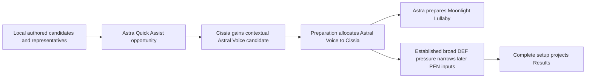

# Seed, Cissia, and Astra Yao Third Vertical

## Summary

Define Seed, Cissia, and Astra Yao as the next bounded setup-workbench vertical,
with Seed as Focus. Preserve one representative local setup per Agent, add only
the contextual candidates and holder allocation justified by this party, and
project the retained setup-relevant Result relationships without introducing a
catalogue, optimizer, rotation model, or new calculation feedback phase.

---

## Problem Frame

The first two verticals establish complete local candidates, deterministic
preparation, Party Edit, party-directed W-Engine and 4-piece adjustments,
effect-driven candidate pressure, and the current Result boundary. They do not
yet prove that the same product flow can admit a contextually competitive
4-piece that is not part of an Agent's local representative direction, allocate
that non-stacking party set to the more suitable holder, and then narrow later
setup inputs from the established party effects.

Seed and Cissia also form a dual-Attack relationship rather than a conventional
single-carry plus pure-support party. The workbench must preserve Seed as the
single authored Focus while retaining Cissia's off-field damage, Daze, and
buffer contributions only where they materially change setup choices or a
current Result surface.

The prose requirements govern if this diagram and the text ever differ.

---

## Actors

- A1. Setup workbench user: applies a valid party, receives one complete
  prepared setup per Agent, edits bounded competitive candidates, and inspects
  Result differences.
- A2. Workbench session: owns Party Apply, Focus, authorized preparation,
  effective candidate reconciliation, completeness, and Result projection.
- A3. Content author: establishes local direction, bounded base candidates,
  representative first choices, and the few researched contextual policies.

---

## Key Flows

- F1. Third-vertical application
  - **Trigger:** The user applies Seed, Cissia, and Astra Yao through Party Edit.
  - **Actors:** A1, A2, A3
  - **Steps:** The session resolves Seed as Focus, starts from all three local
    representatives, admits the Astra-enabled Astral Voice case for Cissia,
    allocates Astral Voice to Cissia, prepares Astra's Moonlight alternative,
    then resolves active downstream candidate pressure and main stats.
  - **Outcome:** All three Agents have complete, deterministic setups drawn from
    their current effective candidates.
  - **Covered by:** R1-R10, R17-R18
- F2. Direct setup adjustment
  - **Trigger:** The user edits an applied W-Engine, Disc, main stat, or
    effective-substat count.
  - **Actors:** A1, A2
  - **Steps:** The direct choice changes locally without rerunning holder
    allocation; active effects and effective candidate pressure are
    reevaluated; any no-longer-admitted downstream input is cleared without
    selecting a fallback or preparing another Agent.
  - **Outcome:** User intent is preserved and Result remains empty whenever a
    required selection is incomplete.
  - **Covered by:** R3a-R3c, R9-R10, R17-R18
- F3. Cumulative Result inspection
  - **Trigger:** All three applied setups are complete.
  - **Actors:** A1, A2
  - **Steps:** Existing provider-local observations and outgoing clauses are
    resolved, distributed, and projected through the current calculation
    boundary; Mindscapes add only their retained cumulative differences.
  - **Outcome:** Seed, Cissia, and Astra show current Initial, Combat, Fully
    Enabled, action, operation, threshold, and cap distinctions without raw or
    final damage simulation.
  - **Covered by:** R11-R18

---

## Requirements

**Direction and party relationship**

- R1. Admit Seed and Cissia within the project's version-2.8 completion
  boundary and reuse the already admitted Astra Yao. The authored party is
  Seed, Cissia, and Astra, with Seed as the sole Focus-eligible Agent for this
  direction.
- R2. Retain Seed as an Electric `general_damage` contributor and bounded
  Vanguard-facing buffer. Retain Cissia as an off-field Electric
  `general_damage` contributor and Electric buffer. Corrode Bone Daze remains a
  Result-only action outcome through `daze_buildup`; it does not grant a
  daze-contributor role or admit Impact/Daze setup investment. Retain Astra as the
  existing low-field buffer. Specialty alone does not establish any of these
  roles.
- R3. Seed's Vanguard is resolved from the applied party by the exact source
  rule: among Seed's other applied Attack teammates, the one with the highest
  exact, unrounded current Initial ATK is the Vanguard. Seed is never her own
  Vanguard. Cissia is deterministic in the authored Seed/Cissia/Astra party
  because she is the only eligible teammate. Focus, Specialty ordering, and
  authored party identity do not override this comparison, and the workbench
  exposes no Vanguard selector, score, or optimizer.
- R3a. If Seed has no other applied Attack teammate, there is no Vanguard:
  Seed's Vanguard-dependent Core statuses and Besiege are absent, and the
  Additional Ability, including its event-conditioned Energy grant, is inactive.
  One eligible teammate becomes Vanguard without comparison. With multiple
  eligible teammates, compare their exact, unrounded Initial ATK after every
  Initial input, including W-Engine Base ATK, advanced stats, initial Disc
  effects, main stats, and effective-substat inputs; exclude every Combat or
  Fully Enabled modifier, including Seed, Astra, Brimstone, and Woodpecker buffs.
- R3b. Party Apply and any later complete applied setup transition that changes
  an eligible teammate's Initial ATK re-resolve Vanguard before Result
  projection. A direct edit can therefore move Vanguard and its received
  sources without preparing any setup, selecting a setup fallback, or restoring
  history. If the applied setup is incomplete, Result remains empty and no
  provisional Vanguard outcome is displayed.
- R3c. The exact game behavior for an Initial ATK tie is not source-stated. As
  an explicit user-approved product fallback rather than a game fact, two or
  more eligible teammates with exactly equal unrounded Initial ATK resolve to
  the tied Agent in the earlier applied party slot. Applied party slot is
  user-visible party ordering and may affect Vanguard only for this exact-tie
  fallback; it cannot alter a non-tie comparison. Provider traversal order,
  calculation order, and unrelated source ordering remain irrelevant, and this
  bounded rule adds no universal tie-policy abstraction or new UI.

**Candidate sets and representative preparation**

- R4. Seed's full W-Engine candidates are Cordis Germina, Heartstring Nocturne,
  Severed Innocence, The Brimstone, and Marcato Desire; non-limited candidates
  are The Brimstone and Marcato Desire. Full prepares Cordis Germina W1 and
  non-limited prepares Marcato Desire W5. Heartstring's mixed-CRIT package is
  distinct at zero supplied substats even though its Fire RES Ignore is
  unusable by Electric Seed. Cordis remains the full first choice after the
  finite stat-supply comparison; candidate admission does not imply
  representative priority. Do not admit generic stat sticks whose usable
  package adds no distinct current role, formula, action, operation, threshold,
  or cap axis.
- R5. Seed's retained 4-piece candidates are Dawn's Bloom and Woodpecker
  Electro. Her base 2-piece candidates are Woodpecker Electro, Branch & Blade
  Song, Puffer Electro, Thunder Metal, and Hormone Punk. Thunder Metal preserves
  the matching Electric DMG axis, while Hormone Punk is the authored ATK%
  identity because neither member of the Hormone Punk/Astral Voice pair has a
  4-piece role for Seed. Slot 4 offers CRIT Rate and CRIT DMG; Slot 5 offers
  Electric DMG, ATK%, and PEN Ratio before active pressure; Slot 6 offers ATK%;
  effective substats are CRIT Rate, CRIT DMG, and ATK% with independent zero to
  36 counts.
- R6. Seed's representative full setup is Cordis Germina W1, Dawn's Bloom
  4-piece, Woodpecker Electro 2-piece, and CRIT Rate / Electric DMG / ATK%.
  Her non-limited representative changes only the W-Engine to Marcato Desire
  W5. Every effective-substat count starts at zero.
- R7. Cissia's full W-Engine candidates are Serpentine Seeker, Bellicose Blaze,
  Drill Rig - Red Axis, and Cordis Germina; non-limited retains Drill Rig - Red
  Axis. Full prepares Serpentine Seeker W1 and non-limited prepares Drill Rig -
  Red Axis W5. Bellicose Blaze is a partial but material limited-ownership
  alternate: its Energy Regen and CRIT Rate both strengthen Cissia's current
  Core threshold and damage direction, while its Fire Aftershock DEF
  Ignore is unusable by her Electric Aftershocks and is charged as package
  opportunity cost. Serpentine remains the stronger full representative because
  its comparable Energy Regen package supplies more CRIT Rate and a usable
  Electric DEF Ignore clause. General stat sticks remain excluded when their
  usable whole packages create no distinct current choice.
- R8. Cissia locally retains Dawn's Bloom as her operation-fitting 4-piece.
  Astra's repeated Quick Assist opportunity adds Astral Voice as a contextual
  competitive 4-piece adjustment from that complete local package because
  Cissia's retained buffer role and off-field direction can materially use its
  entrant effect. Astra is not represented as the only legal Quick Assist
  source, and operation activation alone does not admit Astral Voice for every
  damage contributor.
- R9. Cissia's 2-piece candidates are Swing Jazz, Woodpecker Electro, Branch &
  Blade Song, Thunder Metal, and one authored ATK% identity. Outside the Astra
  context, Hormone Punk is the canonical ATK% identity. In the authored Astra
  context, Dawn's Bloom 4-piece exposes Astral Voice so its 4-piece swap remains
  available; selecting contextual Astral Voice 4-piece exposes Hormone Punk as
  the legal ATK% complement. Thunder Metal preserves the matching Electric DMG
  axis. Slot 4 offers CRIT Rate and CRIT DMG; Slot 5 offers Electric DMG and
  ATK%; Slot 6 offers Energy Regen and ATK%; effective substats are CRIT Rate,
  CRIT DMG, and ATK% with independent zero to 36 counts. Outside the Astra
  context, her complete local full representative is Serpentine Seeker W1,
  Dawn's Bloom 4-piece, Swing Jazz 2-piece, CRIT Rate / Electric DMG / Energy
  Regen, and zero effective-substat counts. Her local non-limited representative
  changes only the W-Engine to Drill Rig - Red Axis W5. In the authored Astra
  context, the bounded preparation adjustment changes only Dawn's Bloom to
  Astral Voice for either pool.
- R10. On an all-party Party or Focus Apply in the authored Astra context,
  holder allocation prepares Cissia with Astral Voice and Astra with Moonlight
  Lullaby together without changing either Agent's base candidate membership.
  Full Astra completes that package with Astral Voice 2-piece; non-limited Astra
  retains Hormone Punk 2-piece. Astra preserves her current W-Engine, main-stat,
  effective-substat, pool, and M0-M1 versus M2-M6 preparation rules. A
  target-only Cissia Mindscape or pool preparation may mutate only Cissia and
  treats Astra's selected Disc as established. It prepares contextual Astral
  only when no established holder already uses Astral; otherwise Cissia keeps
  her authored Dawn's Bloom package while Astra remains untouched. Direct setup
  edits likewise remain local, rerun no holder allocation, and may create a
  duplicate that existing non-stacking Result behavior resolves. Candidate
  addition and prepared holder allocation remain separate authored decisions.

**Retained facts and Result boundary**

- R11. Retain only the completed level-60 Agent stats consumed by a current
  candidate, prepared setup, or Result: Seed ATK 929, CRIT Rate 5%, and CRIT
  DMG 78.8%; Cissia ATK 938, CRIT Rate 5%, CRIT DMG 50%, and Energy Regen
  1.56. Their other completed stats have no current retained consumer.
- R11a. Refinement remains editable for the newly selected W-Engines, but their
  Base ATK, advanced stats, refinement progression, activation clauses, and
  compressed Setup copy remain owned by the shared W-Engine facts. This
  requirement owns only the candidate membership, prepared refinement, holder
  compatibility, and local Result relationships stated above.
- R11b. Dawn's Bloom supplies Seed and Cissia's operation-fitting Basic package;
  Woodpecker supplies the alternate CRIT-to-ATK package; Puffer supplies the
  independent PEN direction. Their exact effects, surfaces, and compressed
  Setup copy remain owned by the shared Drive Disc facts. This vertical does
  not admit Puffer Electro 4-piece; the separately approved Dialyn
  Ultimate-opportunity consumer is owned by the [bounded follow-up
  requirements](2026-08-10-dialyn-puffer-electro-contextual-candidate-requirements.md).
- R12. Entering combat with a Vanguard immediately establishes Seed's Core at
  Combat: Seed and the current Vanguard each receive +1,000 ATK and +30% CRIT
  DMG through their respective statuses, and both receive broad +25% DMG while
  both statuses are active. The Besiege DMG clause has no Attribute restriction;
  these reachable values remain at Fully Enabled. Seed's Additional
  Ability grants the Vanguard +2 Energy when Seed deals damage as the active
  character, limited to once per 1s. This exact event-conditioned resource
  clause remains compressed Setup content because it changes the whole-package
  meaning used by candidate and representative authoring. It is not normalized
  to +2/s, projected as a Result operation, or added to any recipient's Energy
  Regen row. The Additional Ability also grants Seed's
  Slaughter, Downfall, and Ultimate outcomes +30% DMG and 25% Electric RES
  Ignore whenever another Attack Agent is applied.
- R13. Seed Mindscapes apply cumulatively. M1 adds +30% CRIT DMG to Downfall.
  M2 adds broad 20% DEF Ignore to Seed and the current Vanguard at Combat while
  their entry-established Besiege is active and adds a Fully Enabled +120% DMG
  outcome to `Basic Attack: Falling Petals - Slaughter`: the source can consume
  at most 120 Energy and grants +5% for each 5 Energy consumed. M4 adds +20%
  Ultimate DMG. M6 adds +50% Seed CRIT DMG at Combat. M3 and M5 ordinary-skill
  levels and M6 raw added-hit mechanics do not enter the current Result.
- R14. Seed's Steel Charge initial value, cap, generation, spending, and action
  availability are excluded. The M2 Slaughter maximum is a source-stated
  Fully Enabled action outcome, not a Steel Charge or Energy gauge, average,
  rotation model, generic DMG row, or new combat-state lifecycle.
- R14a. Seed exposes ATK, CRIT Rate, CRIT DMG, DMG Bonus, selected PEN Ratio,
  and any nonzero applicable DEF Ignore, DEF Reduction, RES Ignore, RES
  Reduction, or Stun DMG Multiplier parent region. The retained visible scopes
  are `Basic Attack: Falling Petals - Slaughter`, `Basic Attack: Falling Petals
  - Downfall`, and `Ultimate`. Sources common to all three form one action
  outcome group; Dawn's Bloom and Cordis Germina Basic scope form a nested group
  for the two Basic Attack forms, while narrower differences remain child
  outcomes. Seed's Additional Ability applies to all three; M1 applies only to
  Downfall; M2's +120% applies only to Slaughter; and M4 applies only to
  Ultimate. Seed exposes no Energy, Energy
  Regen, Steel Charge, or Vanguard gauge. Conditional parent regions and action
  outcomes are absent when no current source contributes.
- R15. Each Corrode Bone trigger grants +6% CRIT Rate; Fully Enabled reaches the
  three-stack +18% maximum. Its action Daze Bonus is +40% with one applied
  Electric Agent and +60% with at least two, including Cissia in that count;
  the source exposes no higher tier for a third Electric Agent. Cissia's
  Additional Ability is active only with another applied Stun or Electric
  Agent; Venom is supplied on entry, so the active ability grants +40% party
  CRIT DMG and another +10% to Cissia at Combat and Fully Enabled. Her Ultimate
  grants +5% party CRIT DMG at Fully Enabled.
- R16. With Serpentine Seeker, Swing Jazz, and Slot 6 Energy Regen, Cissia's
  entry-supplied Venom establishes her Core at Combat and resolves broad party
  Electric DEF Ignore as
  `min(25, 6 + max(Initial Energy Regen - 1.4, 0) / 0.12)` percentage points.
  The Agent-owned base remains below or at the threshold. The full
  representative's selected shared facts reach the cap; the non-limited Drill
  Rig package remains below it. Runtime calculation derives both exact values
  from those shared facts rather than storing prepared totals here.
- R16a. Cissia M1 multiplies the already resolved and capped Combat Core value
  by 140% after equipment composition; display rounds only after that
  multiplication. M1 also adds 5% party Electric RES Ignore at Combat and 10%
  Corrode Bone Electric RES Ignore at Fully Enabled. M2 adds +35% DMG to `Basic
  Attack: Serpent's Kiss` at Fully Enabled. M3-M6 add no other current retained
  Result difference: ordinary-skill levels and the M4/M6 added Corrode Bone
  trigger mechanics do not enter the current Result.
- R16b. Cissia exposes ATK, CRIT Rate, CRIT DMG, Energy Regen, DMG Bonus, a Daze
  Bonus parent for the Corrode Bone action outcome, and any nonzero applicable
  DEF Ignore, DEF Reduction, RES Ignore, RES Reduction, or Stun DMG Multiplier
  region. Her Initial Energy Regen owns a visible threshold/cap gauge whose
  Combat output is the R16 Core DEF Ignore, with a 25% M0 cap or 35% M1+ cap;
  Fully Enabled retains the same current output. The retained visible scopes
  are the source-local `Corrode Bone` outcome and `Basic Attack: Serpent's
  Kiss`. Dawn's Bloom, Drill Rig - Red Axis, and applicable Basic-scoped sources
  project on both under the current authored applicability, but that shared
  applicability does not rename Corrode Bone as a Basic Attack. Their common
  values form one action outcome group; Corrode Bone additionally owns the Daze
  and M1 action-specific RES Ignore outcomes; Cissia M2 applies only to
  Serpent's Kiss.
  Serpent's Kiss and Ultimate Quick Assist triggers remain exact activation and
  preparation facts for Astral Voice, not standalone numeric Result operations.
  No raw DMG, raw Daze, Venom count, or Serpentine Shadow gauge is admitted.
- R17. Cissia's Core supplies active pre-PEN candidate pressure only to an
  applied Electric `general_damage` direction whose supported output consumes
  the DEF region. It removes Slot 5 PEN Ratio and Puffer Electro 2-piece when
  those inputs belong to that recipient's base candidates. Candidate pressure
  follows recipient, Attribute, action breadth, formula participation, and
  input component even when the recipient intentionally has no matching DEF
  Result projector. It does not affect `sheer_damage`, a non-Electric direction
  or action, or an ineligible recipient.
- R17a. Seed M2's broad Besiege DEF Ignore supplies the same kind of current
  candidate pressure to Seed and the current Vanguard, limited to each
  recipient's applicable DEF-consuming `general_damage` direction and admitted
  PEN suppliers. Cissia's already-active pressure can make this produce no
  additional candidate change. Serpentine Seeker is self-only, and Cordis
  Germina is Basic/Ultimate-only; neither supplies party candidate pressure.
  RES Ignore, CRIT, DMG, and Daze clauses are Result-only and do not alter
  candidate membership. Seed's event-conditioned Energy grant retains Setup
  package meaning but is neither candidate pressure nor a Result projection.
- R18. Outgoing delivery and Result projection remain separate. A source first
  delivers only to its source-stated recipient; the recipient then projects the
  clause only when its authored direction has the matching Attribute, action,
  formula region, and current parent or action projector. Delivery never adds a
  setup role or a generic Result row. Representative acceptance examples pin
  this semantic rule without freezing an exhaustive named-Agent matrix.
- R18a. Seed's Core ATK and CRIT DMG each deliver to both Seed and the current
  Vanguard; broad Besiege DMG delivers to those same two recipients. Seed's
  Additional action clauses belong only to Seed.
  Cissia's Core DEF Ignore
  and M1's 5% RES Ignore deliver to the party but project only through
  applicable Electric damage consumers. Her Additional and Ultimate CRIT DMG
  deliver to the party but remain absent on a recipient that has no current
  CRIT DMG projector. Her extra +10% and Corrode Bone-specific 10% M1 clause
  remain self and action scoped.
- R18b. Cissia owns Astral Voice's reachable entrant-DMG contribution and Astra
  owns Moonlight Lullaby's party-DMG contribution; each non-stacking set effect applies once
  and projects only to compatible current damage consumers. Astra retains only
  her established ATK and Energy Regen Result: received Cissia CRIT DMG or
  Electric clauses do not invent personal Astra damage, CRIT, DEF, or RES rows.
- R18c. Every new retained Result difference from a trigger, stack, threshold,
  cap, or canonical action enters the earliest surface established above.
  Seed's event-conditioned Energy grant remains excluded under R12. Initial
  contains Base/advanced stats, main/substats, and 2-piece effects; Combat adds
  unconditional 4-piece/W-Engine passives and effects established on combat
  entry, including Seed's Core, Cissia's Venom-backed clauses, and Serpentine
  Seeker; Fully Enabled adds post-entry actions, hits, stacks, and state changes.
  Initial ATK and Energy Regen never read received later-surface effects. Seed
  and Cissia add no aggregate action tag: the named action identities and their
  Basic, Ultimate, or source-specific applicability remain explicit. No Seed or
  Cissia output depends on a received clause before emitting another outgoing
  clause, so this vertical adds no post-delivery provider phase. Anby's bounded
  derived-provider phase remains unchanged; other current post-delivery
  derivations stay owned by the shared harness and are not generalized here.
- R18d. When Seed selects Heartstring Nocturne, its advanced CRIT Rate appears
  at Initial and its source-owned CRIT DMG appears at Combat and Fully Enabled. Seed
  receives no Fire RES Ignore row. This retained partial-package projection
  neither replaces Cordis as the full prepared representative nor infers any
  Result effect merely from Heartstring's candidate priority.

**Review and planning boundary**

- R19. This document captures approved product behavior and bounded research;
  it does not certify the current implementation, enumerate repository defects,
  prescribe file or type structure, or authorize implementation planning.
- R20. Planning may begin only after user review confirms this closure. Planning
  must preserve these product capabilities without treating the requirement's
  semantic language as a prescribed module, type, registry, or universal
  condition system.

---

## Acceptance Examples

- AE1. **Covers R1-R3c.** Given Seed, Cissia, and Astra are applied, Seed is the
  sole Focus and Cissia is the deterministic Vanguard because she is the only
  other Attack Agent; no Specialty inference, partner score, exact-tie fallback,
  or user-facing Vanguard selector is involved. Given Seed, Yixuan, and Astra,
  no Vanguard exists and every Vanguard-dependent Seed source is absent.
- AE1a. **Covers R3-R3c.** Given full representative Seed, Cissia, and Anby,
  the ordinary exact, unrounded Initial-ATK comparison selects Anby without
  consulting party slot. Directly changing only Cissia's Slot 5 from Electric
  DMG to ATK% moves Vanguard and its received Result sources to Cissia without
  preparing any setup. Current combat buffs do not participate in either
  comparison.
- AE1b. **Covers R3-R3c.** Given Seed in applied slot 2 and two synthetic
  eligible Attack teammates in slots 1 and 3 with exactly equal unrounded
  Initial ATK, slot 1 is Vanguard. Swapping only those tied Agents' applied
  slots makes the new earlier slot the Vanguard, while reversing provider
  traversal or calculation order changes no result.
- AE2. **Covers R4-R10.** Given M0/full Party Apply, Seed prepares Cordis/Dawn/
  Woodpecker, Cissia prepares Serpentine/Astral/Swing, and Astra prepares
  Elegant Vanity/Moonlight/Astral with the authored mains and zero substats.
  The equivalent non-limited preparation uses Marcato, Drill Rig, and Kaboom
  the Cannon with the corresponding complete Disc packages.
- AE3. **Covers R8-R10.** Given Cissia without the authored repeated Quick Assist
  opportunity, her full local representative is Serpentine/Dawn/Swing with
  CRIT Rate / Electric DMG / Energy Regen and zero substats; non-limited changes
  only the W-Engine to Drill Rig. Astral Voice is not added merely because a
  Quick Assist is mechanically possible. Given the authored Astra context, an
  all-party Apply prepares Cissia with Astral and Astra with Moonlight together.
  A later target-only Cissia Mindscape or pool preparation leaves Astra
  untouched and treats her current Disc as established: if Astra already holds
  Astral, Cissia prepares Dawn's Bloom rather than another Astral. A direct
  Cissia edit still leaves Astra untouched and may create a duplicate that
  Result handles through the existing non-stacking behavior.
- AE4. **Covers R5, R13, R16-R17a.** Given Seed's base Slot 5 and 2-piece selectors,
  Cissia's active broad Electric DEF Ignore removes PEN Ratio and Puffer
  Electro. Cordis alone leaves both available. A direct pressure change clears
  an invalid selected input without fallback and leaves Result empty until the
  user repairs every required selection. In a Seed/Cissia/Anby or
  Seed/Cissia/Trigger party, the same Cissia pressure removes Slot 5 PEN Ratio
  from the applicable Electric general-damage teammate; it does not remove a
  non-Electric recipient's input or create a DEF Result row for a direction
  that intentionally has no projector. Without Cissia, Seed M2 supplies the
  bounded pressure only to Seed and the current Vanguard.
- AE5. **Covers R11a-R14a, R18d.** Given Seed M2 Fully Enabled, Slaughter shows one
  +120% action outcome from the maximum 120-Energy source relationship. It does
  not create a generic DMG row, Energy gauge, average rotation value, or a
  feedback calculation phase. At Combat, both Seed and the resolved Vanguard
  show one Seed Core +1,000 ATK source and one Seed Core +30% CRIT DMG source.
  Result groups the three complete Seed action labels for common sources, nests
  the two Basic Attack forms for shared Basic scope, and adds only the narrower
  Mindscape child outcome. Dawn's Bloom contributes through its shared
  source-owned surfaces; M1 adds only to Downfall and M4 only to Ultimate. The
  entry-established Core and M2 DEF Ignore appear at Combat. Selecting
  Brimstone composes its Base ATK internally, discloses its Initial and reachable
  ATK sources, and omits W-Engine Base ATK from Result disclosure. Refinement
  changes the reachable source without changing candidate membership. In the
  full authored party, M2 Seed combines Cissia Core, Besiege, and Cordis on the
  applicable DEF-region outcomes; Vanguard Cissia combines Core, Serpentine,
  and Besiege, while Astra omits the region. Selecting Heartstring instead
  supplies Seed's mixed-CRIT package without a Fire-RES-Ignore row; preparing
  the full pool again restores Cordis rather than treating candidate admission
  as first-choice priority.
- AE6. **Covers R11a-R11b, R15-R16b.** Given Cissia's full representative, the
  selected shared facts compose her Energy Regen gauge and Core DEF-Ignore
  relationship. Selected and candidate Setup cards use the shared compressed
  Disc and W-Engine packages, omitting routine trigger or category-acquisition
  prose. Changing Serpentine refinement changes its CRIT and Electric-DEF-Ignore
  sources without changing membership. Switching only Cissia to the
  non-limited Drill Rig representative replaces those sources with its grouped
  `Corrode Bone` and `Basic Attack: Serpent's Kiss` Basic-Electric-DMG source.
  Changing Drill Rig refinement changes that source without changing the
  prepared package. M1 scales the Core values without changing another Agent's
  setup, and M2 adds
  +35% only to Serpent's Kiss.
- AE7. **Covers R18-R18c.** Given the selected complete party, Astral Voice is
  disclosed as Cissia's source and Moonlight Lullaby as Astra's source; neither
  stacks with a duplicate holder, Seed/Cissia receive only applicable clauses,
  and Astra does not gain invented personal-damage rows.
- AE8. **Covers R15-R18c.** Given Cissia, Yixuan, and Astra, Cissia is the only
  Electric Agent, so Corrode Bone shows +40% Daze and Cissia's Additional
  Ability is inactive. Given Cissia, Anby, and Yixuan, Anby: Soldier 0 is an
  Electric Attack Agent, so the Electric arm makes Corrode Bone show +60% Daze
  and activates the Additional Ability. Given Cissia, Dialyn, and Yixuan,
  Cissia remains the only Electric Agent and Corrode Bone stays +40%, while
  Dialyn's Stun Specialty independently activates the Additional Ability. In
  either active case, its party CRIT DMG projects only on recipients with a
  current CRIT DMG consumer.
- AE9. **Covers R3-R3c, R12, R18-R18c.** Given Seed, Cissia, and Anby, Vanguard
  is resolved from current Initial ATK. Whether Anby or Cissia is Vanguard,
  Seed's exact +2 Energy once-per-1s passive remains compressed Setup content:
  neither recipient gains a +2/s operation, a changed Energy Regen value, or a
  new Energy Regen row. A direct Initial-ATK edit that moves Vanguard to Cissia
  moves the applicable Vanguard Core sources without changing that Result
  exclusion. Cissia's Electric Core clause may project on every applicable
  Electric general-damage consumer, and every delivered clause keeps its own
  source and recipient rather than becoming a named-party aggregate. While Anby
  is Vanguard, her existing Fully Enabled CRIT-DMG-derived Aftershock phase
  observes both Seed's +30% Vanguard CRIT DMG and Cissia's party +40%; moving
  Vanguard to Cissia removes only Seed's +30% from Anby, and the same
  established Anby phase recalculates. Seed and Cissia add no further
  received-effect-dependent outgoing phase; this example does not claim that
  Anby is the repository's only post-delivery derived provider.
- AE10. **Covers R19-R20.** Given this document has passed user review, planning
  may choose the smallest implementation shape that preserves the requirements.
  Before that review, no plan or implementation is authorized by this capture.
- AE11. **Covers R7, R11a, R16-R16b.** Given full-pool Cissia, Bellicose Blaze is selectable and supplies its source-owned Initial Energy Regen and Combat CRIT Rate, while no Fire Aftershock DEF Ignore source or Result row appears. Serpentine Seeker remains the prepared full first choice and continues to supply its usable Electric DEF Ignore. Bellicose Blaze is absent from the non-limited pool.

---

## Success Criteria

- The third vertical can be planned without inventing party roles, base
  candidates, representative first choices, contextual Astral admission,
  holder allocation, Vanguard applicability, new equipment facts, candidate
  pressure, Mindscape outcomes, or Result scope.
- The setup remains a deterministic workbench: one prepared starting point,
  bounded competitive selectors, local direct edits, incomplete Result gating,
  and inspectable current outcomes rather than a user-facing partner choice,
  runtime equipment ranking, or simulation.
- Representative authored and mixed parties demonstrate outgoing delivery,
  recipient/Attribute/action/formula applicability, and current projection
  without an exhaustive named-Agent matrix.

---

## Scope Boundaries

- No implementation plan, production code, tests, UI work, assets, staging, or
  non-document mutation in this capture.
- No new Agent content beyond Seed and Cissia. Astra is reused as the selected
  party's existing provider and allocation participant; already-admitted Anby,
  Yixuan, Dialyn, and Trigger may appear only as representative mixed-party
  acceptance cases without re-authoring their content.
- No Seed/Cissia raw or final damage, action coefficients, rotations, clear
  time, Steel Charge simulator, Decibel frequency, exhaustive team comparison,
  optimizer, ranking score, evidence archive, candidate catalogue, universal
  condition language, or universal Agent/effect/setup schema.
- No automatic Astral Voice admission for every Quick Assist recipient and no
  focused Seed Astral case; Seed retains a stronger personal operation-fitting
  4-piece.
- No Puffer Electro 4-piece fact, effect, candidate, or Result source within
  this vertical. The separately approved Dialyn Ultimate-opportunity consumer
  is owned by the [bounded follow-up requirements](2026-08-10-dialyn-puffer-electro-contextual-candidate-requirements.md).
- No universal tie-policy abstraction, new Vanguard UI, or slot-based behavior
  outside Seed's exact-Initial-ATK tie fallback. Applied party slot may resolve
  only that tie; provider traversal and calculation order remain irrelevant.

---

## Key Decisions

- Keep one local representative before contextual adjustment: this preserves a
  stable authored starting point and prevents party policy from becoming a
  package catalogue.
- Admit Astral Voice to Cissia, not focused Seed: Cissia's retained buffer role
  and Astra-enabled entrant operation make the whole package competitive,
  whereas Seed has a stronger personal 4-piece and owns Focus damage
  responsibility.
- Separate candidate addition from holder allocation: the former changes
  Cissia's effective selector; the latter prepares Astra's already-admitted
  Moonlight alternative without rewriting candidate membership.
- Apply broad DEF pressure by recipient, Attribute, action, formula, and input
  component: this removes Seed's comparable PEN suppliers without a Cissia-,
  Seed-, or equipment-name branch.
- Resolve Seed M2 at its source-stated Fully Enabled maximum: operation-dependent
  variation belongs to the existing maximum-reachability window, not a rotation
  model.
- Resolve Vanguard from exact, unrounded current Initial ATK, with earlier
  applied party slot as the user-approved deterministic fallback only for an
  exact tie. This is an explicit bounded product resolution of unknown game
  behavior rather than factual inference, while keeping the relationship out
  of setup controls and runtime equipment optimization.
- Keep delivery broader than projection: source recipients and applicability
  stay exact, while only current authored projectors create visible rows or
  action outcomes.

---

## Dependencies / Assumptions

- The project completes content through version 2.8 before later-version
  pressure testing. Seed and Cissia fall within that boundary.
- Exact game behavior for equal highest Initial ATK is not established. The
  user-approved product behavior resolves that unknown deterministically by
  selecting the tied eligible Agent in the earlier applied party slot; this is
  not retained or presented as an exact game fact.

---

## Outstanding Questions

### Resolve Before Planning

- None after user review of this closure.

### Deferred to Planning

- None. Exact module, type, and test structure belongs to planning and must be
  derived from the current implementation rather than prescribed here.
