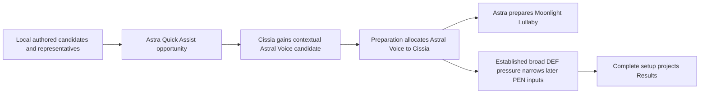

# Seed, Cissia, and Astra Yao Third Vertical

## Summary

Define Seed, Cissia, and Astra Yao as the next bounded setup-workbench vertical,
with Seed as Focus. Preserve one representative local setup per Agent, add only
the contextual candidates and holder allocation justified by this party, and
project the retained setup-relevant Result relationships without introducing a
catalogue, optimizer, rotation model, or new calculation feedback phase.

---

## Problem Frame

The first two verticals establish complete local candidates, deterministic
preparation, Party Edit, party-directed W-Engine and 4-piece adjustments,
effect-driven candidate pressure, and the current Result boundary. They do not
yet prove that the same product flow can admit a contextually competitive
4-piece that is not part of an Agent's local representative direction, allocate
that non-stacking party set to the more suitable holder, and then narrow later
setup inputs from the established party effects.

Seed and Cissia also form a dual-Attack relationship rather than a conventional
single-carry plus pure-support party. The workbench must preserve Seed as the
single authored Focus while retaining Cissia's off-field damage, Daze, and
buffer contributions only where they materially change setup choices or a
current Result surface.

The prose requirements govern if this diagram and the text ever differ.

---

## Actors

- A1. Setup workbench user: applies a valid party, receives one complete
  prepared setup per Agent, edits bounded competitive candidates, and inspects
  Result differences.
- A2. Workbench session: owns Party Apply, Focus, authorized preparation,
  effective candidate reconciliation, completeness, and Result projection.
- A3. Content author: establishes local direction, bounded base candidates,
  representative first choices, and the few researched contextual policies.
- A4. Refreshed controller: independently reconstructs product purpose and
  current state from the repository before judging gaps or planning the
  vertical.

---

## Key Flows

- F1. Third-vertical application
  - **Trigger:** The user applies Seed, Cissia, and Astra Yao through Party Edit.
  - **Actors:** A1, A2, A3
  - **Steps:** The session resolves Seed as Focus, starts from all three local
    representatives, admits the Astra-enabled Astral Voice case for Cissia,
    allocates Astral Voice to Cissia, prepares Astra's Moonlight alternative,
    then resolves active downstream candidate pressure and main stats.
  - **Outcome:** All three Agents have complete, deterministic setups drawn from
    their current effective candidates.
  - **Covered by:** R1-R10
- F2. Direct setup adjustment
  - **Trigger:** The user edits an applied W-Engine, Disc, main stat, or
    effective-substat count.
  - **Actors:** A1, A2
  - **Steps:** The direct choice changes locally; active effects and effective
    candidate pressure are reevaluated; any no-longer-admitted downstream input
    is cleared without selecting a fallback or preparing another Agent.
  - **Outcome:** User intent is preserved and Result remains empty whenever a
    required selection is incomplete.
  - **Covered by:** R9-R10, R17-R18
- F3. Cumulative Result inspection
  - **Trigger:** All three applied setups are complete.
  - **Actors:** A1, A2
  - **Steps:** Existing provider-local observations and outgoing clauses are
    resolved, distributed, and projected through the current calculation
    boundary; Mindscapes add only their retained cumulative differences.
  - **Outcome:** Seed, Cissia, and Astra show current Initial, Combat, Fully
    Enabled, action, operation, threshold, and cap distinctions without raw or
    final damage simulation.
  - **Covered by:** R11-R18
- F4. Controller refresh
  - **Trigger:** Durable capture is committed and the next task begins from the
    clean checkpoint.
  - **Actors:** A4
  - **Steps:** The controller verifies branch and status, rereads the permanent
    authorities and current requirements/plans/learnings, reconstructs the
    product flow, and independently audits both the current baseline and this
    proposed vertical.
  - **Outcome:** Any repository deficiencies, contradictions, or missing work
    are reported by the refreshed task rather than inherited as conclusions
    from this capture.
  - **Covered by:** R19-R20

---

## Requirements

**Direction and party relationship**

- R1. Admit Seed and Cissia within the project's version-2.8 completion
  boundary and reuse the already admitted Astra Yao. The authored party is
  Seed, Cissia, and Astra, with Seed as the sole Focus-eligible Agent for this
  direction.
- R2. Retain Seed as an Electric `general_damage` contributor and bounded
  Vanguard-facing buffer. Retain Cissia as an off-field Electric
  `general_damage` contributor, Corrode Bone Daze contributor, and Electric
  buffer. Retain Astra as the existing low-field buffer. Specialty alone does
  not establish any of these roles.
- R3. Cissia is the deterministic Vanguard because she is the only other Attack
  Agent in the authored party and therefore the only eligible recipient of
  Seed's highest-Initial-ATK Attack-teammate rule. Do not add a Vanguard
  selector, ranking pass, or general dynamic partner optimizer.

**Candidate sets and representative preparation**

- R4. Seed's full W-Engine candidates are Cordis Germina, Severed Innocence,
  The Brimstone, and Marcato Desire; non-limited candidates are The Brimstone
  and Marcato Desire. Full prepares Cordis Germina W1 and non-limited prepares
  Marcato Desire W5. Do not admit generic stat sticks whose usable package adds
  no distinct current role, formula, action, operation, threshold, or cap axis.
- R5. Seed's retained 4-piece candidates are Dawn's Bloom and Woodpecker
  Electro. Her base 2-piece candidates are Woodpecker Electro, Branch & Blade
  Song, and Puffer Electro. Slot 4 offers CRIT Rate and CRIT DMG; Slot 5 offers
  Electric DMG, ATK%, and PEN Ratio before active pressure; Slot 6 offers ATK%;
  effective substats are CRIT Rate, CRIT DMG, and ATK% with independent zero to
  36 counts.
- R6. Seed's representative full setup is Cordis Germina W1, Dawn's Bloom
  4-piece, Woodpecker Electro 2-piece, and CRIT Rate / Electric DMG / ATK%.
  Her non-limited representative changes only the W-Engine to Marcato Desire
  W5. Every effective-substat count starts at zero.
- R7. Cissia's full W-Engine candidates are Serpentine Seeker, Drill Rig - Red
  Axis, and Cordis Germina; non-limited retains Drill Rig - Red Axis. Full
  prepares Serpentine Seeker W1 and non-limited prepares Drill Rig - Red Axis
  W5. Bellicose Blaze and general stat sticks remain excluded because their
  usable whole packages do not create a distinct current choice.
- R8. Cissia locally retains Dawn's Bloom as her operation-fitting 4-piece.
  Astra's repeated Quick Assist opportunity adds Astral Voice as a contextual
  competitive 4-piece because Cissia's retained buffer role and off-field
  direction can materially use its entrant effect. Astra is not represented as
  the only legal Quick Assist source, and operation activation alone does not
  admit Astral Voice for every damage contributor.
- R9. Cissia's 2-piece candidates are Swing Jazz, Woodpecker Electro, and Branch
  & Blade Song. Slot 4 offers CRIT Rate and CRIT DMG; Slot 5 offers Electric
  DMG and ATK%; Slot 6 offers Energy Regen and ATK%; effective substats are CRIT
  Rate, CRIT DMG, and ATK% with independent zero to 36 counts. Her selected-party
  representative is Astral Voice 4-piece plus Swing Jazz 2-piece, CRIT Rate /
  Electric DMG / Energy Regen, for both pools.
- R10. When Cissia is prepared as the established Astral Voice holder, Astra
  prepares Moonlight Lullaby 4-piece without changing either Agent's base
  candidate membership. Full Astra completes the package with Astral Voice
  2-piece; non-limited Astra retains Hormone Punk 2-piece. Astra preserves her
  current W-Engine, main-stat, effective-substat, pool, and M0-M1 versus M2-M6
  preparation rules. Candidate addition and non-stacking holder allocation are
  separate authored decisions.

**Retained facts and Result boundary**

- R11. Seed's completed level-60 facts are HP 7,673, ATK 929, DEF 612, Impact
  93, CRIT Rate 5%, CRIT DMG 78.8%, Anomaly Mastery 94, Anomaly Proficiency 93,
  and Energy Regen 1.2. Cissia's are HP 7,673, ATK 938, DEF 606, Impact 93,
  CRIT Rate 5%, CRIT DMG 50%, Anomaly Mastery 94, Anomaly Proficiency 93, and
  Energy Regen 1.56.
- R12. Seed's Fully Enabled Core grants Seed and Cissia their respective
  +1,000 ATK and +30% CRIT DMG statuses and grants both +25% DMG while both
  statuses are active. Seed's Additional Ability gives Cissia one +2 Energy
  operation when its trigger occurs, limited to once per second, and grants
  Seed's Slaughter, Downfall, and Ultimate outcomes +30% DMG and 25% Electric
  RES Ignore. The Energy operation does not change Energy Regen. Retain the
  reachable overlapping state; do not model its 40-second lifecycle or
  rotation.
- R13. Seed Mindscapes apply cumulatively. M1 adds +30% CRIT DMG to Downfall.
  M2 grants Seed and Cissia broad 20% DEF Ignore while Besiege is active and
  adds a Fully Enabled +120% DMG outcome to `Basic Attack: Falling Petals -
  Slaughter`: the source can consume at most 120 Energy and grants +5% for each
  5 Energy consumed. M4 adds +20% Ultimate DMG. M6 adds +50% Seed CRIT DMG.
  M3 and M5 ordinary-skill levels and raw added-hit mechanics do not enter the
  current Result.
- R14. Seed's Steel Charge initial value, cap, generation, spending, and action
  availability are excluded. The M2 Slaughter maximum is a source-stated
  Fully Enabled action outcome, not a Steel Charge or Energy gauge, average,
  rotation model, generic DMG row, or new combat-state lifecycle.
- R15. Cissia's Corrode Bone reaches +18% CRIT Rate at three stacks and +60%
  Daze in the authored two-Electric-Agent party. Her Core exposes a threshold
  and cap relationship from Initial Energy Regen above 1.4 to broad party
  Electric DEF Ignore, adding one point per 0.12 and capping at 25%. Her
  Additional Ability grants +40% party CRIT DMG and another +10% to Cissia;
  Ultimate grants +5% party CRIT DMG.
- R16. With Serpentine Seeker, Swing Jazz, and Slot 6 Energy Regen, Cissia's
  Initial Energy Regen is 3.744 and her Core reaches its 25% cap. With Drill Rig
  - Red Axis, Swing Jazz, and Slot 6 Energy Regen, Initial Energy Regen is 3.588
  and the Core output is approximately 24.233%. M1 multiplies the Core DEF
  Ignore by 140%, producing 35% and approximately 33.927%, and adds 5% party
  Electric RES Ignore plus 10% Corrode Bone Electric RES Ignore. M2 adds +35%
  DMG to Serpent's Kiss. M3-M6 add no other current retained Result difference.
- R17. Cissia's broad party Electric DEF Ignore supplies active pre-PEN
  candidate pressure only to applicable Electric `general_damage` recipients.
  In the authored party it removes Seed's Slot 5 PEN Ratio and Puffer Electro
  2-piece from the effective candidates. It does not affect a formula that omits
  the DEF region, a non-Electric action, or an ineligible recipient. Cordis
  Germina's Basic/Ultimate-only DEF Ignore does not remove either candidate by
  itself.
- R18. Fully Enabled projects each retained clause only through a current
  consumer. Cissia owns Astral Voice's reachable entrant +24% DMG and Astra owns
  Moonlight Lullaby's +18% party DMG; each non-stacking set effect applies once.
  Seed delivers Core and Additional effects to Cissia, not Astra. Cissia's
  Electric clauses apply to Seed and Cissia, while her party CRIT DMG may be
  delivered more broadly but is projected only where the recipient has a
  current Result consumer. No received-effect-dependent outgoing clause is
  introduced, so the existing Anby-only extra calculation phase remains the
  sole such phase.

**Refresh and stop boundary**

- R19. This document captures approved product behavior and bounded research;
  it does not certify the current implementation, enumerate repository defects,
  prescribe file or type structure, or authorize implementation planning.
- R20. The refreshed controller must independently verify the clean checkpoint,
  read the five permanent authorities and relevant current artifacts, rebuild
  the candidate/preparation/Result flow from repository evidence, and report
  incorrect, incomplete, contradictory, or over-generalized areas before
  proposing the next implementation boundary. This document and any handoff
  summary are inputs to that review, not substitutes for it.

---

## Acceptance Examples

- AE1. **Covers R1-R3.** Given Seed, Cissia, and Astra are applied, Seed is the
  sole Focus and Cissia is the deterministic Vanguard; no Specialty inference,
  partner ranking, or user-facing Vanguard selector is involved.
- AE2. **Covers R4-R10.** Given M0/full Party Apply, Seed prepares Cordis/Dawn/
  Woodpecker, Cissia prepares Serpentine/Astral/Swing, and Astra prepares
  Elegant Vanity/Moonlight/Astral with the authored mains and zero substats.
  The equivalent non-limited preparation uses Marcato, Drill Rig, and Bashful
  Demon with the corresponding complete Disc packages.
- AE3. **Covers R8-R10.** Given Cissia without the authored repeated Quick Assist
  opportunity, Dawn's Bloom remains her local representative and Astral Voice
  is not added merely because a Quick Assist is mechanically possible. Given
  the authored Astra context, Astral becomes effective and prepared for Cissia,
  then Astra moves to Moonlight through holder allocation.
- AE4. **Covers R5, R16-R17.** Given Seed's base Slot 5 and 2-piece selectors,
  Cissia's active broad Electric DEF Ignore removes PEN Ratio and Puffer
  Electro. Cordis alone leaves both available. A direct pressure change clears
  an invalid selected input without fallback and leaves Result empty until the
  user repairs every required selection.
- AE5. **Covers R12-R14.** Given Seed M2 Fully Enabled, Slaughter shows one
  +120% action outcome from the maximum 120-Energy source relationship. It does
  not create a generic DMG row, Energy gauge, average rotation value, or a
  feedback calculation phase.
- AE6. **Covers R15-R16.** Given Cissia's full representative, the Initial Energy
  Regen gauge reaches the 25% DEF Ignore cap; switching only Cissia to the
  non-limited representative shows approximately 24.233%, while M1 scales the
  two values to 35% and approximately 33.927% without changing another Agent's
  setup.
- AE7. **Covers R18.** Given the selected complete party, Astral Voice is
  disclosed as Cissia's source and Moonlight Lullaby as Astra's source; neither
  stacks with a duplicate holder, Seed/Cissia receive only applicable clauses,
  and Astra does not gain invented personal-damage rows.
- AE8. **Covers R19-R20.** Given a clean committed checkpoint, the refreshed
  controller reports its own repository audit before writing a plan. No defect
  list copied from the prior task is treated as an accepted conclusion.

---

## Success Criteria

- The third vertical can be planned without inventing party roles, base
  candidates, representative first choices, contextual Astral admission,
  holder allocation, candidate pressure, Mindscape outcomes, or Result scope.
- The setup remains a deterministic workbench: one prepared starting point,
  bounded competitive selectors, local direct edits, incomplete Result gating,
  and inspectable current outcomes rather than runtime ranking or simulation.
- The next controller demonstrates an independent understanding of the product
  and identifies repository deficiencies in the refreshed task rather than
  inheriting an unverified gap list.

---

## Scope Boundaries

- No implementation plan, production code, tests, UI work, assets, staging, or
  non-document mutation in this capture.
- No Agents beyond Seed and Cissia; Astra is reused only as the selected party's
  existing provider and allocation participant.
- No Seed/Cissia raw or final damage, action coefficients, rotations, clear
  time, Steel Charge simulator, Decibel frequency, exhaustive team comparison,
  optimizer, ranking score, evidence archive, candidate catalogue, universal
  condition language, or universal Agent/effect/setup schema.
- No automatic Astral Voice admission for every Quick Assist recipient and no
  focused Seed Astral case; Seed retains a stronger personal operation-fitting
  4-piece.
- No current-repository defect or architecture-gap verdict in this document;
  that review belongs to the refreshed controller.

---

## Key Decisions

- Keep one local representative before contextual adjustment: this preserves a
  stable authored starting point and prevents party policy from becoming a
  package catalogue.
- Admit Astral Voice to Cissia, not focused Seed: Cissia's retained buffer role
  and Astra-enabled entrant operation make the whole package competitive,
  whereas Seed has a stronger personal 4-piece and owns Focus damage
  responsibility.
- Separate candidate addition from holder allocation: the former changes
  Cissia's effective selector; the latter prepares Astra's already-admitted
  Moonlight alternative without rewriting candidate membership.
- Apply broad DEF pressure by recipient, Attribute, action, formula, and input
  component: this removes Seed's comparable PEN suppliers without a Cissia-,
  Seed-, or equipment-name branch.
- Resolve Seed M2 at its source-stated Fully Enabled maximum: operation-dependent
  variation belongs to the existing maximum-reachability window, not a rotation
  model.

---

## Dependencies / Assumptions

- Exact facts were checked against current extracted game data, including the
  version-2.8 Cissia record. Current competitive guides were used only for
  bounded practice judgment. Provider paths and guide URLs remain ephemeral
  under `docs/source-fact-boundary.md`; neither source class overrides permanent
  product policy.
- The project completes content through version 2.8 before later-version
  pressure testing. Seed and Cissia fall within that boundary.

---

## Outstanding Questions

### Resolve Before Planning

- None. The next task begins with independent controller refresh and audit, not
  implementation planning.

### Deferred to Planning

- None recorded by this capture. The refreshed controller owns the first new
  gap report and decides which findings genuinely require planning decisions.
