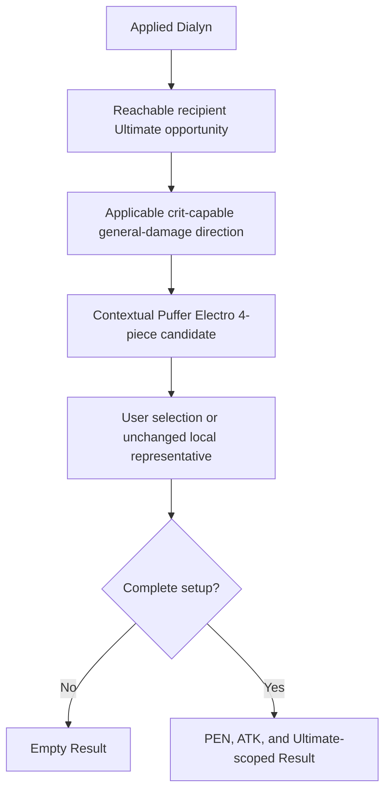

# Dialyn Ultimate Opportunity and Puffer Electro 4-Piece

## Summary

Add one bounded contextual Drive Disc case: a reachable Ultimate opportunity
received from applied Dialyn admits Puffer Electro 4-piece for a current
crit-capable `general_damage` direction whose Ultimate materially uses the
package. Keep every existing local representative as the prepared first choice,
let the user select Puffer directly, and project only Puffer's selected stat and
canonical-Ultimate differences through the current Result boundary.

---

## Problem Frame

The workbench already distinguishes authored base candidates, contextual
candidate additions, prepared first choices, direct edits, and Result
projection. It also owns the general product rule that a recipient-applied
Ultimate opportunity can make a Puffer Electro 4-piece case competitive. What
is not yet settled is the concrete current consumer: Dialyn's Core creates that
opportunity, but the repository retains Puffer Electro only as a 2-piece set and
has no exact recipient, lifecycle, preparation, or Result contract for its
4-piece package.

The closure must not infer the case from Attack Specialty alone. It must begin
from the received Ultimate opportunity and preserve the recipient's authored
formula and action direction. It must also keep Puffer's inherent PEN Ratio
2-piece effect distinct from the Ultimate and ATK effects that make the full
4-piece package competitive, particularly when broad pre-PEN pressure removes
a standalone Puffer 2-piece choice.

The prose requirements govern if this diagram and the text ever differ.

---

## Actors

- A1. Setup workbench user: applies a party, receives a complete prepared
  starting point, may select contextual Puffer Electro, and inspects its current
  Result differences.
- A2. Workbench session: derives effective candidates from the applied party,
  owns authorized preparation and direct-edit lifecycle, preserves
  completeness, and projects selected effects.
- A3. Content author: retains Dialyn's bounded recipient opportunity, the exact
  Puffer package, and the current competitive recipient rule without adding a
  catalogue, runtime ranker, or combat model.

---

## Key Flows

- F1. Contextual candidate admission
  - **Trigger:** The applied party contains Dialyn and a non-Dialyn recipient
    with an applicable crit-capable `general_damage` direction.
  - **Actors:** A1, A2, A3
  - **Steps:** The session derives the received Ultimate opportunity from the
    applied party, checks recipient formula and canonical-action applicability,
    and adds Puffer Electro only to that recipient's effective 4-piece set.
  - **Outcome:** The user can compare Puffer with the recipient's existing
    competitive 4-piece choices without a partner selector or runtime score.
  - **Covered by:** R1-R7
- F2. Preparation and direct editing
  - **Trigger:** Party/Focus Apply, a target Mindscape or pool preparation, or a
    direct Disc edit occurs while the contextual case is reachable.
  - **Actors:** A1, A2
  - **Steps:** Authorized preparation keeps the existing authored local
    representative; a direct edit may select Puffer locally; subsequent
    preparation mutates only the Agents already owned by that lifecycle.
  - **Outcome:** Candidate membership changes without silently changing the
    prepared first choice or allocating a self-only set among recipients.
  - **Covered by:** R8-R16
- F3. Selected Puffer Result
  - **Trigger:** An applicable recipient has a complete setup with Puffer
    Electro 4-piece selected.
  - **Actors:** A1, A2
  - **Steps:** The recipient composes the inherent 2-piece PEN Ratio, the
    canonical Ultimate DMG Bonus, and the post-Ultimate ATK window through the
    existing calculation and action-scope boundaries.
  - **Outcome:** Result shows current Initial, Combat, Fully Enabled, and
    Ultimate differences without final damage, rotation, or uptime modeling.
  - **Covered by:** R17-R21

---

## Requirements

### Dialyn opportunity and recipient applicability

- R1. Dialyn's Core Passive establishes a reachable opportunity in which the
  next non-Dialyn ally switched into Dialyn's qualifying Chain Attack window
  launches an Ultimate instead of that ally's Chain Attack. This recipient
  outcome is available at Dialyn M0-M6. Mindscapes that change Positive Review
  acquisition or add a later triggered effect do not change current candidate
  membership.
- R2. For setup authoring, the opportunity is a recipient-applied canonical
  Ultimate opportunity. The workbench must not retain Positive Reviews as an
  editable resource, expose their cadence or threshold as a gauge, choose the
  combat switch-in recipient, or model how often the opportunity occurs.
- R3. A recipient gains the contextual Puffer Electro 4-piece case only when it
  is a non-Dialyn applied Agent with a crit-capable `general_damage` direction
  and a damaging canonical Ultimate to which Puffer's 4-piece package applies.
  Specialty is not the predicate, Focus is not the recipient allocator, and
  applied slot order does not change membership.
- R4. Under the currently admitted roster and directions, R3 admits Anby:
  Soldier 0, Seed, and Cissia. Anby retains the existing rule that her Ultimate
  is also Aftershock DMG; Puffer changes the Ultimate action without erasing
  that tag. Seed and Cissia consume their own canonical Ultimate outcomes.
- R5. Yixuan is excluded because `sheer_damage` omits Puffer's PEN Ratio axis
  and this closure does not author a separate sheer-direction Puffer package.
  Dialyn, Lucia, Trigger, and Astra Yao are excluded because their current
  retained directions do not make the full personal Ultimate/PEN/ATK package a
  competitive 4-piece case. These are consequences of R3, not a permanent
  named-Agent compatibility matrix.
- R6. When two applicable recipients are applied with Dialyn, each has an
  independently reachable contextual candidate. The workbench does not claim
  that both receive one combat opportunity simultaneously, allocate the next
  switch-in, or add a recipient selector. Each inspected Fully Enabled Result
  remains that Agent's reachable current window.
- R7. Effective candidate admission derives from the applied party identity and
  recipient direction even while another required setup input is incomplete, so
  an incomplete setup cannot hide the candidate needed to repair itself.

### Puffer package and setup policy

- R8. Puffer Electro's inherited PEN, Ultimate-DMG, and post-Ultimate ATK
  package is fully usable by the admitted recipients. A selected 4-piece owns
  its inherent 2-piece effect.
- R9. Setup applies the shared Disc fact's semantic compression. Routine trigger
  and duration detail remains authoring interpretation, not Setup prose or
  runtime uptime state.
- R10. Puffer Electro is a contextual 4-piece addition only. Do not add it to
  any recipient's authored base 4-piece set, add new Puffer 2-piece membership,
  or change any current W-Engine, main-stat, effective-substat, or complementary
  2-piece candidate because of this closure.
- R11. Broad Electric pre-PEN pressure may remove a standalone Puffer Electro
  2-piece candidate and Slot 5 PEN Ratio for its applicable recipient. It does
  not remove the separately authored Puffer 4-piece case: candidate policy
  evaluates that complete package through its inherent PEN Ratio together with
  the newly material Ultimate DMG and ATK axes. Selecting Puffer 4-piece still
  projects its inherent PEN Ratio; pressure changes competitive membership, not
  the selected set's source-stated effect.
- R12. The existing same-set piece-role rule remains unchanged. When Puffer is
  selected as 4-piece, it is not offered as the 2-piece complement. If Puffer is
  already selected as 2-piece and the prior 4-piece cannot legally become the
  complement, the conflicting Puffer 4-piece action remains unavailable until
  the user first selects a different 2-piece; no third set or fallback is chosen.

### Preparation and lifecycle

- R13. Candidate addition does not change a prepared first choice. Party or
  Focus Apply starts Anby from Shadow Harmony, Seed from Dawn's Bloom, and
  Cissia from Dawn's Bloom. The separately authorized Astra-context package
  remains unchanged outside this Dialyn context. Preparation does not
  automatically select Puffer for any recipient.
- R14. A target-only Mindscape or pool preparation rebuilds only that target
  from its existing authored representative. If the target had directly
  selected Puffer, that target preparation may replace it with the representative;
  other Agents remain untouched. Preparing Dialyn at M0-M6 does not invalidate
  or overwrite another Agent's current Puffer selection because the opportunity
  remains reachable across those Mindscapes.
- R15. Directly selecting Puffer changes only the edited recipient's 4-piece and
  any existing same-set piece-role consequence. It does not prepare another
  Agent, rerun Astral/King/Moonlight holder allocation, or choose which ally
  receives a future combat Ultimate.
- R16. Puffer's retained effects are equipper-local and have no same-effect
  party non-stacking rule. Multiple applicable recipients may independently
  select Puffer; this creates no holder-allocation policy.

### Result and calculation boundary

- R17. A complete selected Puffer 4-piece setup projects three current
  relationships with Puffer source identity: inherited PEN Ratio;
  Ultimate-scoped regular DMG Bonus; and post-Ultimate Fully Enabled ATK. The
  Ultimate amount remains
  action-scoped and must not inflate the parent DMG Bonus metric.
- R18. The Ultimate action outcome is canonical and recipient-local. Seed's
  existing Ultimate action composes Puffer with other applicable Seed sources;
  Cissia gains an Ultimate action outcome when Puffer makes it differ from her
  parent metric; Anby's Ultimate composes Puffer as a canonical child action of
  the retained Aftershock outcome, preserving its Aftershock classification and
  other applicable Ultimate clauses without applying Puffer to every
  Aftershock. Basic, Dash, Corrode Bone, Slaughter, and Downfall outcomes do not
  inherit Puffer's Ultimate-only contribution.
- R19. Dialyn's opportunity itself produces no Result operation, stat row, or
  gauge. It changes effective candidate membership, while the selected Puffer
  package supplies the retained numeric Result. Dialyn M6 Aftertone remains
  outside this closure because its repeated attack trigger, raw additional
  damage, and trigger count change no current candidate, prepared setup, or
  self-contained Result outcome admitted here.
- R20. The opportunity predicate is resolved before equipment selection;
  selected Puffer effects then enter the current provider-local and recipient
  projection path. No Result value feeds back into candidate membership or
  preparation, and no new received-effect-dependent outgoing phase, iteration,
  fixed-point solver, runtime scoring, or action-share model is introduced.
- R21. Result stays empty until all three applied setups are complete. Candidate
  addition by itself clears no valid current selection and chooses no fallback.
  Party Apply that removes Dialyn already rebuilds all three setups through the
  existing lifecycle, so it does not preserve an out-of-context Puffer selection.

---

## Acceptance Examples

- AE1. **Covers R1-R4, R7, R10, R13.** Given Seed/Dialyn/Astra is applied,
  Seed's effective 4-piece candidates add Puffer Electro while Dialyn and Astra
  do not gain it. Party Apply still prepares Seed with Dawn's Bloom. Removing
  Dialyn through Party Apply removes the contextual case and prepares the new
  party normally.
- AE2. **Covers R3-R7, R11, R16.** Given Seed/Cissia/Dialyn, both Attack
  recipients expose Puffer Electro 4-piece independently. Cissia's broad
  Electric DEF pressure removes Seed's Slot 5 PEN Ratio and standalone Puffer
  2-piece choices; Cissia's base choices already contain neither input. It does
  not remove either contextual Puffer 4-piece case, and Physical Dialyn's
  residual Slot 5 PEN Ratio remains available.
- AE3. **Covers R3-R6, R13, R16.** Given Anby/Seed/Dialyn in any applied slot
  order and either valid Focus, Anby and Seed both expose Puffer while their
  existing local representatives remain prepared. Focus and slot order neither
  assign the Ultimate opportunity nor choose one Puffer holder.
- AE4. **Covers R3-R5.** Given Yixuan/Dialyn/Lucia, no applied Agent gains
  Puffer 4-piece. Given Yixuan/Dialyn/Cissia, Cissia gains it and Yixuan does
  not. The distinction follows recipient formula/action applicability rather
  than Attack or Rupture Specialty as a universal rule.
- AE5. **Covers R8-R12, R15.** Given Seed has Puffer selected as 2-piece, the
  conflicting Puffer 4-piece control follows the existing legal-exchange rule.
  After the user selects a different 2-piece and then Puffer 4-piece, Setup
  shows `PEN Ratio +8%`, `Ultimate DMG +20%`, and `ATK +15%` without trigger or
  duration prose; unrelated inputs and other Agents are unchanged.
- AE6. **Covers R14-R16, R21.** Given Seed and Cissia both directly use Puffer
  in a party with Dialyn, changing only Dialyn's Mindscape or pool prepares only
  Dialyn and preserves both Puffer selections. Changing only Seed's pool
  reprepares Seed from her local pool representative while Cissia and Dialyn
  remain byte-for-byte unchanged.
- AE7. **Covers R17-R18.** Given complete Puffer setups, Seed, Cissia, and Anby
  each show Puffer's inherited PEN Ratio, post-Ultimate ATK, and
  Ultimate-scoped DMG Bonus at their source-owned values. The Ultimate
  contribution does not appear on their parent DMG Bonus metric or unrelated
  actions.
- AE8. **Covers R17-R18.** Given Seed M4 selects Puffer, Puffer's Ultimate
  contribution and Seed M4's Ultimate +20% remain separate atomic sources in the same
  canonical action outcome. Given Anby selects Puffer, Ultimate appears as the
  canonical child action of the retained Aftershock outcome, and Puffer's source
  applies only to that Ultimate child rather than every Aftershock action.
- AE9. **Covers R19-R20.** Given Dialyn is applied but no Agent selects Puffer,
  no Ultimate-opportunity operation, Positive Reviews gauge, placeholder action,
  or new numeric Result appears. Selecting Puffer changes only the recipient's
  existing calculation and action projection; provider traversal order does not
  change the outcome.
- AE10. **Covers R7, R20-R21.** Given another required selection is incomplete,
  the applicable Puffer candidate remains visible and actionable while Result
  remains empty. Repairing all required selections restores Result without an
  automatic Puffer choice or calculation feedback into Setup.

---

## Success Criteria

- The current recipient rule is closed semantically and admits exactly the
  current Anby, Seed, and Cissia cases without a permanent compatibility matrix.
- Puffer's complete 2-piece/4-piece package, Setup compression, calculation
  surfaces, Ultimate scope, and source disclosure can be planned without new
  fact research.
- Existing local and Astra-context representatives, holder allocation, direct
  edit locality, and incomplete Result behavior remain unchanged.
- Broad pre-PEN pressure distinguishes a standalone 2-piece input from a
  separately competitive complete 4-piece package.
- The feature composes through the current acyclic setup-to-Result flow without
  a rotation model, recipient selector, optimizer, simulator, or new phase.

---

## Scope Boundaries

- No new Agent, W-Engine, Disc identity, image, base candidate family, main
  stat, substat, party preset, or prepared Puffer first choice.
- No runtime Positive Reviews, Chain window, Decibel, combat recipient, action
  frequency, Ultimate count, duration uptime, field time, or damage simulation.
- No Dialyn M6 Aftertone damage, trigger cadence, trigger count, recipient state,
  or raw/final damage output.
- No universal opportunity registry, Specialty-to-Disc rule, action catalogue,
  named-Agent decision tree, compatibility matrix, equipment score, or dynamic
  package ranking.
- No new Result operation category, recipient-allocation UI, holder allocation,
  calculation feedback phase, iteration, or fixed-point dependency.
- No modification of completed implementation plans; implementation planning is
  a separate follow-up after this requirements closure is reviewed.

---

## Key Decisions

- Model Dialyn as supplying a recipient-applied canonical Ultimate opportunity,
  not as a named provider exception and not as an Attack-Specialty rule.
- Admit Puffer to every current semantic recipient independently; do not assign
  the combat switch-in or force one holder when two recipients qualify.
- Keep the change candidate-only. Existing representatives remain the bounded
  deterministic starting points, and the user decides whether to select Puffer.
- Keep Puffer's inherent PEN Ratio visible and calculated when its 4-piece is
  selected, while allowing broad pressure to remove only the standalone
  2-piece candidate input.
- Project the selected package as PEN Ratio, Fully Enabled ATK, and a canonical
  Ultimate action difference. Do not project the opportunity itself.

---

## Dependencies / Assumptions

- [Setup Workbench Product Contract](../setup-workbench-product-contract.md)
  owns candidate stages, contextual opportunity admission, preparation,
  completeness, and Result projection.
- [ZZZ Formula Mechanics](../zzz-formula-mechanics.md) owns general-damage,
  DEF/PEN, ATK, and action-scope composition.
- [ZZZ Game Vocabulary](../zzz-game-vocabulary.md) owns Ultimate, trigger versus
  affected action, and source-local conditions.
- [Source-Fact Boundary](../source-fact-boundary.md) owns the retention gate and
  excludes rotation/cadence detail and raw damage.
- [Workbench UI Design Rules](../workbench-ui-design-rules.md) owns common
  equipment-summary compression and accessible candidate presentation.
- [Seed, Cissia, and Astra Yao Third Vertical](2026-08-09-seed-cissia-astra-vertical-requirements.md)
  remains the owner of those Agents' local candidates, representatives,
  contextual Astral behavior, pressure, action scopes, and existing Results.
- Current release facts and bounded competitive-practice research settled the
  retained meaning above. Research receipts remain ephemeral and are not
  product data.

---

## Outstanding Questions

None. The requirements are ready for a separate implementation plan after user
review.
