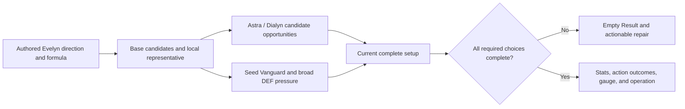

# Evelyn Vertical

## Summary

Admit Evelyn as the next version-2.8-or-earlier setup-workbench vertical with
one complete local representative, bounded competitive equipment choices, and
the current Astra, Seed, Cissia, and Dialyn relationships. Project only her
setting stats, canonical action differences, threshold, and self-contained
operations through the established Result boundary.

---

## Problem Frame

The workbench now supports authored base and contextual candidates, exact
Initial-stat recipient resolution, effect-based candidate pressure, local and
party preparation, and source-bound Result projection. It has not yet admitted
a Fire Attack Focus whose primary setup direction is centered on Chain Attack
and Ultimate, whose signature W-Engine modifies both an action's RES region and
DMG Multiplier, and whose representative can become invalid under an already-
authored Seed Vanguard pressure.

Evelyn is also the first admitted Agent for whom the permanent action-operation
boundary has a direct consumer: her Additional Ability changes the original
DMG Multiplier of Chain Attack and Ultimate when her current CRIT Rate reaches
80%. The workbench must show that operation without reproducing ordinary skill
coefficients or final damage, and without turning her resource loops, shield,
or Mindscape follow-up attacks into a simulator.

The prose requirements govern if this diagram and the text ever differ.

---

## Actors

- A1. Setup workbench user: applies Evelyn in a three-Agent party, receives a
  complete prepared setup, compares bounded alternatives, edits current inputs,
  and inspects the resulting values and action differences.
- A2. Workbench session: owns party and Focus application, preparation,
  effective candidate reconciliation, exact Vanguard resolution,
  completeness, and Result projection.
- A3. Content author: retains only Evelyn and equipment facts that change a
  current candidate, representative, setup choice, calculation, or Result.

---

## Key Flows

- F1. Evelyn party application
  - **Trigger:** The user applies a valid party containing Evelyn.
  - **Actors:** A1, A2, A3
  - **Steps:** The session resolves Focus, prepares every Agent from the
    authored party context, applies any Seed-dependent prepared main-stat
    adjustment, reconciles effective candidates, and calculates the complete
    party.
  - **Outcome:** Evelyn starts from one complete competitive setup and exposes
    the established Setup and Result experience without a new screen.
  - **Covered by:** R1-R9, R14-R18
- F2. Contextual candidate comparison
  - **Trigger:** Applied Astra supplies repeated Quick Assists or applied
    Dialyn supplies the retained recipient Ultimate opportunity.
  - **Actors:** A1, A2
  - **Steps:** The session adds only the authored Astral Voice or Puffer
    Electro case, keeps the prepared Evelyn selection unchanged, and lets the
    user make a local direct choice.
  - **Outcome:** Party context changes what Evelyn can compare without
    allocating a combat recipient or automatically choosing a Disc.
  - **Covered by:** R7-R8
- F3. Threshold and action Result
  - **Trigger:** Evelyn has a complete setup and her retained party condition,
    CRIT Rate, equipment, and Mindscape inputs are evaluated.
  - **Actors:** A1, A2
  - **Steps:** The session projects parent stats, action-scoped DMG/DEF/RES
    regions, the 80% CRIT threshold, and the source-stated action scale at their
    established surfaces.
  - **Outcome:** The user can understand the setup consequence without ordinary
    skill coefficients, resource cadence, uptime, or final damage.
  - **Covered by:** R8-R18

---

## Requirements

**Identity and setup direction**

- R1. Evelyn is a version 1.5 S-Rank Fire Attack Agent admitted within the
  version-2.8 completion boundary. She is Focus-eligible, participates in
  primary `general_damage`, and owns a crit-capable damage-contributor direction
  centered on Chain Attack and Ultimate. Specialty and Attribute do not imply
  another formula family, role, or candidate.
- R2. Retain only the completed level-60 values consumed by the current setup
  and Result: Agent Base ATK 929, CRIT Rate 19.4%, and CRIT DMG 50%. Other
  completed stats do not enter the current candidate, representative, or Result
  policy and are omitted.

**W-Engine candidates and prepared outcomes**

- R3. Evelyn's authored full-pool W-Engine candidates are Heartstring Nocturne,
  Severed Innocence, Cordis Germina, The Brimstone, and Steel Cushion. Her
  non-limited candidates are The Brimstone and Steel Cushion. Full prepares
  Heartstring Nocturne at W1; non-limited prepares The Brimstone at W1.
  Existing source-owned Severed, Cordis, Brimstone, and Steel facts are reused rather
  than duplicated.
- R4. Heartstring's mixed-CRIT and Chain/Ultimate Fire-RES-Ignore package is
  fully compatible with Evelyn and determines the full-pool first choice. Setup
  uses the shared W-Engine fact's compressed package rather than exposing
  entry, stack-acquisition, refresh, or duration prose.
- R5. Steel Cushion retains a legally selectable mixed-CRIT package whose
  back-attack clause has a current Evelyn projector. Its Physical-DMG clause is
  unused by Evelyn but remains visible through the shared complete equipment
  package.

**Drive Discs, main stats, and preparation**

- R6. Evelyn's authored base 4-piece candidates are Hormone Punk and Woodpecker
  Electro. Her authored 2-piece candidates are Branch & Blade Song, Inferno
  Metal, Woodpecker Electro, Puffer Electro, and one member of the authored
  Hormone Punk/Astral Voice ATK% relationship, subject to the existing
  different-set rule. Selecting Hormone Punk 4-piece exposes Astral Voice as
  the legal ATK% complement; selecting Woodpecker 4-piece exposes Hormone Punk
  so its 4-piece swap remains available. Inferno Metal supplies the distinct
  Fire-DMG 2-piece direction and Hormone Punk the prepared ATK direction; both
  derive their values and Setup copy from the shared Disc facts.
- R7. Evelyn's main-stat candidates are Slot 4 CRIT Rate and CRIT DMG; Slot 5
  PEN Ratio, Fire DMG, and ATK%; and Slot 6 ATK%. Her effective-substat choices
  are CRIT Rate, CRIT DMG, and ATK%, using the existing per-hit values. Her local
  full representative is Heartstring W1, Hormone Punk 4-piece, Woodpecker
  2-piece, CRIT DMG / PEN Ratio / ATK% mains, and zero substats. Its bounded
  future CRIT Rate opportunity reaches the defining 80% relationship without
  overfilling the 100% cap. The non-limited representative is The Brimstone
  W1, Hormone Punk 4-piece, Branch & Blade 2-piece, CRIT Rate / PEN Ratio /
  ATK% mains, and zero substats so the same future opportunity reaches 80%.
- R8. Applied Astra's repeated Quick Assist opportunity adds Astral Voice
  4-piece to Evelyn's effective candidates; applied Dialyn's Ultimate
  opportunity adds Puffer Electro 4-piece. Neither opportunity changes her
  authored base set or prepared first choice, ranks the two choices, allocates a
  future combat recipient, or automatically changes Astra's current holder.
  Direct selection remains Evelyn-local and existing non-stacking Result rules
  resolve duplicate Astral holders.
- R9. Material broad pre-PEN pressure removes Evelyn's Slot 5 PEN Ratio and
  standalone Puffer Electro 2-piece. Seed M2's broad Besiege DEF Ignore supplies
  that pressure only when Evelyn is the current Vanguard. Spectral Gaze's broad
  enemy DEF Reduction supplies it through Evelyn's current `general_damage`
  participation; Evelyn identity, Fire Attribute, and Attack Specialty are not
  exceptions. Neither source removes the separately authored contextual Puffer
  4-piece package. Party/Focus Apply and target-only Evelyn preparation use Fire
  DMG as the authored Slot 5 adjustment while either pressure is active so
  preparation stays complete. A target-only provider change or direct edit never
  prepares Evelyn: it clears a newly invalid Evelyn choice without fallback and
  leaves Result empty until repair.

**Agent effects and Mindscapes**

- R10. At Combat, reachable Binding Seal makes Evelyn's completed Core Passive
  add CRIT Rate +25%. The current Result does not retain Binding Seal duration,
  the automatic follow-up, Burning Embers, Burning Tether Points, Dance of
  Awakened Fire, or their generation and spending rules.
- R11. Evelyn's Additional Ability is active when another applied Agent is Stun
  or Support. It adds 30% regular DMG Bonus to Chain Attack and Ultimate. When
  current Evelyn CRIT Rate is at least 80%, it also changes those actions'
  original DMG Multiplier to ×1.25. The scale is a distinct action-local
  operation, not regular DMG Bonus, an ordinary skill coefficient, or final
  damage. A CRIT Rate threshold gauge shows the current qualifying surface and
  scale without feeding Result back into Setup.
- R12. Evelyn Mindscapes apply cumulatively. M1 adds broad 12% DEF Ignore
  against Bound enemies at Combat. M2 adds 15% ATK at Combat. M4 adds 40% CRIT
  DMG at Fully Enabled after a Chain Attack or Ultimate establishes its shield
  condition. M3 and M5 ordinary-skill levels, M1 Decibels, M2 resource return
  and Interrupt change, and the M4 shield amount do not enter the current
  Result.
- R13. M6's follow-up remains classified by its source as Chain Attack DMG for
  applicability, but its additional skill-table coefficient is excluded
  together with its trigger count, duration, and raw or final output. M6 does
  not create a new Result operation, gauge, action total, or rotation model.

**Result projection and mixed parties**

- R14. Evelyn exposes ATK, CRIT Rate, CRIT DMG, regular DMG Bonus, selected PEN
  Ratio, and any nonzero applicable DEF Ignore, DEF Reduction, RES Ignore, RES
  Reduction, or Stun DMG Multiplier region. The retained canonical action
  scopes are Chain Attack and Ultimate as a shared outcome, Ultimate as a
  narrower child when Puffer differs, and Basic Attack plus Ultimate for
  Cordis DEF Ignore. Heartstring Fire RES Ignore applies only to Chain Attack
  and Ultimate. No action effect inflates its parent region.
- R15. Initial contains completed base values, W-Engine advanced stats, mains,
  substats, and inherent 2-piece effects. Combat adds the Core, Additional
  Ability, entry-established Heartstring and Hormone effects, and M1/M2.
  Fully Enabled adds reachable later stacks, action triggers, Woodpecker,
  Puffer, Astral Voice, Steel Cushion, Brimstone, Cordis, and M4. The ×1.25
  operation appears at the earliest current surface whose CRIT Rate reaches the
  threshold. The active gauge names that surface, replaces threshold progress
  with `Active`, and shows `×1.25`. If no surface reaches the threshold, the
  gauge uses Fully Enabled as the closest reachable basis, shows `×1.00`, and
  keeps the operation absent.
- R16. Astra's established general-damage ATK, DMG Bonus, CRIT DMG, and
  applicable enemy-context clauses project through Evelyn's current consumers.
  Spectral Gaze's broad enemy DEF Reduction projects through Evelyn's DEF
  Reduction row by the same `general_damage` applicability that creates its
  candidate pressure; there is no separate named-recipient exception.
  Cissia's party CRIT DMG projects when active, while her Electric DEF Ignore
  and Electric RES Ignore neither project on Fire Evelyn nor remove Evelyn PEN
  candidates. Dialyn's established party and Focus clauses project through
  their existing recipient and formula rules; its Ultimate opportunity itself
  remains candidate-only.
- R17. Evelyn is an eligible non-Seed Attack Vanguard candidate. Resolution
  compares exact unrounded current Initial ATK and uses earlier applied party
  slot only for an exact tie. Seed Core ATK, CRIT DMG, broad Besiege DMG, and M2
  DEF Ignore then deliver by current recipient/formula applicability. The M2
  candidate pressure has no Electric restriction. It removes only PEN inputs,
  which do not contribute to Initial ATK, so candidate reconciliation cannot
  change the Vanguard comparison or require iteration. Preparation, effective-
  candidate reconciliation, and complete Result delivery use one upstream
  exact Initial-ATK observation; that observation remains defined when only a
  pressure-invalid non-ATK PEN input is absent and never substitutes a fallback
  recipient.
- R18. Evelyn adds no received-effect-dependent outgoing phase. Candidate and
  prepared policy remain upstream of selection, selected effects feed the
  existing provider and Agent-local projection path, and Result never feeds
  back. Result remains empty until every applied setup is complete.

**Visible and planning boundary**

- R19. Selected and candidate W-Engine and Disc surfaces use the common
  semantically compressed package and expose the same complete description via
  accessibility relationships. Party Edit, Focus, pool, Mindscape, refinement,
  direct selection, incomplete repair, keyboard focus return, source focus,
  desktop, and narrow behavior remain the existing product flow.
- R20. Tests extend the shared source-owned equipment-summary, mechanism, policy,
  representative-flow, component, and integrated App families. Do not add an
  Evelyn-specific suite, exhaustive named-party matrix, content registry,
  generic effect evaluator, action catalogue, optimizer, simulator, or
  universal uncertainty system.

---

## Acceptance Examples

- AE1. **Covers R1-R7.** Given Evelyn is applied at M0/full, she prepares
  Heartstring W1, Hormone 4-piece, Woodpecker 2-piece, CRIT DMG / PEN Ratio /
  ATK% mains, and zero substats. Non-limited prepares Brimstone W1, Hormone
  4-piece, Branch & Blade 2-piece, CRIT Rate / PEN Ratio / ATK% mains, and zero
  substats. Both preparations are complete and immediately produce Result.
- AE2. **Covers R2, R4-R7, R10-R11, R15.** Given the full representative, the
  selected W-Engine and 2-piece facts compose Initial CRIT with Evelyn's
  retained CRIT. The zero-substat Additional Ability gauge is inactive; two
  CRIT Rate hits cross its threshold and expose the Chain/Ultimate scale
  operation when another Stun or Support Agent is applied. The zero-substat
  non-limited representative remains below the threshold, while the bounded
  future opportunity crosses it without exceeding the formula cap.
- AE3. **Covers R3-R5, R14-R15.** Given Heartstring W1, its selected shared fact
  contributes the entry-established CRIT-DMG and Chain/Ultimate Fire-RES-Ignore
  clauses at their owned surfaces and reaches the complete package at Fully
  Enabled. Changing refinement changes those source-owned values without
  changing candidate membership. Setup omits Base ATK, triggers, stacks,
  duration, and refresh prose.
- AE4. **Covers R6-R8, R19.** Given Evelyn/Astra/another Agent, Astral Voice is
  an effective Evelyn 4-piece candidate while Hormone remains prepared. Given
  Evelyn/Dialyn/another Agent, Puffer is an effective candidate while Hormone
  remains prepared. Given Evelyn/Astra/Dialyn, both candidates appear and no
  automatic choice or ranking occurs. Selected and candidate descriptions are
  accessible and use the same compressed packages.
- AE5. **Covers R8, R14-R16.** Given Evelyn directly selects Puffer, Result
  shows its inherited PEN Ratio, an Ultimate child above the shared
  Chain/Ultimate DMG outcome, and its fully enabled ATK. Given Astral is
  selected, its inherited ATK and reachable entrant DMG use existing
  non-stacking rules even if Astra still holds Astral.
- AE6. **Covers R9, R17-R18.** Given Seed M2/Evelyn/Astra and Evelyn is the sole
  eligible Vanguard, Party Apply prepares Evelyn with Fire DMG rather than PEN
  Ratio and remains complete. Given Evelyn/Trigger/Astra and Trigger prepares
  Spectral Gaze, the same Fire adjustment keeps Party Apply complete because
  Evelyn consumes the broad DEF region through `general_damage`. Changing only
  Seed from M1 to M2 or directly changing Trigger from another W-Engine to
  Spectral Gaze does not prepare Evelyn; an edited PEN selection clears without
  fallback and Result stays empty until the user selects Fire DMG or ATK%.
  Throughout the Seed-incomplete state the same exact Initial-ATK observation
  keeps Evelyn as Vanguard and the invalid PEN candidates stay absent.
- AE7. **Covers R2, R6-R7, R17.** Full representative Evelyn includes Hormone
  Punk's inherited ATK when resolving exact Initial ATK. To make the authored
  Woodpecker 4-piece choice legal, Evelyn first selects Branch & Blade as her
  2-piece and then selects Woodpecker 4-piece. The replacement removes
  Hormone's inherited ATK and leaves Evelyn tied with full representative Anby.
  In Seed/Evelyn/Anby, the
  earlier applied tied slot becomes Vanguard. Reversing provider traversal
  changes nothing; directly selecting Slot 5 ATK on one candidate changes exact
  Initial ATK and re-resolves Vanguard.
- AE8. **Covers R12-R15.** At M4, Evelyn shows M1 12% broad DEF Ignore, M2 15%
  ATK, and Fully Enabled M4 CRIT DMG +40% as separate sources. M1 Decibels, the
  shield amount, and M6 follow-up coefficient produce no Energy, survival,
  operation, raw-damage, or action-total row.
- AE9. **Covers R14-R18.** Given Evelyn/Cissia/Astra, Cissia's Electric DEF and
  RES clauses do not project on Evelyn and do not remove PEN Ratio, while any
  active party CRIT DMG projects through Evelyn's CRIT DMG row. Given
  Evelyn/Seed/Astra, applicable Seed sources project only when Evelyn is the
  resolved Vanguard. Given Evelyn/Trigger/Astra with Spectral Gaze, Evelyn's
  Result shows the broad enemy DEF Reduction and removes PEN Ratio through the
  same formula applicability. Yixuan's Sheer direction does neither. No new
  outgoing feedback phase appears.
- AE10. **Covers R18-R20.** Given a required Evelyn Disc or main stat becomes
  incomplete, the whole party Result is empty while the relevant candidate deck
  remains actionable. Keyboard selection repairs the input, returns focus to
  the fixed surface, and restores the complete Result without changing another
  Agent's direct setup.

---

## Success Criteria

- Evelyn can be implemented without inventing candidate membership,
  representative choices, contextual Disc behavior, Seed pressure, action
  scopes, Mindscape retention, threshold behavior, or Result timing.
- Every retained source changes a current Setup choice or Result; resource,
  survival, raw-coefficient, and rotation-only facts stay outside the product.
- The complete vertical uses the established setup-to-Result flow and shared
  test families, with no Agent-specific framework or new calculation phase.

---

## Scope Boundaries

- No Agent or equipment released after version 2.8; Sigrid and Remielle remain
  deferred pressure tests after the version-2.8 service is complete.
- No Aria/Anomaly admission, Anomaly formula meaning, or use of Aria as an
  efficiency-confirmation run before that meaning is independently established.
- No automatic Astral/Puffer selection, holder reallocation, combat recipient
  selector, runtime equipment scoring, setup optimizer, or per-party ranking.
- No ordinary skill coefficients, raw/final damage, Decibel or Ember economy,
  action cadence, rotation, uptime, duration maintenance, incoming damage,
  shield/healing/survival output, or M6 follow-up total.
- No universal tie policy, candidate registry, action schema, effect evaluator,
  source registry, research archive, or evidence payload.
- Broad visual redesign and general UI/UX polish remain later work; this
  vertical preserves and verifies the current responsive interaction grammar.

---

## Key Decisions

- Balance Slot 4 and the 2-piece per pool against the bounded future CRIT
  opportunity. Full uses Woodpecker plus CRIT DMG because two CRIT Rate hits
  activate the 80% relationship and eight remain below 100%; non-limited uses
  Branch & Blade plus CRIT Rate because its lower engine supply needs that
  stable CRIT Rate base. Prepared counts remain visibly zero.
- Keep PEN Ratio as the local Slot 5 first choice and author Fire DMG as the
  Seed-M2-pressure prepared adjustment, rather than weakening broad pressure or
  allowing an authorized preparation to start incomplete.
- Keep Astral Voice and Puffer Electro as contextual comparisons only. Their
  party opportunities do not silently replace Evelyn's local Hormone package.
- Treat ×1.25 as the first current consumer of the already-authorized
  action-local scale operation, not as a new damage formula or DMG Bonus.
- Close the prior future-admission Vanguard stop with a bounded proof: every
  newly pressure-invalid Evelyn input is a PEN input and therefore cannot alter
  the exact Initial ATK that selected the pressure recipient.

---

## Dependencies / Assumptions

- The five permanent documents under `docs/` remain the only product,
  vocabulary, formula, source-retention, and UI authorities.
- Existing Astra, Seed, Cissia, Dialyn, equipment, lifecycle, and non-stacking
  requirements remain authoritative and are extended only by the explicit
  Evelyn consumers above.
- Exact external evidence was used only during authoring and is not retained as
  a source registry, URL list, rationale payload, or implementation input.

---

## Outstanding Questions

None block planning.
