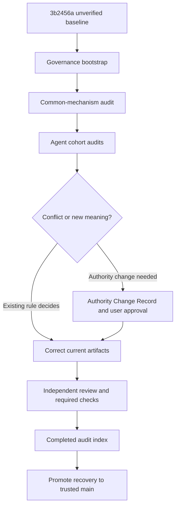

# Authority Governance and Existing-Vertical Recovery Requirements

## Summary

Preserve the current repository as an explicitly unverified baseline, establish
enforceable authority-change and validation governance, and re-audit every
current Agent vertical before promoting a trusted `main` or resuming expansion.

---

## Problem Frame

The repository already recorded permanent product rules for candidate
inspection, Result admission, Setup compression, formula boundaries, selected
pressure, and portrait calibration. Later verticals nevertheless changed or
bypassed those rules, then used requirements, implementation, tests, and review
written from the same conclusion to validate one another. Passing tests proved
fidelity to the new conclusion rather than support from permanent authority.

The repeated failures include shield being treated as a positive damage/setup
axis, Proto Punk re-entering dominated four-piece candidate sets, Caesar's
party damage benefit becoming a generic Agent `DMG Taken` region, holder-specific
`Inactive` labels entering W-Engine selectors, source prose replacing compressed
selector copy, and portrait alignment regressing after visual work was deferred.
An existing workflow learning had already diagnosed secondary requirements
validating themselves, but prose alone did not prevent recurrence.

The latest clean Git snapshot, `3b2456a`, is the 2026-08-15 Grace anomaly
foundation checkpoint. Clean means only that the worktree has no uncommitted
changes. Its current 38 runtime Agent identities and all preceding verticals
remain implementation evidence to audit, not a semantically accepted release
or a permanent content catalogue.

Prose requirements govern if this diagram and the text ever differ.

---

## Actors

- A1. Product owner: owns product decisions, approves permanent-authority,
  governance, shared-semantic, and visual-baseline changes, and remains the
  CODEOWNER for protected paths.
- A2. Controller: derives bounded requirements from permanent owners, classifies
  changes, stops at unresolved meaning, integrates verified work, and cannot
  approve its own authority change.
- A3. Worker: implements only settled bounded behavior and reports any missing
  owner, new shared meaning, or contradiction instead of filling it by analogy.
- A4. Independent semantic reviewer: reconstructs high-risk conclusions from
  permanent rules and current consumers without treating the proposed
  requirement, implementation, or tests as authority.
- A5. Project GitHub App: provides a distinct bot identity for Agent-authored
  branches and pull requests and has no authority or branch-protection bypass.
- A6. Required CI: performs objective policy, behavior, build, and visual checks
  before a protected branch can accept a change.

---

## Key Flows

- F1. Baseline and recovery bootstrap
  - **Trigger:** The product owner authorizes the governance recovery.
  - **Actors:** A1, A2, A5, A6
  - **Steps:** Preserve `3b2456a` with its full history as an unverified baseline;
    create a protected recovery line; establish distinct bot and owner roles;
    enable required checks; keep trusted `main` absent until recovery acceptance.
  - **Outcome:** Current work is recoverable and comparable but is not mistaken
    for an accepted product baseline.
  - **Covered by:** R1, R2, R11, R12, R18

- F2. Existing-vertical audit and correction
  - **Trigger:** Governance bootstrap is ready to evaluate the current baseline.
  - **Actors:** A1, A2, A3, A4, A5, A6
  - **Steps:** Audit shared mechanisms first; review every current Agent by
    formula and Specialty cohort; trace each changed conclusion to its owner,
    consumer, similar case, and contrast; correct artifacts when the existing
    rule decides the outcome; stop for an authority change when it does not.
  - **Outcome:** Every current vertical is either supported by a traceable rule or
    corrected, and the audit index records completed coverage without becoming
    an Agent catalogue.
  - **Covered by:** R3, R4, R8, R9, R14, R15, R16, R17

- F3. Permanent-authority change
  - **Trigger:** A bounded audit or future vertical finds that current permanent
    authority genuinely cannot decide a required product meaning.
  - **Actors:** A1, A2, A4, A5, A6
  - **Steps:** Stop feature work; create one durable change record; independently
    verify its evidence and impact; obtain product-owner approval; change only
    the owning authority in a separate protected change; resume feature work in
    a later change.
  - **Outcome:** A vertical cannot rewrite the rule that is supposed to govern it.
  - **Covered by:** R5, R6, R7, R10, R13, R14

- F4. Settled vertical after recovery
  - **Trigger:** A future Agent reuses accepted meanings without crossing a
    shared-semantic boundary.
  - **Actors:** A2, A3, A4, A5, A6
  - **Steps:** Reference applicable high-risk rules; derive local outcomes from
    current consumers and contrasts; implement on a bot-authored branch; pass
    independent semantic review and all required checks; merge automatically
    only while protected-path approval is not required.
  - **Outcome:** Routine expansion remains autonomous without gaining permission
    to change permanent meaning.
  - **Covered by:** R8, R9, R10, R12, R13, R14

---

## Requirements

**Baseline and recovery scope**

- R1. Preserve commit `3b2456a` and its history as an explicitly unverified
  baseline. Neither a clean worktree, the current runtime roster, passing tests,
  nor a completed milestone may label it a trusted product release.
- R2. Conduct recovery on a protected line distinct from both the unverified
  baseline and trusted `main`. Do not begin another vertical until the recovery
  line satisfies every acceptance condition and is promoted to `main`.
- R3. Audit common mechanisms before Agent cohorts in this order: formula and
  source-to-Result admission; W-Engine eligibility, package, pool, and selector
  meaning; Drive Disc membership, allocation, and exact identity; finite
  substat opportunity and representatives; preparation composition and
  selected-pressure lifecycle; portrait calibration and visual regression.
- R4. Apply the corrected common mechanisms to every Agent identity present at
  the unverified baseline. Preserve a compact completed-audit index containing
  cohort scope and accepted change references, but no permanent Agent fact,
  setup, or guide catalogue.

**Authority and traceability**

- R5. The five permanent Markdown authorities under `docs/` remain the only
  owners of current common product and game meanings. Requirements, plans,
  change records, code, tests, reviews, and milestone summaries remain
  subordinate evidence.
- R6. Preserve each Authority Change Record permanently with one decision,
  context, existing rule, proposed change, evidence, nearest current consumer,
  contrast, impact, status, and approval result. Its status is one of proposed,
  accepted, superseded, or rejected; it records why authority changed but does
  not become another owner of current meaning.
- R7. A vertical may not amend a permanent owner in the same bounded change.
  An accepted authority change requires a separate user-approved change before
  dependent requirements, plans, production code, or tests proceed. Required
  policy checks reject mixed authority-and-feature changes.
- R8. Assign stable rule IDs only to high-risk cross-cutting meanings: formula
  regions, source-fact and Result admission, W-Engine and Drive Disc gates,
  finite investment, preparation and allocation lifecycle, Setup compression,
  portrait acceptance, and authority-change governance. Do not ID every prose
  paragraph or Agent fact.
- R9. Every new or re-audited high-risk conclusion traces the owning rule ID to
  the exact current consumer, nearest similar case, contrasting case, bounded
  candidate or prepared consequence, lifecycle when applicable, visible Setup
  or Result consequence, and behavior verification. Missing support is a stop,
  not permission to infer by guide or implementation analogy.
- R10. Product-owner approval is required for permanent authority, governance,
  CI and protection policy, a new shared formula or Result meaning, a new
  common preparation or allocation mechanism, a common selector-semantic
  change, and an approved visual baseline. Agent-local reuse of settled meaning
  does not require product-owner approval merely because it adds content.

**Repository enforcement and review**

- R11. Use a private repository owned by the product owner and a dedicated
  private GitHub App as the Agent identity. Restrict the App to this repository,
  grant only the permissions needed to push non-protected branches and manage
  pull requests, deny administration and protection bypass, and keep its
  credentials outside the repository.
- R12. Protected-branch acceptance requires governance-policy checks, behavior
  tests, type checking, production build, and stable-environment Playwright
  visual checks when relevant. Local checks provide fast feedback but are not
  the final enforcement boundary.
- R13. A settled Agent-local vertical may merge automatically after independent
  review and all required checks. Any R10 change requires fresh product-owner
  approval after the latest reviewable revision; later changes invalidate the
  prior approval.
- R14. Independent semantic review begins from the permanent owner and current
  consumers rather than the proposed conclusion. It is mandatory for new or
  changed candidate membership, representative choice, formula or recipient
  classification, shared preparation/allocation behavior, Setup semantics, and
  Result admission.
- R15. Tests prove implementation fidelity only after the traced product
  conclusion survives authority and contrast review. Tests derived from the
  same unsupported requirement cannot establish that requirement's validity.

**Visual and learning safeguards**

- R16. A portrait change begins with original-asset inspection and follows the
  fixed calibration order `scale -> headTopY -> faceX`. Human acceptance covers
  desktop and narrow, expanded and compact destinations. Approved Playwright
  baselines then prevent regression in a pinned CI environment; baseline
  changes always require product-owner approval.
- R17. Preserve three distinct recovery artifacts: a reviewed postmortem for
  recurrence and preventive actions, this governance requirements owner for the
  accepted workflow, and individual Authority Change Records for permanent-rule
  corrections. Do not combine them into one self-validating document.
- R18. Promote recovery to trusted `main` only after the full audit index is
  complete, all accepted authority changes precede their dependent corrections,
  known semantic and portrait failures are resolved, independent review passes,
  and every required check is successful.

---

## Acceptance Examples

- AE1. **Covers R5, R6, R7, R10.** Given a future Agent appears to need a new
  formula metric, when its vertical proposes both the metric and implementation,
  policy blocks the mixed change. Work resumes only after a separate accepted
  Change Record and product-owner-approved authority change.
- AE2. **Covers R8, R9, R14, R15.** Given a W-Engine candidate is numerically
  positive, when its holder eligibility, active package, same-pool competitor,
  unused clauses, or finite opportunity fails the permanent gate, neither a
  guide ranking nor passing candidate tests can admit it.
- AE3. **Covers R5, R9, R14.** Given an effect is delivered through enemy
  context, when the source says damage dealt against that enemy rather than an
  independent incoming-damage region, recipient locus cannot rename the effect
  as `DMG Taken`; the formula owner and current contrast decide the category.
- AE4. **Covers R10, R12, R13.** Given a future vertical reuses settled formula,
  equipment, preparation, and UI meanings, when independent review and all CI
  checks pass without a protected semantic path changing, the bot-authored pull
  request may merge without another product decision.
- AE5. **Covers R10, R12, R16.** Given portrait metadata changes, when DOM tests
  pass but original-asset or four-destination visual evidence is absent, the
  change cannot merge. Updating a screenshot to match the change also requires
  product-owner approval rather than automatic baseline acceptance.
- AE6. **Covers R1, R2, R3, R4, R18.** Given current tests pass at `3b2456a`, when
  one cohort or common mechanism remains unaudited, recovery cannot be promoted
  to trusted `main`.
- AE7. **Covers R4, R17.** Given a cohort audit finishes, when its corrections
  are accepted, the current requirement and owner are corrected and the compact
  index links the accepted changes; no permanent per-Agent answer matrix is
  created.

---

## Success Criteria

- A vertical cannot change its own governing permanent rule in the same change.
- Every protected semantic change has a durable decision record, independent
  authority trace, current product-owner approval, and complete impact review.
- Every Agent present at the unverified baseline is covered by the completed
  mechanism-first audit and compact audit index.
- The known shield/Proto, generic Agent `DMG Taken`, W-Engine selector status and
  compression, and portrait alignment failure families are corrected without
  inventing new unsupported policy.
- A routine future vertical can identify its exact governing rules without
  rereading every permanent document or treating current code as authority.
- A portrait regression or unapproved visual-baseline update fails before merge.
- A new controller can distinguish trusted `main`, unverified history, active
  recovery, current authority, and secondary evidence without session history.

---

## Scope Boundaries

- Do not delete or rewrite the existing Git history.
- Do not treat `3b2456a`, the current runtime roster, or the completed milestone
  index as the Version or product-content authority.
- Do not create a permanent Agent setup, source-fact, guide, or audit-answer
  catalogue.
- Do not turn traceability into runtime evidence payloads, registries, scoring,
  or an equipment optimizer.
- Do not re-source every game number when current authority and consumers agree;
  reverify source facts when conflict, uncertainty, or a semantic boundary makes
  it necessary.
- Do not use a local hook as the final protection boundary.
- Do not publish or deploy the private repository as part of this recovery.
- Do not begin Grace follow-on or another vertical before trusted `main` exists.

---

## Key Decisions

- Preserve before correcting: the current snapshot is valuable forensic and
  regression evidence but is not accepted product truth.
- Separate current meaning from change history: permanent owners stay current;
  durable Change Records preserve rationale and approval.
- Enforce narrow IDs and traces: high-risk common meanings receive stable IDs;
  low-risk prose and Agent facts do not acquire administrative overhead.
- Separate identity from authority: the App authors work, CI verifies objective
  gates, and the product owner approves protected meaning.
- Automate recurrence prevention: objective invariants and visuals become
  required checks rather than reminders to pay more attention.
- Audit mechanisms before instances: one corrected common meaning governs all
  cohorts and prevents repeated Agent-by-Agent reinterpretation.

---

## Dependencies / Assumptions

- The product owner can reauthenticate the configured `Min-DongYoung` GitHub
  account and create a private repository and private GitHub App.
- The App private key can be stored securely outside the repository and used to
  mint short-lived installation credentials.
- The selected GitHub plan supports the required private-repository rules,
  CODEOWNER enforcement, and Actions usage; planning must verify the exact
  available controls after authentication.
- Playwright and its pinned browser runtime may be added as development and CI
  dependencies with product-owner approval.
- The initial visual baseline requires a human-reviewed artifact; automation can
  prevent later drift but cannot decide whether the first framing is correct.

---

## Outstanding Questions

### Deferred to Planning

- [Affects R11-R13][Needs research] Which private-repository rules and required
  review controls are available on the product owner's current GitHub plan?
- [Affects R11][Technical] What secure local credential mechanism will provide
  the App private key without storing it in the repository or persistent task
  transcripts?
- [Affects R12, R16][Technical] Which pinned CI runner and browser environment
  gives stable Playwright snapshots while keeping artifacts easy for the product
  owner to inspect?
- [Affects R3, R4][Technical] What cohort size keeps the complete audit reviewable
  without splitting one shared mechanism across conflicting changes?
