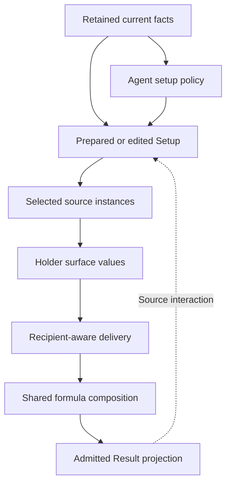

# Shared Source And Calculation Harness Requirements

## Summary

Replace the existing per-Agent calculation verticals with one authority-grounded
source, composition, preparation, and Result harness. Agent-local content keeps
competitive setup policy and genuinely unique relationships while shared game
facts and mechanisms are authored and verified once. Formula participation is
separated into Setup and Result relations because Setup investment and admitted
Result consumption answer different questions; the relations may contain the
same families when their consumers agree. Roles, outcomes, candidates, and
representatives are not duplicated into Agent catalogues.

---

## Problem Frame

The current workbench reached broad Agent coverage through vertical additions.
That made the same stat composition, equipment application, provider delivery,
Mindscape activation, lifecycle, and Result projection meanings appear in many
Agent-local calculators and tests. The duplication obscures whether a branch is
a real game distinction or merely another Agent applying an existing rule, and
it makes later expansion pay an Agent-sized implementation and verification
cost for shared behavior.

Several current secondary requirements and calculations also encode displayed
"per increment" descriptions as integer steps even though the permanent formula
owner defines continuous linear relationships. Existing implementation and
tests therefore cannot be used as the parity authority for this migration.

One current formula-participation model is also asked to represent both the
formula families intentionally strengthened by an Agent's Setup and every
formula family needed by provider applicability or a visible local Result
outcome. Those meanings can differ: an action-local Daze or damage contribution
does not by itself make that formula an investment direction. Treating the two
as one relation can admit unsupported setup axes or erase a retained threshold,
cap, conversion, or other relationship that actually drives a candidate and
representative choice.

The user still needs authored, competitive candidates and one deterministic
complete starting setup per Agent and availability pool. Compression must not
replace those product decisions with a catalogue, runtime optimizer, or generic
formula language.

The prose requirements govern if this conceptual flow and a detailed design
ever differ.

---

## Actors

- A1. Workbench user: applies a party, receives complete competitive starting
  setups, edits them, and inspects current Setup and Result consequences.
- A2. Content author/controller: admits a bounded Agent or equipment unit from
  permanent authority and authors only its current competitive policy and
  retained relationships.
- A3. Shared harness: prepares selections, evaluates sources, distributes
  effects, composes calculations, and projects admitted Result information.

---

## Key Flows

- F1. Apply and prepare a party
  - **Trigger:** A1 applies a complete three-Agent party and Focus choice.
  - **Actors:** A1, A3
  - **Steps:** A3 derives authored and contextual candidates, resolves selected-
    input pressure and equipment allocation in dependency order, prepares one
    complete pool-specific package per Agent, initializes supplied substat
    counts to zero, reconciles selections, and calculates all three Results.
  - **Outcome:** All three Agents have deterministic competitive starting
    setups and visible Results, or Result is empty if any required selection is
    incomplete.
  - **Covered by:** R15, R16, R17

- F2. Edit an applied setup
  - **Trigger:** A1 changes equipment, refinement, a variable main stat, or a
    supplied substat count.
  - **Actors:** A1, A3
  - **Steps:** A3 preserves the direct edit without preparing a replacement,
    clears any newly invalid dependent selection without fallback, evaluates
    holder values from the current setup, delivers effects, and recalculates the
    complete party when selection remains complete.
  - **Outcome:** The Result reflects the current edit and every contribution can
    return to its actual holder and Setup source.
  - **Covered by:** R10, R11, R12, R14, R17

- F3. Author or migrate a content unit
  - **Trigger:** A2 migrates an existing vertical or admits a later bounded
    Agent or equipment unit.
  - **Actors:** A2, A3
  - **Steps:** A2 starts from a qualifying Setup or Result outcome, references
    shared retained facts, authors local candidate and representative policy,
    distinguishes Setup-strengthened formulas from admitted Result formula
    participation, expresses retained effects through current relationship
    kinds, and adds a shared-mechanism test only for genuinely new behavior.
  - **Outcome:** Content extends the common harness without recreating an Agent-
    specific calculator or test catalogue.
  - **Covered by:** R1, R2, R3, R8, R18, R20, R21, R22

---

## Requirements

**Migration and ownership**

- R1. Migrate every current Attack, Rupture, Stun, Support, Defense, and Anomaly
  vertical to the shared harness and remove superseded Agent-specific
  calculation and policy branches. Do not preserve a legacy/new dual execution
  path.
- R2. Separate each Agent's setup policy from its retained source model. Setup
  policy owns the Agent's direction and role judgments, Focus eligibility,
  competitive candidate references, contextual cases, and complete pool
  representatives; it does not copy shared equipment or investment facts.
  Owning a role judgment does not require an Agent-wide production role
  catalogue when no current shared consumer queries that judgment.
- R3. Treat Agent sources, Mindscapes, W-Engines, Drive Discs, main stats, and
  substats as independent contributors to the same downstream composition
  flow. A selected Mindscape cumulatively enables every retained tier at or
  below the selected rank; it is not an embedded Agent-calculator mode.
- R4. Judge migration fidelity from the five permanent authorities and their
  current consumers. Correct subordinate requirements, implementation, and
  tests that conflict with those owners rather than preserving them as legacy
  behavior.

**Shared investment and stat composition**

- R5. Own fixed main-stat values and slot legality once. Slots 1, 2, and 3
  supply their fixed completed main stats automatically; Slots 4, 5, and 6 use
  the Agent's authored candidate references and current editable selections.
- R6. Own each effective-substat hit value once and store only its supplied
  integer count. Prepared counts begin at zero and the editor retains the
  common 0-36 boundary. An authoring allowance such as eight future hits is
  finite opportunity evidence, not a runtime cap, farming promise, prepared
  value, or optimizer input.
- R7. Compose every stat on Initial, Combat, and Fully Enabled surfaces through
  the common base, percentage, and flat regions. Combat and Fully Enabled
  values derive from the completed Initial value plus the applicable combat
  terms; Fully Enabled does not compound a second percentage chain on top of
  Combat. Energy Regen uses the same stat composition, while independently
  retained automatic recovery per second is added afterward as a separate
  calculation operation inside the current Energy-recovery aggregate. Its `/s`
  source remains an independent contribution in the Energy Result row; it does
  not become a percentage input or a standalone Result operation row.
- R8. Keep completed calculation inputs separate from visible source
  relationships. Agent base values, W-Engine Base ATK, and fixed Slot 1-3 main
  stats may be required by calculation without receiving individual Result
  disclosure.

**Relationships, delivery, and projection**

- R9. Express current retained effects through a bounded relationship
  vocabulary covering stat contributions, stat-derived linear relationships,
  action modifier contributions, gauges, replacements or complete state
  operations, and provider delivery. Do not admit arbitrary callbacks, a
  general expression language, or a universal dependency graph.
- R10. Evaluate stat-derived scaling continuously and linearly, including
  fractional progress within a displayed per-increment description. Threshold
  and cap bounds belong only to a relationship that currently needs them; do
  not introduce a generic integer-step, floor, or clamp operation.
- R11. Preserve a stable source definition and the actual selected source
  instance through delivery, composition, non-stacking reconciliation, and
  Result projection. Holder, trigger performer, recipient, formula consumer,
  action or Attribute applicability, and visible source-interaction destination
  remain distinct whenever collapsing them changes a qualifying outcome.
- R12. Re-evaluate independent provider amounts from the current holder's
  local, pre-delivery surface values whenever calculation runs. Preparation
  must not cache provider amounts. After ordinary delivery, preserve exactly
  two current provider-producing derivations in one acyclic pass. Anby: Soldier
  0 reads her completed Fully Enabled CRIT DMG, derives 35% of that value for
  compatible Anby and Trigger Aftershock outcomes, and does not change its own
  basis. Jane Doe reads her completed Fully Enabled Anomaly Proficiency once,
  derives local Passion ATK as `min(max(AP - 120, 0) * 2, 600)`, and derives the
  Assault-only CRIT provider as `min(40 + 0.16 * AP, 100)%` CRIT Rate with 50%
  CRIT DMG for compatible Physical anomaly recipients. Jane's local ATK changes
  no AP, and the Assault provider changes no stat. Deliver the Anby and Jane
  derived providers once, then perform final composition; neither derivation
  is reevaluated after derived delivery or schedules another phase. Five bounded
  recipient-local Result derivations also read completed delivered stats without
  emitting another provider:
  Rupture Sheer Force reads each surface's current ATK and current Max HP, a
  qualified Trigger reads Fully Enabled CRIT Rate for her Aftershock Daze gauge
  and action output, and qualified Evelyn reads completed Combat then Fully
  Enabled CRIT Rate for her existing threshold gauge and earliest qualifying
  action-multiplier operation. Grace's selected Timeweaver reads completed Fully
  Enabled Anomaly Proficiency for its existing 375 threshold, Disorder action
  modifier, and gauge; Burnice's Core reads completed Fully Enabled Anomaly
  Proficiency for its continuous capped Afterburn action modifier and gauge.
  Neither AP consumer emits a stat or provider. None of these consumers
  iterates, feeds back into its basis, or authorizes an arbitrary callback or
  dependency phase.
- R13. Add independent applicable effects normally. Apply a highest-only rule
  only when exact game relationships explicitly share one non-stacking
  identity, resolving the highest reachable value per recipient and consumer.
  Equal winning origins contribute once numerically but all remain visible in
  the breakdown.
- R14. Project only admitted consumers: current stat aggregates, materially
  different canonical-action modifiers, complete operations, and threshold or
  cap gauges. A recipient breakdown shows its directly applied provider source;
  upstream inputs that determined the provider amount remain explained on the
  holder. No-consumer cases create neither hidden shared state nor generic
  Result rows.

**Candidate preparation and lifecycle**

- R15. Candidate and representative policy must continue to compare complete
  W-Engine and Drive Disc packages, fixed main-stat opportunity cost, remaining
  finite substat opportunity, pool availability, holder eligibility, usable
  operating interval, and the nearest same-axis and contrasting alternatives.
  Legal or arithmetically positive items do not enter automatically, and
  preparation does not score arbitrary combinations at runtime.
- R16. Compose authored candidates, contextual candidates, selected-input
  pressure, equipment allocation, representative preparation, zero supplied-
  count initialization, and shared reconciliation in their established
  dependency order. A later pass consumes earlier established holder choices
  and cannot reconstruct them from Agent identity or edit history.
- R17. Party Apply prepares all three Agents together. A pool or Mindscape
  change prepares only the changed Agent while treating the other two as
  established holders. A direct setup edit prepares none. Reconciliation clears
  an invalid selection without fallback, does not restore edit history, and
  leaves Result empty until every required selection is complete.

**Bounded correction and verification**

- R18. Apply the source-fact retention gate to every migrated value and
  distinction. Keep the smallest fact that changes candidate membership,
  preparation, editable choice, party condition, calculation, applicability,
  breakdown, or visible Result; remove facts justified only by completeness,
  future use, an existing field, or a passing test.
- R19. Keep Yuzuha's Slot 4 AP 92 as an always-visible local residual candidate
  after ATK%, with ATK% remaining the prepared first choice. This exception does
  not admit AP substats, AP equipment, a damage-contributor role, personal AP
  Result, or final Disorder calculation. Yuzuha's completed base AP 93 remains
  excluded unless a separate current qualifying consumer is demonstrated.
- R20. Organize verification around shared mechanisms and observable composed
  flows. Retain a small cross-vertical representative set; add an Agent- or
  item-specific regression only for a new mechanism or materially distinct
  visible failure that shared coverage cannot prove. Exact candidate rosters,
  prepared first choices, and retained source-value catalogues remain content
  outcomes rather than duplicated shared test invariants.
- R21. Keep Setup formula participation separate from admitted Result formula
  participation. Author Setup participation first from permanent authority,
  retained relationships, and the direction's intended contribution. It keeps
  the primary and residual categories consumed by candidate and preparation
  pressure and contains only formula families the direction is intended to
  strengthen, including any bounded residual-main-stat consequence already
  admitted by permanent authority. Candidate rosters and representatives then
  validate that participation through their exact downstream choices; they
  cannot create or preserve its premise.

  Result participation is a flat recipient-consumer set established only by an
  independently admitted recipient-local calculation, canonical action or
  target outcome, or explicitly formula-owned parent Result consumer. Inbound
  provider applicability and shared stat or modifier regions consume that set
  but cannot create it. A provider's emitted formula scope remains on its source
  relationship and does not populate the holder's Result participation unless
  the holder has an independent consumer.

  A source relationship such as Initial Energy Regen to DEF Ignore or Impact to
  ATK remains authored once with its calculation and Result consumer; the
  established candidate roster and representative retain its Setup consequence
  without a second `setup-driving` record. Likewise, an action-local outcome
  remains in its source relationship and projection rather than a parallel
  Agent outcome map. The participation carrier, every current entry, candidate
  and preparation consumers, recipient delivery consumer, and affected shared
  verification change atomically without a fallback from missing Result
  participation to Setup participation.
- R22. Limit setup roles to the permanent three meanings: damage contributor,
  daze contributor, and buffer. Author a role first from permanent authority,
  retained relationships, and the direction's intended contribution. Candidate
  and representative policy must then intentionally strengthen it and cannot
  create or preserve the role's premise. Specialty, one damaging action, one
  Daze action, a provider clause, an operating interval, or a legal positive
  stat does not grant a role by itself. Do not add new role names or persist
  every Agent's role assignment merely for completeness. Preserve a role as
  production metadata only when a current shared Focus, candidate, preparation,
  or allocation consumer must query it. Equipment-local thresholds, activation,
  and selected-input pressure remain owned by that equipment and current context
  rather than being copied into the Agent role or direction.

---

## Acceptance Examples

- AE1. **Covers R7, R10.** Given a retained linear relationship described as an
  amount per 100 basis stat, when the current basis is 50 above its baseline,
  the relationship contributes one-half increment rather than zero; presentation
  rounding never feeds back into the calculation.
- AE2. **Covers R3, R11, R14.** Given a Mindscape-unlocked provider effect whose
  holder differs from its recipient, selecting the qualifying Mindscape enables
  the source and the recipient receives the applicable amount. The recipient
  breakdown keeps the holder-prefixed Mindscape source identity; pointer hover
  or keyboard focus highlights the provider Agent slot rather than the recipient
  and does not expand it automatically. Selecting the holder slot exposes the
  local Mindscape distinction.
- AE3. **Covers R12, R17.** Given an applied party with an Initial-ATK-derived
  provider, directly editing the holder's ATK main stat or supplied substat
  count does not reprepare any setup; the current provider amount and every
  eligible recipient Result recalculate from the edited holder setup.
- AE4. **Covers R13.** Given two holders delivering the same explicitly non-
  stacking effect at equal highest value, one value applies to each eligible
  recipient while both actual source origins remain in the numeric breakdown.
  Two unrelated same-axis effects continue to add.
- AE5. **Covers R16, R17.** Given selected-input pressure that invalidates a
  current dependent equipment choice, reconciliation clears that choice without
  fallback and Result becomes empty. Removing the pressure restores candidate
  eligibility but not the former selection; reselecting it works as a new
  direct edit.
- AE6. **Covers R16, R17.** Given a party whose prepared holders compete for two
  non-stacking equipment effects, Party Apply allocates the effects in the
  authored dependency order. Rebuilding one target after a pool or Mindscape
  change treats the other two current holders as established and does not run a
  new simultaneous party allocation.
- AE7. **Covers R18, R19.** Given Yuzuha's setup, Slot 4 exposes ATK% first and AP
  92 second in both pools and at every Mindscape. Selecting AP is reflected as
  the visible setup input, but no personal AP aggregate or Disorder Result is
  created and the unused base AP 93 does not remain solely to justify the
  candidate.
- AE8. **Covers R14, R17.** Given any incomplete required W-Engine, Disc, or
  variable main-stat selection, all party Result remains empty rather than
  projecting partial or generic rows.
- AE9. **Covers R20.** Given a newly migrated Agent whose sources use only
  already-covered stat, delivery, condition, and projection meanings, the
  migration extends shared reference and representative-flow coverage without
  adding an Agent-named calculation suite.
- AE10. **Covers R12, R20.** Given Anby's provider-local Fully Enabled CRIT DMG
  is `L` and independent providers deliver `P` and `Q`, the bounded derived
  phase reads `L + P + Q` once and supplies `0.35 * (L + P + Q)` to each
  compatible Aftershock outcome. Reordering slots or providers preserves the
  value, and the derived clause neither changes its basis nor schedules another
  derivation.
- AE11. **Covers R10, R12.** Given Fully Enabled AP received from an independent
  provider, the completed value can activate Timeweaver at, but not below, 375
  and changes Burnice's continuous capped Afterburn output. Both gauges and
  action differences use the original Timeweaver or Core source, and neither
  result emits another stat, provider, or derived pass.
- AE12. **Covers R11, R12.** Given Seth's ordinary AP delivery raises Jane's
  completed Fully Enabled AP basis from `J` to `J + 100`, the single derived
  pass reads `J + 100` for both Passion ATK and Assault CRIT. Passion ATK changes
  only Jane's ATK, and the Assault provider changes only compatible Physical
  anomaly Assault output. Neither changes AP, derived delivery runs once, and
  final composition does not feed either result back into the basis.
- AE13. **Covers R21, R22.** Given Cissia's current policy, Setup participation
  contains general damage while her retained Initial Energy Regen relationship
  continues to justify Energy Regen as a Slot 6 candidate and prepared first
  choice through its Electric DEF Ignore output. Her Corrode Bone Daze remains
  an admitted action Result through Daze-buildup participation, but it admits
  neither a daze-contributor role nor Impact/Daze setup investment. Given
  Qingyi, Setup participation instead contains primary Daze buildup plus
  residual general damage solely for the already-admitted variable-main-stat
  exception, while Result participation contains both admitted families. She
  preserves Impact as the prepared Slot 6 choice plus the Impact-to-ATK
  relationship; her admitted personal general-damage actions create no
  damage-contributor role or unconditional personal-damage effective-substat
  investment. King selection may add its own CRIT threshold pressure without
  changing either Agent's setup role or Setup formula participation.
- AE14. **Covers R21.** Given Grace, both Setup and Result participation contain
  anomaly damage and anomaly buildup because her authored investment materially
  strengthens both. The split preserves her current candidates,
  representatives, provider applicability, and Result. A contrasting ordinary
  damage Agent does not gain anomaly-buildup participation merely because
  Attribute attacks can produce buildup when the workbench has no admitted
  Setup or Result consumer for that output.

---

## Success Criteria

- A1 sees the same authority-supported competitive choices and Result meanings
  across every migrated Specialty, with corrected continuous relationships and
  intact Apply, rebuild, direct-edit, completeness, and source-Focus behavior.
- A2 can add ordinary future content by authoring retained facts, local setup
  policy, and bounded source relationships without creating another Agent-
  specific calculator or copying shared equipment and investment values.
- Shared tests demonstrate composition and lifecycle once, while the remaining
  Agent-specific cases correspond only to genuinely different mechanisms or
  visible failures.
- Setup investment, provider applicability, and Result admission no longer
  infer one another from a single overloaded formula relation, while existing
  candidates, representatives, and source-local outcomes remain single-owned.
- The completed migration contains no legacy execution path, unused retained
  facts, speculative relationship kinds, or generic Result projections without
  current consumers.
- Planning can divide the migration into bounded units without inventing
  product behavior, admission policy, lifecycle precedence, or Result scope.

---

## Scope Boundaries

- No runtime equipment ranking, package optimizer, farming model, or catalogue
  of every legal Agent, W-Engine, Disc, or stat combination.
- No final damage or Daze totals, rotation, uptime, anomaly application count,
  buildup-share simulation, or combat-state simulator.
- No arbitrary formula callbacks, expression DSL, dependency graph, or cycle
  solver. No post-delivery provider production beyond the exact current Anby
  and Jane derivations, no second derived-delivery pass, and no recipient-local
  derived Result consumer beyond the current Rupture, qualified Trigger,
  qualified Evelyn, Timeweaver, and Burnice cases named by R12.
- No source archive, explanation payload, retained research trail, dormant
  `noConsumer` data model, or generic uncertainty schema.
- No generalization of one residual main-stat choice into a new Agent role,
  equipment direction, substat direction, or Result family.
- No Agent-by-Agent catalogue tests, exact roster snapshots, or duplicated
  outcome tests where shared mechanism and representative-flow coverage already
  establishes the behavior.
- No Agent-wide `setup-driving` or local-outcome inventory, role catalogue,
  automatic candidate generation from formula participation, or copy of an
  equipment-owned threshold, condition, effect, or contextual pressure into
  Agent metadata.
- No unrelated visual redesign. Existing Setup and Result information
  architecture changes only where the shared provenance and corrected behavior
  require it.

---

## Key Decisions

- Full replacement instead of a compatibility bridge: the repository is pre-
  stable and parallel paths would preserve the duplication this work removes.
- Limited declarative relationships instead of per-Agent calculators or a
  general formula language: current consumers need a small repeatable set of
  meanings, not open-ended evaluation.
- Agent-local setup policy with shared source facts: competitive candidate and
  representative choices remain authored product outcomes while fixed game
  values and calculation rules stay single-owned.
- Live pre-delivery holder evaluation instead of prepared snapshots: direct
  edits must recalculate immediately without silently preparing setup again.
- Seven named acyclic post-delivery consumers instead of a general dependency
  phase: Anby emits one derived provider; Jane emits one derived provider and
  one local stat from the same completed AP basis; Rupture, qualified Trigger,
  qualified Evelyn, Timeweaver, and Burnice derive only recipient-local Result
  output. Their exact completed-stat consumers are retained without admitting
  iteration, feedback, or another relationship by analogy.
- Direct-source Result projection instead of recursively flattened provider
  ancestry: each recipient explains what reached it once, while the holder owns
  the calculation that produced the delivered amount.
- Consumer-proven retention instead of data completeness: candidate membership
  can retain a fact without a Result row, but an unused official value cannot.
- Local Yuzuha Slot 4 AP admission instead of a personal-damage vertical: it
  preserves a competitive minority choice without expanding unsupported
  formula and equipment surfaces.
- Separate Setup and Result formula participation instead of one overloaded
  direction map: Cissia and Qingyi keep different investment and visible-output
  meanings, while Grace proves the split does not force artificial differences
  where the two consumers agree.
- Closed role judgments instead of an Agent role catalogue: the permanent three
  roles constrain authoring, but production retains an assignment only for an
  exact current shared consumer.

---

## Dependencies / Assumptions

- The five permanent Markdown authorities remain the sole initial owners of
  product, vocabulary, formula, retention, and UI meaning. Secondary
  requirements are corrected in place when they conflict with those owners.
- Current competitive candidate and representative outcomes remain local
  content decisions unless a fresh authority-grounded review changes them.
- The existing three-Agent party, two W-Engine availability pools, complete-
  selection gate, and three Result surfaces remain the product boundary.
- Exact migration-unit ordering, the exhaustive dead-fact deletion inventory,
  and the mapping of each current source into the bounded relationship
  vocabulary are technical discovery for planning and do not authorize new
  product meanings.
