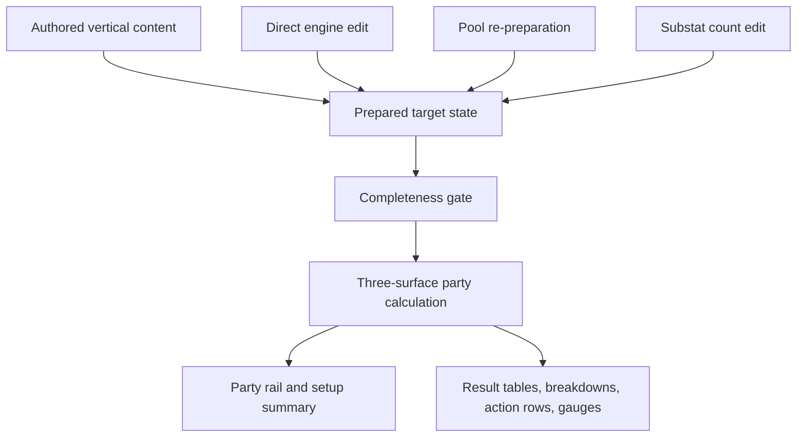

---
title: "feat: Build the first Yixuan setup workbench vertical"
type: feat
status: completed
date: 2026-08-01
---

# feat: Build the first Yixuan setup workbench vertical

## Summary

Build one complete browser-visible setup-workbench loop for the fixed Yixuan -> Dialyn -> Lucia party. The user can compare Yixuan's authored full and non-limited W-Engine pools, directly change the admitted W-Engine, tune four effective substat counts, and immediately read recalculated Initial, Combat Baseline, and Fully Enabled Result values for the whole party.

| User event | Prepared selection behavior | Substat behavior | Result behavior |
|---|---|---|---|
| Direct W-Engine edit | Select that admitted engine at its Rank default | Preserve all four counts | Recalculate immediately |
| Pool switch | Reapply that pool's authored first engine and target setup | Reset all four counts to zero | Recalculate the target and party context |
| Substat count edit | Preserve pool, engine, Discs, and main stats | Change only the edited count | Recalculate immediately |

---

## Problem Frame

The repository currently contains product authorities but no runtime. A contentless foundation or a fixed build card would not prove the product's value: the first checkpoint must show that authored competitive candidates become a prepared setup, remain editable, and change a visually interpretable Result without becoming a catalogue, ranking engine, or combat simulator.

---

## Requirements

- R1. Present the ordered, fixed party Yixuan -> Dialyn -> Lucia with Yixuan as focus and target, and show one complete prepared setup for every member.
- R2. In Yixuan's full pool, expose exactly Qingming Birdcage W1 and Cauldron of Clarity W5, with Qingming Birdcage as the authored first choice; in the non-limited pool, expose only Cauldron of Clarity W5 and prepare it first.
- R3. A direct W-Engine edit applies that engine's Rank-default refinement, preserves Yixuan's current Disc sets, main stats, effective-substat offerings, and counts, then recalculates Result.
- R4. A Yixuan pool switch performs complete target-Agent re-preparation: apply that pool's authored W-Engine and prepared equipment, reset effective-substat counts to zero, and recalculate Result without rebuilding the two partner setups.
- R5. Expose only Yixuan's retained competitive effective substats (CRIT Rate, CRIT DMG, HP%, and ATK%) as count controls from 0 through 36; each count independently contributes its documented per-hit value.
- R6. Show Initial, Combat Baseline, and Fully Enabled Result surfaces, source-level numeric breakdowns, only materially distinct action rows, CRIT/threshold/cap gauges, and party contribution identities for all three Agents.
- R7. Keep Result empty for any internally incomplete required setup, even though the prepared UI enters a complete state.
- R8. Use the product's fixed three-slot party hierarchy, compact setup sequence, result-table conventions, controlled ZZZ visual language, accessible controls, and responsive layouts without horizontal scrolling.
- R9. Prove behavior with pure calculation/state tests, user-facing component tests, and browser-visible verification at desktop and narrow viewport widths.

---

## Scope Boundaries

- Do not implement party composition, filtering, replacement, occupied-Agent disabling, focus changes, Mindscape edits, refinement edits, Disc-set selectors, or main-stat selectors in this checkpoint. Fixed prepared values are summaries, not disabled or decorative controls.
- Do not expose partner W-Engine pools or partner substat tuning. Dialyn and Lucia remain complete prepared context whose current contributions are visible in Result.
- Do not add Agents, W-Engines, Drive Discs, main-stat candidates, or substat candidates beyond the retained vertical.
- Do not build a catalogue, runtime ranking system, universal optimizer, universal game schema, registry, evidence/rationale/history payload, persistence layer, backend, account system, or compatibility layer.
- Do not calculate final damage, final Daze, skill base multipliers, rotations, uptime, enemy simulations, resources, or mutually incompatible combat states.
- Do not add an asset-acquisition or image-processing pipeline. Use only the bounded local SVG identity and equipment artwork needed by this vertical.

### Deferred to Follow-Up Work

- The complete party editor and applied/draft lifecycle.
- Additional target Agents and their authored candidate packages.
- Editing Mindscape, refinement, Disc sets, main stats, and partner setups.

---

## Context & Research

### Repository Instruction and Permanent Authorities

- `AGENTS.md`
- `docs/setup-workbench-product-contract.md`
- `docs/source-fact-boundary.md`
- `docs/workbench-ui-design-rules.md`
- `docs/zzz-formula-mechanics.md`
- `docs/zzz-game-vocabulary.md`

### Retained Vertical Facts

- All three selected S-Rank Agents use M0, level 60, maximum Core Skill, and have no current Potential Awakening.
- Yixuan prepares 4-piece Yunkui Tales + 2-piece Branch & Blade Song, Slot 4 CRIT Rate, Slot 5 Ether DMG, and Slot 6 HP. Her retained effective-substat hit values are CRIT Rate 2.4%, CRIT DMG 4.8%, and HP 3%; the later same-axis authoring correction removed materially weaker ATK%.
- Dialyn prepares Yesterday Calls W1, 4-piece King of the Summit + 2-piece Woodpecker Electro, Slot 4 CRIT Rate, Slot 5 ATK, and Slot 6 Energy Regen. Her zero-substat prepared CRIT Rate is 75.4%, so the King threshold is active and her max-Core combat Impact conversion is visible.
- Lucia prepares Dreamlit Hearth W1, 4-piece Moonlight Lullaby + 2-piece Yunkui Tales, and HP on Slots 4, 5, and 6. Her initial Max HP is 21,697.1, making the resulting Darkbreaker Sheer Force contribution approximately 814.8 of its 900 cap.
- With zero substat counts, full-pool Yixuan has 16,434.1 Initial Max HP, 1,931 Initial ATK, 2,222.71 Initial Sheer Force, 75.4% Fully Enabled CRIT Rate, and approximately 3,366.18 Fully Enabled Sheer Force.
- With zero substat counts, non-limited-pool Yixuan has 16,015.45 Initial Max HP, 1,782 Initial ATK, 2,136.145 Initial Sheer Force, 73.8% Fully Enabled CRIT Rate, and approximately 3,271.25 Fully Enabled Sheer Force.
- Fully enabled party-general DMG contribution is 103% from Dialyn's Additional Ability, Lucia's Core contribution, Moonlight Lullaby, and Dreamlit Hearth. Qingming Birdcage and Yunkui Tales then create distinct Yixuan action-level modifier rows without requiring final-damage simulation.

No external source archive or research receipt is retained; these facts are current implementation inputs, while product meaning remains owned by the permanent authorities.

---

## Key Technical Decisions

- Use a Vite React TypeScript browser application with npm. React's local reducer/state model is sufficient for the explicit edit and re-preparation events; no router, server framework, or state library is warranted.
- Keep authored vertical content in a narrow module containing only the selected party, two target W-Engines, prepared equipment, and consumed effects. Do not abstract toward future roster breadth.
- Keep calculation pure and deterministic. Current selections are inputs and Result is derived on every render; derived Result is never stored, cached, or retained independently.
- Model direct edit and pool switch as separate state events so their preservation/reset semantics cannot blur together.
- Represent all three Result surfaces and source contributions as calculation output, but render no prose rationale or external-source metadata.
- Use semantic HTML and CSS for portraits/identity marks, gauges, cards, and responsive layout. No asset pipeline is needed for this checkpoint.

### Simpler Alternatives Rejected

- Static HTML with one numeric script: rejected because it would embed prepared outputs instead of exercising candidate membership, initialization, state lifecycle, and component-level behavior.
- A full roster/content schema before the first vertical: rejected because no current consumer needs that breadth and it would encourage catalogue and registry behavior.
- Next.js, a backend, or persistence: rejected because this checkpoint has one local page, deterministic authored content, and no server-owned state.
- A generic dependency engine for equipment effects: rejected because neither admitted Yixuan W-Engine changes downstream candidate availability or invalidates a current selection.

---

## Open Questions

### Resolved During Planning

- Current Potential Awakening applicability: none of the three selected Agents currently has one, so no PA calculation or selector is required.
- Direct W-Engine downstream dependency: neither retained engine changes Disc, main-stat, or effective-substat candidate availability; direct edits preserve all downstream choices and counts.
- Prepared first choices and Rank defaults: Qingming Birdcage W1 for full pool and Cauldron of Clarity W5 for non-limited pool.

### Deferred to Implementation

- Exact decorative proportions and breakpoint tuning may be adjusted during browser verification as long as hierarchy, no-horizontal-scroll behavior, and ownership-defined presentation semantics remain intact.

No genuine product decision remains unresolved for this checkpoint.

---

## Output Structure

    index.html
    package.json
    package-lock.json
    tsconfig.json
    tsconfig.app.json
    tsconfig.node.json
    vite.config.ts
    src/
      main.tsx
      vite-env.d.ts
      App.tsx
      app.css
      test/
        setup.ts
      workbench/
        content.ts
        calculate.ts
        calculate.test.ts
        state.ts
        state.test.ts
      components/
        PartyRail.tsx
        TargetSetup.tsx
        ResultPanel.tsx
      App.test.tsx

---

## High-Level Technical Design

> This illustrates the intended approach and is directional guidance for review, not implementation specification. The implementing agent should treat it as context, not code to reproduce.

---

## Implementation Units

- U1. **Introduce the browser and test runtime**

**Goal:** Create the smallest npm/Vite/React/TypeScript runtime that can host and verify the workbench.

**Requirements:** R8, R9

**Dependencies:** None

**Files:**
- Create: `package.json`
- Create: `package-lock.json`
- Create: `index.html`
- Create: `tsconfig.json`
- Create: `tsconfig.app.json`
- Create: `tsconfig.node.json`
- Create: `vite.config.ts`
- Create: `src/main.tsx`
- Create: `src/vite-env.d.ts`
- Create: `src/test/setup.ts`

**Approach:** Use only React, React DOM, Vite, TypeScript, Vitest, jsdom, and Testing Library dependencies. Provide build, test, and development scripts without routing, lint frameworks, or deployment configuration.

**Test scenarios:**
- Integration: the application entry renders the workbench root in jsdom without runtime errors.
- Integration: the production build accepts the same TypeScript modules exercised by tests.

**Verification:** The empty shell starts, builds, and runs the test harness before feature code is added.

---

- U2. **Author the bounded party and prepared setup content**

**Goal:** Encode only the retained current party, roles, W-Engine candidates, prepared packages, and effect values needed by the first vertical.

**Requirements:** R1, R2, R5

**Dependencies:** U1

**Files:**
- Create: `src/workbench/content.ts`
- Test: `src/workbench/calculate.test.ts`

**Approach:** Prefer literal, vertical-specific structures with stable identifiers and numeric values. Candidate order is authored content; no scores, catalogue metadata, evidence fields, registries, or generalized effect interpreter are introduced.

**Test scenarios:**
- Happy path: full pool returns Qingming Birdcage W1 first and also admits Cauldron of Clarity W5.
- Happy path: non-limited pool returns only Cauldron of Clarity W5.
- Happy path: the prepared party order, roles, setup summaries, and four Yixuan effective-substat offerings match the retained vertical facts.

**Verification:** Every retained field has a current calculation or presentation consumer; removing any field would change a visible choice, Result, or setup summary.

---

- U3. **Calculate complete three-surface Result**

**Goal:** Derive the whole party's Result and atomic source breakdowns from the current complete setup.

**Requirements:** R5, R6, R7

**Dependencies:** U2

**Files:**
- Create: `src/workbench/calculate.ts`
- Create: `src/workbench/calculate.test.ts`

**Approach:** Implement the authority-owned stat composition, Rupture Sheer Force conversion, Lucia linear cap, Dialyn CRIT-to-Impact threshold/cap, display cap, mutually compatible fully enabled assumptions, and source-specific modifier regions directly for this vertical. Return no Result when required selections are incomplete.

**Execution note:** Implement the numeric behavior test-first from the retained prepared values and edit deltas.

**Test scenarios:**
- Happy path: Qingming W1 with zero counts produces the retained Initial and Fully Enabled Yixuan Max HP, ATK, Sheer Force, and CRIT values within display precision.
- Happy path: Cauldron W5 with zero counts produces the retained non-limited prepared values and a materially different action-modifier set.
- Happy path: one CRIT Rate count changes CRIT Rate by 2.4 points; one HP% count changes Initial Max HP and both converted Fully Enabled Sheer Force and breakdown amounts; one ATK% count changes ATK and converted Sheer Force; one CRIT DMG count changes CRIT DMG only.
- Edge case: CRIT Rate display never exceeds 100 even when count 36 exceeds the cap.
- Happy path: Lucia's prepared Initial Max HP produces an approximately 814.8/900 Darkbreaker gauge, and Dialyn's prepared 75.4% Initial CRIT Rate produces the current max-Core Combat Impact contribution with its threshold/cap state visible.
- Integration: fully enabled party buffs appear on the correct recipients and surfaces, while mutually incompatible or rotation-dependent effects are absent.
- Error path: a missing required engine, Disc package, main stat, or effective-substat count returns an empty Result.

**Verification:** Tests establish the prepared baselines, per-edit deltas, three surfaces, source identities, gauges, and incomplete-selection gate without final damage or final Daze.

---

- U4. **Implement edit and re-preparation lifecycle state**

**Goal:** Keep direct edit, pool re-preparation, and substat tuning semantics explicit and independently testable.

**Requirements:** R2, R3, R4, R5, R7

**Dependencies:** U2

**Files:**
- Create: `src/workbench/state.ts`
- Create: `src/workbench/state.test.ts`

**Approach:** Store only current user inputs. Initialization and pool switching use authored prepared packages; direct engine selection changes only engine/refinement; substat editing changes one bounded count. Calculation remains outside state.

**Execution note:** Implement state transitions test-first because preservation and reset semantics are product behavior.

**Test scenarios:**
- Happy path: initial state is full pool, Qingming W1, prepared Yunkui/Branch & Blade mains, and three zero counts.
- Happy path: after nonzero counts are entered, directly selecting Cauldron applies W5 while preserving every Disc, main-stat, offering, and count selection.
- Happy path: switching to non-limited pool selects Cauldron W5 and resets all counts to zero without changing Dialyn or Lucia.
- Happy path: switching back to full pool selects Qingming W1 and resets all counts to zero.
- Edge case: decrement at zero remains zero and increment at 36 remains 36.
- Integration: every accepted event yields new calculation input and no event stores stale derived Result.

**Verification:** State tests distinguish preservation from re-preparation and prove count boundaries without introducing a generic equipment dependency system.

---

- U5. **Build and visually verify the setup workbench**

**Goal:** Deliver the full visible prepared setup -> Result -> edit -> recalculation experience at desktop and narrow widths.

**Requirements:** R1 through R9

**Dependencies:** U3, U4

**Files:**
- Create: `src/App.tsx`
- Create: `src/app.css`
- Create: `src/components/PartyRail.tsx`
- Create: `src/components/TargetSetup.tsx`
- Create: `src/components/ResultPanel.tsx`
- Create: `src/App.test.tsx`

**Approach:** Keep the three-Agent party continuously visible, give Yixuan the expanded editable surface, and render partners as truthful prepared summaries. Show current M0 first, then pool context, W-Engine/refinement, Discs, main stats, and substats in authority order. Each W-Engine candidate shows Base ATK, advanced stat, Rank-default refinement, and its consumed passive package; selected Disc summaries show the current set effects without pretending to be selectors. Result uses aligned surfaces, expandable source breakdowns, conditional action rows, and gauges. CSS and bounded local SVG artwork supply the controlled industrial ZZZ identity without an asset pipeline.

**Test scenarios:**
- Happy path: the initial screen visibly identifies the ordered party, focus, complete prepared setups, full pool, both engine candidates, Qingming W1 selection, zero counts, and non-empty Result.
- Happy path: both full-pool W-Engine candidates expose their complete current comparison package, while the prepared Disc and main-stat sections read as summaries rather than disabled controls.
- Happy path: a direct engine click changes the selected badge to Cauldron W5 and Result values while preserving entered counts and static prepared equipment.
- Happy path: a pool click replaces candidate membership, prepares the correct engine, resets counts, and updates Result.
- Happy path: each substat stepper updates its visible count and only the expected Result values/breakdowns.
- Happy path: expanding a Result row reveals numeric source contributions; Qingming shows an additional EX/Ultimate action distinction that is absent when it is not materially different under Cauldron.
- Edge case: controls expose disabled boundary states at 0 and 36 and remain keyboard accessible.
- Integration: an incomplete calculation response removes Result content rather than displaying stale values.
- Browser verification: no horizontal scrolling at 1440x900 and 390x844; the three-slot hierarchy remains legible, controls do not overflow, result columns retain their meaning, focus and selection remain visually obvious, and no static summary is styled as an editable control.

**Verification:** Component tests prove user events and visible consequences; browser inspection proves responsive hierarchy, visual state, and presentation semantics.

---

## System-Wide Impact

- **Interaction graph:** Authored content initializes state; three explicit user-event families update inputs; pure calculation derives one party Result; UI renders setup and Result without secondary state.
- **Error propagation:** Internal incompleteness becomes a null Result and an empty Result region, not partial or stale output. No network or persistence failures exist.
- **State lifecycle risks:** The main risk is conflating direct-edit preservation with pool-switch re-preparation; separate events and tests own that boundary.
- **API surface parity:** There is one browser surface and no external API, CLI, persistence, or agent tool to keep in parity.
- **Integration coverage:** Component tests cover state -> calculation -> presentation; browser verification covers responsive and visual semantics that jsdom cannot prove.
- **Unchanged invariants:** Permanent authority ownership, fixed party order, complete-selection gate, direct-edit preservation, target-only pool re-preparation, and no-final-damage boundary remain unchanged.

---

## Risks & Dependencies

| Risk | Mitigation |
|---|---|
| A narrow vertical accidentally looks like a complete roster tool | Name the target checkpoint, show only genuine controls, and avoid browsing/filtering affordances or disabled future selectors. |
| Result numbers drift from source/surface ownership | Keep numeric baselines and per-edit deltas in pure behavior tests with source-labeled breakdowns. |
| Static partner setups are mistaken for editable fields | Render them as prepared summaries, never as disabled inputs or selector shells. |
| Visual density causes mobile overflow | Use stacked narrow layouts, truncation rules for identity text only, and browser checks at a phone viewport. |
| Greenfield tooling grows beyond the consumer | Limit dependencies and files to the runtime, pure behavior, and visible checkpoint; simplify after tests pass. |

---

## Documentation / Operational Notes

- The permanent authorities are not modified by this checkpoint.
- This plan is an execution artifact, not an additional product authority.
- There is no deployment, migration, monitoring, or persistent-data work.

---

## Sources & References

- `AGENTS.md`
- `docs/setup-workbench-product-contract.md`
- `docs/source-fact-boundary.md`
- `docs/workbench-ui-design-rules.md`
- `docs/zzz-formula-mechanics.md`
- `docs/zzz-game-vocabulary.md`
