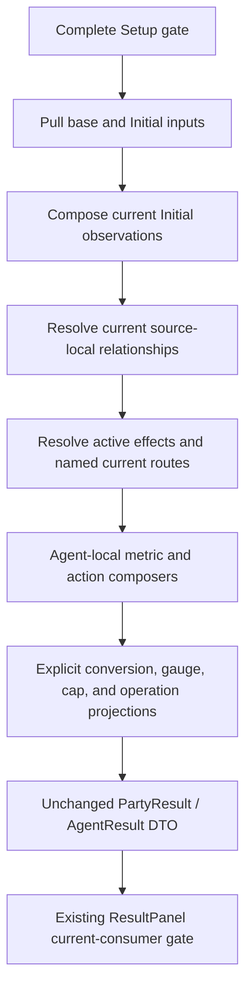
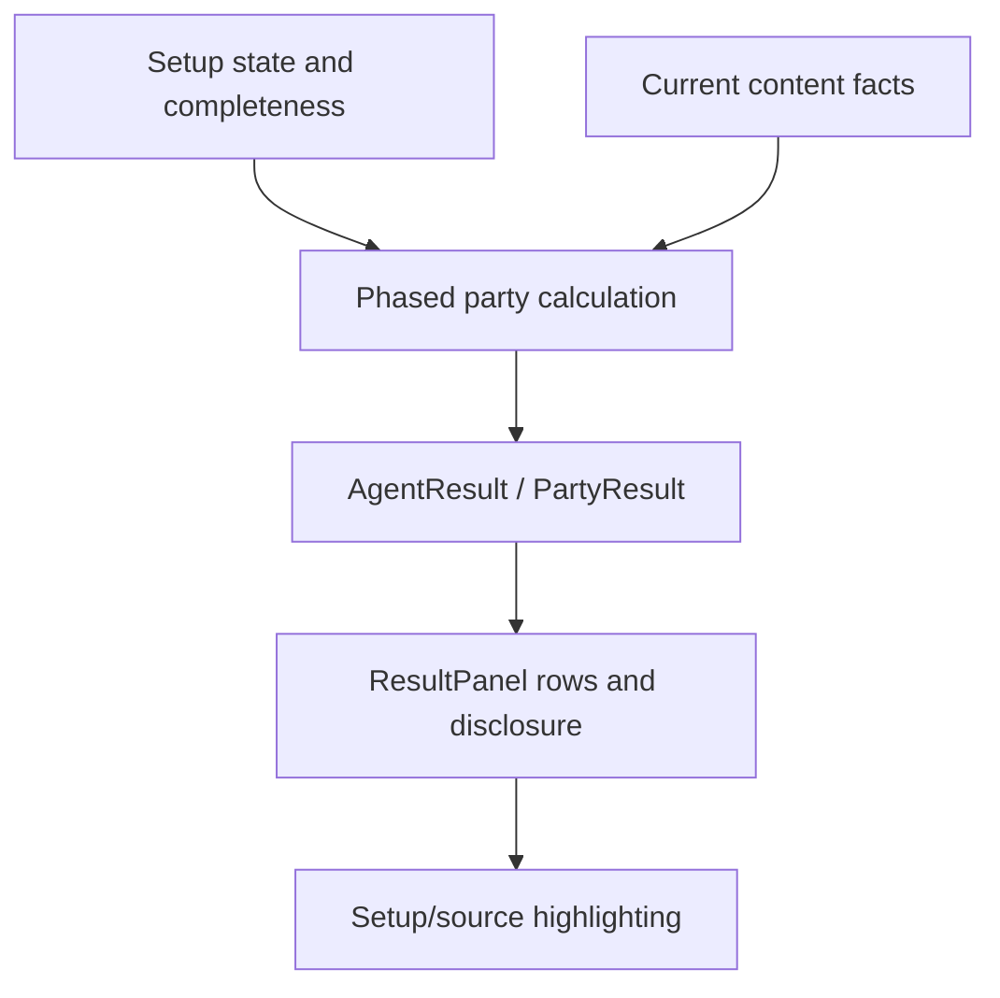

# refactor: Compose retained effects into current Results

## Summary

Replace repeated effect routing and separate aggregate/source authoring with a
bounded current Yixuan-Dialyn-Lucia vertical composition pipeline. Selected providers resolve each
retained active effect once, current Agent routes deliver it to the applicable
Result calculation, and Agent-local composers derive the existing values and
breakdowns without changing the public Result DTO or UI.

---

## Problem Frame

The first semantic-compression refactor single-authored equipment facts and
paired requested numeric Setup inputs with their sources, but deliberately kept
recipient, surface, action, and metric application inside the three Agent
calculators. That boundary preserved behavior, yet it also left the same active
effect represented in an engine-effect field, an aggregate expression, a
breakdown expression, a cross-Agent route, and sometimes an action row.

This manual routing already contributed to omitted Dialyn/Lucia party RES
Ignore and Yixuan action-scoped RES Ignore. Fixing those visible omissions did
not remove the structural cause. The follow-up must compress that cause without
turning the workbench into a universal effect engine.

---

## Requirements

- R1. Preserve the completed Yixuan, Dialyn, and Lucia vertical as the exact
  behavioral and visual baseline (origin R1, R5-R8).
- R2. Resolve each current retained passive, Mindscape, Disc, Agent, and party
  effect once with its active value and exact Result source before composition.
- R3. Keep W-Engine Base ATK and calculator-requested advanced-stat, main-stat,
  effective-substat, and Disc stat inputs pull-based. Candidate-only inputs such
  as Dialyn Slot 5 must not become effects or Result rows.
- R4. Preserve the explicit calculation dependency order: complete gate;
  Initial inputs; Lucia and Dialyn Initial-dependent relationships; current
  cross-Agent effect routes; later surface composition; Agent-local Result
  projection.
- R5. Route effects only to concrete current Agent consumers. Do not introduce
  a generic party/focus/recipient runtime that the fixed current vertical does
  not possess.
- R6. Derive an additive effect's aggregate membership and atomic source
  breakdown from the same resolved effect while preserving cumulative values,
  earliest-surface disclosure, source-defined percentage display, and cap
  adjustment.
- R7. Preserve canonical action scope, action hierarchy, conditional action-row
  presence, source identity, and Attribute/formula applicability.
- R8. Keep Rupture conversion, Dialyn CRIT-to-Impact, Lucia Darkbreaker tiers,
  King threshold value, Energy Regen, CRIT caps, and Stun-duration replacement
  as explicit bounded projections rather than flattening them into addition.
- R9. Preserve the current `AgentResult`/`PartyResult` contract and keep the
  ResultPanel current-consumer row gate as presentation behavior.
- R10. Preserve incomplete-selection behavior, target-only Mindscape/pool
  re-preparation, all candidates and prepared choices, source highlighting,
  responsive layout, keyboard-focus behavior, and overflow (origin R9-R10).
- R11. Add or retain only tests that protect a distinct value, source,
  recipient, surface, action, relationship, lifecycle, or presentation failure;
  add no effect-count, registry-shape, exhaustive snapshot, or helper-existence
  tests (origin R11-R12).
- R12. Introduce no universal effect catalogue, configurable formula engine,
  generic condition language, runtime optimizer, simulator, evidence system,
  persistence, or compatibility layer (origin R7-R8, R15).

**Origin actors:** A1 product owner, A2 controller, A3 bounded worker.

**Origin flows:** F1 baseline audit; F2 bounded improvement handoff.

**Origin acceptance examples:** AE1 preserves similar-looking effects with
different recipients or timing; AE3 keeps behavior-bearing rather than
structure-bearing tests; AE4 leaves semantic decisions with the controller.

---

## Scope Boundaries

- Do not change current game values, candidates, candidate order, prepared
  first choices, Mindscape tiers, W-Engine pools, refinement behavior, Disc
  presentation, main-stat offerings, or effective-substat offerings.
- Do not change `src/workbench/state.ts` lifecycle behavior or add party editing.
- Do not change `src/components/ResultPanel.tsx` row admission, grouping,
  action hierarchy presentation, source highlighting, or source formatting.
- Do not change CSS, responsive allocation, typography, selector presentation,
  portrait calibration, keyboard-focus behavior, or overflow.
- Do not turn every visible Setup selection into a Result contribution.
- Do not infer timing from source category. Each current retained clause keeps
  its resolved Initial, Combat, or Fully Enabled meaning.
- Do not deduplicate effects by source identity or numeric equality. One source
  may own several clauses, while equal values may require separate source rows.
- Do not add a generic `recipient`, `condition`, `stack`, `duration`, or formula
  dispatch record for possible future Agents.

### Deferred to Follow-Up Work

- Dynamic party/focused-character recipient resolution remains deferred until another
  vertical and Party edit create that runtime consumer.
- Any later formula/effect kind extends the closed current representation only
  after that content has a retained current Result consumer.

---

## Context & Research

### Relevant Code and Patterns

- `src/workbench/content.ts` owns current equipment and Agent numeric facts,
  candidate policy, prepared choices, and concise Setup presentation.
- `src/workbench/calculate.ts` owns the complete gate, requested Setup inputs,
  three surface calculations, cross-Agent routing, custom relationships,
  `AgentResult` construction, and action outcomes.
- `src/workbench/calculate.test.ts` already covers every current W-Engine
  package, representative refinement, Disc and main alternatives, Mindscape
  boundaries, relationships, sources, and incomplete selection.
- `src/components/ResultPanel.tsx` consumes the current Result DTO and owns
  current-consumer row admission plus source/action disclosure.
- `src/App.test.tsx` covers conditional rows, source linking, cross-Agent
  disclosure, action hierarchy, and lifecycle integration.
- `docs/plans/2026-08-07-001-refactor-semantic-compression-plan.md` remains the
  completed predecessor plan. Its single-fact, pull-based input, Energy Regen,
  interaction, and no-unconsumed-row decisions remain valid; its prohibition
  on all effect/applicability sharing is superseded only by this bounded plan.

### Institutional Learnings

- `docs/solutions/workflow-issues/preserve-interaction-fidelity-in-ui-explorations-2026-08-05.md`
  reinforces semantic and interaction parity before visual acceptance. It adds
  no calculation abstraction and does not widen UI scope.

### External References

- None. This is a repository-specific product and calculation refactor; current
  authorities and the working consumer settle the design more directly than
  external patterns.

---

## Alternative Approaches Considered

| Approach | Decision | Reason |
|---|---|---|
| Keep Agent calculators unchanged and extract only smaller helpers | Reject | Reduces lines but leaves effect membership duplicated across aggregate, breakdown, recipient, and action paths. |
| Add generic metric/result builders only | Reject | Does not prevent party, surface, or action applicability omissions. |
| Build a data-driven universal effect/recipient/formula registry | Reject | Requires speculative condition and runtime axes, hides current custom relationships, and exceeds the current consumer. |
| Use closed resolved effects addressed to concrete current Agents, with local composers and explicit relationship projections | Choose | Removes the proven routing duplication while preserving current asymmetry and stopping before a universal engine. |

---

## Key Technical Decisions

- **Keep three semantic output channels from Setup providers.** Hidden base
  inputs, requested Initial inputs, and later enabled effects have different
  calculation and disclosure contracts; forcing them into one record would add
  optional fields and invent contributions for candidate-only inputs.
- **Split Disc clauses by behavior, not selected piece identity.** Current
  2-piece/stat clauses remain requested Initial inputs even when the selected
  4-piece supplies that stat and therefore owns the `disc-4pc` source locus.
  Only later enabled 4-piece clauses enter the resolved-effect path.
- **Resolve only active current effects.** Source-local selection, refinement,
  Mindscape, and compatible enabled-window conditions resolve before an effect
  enters composition. There is no persisted condition language or effect
  catalogue.
- **Address current effects to concrete Agent consumers.** Provider/source owner
  remains separate from the receiving Agent. Current named routing expresses
  the fixed vertical honestly and avoids pretending mutable party/focus state
  exists.
- **Keep Result definitions Agent-local.** The three current metric sets,
  gauges, operations, and action hierarchies remain meaningfully asymmetric.
  Shared composers operate on resolved current inputs; no
  `Record<AgentId, GenericMetricDefinition[]>` is introduced.
- **Give the new module one-way contract ownership.** `effects.ts` owns
  `SourceLocus`, `ResultSource`, the complete-setup narrow type, and the source
  factories needed while resolving effects. `calculate.ts` imports these
  one-way and re-exports the public source types so the existing Result/UI
  import contract does not change.
- **Compose aggregate and disclosure together, but not identically.** A composer
  uses one effect collection to produce cumulative surface values and the
  earliest-surface source delta. Relationship `surface-value` disclosure,
  omitted bases, source-defined percentages, Energy `/s`, and cap adjustment
  retain explicit projections.
- **Preserve the calculation/UI filter split.** Internal applicability decides
  which effects enter each Agent calculation. ResultPanel independently decides
  whether the resulting metric currently has a visible consumer.
- **Use current serialized Result behavior as the calculation/DTO parity
  boundary, not a frozen exhaustive snapshot.** Existing targeted tests plus
  new contrary-case tests protect meaningful failures without locking
  incidental object enumeration. App tests and browser checks separately own
  UI interaction and presentation parity.

### Closed Current-Clause Inventory

This list assigns every retained later effect to exactly one current
composition path. It is an implementation checklist, not a runtime registry.

| Path | Current clauses |
|---|---|
| Percentage-point additive/capped | CRIT Rate, CRIT DMG, DMG Bonus, Sheer DMG Bonus, RES Ignore, Daze Bonus, Stun DMG Multiplier |
| Flat stat additive | Radiowave Sheer Force; Chief Sidekick Impact |
| Basis-scaled percentage | Lucia Core and Dreamlit recipient Max HP; Kaboom recipient Base-ATK scaling; Hellfire Gears and Steam Oven base-Impact scaling |
| Energy projection | Initial Energy Regen percentages followed by current `/s` operations |
| Explicit relationship/projection | Rupture; Lucia Darkbreaker and squad Sheer Force; Dialyn capped Initial CRIT-to-Impact; King threshold; CRIT cap adjustment; Yixuan M2 Stun-duration replacement |
| Action-scoped composition | Yixuan Core/Additional clauses; Qingming action Sheer DMG; Puzzle Sphere value/source within the always-present stunned EX outcome; Yixuan M2 and M4 outcomes |

Base ATK, requested advanced/main/effective-substat inputs, current Disc stat
clauses, and fixed Disc values remain outside this inventory on their existing
pull-based or hidden-input paths.

---

## Open Questions

### Resolved During Planning

- **Does the bounded effect path require a generic recipient enum?** No. The
  current state has no mutable party/focus context; effects are delivered to
  concrete current Agent calculation inputs after named distribution.
- **Should Main Stat and Substat inputs become eager effects?** No. Their Initial
  timing is stable, but an unconsumed valid choice must remain absent from
  Result. Existing requested source-bound inputs remain the smaller contract.
- **Should zero metrics be removed inside calculation?** No. The current DTO and
  ResultPanel admission gate remain unchanged.
- **Should custom relationships emit ordinary additive effects?** Only their
  resolved downstream current contribution may enter a compatible composer;
  their basis, tier, cap, replacement, and surface calculation remain explicit.
- **Is a new product decision required?** No. Current authorities and the
  accepted visible Result determine every in-scope behavior.

### Deferred to Implementation

- Exact private helper and closed-union names may follow the existing module
  style. Implementation must stop if the shape begins to require generic
  condition, recipient-context, formula-dispatch, or registry semantics.
- A single new calculation module is expected to be sufficient; the worker may
  keep a very small primitive in `calculate.ts` if a second module would create
  circular or purely organizational indirection.

---

## High-Level Technical Design

> *This illustrates the intended approach and is directional guidance for
> review, not implementation specification. The implementing agent should treat
> it as context, not code to reproduce.*

The graph is acyclic. Lucia Fully HP never feeds Darkbreaker's Initial-HP
basis; Fully Yixuan stats never feed an Initial basis; uncapped CRIT never feeds
Dialyn Impact or King; Result output never feeds setup preparation.

---

## Implementation Units

- U1. **Characterize the effect-to-Result parity boundary**

**Goal:** Complete the smallest missing behavioral coverage before changing
effect routing, using the existing Result contract as the oracle.

**Requirements:** R1, R4-R11; origin F1, AE1, AE3

**Dependencies:** None

**Files:**
- Modify: `src/workbench/calculate.test.ts`
- Modify only if a visible assertion gap remains: `src/App.test.tsx`

**Approach:**
- Reuse existing package, Mindscape, and source tests rather than snapshotting
  every state.
- Add focused contrary cases for current cross-Agent routes, replacement, and
  relationship bases that the structural refactor could silently change.
- Assert observable values, surfaces, source owner/locus/detail, action order,
  and row presence only where each distinction protects a separate failure.
- For later basis-scaled percentages, assert both the derived contribution
  amount and its raw `display` value/unit/decimals tuple.

**Execution note:** Characterization-first. New assertions must pass against the
current implementation before any production calculation code changes.

**Patterns to follow:**
- `src/workbench/calculate.test.ts` current source, Mindscape, King, Energy, and
  incomplete-selection scenarios.
- `src/App.test.tsx` current-consumer and action/source disclosure tests.

**Test scenarios:**
- Integration: Unfettered Game Ball changes Yixuan and Dialyn CRIT Rate while
  creating no Lucia CRIT Rate Result row.
- Integration: Lucia Core HP changes both Yixuan and Lucia Max HP with Lucia as
  source owner, while the Fully HP increase does not feed Darkbreaker.
- Negative: Dialyn party effects do not invent Dialyn personal-damage metrics.
- Replacement: Yixuan M2 replaces Dialyn's displayed Stun-duration source/value
  rather than adding a second operation.
- Relationship boundary: capped Dialyn Initial CRIT feeds both Impact and King;
  uncapped CRIT never leaks into either calculation.
- Display boundary: Lucia Core/Dreamlit Max HP, Kaboom ATK, and
  Hellfire/Steam Impact keep their derived amounts and source-stated percentage
  display.
- Action boundary: M0/M2/M4 and Qingming preserve conditional rows; Puzzle
  Sphere conditionally contributes value/source to the always-present stunned
  EX outcome; hierarchy, labels/order, surface values, and disclosure remain
  unchanged.

**Verification:** Every added test passes before implementation and identifies a
distinct current user-visible or calculation-applicability consequence.

---

- U2. **Resolve source-bound current effects and routes**

**Goal:** Replace naked provider effect values and repeated cross-Agent reads
with one closed current-effect representation delivered to concrete Agent
calculation inputs.

**Requirements:** R1-R5, R7-R8, R10-R12; origin F2, AE1, AE4

**Dependencies:** U1

**Files:**
- Create: `src/workbench/effects.ts`
- Modify: `src/workbench/calculate.ts`
- Test: `src/workbench/calculate.test.ts`

**Approach:**
- Move `SourceLocus`, `ResultSource`, the complete-setup narrow type, and the
  current source factories into `effects.ts`; import them one-way into
  `calculate.ts` and re-export the public source types there.
- Keep `W_ENGINE_FACTS`, `DRIVE_DISC_FACTS`, and `VERTICAL_VALUES` as the current
  source-owned values.
- Resolve selected W-Engine, Disc, Agent, and Mindscape clauses into a closed
  current representation containing only distinctions consumed by this
  vertical.
- Bind every resolved value to its exact `ResultSource` immediately.
- Produce named current routes for Yixuan, Dialyn, and Lucia rather than a
  configurable recipient evaluator.
- Keep Base ATK and requested Initial Setup inputs on the existing pull path.
- Keep current Disc stat/2-piece clauses on that pull path even when their
  source locus is the selected 4-piece; resolve only later enabled 4-piece
  clauses as effects.
- Preserve multiple clauses from one source and separate equal-valued sources.
- Establish the closed contract and migrate one simple routed
  percentage-point family end to end; remove only that family's old route and
  builder branch in this unit. Other families continue through their existing
  paths until U3 or U4 migrates them.

**Patterns to follow:**
- `src/workbench/calculate.ts` `ResolvedSetupInput`, source constructors, and
  current `*EngineEffects` selection logic.
- `src/workbench/content.ts` source-owned equipment facts.

**Test scenarios:**
- Existing-suite acceptance: every current selected W-Engine retains its exact
  refinement value, source detail, surface, and current recipient consequences;
  add only the missing contrary route/source cases below.
- Integration: Lucia party CRIT Rate reaches Yixuan and Dialyn from one resolved
  provider clause while remaining absent from Lucia Result.
- Integration: Dialyn/Lucia M1 RES Ignore arrives at Yixuan with separate source
  rows and cumulative Fully value.
- Edge case: a selected provider with multiple clauses retains each clause's
  distinct target, timing, and action applicability.
- Negative: Dialyn Slot 5 and other current unconsumed valid inputs produce no
  resolved effect, Result source, or new metric.

**Verification:** Provider selection and cross-Agent applicability exist in one
current routing boundary for the migrated slice, while all existing
calculation tests remain green and no duplicate path remains for that slice.

---

- U3. **Compose common metrics from resolved effects**

**Goal:** Starting from the separately pull-composed baseline and Initial
observations, make one resolved effect collection determine each applicable
effect delta, aggregate membership, and atomic source disclosure for current
additive and capped metrics.

**Requirements:** R1-R6, R8-R12; origin AE1, AE3

**Dependencies:** U2

**Files:**
- Modify: `src/workbench/effects.ts`
- Modify: `src/workbench/calculate.ts`
- Test: `src/workbench/calculate.test.ts`

**Approach:**
- Share only proven current composition kinds: additive percentage-point
  metrics, capped additive metrics, flat stat additions, and basis-scaled
  percentage contributions enumerated in the closed current-clause inventory.
- Propagate an effect from its resolved earliest surface into later cumulative
  aggregates while disclosing it only at the earliest surface.
- Generate cap adjustment as a calculation-owned neutral source after applying
  the same resolved additions.
- Preserve existing source order, owner, locus, detail, unit, precision, and
  separate equal-number rows.
- Keep source-defined percentage display separate from the derived absolute
  amount for stat-percentage contributions.
- Retain the existing Energy Regen projector rather than merging `/s` operations
  into ordinary addition.

**Patterns to follow:**
- `src/workbench/calculate.ts` `surfaces`, `cappedAdditions`, `withoutZero`,
  `percentageContribution`, and `energyRegenProjection`.
- `src/components/ResultPanel.tsx` grouping and earliest-source presentation.

**Test scenarios:**
- Happy path: CRIT Rate, CRIT DMG, DMG Bonus, Sheer DMG Bonus, RES Ignore,
  Daze Bonus, and Stun DMG Multiplier retain exact current surface values and
  breakdown sources.
- Cap boundary: already-capped Initial CRIT makes a later party CRIT effect have
  zero net aggregate change with the exact current cap adjustment behavior.
- Disclosure boundary: a Combat effect persists into Fully aggregate without a
  duplicate Fully source line.
- Source boundary: equal amounts from different Agents or Disc pieces remain
  distinct and ordered.
- Basis-scaled boundary: Lucia Core/Dreamlit Max HP, Kaboom ATK, and
  Hellfire/Steam Impact derive from their current recipient basis exactly once
  and retain their raw percentage display tuple.
- Negative: hidden Agent bases, fixed Slots 1-3, and W-Engine Base ATK remain
  absent from breakdown despite affecting aggregates where currently consumed.

**Verification:** No in-scope additive source is separately enumerated in both a
metric value expression and its breakdown expression.

---

- U4. **Route action-scoped effects without flattening relationships**

**Goal:** Reuse resolved effects for current action differences while preserving
Yixuan's authored action hierarchy and every custom relationship projection.

**Requirements:** R1-R2, R4-R12; origin AE1, AE3

**Dependencies:** U3

**Files:**
- Modify: `src/workbench/effects.ts`
- Modify: `src/workbench/calculate.ts`
- Test: `src/workbench/calculate.test.ts`
- Test if visible hierarchy assertions change: `src/App.test.tsx`

**Approach:**
- Keep Yixuan's current action groups, parent relationships, action labels, and
  order Agent-local.
- Let scoped current effects feed the matching action aggregate and breakdown
  without repeating source membership in a second builder path.
- Preserve conditional absence of M2, M4, and Qingming action rows. Keep the
  stunned EX outcome present for every engine; Puzzle Sphere only conditionally
  contributes its value/source to that existing outcome.
- Keep Rupture, Dialyn CRIT-to-Impact, Lucia Darkbreaker, King, Energy Regen,
  CRIT cap, and Stun-duration replacement as explicit named calculations.
- Pass resolved Initial observations and relationship outputs forward once;
  never recalculate them independently in downstream consumers.

**Patterns to follow:**
- `src/workbench/calculate.ts` current `buildYixuanActionModifiers`,
  `calculateLuciaSquadSheer`, `calculateDialynInitialCritRate`, and Agent metric
  construction.
- `src/components/ResultPanel.tsx` action parent comparison and source expansion.

**Test scenarios:**
- Happy path: Qingming EX/Ultimate Sheer DMG and Puzzle stunned EX DMG retain
  exact parent aggregate, timing, and source.
- Mindscape boundary: M2 adds only EX Special/Ultimate Ether RES Ignore; M4 adds
  only the two named EX actions at the current two-stack value.
- Relationship boundary: Lucia M0/M3/M5 tiers keep exact scalar, cap, source,
  gauge, and Yixuan downstream Sheer Force.
- Surface relationship: Yixuan Rupture recomputes once from each surface's
  current ATK/HP and retains `surface-value` disclosure.
- Replacement: Yixuan M2 Stun duration continues to replace Dialyn's displayed
  operation source/value.

**Verification:** Action and relationship tests preserve the current serialized
Result behavior with no generic formula or action registry.

---

- U5. **Finish the phased party calculation and verify the consumer**

**Goal:** Make `calculateParty` the readable phase orchestrator, remove obsolete
effect bags and duplicate party assembly, and prove the unchanged UI consumer.

**Requirements:** R1-R12; origin F2, AE1, AE3, AE4

**Dependencies:** U4

**Files:**
- Modify: `src/workbench/calculate.ts`
- Verify unchanged consumer: `src/components/ResultPanel.tsx`
- Test: `src/workbench/calculate.test.ts`
- Test: `src/App.test.tsx`

**Approach:**
- Preserve the complete gate before any Setup or effect resolution.
- Calculate Initial observations once, resolve current dependent relationships,
  deliver addressed effects, and build the three Agent Results in that order.
- Remove each migrated family's duplicate branch as soon as that family uses
  the new boundary. Remove shared `*EngineEffects`, broad party-part helpers,
  and repeated downstream reads only after their final consumer migrates.
- Keep public Result shapes and App synchronous recalculation unchanged.
- Make no UI or CSS change unless a type-only import move is required.

**Patterns to follow:**
- `src/workbench/calculate.ts` current pure `calculateParty` entry point.
- `src/App.tsx` synchronous state-to-Result calculation.
- `src/components/ResultPanel.tsx` current DTO-only consumer.

**Test scenarios:**
- Integration: the prepared baseline and every existing direct edit keep exact
  current values, sources, action outcomes, gauges, and operations.
- Error path: an incomplete engine, refinement, Disc, main stat, or offered
  substat returns `null` without partial effect resolution or partial Result.
- Lifecycle: Mindscape and pool changes retain current target-only preparation
  behavior and recalculate all three Results.
- Presentation: M0 still hides RES Ignore; M1 effects reveal it; conditional
  action rows, source expansion, source highlighting, and focus remain intact.
- Browser smoke: representative values, conditional rows, action/source
  disclosure, source highlighting, gauges, and empty Result remain correct at
  desktop and narrow widths with no console error. Record incidental unrelated
  layout defects without expanding this internal-refactor scope.

**Verification:** Full tests and production build pass; browser-visible Result
behavior matches the stabilized first vertical; `git diff --check` reports no
errors; no CSS or unrelated lifecycle/content diff exists.

---

## System-Wide Impact

- **Interaction graph:** Setup dispatch and reducer behavior remain unchanged;
  the pure calculation boundary changes internally and returns the same DTO to
  App and ResultPanel.
- **Error propagation:** There is no external failure path. Incomplete setup
  still returns no Result; invalid selections remain reducer concerns.
- **State lifecycle risks:** No state or persistence is added. The principal
  risk is resolving effects before the complete gate or feeding later surfaces
  back into Initial relationships.
- **API surface parity:** The internal `calculateParty` export and current Result
  interfaces remain the only calculation contract.
- **Integration coverage:** Calculation tests prove values/applicability;
  App tests and browser checks prove current row admission, action hierarchy,
  source disclosure/highlighting, focus, and responsive parity.
- **Unchanged invariants:** Candidates, preparation, lifecycle, all three
  surfaces, exact source identities, action ordering, gauge meanings, hidden
  fixed inputs, and UI structure remain unchanged.

---

## Risks & Dependencies

| Risk | Mitigation |
|---|---|
| Closed current effects grow into a universal schema | Permit only current additive/capped clauses; keep Initial inputs and custom relationships outside; stop on speculative optional fields. |
| Recipient abstraction claims unsupported party/focus behavior | Deliver effects to concrete current Agent inputs through named routes. |
| One effect is applied twice after migration | Migrate one current composition family at a time, remove that family's duplicate branch immediately, remove a shared helper after its final consumer migrates, and run focused tests after each unit. |
| Aggregate and breakdown parity diverge | Generate both from the same resolved effect collection and assert exact surface/source consequences. |
| Earliest-source disclosure becomes cumulative disclosure | Keep cumulative values and earliest-surface breakdown as separate outputs of the same composer. |
| Initial-dependent relationships form feedback loops | Enforce the documented acyclic phase order and add basis tests for Lucia, Dialyn, and Rupture. |
| Action hierarchy becomes generic or reordered | Keep action definitions Agent-local and verify parent IDs, labels, order, and conditional absence. |
| UI behavior changes despite numeric parity | Preserve DTO and ResultPanel code; run App tests and a focused real-browser smoke pass over calculation-visible behavior. |

There are no package, network, migration, persistence, or external-service
dependencies.

---

## Documentation / Operational Notes

- The five permanent authorities require no change; this plan implements their
  existing dependency, composition, retention, and presentation meanings.
- The completed predecessor plan remains unchanged. This plan records the
  corrected follow-up boundary rather than rewriting implementation history.
- Do not create an ADR, effect catalogue, registry documentation, migration,
  changelog, compatibility layer, or new reusable learning during implementation.
- Mark this plan completed only after implementation, tests, build, diff review,
  and browser verification succeed.

---

## Sources & References

- **Origin document:** `docs/brainstorms/2026-08-06-first-vertical-completion-review-requirements.md`
- `AGENTS.md`
- `docs/setup-workbench-product-contract.md`
- `docs/source-fact-boundary.md`
- `docs/zzz-game-vocabulary.md`
- `docs/zzz-formula-mechanics.md`
- `docs/workbench-ui-design-rules.md`
- `docs/plans/2026-08-07-001-refactor-semantic-compression-plan.md`
- `docs/solutions/workflow-issues/preserve-interaction-fidelity-in-ui-explorations-2026-08-05.md`
- `src/workbench/content.ts`
- `src/workbench/state.ts`
- `src/workbench/calculate.ts`
- `src/workbench/calculate.test.ts`
- `src/App.test.tsx`
- `src/components/ResultPanel.tsx`
