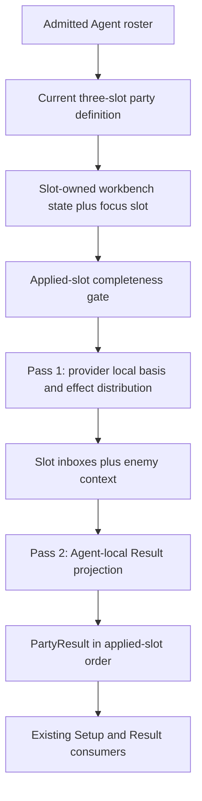
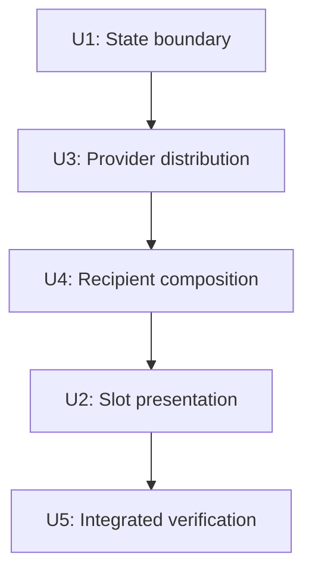
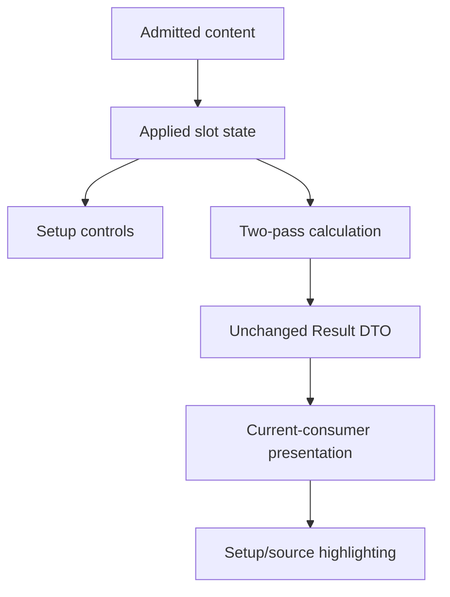

# refactor: Establish the applied-party calculation boundary

## Summary

Replace the current fixed-trio coupling with an exact-three, slot-owned applied party and a bounded two-pass calculation. Existing content and UI components remain the consumer boundary: provider-local effects are resolved and distributed once, then Agent-local projectors compose the unchanged `PartyResult`/`AgentResult` presentation.

---

## Problem Frame

The completed first vertical currently uses the same named-Agent list for content admission, prepared setup ownership, completeness, slot order, focus, layout, and final calculation order. It also reconstructs neighboring providers inside recipient calculators. Those choices preserve the current trio but make a later roster addition or party editor depend on existing Agent names rather than the product's three-slot applied-party boundary.

---

## Requirements

- R1. The admitted Agent roster and the applied party must be distinct concepts. The applied party contains exactly three ordered slots; admitting content does not itself place that Agent in the party.
- R2. Each applied slot owns its current Agent and current setup. The workbench must not keep hidden prepared setup copies for roster Agents that are not applied.
- R3. Completeness must be evaluated only for the three applied setups. Result remains empty until every required selection in those setups is complete.
- R4. Preserve the current setup lifecycle: an applied-Agent, slot-order, or focus change will rebuild all three setups when party editing is later introduced; a Mindscape or availability-pool change rebuilds only the changed slot's Agent setup from the current pool, keeps the other two setups, and recalculates every Result.
- R5. Result order, compact-slot order, keyboard order, expanded-slot selection, and focus must follow applied slot position rather than Agent identity. The viewed/expanded slot is independent from the focus slot: viewing Dialyn or Lucia does not move focus from the current first slot containing Yixuan.
- R6. The current Yixuan, Dialyn, and Lucia party, prepared setups, controls, layout, labels, values, sources, action outcomes, gauges, responsive behavior, and interaction behavior must remain unchanged. No party editor or new identity presentation is introduced in this work.
- R7. Calculation must use two party-wide passes. Pass 1 visits every applied slot to resolve provider-local Initial/basis values and outgoing retained effects, distributing each effect immediately by its recipient policy. A recipient-basis percentage retains its source, recipient, and conversion relationship in this pass rather than pretending to be an absolute amount. Pass 2 visits every applied slot to resolve such relationships from the recipient's local basis and compose its final Initial, Combat, and Fully Enabled Result from local context plus its inbox.
- R8. Provider-local observation and outgoing-effect collection/distribution belong to the same first pass; they must not be split into separate party traversals without a current dependency that requires it.
- R9. Slot traversal order is deterministic output order only. No current Agent's calculated values may depend on whether its slot is visited before or after another slot within the same pass.
- R10. Preserve the current genuine dependency boundaries: Lucia's Initial MAX HP can determine Squad Sheer; Dialyn's Initial CRIT Rate can determine King of the Summit output; recipient surface HP or ATK can determine Rupture conversion; and Stun duration replacement remains explicit non-additive composition.
- R11. Each retained effect must keep its provider, source, recipient, earliest surface, value or conversion relationship, activation, and action scope/outcome meaning needed by the current consumer. Recipient handling must cover only the currently required self, focus-Agent, all-party, other-party, and enemy-context distinctions.
- R12. Delivery and presentation are separate decisions. An effect is delivered according to its recipient, then each Agent-local Result projector consumes it only if it changes that Agent's current setup direction, formula, action difference, visible quantity, breakdown, or gauge.
- R13. An unconsumed or inactive effect must not create a zero row, generic explanation, evidence payload, or placeholder. Existing source disclosure and highlighting appear only with the Result behavior they explain.
- R14. Self effects use the same bounded delivery boundary as cross-Agent effects. No Agent calculator may read another Agent's setup merely to reconstruct an outgoing effect that the provider pass can resolve.
- R15. If later content introduces an outgoing effect whose value depends on any received effect, regardless of surface, implementation must stop and establish an explicit additional phase. This work must not prebuild iteration, fixed-point solving, or a dependency graph for that hypothetical case.

**Origin actors:** A1 setup workbench user, A2 workbench calculation, A3 future content author.

**Origin flows:** F1 current party preparation/editing, F2 complete-party Result calculation, F3 later Agent admission.

**Origin acceptance examples:** AE1-AE9 cover current trio ownership, target-only re-preparation, view/focus independence, recipient-basis calculation, Initial-only provider bases, conditional RES Ignore, Stun replacement, non-applied roster isolation, and recipient-policy behavior.

---

## Scope Boundaries

- Do not add party editing, an Agent picker, draft state, replacement actions, or Cancel/Apply UI.
- Do not research or add Agents, W-Engines, Drive Discs, Mindscapes, formulas, or competitive choices.
- Do not change candidates, candidate order, prepared first choices, current setup controls, Result presentation, or stabilized geometry.
- Do not consolidate rank/portrait/identity presentation or clean Dialyn's equipment alternative copy in this refactor.
- Do not preserve the old `setups` map or `PARTY_AGENTS` semantics as a parallel compatibility API.
- Do not turn the bounded recipient policy or Agent-local projector dispatch into a catalogue, plugin registry, configurable formula engine, universal snapshot, or generic Result-row admission system.
- Do not add general iteration, dependency sorting, event processing, combat timing, rotations, raw/final damage, persistence, or validation for game constraints that have no workbench consumer.

### Deferred to Follow-Up Work

- Party editing and all applied-Agent/order/focus mutations remain deferred until another vertical has been admitted and the user-visible replacement flow is specified.
- Rank and broader identity-presentation consolidation remains deferred until new admitted content creates a concrete non-S-rank or identity-layout consumer.
- A received-effect-dependent outgoing effect requires a new product/calculation decision when such retained content is actually admitted.

---

## Context & Research

### Relevant Code and Patterns

- `src/workbench/content.ts` owns the closed current content facts and currently exports `PARTY_AGENTS`, which conflates admitted identity lookup with active order.
- `src/workbench/state.ts` owns immutable prepared initialization, reducer updates, target-only Mindscape/pool re-preparation, and completeness; its current `Record<AgentId, AgentSetupState>` creates the roster/party coupling.
- `src/workbench/effects.ts` already separates source-bound additive values from recipient-basis percentage relationships and owns current effect/source semantics, but its resolvers read named neighboring setups and lack recipient meaning.
- `src/workbench/calculate.ts` owns the pure complete gate, Initial observations, custom relationships, Agent-local Result construction, and public Result DTO; `calculateParty` currently hard-codes named dependency and output order.
- `src/components/PartyWorkbench.tsx` already supplies one reusable compact/expanded slot skeleton but renders, navigates, focuses, and chooses layout by Agent identity.
- `src/App.tsx` synchronously derives Result from workbench state and owns the viewed slot; this remains the correct place for view-only state.
- `src/components/AgentSetup.tsx` and `src/components/ResultPanel.tsx` use the current party list only for identity lookup; they should use the admitted roster without acquiring party semantics.
- `src/workbench/state.test.ts`, `src/workbench/calculate.test.ts`, and `src/App.test.tsx` already provide behavior-oriented state, formula/source, lifecycle, and interaction coverage.

### Institutional Learnings

- `docs/solutions/workflow-issues/preserve-interaction-fidelity-in-ui-explorations-2026-08-05.md` requires acceptance to preserve current values, actions, selected/open/focus states, peer slots, and overflow before visual cleanliness. Browser verification must exercise state changes, not only capture a clean initial screenshot.

### External References

- None. This is a repository-owned product and calculation-boundary refactor; permanent authorities and current consumers settle the behavior more directly than external patterns.

---

## Alternative Approaches Considered

| Approach | Decision | Reason |
|---|---|---|
| Keep a roster-wide setup map and add a second list for display | Reject | Non-applied Agents would still own hidden prepared state and could leak into lifecycle or completeness. |
| Keep Agent-addressed state actions and recover slot ownership through identity lookup | Reject | It leaves the selected slot implicit and becomes ambiguous as party composition becomes editable. |
| Calculate one Agent completely before visiting the next | Reject | Provider outputs must be available before every recipient composes, and current recipient formulas may consume delivered same-surface HP/ATK. |
| Split observation, effect collection, distribution, and Result composition into three or four global traversals | Reject | Current provider outputs need only provider-local setup and Initial/basis values, so observation and distribution can share pass 1. |
| Build a dependency graph or iterative effect solver | Reject | No current outgoing effect depends on a received effect; the additional machinery has no current consumer. |
| Add a universal effect/formula/Result schema | Reject | Current custom conversions, replacements, action scopes, and row admission remain intentionally Agent-local. |
| Use an exact-three slot state plus a bounded recipient context and two passes | Choose | It removes the proven party/order coupling while preserving every current semantic distinction and stopping at the next real dependency boundary. |

---

## Key Technical Decisions

- **Slot-owned state is the runtime source of truth.** The admitted roster remains content lookup; workbench state holds exactly three ordered slot records, each containing its Agent identity and prepared setup, plus a focus-slot position. Reducer actions target slot position.
- **View state remains presentation-only.** `App` tracks a viewed slot position (or overview) independently from the state-owned focus position. Expanding Dialyn or Lucia does not change focus, setup, or calculation.
- **The existing party is the default value, not a universal constant.** One explicit current applied-party definition initializes Yixuan, Dialyn, and Lucia in that order with Yixuan's slot focused; Result order is derived from state slots thereafter.
- **Pass 1 produces provider contexts and distributed clauses.** Each slot resolves its own Initial/basis observations and active self/outgoing clauses once. Additive amounts may be resolved there; recipient-basis percentages preserve their percentage relationship until a recipient knows its basis.
- **Recipient policy is closed to current product vocabulary.** Self, focus, all-party, other-party, and enemy-context distinctions are sufficient. Character-directed effects enter slot inboxes; enemy-directed effects remain a separate contextual stream so they are not mistaken for Agent stats.
- **Pass 2 remains Agent-local.** A closed Agent-specific projector dispatch consumes the slot's setup/local context, delivered slot inbox, and relevant enemy context, then builds the unchanged `AgentResult`. This is explicit content behavior, not a universal calculator registry.
- **Delivery does not imply presentation.** All-party includes the provider and other-party excludes it, but only a projector with a current setup/formula/action/Result consumer uses the clause. Existing `ResultPanel` row admission remains the final presentation gate.
- **Custom relationships stay explicit.** Rupture resolves after surface HP/ATK delivery; Darkbreaker and Squad Sheer use Lucia Initial HP; Dialyn Impact and King use Dialyn Initial CRIT; Stun duration remains replacement semantics; action-scoped RES Ignore stays in action outcomes.
- **Source ordering remains projector-owned.** Inbox insertion order must not become an implicit presentation contract. Agent-local composition preserves the current source/action disclosure order without adding a generic `presentationOrder` field.
- **No dual state or calculation path.** The old roster-wide setup map, direct cross-Agent setup reads, named top-level result array, and identity-named layout classes are removed in the same migration.

### Bounded Current Recipient Map

This is an implementation migration checklist for the retained first-vertical clauses, not a runtime catalogue. `Squad` sources use all-party delivery even when only one current Agent projector exposes the metric. Enemy-targeted clauses remain enemy context and are consumed only by the current applicable Result/action/operation.

| Provider source family | Recipient policy | Current Result consumption |
|---|---|---|
| Yixuan personal W-Engine passives, Yunkui 4-piece, Core/Additional personal clauses, M1 CRIT Rate, M4 action DMG, M6 Sheer DMG | self | Yixuan's current metrics and action outcomes |
| Yixuan M2 Ether RES Ignore | enemy context with Yixuan action scope | Yixuan EX Special Attack and Ultimate RES Ignore action difference |
| Yixuan M2 Stun extension | enemy context, non-stacking replacement | Dialyn's single Stun-duration operation replaces the lower Dialyn Core value |
| Dialyn personal W-Engine Impact, Daze, and Energy clauses plus Initial-CRIT-to-Impact | self | Dialyn Impact, Daze Bonus, and Energy Regen |
| Dialyn Additional Ability DMG and the `Squad CRIT DMG` clauses from Yesterday Calls and King of the Summit | all party | Yixuan currently consumes the DMG/CRIT DMG; other current projectors omit unsupported rows |
| Dialyn M2 DMG against Malicious Complaint | focus | Current focus Yixuan's DMG Bonus |
| Dialyn Core/M2 Malicious Complaint Stun DMG Multiplier and Core Stun extension | enemy context | Yixuan's Stun DMG Multiplier and Dialyn's Stun-duration operation |
| Dialyn M1 RES Ignore | enemy context | Current applicable Yixuan RES Ignore aggregate; absent at M0 and from non-consuming projectors |
| Lucia personal W-Engine Energy operations | self | Lucia Energy Regen only |
| Lucia Core MAX HP/DMG, Additional CRIT DMG, Darkbreaker Squad Sheer, Dreamlit Hearth MAX HP/DMG, Weeping Cradle DMG, Kaboom ATK, Unfettered Game Ball CRIT Rate, Moonlight DMG, and M2 Sheer DMG | all party | Each projector consumes only its current metrics: Yixuan uses the applicable setup-direction buffs, Dialyn uses current CRIT Rate, and Lucia uses current MAX HP |
| Lucia M1 RES Ignore | enemy context | Current applicable Yixuan RES Ignore aggregate; absent at M0 and from non-consuming projectors |
| Other-party policy | other party | No retained first-vertical clause emits this policy; keep the bounded distributor distinction required by the permanent party authority, without adding a synthetic Result consumer or test-only production effect |

The mapping deliberately separates provider effect admission from Result admission. A selected input that is not retained emits no clause. A retained active clause is delivered by this map even when a current projector does not consume it; non-consumption creates no Result row, action, operation, gauge, source disclosure, explanation, or placeholder.

---

## Open Questions

### Resolved During Planning

- **Is a third calculation pass required?** No. Every current outgoing value depends only on provider setup and provider-local Initial/basis observations; recipient-basis percentages resolve in pass 2.
- **Does viewing another Agent change focus?** No. Focus remains the first applied slot in the current UI; viewed slot is independent presentation state.
- **How should enemy effects travel?** Preserve them as enemy-context clauses available to relevant Agent-local action/operation projectors, rather than representing them as Agent stat buffs.
- **Should source display order follow inbox append order?** No. Preserve current Agent-local semantic order.
- **Is external research required?** No. This refactor changes no game facts or third-party interface.
- **Is there a product blocker?** No. The authorities, completed first vertical, and approved requirements determine every in-scope behavior.

### Deferred to Implementation

- Exact private type/helper names may follow existing TypeScript style. Implementation must stop if they require a general condition language, registry, universal local snapshot, or speculative recipient/formula fields.
- Tests may reuse current fixtures or add the smallest applied-party constructor helper needed to exercise reordered current slots without adding fake production content.

---

## High-Level Technical Design

> *This illustrates the intended approach and is directional guidance for review, not implementation specification. The implementing agent should treat it as context, not code to reproduce.*

The graph remains acyclic. Any future provider output that reads a received effect invalidates this design boundary and requires an explicit new phase decision.

---

## Implementation Units

U1, U3, and U4 are one atomic breaking migration: they may be implemented in that order, but no intermediate state is committed, handed off, or treated as project-green. This avoids both a legacy `setups` compatibility path and a temporarily uncompilable unit boundary. U2 follows only after the state and calculation consumers have migrated.

- U1. **Establish exact-three slot-owned workbench state**

**Goal:** Separate admitted identity content from the applied party and make setup ownership, completeness, focus, and reducer targeting slot-based without changing the default trio or preparation lifecycle.

**Requirements:** R1-R3, R11-R12, R14-R15; origin F1, F3, AE1-AE3, AE8

**Dependencies:** None

**Files:**
- Modify: `src/workbench/content.ts`
- Modify: `src/workbench/state.ts`
- Test: `src/workbench/state.test.ts`

**Approach:**
- Rename the current identity collection to express admitted-roster lookup and remove identity-owned display order that has no content meaning.
- Add the smallest exact-three applied-slot representation, default current party definition, slot position type, and state-owned focus position.
- Store each setup inside its slot and make all reducer actions address that slot. Resolve the Agent identity from the targeted slot before candidate validation or re-preparation.
- Make initialization and completeness traverse only applied slots. Do not retain a parallel roster-wide setups object.
- Preserve current prepared choices, independent per-substat `0-36` controls, target-only Mindscape/pool reset, invalid-selection no-op behavior, and immutable updates.

**Execution note:** Implement state behavior test-first; verify the new tests fail because the old state has no applied-slot ownership before beginning the atomic U1/U3/U4 migration. The focused state test target may pass after U1, but the whole project is not considered green until U4 migrates every state consumer.

**Patterns to follow:**
- `src/workbench/state.ts` immutable `updateSetup`, explicit `createPreparedAgentSetup`, and reducer validation.
- `src/workbench/state.test.ts` target-only lifecycle and rejected-selection cases.

**Test scenarios:**
- Happy path: default initialization creates exactly three ordered slots for Yixuan, Dialyn, and Lucia, with the first slot focused and every current prepared choice unchanged.
- Lifecycle: changing the second slot's Mindscape or pool replaces only that slot's setup while the first and third slot setup objects and selections remain unchanged.
- Edge case: completeness checks exactly the applied slots and returns false when any required selection in one slot is missing.
- Edge case: the same current Agents can be initialized in another slot order with an explicit focus position, without creating a second setup store or deriving focus from identity.
- Error path: an invalid engine, Disc, main-stat, or substat action for the targeted slot remains a no-op.

**Verification:** State tests demonstrate slot-owned preparation, focus, exact-three completeness, and the unchanged target-only reset contract without a legacy setups map.

---

- U2. **Make current slot presentation position-driven**

**Goal:** Render and navigate the existing shared slot skeleton from applied state, while keeping viewed slot separate from focus and preserving the stabilized UI exactly.

**Requirements:** R1-R4, R10, R12, R14-R15; origin F1, AE1-AE3, AE8

**Dependencies:** U4

**Files:**
- Modify: `src/App.tsx`
- Modify: `src/components/PartyWorkbench.tsx`
- Modify: `src/components/AgentSetup.tsx`
- Modify: `src/components/ResultPanel.tsx`
- Modify: `src/app.css`
- Test: `src/App.test.tsx`

**Approach:**
- Track the viewed slot position in `App`; derive its Agent, setup, and Result from the current applied slot. Do not store Agent identity as the view state.
- Pass the applied slots and focus position into `PartyWorkbench`; map, navigate, label tabs/panels, mark focus, and choose expanded-grid columns by position.
- Replace Agent-named layout selectors with position-named selectors while preserving their current grid values and narrow-width collapse.
- Let `AgentSetup` dispatch slot-targeted actions and read the selected slot's setup. Keep Agent identity for content candidates, labels, assets, and source tones.
- Use admitted-roster lookup in `AgentSetup` and `ResultPanel`; do not give those components active-party ownership.
- Preserve all DOM interaction semantics, selector focus return, source tone behavior, copy, current rank treatment, geometry, and overview/expanded behavior.

**Execution note:** Characterize or update interaction assertions before changing the slot/view identity so regressions remain observable throughout the migration.

**Patterns to follow:**
- `src/components/PartyWorkbench.tsx` current shared compact/expanded rendering and roving keyboard handling.
- `src/components/sourceInteraction.ts` source hover/focus semantics.
- `src/App.test.tsx` existing expanded/overview, keyboard, selector focus-return, source-link, and lifecycle integration tests.

**Test scenarios:**
- Happy path: the initial expanded slot is position 1/Yixuan, the focus label and marker remain Yixuan, and the current setup/Result are unchanged.
- Covers AE3. Expanding Dialyn or Lucia changes only viewed position; Yixuan remains the focus and no setup is re-prepared.
- Keyboard: Arrow keys, Home, and End follow applied-slot order, wrap as currently defined, and return focus to the newly selected or collapsed slot control.
- Accessibility: initial selection, Arrow navigation, overview collapse, and Enter reopening preserve exactly one selected/tabbable tab when tabs are active; `aria-controls` and `aria-labelledby` resolve between the selected slot control and visible tabpanel; overview controls keep Agent-specific accessible names.
- Focus contrary case: rendering the current slots with a non-default focus position moves the focus marker to that position without deriving it from Yixuan identity or the first slot.
- Integration: Mindscape/pool and all setup selectors dispatch to the viewed slot, preserve the other slots, recalculate all Results, and retain source highlighting/focus return.
- Negative: identity lookup and Result source labels still use the provider Agent even though slot view/layout state is positional.

**Verification:** App tests preserve current interaction, accessibility, focus-position, and disclosure behavior; the UI diff changes only positional plumbing and equivalent class names, not stabilized content or geometry. Column proportions and narrow collapse remain browser-owned checks rather than CSS-structure assertions.

---

- U3. **Resolve and distribute bounded provider effects**

**Goal:** Give every current retained self/outgoing effect one provider-local resolution path and distribute it by current recipient meaning without reading another Agent's setup.

**Requirements:** R5-R6, R9-R14; origin F2, AE4-AE7, AE9

**Dependencies:** U1

**Files:**
- Modify: `src/workbench/effects.ts`
- Modify: `src/workbench/calculate.ts`
- Test: `src/workbench/calculate.test.ts`

**Approach:**
- Extend the closed current effect/clause representation only with the provider and recipient distinctions consumed now. Preserve existing metric, earliest surface, source, action scope, additive amount, and recipient-basis percentage relationship.
- Build provider-local observations for the applied slot: Lucia Initial HP and Squad Sheer, Dialyn Initial CRIT and King threshold output, and the current setup-local bases/effects for each Agent.
- Resolve every active current self, W-Engine, Disc, Agent, and Mindscape clause from its provider exactly once. Do not resolve a percentage against a recipient basis in this pass.
- Distribute self to the provider slot, focus to the state focus slot, all-party to all slots including the provider, other-party to all slots excluding the provider, and enemy-context clauses to a separate party context available to relevant projectors.
- Keep inactive effects out of inboxes. Preserve separate equal-valued sources and multiple clauses from one source.
- Do not add a generic condition evaluator, targeting DSL, effect catalogue, presentation-order field, or formula registry.

**Execution note:** U3 establishes provider-local resolution and distribution inside the atomic U1/U3/U4 migration. Keep transitional consumption local to the uncommitted batch; U4 switches every family to inbox consumption and removes its former direct route in the same change before the calculation suite is treated as green.

**Patterns to follow:**
- `src/workbench/effects.ts` `SourceBoundCurrentClause`, `ResolvedCurrentEffect`, source factories, active-clause filtering, and basis-percentage representation.
- `src/workbench/calculate.ts` current Initial observation helpers and complete gate.

**Test scenarios:**
- Covers AE9. A self effect reaches only its provider; an all-party effect includes its provider; a focus effect reaches only the configured focus slot; and an enemy-context effect is not represented as an Agent stat addition. Do not add a synthetic Result effect solely to exercise the currently unused other-party branch.
- Integration: with a non-default focus position, Dialyn M2's current focus-recipient effect follows that slot rather than Yixuan identity or slot 1; changing only the viewed slot does not affect delivery.
- Integration: Lucia party HP/ATK percentages retain the provider source and raw percentage until each recipient's local basis resolves them.
- Integration: Dialyn M1 and Lucia M1 enemy-context RES Ignore remain separate sources and reach only current Result consumers; Yixuan M2 remains action-scoped.
- Edge case: one provider/source with multiple current clauses preserves each clause's recipient, surface, action, and source detail independently.
- Negative admission: a selected input that is not retained, or an inactive retained clause, emits no effect and creates no Result value, row, action, operation, gauge, source disclosure, or explanation.
- Negative consumption: a retained active all-party clause is still delivered to a current non-consuming projector, but that projector creates no Result value, row, action, operation, gauge, source disclosure, explanation, or placeholder.

**Verification:** No provider resolver reads another slot's setup, every current cross-Agent clause has one recipient-owned path, and focused calculation tests retain exact current values and source identities.

---

- U4. **Compose Agent Results from local context and inboxes**

**Goal:** Make `calculateParty` a two-pass applied-slot orchestrator and make each Agent-local projector consume only local setup/context plus delivered clauses while preserving the public Result contract.

**Requirements:** R5-R13, R15; origin F2, AE4-AE7, AE9

**Dependencies:** U3

**Files:**
- Modify: `src/workbench/effects.ts`
- Modify: `src/workbench/calculate.ts`
- Test: `src/workbench/calculate.test.ts`

**Approach:**
- Keep the complete applied-party gate before any provider or Result calculation.
- Pass 1 maps applied slots to provider-local contexts and distributes their clauses. Pass 2 maps the same slots in output order to a closed Agent-local projector dispatch.
- Resolve recipient-basis percentage clauses against the recipient's basis, compose received HP/ATK into each surface, then run Rupture for that surface and add direct Sheer effects.
- Preserve Initial-only bases for Lucia Darkbreaker/Squad Sheer and Dialyn CRIT-to-Impact/King; received later-surface effects never feed those provider outputs.
- Keep CRIT cap adjustment, Energy `/s`, gauges, action hierarchy, and Stun-duration replacement as explicit projectors.
- Let Agent projectors filter delivered clauses to current metric/action/operation consumers and preserve current semantic source order. Do not add zero metrics or generic Result rows to represent delivery.
- Remove the named top-level Yixuan/Dialyn/Lucia result array, direct cross-Agent setup reads, obsolete route parameters, and duplicate effect assembly after their last consumer migrates.
- Preserve `PartyResult`, `AgentResult`, and all nested public presentation shapes.

**Patterns to follow:**
- `src/workbench/calculate.ts` current `surfaces`, capped composition, percentage contribution, energy projection, action builders, gauges, and explicit relationship calculations.
- `src/components/ResultPanel.tsx` current row admission, action hierarchy, source grouping, and source-tone contract.

**Test scenarios:**
- Happy path: the prepared baseline retains every current Initial/Combat/Fully value, breakdown source/order/detail, action, operation, and gauge.
- Order boundary: reorder the current three applied slots while keeping Yixuan as focus; `PartyResult.agents` follows slot order, while per-Agent numeric/source outcomes remain the same.
- Disclosure-order contrary case: activate same-metric contributions from Dialyn and Lucia, reverse their provider traversal order, and assert Yixuan's exact breakdown and action-source sequence remains the current projector-owned semantic order rather than inbox append order.
- Covers AE4. Delivered Lucia HP/ATK contributes to Yixuan's same-surface Rupture basis before direct Sheer additions, exactly once.
- Covers AE5. Lucia received Fully HP never feeds Darkbreaker/Squad Sheer, and Dialyn received later CRIT never feeds CRIT-to-Impact or King.
- Covers AE6. M0 creates no RES Ignore row; Dialyn/Lucia M1 create their current applicable aggregate sources; Yixuan M2 creates only the current scoped action difference.
- Covers AE7. Yixuan M2 yields one Stun-duration replacement operation with the current Yixuan source rather than an additive or duplicated duration.
- Cap/operation boundary: CRIT cap adjustments and Energy Regen `/s` retain current values, units, precision, and source disclosure.
- Error path: any incomplete required selection returns `null` before partial provider resolution or partial Result creation.

**Verification:** `calculateParty` contains exactly the complete gate and two applied-slot passes, all calculation tests pass, and no current Agent projector reads another slot's setup or relies on named traversal order.

---

- U5. **Verify the integrated applied-party boundary**

**Goal:** Prove the refactor preserves the completed vertical across state, calculation, presentation, responsive layout, and source interaction without widening scope.

**Requirements:** R1-R15; origin F1-F3, AE1-AE9

**Dependencies:** U2, U4

**Files:**
- Test: `src/workbench/state.test.ts`
- Test: `src/workbench/calculate.test.ts`
- Test: `src/App.test.tsx`
- Verify: `src/App.tsx`
- Verify: `src/components/PartyWorkbench.tsx`
- Verify: `src/components/AgentSetup.tsx`
- Verify: `src/components/ResultPanel.tsx`
- Verify: `src/app.css`

**Approach:**
- Run the complete behavior suite and production type/build checks after reviewing the final diff for legacy party/setup routes, identity-named view classes, duplicate effect paths, speculative abstractions, and unrelated UI/content changes.
- Exercise the real app through the in-app browser at `1440x900`, immediately above and below the existing `1040px` stacked-layout breakpoint, and at `390x844`. Inspect overview and each expanded slot, keyboard transitions, representative setup edits, conditional rows/actions, source disclosure/highlighting, focus independence, gauges, document/local overflow, and console state.
- Treat current behavior and interaction parity as the acceptance gate; record any unrelated pre-existing visual defect without pulling it into this refactor.

**Test scenarios:**
- Integration: current prepared initialization and representative W-Engine, Disc, main-stat, substat, Mindscape, and pool changes preserve exact current candidate/preparation and Result behavior.
- Lifecycle: target-only Mindscape/pool re-preparation preserves both peer setups and recalculates all Results.
- Presentation: M0 row absence, M1/M2 conditional rows, action hierarchy, source expansion, cross-Agent source labels, pointer/focus highlighting, and selector focus return remain correct.
- Browser desktop: Yixuan, Dialyn, and Lucia expand in the same positions and proportions; focus remains Yixuan; setup controls and Results remain usable with no unexpected overflow.
- Browser narrow: the current one-column layout, compact/expanded order, controls, Result table, action rows, gauges, and source details fit the existing responsive behavior.
- Browser reliability: representative edits produce no console error and no stale Result or source highlight.

**Verification:** Full tests and production build pass, `git diff --check` is clean, browser behavior matches the completed first vertical, and the diff contains no new UI/content or generalized system outside the approved boundary.

---

## System-Wide Impact

- **Interaction graph:** UI actions target the viewed applied slot, the reducer updates that slot, synchronous calculation rebuilds all Results, and the current Result/source interaction renders the viewed slot's Agent result.
- **Error propagation:** There are no external failures or persisted partial states. Incomplete applied setup continues to yield no Result; invalid setup actions remain no-ops.
- **State lifecycle risks:** The migration must not duplicate setup state, accidentally re-prepare peer slots, couple view to focus, or let a future admitted-but-unapplied Agent enter completeness.
- **API surface parity:** Public Result types and ResultPanel consumption remain unchanged. Workbench state and action shapes intentionally break internally to establish slot ownership.
- **Integration coverage:** State tests own setup lifecycle, calculation tests own effect/value/source semantics, App tests own interaction plumbing, and browser verification owns responsive/overflow/focus/source behavior.
- **Unchanged invariants:** Current trio, focus Agent, prepared choices, candidates, setup controls, all Result values and explanations, row admission, action order, gauge meaning, UI structure, and no-simulator boundary remain unchanged.

---

## Risks & Dependencies

| Risk | Mitigation |
|---|---|
| Broad state-shape migration leaves a hidden compatibility path | Migrate all state consumers together and reject a parallel `setups` map or identity-targeted action path. |
| Recipient-basis effects are frozen against the wrong Agent basis | Keep percentage relationships unresolved through pass 1; assert recipient-local derived amounts and Rupture ordering. |
| Received later-surface effects feed provider Initial outputs | Store provider-local Initial observations before distribution and test Lucia/Dialyn contrary cases. |
| Inbox append order changes visible source order | Preserve source ordering inside Agent-local projectors; do not add a general presentation-order field. |
| Enemy effects become ordinary Agent stats | Keep enemy-context clauses separate and consume them only in relevant metric/action/operation projections. |
| One effect survives in both old and new routes | Migrate bounded families serially, delete each old route immediately, and run focused tests after each migration. |
| Slot-position plumbing changes stabilized UI | Preserve current component skeleton and exact CSS values; verify interaction first, then responsive/overflow behavior in the browser. |
| Refactor grows into next-vertical architecture | Admit only current recipient/value distinctions; stop at any speculative field, universal snapshot, registry, or received-effect dependency. |

There are no package, network, database, persistence, migration, or external-service dependencies.

---

## Documentation / Operational Notes

- The five permanent authority documents require no policy change; this work implements their existing applied-party, setup lifecycle, calculation-boundary, retention, and presentation meanings.
- Keep the origin requirements document and this plan as the durable boundary. Do not add an effect catalogue, evidence archive, ADR, migration guide, or new generalized learning during implementation.
- Mark this plan completed only after diff review, behavior tests, production build, and in-app browser verification succeed. Do not commit unless the user separately requests it.

---

## Sources & References

- **Origin document:** `docs/brainstorms/2026-08-07-applied-party-calculation-boundary-requirements.md`
- `AGENTS.md`
- `docs/setup-workbench-product-contract.md`
- `docs/source-fact-boundary.md`
- `docs/workbench-ui-design-rules.md`
- `docs/zzz-formula-mechanics.md`
- `docs/zzz-game-vocabulary.md`
- `docs/solutions/workflow-issues/preserve-interaction-fidelity-in-ui-explorations-2026-08-05.md`
- `docs/plans/2026-08-07-002-refactor-effect-result-composition-plan.md`
- `src/workbench/content.ts`
- `src/workbench/state.ts`
- `src/workbench/effects.ts`
- `src/workbench/calculate.ts`
- `src/components/PartyWorkbench.tsx`
- `src/components/AgentSetup.tsx`
- `src/components/ResultPanel.tsx`
- `src/App.tsx`
- `src/workbench/state.test.ts`
- `src/workbench/calculate.test.ts`
- `src/App.test.tsx`
