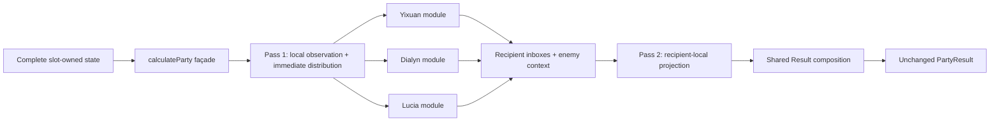

# refactor: Establish calculation module ownership

## Summary

Extract the existing Agent-neutral Result/composition kernel and the three current Agent-local calculation regions behind the unchanged `calculateParty` entry point. Reorganize calculation and UI integration tests by the behavior they protect, without changing any current setup, Result, source, lifecycle, or presentation behavior.

---

## Problem Frame

The completed applied-party work established the correct two-pass semantics, but the final migration left shared composition, three Agent-local projectors, and party orchestration in one central calculation file. The current behavior tests likewise protect distinct owners and user flows from two large files, increasing the review and collision surface for the next vertical. See the [origin requirements](../brainstorms/2026-08-07-calculation-module-boundary-requirements.md).

---

## Requirements

- R1. Preserve every current candidate, prepared choice, lifecycle, value, Result row, breakdown order, action, gauge, operation, source, focus, responsive, and interaction behavior.
- R2. Preserve the public `calculateParty -> PartyResult | null` consumer boundary and its exported Result/source types.
- R3. Preserve exactly two outer applied-slot passes and prevent Agent-local code from reading another applied slot's setup.
- R4. Give Agent-neutral Result types and composition helpers one shared owner without admitting Agent-specific formulas or ordering.
- R5. Keep the complete gate, recipient delivery, exhaustive Agent dispatch, and applied-slot Result order in the party orchestrator.
- R6. Give each current Agent explicit local ownership of observations, outgoing clauses, custom relationships, source ordering, and Result projection without a universal interface or registry.
- R7. Leave a clear explicit extension point for a later Agent without requiring semantic edits to unrelated current Agent modules.
- R8. Organize calculation tests by party boundary and Agent-local behavior while preserving every distinct regression assertion.
- R9. Organize UI integration tests by setup/equipment, Result/source, and party navigation/accessibility behavior.
- R10. Add no structure-only tests, universal fixture framework, or assertion deletion justified only by file size.

**Origin actors:** A1 setup workbench user, A2 future vertical implementer, A3 reviewer.

**Origin flows:** F1 current party calculation, F2 later Agent calculation extension.

**Origin acceptance examples:** AE1-AE6 cover complete-gate/two-pass parity, setup edits and cross-Agent effects, module ownership, later extension, and behavior-test preservation.

---

## Scope Boundaries

- Do not add or research another Agent, vertical, item, Mindscape, formula, candidate, or party composition.
- Do not implement Party Edit, persistence, routing, another Result surface, or UI redesign.
- Do not broadly split `src/workbench/content.ts`, `src/workbench/state.ts`, `src/components/AgentSetup.tsx`, `src/components/ResultPanel.tsx`, or `src/components/PartyWorkbench.tsx` by line count.
- Do not change `PartyResult`, `AgentResult`, metric, action, operation, source, gauge, workbench state, or reducer consumer contracts.
- Do not add a universal Agent interface with optional observations, a registry, plugin discovery, formula catalogue, dependency graph, or iterative solver.
- Do not delete, merge, weaken, or replace behavior tests with snapshots or module/export assertions.
- Do not perform unrelated copy, CSS, selector, source-label, or candidate cleanup.

### Deferred to Follow-Up Work

- Shared content separation: defer until the next vertical supplies a second concrete content-ownership case.
- Party Edit and dynamic party masthead: defer until newly admitted Agents create a real replacement flow.
- Further UI component extraction: defer until a new visible consumer proves a current generic component boundary insufficient.

---

## Context & Research

### Relevant Code and Patterns

- `src/workbench/calculate.ts` already separates shared composition helpers, Yixuan, Dialyn, and Lucia calculation regions, and the final two-pass `calculateParty` orchestration through explicit functions.
- `src/workbench/effects.ts` owns shared effect/source/input vocabulary plus one current Agent dispatch; the shared vocabulary remains here while Agent-specific provider branches move beside their calculation owners.
- `src/workbench/state.ts` supplies exact-three slot ownership, explicit preparation, and completeness. It remains unchanged except for import adjustments if TypeScript requires them.
- `src/components/ResultPanel.tsx` and `src/App.tsx` import the current calculation boundary. `src/workbench/calculate.ts` must remain a stable façade for those consumers.
- `src/workbench/calculate.test.ts` already groups distinct party, Agent, equipment, Mindscape, source, cap, and incomplete-selection consequences under named tests.
- `src/App.test.tsx` already groups setup/equipment flows, Result/source/Mindscape flows, and party navigation/accessibility flows through test names rather than shared implementation fixtures.

### Institutional Learnings

- `docs/solutions/workflow-issues/preserve-interaction-fidelity-in-ui-explorations-2026-08-05.md` requires preserved values, actions, candidate states, focus, accessibility, and source interactions to be checked before judging a structural change complete.
- The permanent authorities require current-consumer behavior, prepared initialization, and incomplete-selection gating to survive implementation choices. Module layout cannot create or remove product meaning.

### External References

- None. Current repository semantics and TypeScript module conventions fully determine this behavior-preserving refactor.

---

## Key Technical Decisions

- Keep `src/workbench/calculate.ts` as the stable public façade and exact-two-pass orchestrator; consumers do not migrate to internal module paths.
- Introduce a bounded `src/workbench/calculation/` directory for shared Result/composition ownership and explicit current Agent modules.
- Agent modules expose individually meaningful current functions and context types. The orchestrator keeps exhaustive identity switches rather than a registry or common optional-field object.
- Keep source/input/effect vocabulary and recipient-basis resolution shared in `src/workbench/effects.ts`; export only the existing clause-construction primitives required by current Agent modules.
- Co-locate each Agent's provider-local observations, outgoing clauses, custom relationships, authored source ordering, and Result projection so later work has one semantic owner.
- Split tests by behavior ownership, reusing only a small calculation-test support module. Do not introduce a production fixture or test DSL.
- Preserve the existing test count and assertion consequences as the migration baseline; new tests are required only if extraction reveals an unprotected public behavior.

---

## Open Questions

### Resolved During Planning

- **Should module size use a numeric line target?** No. The split follows distinct reasons for change; resulting size is a consequence rather than a gate.
- **Should provider effects stay centralized?** Shared effect vocabulary stays centralized, while current Agent-specific provider clauses move beside that Agent's local observation and projector.
- **Should the public Result imports change?** No. The existing calculation façade re-exports the same types and function.
- **Should stabilized UI components be split too?** No. They already consume generic current data and the origin excludes line-count-only UI refactors.
- **Is external research required?** No. The work changes only repository organization.

### Deferred to Implementation

- Exact internal helper and context names may follow TypeScript ergonomics discovered while eliminating import cycles; the ownership and public boundary may not change.
- If moving an Agent-specific clause would require a shared optional Agent contract, keep the explicit dispatcher and choose a simpler named export instead.

---

## Output Structure

    src/
      workbench/
        calculate.ts                    # public façade and party orchestrator
        effects.ts                      # shared effect/source/input vocabulary
        calculation/
          result.ts                     # Result DTOs and contribution types
          composition.ts                # Agent-neutral surface/effect composition
          agents/
            yixuan.ts                   # Yixuan observation, clauses, projection
            dialyn.ts                   # Dialyn observation, clauses, projection
            lucia.ts                    # Lucia observation, clauses, projection
        calculate.test-support.ts       # test-only state/result helpers
        calculate.party.test.ts         # gate, ordering, delivery boundary
        calculate.yixuan.test.ts        # Yixuan behavior
        calculate.dialyn.test.ts        # Dialyn behavior
        calculate.lucia.test.ts         # Lucia behavior
      App.setup.test.tsx                # setup and equipment interactions
      App.result.test.tsx               # Result, Mindscape, source interactions
      App.party.test.tsx                # slot navigation, focus, accessibility

The tree states intended ownership. Exact private names may adjust during implementation while preserving these responsibilities and public imports.

---

## High-Level Technical Design

> *This illustrates the intended approach and is directional guidance for review, not implementation specification. The implementing agent should treat it as context, not code to reproduce.*

The Agent modules remain explicit participants in both passes. The diagram does not imply a runtime registry or uniform Agent contract.

---

## Implementation Units

- U1. **Extract the Agent-neutral Result and composition kernel**

**Goal:** Move public Result DTO definitions and genuinely shared surface/effect composition helpers out of the central orchestrator while preserving existing imports.

**Requirements:** R1, R2, R4

**Dependencies:** None

**Files:**
- Create: `src/workbench/calculation/result.ts`
- Create: `src/workbench/calculation/composition.ts`
- Modify: `src/workbench/calculate.ts`
- Test: `src/workbench/calculate.test.ts` until U4 reorganizes it

**Approach:**
- Move only helpers used by multiple current Agent projectors or needed by the public Result DTO.
- Keep Agent-specific labels, formulas, source order, action scopes, and gauges out of the shared kernel.
- Re-export current public types from `src/workbench/calculate.ts` so `App`, `ResultPanel`, and tests retain their consumer path.

**Execution note:** Characterization-first. Run the current calculation suite before and after the extraction without changing expected values.

**Patterns to follow:**
- `src/workbench/calculate.ts` current `surfaces`, contribution, Energy Regen, metric, and action composition helpers.
- `src/workbench/effects.ts` existing shared semantic types.

**Test scenarios:**
- Covers AE1. Happy path: the prepared party retains every current metric, action, operation, gauge, and source breakdown after the shared extraction.
- Edge case: capped CRIT behavior, continuing relationship contributions, and zero-effect filtering retain their current surface semantics.
- Integration: `App` and `ResultPanel` compile while importing calculation types only through the existing façade.

**Verification:**
- Shared modules contain no Agent identity branch or Agent-specific formula.
- The public calculation exports and all current calculation assertions remain unchanged.

---

- U2. **Extract explicit Agent-local calculation modules**

**Goal:** Give Yixuan, Dialyn, and Lucia separate owners for local observations, outgoing retained clauses, custom relationships, source ordering, and Result projection.

**Requirements:** R1, R3, R4, R6, R7

**Dependencies:** U1

**Files:**
- Create: `src/workbench/calculation/agents/yixuan.ts`
- Create: `src/workbench/calculation/agents/dialyn.ts`
- Create: `src/workbench/calculation/agents/lucia.ts`
- Modify: `src/workbench/effects.ts`
- Modify: `src/workbench/calculate.ts`
- Test: `src/workbench/calculate.test.ts` until U4 reorganizes it

**Approach:**
- Move each Agent's current observation, provider-clause, relationship, projection, and source-order logic together without normalizing their distinct shapes.
- Keep shared source construction, setup-input resolution, clause value kinds, recipient vocabulary, and recipient-basis resolution in `effects.ts`.
- Expose the smallest current clause-construction primitives required by the three Agent modules; do not expose a condition language or generic Agent descriptor.
- Preserve every direct relationship: Rupture, Dialyn Initial-CRIT-to-Impact and King, Lucia Initial-HP Darkbreaker/Squad Sheer, Energy `/s`, caps, action modifiers, and Stun-duration replacement.

**Execution note:** Characterization-first. Extract one Agent at a time and run its focused current tests before moving the next Agent.

**Patterns to follow:**
- Current named Agent functions and discriminated context union in `src/workbench/calculate.ts`.
- Current provider branches and active-clause filtering in `src/workbench/effects.ts`.

**Test scenarios:**
- Covers AE2. Happy path: every current Agent W-Engine, Disc, main-stat, substat, pool, refinement, and Mindscape behavior retains exact values and source identities.
- Covers AE3. Edge case: reversed provider traversal does not change recipient values or Yixuan's authored cross-provider source order.
- Edge case: received Fully HP/CRIT does not feed Lucia/Dialyn Initial-only provider observations.
- Edge case: M0 keeps conditional RES Ignore absent; current M1/M2 clauses remain scoped to their exact consumers.
- Integration: Yixuan M2 Stun replacement, Lucia cross-Agent Sheer, and Dialyn focus delivery remain one composed current outcome rather than duplicated effects.

**Verification:**
- No Agent module imports workbench state or another Agent module to inspect another slot's setup.
- Each current Agent's semantic code has one local owner and no duplicate old branch remains.

---

- U3. **Reduce the public calculator to the exact-two-pass orchestrator**

**Goal:** Make the calculation façade visibly own only completeness, two-pass traversal, recipient distribution, exhaustive dispatch, and final ordering.

**Requirements:** R1, R2, R3, R5, R7

**Dependencies:** U2

**Files:**
- Modify: `src/workbench/calculate.ts`
- Test: `src/workbench/calculate.test.ts` until U4 reorganizes it

**Approach:**
- Keep the discriminated provider context union and exhaustive switches explicit.
- Preserve one first-pass applied-slot traversal that builds local contexts and distributes outgoing clauses immediately.
- Preserve one second-pass applied-slot mapping that invokes the correct Agent-local projector in slot order.
- Keep enemy-context effects separate from Agent inboxes and keep delivery distinct from Result consumption.

**Patterns to follow:**
- `src/workbench/calculate.ts` current complete gate and two outer traversals.
- `docs/plans/2026-08-07-003-refactor-applied-party-calculation-boundary-plan.md` exact-two-pass and closed-dispatch decisions.

**Test scenarios:**
- Covers AE1. Happy path: baseline output remains identical and incomplete setup returns `null` before any partial Result.
- Covers AE3. Edge case: applied-slot reorder changes output order only, not per-Agent values or sources.
- Edge case: focus-recipient delivery follows `focusSlot`, not Agent name or traversal position.
- Error path: a future unhandled Agent identity must fail TypeScript exhaustiveness rather than falling through to another Agent.

**Verification:**
- The façade contains exactly the complete gate, one provider/distribution pass, one recipient projection pass, and public re-exports.
- Static inspection finds no direct cross-Agent setup read or named fixed Result array.

---

- U4. **Reorganize calculation tests by semantic owner**

**Goal:** Move the current calculation behavior assertions beside party-boundary or Agent-local ownership without changing their meaning.

**Requirements:** R8, R10

**Dependencies:** U3

**Files:**
- Create: `src/workbench/calculate.test-support.ts`
- Create: `src/workbench/calculate.party.test.ts`
- Create: `src/workbench/calculate.yixuan.test.ts`
- Create: `src/workbench/calculate.dialyn.test.ts`
- Create: `src/workbench/calculate.lucia.test.ts`
- Delete: `src/workbench/calculate.test.ts`

**Approach:**
- Move the existing result lookup and reducer-driving helpers into one test-only support module.
- Assign each existing test to party boundary or the Agent whose behavior it primarily protects; keep cross-Agent assertions with the recipient or party boundary that owns the failure consequence.
- Preserve existing test names and assertions unless import relocation requires a mechanical change.

**Test scenarios:**
- Covers AE6. Test expectation: no new behavior test is required solely for file movement; every existing calculation test remains active exactly once.
- Edge case: the support module does not become production code or introduce arbitrary Agent/effect builders.

**Verification:**
- The calculation suite retains all current behavior cases with no duplicate or missing test name.
- No test asserts private helper names, module paths, export count, or source file layout.

---

- U5. **Reorganize UI integration tests by user-visible flow**

**Goal:** Separate the large integrated App test file into coherent behavior suites without modifying production UI components or assertions.

**Requirements:** R1, R9, R10

**Dependencies:** U3

**Files:**
- Create: `src/App.setup.test.tsx`
- Create: `src/App.result.test.tsx`
- Create: `src/App.party.test.tsx`
- Delete: `src/App.test.tsx`

**Approach:**
- Keep setup/equipment selection and preparation lifecycle together.
- Keep Result, Mindscape, source disclosure, source activation, and gauge behavior together.
- Keep slot navigation, overview, focus independence, responsive identity semantics, and accessibility behavior together.
- Duplicate only minimal test imports and direct `render(<App />)` setup; do not introduce a UI test DSL or broad fixture layer.

**Test scenarios:**
- Covers AE2 and AE6. Test expectation: no new behavior test is required solely for file movement; all current UI integration tests and assertions remain active exactly once.
- Integration: each suite runs independently with fresh JSDOM state and no reliance on test declaration order.

**Verification:**
- Every current App integration test is present exactly once under the behavior family that owns its user-visible consequence.
- Production UI files remain unchanged.

---

- U6. **Verify semantic and browser parity**

**Goal:** Prove the module migration changed ownership only, not the setup workbench experience.

**Requirements:** R1-R10

**Dependencies:** U4, U5

**Files:**
- Modify: `docs/plans/2026-08-07-004-refactor-calculation-module-boundary-plan.md` status only at completion
- Test: all reorganized Vitest suites

**Approach:**
- Run the full behavior suite, strict TypeScript build, production bundle, and diff validation.
- Inspect the final import graph for cycles, legacy duplicate functions, direct cross-Agent setup reads, and exactly two outer party traversals.
- Verify the accepted current prepared baseline, one representative edit for each Agent, cross-Agent Mindscape delivery, source disclosure/highlighting, keyboard slot navigation, responsive overflow, and console state in the in-app browser.

**Test scenarios:**
- Covers AE1-AE6. Integration: current prepared baseline, Dialyn Slot 6 Impact, Lucia Slot 6 Energy Regen, and Yixuan equipment/Mindscape edits retain current Result and source behavior.
- Integration: target-only Mindscape/pool re-preparation and cross-Agent Result recalculation remain intact.
- Integration: desktop, breakpoint, and mobile slot layouts retain focus/navigation and no document overflow.
- Error path: browser console contains no application warning or error after representative interactions.

**Verification:**
- Full tests, type checking, production build, and diff checks pass.
- Browser-visible behavior and console state match the committed baseline.
- Plan self-review confirms every origin requirement and scope boundary remains satisfied.

---

## System-Wide Impact

- **Interaction graph:** Workbench state still enters only through `calculateParty`; the orchestrator obtains Agent-local contexts, distributes effects, and projects the same public Result consumed by `App` and `ResultPanel`.
- **Error propagation:** Incomplete setup continues to return `null`; exhaustive switches continue to make an unhandled Agent a compile-time error. No runtime fallback or compatibility path is added.
- **State lifecycle risks:** State and reducer behavior are unchanged. The primary risk is accidentally importing state into an Agent module and reconstructing another slot; static inspection and existing lifecycle tests guard this.
- **API surface parity:** `calculateParty`, Result DTOs, and source/surface types keep their current import path and shape.
- **Integration coverage:** Reorganized calculation suites protect numeric/source semantics; reorganized App suites protect setup-to-Result and accessibility behavior; browser verification protects rendered focus, disclosure, and overflow.
- **Unchanged invariants:** Exact-three applied slots, target-only Mindscape/pool re-preparation, complete-selection gate, exact-two-pass distribution, current-consumer row gating, source ordering, and stabilized UI remain unchanged.

---

## Risks & Dependencies

| Risk | Mitigation |
|---|---|
| Shared helpers import Agent modules and create a cycle | Keep dependency direction one-way: Agent modules depend on shared result/composition/effect vocabulary; the façade alone imports Agent modules. |
| Moving provider clauses changes activation or recipient semantics | Move one Agent at a time under current behavior tests and delete the old branch immediately. |
| Inbox order becomes visible source order | Keep authored ordering inside the applicable Agent projector and retain the reversed-provider-order contrary test. |
| Public type imports break despite equivalent internal types | Preserve façade re-exports and compile existing `App`/`ResultPanel` consumers before test reorganization. |
| Test movement silently loses an assertion or relies on declaration order | Inventory test names before/after, keep fresh render/state per test, and run each new suite independently plus the full suite. |
| The refactor expands into a framework for the next vertical | Reject registries, optional Agent contracts, content restructuring, and speculative formula fields during review. |

---

## Documentation / Operational Notes

- No external API, persistence, deployment, data migration, or runtime monitoring change is introduced.
- The requirements and plan are the durable explanation of the module boundary; no additional architecture catalogue is needed.
- No additional operational monitoring is required because the change is a local behavior-preserving module migration verified by tests, build, and browser parity.

---

## Sources & References

- **Origin document:** [docs/brainstorms/2026-08-07-calculation-module-boundary-requirements.md](../brainstorms/2026-08-07-calculation-module-boundary-requirements.md)
- Related plan: [docs/plans/2026-08-07-003-refactor-applied-party-calculation-boundary-plan.md](2026-08-07-003-refactor-applied-party-calculation-boundary-plan.md)
- Related code: `src/workbench/calculate.ts`, `src/workbench/effects.ts`, `src/workbench/calculate.test.ts`, `src/App.test.tsx`
- Relevant learning: `docs/solutions/workflow-issues/preserve-interaction-fidelity-in-ui-explorations-2026-08-05.md`
