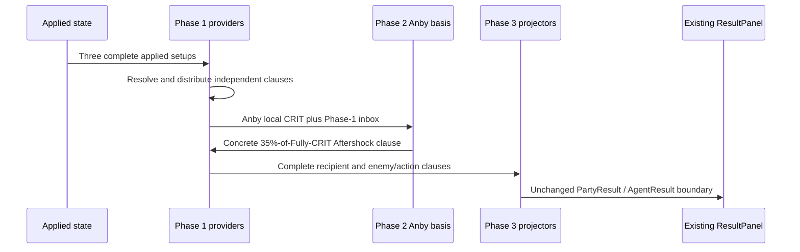
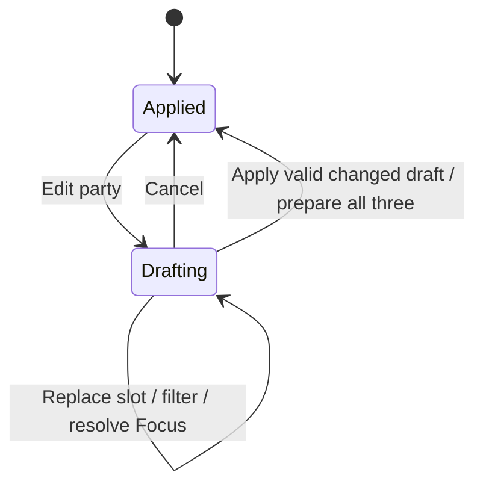
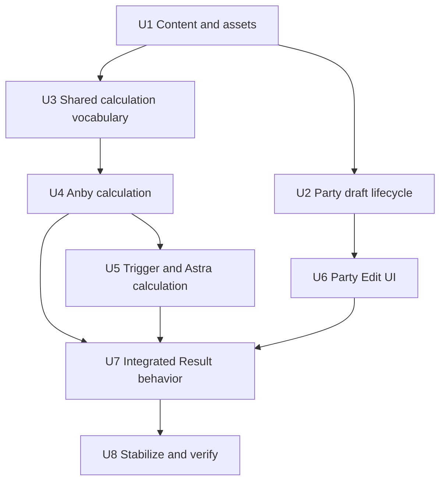
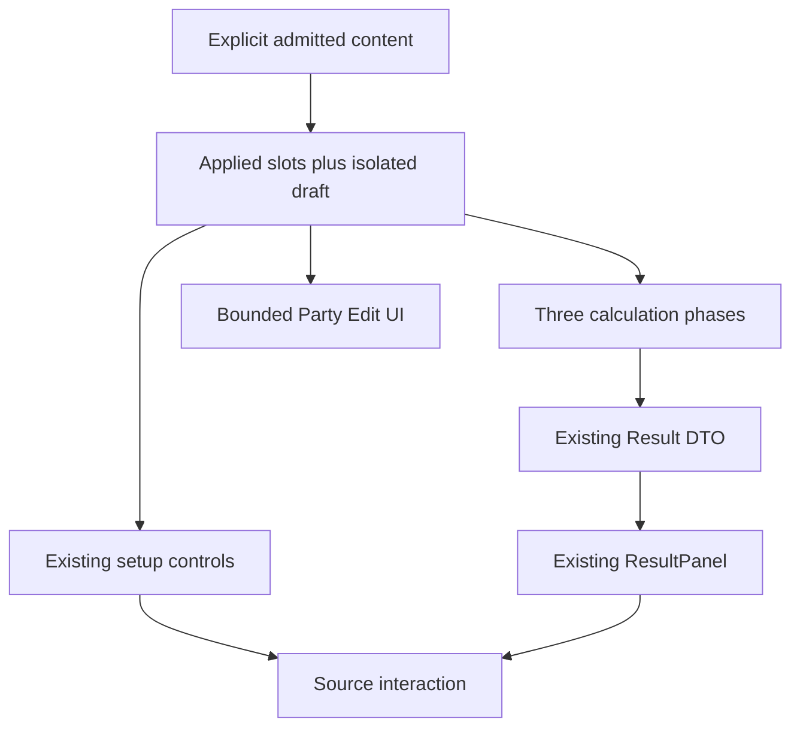

# feat: Add Soldier 0 second vertical

## Summary

Extend the current explicit three-Agent content boundary, slot-owned state, and Agent-local calculation modules to admit Anby: Soldier 0, Trigger, and Astra Yao. Add one draft-isolated Party Edit surface and one bounded received-dependent calculation phase, then project the new general-damage Result regions through the existing public Result and source-interaction contract.

---

## Problem Frame

The first vertical is complete and must remain the product/UI baseline. The second vertical introduces the first current consumers for roster-to-party composition and for an outgoing effect derived from a received Fully Enabled stat, so the implementation must extend those boundaries without turning either into a general framework.

---

## Requirements

- R1. Admit the three researched Agents and their exact roles, candidates, authored full/non-limited preparations, cumulative Mindscape behavior, and current Result consumers (see origin R1-R4, R13-R25, R34-R43).
- R2. Implement draft-isolated Party Edit with a shared filtered roster pool, distinct-Agent enforcement, Focus resolution, Cancel, Apply, and authority-owned preparation lifecycle (see origin R5-R12).
- R3. Implement an explicit three-phase party calculation in which only Anby's Fully Enabled CRIT DMG is composed in the middle phase to derive her 35% Aftershock clause (see origin R26-R33).
- R4. Preserve distinct general-damage DEF Reduction, DEF Ignore, RES Reduction, RES Ignore, PEN Ratio, and Stun DMG Multiplier regions without calculating final damage (see origin R34-R43).
- R5. Preserve the PartyResult, AgentResult, ResultPanel, setup control, source interaction, keyboard, and responsive boundaries unless a current visible behavior proves a minimal addition necessary (see origin R29, R44-R49).
- R6. Preserve the complete Yixuan/Dialyn/Lucia vertical when reapplied, including numeric/source order, action/operation/gauge, preparation, and interaction behavior (see origin R33, R44-R49).
- R7. Add behavior-bearing coverage and complete focused/full static, build, diff, browser, responsive, keyboard, source, and console verification (see origin AE1-AE19).

**Origin actors:** A1 setup workbench user, A2 workbench session, A3 party calculation, A4 content author.

**Origin flows:** F1 second-vertical application, F2 draft isolation/cancellation, F3 setup adjustment, F4 three-phase calculation, F5 first-vertical reapplication.

**Origin acceptance examples:** AE1-AE19.

---

## Scope Boundaries

- No Agents or future verticals beyond the six admitted by the origin.
- No Bangboo input, rotations, raw/final damage or Daze, clear-time model, simulator, optimizer, runtime ranking, or exhaustive coefficients.
- No dependency graph, iteration, fixed-point solver, formula registry, universal snapshot, condition language, universal content/effect/Result schema, evidence archive, or catalogue.
- No parallel compatibility path for the old two-pass calculation or named vertical-specific workbench.
- No redesign of the applied-party rail, Setup, Result, identity hierarchy, source interaction, or responsive direction.
- No API, persistence, authentication, deployment, analytics, or unrelated stabilization.

---

## Assumptions

*This plan is being authored in an autonomous delegated workflow. These implementation-shape bets fill gaps not fixed by product requirements and must be checked during implementation and browser review.*

- Party Edit will use an inline editor chassis above the still-visible applied rail rather than a modal, because the applied Result must remain visible while drafting.
- Draft party/Focus belongs to reducer-owned session state; replacement-target selection and Attribute/Specialty filters remain local presentation state because they have no applied lifecycle or calculation consumer.
- The existing Result DTO is sufficient for the new metric rows, action modifiers, gauges, and source-stated operations. A nested shape change is allowed only if a present ResultPanel behavior cannot otherwise be represented.

---

## Context & Research

### Relevant Code and Patterns

- `src/workbench/content.ts` owns explicit closed Agent/candidate/prepared maps and `preparedSetupFor()` context changes.
- `src/workbench/state.ts` owns exact-three applied slots, target-only Mindscape/pool rebuilding, immutable direct edits, and completeness.
- `src/workbench/effects.ts` owns bounded source clauses, recipients, surfaces, and setup-input resolution.
- `src/workbench/calculate.ts` owns the complete gate, exhaustive Agent dispatch, provider delivery, and final applied-slot projection.
- `src/workbench/calculation/agents/yixuan.ts`, `dialyn.ts`, and `lucia.ts` establish Agent-local observe, provider-clause, and Result-projection modules.
- `src/workbench/calculation/result.ts`, `composition.ts`, and `src/components/ResultPanel.tsx` already represent conditional metrics, action differences, gauges, operations, numeric breakdowns, and source interaction.
- `src/components/PartyWorkbench.tsx`, `src/App.tsx`, and the split `App.*.test.tsx` suites own applied-slot navigation, viewed-versus-Focus independence, setup wiring, and UI integration.

### Institutional Learnings

- `docs/solutions/workflow-issues/preserve-interaction-fidelity-in-ui-explorations-2026-08-05.md` requires acceptance to compare the complete preserved interaction envelope, authority-required additions, explicit visual variables, and representative states before visual judgment.
- No existing learning owns Party Edit, the received-dependent middle phase, or second-vertical semantics. The five permanent authorities own product meaning; the origin requirements record the user-approved scope for this vertical and remain subordinate to those authorities.

### External References

- External research settled exact current Agent/equipment mechanics and current competitive practice before requirements capture. Those research receipts remain ephemeral and are not runtime content or a durable evidence catalogue.

---

## Key Technical Decisions

| Decision | Smallest current representation | Rejected expansion |
|---|---|---|
| Six-Agent admission | Extend the existing closed unions, maps, assets, and exhaustive switches | Runtime content registry or optional universal Agent schema |
| Party draft | One explicit draft party/Focus state isolated from applied slots | Hidden setup copies for all roster Agents or draft-fed calculation |
| Received-dependent output | One Anby Fully-CRIT basis observation and one derived Aftershock clause between delivery and projection | General dependency graph, recomputation hook, or iteration |
| Formula regions | Concrete metric identities for each consumed DEF/RES/PEN/Stun region | Generic modifier registry or collapsed resistance row |
| Astra M4 | One next-Quick-Assist Daze multiplier operation for each applied current Stun recipient | Regular Daze Bonus stat or raw Daze calculation |
| Astral Voice | One reachable shared stack state delivered as entrant-specific current Results | Uniform blanket party DMG or per-Agent stack pools |
| Presentation | Reuse current metric/action/gauge/operation/source surfaces | New damage page, narrative explanation, or UI redesign |

- Keep candidate membership and authored preparation in `content.ts`; do not derive setup choices from calculated output.
- Keep public calculation output in applied-slot order and preserve source ordering inside Agent projectors rather than inbox traversal order.
- Preserve direct source additions, basis-percentage relationships, and source-stated multiplier operations as different composition meanings.
- Keep Party Edit filtering presentation-only: it narrows the six admitted identities but cannot change admission or setup policy.

---

## High-Level Technical Design

> *This illustrates the intended approach and is directional guidance for review, not implementation specification. The implementing agent should treat it as context, not code to reproduce.*

The calculation phase is not re-entered: the middle clause cannot change CRIT DMG and no derived clause is eligible to create another phase.

---

## Implementation Units

The prose dependencies below govern if this diagram and the unit text differ.

- U1. **Admit second-vertical content and assets**

**Goal:** Add the three Agent identities, bounded equipment candidates, exact display facts, explicit Focus eligibility, and authored prepared choices without changing the default applied party.

**Requirements:** R1, R4-R6; origin R1-R4, R13-R25, AE5-AE6

**Dependencies:** None

**Files:**
- Modify: `src/workbench/content.ts`
- Modify: `src/components/PartyWorkbench.tsx`
- Create: `src/assets/agents/portraits/soldier-0-anby.webp`
- Create: `src/assets/agents/portraits/trigger.webp`
- Create: `src/assets/agents/portraits/astra-yao.webp`
- Create: `src/assets/equipment/w-engines/severed-innocence.webp`
- Create: `src/assets/equipment/w-engines/cordis-germina.webp`
- Create: `src/assets/equipment/w-engines/marcato-desire.webp`
- Create: `src/assets/equipment/w-engines/starlight-engine.webp`
- Create: `src/assets/equipment/w-engines/spectral-gaze.webp`
- Create: `src/assets/equipment/w-engines/ice-jade-teapot.webp`
- Create: `src/assets/equipment/w-engines/the-restrained.webp`
- Create: `src/assets/equipment/w-engines/precious-fossilized-core.webp`
- Create: `src/assets/equipment/w-engines/elegant-vanity.webp`
- Create: `src/assets/equipment/w-engines/bashful-demon.webp`
- Create: `src/assets/equipment/drive-discs/shadow-harmony.webp`
- Create: `src/assets/equipment/drive-discs/shockstar-disco.webp`
- Create: `src/assets/equipment/drive-discs/astral-voice.webp`
- Create: `src/assets/equipment/drive-discs/hormone-punk.webp`
- Test: `src/workbench/state.test.ts`
- Test: `src/App.setup.test.tsx`

**Approach:**
- Extend the existing closed unions and parallel `Record<AgentId, ...>` maps. Implement the origin's complete retained numerical tables and bounded action groups exactly; add no unlisted facts.
- Keep `DEFAULT_APPLIED_AGENT_IDS` on Yixuan/Dialyn/Lucia. Add explicit Focus eligibility to admitted identity content rather than deriving it from Specialty.
- Encode the exact candidate and preparation decisions from origin R14-R22, including Astra's M2 Slot-6 change and zero independent substat counts.
- Reuse the existing Steam Oven, Kaboom, Woodpecker, Branch & Blade, King, and Moonlight assets/content where already admitted; do not duplicate identities.
- Acquire only the admitted identities/candidates from the current exact game-data image endpoint used by this project research, validate each identity against its current game-data record, and store the smallest locally consumed WebP derivative. Do not source from predecessor repositories, archived tasks, unrelated projects, or generative reconstruction; research receipts remain ephemeral.
- Calibrate portrait landmark data within the existing identity framing system and reuse an existing local asset whenever the identity is already admitted.

**Patterns to follow:**
- `src/workbench/content.ts` existing engine/disc facts, candidate pools, prepared maps, and `preparedSetupFor()` Yixuan Mindscape branch.
- `src/components/PartyWorkbench.tsx` explicit portrait/mark maps and shared portrait-frame ownership.

**Test scenarios:**
- Happy path: default initialization still admits and applies only Yixuan/Dialyn/Lucia with their exact current preparations.
- Happy path: explicit Anby/Trigger/Astra initialization creates each exact full-pool M0 preparation, W1/W5 default refinement, and zero offered substats.
- Covers AE5. Switching each second-vertical Agent to non-limited selects the authored first choice and rejects limited S-Ranks.
- Covers AE6. Astra M0-M1 prepares Slot 6 ATK, M2-M6 prepares Slot 6 ER, and no other Agent/setup object changes for a target-only Mindscape action.
- Edge case: every candidate map is complete for all six Agent identities, while an engine/disc/main/substat not admitted for the target remains a no-op.

**Verification:** All six identities and bounded choices render through existing selectors; the default applied party and first-vertical content remain byte-for-behavior unchanged.

---

- U2. **Implement draft-isolated Party Edit lifecycle**

**Goal:** Add a reducer-owned draft party and Focus that cannot affect applied slots or Result until valid Apply.

**Requirements:** R2, R5-R7; origin R4-R12, AE1-AE4

**Dependencies:** U1

**Files:**
- Modify: `src/workbench/state.ts`
- Test: `src/workbench/state.test.ts`

**Approach:**
- Represent only draft Agent order and draft Focus identity/position alongside current applied state. Do not create setup state for draft or non-applied roster Agents.
- Begin draft from the current applied identities and Focus. Replacement keeps Agent identities distinct and recomputes automatic/unresolved Focus from explicit eligibility. A changed eligible set with multiple eligible Agents requires a new explicit choice.
- Cancel removes the draft only. Apply validates three distinct admitted identities and resolved eligible Focus, preserves each unchanged Agent's current Mindscape/pool by identity, initializes new Agents at M0/full, and prepares all three slots from current authored context.
- Keep existing target-only Mindscape/pool and direct-edit behavior unchanged. `calculateParty` continues to read only applied slots.

**Execution note:** Implement reducer lifecycle tests before the state mutation so draft leakage and incorrect all-three preparation fail visibly.

**Patterns to follow:**
- `src/workbench/state.ts` immutable slot replacement, `createPreparedAgentSetup()`, and validation no-ops.
- `src/workbench/state.test.ts` object-identity assertions for target-only re-preparation.

**Test scenarios:**
- Covers AE1. Begin, replace multiple draft Agents, and Cancel preserves applied slots, setup object identities/selections, Focus, and completeness.
- Covers AE3. The initial draft matches applied identities/Focus and cannot Apply unchanged; Anby/Trigger/Astra auto-resolves Anby; a changed draft with Anby/Yixuan remains unresolved until one eligible Agent is explicitly selected; no-eligible drafts cannot apply.
- Covers AE4. Applying a changed draft rebuilds all three setup objects, keeps unchanged Agents' Mindscape/pool by identity even when moved, and gives newly applied Agents M0/full.
- Edge case: selecting an Agent already present in another draft slot is rejected; invalid Focus selection is rejected.
- Contrary case: an unchanged party/Focus keeps Apply disabled; Cancel closes the draft without resetting edited setups.
- Completeness: draft state never participates in `isCompleteWorkbench`; only incomplete applied setup removes Result.

**Verification:** Reducer coverage proves draft isolation, validation, Focus behavior, Cancel, Apply, all-three preparation, and unchanged target-only setup edits.

---

- U3. **Characterize and extend the shared calculation vocabulary**

**Goal:** Add only the concrete general-damage region primitives the second vertical consumes and lock down the existing provider/recipient behavior before the Anby module introduces the middle phase.

**Requirements:** R3-R6; origin R26, R29-R33, R41-R43, AE8-AE10

**Dependencies:** U1

**Files:**
- Modify: `src/workbench/effects.ts`
- Modify: `src/workbench/calculation/composition.ts`
- Verify: `src/workbench/calculation/result.ts`
- Verify: `src/workbench/calculate.ts`
- Test: `src/workbench/calculate.party.test.ts`

**Approach:**
- Add concrete current metric identities for DEF Reduction, DEF Ignore, RES Reduction, RES Ignore, and PEN Ratio while retaining Stun DMG Multiplier. Do not create generic region metadata or a metric registry.
- Keep the existing independent provider-local observation/delivery and final projection behavior unchanged in this unit. Do not add a generic phase callback or an unused derived-effect hook ahead of its concrete consumer.
- Keep first-vertical Initial-only provider observations closed before received delivery. Preserve semantic source order inside projectors rather than inbox append order.

**Execution note:** Add first-vertical characterization assertions before extending the concrete metric vocabulary. The Anby phase and its order/no-feedback tests belong to U4/U5, after the provider module exists.

**Patterns to follow:**
- `src/workbench/calculate.ts` exhaustive context switches and recipient distribution.
- `src/workbench/effects.ts` closed current clause types and source-bound basis percentages.
- `src/workbench/calculation/composition.ts` surface-aware composition and explicit action effects.

**Test scenarios:**
- Covers AE9. Existing Lucia Initial HP/Squad Sheer and Dialyn Initial CRIT/King outputs remain unchanged when received later-surface buffs exist.
- Error path: incomplete applied setup returns `null` before any phase creates partial output.

**Verification:** Characterization proves the first-vertical basis and public DTO behavior are unchanged; the shared types contain only the concrete regions consumed by U4/U5.

---

- U4. **Implement Anby provider and Result projection**

**Goal:** Calculate Anby's ordinary general-damage setup, cumulative Mindscapes, action differences, source disclosure, and introduce the one concrete received-dependent middle phase.

**Requirements:** R1, R3-R7; origin R14-R16, R24, R27-R35, R39-R43, AE5, AE7-AE10

**Dependencies:** U3

**Files:**
- Create: `src/workbench/calculation/agents/anby.ts`
- Modify: `src/workbench/calculate.ts`
- Modify: `src/workbench/effects.ts`
- Test: `src/workbench/calculate.anby.test.ts`
- Test: `src/workbench/calculate.party.test.ts`

**Approach:**
- Observe Anby's local ATK/CRIT/DMG inputs and expose a narrow Fully-CRIT basis resolver used by Phase 2; final projection remains separate.
- Extend the orchestrator to run exactly: independent Phase-1 delivery; Anby's concrete Phase-2 Fully-CRIT composition and one derived Aftershock delivery; final Phase-3 projection. Do not expose a recomputation callback or schedule another derived phase.
- Resolve selected engine/disc/main/substat effects at their exact Initial/Combat/Fully surfaces and action scopes. Keep Cordis Basic/Ultimate DEF Ignore and Spectral-delivered Aftershock DEF Reduction action-specific.
- Model Silver Star personal DMG, allied Aftershock DMG, Chain/Ultimate Aftershock scope, M2 CRIT, M4 Electric RES Ignore, and the 35%-of-current-CRIT-DMG action relation. Omit M1/M3/M5/M6 raw-event/table content.
- Project conditional general-damage metric rows and action aggregates without final damage or narrative activation copy.

**Test scenarios:**
- Prepared full/non-limited exact ATK/CRIT/CD and Shadow/Woodpecker versus Branch behavior at M0.
- Cumulative Mindscape boundaries: M2 adds 12 CRIT; M4 adds Electric RES Ignore; M1/M3/M5/M6 add no other current Result.
- Candidate behavior: Severed, Cordis, Marcato, and Starlight each change only their exact retained Initial/Combat/Fully stats/actions/regions.
- Covers AE7-AE8 with current first-vertical providers or explicit delivered-clause fixtures: incoming CRIT DMG changes Anby's derived Aftershock amount once without changing the CRIT DMG basis or feeding back.
- Conditional disclosure: DEF Ignore, RES Ignore, RES Reduction, DEF Reduction, PEN Ratio, Stun multiplier, and action rows appear only when selected/applied/active.
- Current-roster invariant: every valid admitted party containing Anby has a Stun or Support teammate, so Anby's Additional Ability remains active; do not synthesize an unreachable inactive party.
- Order boundary: reorder a mixed applied party containing Anby, normalize by Agent identity, and prove the concrete Phase-2 value and all first-vertical outputs are invariant while output order follows slots.

**Verification:** Anby tests own exact values, surfaces, cumulative boundaries, derived basis, action scopes, region distinctions, sources, and omissions.

---

- U5. **Implement Trigger and Astra provider/Result projections**

**Goal:** Calculate Trigger's off-field damage/Daze/buffer direction and Astra's low-field buffer direction, including their cross-Agent effects, gauges, operations, and preparation pressure.

**Requirements:** R1, R3-R7; origin R17-R24, R36-R43, AE5-AE13, AE19

**Dependencies:** U4

**Files:**
- Create: `src/workbench/calculation/agents/trigger.ts`
- Create: `src/workbench/calculation/agents/astra.ts`
- Modify: `src/workbench/calculate.ts`
- Modify: `src/workbench/effects.ts`
- Test: `src/workbench/calculate.trigger.test.ts`
- Test: `src/workbench/calculate.astra.test.ts`
- Test: `src/workbench/calculate.party.test.ts`

**Approach:**
- Trigger projects both general-damage and Daze setting consumers. Keep Harmonizing/Tartarus Aftershock scope, Core Stun multiplier, Spectral action DEF Reduction, selected W-Engine/Disc effects, and the Fully-CRIT-to-Aftershock-Daze gauge explicit.
- Compute one narrow `hasAnby` observation from the applied Agent identities in `calculateParty` and pass it only to Trigger's provider resolution. Do not let Trigger inspect slot traversal or add a generic party-condition mechanism.
- Astra observes Initial ATK, resolves the fixed-basis Core flat ATK before received effects, distributes Cadenza/Astral/engine/Mindscape clauses, and projects only Initial ATK, Energy Regen, linked Core gauge/output, and retained operations.
- Model Astra M4 as one next-Quick-Assist Daze scale operation for each applied Stun recipient among Dialyn/Trigger, separate from Daze Bonus. Model Astral as shared reachability with entrant-specific +24% for current compatible damage recipients.
- Keep Astra M3/M5 Cadenza table tiers and M2 cap/preparation behavior exact; omit personal damage/heal/event frequency.
- Complete the concrete three-phase integration with Trigger/Astra's independent Phase-1 clauses. This unit exclusively owns the final second-trio order/no-feedback assertions and the 158 + 30 + 25 = 213 to 74.55 full-party proof.

**Test scenarios:**
- Trigger prepared full reaches 53 Initial CRIT, +19.5% gauge output, and the exact Impact surfaces; non-limited reaches its authored Shadow/Woodpecker values and +13.5% output.
- Trigger threshold/cap: at or below 40 CRIT output is zero; 41 increases by 1.5; 90 and above cap at 75. M1 changes Stun multiplier 35 to 55 and M2 adds 24 party CD cumulatively.
- Trigger candidates: Spectral, Ice-Jade, Restrained, Precious, and Steam each expose only retained stats, action DMG/Daze, DEF, energy, or party clauses.
- Astra prepared Initial ATK/Core output matches M0-M1 full/non-limited caps; M2 changes Slot 6 and the 54%/1,600 relation; M3 and M5 change Cadenza only.
- Astra candidates: Elegant supplies exact party DMG and one-time Energy operation; Bashful and Kaboom supply exact reachable party ATK; excluded engines never appear in Astra selectors or Result.
- Covers AE12. Astra M4 creates Trigger's +50% next-Quick-Assist Daze operation in the selected trio and is absent for non-Stun recipients or below M4; AE19 covers both current Stun recipients in a mixed party.
- Covers AE13. Astra plus Astral Voice and a compatible Cadenza Quick Assist recipient reaches entrant-specific 24% for Anby/Trigger; removing Astra or changing her 4-piece removes it and Astra has no personal damage row.
- Covers AE19. Astra's retained party clauses reach current mixed-party contributors Yixuan/Anby/Trigger, Astra M4 reaches each applied Stun recipient among Dialyn/Trigger, and no clause creates unsupported Astra/Dialyn/Lucia damage rows.
- Recipient contrary cases: Trigger's Additional Ability is active exactly when Anby is applied among the current six; Anby's allied clauses affect Trigger Aftershock actions; removing each provider/equipment condition removes only its delivered contribution.
- Predicate order case: Trigger with and without Anby yields the same activation result under every applied slot order.
- Full-party boundary: M0 second trio resolves Anby's Fully CRIT from 158 local + 30 Trigger + 25 Astra to 213 and derives exactly 74.55 once; provider and slot reordering cannot change the normalized Result.

**Verification:** Trigger/Astra tests own exact roles, candidates, preparation, Mindscape tiers, thresholds/caps, recipients, operations, sources, and consumer-only omissions.

---

- U6. **Add the six-Agent Party Edit interface**

**Goal:** Add the authority-defined shared-pool draft flow without redesigning or mutating the applied rail/Result during drafting.

**Requirements:** R2, R5-R7; origin R5-R12, R44-R49, AE1-AE4, AE14-AE15, AE17-AE18

**Dependencies:** U1, U2

**Files:**
- Create: `src/components/PartyEditor.tsx`
- Modify: `src/components/PartyWorkbench.tsx`
- Modify: `src/App.tsx`
- Modify: `src/app.css`
- Test: `src/App.party.test.tsx`

**Approach:**
- Add one Edit party action to the applied-party heading. Render the editor inline before the unchanged applied rail so the current expanded setup and Result remain visible.
- Show three equal draft controls first. A selected replacement target reveals one shared compact candidate pool with Attribute and Specialty intersection filters; occupied Agents remain visible/disabled.
- Show automatic, selectable, or unresolved Focus state from the draft. Apply is disabled until a valid resolved draft differs from applied identities/order or Focus. Apply and Cancel dispatch only their explicit draft actions; selector/filter state closes or resets without affecting applied view/source state.
- Preserve current applied tab/overview DOM, keyboard navigation, focus marker reservation, portrait framing, and viewed-versus-Focus independence. Opening edit focuses draft slot 1; opening a target focuses the first available filtered candidate; candidate selection returns to its draft slot; Cancel/Apply returns to the Edit party trigger; no-result filtering keeps focus on a present control.
- Use native buttons, selections, fieldsets, and radio/pressed/disabled states. Announce draft target, occupied candidates, automatic/unresolved Focus, filtered candidate count, and no-results state without custom keyboard containers.
- At narrow widths render draft slots, Focus, filters, pool, and actions in the authority-defined single-column reading order, followed by the still-labeled applied workbench.
- Derive the masthead Focus/team label and completeness status from applied state while preserving the first vertical's current wording when reapplied.

**Execution note:** Characterize existing applied-rail keyboard/source behavior first. Implement the new draft-flow tests before visual styling.

**Patterns to follow:**
- `src/components/PartyWorkbench.tsx` current semantic buttons/tabs, focus restoration, identity marks, and compact slot composition.
- `src/components/AgentSetup.tsx` existing segmented controls and selection surfaces.
- `src/components/sourceInteraction.ts` pointer/focus source separation.
- Existing CSS tokens, radii, typography, spacing, and breakpoint behavior in `src/app.css`.

**Test scenarios:**
- Covers AE1. Draft replacements and Focus changes leave the applied heading, tabs, setup values, Result values, and source interaction unchanged; Cancel restores editor closure.
- Covers AE2. Target selection opens one pool, filters intersect, occupied Agents are disabled, and selecting an available Agent closes the pool and updates only the draft target.
- Covers AE3. Sole Focus auto-resolves; multiple eligible Agents expose an explicit choice and disable Apply until selected; none disables Apply.
- Covers AE4. Apply closes editing, prepares all three slots, preserves unchanged M/pool, keeps viewed slot positional, and updates applied Focus marker/team label.
- Covers AE15. Edit party, three draft slots, filters, candidates, Focus choices, Cancel, and Apply have logical order, visible focus, accessible names, and the exact required focus destinations, including no-results filtering.
- Covers AE17. Semantic control state and live status expose occupied candidates, target/Focus selection, automatic/unresolved Focus, and candidate-count/no-results changes to assistive technology.
- Covers AE18. At 390px the editor follows the required single-column reading order while the applied workbench remains distinct below it and no horizontal scroll appears.
- Regression: applied Arrow/Home/End/Enter/Space navigation, overview collapse/reopen, and source highlighting are unchanged while the editor is closed.

**Verification:** App party tests prove draft/apply/cancel/focus and keyboard semantics; browser review proves the editor belongs to the existing visual system without obscuring the applied Result.

---

- U7. **Integrate setup and Result presentation for both verticals**

**Goal:** Render all new candidates, source identities, conditional formula regions, action differences, operations, and gauges through the established setup/Result consumer while preserving first-vertical behavior.

**Requirements:** R1-R7; origin R13-R25a, R34-R49, AE5-AE14, AE16, AE19

**Dependencies:** U4, U5, U6

**Files:**
- Modify: `src/components/AgentSetup.tsx`
- Modify: `src/components/ResultPanel.tsx` only if a current presentation cannot use the existing DTO/rendering path
- Modify: `src/App.tsx`
- Modify: `src/app.css`
- Test: `src/App.setup.test.tsx`
- Test: `src/App.result.test.tsx`
- Test: `src/App.party.test.tsx`

**Approach:**
- Reuse existing engine/disc/main/substat selectors and independent 0-36 counts for all new content. Do not branch the component into vertical-specific layouts.
- Admit conditional metric rows by actual current contributions; preserve expanded source matrices, action source identities, gauges, operations, pointer/focus highlighting, and selector focus return.
- Keep source-stated action multiplier operations visually separate from ordinary stats and keep attribute/action qualifiers internal.
- Add only CSS needed for longer names, additional current rows, new source tones, and Party Edit responsive allocation. Do not change first-vertical geometry to make the second vertical easier.

**Test scenarios:**
- Covers AE5-AE6. Full/non-limited/Mindscape preparation changes render exact candidates and target-only reset behavior for each new Agent.
- Covers AE10. Representative DEF Reduction, DEF Ignore, RES Reduction, RES Ignore, PEN Ratio, and Stun multiplier rows/actions appear and disappear with exact applicable sources.
- Covers AE11-AE13. Trigger gauge, Astra M4 operation, Astral entrant sources, and Anby derived Aftershock disclose through existing expansion and source highlighting.
- Incomplete selection: clearing any required applied selection produces the established empty Result while setup remains editable; draft edits do not.
- View independence: expanding each of six possible applied identities never changes Focus, preparation, calculation, or recipient delivery.
- Covers AE16. Starting from edited Anby/Trigger/Astra, reapply Yixuan/Dialyn/Lucia and recover all M0/full authored setups plus current setup labels/effects, Result row/action/operation order, source details, and focus return.

**Verification:** UI integration tests cover consumer-visible behavior rather than static inventory; no generic Result registry or vertical-specific component path appears.

---

- U8. **Stabilize and verify the complete workbench**

**Goal:** Independently accept the complete diff across semantics, tests, type/build quality, both verticals, Party Edit, responsive layout, accessibility, sources, and console health.

**Requirements:** R1-R7; origin R1-R49, AE1-AE19

**Dependencies:** U7

**Files:**
- Verify: `src/workbench/content.ts`
- Verify: `src/workbench/state.ts`
- Verify: `src/workbench/effects.ts`
- Verify: `src/workbench/calculate.ts`
- Verify: `src/workbench/calculation/agents/*.ts`
- Verify: `src/components/PartyEditor.tsx`
- Verify: `src/components/PartyWorkbench.tsx`
- Verify: `src/components/AgentSetup.tsx`
- Verify: `src/components/ResultPanel.tsx`
- Verify: `src/App.tsx`
- Verify: `src/app.css`
- Test: `src/workbench/*.test.ts`
- Test: `src/App.*.test.tsx`

**Approach:**
- Review the final diff first for authority drift, duplicate calculation paths, hidden setup copies, speculative structures, excluded facts, catalogue expansion, unrelated styling, and accidental first-vertical changes.
- Run focused state/calculation/UI tests during integration, then the full suite, strict TypeScript production build, and `git diff --check`.
- Preflight the installed in-app Browser controller, start this exact worktree on a unique local port, and acquire the `iab` browser session through the browser-control skill. Verify 1440x900, immediately above and below 1040px, and 390x844 without adding a repository browser dependency.
- Exercise both applied trios, Party Edit draft/cancel/apply, all three expanded slots, representative M0/Mindscape/pool/direct edits, target-only versus all-three preparation, cross-Agent values/sources, disclosures, gauges, keyboard focus, responsive overflow, and console state.
- Keep stabilization bounded to defects introduced by the approved diff or authority-required gaps.

**Test scenarios:**
- Full first-vertical baseline after a round trip through the second vertical.
- Full second-vertical prepared state plus representative Anby M2/M4, Trigger M1/M2, Astra M2/M3/M4/M5, and pool changes.
- Calculation order/no-feedback and exact recipients/non-recipients.
- Party draft isolation, invalid/valid Focus, filters, unavailable candidates, Cancel, Apply, unchanged M/pool carryover, and all-three rebuild.
- Result empty/complete transition, source disclosure/highlighting, selector focus return, and view/Focus independence.
- Desktop/breakpoint/narrow layout, long labels, all expanded slots, editor pool, local/page overflow, keyboard visibility, and zero console errors.

**Verification:** Focused and full tests pass, TypeScript/build pass, `git diff --check` is clean, browser evidence covers both verticals and editor states, screenshots show no glaring design regression, and no files are staged or committed.

---

## System-Wide Impact

- **Interaction graph:** Party Editor changes draft state only; Apply rebuilds all three applied setups; ordinary setup actions keep their existing target scope; synchronous calculation recreates the complete party Result; App renders only the viewed applied slot.
- **Error propagation:** There are no external failures or persisted partial states. Invalid draft/setup actions are no-ops; unresolved draft Focus disables Apply; incomplete applied setup yields no Result.
- **State lifecycle risks:** Draft must not leak into applied completeness/calculation, unchanged Agent M/pool must follow identity across moved slots, and Apply must not preserve edited equipment when all-three preparation is required.
- **API surface parity:** `PartyResult`, `AgentResult`, and ResultPanel remain the public consumer boundary. Workbench state/actions may intentionally expand for draft lifecycle.
- **Integration coverage:** Reducer tests own lifecycle, Agent calculation tests own exact facts, party calculation tests own phases/recipients/order, App tests own wiring/accessibility/source behavior, and browser review owns layout/overflow/console acceptance.
- **Unchanged invariants:** Exactly three applied slots; explicit prepared initialization; incomplete Result behavior; target-only Mindscape/pool rebuild; direct-edit preservation; current first-vertical setup/Result/source/UI behavior.

---

## Alternative Approaches Considered

- General dependency graph or fixed-point solver: rejected because the only current dependency is known, acyclic, and one-way.
- Whole-party intermediate snapshot: rejected because Phase 2 consumes only Anby's Fully Enabled CRIT DMG.
- Runtime Agent/effect/metric registry: rejected because explicit maps and exhaustive switches preserve current consumer distinctions with less structure.
- Separate second-vertical page/calculator: rejected because a vertical is a development batch, not a runtime entity; Party Edit is the current product consumer.
- Modal Party Edit: not planned because it would obscure the authority-required still-applied setup/Result during drafting; browser review may adjust inline geometry without changing this state boundary.
- Admit every plausible guide-listed equipment option: rejected in favor of bounded whole-package candidates and authored first choices.

---

## Risks & Dependencies

| Risk | Mitigation |
|---|---|
| Received-dependent clause accidentally becomes a generic hook | Keep the middle observation and derived clause owned by Anby's module and one explicit orchestrator branch; test no feedback and one derivation |
| Source/inbox traversal changes visible breakdown order | Keep ordering in Agent projectors and compare normalized per-Agent Results across slot orders |
| New formula regions collapse distinct game mechanics | Use concrete identities and action scopes; assert equal numeric values remain separate rows/sources |
| Party draft mutates applied state or loses setup work | Reducer object-identity tests cover every pre-Apply/Cancel path and all-three Apply preparation |
| Mixed parties expose untested Focus/predicate combinations | Test sole/multiple/none Focus cases, Trigger with/without Anby under slot reordering, and the current-roster invariant that Anby always has a Stun/Support teammate |
| Content map expansion becomes catalogue-like | Freeze candidates to origin R14-R22 and reject unsupported selections |
| Asset framing or long labels break the stabilized layout | Reuse current frames/tokens and verify all slots at desktop, breakpoint, and mobile widths |
| First vertical changes incidentally through shared types/composition | Keep existing tests unchanged where possible and run round-trip browser/calculation regression |
| Dependencies are missing locally | Use the existing npm lockfile and install with npm only if required for verification; do not change package policy |

---

## Documentation / Operational Notes

- The origin requirements and this plan are durable records of the accepted second-vertical scope and implementation sequence, subordinate to the five permanent authorities. Do not add a mechanics archive, effect catalogue, ADR, compatibility guide, or new general learning unless a separate reusable problem is actually discovered.
- For operational asset acquisition, use the direct original image linked by each exact-name, exact-ID current record under `https://zzz.gachabase.net/`. Validate the record identity against the admitted Agent/equipment identity before converting its linked current image to WebP. If the record or linked image is unavailable or mismatched, stop that asset subtask and report it; do not invent, substitute, or copy an asset from another project.
- No database, network service, migration, rollout, or deployment step exists.
- Do not stage or commit. Mark this plan completed only after the controller independently accepts diff, tests, build, and browser behavior.

---

## Sources & References

- **Origin document:** `docs/brainstorms/2026-08-07-soldier-zero-vertical-requirements.md`
- `AGENTS.md`
- `docs/setup-workbench-product-contract.md`
- `docs/source-fact-boundary.md`
- `docs/workbench-ui-design-rules.md`
- `docs/zzz-formula-mechanics.md`
- `docs/zzz-game-vocabulary.md`
- **Non-authoritative completed implementation context:** `docs/brainstorms/2026-08-07-applied-party-calculation-boundary-requirements.md`
- **Non-authoritative completed implementation context:** `docs/brainstorms/2026-08-07-calculation-module-boundary-requirements.md`
- **Non-authoritative completed implementation context:** `docs/plans/2026-08-07-003-refactor-applied-party-calculation-boundary-plan.md`
- **Non-authoritative completed implementation context:** `docs/plans/2026-08-07-004-refactor-calculation-module-boundary-plan.md`
- `docs/solutions/workflow-issues/preserve-interaction-fidelity-in-ui-explorations-2026-08-05.md`
- `src/workbench/content.ts`
- `src/workbench/state.ts`
- `src/workbench/effects.ts`
- `src/workbench/calculate.ts`
- `src/workbench/calculation/result.ts`
- `src/workbench/calculation/composition.ts`
- `src/workbench/calculation/agents/yixuan.ts`
- `src/workbench/calculation/agents/dialyn.ts`
- `src/workbench/calculation/agents/lucia.ts`
- `src/components/PartyWorkbench.tsx`
- `src/components/AgentSetup.tsx`
- `src/components/ResultPanel.tsx`
- `src/App.tsx`
- `src/app.css`
- `src/workbench/state.test.ts`
- `src/workbench/calculate.party.test.ts`
- `src/App.party.test.tsx`
- `src/App.setup.test.tsx`
- `src/App.result.test.tsx`
