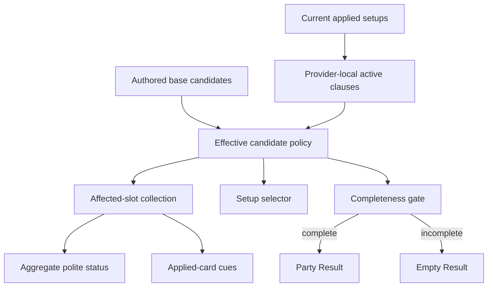

# fix: Derive contextual main-stat candidates from active effects

## Summary

Keep each Agent's authored static candidate set as the bounded policy base, then derive the currently effective main-stat candidates from active source-effect pressure and recipient applicability before Result calculation. Add the first exceptional filter for material broad pre-PEN DEF pressure without naming Trigger or Spectral Gaze in candidate policy, re-preparing unrelated Agents, or introducing runtime scoring.

---

## Problem Frame

The current implementation stores bounded Agent candidates correctly, but treats those arrays as the complete session answer. Setup UI and reducer validation read the static maps directly, while completeness checks only that required values are present. A selected provider effect therefore cannot change another Agent's candidates, and an invalidated selection could remain internally complete if filtering were added only to presentation.

The first current pressure provider is Trigger's Spectral Gaze. Its broad enemy DEF Reduction changes the normal Slot 5 pressure for applied Anby, Dialyn, and Trigger. Their authored directions respectively admit primary or residual `general_damage` investment and therefore consume the DEF region. Dialyn and Trigger are candidate-pressure recipients even though they are not delivered/projected Spectral or DEF Result consumers. The dependency is not `Trigger + Spectral Gaze`; it is an active, material, broad pre-PEN source effect reaching a setup direction whose retained formula participation compares within the DEF region.

Formula participation alone remains insufficient. Bounded contrary research found that Cordis Germina's action-scoped 20% DEF Ignore covers Seed's dominant Basic Attack and Ultimate output while current competitive practice still retains PEN Ratio. Cordis therefore changes preference rather than candidate membership by itself. This plan needs an authored semantic pressure on the active clause instead of an identity branch or a numeric threshold the non-simulator product cannot establish.

---

## Requirements

### Candidate semantics

- R1. Preserve `MAIN_STAT_IDS_BY_AGENT_AND_SLOT` as the authored base candidate policy. Do not replace it with legal main-stat inventory, runtime ranking, or Result-derived choices.
- R2. Derive a current effective main-stat set from active provider-local source clauses, recipient applicability, and one authored candidate-pressure meaning. Candidate policy must not branch on provider Agent, W-Engine, or Disc identity.
- R3. The first authored pressure is material broad pre-PEN DEF bypass. When Spectral supplies it in the applied Anby/Dialyn/Trigger party, it removes Slot 5 PEN Ratio from Anby, Dialyn, and Trigger effective candidates. Applicability comes from the selected Agent's authored setup-direction formula participation: primary or residual `general_damage` and `anomaly_damage` consume the DEF region, while `sheer_damage`, `daze_buildup`, and `anomaly_buildup` do not. Base candidate admission remains a separate competitive-policy gate; do not reuse Result projection recipients or add an Agent identity list.
- R4. Spectral Gaze supplies the current material broad pre-PEN pressure. Cordis Germina alone does not: its Basic/Ultimate-only DEF Ignore keeps PEN Ratio in the effective candidates when no independently material pressure is active and may affect only a future authored prepared preference.
- R5. Do not infer candidate exclusion from any positive DEF Reduction or DEF Ignore amount, refinement value, Result row, source name, or exact numerical cutoff. The source clause must explicitly carry the researched pressure meaning.
- R6. Most modifier balance changes preserve candidate membership and may change only an authored prepared first choice. Hard caps, complete formula inapplicability, explicit conversions, or another researched exceptional pressure require their own current consumer before changing candidates.

### Session lifecycle

- R7. Direct setup edits never run preparation or choose a replacement. A direct W-Engine edit changes the selected engine and its default refinement while preserving that Agent's Discs, main stats, and substats. When the pressure-producing edit removes selected main stats, one reconciliation clears only those invalid dependent selections, keeps every unrelated input, marks the party incomplete, and keeps Result empty until every affected slot is repaired. A later authorized preparation transition may populate the field with its authored prepared choice.
- R8. Removing the pressure restores the base candidate to the selector but does not restore a previously invalidated selection automatically.
- R9. Party/focus Apply still prepares all three Agents. Mindscape or pool still prepares only the changed Agent. Those authorized preparations may legitimately refill that Agent's incomplete field; any newly active pressure may then invalidate dependent selections on other Agents without preparing or resetting those recipients.

### Consumer and architecture boundaries

- R10. UI, reducer validation, completeness, and calculation gating must consume the same effective-candidate decision. Candidate changes remain visible at the owning selector without rationale prose.
- R11. Preserve the public `PartyResult`, `AgentResult`, and ResultPanel boundaries and all first-vertical values/presentation. Candidate resolution must not call `calculateParty`, consume Result output, or add a Result row for a candidate-only choice.
- R12. Keep the dependency acyclic and one-pass. Do not add iteration, a fixed-point solver, dependency graph, effect/formula registry, universal party snapshot, condition language, or optimizer.
- R13. Reconciliation returns the complete collection of newly invalidated applied slots from one transition. Activating Spectral can clear Anby, Dialyn, and Trigger Slot 5 together; repairing only a subset keeps the remaining setups incomplete and Result empty.
- R14. Accessibility recovery uses one polite aggregate announcement only when new invalidations occur, never on initial or ordinary rerenders, and never moves focus. Persistent applied-card cues are derived per slot and disappear independently as each selection is repaired.

---

## Scope Boundaries

### In scope

- Permanent candidate/lifecycle wording and the second-vertical requirements affected by the new dependency.
- One semantic candidate-pressure qualifier on the existing provider-local clause boundary.
- Session-aware effective Slot 5 candidates for the current six-Agent roster.
- Simultaneous cross-Agent invalidation, staged incomplete-selection recovery, and Result gating.
- Focused state, calculation, UI, keyboard, and first-vertical regression coverage.

### Deferred to Follow-Up Work

- Trigger and Astra Yao 4-piece/2-piece candidate and authored starting-package revisions.
- Additional contextual candidate pressures discovered through later Agents and verticals.
- Any Seed setup, candidates, Result, or party implementation. Seed was consulted only as an ephemeral contrary case for Cordis policy.

### Outside this product change

- Enemy DEF inputs, raw/final damage, rotations, uptime, action share, score thresholds, ranking, or optimization.
- A universal source/effect schema, candidate rule catalogue, dependency graph, or Result-to-preparation feedback.
- Automatic replacement of an invalid selection, automatic restoration of a prior selection, or cross-Agent re-preparation after a direct setup edit.

---

## Current Architecture Assessment

- `src/workbench/content.ts` correctly owns explicit bounded base candidates and prepared choices. Those closed maps are authored product policy, not a catalogue merely because they are Agent-indexed.
- `src/components/AgentSetup.tsx` currently reads the base main-stat map directly, so visible alternatives cannot respond to current party effects.
- `src/workbench/state.ts` validates main-stat actions against the same base map and checks completeness by presence rather than current candidate membership. This is insufficient for cross-Agent invalidation.
- `src/workbench/calculate.ts` already resolves provider-local `SourceBoundCurrentClause` values before Result projection. Its active clauses contain metric, source, recipient, action scope, and current activation, but the current orchestration is gated behind complete setup and exposes no bounded pre-Result candidate-pressure query.
- `eligibleAgentIds` currently limits Result projection and must not become candidate policy. The existing delivered/projected Result-consumer table remains unchanged; candidate-pressure applicability is a separate setup-policy decision.
- Adding `if Trigger` or `if Spectral Gaze` branches to reducer/UI would be catalogue-shaped. Keeping source identity in the source resolver while placing only semantic pressure in candidate policy avoids that failure.

---

## Key Technical Decisions

1. **Base versus effective candidates.** Keep authored base arrays in content. Introduce one session-aware candidate policy boundary that returns effective candidates for the applied state and recipient slot.
2. **Effect-level materiality.** Extend the existing provider-local clause with the smallest optional candidate-pressure qualifier. Its first and only value denotes material broad pre-PEN DEF bypass. This is authored on the active effect clause after whole-package/current-practice judgment; it is not inferred from amount or source identity.
3. **Reuse Phase 1 meaning, not Result.** Place the smallest provider-local observation below both state candidate policy and party calculation. The pressure query remains internal, bounded, and safe when a recipient setup is incomplete; it does not expose a universal party snapshot.
4. **Projection remains independent.** Result eligibility continues to decide which Agent projector shows a DEF row. Candidate pressure separately reaches applied setups whose authored direction participates in a DEF-consuming formula and whose bounded Slot 5 base admits PEN Ratio. Dialyn and Trigger are recorded only in candidate-pressure applicability; no Result-consumer table or personal-damage Result changes.
5. **Invalidate without fallback.** After any state transition that can change active pressure, perform one deterministic reconciliation pass and retain every affected applied slot as a collection. Selected main stats outside their effective sets become incomplete together; unrelated fields and Agents remain untouched.
6. **Authorized preparation remains distinct.** Direct W-Engine edits reconcile without preparation. Party/focus Apply prepares all three, while Mindscape/pool changes prepare only the changed Agent; those later authorized transitions may fill authored prepared choices before the same bounded reconciliation runs.
7. **Recoverable incomplete selector.** Main-stat presentation must render a missing required selection and its currently effective choices. A one-candidate incomplete state remains selectable and cannot masquerade as an already selected fixed value.
8. **Aggregate transition, persistent local state.** App owns transition-aware announcement state and passes per-slot incomplete descriptors to PartyWorkbench. Applied cards display those descriptors without recomputing candidate policy and clear their cues independently during staged recovery.

---

## Alternative Approaches Considered

- **Provider/source identity branches:** rejected because each new Agent, W-Engine, or Disc would add another named exception and obscure the effect/formula principle.
- **Remove PEN for every positive pre-PEN modifier:** rejected because Cordis/Seed is a current contrary case; action-scoped 20% DEF Ignore lowers marginal value but does not remove PEN from competitive practice.
- **Numeric bypass threshold:** rejected because the workbench has no enemy DEF, action-share, uptime, or final-damage model and should not pretend to know an exact crossover.
- **Read calculated Result rows:** rejected because candidate preparation cannot feed from Result and candidate-only consumers do not require a row.
- **Automatically select the next main stat or reprepare the recipient:** rejected because prepared setup is initialization, not continuous optimization, and direct edits preserve unrelated user choices.
- **General dependency engine or effect registry:** rejected because one acyclic current pressure has one visible consumer boundary.

---

## High-Level Technical Design

> This illustrates the intended relationship and is directional guidance for review, not implementation specification.

The effective policy reads active clause semantics before Result. Result values never return to the policy.

---

## Implementation Units

- U1. **Align durable candidate and lifecycle policy**

**Goal:** Record the provider-neutral effect/formula boundary and the exceptional DEF candidate behavior before production changes.

**Requirements:** R1-R9, R12-R14

**Dependencies:** None

**Files:**
- Modify: `docs/setup-workbench-product-contract.md`
- Modify: `docs/brainstorms/2026-08-07-soldier-zero-vertical-requirements.md`

**Approach:**
- Clarify that direct selected-input dependencies may change another applied Agent's effective candidates without re-preparing that Agent.
- Distinguish ordinary modifier balance, which normally changes authored preparation, from researched exceptional candidate exclusion.
- Record material broad pre-PEN pressure as the current exception and Cordis action-scoped DEF Ignore as the current contrary case.
- Keep the permanent product contract as the policy owner. Update the vertical document only to align its current R/AE mapping and add candidate-pressure applicability separately. Keep the existing delivered/projected Spectral and DEF Result-consumer table unchanged; do not make Dialyn a Result consumer or add a Dialyn Result row.

**Test expectation:** none — this unit changes product/vertical requirements consumed by later behavioral units.

**Verification:** The permanent contract and vertical requirements agree on provider-neutral pressure, no simulator threshold, target-only preparation, cross-Agent invalidation, and empty Result behavior.

---

- U2. **Expose bounded active candidate pressure**

**Goal:** Reuse current provider-local effect resolution to expose only the active semantic pressure needed by candidate policy.

**Requirements:** R2-R6, R11-R12

**Dependencies:** U1

**Files:**
- Modify: `src/workbench/effects.ts`
- Create: `src/workbench/provider-effects.ts`
- Modify: `src/workbench/calculate.ts`
- Modify: `src/workbench/calculation/agents/trigger.ts`
- Test: `src/workbench/calculate.soldier-zero.test.ts`

**Approach:**
- Add one optional semantic candidate-pressure qualifier to existing source-bound clauses; do not add source names, candidate lists, ranks, or scores to it.
- Mark the active broad Spectral enemy DEF Reduction with the current pressure. Leave Cordis's Basic/Ultimate action clause unmarked.
- Move only the provider-local observation needed by both consumers into a lower module imported by calculation and candidate policy. Keep state as a type-only dependency there so `state -> candidates -> provider effects` does not cycle back through `calculate -> state`.
- The bounded pressure query must resolve from complete provider-local inputs even while a recipient main stat is null. It never calls `isCompleteWorkbench` or `calculateParty`; the complete gate continues to guard Result projection only.
- Preserve the approved three-phase Result sequence and complete Result gate.
- Keep Result projection eligibility separate from pressure applicability so Yixuan Sheer still omits DEF, Dialyn gains no damage row, and Anby retains the existing visible DEF source.

**Patterns to follow:**
- Existing `SourceBoundCurrentClause` metric/recipient/action semantics in `src/workbench/effects.ts`.
- Existing explicit Agent-local provider resolution and exhaustive orchestration in `src/workbench/calculate.ts`.

**Test scenarios:**
- Regression: Spectral still projects Anby's DEF Reduction and does not create Yixuan, Dialyn, Trigger, Lucia, or Astra DEF Result rows.
- Regression: Cordis retains its existing Basic/Ultimate DEF Ignore Result behavior without changing Result recipients.
- Regression: provider and applied-slot traversal order do not change existing PartyResult values.
- Integration boundary: the effective-candidate behavior in U3 can distinguish active broad Spectral pressure from Cordis alone without tests freezing the internal candidate-pressure field shape.

**Verification:** Candidate policy can inspect one active semantic pressure without calling `calculateParty` or changing Result DTOs.

---

- U3. **Derive effective candidates and reconcile state**

**Goal:** Make candidate validity and completeness respond to current active pressure without automatic optimization.

**Requirements:** R1-R3, R5-R13

**Dependencies:** U2

**Files:**
- Create: `src/workbench/candidates.ts`
- Modify: `src/workbench/state.ts`
- Test: `src/workbench/state.test.ts`
- Test: `src/workbench/calculate.dialyn.test.ts`
- Test: `src/workbench/calculate.soldier-zero.test.ts`

**Approach:**
- Keep static base candidates in content and centralize the state-aware effective-main-stat query in one policy module.
- Filter Slot 5 PEN Ratio only when the active clause carries the material broad pre-PEN pressure, the selected Agent's authored direction participates in `general_damage` or `anomaly_damage`, and the bounded base candidates admit PEN Ratio. Formula participation determines effect applicability; base admission remains competitive policy. Do not consult `eligibleAgentIds` or add a second Agent list.
- Validate selection actions and complete setup state against the effective set, not the base map alone.
- Reconcile once after each reducer transition that changes applied setup or party state. Draft-only changes do not reconcile applied state. A direct W-Engine selection changes only the engine/default refinement before reconciliation and preserves that Agent's Discs, mains, and substats; it does not prepare Trigger. Pool/Mindscape changes run the existing target-only preparation, and Party/focus Apply runs the existing all-three preparation, before the same bounded reconciliation.
- Collect every newly invalid selected main stat before committing the transition. Activating Spectral in Anby/Dialyn/Trigger can therefore clear all three Slot 5 selections atomically while preserving every unrelated value.
- Keep the current pressure acyclic: its activation reads provider-local inputs and never reads the dependent main stat it may invalidate. A future pressure that violates this boundary requires a new product decision rather than iteration.
- A subsequent authorized recipient preparation may fill its own missing field with the authored first choice. It does not restore selection history, and any remaining affected recipient stays incomplete.

**Patterns to follow:**
- Slot-owned immutable updates and explicit candidate rejection in `src/workbench/state.ts`.
- Static candidate/prepared-choice separation in `src/workbench/content.ts`.

**Test scenarios:**
- Happy path: without active material pre-PEN pressure, Anby, Dialyn, and Trigger Slot 5 retain their complete authored base candidates, including PEN Ratio.
- Happy path: with Spectral pressure active, all three current DEF-region setups omit PEN Ratio while their prepared Electric DMG/ATK choices remain complete.
- Simultaneous transition: in Anby/Dialyn/Trigger, select PEN for all three while Trigger uses a manually selected non-Spectral full-pool engine, then directly select Spectral; all three Slot 5 selections clear in one transition and every other Anby, Dialyn, and Trigger input remains exact.
- Direct edit: selecting Spectral changes Trigger's W-Engine/default refinement and runs one reconciliation while preserving Trigger's selected 4-piece, 2-piece, Slot 4/5/6 mains, and all substat counts. Selecting a non-pressure engine removes the filter without restoring recipient history.
- Recovery: remove the pressure; PEN returns as a candidate, but the incomplete selection is not restored until the user chooses it or another candidate.
- Contrary: Cordis without Spectral leaves Anby's PEN candidate valid.
- Order: Cordis plus Spectral excludes PEN in both provider traversal orders; Cordis alone does not.
- Contrary: Yixuan Sheer, Trigger Daze, and Agents without an authored PEN candidate remain unchanged.
- Provider preparation: with Trigger in the full pool and manually changed away from Spectral, changing Trigger Mindscape re-prepares only Trigger to authored Spectral, activates pressure, and reconciles both recipients without preparing them.
- Authorized recovery: after staged repair leaves one recipient incomplete, that recipient's Mindscape/pool transition re-prepares only that Agent and can fill its Slot 5 with the authored choice, restoring completeness. Party/focus Apply can instead prepare all three and restore a complete party. Neither path restores old PEN history, and Result remains empty whenever any affected recipient is still incomplete.
- Staged calculation gate: after simultaneous invalidation, repairing only one or two Agents leaves `isCompleteWorkbench` false and `calculateParty` null; repairing the third restores a complete setup and Result.
- Order: provider slot and recipient slot order do not change effective candidates, affected-slot membership, or invalidation.

**Verification:** State has one source of truth for current candidate validity, remains acyclic, and never selects or ranks a replacement.

---

- U4. **Render and recover contextual main-stat choices**

**Goal:** Show effective candidates and make an invalidated main-stat selection recoverable through the established local selector interaction.

**Requirements:** R7-R10, R13-R14

**Dependencies:** U3

**Files:**
- Modify: `src/App.tsx`
- Modify: `src/components/AgentSetup.tsx`
- Modify: `src/components/PartyWorkbench.tsx`
- Modify: `src/app.css`
- Create: `src/components/AgentSetup.test.tsx`
- Modify: `src/App.setup.test.tsx`
- Modify: `src/App.party.test.tsx`

**Approach:**
- App derives effective choices and per-slot incomplete descriptors, passes candidate choices to the viewed Setup, and passes descriptors to PartyWorkbench. Neither AgentSetup nor PartyWorkbench recomputes candidate policy.
- Keep the whole Stat bank visible when one required selection is missing. All valid main-stat blocks and effective-substat controls retain their current values and interactivity; only the invalid slot becomes incomplete.
- Render an invalid slot as a required-choice button labeled `Disc 5 main stat required`. It opens the complete effective set rather than only alternatives and remains operable when exactly one candidate exists. Selecting a candidate restores the normal selected control and returns focus there. Do not add candidate-count copy.
- Preserve selected, open, single-candidate, keyboard-focus-return, and source-interaction geometry. Candidate filtering adds no rationale panel or source prose.
- Preserve the current viewed slot and keyboard focus after cross-Agent invalidation. When a transition newly invalidates slots, announce one polite aggregate status naming every affected Agent and Disc slot. Do not announce on initial render, ordinary rerender, or repair-only transitions, and do not move focus.
- PartyWorkbench renders a persistent incomplete cue on each affected applied card from the supplied descriptors. With simultaneous Anby/Dialyn/Trigger invalidation all three cards are cued; repairing one clears only that card while the others remain cued.
- Keep the applied-party rail structure and other Agents' selectors unchanged; the masthead and Result reflect incomplete state immediately.

**Patterns to follow:**
- Local selector placement and focus return in `src/components/AgentSetup.tsx`.
- Empty Result and applied-state status in `src/App.tsx`.

**Test scenarios:**
- Happy path: in a party without pressure, Dialyn and Anby Slot 5 selectors show PEN beside their other authored choices.
- Happy path: activating Spectral pressure removes PEN from both effective selector lists without changing valid non-PEN current selections.
- Simultaneous invalidation: activating Spectral with Anby, Dialyn, and Trigger all on PEN produces one polite aggregate announcement, cues all three cards, preserves current view/focus, and empties Result.
- Staged recovery: repairing one Agent clears only its card cue and keeps Result absent; repairing the second clears the remaining cue and restores Result.
- Preservation: Slot 4, Slot 6, and every effective-substat control remain visible and usable while Slot 5 is incomplete.
- Announcement boundary: initial render, ordinary rerenders, opening/viewing an incomplete Agent, and repair-only transitions do not repeat the polite status.
- Restoration: removing pressure makes PEN visible again but does not select it.
- Keyboard: opening the incomplete selector and choosing an allowed candidate returns focus to the changed Slot 5 control.
- Component boundary: a supplied null main stat with exactly one effective candidate still renders a required-choice button, dispatches that candidate, and restores focus.
- Responsive: required-choice content, aggregate status, applied-card cues, and recovery choices remain readable and operable at the current narrow breakpoint without horizontal overflow.
- Regression: unrelated W-Engine, Disc, main-stat, substat, Party Edit, source highlighting, and first-vertical selector flows retain current behavior.

**Verification:** The visible candidate set, accepted reducer actions, and PREPARED/INCOMPLETE Result state never disagree.

---

- U5. **Verify the bounded dependency end to end**

**Goal:** Independently prove semantic scope, lifecycle safety, UI recovery, and absence of catalogue/optimizer behavior.

**Requirements:** R1-R14

**Dependencies:** U2-U4

**Files:**
- Modify as behavior requires: `src/workbench/state.test.ts`
- Modify as behavior requires: `src/workbench/calculate.soldier-zero.test.ts`
- Modify as behavior requires: `src/workbench/calculate.dialyn.test.ts`
- Modify as behavior requires: `src/App.setup.test.tsx`
- Modify as behavior requires: `src/App.party.test.tsx`

**Approach:**
- Run focused and full behavioral suites, strict TypeScript, production build, and diff checks.
- Verify in-app on a unique port across desktop and narrow widths, including a mixed party with Dialyn, Trigger, and an eligible Focus.
- Inspect all affected closed/open/incomplete selector states, keyboard focus, empty/recovered Result, responsive overflow, and console output.
- Review the final diff for source-name branching in candidate policy, Result-to-candidate imports, automatic replacement, iteration, unrelated candidate drift, and the absence of Seed content, scores, thresholds, registries, and new Result metrics. These are review gates, not structure-freezing automated tests.

**Test scenarios:**
- Integration: change only the pressure-producing provider selection and observe dependent candidates on another Agent.
- Integration: invalidate Anby, Dialyn, and Trigger PEN together, repair them one at a time, and confirm Result remains empty until all three are complete.
- Regression: reapply Yixuan/Dialyn/Lucia and recover the preserved first-vertical setup and Result behavior.

**Verification:** Focused/full tests, TypeScript, build, diff check, browser interactions, responsive checks, and zero console errors all pass from the exact worktree.

---

## System-Wide Impact

- **Interaction graph:** A setup change can alter active semantic pressure, which changes multiple recipient slots' effective candidates and completeness before synchronous Result calculation. Direct edits cannot prepare recipients; later authorized recipient/party preparation may fill authored choices.
- **State lifecycle risks:** Every invalid slot from one transition must be collected atomically; staged recovery must not restore Result early; restoring candidate availability must not restore prior history; one reconciliation pass must not become feedback or iteration.
- **Calculation boundary:** Provider-local clause meaning is shared before projection, but Result DTOs and the approved Anby-only Phase 2 remain unchanged.
- **Presentation boundary:** App passes effective choices and per-slot incomplete descriptors. Setup owns local recovery, PartyWorkbench owns persistent applied-card cues, and one transition-aware polite status announces only newly invalidated slots. Result remains empty rather than rendering stale or fallback values.
- **Unchanged invariants:** Base candidate authorship, one deterministic prepared setup, first-vertical behavior, target-only Mindscape/pool preparation, all-three party/focus preparation, and direct-edit preservation outside the invalid dependent selection.

---

## Risks & Mitigations

| Risk | Mitigation |
|---|---|
| Semantic pressure becomes a generic effect schema | Add one optional current qualifier only; require a new current consumer before adding another value |
| Any pre-PEN amount accidentally removes PEN | Pressure is authored after formula and competitive-practice judgment; Cordis is a contrary test |
| Candidate logic branches on source identity | Candidate policy reads only active pressure semantics and recipient base candidates; source identity remains in the provider resolver and Result disclosure |
| Calculation output feeds setup | Resolve pressure from provider-local clauses before projection and prohibit candidate imports from Result composition |
| Invalid selection is hidden or unrecoverable | Render incomplete main-stat selectors with the effective choices and behavior-test recovery |
| Simultaneous invalidation is reduced to one slot | Reconcile an affected-slot collection atomically, cue every card, and cover staged recovery before Result restoration |
| Accessibility status repeats or steals focus | Announce only a newly invalidating transition through one polite aggregate status; keep initial/rerender/repair transitions silent and never move focus |
| Provider edit resets another Agent | Reconcile only invalid dependent fields and assert every unrelated object/value remains unchanged |
| Shared Phase-1 extraction expands beyond scope | Expose only the bounded pressure query; do not create a universal snapshot or public effect inventory |

---

## Documentation / Operational Notes

- Bounded Seed/Cordis research settles only the current contrary boundary and remains ephemeral; no Seed content, source receipt, or future vertical is added.
- The existing second-vertical plan remains a record of its earlier broad implementation pass. This focused plan owns the newly accepted contextual-candidate correction without declaring the second vertical a preserved product baseline.
- No API, persistence, migration, deployment, or asset work is involved.
- Do not stage or commit during implementation unless the user separately requests it.

---

## Sources & References

- **Origin document:** `docs/brainstorms/2026-08-07-soldier-zero-vertical-requirements.md`
- Permanent setup owner: `docs/setup-workbench-product-contract.md`
- Formula owner: `docs/zzz-formula-mechanics.md`
- Source retention owner: `docs/source-fact-boundary.md`
- Presentation owner: `docs/workbench-ui-design-rules.md`
- Existing implementation plan: `docs/plans/2026-08-07-005-feat-soldier-zero-vertical-plan.md`
- Relevant learning: `docs/solutions/workflow-issues/preserve-interaction-fidelity-in-ui-explorations-2026-08-05.md`
