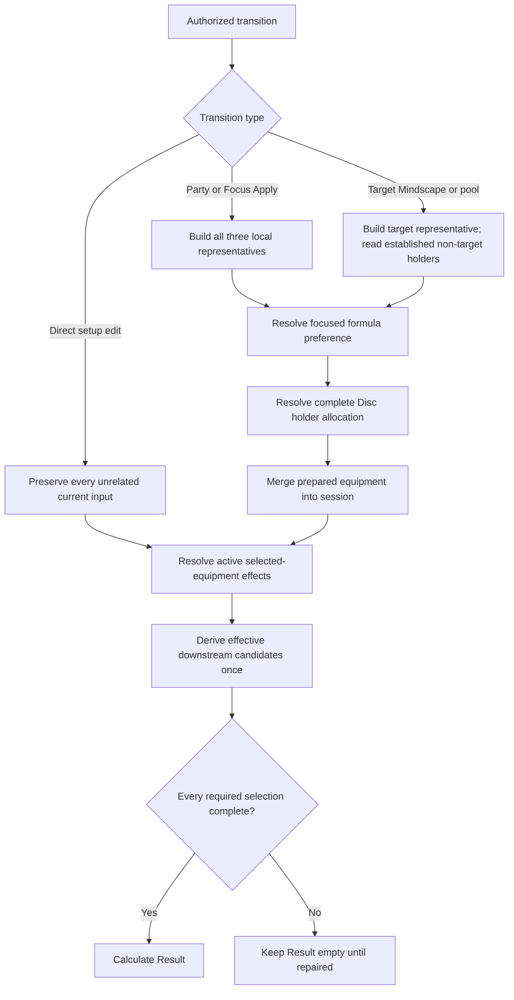

# feat: Add party-directed prepared setups

## Summary

Extend the existing representative setup policy with one pure, pre-Result preparation layer. It will adjust only the current W-Engine and complete Disc-package first choices justified by the focused damage formula and non-stacking holder allocation, then hand the selected equipment to the existing active-effect and effective-main-stat pipeline.

---

## Problem Frame

The six admitted Agents now have stable competitive candidates and local representative setups, but current preparation is party-blind. That makes Trigger start from the same Spectral/King package even when the focused formula cannot use DEF or when Dialyn is the only competitive King holder, and it cannot prepare Astra's bounded Moonlight alternative when Astral Voice is already established elsewhere.

---

## Requirements

- R10. Party or Focus Apply prepares all three Agents in one order-independent party context: unchanged Agents retain their current Mindscape and pool before rebuilding, newly applied Agents start at rank-default Mindscape and full pool, and departed Agents retain no hidden setup.
- R11. A Mindscape or pool transition prepares only the changed Agent, while direct setup edits prepare no Agent and preserve unrelated selections.
- R12. Existing whole-party candidate reconciliation and incomplete-Result behavior run after authorized equipment preparation.
- R18-R19. Trigger retains her current bounded candidates and local Spectral/King representative; party-sensitive preparation may choose only the approved Ice-Jade or Astral alternatives without changing membership.
- R22. Astra retains Astral Voice as her local representative and prepares a legal complete Moonlight package only when another established Astral holder supplies the allocation condition.
- R23d-R23e. Focused primary-formula consumption controls Trigger's current full-pool W-Engine preference: Yixuan Focus selects Ice-Jade, Anby Focus selects Spectral, and non-limited remains The Restrained.
- R23f. Non-stacking holder allocation keeps King on the less-flexible Dialyn and moves Trigger to Astral; a separately authorized Astra preparation moves Astra from Astral to Moonlight when another established holder already owns Astral.
- R23g. Resolve representative equipment, primary-formula adjustment, holder allocation, selected-equipment pressure, and downstream candidates in that acyclic order with no iteration, fallback, or continuous normalization.
- R25. Result output never feeds back into preparation, and no runtime score or ranking selects equipment.
- R49. First-vertical local representatives and every unchanged setup, Result, and interaction behavior remain stable.

**Origin actors:** A1 (setup workbench user), A2 (workbench session), A4 (content author)

**Origin flows:** F1 (second-vertical application), F3 (setup adjustment), F5 (first-vertical reapplication)

**Origin acceptance examples:** AE23 (Focus-sensitive Trigger engine), AE24 (Trigger/Dialyn Disc allocation), AE25 (target-only Astra allocation), AE26 (equipment-before-pressure order)

---

## Scope Boundaries

- Do not add or remove W-Engine, Disc, main-stat, or substat candidates.
- Do not implement a non-CRIT or anomaly preparation branch before an admitted current Focus direction consumes it.
- Do not create Agent-party combination presets, runtime package scores, candidate rankings, an optimizer, or a universal equipment-effect registry.
- Do not use Result values, calculated damage, enemy state, rotations, uptime, or action share to choose equipment.
- Do not make direct equipment edits prepare or rewrite another Agent; duplicate non-stacking holders may exist in an edited session.
- Do not continuously normalize holder allocation after every edit or after another Agent's target-only preparation.
- Do not redesign Setup, Party Edit, Result, selectors, or the applied-card rail.

### Deferred to Follow-Up Work

- Non-CRIT primary-formula equipment preparation: admit only with a future focus-eligible Agent that creates a current consumer.
- Broader effect-based W-Engine and Disc-package adjustments: extend only after another vertical establishes a repeated semantic pressure beyond the current DEF-consumption and non-stacking-holder cases.

---

## Context & Research

### Relevant Code and Patterns

- `src/workbench/content.ts` owns the authored candidate sets, formula participation, and current party-blind representative packages.
- `src/workbench/state.ts` owns initial preparation, all-party Apply, target-only Mindscape/pool preparation, direct-edit locality, and the final one-pass main-stat reconciliation.
- `src/workbench/candidates.ts` already derives downstream effective main stats from formula applicability and active semantic pressure without Result feedback.
- `src/workbench/provider-effects.ts` is intentionally downstream of equipment selection and must not be reused to decide unresolved equipment first choices.
- `src/workbench/calculation/composition.ts` already resolves non-stacking selected effects for Result; preparation will choose a representative holder without changing that Result safety boundary.
- `src/workbench/state.test.ts` contains the authoritative setup lifecycle and exact prepared-package characterization, including one stale party-invariance expectation this work replaces.
- `src/App.setup.test.tsx` verifies the visible prepared inputs and direct-edit behavior through the established selector grammar.

### Institutional Learnings

- `docs/solutions/workflow-issues/preserve-interaction-fidelity-in-ui-explorations-2026-08-05.md` requires the current setup values, editable controls, selector states, keyboard behavior, and responsive surface to remain the reference-state contract while semantic preparation changes underneath them.

### External References

- None. The retained six-Agent facts, candidate decisions, formula consequences, and prepared alternatives are already owned by current repository authorities and requirements.

---

## Key Technical Decisions

- Add one pure preparation-policy boundary before provider-effect resolution. The boundary may read authored content and established party context, but it must not import session reducers, provider clauses, calculation, or Result types.
- Rename the current party-blind prepared package terminology to local `representative` terminology where touched. This makes the existing baseline distinct from the party-sensitive preparation stage without preserving a misleading parallel API.
- Share only the bounded formula consequence currently consumed by both layers: whether a setup formula uses the DEF region. Do not introduce a formula metadata registry or encode future non-CRIT behavior without a current consumer.
- Keep adjustment triggers semantic and adjustment outputs authored. Formula consumption and holder flexibility determine whether an adjustment applies; Trigger's Ice-Jade/Astral and Astra's Moonlight complete packages remain explicit competitive first-choice policy.
- Resolve all-party preparation from three local representatives as one batch, so applied slot traversal cannot decide a holder. Target-only preparation may inspect non-target selected 4PC identities as established context but mutates only its target.
- Treat a Disc adjustment as a complete legal package. Full-pool Astra changes from Astral 4PC + Moonlight 2PC to Moonlight 4PC + Astral 2PC; non-limited Astra keeps Hormone 2PC.
- Preserve the downstream boundary: after prepared equipment is established, existing active clauses derive candidate pressure and the reducer performs its current one-pass invalidation. Preparation itself never clears downstream selections or selects a recovery fallback.

---

## Open Questions

### Resolved During Planning

- Which damage direction owns a mixed Yixuan/Anby/Trigger party? The explicitly selected Focus Agent supplies the primary damage formula, so changing Focus changes Trigger's full-pool engine preference.
- Can Trigger, Dialyn, and Astra establish the full holder-allocation chain on Party Apply? No; that three-Agent draft has no focus-eligible member. Astra's current reachable Moonlight adjustment instead occurs on a later authorized Astra preparation after another party member's Astral selection is already established.
- Should preparation keep an allocation continuously optimal? No. Direct edits and target-only lifecycle rules take precedence; the workbench shows the actual edited setup rather than silently redistributing equipment.

### Deferred to Implementation

- Exact helper and type names may follow the surrounding TypeScript conventions, provided the pure preparation boundary and dependency direction remain intact.

---

## High-Level Technical Design

> *This illustrates the intended approach and is directional guidance for review, not implementation specification. The implementing agent should treat it as context, not code to reproduce.*

---

## Implementation Units

- U1. **Introduce pure representative and party-sensitive preparation policy**

**Goal:** Separate party-blind representative packages from the bounded semantic adjustments that choose current W-Engine and complete Disc first choices.

**Requirements:** R18-R19, R22, R23d-R23f, R25; AE23-AE25

**Dependencies:** None

**Files:**
- Create: `src/workbench/formula-policy.ts`
- Create: `src/workbench/preparation.ts`
- Create: `src/workbench/preparation.test.ts`
- Modify: `src/workbench/content.ts`
- Modify: `src/workbench/candidates.ts`

**Approach:**
- Preserve candidate arrays and local package values while naming the existing content as representative policy rather than final context preparation.
- Extract only the current shared formula consequence needed by preparation and effective-main-stat policy: DEF-region participation for the structured formula-family union.
- Resolve Trigger's full-pool engine from the focused primary formula and leave non-limited unchanged.
- Resolve King holder priority from competitive 4PC flexibility, then apply the authored Trigger Astral complete-package alternative when Dialyn must retain King.
- Resolve Astra's Moonlight complete package only when an established other holder owns Astral, including the legal full/non-limited 2PC difference.
- Keep production choices as explicit authored mappings. Pure-policy tests assert that every produced engine belongs to the target pool and every complete Disc package belongs to the authored candidate lists; production adds no user-facing runtime validation or first-candidate fallback.

**Execution note:** Implement the pure decision matrix test-first so slot order and local-baseline preservation are proven before reducer integration.

**Patterns to follow:**
- Structured formula participation in `src/workbench/content.ts`
- Provider-neutral formula applicability in `src/workbench/candidates.ts`
- Closed, bounded content maps rather than registries in the existing workbench content layer

**Test scenarios:**
- Happy path: Yixuan Focus with full-pool Trigger selects Ice-Jade + King, while Anby Focus selects Spectral + King.
- Happy path: the equivalent non-limited Trigger cases both retain The Restrained + King.
- Happy path: Yixuan/Trigger/Dialyn and Anby/Trigger/Dialyn both allocate King to Dialyn and Astral + Shockstar to Trigger; only the focused formula changes Trigger's engine.
- Edge case: every permutation of a valid Focus/Trigger/Dialyn party produces the same Agent-owned packages.
- Happy path: target-only full-pool Astra with another established Astral holder receives Moonlight 4PC + Astral 2PC; non-limited receives Moonlight 4PC + Hormone 2PC.
- Contrary case: Astra without another established Astral holder retains her local Astral package.
- Contrary case: first-vertical representative packages are byte-for-byte unchanged by the new policy when no current adjustment applies.

**Verification:**
- Pure preparation outputs match AE23-AE25, every Disc package is legal, and no test needs calculation or Result data to select equipment.

---

- U2. **Integrate authorized preparation with the workbench lifecycle**

**Goal:** Make initial state, Party/Focus Apply, Mindscape, and pool transitions use the new preparation policy while preserving direct-edit locality and one-pass downstream reconciliation.

**Requirements:** R10-R12, R23g, R25; AE23-AE26

**Dependencies:** U1

**Files:**
- Modify: `src/workbench/state.ts`
- Modify: `src/workbench/state.test.ts`

**Approach:**
- Batch all three local representatives before resolving all-party formula and holder adjustments; do not derive one slot from another slot's unresolved prepared result.
- Preserve the existing Party Apply ownership rule while changing its preparation source: unchanged Agents retain Mindscape/pool, new Agents start at M0/full, and departed Agents keep no hidden setup.
- For Mindscape or pool changes, rebuild only the target from its new local representative and allow the preparation policy to inspect established non-target 4PC selections.
- Keep direct equipment/refinement/Disc/main/substat actions on the existing local path with no preparation call.
- Run the existing effective-main-stat reconciliation once after the prepared equipment has been merged, preserving simultaneous invalidation, no fallback, and empty Result while incomplete.
- Remove stale characterization that asserts Trigger prepares identically across parties, while retaining exact representative-package assertions for contexts with no adjustment.

**Execution note:** Characterize the current direct-edit and first-vertical lifecycle before replacing the party-blind preparation calls.

**Patterns to follow:**
- All-three Party Apply versus target-only Mindscape/pool ownership in `src/workbench/state.ts`
- One-pass `reconcileEffectiveMainStats` after every non-draft applied transition
- Exact setup preservation assertions in `src/workbench/state.test.ts`

**Test scenarios:**
- Covers AE23. Focus-only Party Edit Apply on Yixuan/Anby/Trigger rebuilds all three and changes only Trigger's authored full-pool engine preference between Ice-Jade and Spectral.
- Covers AE24. Party Apply with Focus/Trigger/Dialyn produces Dialyn King and Trigger Astral independently of applied slot order.
- Covers AE25. Directly changing Trigger to Astral leaves Astra unchanged; a later Astra Mindscape change prepares only Astra's legal Moonlight package and preserves Trigger's direct selection.
- Happy path: switching only Astra's pool under an established Astral holder produces the non-limited Moonlight + Hormone package and preserves both non-target setups.
- Happy path: changing Trigger's Mindscape or pool while Dialyn's established setup holds King prepares only Trigger with Astral + Shockstar in both pools and preserves Dialyn exactly.
- Contrary case: directly changing Trigger's engine or 4PC never changes Astra, Dialyn, or another Trigger input outside the selected control's existing behavior.
- Covers AE26. Yixuan-Focus Trigger preparation establishes Ice-Jade before reconciliation and keeps PEN effective where formula policy permits it; Anby-Focus establishes Spectral first and excludes PEN while retaining complete authored mains.
- Integration: a target-only Trigger preparation that newly restores Spectral preserves non-target edits, clears every now-invalid selected PEN main in one pass, and keeps Result empty until all are repaired.
- Regression: Party Apply for Yixuan/Dialyn/Lucia and all first-vertical target-only preparations retain their exact existing packages and completeness behavior.

**Verification:**
- Every authorized transition prepares exactly the allowed slots, direct edits prepare none, and preparation order cannot change selected equipment or downstream candidate state.

---

- U3. **Stabilize visible setup and Result integration**

**Goal:** Prove that new prepared choices appear through the existing UI and calculations without changing candidate membership, selector behavior, source semantics, or the preserved first vertical.

**Requirements:** R12, R19, R22-R23g, R49; AE23-AE26

**Dependencies:** U1, U2

**Files:**
- Modify: `src/App.tsx`
- Modify: `src/App.setup.test.tsx`
- Modify: `src/App.result.test.tsx`
- Modify: `src/workbench/calculate.soldier-zero.test.ts`

**Approach:**
- Replace the stale UI expectation that Trigger's prepared setup is party-invariant with assertions for the visible engine and 4PC first choices in the approved contexts.
- Keep candidate selectors unchanged: the same engines and Discs remain editable, and preparation changes only the selected first choice.
- Update only calculation expectations whose starting equipment genuinely changed; do not alter Agent effect modules or Result projection to make old values pass.
- Retain current non-stacking Result behavior for directly edited duplicate King, Astral, or Moonlight holders.
- Clear active Setup/Result source linking whenever Party/Focus Apply or target-only preparation replaces the viewed setup's selected source context; do not leave an obsolete source highlighted after its equipment is replaced.
- Exercise Party Edit and target-only transitions through the rendered application, preserving the current selected/open selector grammar, keyboard focus behavior, compact edit state, and responsive layout.

**Patterns to follow:**
- Visible prepared-selection assertions and focus-return behavior in `src/App.setup.test.tsx`
- Existing source-link activation and clearing behavior in `src/App.result.test.tsx`
- Source- and action-specific Result assertions in `src/workbench/calculate.soldier-zero.test.ts`

**Test scenarios:**
- Covers AE23. Applying the same Yixuan/Anby/Trigger roster with each eligible Focus visibly switches Trigger between Ice-Jade and Spectral without changing King, Shockstar, mains, or candidate controls.
- Covers AE24. Applying Yixuan/Trigger/Dialyn visibly selects Ice-Jade + Astral for Trigger and King for Dialyn; the Anby-Focus variant selects Spectral + Astral.
- Covers AE25. A direct Trigger Astral edit leaves Astra's visible Astral choice intact until a later Astra Mindscape/pool preparation selects the legal Moonlight package.
- Interaction: an active equipment source link clears after Focus Apply, Mindscape preparation, or pool preparation replaces the viewed setup context, while unchanged direct hover/focus behavior remains local.
- Regression: directly selected duplicate non-stacking Disc holders still remain selected while Result applies the existing highest/equal-origin rule.
- Regression: representative second-vertical and complete first-vertical Result expectations change only where the prepared equipment source changed.
- Interaction: selectors remain keyboard-operable, return focus locally, and show the unchanged candidate footprint after party-sensitive preparation.
- Responsive/browser: representative adjusted parties, compact Party Edit, and affected W-Engine/4PC selectors in closed, open, and keyboard-focused states render at desktop, breakpoint-adjacent, and narrow widths without clipping, overflow, focus loss, or console errors.

**Verification:**
- Focused and full tests, strict TypeScript, production build, diff checks, and in-app browser verification pass; the UI shows the prepared choices and no unrelated presentation or Result surface changes.

---

## System-Wide Impact

- **Interaction graph:** authorized state transitions call pure preparation, selected equipment feeds provider effects, provider effects feed effective candidates, and complete state feeds Result. Direct edits skip only the preparation stage.
- **Error propagation:** an invalid authored equipment package should fail development verification rather than silently substituting a candidate; ordinary downstream invalidation continues to use the existing incomplete setup state.
- **State lifecycle risks:** batch preparation must be slot-order independent, target-only preparation must not mutate non-target setups, and later target preparations may legitimately leave a previously adjusted non-target allocation unchanged.
- **API surface parity:** no public PartyResult, AgentResult, component props, persisted state, or external API changes are expected.
- **Integration coverage:** reducer tests establish lifecycle ownership; App tests prove visible selected inputs; calculation tests prove that only the newly selected sources change Result.
- **Unchanged invariants:** candidate membership, direct selector semantics, rank-default refinement, zero substats, three-slot completeness, selected-effect non-stacking, and first-vertical setup/Result behavior remain intact.

---

## Risks & Dependencies

| Risk | Mitigation |
|------|------------|
| Equipment preference accidentally depends on selected-provider clauses and becomes circular | Keep preparation upstream of `provider-effects.ts`; use only authored formula context, local representatives, and established non-target holders. |
| Sequential slot traversal chooses different Disc holders | Build all three representatives first and resolve the all-party allocation as one pure batch; test every valid slot permutation. |
| A 4PC adjustment creates an illegal same-ID 2PC package | Treat Disc preparation as a complete package and assert Astra's full/non-limited complements explicitly. |
| Target-only preparation silently rewrites another Agent | Return and merge only the target setup; test exact preservation of both non-target setups and their direct edits. |
| The pass grows into a future formula/effect catalogue | Persist only current DEF-consumption and non-stacking holder consumers; defer non-CRIT and additional pressure classes until admitted content requires them. |
| Changed prepared sources cause broad snapshot churn | Update behavior-bearing exact expectations only where selected equipment changed; preserve Agent calculation modules and first-vertical regressions. |

---

## Documentation / Operational Notes

- The origin requirements now replace the former preparation deferral with R23d-R23g and AE23-AE26.
- The permanent product contract already owns the two-layer acyclic preparation order, direct-edit locality, and target-only/all-party lifecycle; no additional permanent abstraction or policy section is required.
- No migration, persistence, feature flag, or deployment change is involved.

---

## Sources & References

- **Origin document:** [docs/brainstorms/2026-08-07-soldier-zero-vertical-requirements.md](../brainstorms/2026-08-07-soldier-zero-vertical-requirements.md)
- **Product authority:** [docs/setup-workbench-product-contract.md](../setup-workbench-product-contract.md)
- **Formula authority:** [docs/zzz-formula-mechanics.md](../zzz-formula-mechanics.md)
- **UI authority:** [docs/workbench-ui-design-rules.md](../workbench-ui-design-rules.md)
- **Preceding plan:** [docs/plans/2026-08-08-001-fix-contextual-main-stat-candidates-plan.md](2026-08-08-001-fix-contextual-main-stat-candidates-plan.md)
- **Relevant learning:** [docs/solutions/workflow-issues/preserve-interaction-fidelity-in-ui-explorations-2026-08-05.md](../solutions/workflow-issues/preserve-interaction-fidelity-in-ui-explorations-2026-08-05.md)
- Related code: `src/workbench/content.ts`, `src/workbench/state.ts`, `src/workbench/candidates.ts`, `src/workbench/provider-effects.ts`
