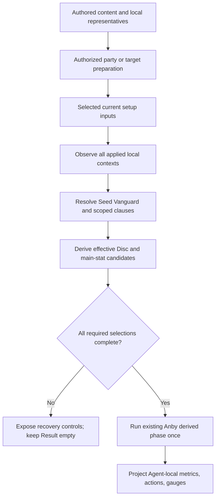
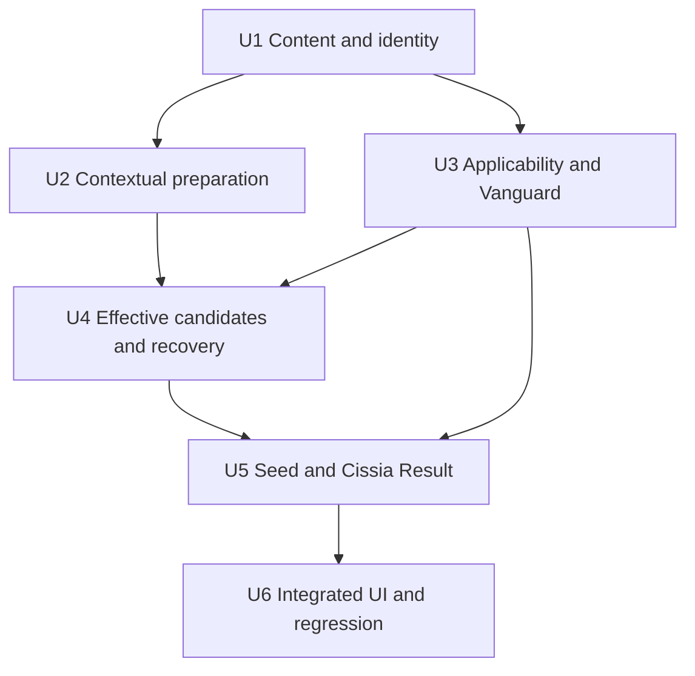
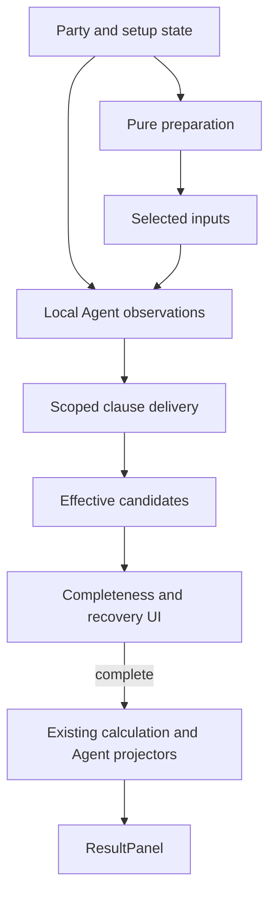

# feat: Add Seed and Cissia third vertical

## Summary

Extend the existing explicit content, party-directed preparation, scoped effect delivery, Agent-local calculation, and Setup/Result surfaces to admit Seed and Cissia alongside Astra Yao. Keep the current acyclic calculation and user interaction model while adding only the bounded Vanguard, contextual Disc, and recipient/formula applicability structures required by this vertical.

---

## Problem Frame

The first two verticals established the setup-to-Result product loop, but the third vertical is the first to combine a dynamically resolved party recipient, a contextual candidate addition, coordinated Disc holders, and recipient-scoped candidate pressure. The implementation must prove those relationships can compose through the current product contract without becoming a catalogue, optimizer, simulator, or universal effect system.

---

## Requirements

**Content and preparation**

- R1. Admit Seed and Cissia with their exact identity, Focus, Agent values, W-Engine and Disc candidates, refinement facts, compressed passive content, local representatives, and full/non-limited prepared defaults (origin R1-R11b, AE2, AE5-AE6).
- R2. Add Cissia's contextual Astral Voice candidate and preparation while preserving the authored local Dawn's Bloom package, coordinated all-party Cissia Astral/Astra Moonlight allocation, target-only preparation ownership, direct-edit locality, and existing non-stacking Result behavior (origin R8-R10, R18c, AE2-AE3, AE7).

**Resolution and effective candidates**

- R3. Resolve Seed's Vanguard from eligible non-Seed Attack Agents using exact unrounded current Initial ATK, with the earlier applied party slot as the explicit bounded exact-tie fallback, independent of provider traversal or calculation order (origin R3-R3c, AE1-AE1b).
- R4. Derive effective Disc and main-stat candidates from recipient, Attribute, formula, and current pressure; clear every newly invalid required selection atomically without fallback or history restoration; and keep Result empty until all required selections are repaired (origin F2, R17-R17a, AE4).

**Calculation and delivery**

- R5. Calculate Seed's Initial, Combat, and Fully Enabled metrics and canonical Slaughter, Downfall, and Ultimate outcomes, including cumulative M0-M6 behavior and the Fully Enabled M2 Slaughter maximum, while retaining the event Energy passive only in Setup content (origin R12-R14a, AE5, AE9).
- R6. Calculate Cissia's Initial, Combat, and Fully Enabled metrics, exact Core Energy Regen formula and M1 post-cap multiplier, Corrode Bone and Serpent's Kiss outcomes, cumulative M0-M6 behavior, and threshold/cap gauge without projecting event-conditioned Energy operations (origin R15-R16b, AE6, AE8-AE9).
- R7. Deliver Seed, Cissia, and existing Astra effects through source recipient plus Attribute/action/formula applicability, projecting only through each current Agent projector and preserving the existing Anby received-effect-dependent phase as the sole feedback phase (origin R18-R18c, R20, AE7-AE9).

**Preservation and verification**

- R8. Preserve the complete first and second verticals, current Party Edit and setup lifecycle, source interaction, keyboard behavior, responsive direction, and incomplete-selection contract while extending the visible identity, candidate, preparation, action, metric, and gauge consumers (origin R19-R20, AE1-AE10).
- R9. Complete behavior-bearing calculation, preparation, reducer, component, and integrated application coverage plus strict type, full test, production build, diff, browser, responsive, keyboard, source-link, and console verification (origin AE1-AE10).

**Origin actors:** A1 setup workbench user, A2 workbench session, A3 content author.

**Origin flows:** F1 Seed/Cissia/Astra application, F2 setup adjustment and re-preparation, F3 complete Result projection.

**Origin acceptance examples:** AE1-AE10, including AE1a/AE1b exact Vanguard cases.

---

## Scope Boundaries

- No Agent, W-Engine, or Disc admission beyond Seed and Cissia's approved choices; reuse the already admitted Astra Yao and existing equipment facts.
- No new image acquisition. Seed, Cissia, The Brimstone, Serpentine Seeker, Drill Rig - Red Axis, Dawn's Bloom, and Puffer Electro assets already exist locally.
- No Puffer Electro 4-piece fact, raw/final damage or Daze calculation, rotation, resource cadence, uptime, field-time, incoming-damage, simulator, optimizer, or runtime ranking.
- No catalogue, source registry, evidence archive, universal content/effect/condition schema, named-Agent compatibility matrix, generic tie policy, or runtime uncertainty system.
- No new received-effect feedback phase, fixed-point calculation, dependency graph, or Result operation category for event-conditioned Energy.
- No redesign of Party Edit, Setup, Result, identity hierarchy, source interaction, or responsive direction.
- No API, persistence, authentication, migration, deployment, analytics, or unrelated cleanup.

### Deferred to Follow-Up Work

- Broad UI/UX polish remains a separate product pass after the semantic vertical is complete.
- A reusable workflow learning or custom skill is not part of this implementation. Reconsider it only under a separate explicit request after later work demonstrates stable repetition.

---

## Context & Research

### Relevant Code and Patterns

- `src/workbench/content.ts` owns the closed identity/equipment unions, exact retained facts, candidate maps, formula participation, source labels, and local representatives.
- `src/workbench/preparation.ts` owns the pure local-representative-to-contextual-preparation pipeline, including focused-engine, King, Astral, and Moonlight decisions.
- `src/workbench/candidates.ts` owns effective candidate derivation downstream of selected equipment and provider pressure; `src/workbench/state.ts` owns one-pass invalidation, setup lifecycle, and completeness.
- `src/workbench/effects.ts` and `src/workbench/provider-effects.ts` own bounded clauses, local observations, recipient distribution, non-stacking context, and semantic source ordering.
- `src/workbench/calculate.ts` owns the complete-selection gate, exhaustive Agent dispatch, the single Anby received-effect phase, and final applied-slot projection.
- `src/workbench/calculation/agents/anby-soldier-0.ts` and `astra-yao.ts` provide the nearest current Initial-ATK observation, outgoing delivery, recipient projection, and non-stacking patterns.
- `src/components/PartyEditor.tsx`, `PartyWorkbench.tsx`, `AgentSetup.tsx`, `ResultPanel.tsx`, and `src/App.tsx` own the existing visible identity, recovery, result, and source-interaction grammar.
- Existing split tests in `src/workbench/*.test.ts`, `src/components/AgentSetup.test.tsx`, and `src/App.*.test.tsx` are behavior-bearing contracts rather than snapshot catalogues.

### Institutional Learnings

- `docs/solutions/workflow-issues/preserve-interaction-fidelity-in-ui-explorations-2026-08-05.md` requires verification of current values, available actions, closed/open/focused/recovery states, keyboard behavior, and responsive layouts before visual judgment. This vertical must preserve that interaction envelope and defer redesign.

### External References

- None. Exact facts and product decisions were closed in the origin requirements; external research receipts remain ephemeral and are not implementation inputs or repository content.

---

## Key Technical Decisions

| Decision | Smallest current representation | Rejected expansion |
|---|---|---|
| Third-vertical content | Extend the existing closed unions and explicit maps; store non-linear W1-W5 vectors exactly | Runtime content registry, generic scaler, or universal Agent schema |
| Cissia contextual Disc | One bounded repeated-Quick-Assist opportunity consumed by candidate and preparation policy | Direct Astra identity tree or general opportunity registry |
| Holder lifecycle | Extend the current ordered pure preparation pass: local representatives, Cissia contextual Astral, then Astra Moonlight | Continuous allocation, optimizer, or direct-edit redistribution |
| Seed Vanguard | One Seed-local resolver over observed exact Initial ATK and applied slot order | User selector, generic tie framework, or provider traversal fallback |
| Cross-party applicability | Optional current clause applicability for recipient, Attribute, formula, and existing action scope | Exhaustive named-Agent matrix or universal condition language |
| Candidate pressure | Query delivered pressure for one applied recipient before formula gating; use it for both Disc and main-stat consumers | Flat party-global pressure or Result-driven candidate feedback |
| Result projection | Extend Agent-local metric/action/gauge projectors and the existing ordered clause flow | Generic operation ledger, final damage simulation, or second feedback phase |
| Incomplete recovery | Broaden the current required-selection descriptor to Disc and main-stat cases | Hidden fallback, automatic history restoration, or generic form schema |

- Observe every applied Agent's local context before resolving Seed's Vanguard and provider clauses. Vanguard uses Initial inputs only; Combat/Fully values and rounded Result display are ineligible.
- Keep Cissia's local representative complete and party-independent. Contextual Astral is an effective candidate and prepared adjustment, not a replacement for the local Dawn policy.
- Resolve all-party preparation as a batch so Cissia Astral and Astra Moonlight are slot-order independent. Target-only preparation returns only the target setup; direct edits bypass preparation.
- Keep candidate pressure stable while selections are incomplete. The party context and selected valid sources still determine effective candidates even though Result projection is gated off.
- The current admitted roster keeps Vanguard pressure acyclic. Without Cissia, a reachable Seed party has at most one other Attack Agent; in the only current multi-eligible party, Seed/Cissia/Anby, Cissia's independently active Electric Core pressure already removes the same eligible PEN suppliers, so moving Seed M2's Vanguard changes no candidate membership. A later admission that breaks this proof is an authoring stop, not permission to add iteration or a fallback.
- Preserve source identity and non-stacking origins separately from the selected numeric contribution. Duplicate Astral holders may remain selected after local edits without contributing twice.
- Reuse the existing public Result DTO and `ResultPanel` vocabulary unless implementation proves a current accepted action or gauge cannot be represented. Do not broaden `ResultOperation`.
- Preserve the existing six-source order and append Seed, then Cissia, as the canonical new owner positions. Applied slots and provider traversal must not reorder visible breakdown sources.

---

## Execution Strategy and Model Routing

The implementation controller owns semantic decisions, dependency order, diff inspection, and final integration. Each bounded worker receives explicit file ownership, mutation limits, required tests, and a no-revert warning; only one mutating worker operates in the shared checkout at a time.

| Work | Suggested model / reasoning | Why |
|---|---|---|
| U1 exact facts plus compile-complete local admission | `gpt-5.6-sol`, high | Closed Agent IDs, exhaustive dispatch, local projectors, and identity maps must land as one passing boundary |
| U2 contextual preparation and lifecycle | `gpt-5.6-sol`, high | State ownership and ordered holder semantics cross several existing invariants |
| U3 effect applicability and Vanguard | `gpt-5.6-sol`, xhigh | Highest semantic risk: exact observation timing, recipient resolution, and order independence |
| U4 effective candidates and recovery | `gpt-5.6-sol`, high | Crosses effects, reducer completeness, and user recovery without feedback |
| U5 Agent-local calculation and Result | `gpt-5.6-sol`, xhigh | Dense numerical, Mindscape, action-scope, and mixed-party projection requirements |
| U6 UI wiring and verification | `gpt-5.6-terra`, high for wiring/browser; `gpt-5.6-sol`, high for final integration review | Existing UI grammar makes the edit bounded; semantic review still needs broader context |

- Use xhigh only where exact game semantics cross calculation layers or during a focused final correctness pass; do not spend it on repetitive map completion or straightforward UI assertions.
- Use existing `ce-work` execution, project-specific review personas selected by the diff, and browser verification. Do not create a new skill for this vertical.
- Treat implementation units as ownership and verification checkpoints, not authorization to mutate Git history. Stage or commit only after an explicit user request.
- Prefer table-driven test cases and existing test-support helpers for refinement vectors, party permutations, Mindscape levels, and mixed-party applicability. Add a helper only when at least two current behavior suites consume the same semantic operation.

---

## Open Questions

### Resolved During Planning

- Is another product decision required before implementation? No. The origin requirements close Vanguard ties, Cissia Core, holder lifecycle, Result retention, and mixed-party applicability.
- Does Cissia's contextual Astral require a new general preparation framework? No. It extends the established pure party-directed preparation pass with one current semantic opportunity.
- Does cross-party delivery require a named compatibility catalogue? No. Current recipient, Attribute, action, formula, and projector boundaries are sufficient.
- Does Seed/Cissia require another received-effect phase? No. Their outgoing clauses depend on local/Initial context; only existing Anby observes received Fully Enabled CRIT DMG.
- Should repetitive vertical work become a custom skill now? No. Execute with the existing workflow; any later learning or skill capture requires a separate explicit request after repetition is proven.
- Does dynamic Vanguard create a current preparation cycle? No. Current reachable parties satisfy the acyclicity proof in Key Technical Decisions; if a future admission makes Vanguard-dependent pressure change a candidate that also determines Vanguard, the permanent authority requires a new product decision and authoring stop.

### Deferred to Implementation

- Exact helper and interface names may follow surrounding TypeScript conventions while preserving the bounded ownership described here.
- Seed/Cissia portrait landmark and optical scale require browser calibration within the existing portrait-frame system; this is not a product decision.
- The shortest accessible required-Disc copy and local geometry may be chosen within the existing incomplete-selection grammar; it must not redesign Setup.

---

## High-Level Technical Design

> *This illustrates the intended approach and is directional guidance for review, not implementation specification. The implementing agent should treat it as context, not code to reproduce.*

The pressure derivation in this diagram reads the selected current setup and party context, not Result output. An incomplete selection gates projection only; it does not erase the context that caused the invalidation.

---

## Implementation Units

The prose dependencies below govern if the diagram and unit text differ.

- U1. **Admit third-vertical facts, identities, and local calculation boundary**

**Goal:** Add Seed, Cissia, and only their approved equipment facts, candidate pools, local representatives, identity presentation, local observations/projectors, and exhaustive dispatch as one compile-complete closed-union admission boundary.

**Requirements:** R1, R5-R6, R8-R9

**Dependencies:** None

**Files:**
- Modify: `src/workbench/content.ts`
- Modify: `src/workbench/effects.ts`
- Modify: `src/workbench/provider-effects.ts`
- Modify: `src/workbench/calculate.ts`
- Create: `src/workbench/calculation/agents/seed.ts`
- Create: `src/workbench/calculation/agents/cissia.ts`
- Modify: `src/components/PartyEditor.tsx`
- Modify: `src/components/PartyWorkbench.tsx`
- Test: `src/workbench/state.test.ts`
- Test: `src/workbench/calculate.seed-cissia.test.ts`
- Test: `src/App.party.test.tsx`
- Test: `src/App.setup.test.tsx`

**Approach:**
- Extend the explicit Agent, engine, Disc, identity, Focus, formula, candidate, representative, value, and source-label maps. Keep the default applied party unchanged.
- Close every Agent-exhaustive record and switch in the same unit. Add real Seed/Cissia local observations and local equipment/stat/action projection rather than temporary compatibility branches; later units extend shared relationships and outgoing party clauses.
- Add Seed/Cissia to the canonical source ordering after the existing six owners, in Seed-then-Cissia order.
- Reuse the existing local WebP files and current attribute/specialty marks. Calibrate Seed/Cissia portraits within the current presentation system; acquire no assets.
- Retain The Brimstone Base ATK/ATK and exact per-stack/max refinement vectors, Serpentine Seeker Base ATK/Energy Regen and exact CRIT/DEF-Ignore vectors, and Drill Rig Base ATK/Energy Regen and exact Basic/Dash Electric-DMG vector. Do not use the generic linear refinement scaler for non-linear values.
- Retain Dawn 2-piece/4-piece, Woodpecker 4-piece, and Puffer 2-piece facts exactly; reuse existing Woodpecker 2-piece, Cordis, Severed, Marcato, Branch, and Swing facts rather than duplicating them.
- Encode the complete local representatives: Seed with Cordis/Marcato and Dawn + Woodpecker; Cissia with Serpentine/Drill and Dawn + Swing, including exact Slot 4/5/6 first choices and zero substats.
- Keep Seed's `+2 Energy` once-per-1s passive as compressed Setup content only. Do not label it `+2/s`, Energy Regen, or a Result operation.

**Execution note:** Characterize existing six-Agent initialization and content first, then extend every closed map in one bounded admission change so TypeScript exhaustiveness remains useful.

**Patterns to follow:**
- Exact retained facts, explicit candidates, representatives, and source labels in `src/workbench/content.ts`.
- Identity maps and portrait presentation in `src/components/PartyEditor.tsx` and `PartyWorkbench.tsx`.

**Test scenarios:**
- Happy path: Seed/Cissia are visible in the shared roster and can form Seed/Cissia/Astra with Seed as the sole Focus; Party Edit Cancel preserves the previously applied party.
- Covers AE2. Full-pool M0 initialization produces the exact Seed Cordis/Dawn/Woodpecker and Cissia Serpentine/Dawn/Swing local packages before contextual preparation; non-limited changes only the authored engine defaults to Marcato W5 and Drill W5.
- Covers AE5-AE6. Every refinement exposes its exact retained passive vector and internal Base ATK contribution, while Result disclosure does not invent a W-Engine Base ATK row.
- Happy path: complete Seed/Cissia local setups pass exhaustive provider and calculation dispatch and expose their current local Initial/Combat/Fully metrics and equipment-scoped canonical actions without temporary Result placeholders.
- Contrary case: no unapproved engine, Disc, Puffer 4-piece fact, independent substat, or new Focus identity becomes selectable.
- Regression: default and explicitly initialized first/second-vertical identities, candidates, representatives, and titles remain unchanged.

**Verification:** Every closed map, provider context, calculation switch, and local projector is exhaustive; `npm run check` passes for the unit boundary; and existing/local assets render without new files.

---

- U2. **Extend contextual Disc preparation and holder lifecycle**

**Goal:** Make Cissia's contextual Astral candidate and first choice compose with Astra's existing Moonlight adjustment while preserving complete local packages and authorized mutation ownership.

**Requirements:** R2, R8-R9

**Dependencies:** U1

**Files:**
- Modify: `src/workbench/preparation.ts`
- Modify: `src/workbench/candidates.ts`
- Test: `src/workbench/preparation.test.ts`
- Test: `src/workbench/state.test.ts`

**Approach:**
- Add one bounded repeated-Quick-Assist opportunity predicate used by Cissia candidate/preparation policy. It currently recognizes the admitted Astra context but does not become an extensible opportunity registry.
- Start Cissia from the full local Dawn package. Add/select Astral 4-piece only when that opportunity exists; keep her authored 2-piece and mains unchanged.
- For all-party Party/Focus Apply, build all three local representatives first, resolve Cissia Astral, then resolve Astra Moonlight. Do not let applied slot traversal choose the outcome.
- For target-only Cissia Mindscape/pool preparation, rebuild only Cissia and leave both non-target setup objects untouched even when duplicate Astral holders remain. Reset only Cissia's independently editable prepared inputs as already required by the target lifecycle.
- Direct Disc/main/engine/refinement/substat edits remain local and do not invoke holder allocation. A later Astra-only preparation reads established other holders and applies Astra's existing authored rule.

**Execution note:** Implement the pure preparation matrix and party permutation tests before reducer integration.

**Patterns to follow:**
- Local representative and ordered holder adjustments in `src/workbench/preparation.ts`.
- Party-batch versus target-only setup ownership in `src/workbench/state.ts` and `preparation.test.ts`.

**Test scenarios:**
- Covers AE2-AE3. Cissia without repeated Quick Assist exposes/prepares Dawn only; with Astra context she exposes Dawn + Astral and prepares Astral.
- Covers AE3. Every Seed/Cissia/Astra slot permutation prepares Cissia Astral and Astra Moonlight together on all-party Apply.
- Semantic contrary case: Cissia/Anby/Astra and Cissia/Yixuan/Astra also expose and prepare Cissia Astral plus Astra Moonlight across slot permutations, proving the rule is the bounded repeated-Quick-Assist opportunity rather than the authored trio name.
- Covers AE3. Cissia Mindscape or pool preparation mutates only Cissia, resets her authored editable preparation, and preserves Astra and the third setup byte-for-byte even if duplicate Astral holders result.
- Covers AE3. Directly changing Cissia to Dawn leaves Astra unchanged; a later Astra-only preparation returns Astra to local Astral when no other established Astral holder remains.
- Contrary case: contextual candidate addition changes only Cissia effective 4-piece membership; Astra candidate membership and every unrelated candidate list stay unchanged.
- Regression: existing focused-engine, King, Trigger Astral, and Astra Moonlight preparation cases remain slot-order independent.

**Verification:** Pure policy and reducer tests prove legal complete packages, slot-order independence, target-only ownership, and direct-edit locality without calculation or Result feedback.

---

- U3. **Introduce shared applicability and Seed Vanguard resolution**

**Goal:** Extend shared clause distribution with the minimum current applicability axes and one deterministic Seed-specific Vanguard resolver, leaving Seed/Cissia clause creation and full mixed-party projection to U5.

**Requirements:** R3, R7-R9

**Dependencies:** U1

**Files:**
- Modify: `src/workbench/effects.ts`
- Modify: `src/workbench/provider-effects.ts`
- Modify: `src/workbench/calculation/agents/anby-soldier-0.ts`
- Modify: `src/workbench/calculation/agents/astra-yao.ts`
- Modify if required by a shared current consumer: `src/workbench/formula-policy.ts`
- Test: `src/workbench/calculate.seed-cissia.test.ts`
- Test: `src/workbench/calculate.soldier-zero.test.ts`
- Test: `src/workbench/calculate.party.test.ts`

**Approach:**
- Observe all applied Agent contexts before resolving any relationship that depends on another current Agent. Expose exact Initial ATK from Attack contexts that currently need Vanguard comparison; reuse the same observation in final calculation.
- Implement a Seed-local Vanguard resolver over eligible non-Seed Attack contexts. Compare exact values, use applied slot only for an exact tie, and make input/provider traversal irrelevant.
- Extend the shared clause shape only with current recipient and Attribute/formula applicability; retain the existing action applicability. Replace only existing named recipient lists that fail admitted Seed/Cissia consumers.
- Do not create Seed/Cissia outgoing party clauses in this unit. U5 owns their source values, Mindscape gates, and mixed-party behavior after the shared resolver/applicability seam passes independently.
- Keep projector ownership Agent-local: clause delivery does not guarantee a visible row. A recipient without the metric/action projector receives no invented Result surface.
- Preserve existing source order and the single Anby Fully-CRIT derived phase. Seed/Cissia delivery may affect Anby's basis, but cannot schedule another pass or observe the derived output.

**Execution note:** Add pure resolver and clause-routing tests before changing the orchestration order.

**Patterns to follow:**
- Provider observation/distribution in `src/workbench/provider-effects.ts`.
- Existing recipient, eligible-Agent, action, and source ordering in `src/workbench/effects.ts`.
- Initial ATK and projector boundaries in `anby-soldier-0.ts` and `astra-yao.ts`.

**Test scenarios:**
- Covers AE1. The pure resolver returns no Vanguard for zero eligible Attack teammates and selects the only eligible teammate without comparison.
- Covers AE1a. Exact observed Cissia/Anby values select Anby at `2450.6` over Cissia at `1967`; changing only Cissia's Slot 5 from Electric DMG to ATK% produces `2462.3` and re-resolves the relation without preparation.
- Covers AE1b. Synthetic exact equality selects the eligible Agent in the earlier applied slot; swapping tied applied slots changes the recipient, while independently reversing provider traversal and calculation order changes nothing.
- Edge case: two Initial ATK values that round to the same displayed value still select the true exact higher value.
- Covers AE7-AE9. Existing Astra clauses reach newly admitted compatible projectors through semantics while Astra does not gain invented CRIT/DMG/DEF/RES rows; unsupported recipients remain row-free.
- Regression: existing Anby derived behavior remains single and non-recursive before Seed/Cissia outgoing clauses are added; Astra M4 and Elegant Vanity behavior remains unchanged.

**Verification:** Pure resolver and existing-provider tests prove exact selection, shared semantic applicability, source/projector separation, stable ordering, and no new calculation phase without depending on U5 behavior.

---

- U4. **Make effective candidates recipient-scoped and recoverable**

**Goal:** Apply established DEF-region pressure to the correct recipient's Disc and main-stat choices, and let the user recover every invalid required selection without hiding or restoring it automatically.

**Requirements:** R4, R7-R9

**Dependencies:** U2, U3

**Files:**
- Modify: `src/workbench/candidates.ts`
- Modify: `src/workbench/provider-effects.ts`
- Modify: `src/workbench/state.ts`
- Modify: `src/App.tsx`
- Modify: `src/components/AgentSetup.tsx`
- Modify if the existing marker type owns the aggregate state: `src/components/PartyWorkbench.tsx`
- Test: `src/workbench/state.test.ts`
- Test: `src/components/AgentSetup.test.tsx`
- Test: `src/App.setup.test.tsx`
- Test: `src/App.result.test.tsx`

**Approach:**
- Replace flat active pressure lookup with a query for one current applied recipient, then gate by current Attribute and formula participation before affecting candidates.
- Give candidate pressure a bounded incomplete-safe resolution path that reads only the source inputs required by the pressure. A provider's newly missing Disc/main selection must not make its already-established Mindscape/party pressure disappear; do not call complete Result projection to answer this query.
- Derive effective 4-piece/2-piece Disc membership as well as Slot 4/5/6 main-stat membership. Keep authored base lists separate from contextual additions/removals.
- Remove selected Puffer 2-piece and Slot 5 PEN Ratio together when the same applicable broad pre-PEN pressure makes them invalid. Preserve any still-valid 4-piece and unrelated mains.
- Generalize only the current incomplete descriptor from required main stat to required Disc/main selection. Render the missing Disc selector and valid alternatives instead of hiding the Disc region.
- Keep pressure derivation active while Result is incomplete. Restoring availability re-adds candidates but never restores the previous selection; the user must choose again.
- Aggregate every missing required selection into the existing slot marker/announcement and keep the entire Result empty until all are repaired.

**Execution note:** Characterize the current simultaneous main-stat invalidation and incomplete Result behavior before extending it to Disc selections.

**Patterns to follow:**
- Base/effective separation and one-pass reconciliation in `src/workbench/candidates.ts` and `state.ts`.
- Required main-stat recovery grammar in `src/components/AgentSetup.tsx` and `src/App.tsx`.

**Test scenarios:**
- Covers AE4 mechanics. Existing broad pre-PEN pressure removes Seed Puffer/PEN only from compatible DEF-consuming general-damage recipients; it does not narrow Dialyn non-Electric or Yixuan Sheer setups.
- Covers AE4 mechanics. Cordis-only action-scoped DEF Ignore leaves both PEN Ratio and Puffer available.
- Edge case: selected Puffer 2-piece and Slot 5 PEN clear atomically, the valid 4-piece remains selected/visible, no fallback is chosen, and the required 2-piece/Slot 5 controls expose only valid alternatives.
- Edge case: after invalidation, pressure remains active while Result is empty; repairing only one missing input keeps Result empty and candidates narrowed.
- Edge case: removing the pressure re-adds Puffer/PEN to candidate lists but does not restore prior selections or Result until the user explicitly repairs them.
- Edge case: a required 2-piece with exactly one legal candidate remains an actionable keyboard recovery control; choosing it focuses the repaired fixed Disc surface, leaves a still-missing Slot 5 recoverable, and keeps Result empty.
- Error/incomplete path: recipient pressure remains correct with a missing provider Disc, a missing recipient main stat, and multiple simultaneous missing selections; no-pressure contexts retain their base candidates.
- Interaction: closed, open, keyboard-focused, and repaired Disc/main selectors preserve local focus return across editable and fixed branches, source-link clearing, and accessible required-state announcements.
- Regression: an unrelated direct setup edit changes only that control; existing incomplete main-stat flows and first/second-vertical candidate pressure remain unchanged.

**Verification:** Reducer, component, and App tests prove recipient-scoped membership, atomic invalidation, recoverability, no history fallback, stable pressure under incompleteness, and empty Result gating.

---

- U5. **Implement Seed and Cissia calculation and Result projection**

**Goal:** Add Agent-local local observations, provider clauses, cumulative Mindscapes, canonical actions, metrics, sources, and Cissia's gauge through the current calculation boundary.

**Requirements:** R5-R9

**Dependencies:** U1, U3, U4

**Files:**
- Modify: `src/workbench/calculation/agents/seed.ts`
- Modify: `src/workbench/calculation/agents/cissia.ts`
- Modify: `src/workbench/calculate.ts`
- Modify: `src/workbench/effects.ts`
- Modify: `src/workbench/provider-effects.ts`
- Test: `src/workbench/calculate.seed-cissia.test.ts`
- Test: `src/workbench/calculate.soldier-zero.test.ts`
- Test: `src/workbench/calculate.party.test.ts`

**Approach:**
- Calculate Seed and Cissia from exact local setup facts plus delivered current clauses, composing Initial, Combat, and Fully Enabled values with source-stable breakdown ordering.
- Complete Seed/Cissia outgoing provider clauses here, using the U3 Vanguard/applicability seam. Keep party Attribute/Specialty predicates semantic and current; do not split clause ownership back into U3.
- Map Dawn and Cordis Basic scope to Seed Slaughter/Downfall; map Cordis Ultimate to Seed Ultimate. Apply Seed Additional, M1, M2, M4, and M6 only to their approved metrics/actions/surfaces.
- Resolve Seed M2 broad DEF Ignore for Seed/Vanguard where recipient formula permits it and the Fully Enabled Slaughter maximum at `+120%`. Omit Steel Charge, raw-hit, and event-Energy projections.
- Treat Corrode Bone and Serpent's Kiss as canonical Basic actions for Dawn/Drill/Cordis scope. Keep Corrode-only Daze/M1 RES Ignore and Serpent-only M2 damage distinct.
- Calculate Cissia Core as `6 + 1 percentage point per 0.12 Initial Energy Regen above 1.4`, cap at 25, then apply M1 `x1.4`; expose basis threshold/cap and output cap in the existing gauge shape.
- Resolve Cissia's Corrode Daze tier and Additional Ability from current applied Attribute/Specialty facts, not named party cases. Deliver party CRIT DMG or Electric DEF/RES effects and let each recipient projector decide visibility.
- Keep Astral/Moonlight non-stacking selection and source origins in the existing composition path. Add no Result operation for Seed Energy, Cissia activation, shield/healing, or other model-dependent facts.

**Execution note:** Implement numerical and action-scope tests at M0 first, then add cumulative Mindscape cases and mixed-party delivery.

**Patterns to follow:**
- Agent-local observe/resolve/calculate modules under `src/workbench/calculation/agents/`.
- Surface-aware composition, action differences, gauge output, and source ordering in existing Agent modules and `composition.ts`.

**Test scenarios:**
- Covers AE1. Seed/Cissia/Astra resolves Cissia as the sole Vanguard; Seed/Yixuan/Astra resolves no Vanguard and omits every Vanguard-dependent Seed Core status, Besiege source, and Additional Ability clause on both Seed and recipients.
- Covers AE1a/AE9. In Seed/Cissia/Anby, directly changing only Cissia Slot 5 from Electric DMG to ATK% moves Vanguard from Anby to Cissia at the exact authored values. Before the handoff Anby's derived basis contains Seed `+30%` and Cissia `+40%`; afterward it retains only Cissia `+40%`, produces exactly one derived output in both states, and preserves source ordering.
- Covers AE1b. Applied-slot permutation and reversed provider/calculation traversal keep all non-tie outcomes and canonical source order stable; exact ties use only earlier applied slot.
- Covers AE5. Seed full/non-limited Initial ATK and retained engine refinements are exact; W-Engine Base ATK contributes internally but is omitted from Result disclosure.
- Covers AE5. Seed M0-M6 cumulative outputs distinguish parent metrics from Slaughter, Downfall, and Ultimate outcomes; M2 Fully Enabled Slaughter reaches `+120%` and other actions do not inherit it.
- Covers AE5. Dawn/Cordis Basic sources affect Slaughter/Downfall and Cordis Ultimate affects Ultimate, with source identities and surfaces preserved.
- Covers AE5. In the full authored party, M2 Seed has `45%` broad Combat DEF Ignore and `65%` on Cordis-scoped Basic/Ultimate outcomes; Vanguard Cissia has `73%`; Astra omits the DEF region.
- Covers AE6. Cissia full Initial Energy Regen `3.744` resolves to `25%`; non-limited `3.588` resolves to `24.233333...%`; M1 resolves those post-cap to `35%` and `33.926666...%`.
- Covers AE6. Serpentine and Drill W1-W5 vectors, Dawn Initial/Combat/Fully Basic scope, Corrode stacks, Ultimate party CRIT, M1 Corrode RES Ignore, and M2 Serpent damage affect only approved metrics/actions/surfaces.
- Covers AE6. Selecting Cordis on Cissia applies its Basic-scoped contributions to both Corrode Bone and Serpent's Kiss, does not leak its Ultimate scope into either Basic action, and creates no broad candidate pressure.
- Covers AE8. Cissia/Yixuan/Astra shows the 40-Daze tier without Additional activation; Cissia/Anby/Yixuan shows 60 plus Electric activation; Cissia/Dialyn/Yixuan shows 40 plus Stun activation.
- Covers AE8-AE9. Cissia's Electric clauses reach Seed, Anby, and Trigger where Attribute/formula/action applicability permits, but not Dialyn's non-Electric direction or Yixuan's Sheer direction; CRIT DMG appears only on current projectors.
- Covers AE4. Cissia Core pressure removes Puffer/PEN only from compatible Electric general-damage recipients; Cordis alone leaves both available and Serpentine's self-only effect creates no party candidate pressure.
- Covers AE4. In Seed/Cissia/Trigger, Cissia pressure clears Trigger's selected PEN while Trigger gains no invented DEF Result row and unrelated inputs remain unchanged.
- Covers AE4. Seed M2 pressure applies only to Seed and the current Vanguard. Starting from Seed M1 with Vanguard Anby holding Slot 5 PEN, changing only Seed to M2 re-prepares only Seed, clears Anby's now-invalid non-target PEN, preserves the third setup, and keeps Result empty until repair; returning to M1 re-adds the candidate without restoring the old selection.
- Acyclicity: without Cissia every reachable Seed party has at most one eligible other Attack Agent; in Seed/Cissia/Anby, moving Vanguard changes no effective candidate because Cissia's independent Core pressure already supplies the same removal. Assert both branches and introduce no iterative reconciliation.
- Covers AE7. Cissia Astral and Astra Moonlight each contribute at most once; duplicate Astral holders retain both origins while the selected numeric contribution remains non-stacking.
- Covers AE9. Seed's `+2 Energy` clause creates no Energy row, `/s` normalization, or operation; Cissia creates no operation; incomplete setup returns no PartyResult.
- Ordering: the six existing owners retain their canonical positions, followed by Seed and Cissia; applied-slot permutations and reversed provider traversal produce identical breakdown and source-link order.
- Regression: Astra retains only her supported ATK/Energy Regen rows; Trigger/Dialyn keep Astra M4 Quick Assist Daze where applicable; all first/second-vertical exact results remain unchanged outside newly applicable received sources.

**Verification:** Focused calculation suites prove exact values, cumulative Mindscapes, canonical action scopes, gauge caps, semantic mixed-party delivery, non-stacking, and the unchanged public Result boundary.

---

- U6. **Integrate visible consumers and complete regression verification**

**Goal:** Prove the third vertical works end-to-end through the existing Party, Setup, and Result experience and that the previous six-Agent product remains intact.

**Requirements:** R1-R9

**Dependencies:** U4, U5

**Files:**
- Modify: `src/App.party.test.tsx`
- Modify: `src/App.setup.test.tsx`
- Modify: `src/App.result.test.tsx`
- Modify: `src/app.css`
- Verify: `src/components/ResultPanel.tsx`
- Verify: all `src/workbench/calculate*.test.ts`

**Approach:**
- Exercise F1-F3 through rendered user actions rather than duplicating lower-layer formulas in UI tests.
- Verify full/non-limited, M0/M1/M2+, party Apply, target Mindscape/pool preparation, direct setup edits, candidate invalidation, manual repair, viewed-Agent switching, and source disclosure through current controls.
- Preserve current interaction labels and geometry. Add Seed/Cissia source-tone variables and change other CSS only for portrait calibration or a proven fit issue in the required incomplete Disc state.
- Clear obsolete active source links after party/target preparation or invalidation replaces the viewed selected source; preserve ordinary hover/focus interaction otherwise.
- Run semantic gates before visual checks, then inspect representative desktop, breakpoint-adjacent, and narrow states with the browser and console.

**Execution note:** Complete focused integration tests first; run full/static/build/browser gates only after all feature units are integrated.

**Patterns to follow:**
- Existing Party Edit, Setup selector, source interaction, incomplete marker, and Result assertions in `src/App.*.test.tsx`.
- Preserved interaction envelope from the cited workflow learning.

**Test scenarios:**
- Integration: create and apply Seed/Cissia/Astra, observe Seed Focus and complete contextual preparation, then view each Agent's complete Result without an intermediate fallback state.
- Integration: Cancel a drafted third-vertical party and confirm applied identities, Focus, setups, viewed Agent, completeness, and Result remain unchanged.
- Integration: exercise full/non-limited and representative Mindscape transitions; confirm all-party versus target-only setup ownership and direct-edit locality in the visible controls.
- Integration: invalidate both a Disc and main stat through applicable pressure, verify every slot marker/announcement and empty Result, repair selections one at a time, and restore Result only after full completeness.
- Integration: switch among Seed, Cissia, Astra, Anby, Yixuan, Dialyn, and Trigger mixed-party recipients and verify only their current metric/action/gauge projectors appear.
- Source interaction: for one received Seed source and one received Cissia source, assert provider-prefixed text and `agent-seed`/`agent-cissia` tone, pointer and keyboard-focus highlighting of the compact provider slot without automatic expansion, and clearing on unhover/blur or source removal.
- Interaction: Party Edit Cancel restores the applied view and focus. Setup selectors open/close by reactivating their current surface and select candidates with native button keyboard behavior; this vertical adds no selector Cancel button or Escape contract.
- Responsive/browser: inspect applied rail, Party Edit, Seed/Cissia portraits, Setup selectors, incomplete recovery, Result metrics/actions/gauge, and source highlights immediately above and below the 1040, 760, 640, and 520 px breakpoints, at the 320 px minimum, and at supported zoom. Require no page-level horizontal overflow, unreachable Party/Setup action, clipping, focus loss, stale highlight, or console error while preserving intentional local scrolling for Result source/action matrices.
- Regression: reapply Yixuan/Dialyn/Lucia and Anby/Trigger/Astra, then compare exact prepared inputs and behavior-bearing Result expectations to the current baseline.

**Verification:** Focused tests, full Vitest, strict TypeScript, production build, `git diff --check`, browser interaction/responsive checks, and console inspection all pass before the plan is marked completed.

---

## System-Wide Impact

- **Interaction graph:** Party/Focus Apply prepares all three; target Mindscape/pool prepares one; direct edits prepare none. Selected inputs feed observations and scoped delivery, which feed effective candidates and, only when complete, Result projection.
- **Error propagation:** Invalid authored facts or illegal prepared packages should fail development tests/type checks. Normal contextual invalidation produces explicit `null` required selections, recoverable controls, and an empty Result rather than fallback values.
- **State lifecycle risks:** All-party holder allocation and Vanguard ties must be slot-order deterministic for their approved semantics; target-only actions must preserve non-target object identity/content; incomplete state must not disable its own candidate pressure.
- **API surface parity:** No external API exists. Internal closed unions, component props for effective Disc candidates/incomplete descriptors, and exhaustive calculation dispatch must be updated together.
- **Integration coverage:** Unit tests prove facts, policy, resolver, and formulas; App tests prove visible ownership and recovery; browser checks prove interaction geometry and accessibility states.
- **Unchanged invariants:** Exactly three applied Agents, explicit Focus, incomplete Result gating, rank-default refinement, zero authored substats, direct-edit locality, selected-effect non-stacking, source interaction, and the prior six-Agent verticals remain intact.

---

## Risks & Dependencies

| Risk | Mitigation |
|---|---|
| Non-linear engine refinement values are silently generated by the existing scaler | Store and test exact W1-W5 vectors for all three newly admitted engines. |
| Cissia's contextual candidate becomes a named Astra decision tree | Use one bounded repeated-Quick-Assist opportunity in preparation/candidate policy and no registry. |
| Sequential preparation chooses different Disc holders by slot order | Build all representatives first and test every Seed/Cissia/Astra permutation. |
| Target-only preparation silently rewrites Astra | Merge only the target setup and assert both non-target objects and selections are unchanged. |
| Vanguard reads rounded or Combat ATK | Resolve only from exact observed Initial ATK and test display-equal/exact-different values. |
| Provider traversal affects tie or clause order | Observe first, resolve from applied slots, retain semantic source ordering, and reverse traversal in tests. |
| Global pressure removes candidates from unrelated formulas | Query pressure for one recipient and gate by Attribute/formula before each Disc/main consumer. |
| Disc invalidation leaves no control to repair the setup | Render an explicit required Disc selector with valid alternatives while preserving the other Disc selection. |
| Incomplete Result gating makes excluded candidates reappear | Derive pressure from selected current setup/party state, not Result output, and test incomplete stability. |
| Seed/Cissia accidentally create another feedback phase | Restrict new outgoing clauses to local/Initial observations; keep the existing Anby phase single and non-recursive. |
| Event Energy returns as a misleading rate or operation | Keep exact trigger/cooldown passive copy only in Setup and assert Result has no Energy operation/row. |
| UI scope expands into redesign | Reuse current components and CSS; allow only identity calibration and required-state fit fixes proven by browser checks. |
| Model cost rises without quality benefit | Route settled mapping/UI work to Terra, reserve Sol xhigh for the two semantic cross-layer units and focused final review. |

---

## Documentation / Operational Notes

- No permanent authority or requirements change is expected during implementation. A discovered contradiction or missing product rule stops the affected unit for user review rather than being invented in code.
- No migration, persistence, feature flag, backend rollout, or runtime monitoring is involved.
- Keep the plan `active` through implementation and mark it `completed` only after all declared verification gates pass.
- Reusable workflow documentation or a custom skill is outside this implementation and requires a later explicit request backed by demonstrated repetition.

---

## Sources & References

- **Origin document:** [docs/brainstorms/2026-08-09-seed-cissia-astra-vertical-requirements.md](../brainstorms/2026-08-09-seed-cissia-astra-vertical-requirements.md)
- **Product authority:** [docs/setup-workbench-product-contract.md](../setup-workbench-product-contract.md)
- **Formula authority:** [docs/zzz-formula-mechanics.md](../zzz-formula-mechanics.md)
- **Source-fact authority:** [docs/source-fact-boundary.md](../source-fact-boundary.md)
- **Vocabulary authority:** [docs/zzz-game-vocabulary.md](../zzz-game-vocabulary.md)
- **UI authority:** [docs/workbench-ui-design-rules.md](../workbench-ui-design-rules.md)
- **Preceding preparation plan:** [docs/plans/2026-08-09-001-feat-party-directed-preparation-plan.md](2026-08-09-001-feat-party-directed-preparation-plan.md)
- **Second-vertical plan:** [docs/plans/2026-08-07-005-feat-soldier-zero-vertical-plan.md](2026-08-07-005-feat-soldier-zero-vertical-plan.md)
- **Relevant learning:** [docs/solutions/workflow-issues/preserve-interaction-fidelity-in-ui-explorations-2026-08-05.md](../solutions/workflow-issues/preserve-interaction-fidelity-in-ui-explorations-2026-08-05.md)
- Related code: `src/workbench/content.ts`, `preparation.ts`, `candidates.ts`, `effects.ts`, `provider-effects.ts`, `calculate.ts`, `src/workbench/calculation/agents/`, `src/components/`, `src/App.tsx`
