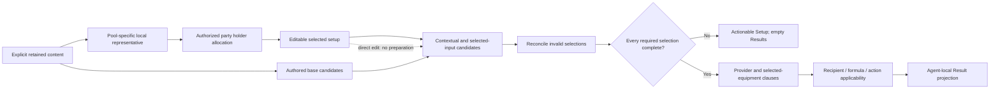

# feat: Add the bounded Corin and Lycaon vertical

## Summary

Extend the existing explicit content, preparation, candidate, state, provider,
Agent-local calculation, and visible workbench paths for Corin and Lycaon. Land
the newly settled Seed, Astral, holder-allocation, Rank-default, and Lycaon King
lifecycles as bounded common mechanisms while preserving every contrasting
behavior of the existing nine Agents.

---

## Problem Frame

The workbench already turns authored candidates and pool-specific whole-package
representatives into editable setups and complete-only Results. Corin and Lycaon
do not require a new vertical framework, but they expose several places where
the current implementation encodes a shared product meaning through named
Agent branches or incomplete lifecycle handling.

Corin must compose current Attack, faction, Ultimate-opportunity, broad pre-PEN,
and Seed Vanguard meanings. Lycaon must compose holder eligibility, base Disc
membership, selected King pressure, non-overlapping prepared allocation, exact
recipient projection, Daze actions, and completed Potential without acquiring a
personal-damage role. The implementation must keep those meanings separate:
candidate dominance does not decide Result recipients, prepared allocation does
not rewrite candidate membership, and a direct edit does not run preparation.

This is a bounded product vertical rather than a general equipment model. The
current permanent authorities and the accepted requirements already settle the
product decisions. Implementation should extend the smallest established seams,
prove the shared mechanisms against current similar and contrasting consumers,
and stop without introducing a registry, optimizer, named-party catalogue, or
historical Version-2.8 simulation.

---

## Requirements

### Admission and prepared setup

- **R1.** Admit Corin and Lycaon through the existing closed identity, portrait,
  Attribute, Specialty, Focus, formula, setup, and Result owners. Preserve Rank,
  faction, role, formula family, and Focus eligibility as separate typed
  meanings (origin R1-R4; F1; AE1).
- **R2.** Add a generic Rank-default Mindscape policy: A-Rank Agents enter a new
  prepared context at M6 and S-Rank Agents at M0, while Mindscape remains M0-M6
  editable and unchanged Agents retain their current value during party edits
  (origin R1-R3, R30, R32; F1; AE1).
- **R3.** Retain only the current values, progression, and faction facts consumed
  by the approved setup or Result. Corin has no Potential; Lycaon has completed
  Potential level 6. Faction is an internal qualification fact, not a new user
  input or a full roster catalogue (origin R1-R4, R21, R27; F1, F5; AE1).
- **R4.** Author deterministic full and non-limited representatives at zero
  supplied substats: Corin uses Cordis/Steel packages and Lycaon uses
  Blazing/Steam packages, including their exact Disc identities, main stats,
  refinement, and pool behavior (origin R5-R17; F1; AE2, AE6).

### Common candidate, preparation, and lifecycle behavior

- **R5.** Preserve authored base, contextual, and selected-input-derived
  candidates as different origins. Corin's Dialyn-created Puffer option remains
  contextual and candidate-only; Lycaon's King-selected CRIT Rate main,
  effective substat, and Woodpecker 2-piece membership exist only while King is
  selected (origin R7-R10, R14-R17, R24, R29-R31; F2-F3; AE4, AE7).
- **R6.** Reconcile selected-input pressure across present, absent, and
  reselected states. Removing King clears now-invalid main, 2-piece, and CRIT
  substat count without fallback; reselecting King restores membership only and
  Result remains empty until every required choice and effective-substat count
  is explicitly complete. Trigger retains its independent CRIT inputs as the
  required contrast (origin R15-R17, R29-R31, R33; F3; AE7, AE11).
- **R7.** Allocate competitive non-stacking King and Astral prepared holders
  from legal membership and current independent consumers, not slot order,
  candidate count, or a named-party table. Preserve Dialyn/Trigger, give King to
  Dialyn or Trigger beside Lycaon, and keep local Lycaon on King when no current
  competing holder exists. Candidate membership and direct-edit locality remain
  unchanged (origin R18-R20, R30-R31; F4; AE8).
- **R8.** Project a selected Astral Voice entrant effect exactly once to the
  legally eligible Focus, including when the holder is the Focus. Keep holder
  allocation, candidate legality, and recipient projection independent; retain
  exact and genuine multi-recipient effects on their own rules (origin R14,
  R18-R20, R27; F4-F5; AE8-AE9).
- **R9.** Resolve Seed Vanguard by eligible membership before numerical work:
  zero eligible teammates yields no Vanguard, one yields that Agent directly,
  and exactly two in an all-three-Attack party compare exact current Initial ATK
  with the established tie fallback. Corin participates without preparing any
  setup when Vanguard changes (origin R10, R25; F2, F5; AE5).

### Current calculation and presentation

- **R10.** Project Corin's retained bases, equipment, Core, Additional Ability,
  M1, M2, action scopes, contextual Puffer, broad pre-PEN pressure, and
  Housekeeper automatic Energy through the existing effect and Agent-local
  calculation boundary. Exclude M4 event Energy, M6 raw coefficient, raw/final
  damage, and non-consuming source facts (origin R5-R10, R21-R25; F2, F5;
  AE2-AE5, AE10).
- **R11.** Project Lycaon's retained Impact, Energy Regen, Daze actions, completed
  Potential action scope, Core debuffs, Additional Ability, M1, engine and Disc
  clauses, King threshold, and Glacial Waltz operation. Preserve Blazing's
  genuine Fire/Ice multi-recipient CRIT DMG and exclude event Energy, shield,
  personal damage, raw/final Daze, and raw/final damage (origin R11-R17,
  R26-R29; F5; AE6-AE7, AE9-AE10).
- **R12.** Keep selected and candidate equipment summaries semantically
  identical and accessible, retain the existing interaction hierarchy and
  source behavior, and show no Result for any incomplete applied setup. No
  hidden zero, first-candidate fallback, or restored history may make an
  incomplete setup appear complete (origin R23, R29-R33; F1-F5; AE11).
- **R13.** Extend shared content-summary, preparation, state lifecycle,
  applicability, calculation mechanism/policy/flow, component, and integrated
  journey suites. Do not add Corin- or Lycaon-specific test suites or freeze
  candidate arrays as an independent oracle (origin R33; all flows and
  acceptance examples).

---

## Scope Boundaries

### In Scope

- Corin and Lycaon identity, current consumed facts, candidates, representatives,
  prepared behavior, editable setup, provider relationships, calculation, Result,
  assets already present in the repository, and accessible presentation.
- The common Rank-default, Seed eligible-cardinality, King/Astral prepared-holder,
  Astral single-recipient, effective-substat membership, invalidation,
  completeness, and no-restoration mechanisms required by this vertical.
- Necessary corrections to existing current consumers when the newly permanent
  common rule applies, with explicit regression coverage for the closest similar
  and contrasting current cases.

### Deferred to Follow-Up Work

- Admission of any additional Agent or equipment entity, including content first
  introduced after Version 2.8.
- Cleanup of unrelated named recipient lists, action definitions, content maps,
  or test fixtures that are not exercised by a requirement in this vertical.
- Broader vertical-expansion refactors after this implementation demonstrates a
  second current consumer for a genuinely reusable structure.

### Outside This Plan

- Historical Version-2.8 behavior, external evidence storage, source registries,
  rationale payloads, or copied research prose.
- Universal equipment scoring, automatic package optimization, runtime holder
  scoring, named-party catalogues, Agent rule tables, candidate registries,
  faction catalogues, formula registries, compatibility matrices, or action
  simulators.
- Quick Assist rotation graphs, combat-recipient controls, resource cadence,
  uptime, field-time, shields or survival Results, raw/final damage, or raw/final
  Daze.
- UI redesign, new asset acquisition, persistence, backend work, deployment,
  staging, or commit work beyond a separate authorization.

---

## Context & Research

### Relevant Code and Current Seams

- `src/workbench/content/types.ts`, `agents.ts`, `retained-values.ts`,
  `engines.ts`, `discs.ts`, `setup-options.ts`, and `representatives.ts` own the
  closed explicit content and prepared packages. The vertical should extend
  these owners rather than add a metadata registry.
- `src/workbench/preparation.ts` owns local representatives and authorized party
  allocation. Its current Trigger King adjustment uses a local proxy that must
  be replaced by the approved legal-fit and independent-consumer decision while
  preserving target-only preparation and direct-edit locality.
- `src/workbench/candidates.ts` owns effective Disc and main-stat candidates;
  `src/workbench/state.ts` owns invalid-selection clearing, required-selection
  completeness, zero-substat preparation, and reducer transitions. Effective
  substats currently bypass this candidate path, so Lycaon's King lifecycle must
  bring them under the same state-owned mechanism.
- `src/workbench/provider-effects.ts` observes applied provider context,
  resolves Seed Vanguard, delivers clauses, and answers contextual opportunity
  and pressure queries. Current Vanguard resolution calculates every eligible
  current Attack Agent, even though the approved cardinality rule requires no
  comparison when only one teammate is eligible.
- `src/workbench/effects.ts` and `src/workbench/calculation/composition.ts` own
  recipient/formula/action applicability and non-stacking. Current Astral and
  some King clauses are emitted from Agent-local projectors with named recipient
  assumptions; the permanent rules now support provider-neutral selected-
  equipment delivery with formula and Focus applicability.
- `src/workbench/calculation/agents/` owns source-local observation and Result
  projection. `src/workbench/calculate.ts` owns exhaustive Agent dispatch,
  complete-selection gating, and party calculation orchestration. Corin and
  Lycaon should each receive one local projector without adding another global
  calculation pass.
- `src/components/PartyEditor.tsx`, `PartyWorkbench.tsx`, `AgentSetup.tsx`,
  `ResultPanel.tsx`, `src/App.tsx`, and `src/app.css` own the visible roster,
  Rank mark, setup choices, incomplete repair, Result, source interaction, and
  responsive presentation. Corin, Lycaon, and the A-Rank mark assets already
  exist locally.
- Shared behavioral coverage lives in `src/workbench/content/equipment-effects.test.ts`,
  `state.test.ts`, `preparation.test.ts`, `effects.test.ts`,
  `calculation/composition.test.ts`, `calculate.mechanics.test.ts`,
  `calculate.policies.test.ts`, `calculate.flows.test.ts`, component tests, and
  the three `src/App.*.test.tsx` journey suites.

### Applicable Institutional Learnings

- `docs/solutions/workflow-issues/prevent-secondary-requirements-from-validating-themselves-2026-08-12.md`
  requires eligibility before comparison, whole-package authoring at zero
  substats, shared-mechanism tests with a similar and contrasting consumer, and
  pressure-present/absent/reselected lifecycle coverage. This plan therefore
  does not treat a passing candidate array or local representative snapshot as
  product proof.
- `docs/solutions/workflow-issues/preserve-interaction-fidelity-in-ui-explorations-2026-08-05.md`
  requires existing editable controls, state ownership, and responsive behavior
  to remain intact when extending visible identity and setup surfaces. Browser
  acceptance must inspect interaction states, not only static screenshots.

### External References

None. Exact facts and product decisions were closed in the origin requirements;
the evidence that supported them remains ephemeral and must not be copied into
the implementation or plan.

---

## High-Level Technical Design

The following is directional flow guidance, not an implementation API or a new
runtime schema:

Preparation remains upstream from provider delivery. Candidate derivation may
inspect already-selected inputs such as Lycaon King, but it must not inspect
calculated Result values or run a score. Recipient projection happens after a
complete selected setup and cannot alter candidate membership or prepared
holder allocation.

---

## Key Technical Decisions

| Decision | Smallest current representation | Boundary preserved |
| --- | --- | --- |
| Agent Rank | Add a typed Rank fact and derive new-context Mindscape from Rank | No Corin-only M6 branch and no change to editable M0-M6 |
| Faction | Add only the typed faction value consumed by current qualification | No visible faction input or complete faction catalogue |
| New content | Extend closed unions and explicit owner maps atomically | No universal Agent/equipment registry |
| Effective substats | Derive them from one pure Agent-plus-selected-setup query, with state/slot consumers wrapping that result | No hidden zero, state-only API, or special Lycaon reducer branch |
| Holder allocation | Use legal candidate fit and current independent consumer differences during authorized preparation | No slot-order, candidate-count, named-party, or runtime score decision |
| Astral delivery | Emit one selected-equipment effect and resolve it to eligible Focus once | Candidate dominance and holder identity do not decide recipients |
| King delivery | Use existing formula applicability and non-stacking for current CRIT consumers | No named recipient whitelist and no personal-CRIT role for Lycaon |
| Seed Vanguard | Branch on eligible teammate count before exact Initial ATK comparison | No all-roster comparison and no preparation feedback loop |
| Calculation | Add Corin- and Lycaon-local observation/projector modules to the current pass | No new global calculation phase or action simulator |
| Verification | Extend shared mechanism, policy, flow, component, and journey suites | No per-Agent test suite or candidate-array oracle |

- Closed Agent identifiers affect exhaustive records, provider contexts,
  calculation dispatch, and visible identity maps. Add both Agents in one
  compile-complete integration unit; do not land placeholder branches or
  temporarily weaken exhaustiveness.
- Keep exact equipment facts source-owned. Setup summaries consume the same
  vectors for selected and candidate surfaces, while Agent-local projectors
  consume only the clauses that reach an approved current Result.
- Model Lycaon's Potential Impact as an action-scoped Impact outcome and his
  Daze differences through the existing action hierarchy. Reuse current
  canonical action vocabulary where it already communicates the retained
  distinction; do not expand an action catalogue solely to mirror source prose.
- Preserve exact arithmetic through composition. Decimal presentation belongs
  at the Result boundary and must not influence Vanguard comparison or King
  threshold activation.

### Rejected Alternatives

- **Reuse the abandoned Corin/Lycaon candidate implementation:** rejected
  because its requirements and passing tests were audit evidence rather than an
  implementation baseline, and it mixed supported facts with unsupported
  recipient and representative conclusions.
- **Add Agent-specific candidate and pressure branches:** rejected because
  contextual origin, selected-input membership, invalidation, completeness, and
  no-restoration are already shared product mechanisms with current contrasts.
- **Keep hard-coded Astral or King recipient lists:** rejected because current
  authority owns applicability through exact recipient and formula consumers;
  a named list would miss newly admitted compatible consumers and obscure the
  non-consuming contrast.
- **Use slot order, null preparation, or duplicate King as the Lycaon tie rule:**
  rejected because the accepted current portfolio decision is King on the
  independent-CRIT holder and Astral on flexible Lycaon.
- **Treat Moonlight Lullaby as Lycaon's Proto comparator:** rejected before
  numerical comparison because its 4-piece activation is Support-holder-only.
- **Special-case Corin's M6 default:** rejected because Rank-default Mindscape is
  a permanent generic lifecycle rule and Corin supplies the first A-Rank
  consumer.
- **Calculate every Attack Agent whenever Seed is present:** rejected because
  eligible party cardinality determines whether comparison is needed; only two
  eligible non-Seed teammates require exact Initial ATK comparison.
- **Add one test suite per new Agent:** rejected because it would freeze the
  vertical instead of proving reusable mechanisms, similar cases, contrasts,
  and complete representative flows.

---

## Implementation Units

### U1. Correct shared current-consumer policy seams

**Goal:** Implement the accepted Seed, Astral, King, and prepared-holder rules
against existing consumers first, without adding Corin or Lycaon identity, so
the common mechanisms and preserved contrasts are independently proven.

**Requirements:** Shared-prerequisite coverage for R7-R9 and R12-R13; origin
R18-R20, R25, and R31-R33 only where existing consumers can prove the common
mechanism. Full Lycaon-specific F4 and AE8-AE9 acceptance remains in U2/U3.

**Dependencies:** Approved permanent-authority and Corin/Lycaon requirements
documentation diff

**Files:**

- Modify: `src/workbench/preparation.ts`
- Modify: `src/workbench/provider-effects.ts`
- Modify: `src/workbench/effects.ts`
- Modify: current Astral/King-emitting modules under
  `src/workbench/calculation/agents/`
- Test: `src/workbench/preparation.test.ts`
- Test: `src/workbench/effects.test.ts`
- Test: `src/workbench/calculation/composition.test.ts`
- Test: `src/workbench/calculate.mechanics.test.ts`
- Test: `src/workbench/calculate.policies.test.ts`

**Approach:**

- Replace the current King/Astral preparation proxy with a bounded comparison
  that first checks legal candidate membership, then current independent CRIT
  consumption, while keeping the established Dialyn King/Trigger Astral outcome
  and every target-only/direct-edit invariant.
- Move Astral's entrant clause out of named Agent-local recipient emission and
  into selected-equipment delivery. Resolve one non-stacking contribution to
  the eligible Focus, including self-receipt, while leaving genuine multi-
  recipient and exact recipient clauses untouched.
- Express King delivery through its current crit-capable formula consumers and
  ordinary non-stacking behavior instead of provider-specific Agent whitelists.
  Do not alter Trigger's independent CRIT candidate basis or unrelated provider
  recipient rules.
- Make Seed Vanguard resolution inspect eligible applied teammates before
  Initial ATK: no eligible candidate returns none, one returns directly, and two
  use the exact existing comparison/tie behavior. An incomplete setup matters
  only when its Initial ATK is actually required for the two-candidate comparison.

**Behavior tests:**

- Similar case: a selected Trigger or Astra Astral holder projects the entrant
  value once to a legally eligible non-holder Focus.
- Self-receipt case: an eligible Focus wearing Astral receives one contribution.
- Duplicate direct-edit case: two selected Astral holders retain both origins
  while non-stacking contributes once to Focus and does not reprepare either
  setup.
- Contrast: a game-defined recipient or genuine multi-recipient effect still
  reaches its exact applicable recipients and is not compressed to Focus.
- Preparation: Dialyn/Trigger keeps the accepted King/Astral package for every
  slot permutation; target-only preparation changes only the target and direct
  edits trigger no cross-Agent preparation.
- Seed: zero eligible Attack teammates yields no Vanguard; one eligible teammate
  is returned even when another non-candidate setup cannot supply Initial ATK;
  two eligible teammates compare exact values and preserve the exact-tie slot
  fallback.

**Verification:** Shared preparation, effect, composition, mechanism, and policy
suites prove the corrected semantics with no new Agent content. The full current
nine-Agent gate remains green before U2 begins.

### U2. Land the compile-complete Corin and Lycaon vertical core

**Goal:** Add both Agents and every exhaustive content, representative,
candidate, state, provider, calculation, and identity-map consumer in one
buildable unit, including the full selected King lifecycle and exact current
Result behavior.

**Requirements:** R1-R13; all origin R1-R33; F1-F5; AE1-AE11

**Dependencies:** U1

**Files:**

- Modify: `src/workbench/content/types.ts`
- Modify: `src/workbench/content/agents.ts`
- Modify: `src/workbench/content/retained-values.ts`
- Modify: `src/workbench/content/engines.ts`
- Modify: `src/workbench/content/discs.ts`
- Modify: `src/workbench/content/setup-options.ts`
- Modify: `src/workbench/content/representatives.ts`
- Modify: `src/workbench/candidates.ts`
- Modify: `src/workbench/state.ts`
- Modify: `src/workbench/preparation.ts`
- Modify: `src/workbench/provider-effects.ts`
- Modify: `src/workbench/effects.ts`
- Modify: `src/workbench/calculation/initial-atk.ts`
- Add: `src/workbench/calculation/agents/corin.ts`
- Add: `src/workbench/calculation/agents/lycaon.ts`
- Modify: `src/workbench/calculate.ts`
- Modify: exhaustive identity/asset maps in `src/components/PartyEditor.tsx`,
  `src/components/PartyWorkbench.tsx`, and `src/app.css`
- Modify: `src/components/AgentSetup.tsx`
- Test: existing shared content, state, preparation, effect, composition,
  calculation mechanism, policy, and representative-flow suites
- Test: `src/components/AgentSetup.test.tsx`

**Approach — explicit content and Rank defaults:**

- Extend typed Agent, engine, main-stat, Rank, bounded faction,
  equipment-Attribute, and equipment-action values plus every exhaustive record.
  Add Ice to the source-owned equipment Attribute scope and Assist Follow-Up to
  the source-owned equipment action scope so Blazing and Simmering Pot remain
  typed facts rather than Lycaon-local hard-coding. Reuse existing Corin,
  Lycaon, W-Engine, Disc, Rank, Attribute, and Specialty assets; add no
  acquisition step.
- Give every admitted Agent an explicit Rank and derive newly prepared
  Mindscape from that fact. Preserve existing S-Rank M0 behavior and current
  Mindscape retention during party editing; Corin becomes the first A-Rank M6
  consumer without a named default branch.
- Retain only the approved level-60 values and source labels. Add Housekeeper,
  Blazing Laurel, and The Simmering Pot facts alongside the already-owned
  Cordis, Heartstring, Steel, Steam, and Precious Fossilized Core meanings.
  Verify complete compressed selected/candidate summaries separately from
  Agent calculation consumption.

**Approach — representatives, candidates, and state:**

- Author both pools' complete representatives exactly, including zero current
  effective substats, Rank-derived W-Engine refinement defaults where
  applicable, and the approved Corin and Lycaon Disc/main packages.
- Extend Dialyn's existing semantic Ultimate-opportunity predicate to Corin and
  extend broad pre-PEN pressure through Corin's existing formula family. Keep
  Puffer contextual and candidate-only, and keep Physical DMG as the authorized
  pressure-safe prepared Slot 5 choice.
- Add one pure effective-substat query keyed by Agent identity and the selected
  setup, with the current state/slot query as a thin consumer wrapper. Base Corin
  substats remain authored; Lycaon gains CRIT Rate only from selected King. Pass
  the prepared selection through zero-substat initialization, and use the same
  pure query for effect input construction, rendering, reducer validation,
  invalid-selection reconciliation, required-selection discovery, and
  completeness so no static map becomes a conflicting authority.
- On direct King removal, discard an invalid CRIT substat key/count and clear an
  invalid CRIT Slot 4 or Woodpecker selection without fallback. On direct King
  reselection, restore memberships but not values. Party/Focus Apply and target
  Mindscape/pool preparation may initialize the complete authored package with
  explicit zero substats.
- Connect `AgentSetup` to that effective query in this unit, not after lifecycle
  acceptance. A restored-but-missing count renders as an empty required numeric
  control with visible `Hit count required`, `aria-invalid`, and descriptive
  association; explicit `0` through `36` is a valid user selection. Keep focus
  on the originating Disc control, announce the newly required CRIT Rate hit
  count once through the existing live region, and restore Result only after the
  user explicitly supplies the count and every other missing selection.
- Extend U1's prepared allocation by legal membership and independent CRIT
  consumption: local Lycaon keeps King; beside Dialyn or Trigger, Lycaon takes
  Astral plus King 2-piece and has no CRIT pressure inputs. Preserve Astra's
  established local Astral behavior and every slot permutation.

**Approach — provider and Agent-local calculation:**

- Add only the typed Victoria faction relationship needed for Corin/Lycaon and
  the already-admitted Evelyn consumer. Observe Corin Additional qualification
  from Physical or Victoria and Lycaon qualification from Anomaly, Ice, or
  Victoria without exposing faction as an editable field.
- Extend exact Initial ATK to Corin only because the two-candidate Seed comparison
  can consume it. Keep the single-eligible path from U1 calculation-free and
  ensure Vanguard movement changes delivered effects/pressure without running
  preparation.
- Implement Corin as a crit-capable Physical `general_damage` projector using
  the existing ATK, CRIT, DMG, PEN/DEF/RES region, action difference, and Energy
  operation surfaces. Retain the approved Core, Additional, M1/M2, Cordis,
  Heartstring, Steel, Housekeeper, Puffer, Hormone, main, and substat clauses;
  omit every explicitly excluded resource event and raw coefficient.
- Implement Lycaon as an Impact/Daze/buffer projector without a personal-damage
  metric. Compose Impact, Energy Regen, common/action Daze, completed Potential,
  King gauge, Core debuffs, Additional Stun multiplier, M1, engines, and Discs
  through existing surfaces. Use exact Attribute/formula applicability for
  Blazing and Core recipients and preserve their genuine multi-recipient meaning.
- Add both contexts and projectors to the exhaustive current calculation pass.
  Keep completeness before Result projection and do not add a feedback or fixed-
  point calculation phase.

**Behavior tests:**

- Admission: Corin is A/Physical/Attack/Focus-eligible with M6 default; Lycaon is
  S/Ice/Stun/non-Focus with M0 and completed Potential. Current S-Rank defaults,
  Focus rules, party cancellation, and unchanged-Agent Mindscape retention stay
  intact.
- Equipment: every retained new engine exposes exact source-owned W1-W5 vectors,
  metadata, assets, and compressed package lines; Base ATK and research/trigger
  prose remain absent from Setup copy. Existing and new selected/candidate
  descriptions match.
- Representatives: Corin full/non-limited and Lycaon full/non-limited packages
  are complete at zero supplied substats and reproduce AE2 and AE6 exact Initial,
  Combat, and Fully values without rounding the underlying arithmetic.
- Corin candidates: Dialyn adds Puffer without preparing it; broad pressure
  removes only applicable standalone PEN choices; Cissia Electric-only DEF
  Ignore does not reach Corin; removing the opportunity or pressure follows the
  ordinary direct-edit versus Party Apply lifecycle.
- Seed: Corin is direct Vanguard in Seed/Corin/non-Attack, while the two-candidate
  party compares Corin and Anby exactly; an ATK edit moves Vanguard and its M2
  pressure without preparing Corin.
- Lycaon base: Proto and Moonlight 4-piece never appear, while King, Astral, and
  Shockstar do. Without King, only residual ATK Slot 4 exists and no CRIT row,
  gauge, substat, or Woodpecker membership is present.
- King lifecycle: selected King adds CRIT Slot 4, CRIT effective substat, and
  Woodpecker; the nine-hit and Woodpecker six-hit AE7 thresholds activate the
  second King clause. Removal and reselection clear and do not restore values;
  Trigger retains its base CRIT choices throughout the same edit sequence.
- Missing-count interaction: keyboard-only King removal/reselection leaves focus
  on the Disc selector, announces that CRIT Rate hit count is required, renders
  an empty invalid control rather than zero, accepts an explicit zero as a
  complete value, and restores Result only after all missing choices are repaired.
- Allocation: every Dialyn/Lycaon and Trigger/Lycaon permutation prepares the
  independent-CRIT holder on King and Lycaon on Astral/King 2-piece. Local
  Lycaon remains King, Dialyn/Trigger remains unchanged, and direct duplicates
  remain selected with ordinary non-stacking.
- Recipient/application: Lycaon Astral reaches Focus Corin once; Lycaon's Core
  other-Attribute clause separately reaches Corin; Fire/Ice Blazing reaches
  every applicable current crit-capable damage consumer; a non-consuming Agent
  gains no fabricated personal row.
- Exclusions: Corin M4/M6 and Lycaon M2/M4/M6 do not create event-Energy,
  shield, personal-damage, raw-damage, or raw-Daze outputs. Absent conditions do
  not create zero rows or source disclosures.

**Verification:** Closed-union exhaustiveness, focused shared suites, and the
full test/type/build gate pass together. U2 is not accepted with placeholder
dispatch, incomplete maps, an Agent-specific suite, or a content fact lacking a
current candidate, setup, calculation, Result, threshold, or source consumer.

### U3. Complete visible setup, accessibility, and representative journeys

**Goal:** Make the complete U2 behavior operable and interpretable through the
existing Party, Setup, and Result experience, and prove the full vertical in the
in-app browser without changing the design language.

**Requirements:** R1-R13; origin R1-R4, R8-R9, R14-R20, R23, R29-R33; F1-F5;
AE1-AE11

**Dependencies:** U2

**Files:**

- Modify: `src/components/PartyEditor.tsx`
- Modify: `src/components/PartyWorkbench.tsx`
- Modify: `src/components/ResultPanel.tsx` only if existing generic presentation
  cannot expose an approved retained operation or gauge without special copy
- Modify: `src/App.tsx`
- Modify: `src/app.css`
- Test: `src/components/AgentSetup.test.tsx`
- Test: `src/components/ResultPanel.test.tsx` only for shared presentation
- Test: `src/App.party.test.tsx`
- Test: `src/App.setup.test.tsx`
- Test: `src/App.result.test.tsx`

**Approach:**

- Render the Rank mark from typed Agent Rank on compact and expanded applied-slot
  identity surfaces, deriving both the image and accessible `A Rank`/`S Rank`
  label from the same value. Preserve Party Editor's existing name, Attribute,
  and Specialty grammar rather than adding a dense Rank mark there. Add
  Corin/Lycaon portraits, focus eligibility, and existing source interaction;
  do not expose faction or Potential as a new setup control.
- Preserve U2's effective-substat and missing-count interaction while integrating
  it into full user journeys. Do not add an automatic focus jump, placeholder
  zero, or alternate component-local completeness rule.
- Preserve the existing selected/candidate W-Engine and Disc layout, accessible
  descriptions, keyboard operation, focus-return behavior, source highlighting,
  responsive collapse, and Result metric/action/gauge hierarchy.
- Add cross-vertical user journeys rather than identity-specific UI suites.
  Cover all-party Apply, target-only Mindscape/pool preparation, direct edits,
  incomplete repair, full/non-limited representatives, viewed-Agent switching,
  and recipient-visible Result changes.

**Behavior tests and browser journeys:**

- Apply Corin/Lycaon/Astra: Corin becomes Focus at M6, Lycaon starts M0, all
  three setups are complete, both faction-qualified Additional Abilities reach
  their approved Result surfaces, and changing the viewed slot does not change
  Focus or preparation.
- Apply Corin/Dialyn/Lycaon and Corin/Trigger/Lycaon in representative slot
  permutations: prepared King/Astral identities, Lycaon no-CRIT Astral package,
  Focus-only Astral Result, and separate Lycaon Core delivery are visible and
  stable.
- Start local Lycaon King, set threshold inputs, switch directly to Astral, and
  observe invalid main/2-piece/substat clearing plus empty Results. Reselect
  King and confirm memberships return without any prior selection or count;
  explicitly repair every missing input and observe Results return.
- Repeat the Disc transition on Trigger and confirm its independent CRIT main,
  substat controls, and Result basis remain available.
- Exercise Corin full/non-limited, Dialyn-created Puffer, broad pre-PEN direct
  invalidation, and Seed Vanguard movement using visible controls. Confirm no
  action silently reprepares another setup.
- Inspect selected and candidate summaries with keyboard focus and pointer
  interaction. Each exposes the same compressed clauses and accessible meaning,
  and source disclosure follows only visible Result contributions.
- Verify Corin announces `A Rank` and Lycaon plus retained Agents announce
  `S Rank` in both compact and expanded applied-slot identities. Party Editor
  retains its existing identity reading order.
- Use a stratified browser matrix: 1440x900 desktop, immediately above and below
  each breakpoint whose CSS is actually changed by this vertical, one 390 px
  narrow/reflow state, and the 320 px minimum. Verify 100% and 200% zoom at
  desktop and the applicable reflow boundary. Distribute all-three-slot
  compact/expanded states, open selectors, complete and missing-count repair,
  long action/source rows, threshold gauge, and keyboard focus across that
  matrix; add another existing breakpoint only if its CSS changes or a defect is
  observed there. Require no page-level horizontal overflow, clipped or
  unreachable action, stale source highlight, hidden focus, or console/
  accessibility error; preserve only the already-authorized local Result
  scrolling.

**Verification:** Focused component and integrated journey suites, the full
test/type/build gate, whitespace/diff validation, and in-app browser interaction
checks pass. The final diff is reviewed against all five permanent authorities,
all origin R/F/AE coverage, and the unchanged nine-Agent journeys before the
plan can be marked completed.

---

## System-Wide Impact

- **Content interfaces:** `AgentId`, equipment IDs, main stats, Rank, and explicit
  `Record<AgentId, ...>` owners expand. Type exhaustiveness is the migration
  mechanism; there is no persistence or serialized-data migration.
- **Preparation graph:** Party/Focus Apply still prepares all three Agents;
  target Mindscape/pool changes prepare one; direct edits prepare none. Holder
  allocation remains a pure preparation concern upstream of delivered effects.
- **State lifecycle:** Effective candidates now include substats. Reconciliation,
  completeness, rendering, and calculation must read the same current set so an
  invalid or newly restored key cannot be hidden by a static default.
- **Provider graph:** Seed cardinality, selected Astral, King delivery, faction
  qualification, contextual Puffer, and broad pressure remain acyclic inputs to
  complete-only Agent projection. No Result value feeds preparation or
  candidate selection.
- **Result boundary:** Corin adds retained damage/DEF/RES/Energy outcomes;
  Lycaon adds Impact/Daze/buffer outcomes. Existing metric, action, operation,
  gauge, source, and non-stacking DTOs remain the public surface unless U3 proves
  one approved value cannot be represented faithfully.
- **Visible consumers:** Party Edit, Focus, Setup controls, accessible equipment
  text, incomplete recovery, Result, source interaction, keyboard navigation,
  and responsive layouts are affected. Faction, Potential, and research evidence
  remain non-UI meanings.
- **Operations/security/performance:** No backend, network, authentication,
  persistence, migration, or sensitive-data surface changes. Candidate and
  provider work remains bounded to three applied Agents and explicit finite
  content.

---

## Risks & Mitigations

| Risk | Mitigation |
| --- | --- |
| Adding two closed Agent IDs leaves a stale record or dispatch branch | Land both identities as one compile-complete U2 unit and use strict type/build exhaustiveness before behavioral acceptance |
| Astral recipient correction accidentally rewrites candidate or holder policy | Test selected equipment delivery independently from membership and preparation, including self-holder, non-holder, duplicate, and genuine multi-recipient contrasts |
| Holder allocation becomes slot-order dependent or a disguised named table | Resolve legal local packages in a batch, compare only current independent consumers, and exercise all approved party permutations |
| Lycaon King removal hides an automatic zero or restores old input | Use one effective-substat source for render/reducer/reconcile/completeness; test present, absent, reselected, and explicit-repair states |
| A broad King/Astral correction changes unrelated Agent behavior | Protect Dialyn/Trigger, Astra, Cissia, Evelyn, and non-consuming formula contrasts in shared tests; change only consumers supported by the permanent rule |
| Seed still requires unrelated or incomplete Initial ATK facts | Branch on eligible Attack teammate count before calculation and test zero, one, two, incomplete, and exact-tie cases |
| Exact equipment packages are compressed incorrectly in Setup | Store vectors once, test required and forbidden summary fragments, and compare selected/candidate accessible descriptions |
| Corin or Lycaon projection drifts into raw damage, raw Daze, resource cadence, or survival | Assert approved metrics/actions and explicit exclusion cases in shared policy/flow suites; create no new simulator or survival surface |
| Numerical rounding changes Vanguard or King threshold outcomes | Keep exact values in calculation/composition and round only for visible formatting |
| The vertical introduces premature reusable architecture | Extend current maps and semantic predicates; add a shared helper only where at least two current consumers use the same operation |
| UI admission passes static tests but breaks interaction fidelity | Run Party/Setup/Result journeys in the in-app browser at desktop and narrow widths with keyboard, focus, incomplete, and source states |

---

## Open Questions

### Resolved During Planning

- **Does Version 2.8 freeze Corin or Lycaon to historical values?** No. It is the
  initial entity-admission boundary; admitted entities use their current facts.
- **Who receives Astral's controllable one-recipient effect?** The legally
  eligible Focus exactly once. Holder and Focus may be the same Agent.
- **Who keeps King beside Lycaon?** Dialyn or Trigger keeps King because of its
  independent CRIT consumer; flexible Lycaon prepares Astral. Local Lycaon keeps
  King, and direct edits do not reallocate.
- **Is Moonlight a usable Lycaon 4-piece comparator?** No. Its Support-holder
  activation makes it ineligible before package comparison.
- **What happens when Seed has only Corin as an eligible teammate?** Corin is
  Vanguard directly. Exact Initial ATK is compared only when both non-Seed
  teammates are eligible Attack Agents.
- **How does Corin start at M6?** Through the generic typed A-Rank default, not a
  named Corin rule.
- **Is faction visible or generally catalogued?** No. Retain only the typed
  current relationship consumed by Corin/Lycaon qualification.
- **Does King reselection restore Lycaon's old CRIT inputs?** No. It restores
  membership only; the user must explicitly complete every newly required
  selection/count.

### Deferred to Implementation Verification

- Confirm that every approved Lycaon action distinction fits the existing
  canonical action and nested difference vocabulary without adding a new public
  action category. If a retained visible distinction cannot be expressed, stop
  and return for product review rather than inventing a catalogue.
- Confirm through browser inspection that the existing identity, choice, and
  incomplete-state geometry accommodates two more Agents and the A-Rank mark
  without a design change. Styling adjustments may preserve the existing rules;
  a layout redesign is outside scope.

No unresolved product decision blocks implementation.

---

## Sources & References

- **Origin document:**
  `docs/brainstorms/2026-08-12-corin-lycaon-vertical-requirements.md`
- **Permanent product authority:** `docs/setup-workbench-product-contract.md`
- **Permanent source-retention authority:** `docs/source-fact-boundary.md`
- **Permanent formula authority:** `docs/zzz-formula-mechanics.md`
- **Permanent vocabulary authority:** `docs/zzz-game-vocabulary.md`
- **Permanent UI authority:** `docs/workbench-ui-design-rules.md`
- **Applicable authoring learning:**
  `docs/solutions/workflow-issues/prevent-secondary-requirements-from-validating-themselves-2026-08-12.md`
- **Applicable interaction learning:**
  `docs/solutions/workflow-issues/preserve-interaction-fidelity-in-ui-explorations-2026-08-05.md`
- **Established vertical pattern:**
  `docs/plans/2026-08-10-004-feat-evelyn-vertical-plan.md`
- **Related current code:** `src/workbench/content/`,
  `src/workbench/preparation.ts`, `src/workbench/candidates.ts`,
  `src/workbench/state.ts`, `src/workbench/provider-effects.ts`,
  `src/workbench/effects.ts`, `src/workbench/calculation/`,
  `src/components/`, and `src/App.tsx`
