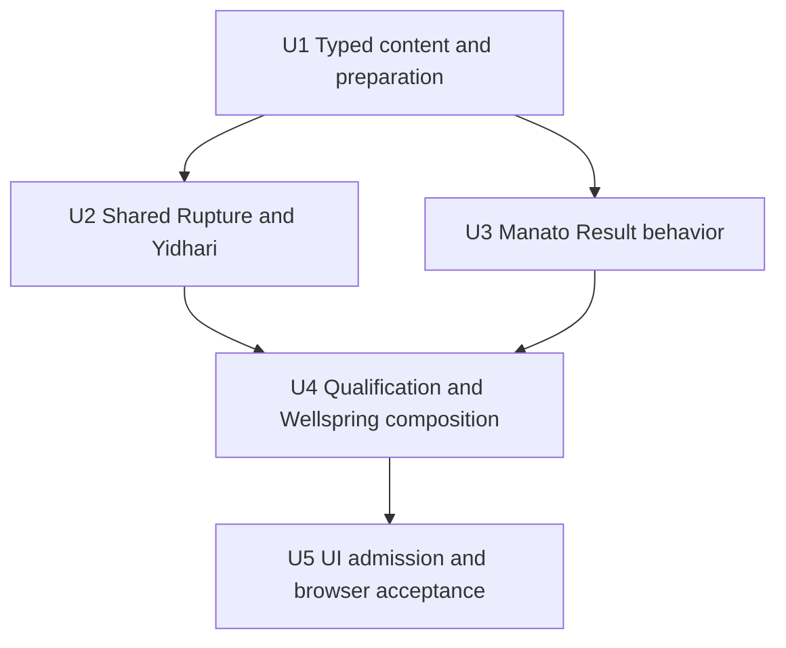
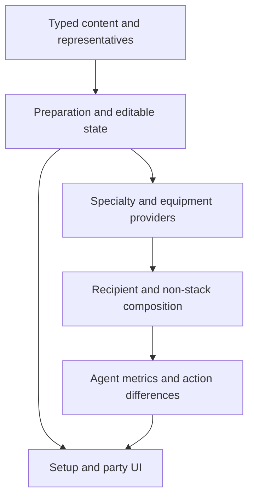

# feat: Add Yidhari and Manato vertical

## Summary

Extend the current typed content, preparation, provider, calculation, Result,
and portrait seams for Yidhari and Manato. Extract only the now-three-consumer
Rupture conversion, preserve Agent-local action behavior, and correct Lucia
qualification plus shared Wellspring non-stacking through the existing party
composition path.

---

## Problem Frame

The workbench already admits eleven complete verticals, but its only Rupture
calculation is still embedded in Yixuan and Lucia currently projects one
party-qualified modifier unconditionally. The first post-refresh expansion
must prove that established meanings can be reused without copying vertical
policy, creating a named-party catalogue, or weakening the candidate and
representative authoring bar.

---

## Requirements

### Admission and setup content

- R1. Admit typed S-Rank Ice Rupture Focus Yidhari and A-Rank Fire Rupture
  Focus Manato, using generic Rank defaults and retaining no unused faction.
- R2. Add only the exact W-Engine, Disc, main-stat, substat, candidate, and
  pool-specific representative records settled in the origin requirements.

### Calculation and party relationships

- R3. Reuse one current Rupture conversion across Yixuan, Yidhari, and Manato
  while keeping Attribute, action, recipient, and Mindscape projection exact.
- R4. Make Yidhari's Additional Ability depend on another Stun or Support and
  Lucia's Additional Ability depend on another Rupture or Stun.
- R5. Apply identical Ether Veil: Wellspring Max HP +5% once while preserving
  all equal legal origins in Result disclosure.

### Lifecycle

- R6. Preserve party-, Mindscape-, pool-, direct-edit-, completeness-, Rank-,
  source-interaction-, keyboard-, and responsive lifecycle behavior.

### Portraits

- R7. Calibrate both existing portrait assets through the shared source
  metadata contract and verify the finished workbench at port 5173.

**Origin actors:** A1 setup workbench user; A2 workbench session; A3 content
author.

**Origin flows:** F1 new Focus application; F2 pool-specific representative;
F3 party-qualified modifiers; F4 shared Wellspring; F5 Mindscape and direct
editing.

**Origin acceptance examples:** AE1-AE9 from the origin document remain the
behavioral acceptance boundary.

---

## Scope Boundaries

- Do not add other Version-2.8 Agents, Bangboo selection, enemy selection, raw
  damage or raw Daze, rotation, Adrenaline/Blazing Heart/Decibel cadence, or
  survival simulation.
- Do not add runtime equipment scoring, a legal-item catalogue, named-party
  rules, a universal qualification schema, an evidence registry, or rationale
  payloads.
- Do not retain Spook Shack merely for record symmetry and do not change the
  established Victoria Housekeeping faction consumer.
- Do not create per-Agent test suites. Extend shared mechanism tests and a
  small number of cross-vertical journeys.
- Do not change layout, visual language, shared portrait frames, or unrelated
  existing candidates and representatives.
- Keep external research ephemeral; repository artifacts contain settled
  current facts and behavior only, without URLs or receipts.

---

## Context & Research

### Relevant Code and Patterns

- `src/workbench/content/types.ts`, `agents.ts`, `engines.ts`, `discs.ts`,
  `setup-options.ts`, `representatives.ts`, and `retained-values.ts` are the
  current closed typed content seams.
- `src/workbench/content/engines.ts` already owns Qingming, Cauldron,
  Radiowave, and Puzzle packages and derives non-limited membership from exact
  limited identity. New packages should extend that mechanism.
- `src/workbench/state.ts` and `src/workbench/preparation.ts` already own Rank
  defaults, zero supplied substats, party-wide versus target-only rebuilding,
  direct edits, and completeness. The new Agents need records, not a new
  lifecycle.
- `src/workbench/calculation/agents/yixuan.ts` is the closest Rupture formula
  consumer; `corin.ts` and `evelyn.ts` are the closest action/Mindscape Result
  patterns.
- `src/workbench/provider-effects.ts`, `effects.ts`, and
  `calculation/composition.ts` already own Specialty facts, recipient delivery,
  applicability, non-stacking values, and equal-origin disclosure.
- `src/components/agentPortraits.ts`, `PartyWorkbench.tsx`, and
  `PartyEditor.tsx` already provide shared portrait, Rank, identity, and draft
  interactions.

### Institutional Learnings

- `docs/solutions/workflow-issues/prevent-secondary-requirements-from-validating-themselves-2026-08-12.md`
  requires permanent-owner review, exact holder compatibility, nearest usable
  same-axis comparison, complete package comparison, and shared lifecycle
  acceptance. The origin document completed that authoring gate before this
  plan.
- `docs/solutions/workflow-issues/preserve-interaction-fidelity-in-ui-explorations-2026-08-05.md`
  is not a reason to run a new visual experiment. Its interaction-preservation
  checks still apply to browser verification of the admitted portraits and
  existing selectors.

### External References

- Current released facts and competitive-practice evidence were checked during
  requirements authoring and intentionally remain ephemeral under the product
  evidence boundary.

---

## Key Technical Decisions

| Decision | Implementation consequence |
| --- | --- |
| Share only Rupture conversion | One calculation helper composes Current ATK and Current Max HP for three consumers; Agent clauses and visible source ownership remain local |
| Keep exact equipment identity | New engine records coexist with reused packages; pools contain only the authored competitive lists |
| Resolve qualification from applied Specialty facts | One bounded party predicate supplies Yidhari and Lucia state without Agent-name recipient lists |
| Reuse current non-stacking composition | Add one Wellspring identity to both legal provider clauses; equal-origin disclosure follows the existing composition mechanism |
| Keep portrait geometry shared | Add only source image imports and calibrated face/head/scale metadata; no Agent-specific CSS or surface coordinates |

- Manato's Core HP enhancements are an Initial HP +18% contribution, not flat
  HP and not folded into the 7,725 base.
- Manato prepares Woodpecker 2-piece because maximum-Core action CRIT DMG and
  the conservative eight-hit future opportunity make CRIT Rate the balancing
  first choice. Branch and Inferno remain direct competitive edits.
- Low-HP, Molten Edge, repeated action stacks, and maximum Core clauses use the
  established Fully Enabled window. No editable combat-state control is added.
- Existing equipment fact records stay authoritative for reused packages. A
  new Agent consumer must not copy their numbers into a second content record.

---

## High-Level Technical Design

> *This illustrates the intended approach and is directional guidance for
> review, not implementation specification. The implementing agent should treat
> it as context, not code to reproduce.*

---

## Implementation Units

- U1. **Typed content, candidates, and prepared representatives**

**Goal:** Admit both Agents and every exact setup input needed to prepare their
complete pool-specific starting setups, without adding calculation behavior.

**Requirements:** R1, R2, R6; origin R1-R19, R25; F1-F2; AE2-AE5, AE7.

**Dependencies:** None.

**Files:**
- Modify: `src/workbench/content/types.ts`
- Modify: `src/workbench/content/agents.ts`
- Modify: `src/workbench/content/retained-values.ts`
- Modify: `src/workbench/content/engines.ts`
- Modify: `src/workbench/content/discs.ts`
- Modify: `src/workbench/content/setup-options.ts`
- Modify: `src/workbench/content/representatives.ts`
- Test: `src/workbench/content/equipment-effects.test.ts`
- Test: `src/workbench/state.test.ts`
- Test: `src/workbench/preparation.test.ts`

**Approach:**
- Extend the closed Agent and W-Engine identities with Yidhari, Manato,
  Kraken's Cradle, Grill O'Wisp, and Wrathful Vajra. Reuse existing Qingming,
  Cauldron, Radiowave, Puzzle, Yunkui, Woodpecker, Branch, and Inferno records.
- Encode exact refinement progression once per new engine and let existing
  Setup compression derive its visible and accessible package.
- Add authored full and non-limited lists exactly as settled. Use the existing
  `limited` boundary to derive pool exclusion; do not add per-Agent pool logic.
- Add the common main/substat choices and complete representatives. Preserve
  zero supplied counts and generic S/A refinement and Mindscape defaults.
- Keep Manato's Core HP +18% in retained calculation facts, separate from his
  base Max HP. It is not a setup candidate or editable input.

**Patterns to follow:**
- Yixuan's Rupture engine and Disc records in `src/workbench/content/`.
- Corin/Lycaon admission and Rank defaults in `src/workbench/content/agents.ts`.
- Pool-target preparation and in-pool invariants in
  `src/workbench/state.test.ts` and `preparation.test.ts`.

**Test scenarios:**
- Happy path: full Yidhari exposes six authored engines and prepares Kraken W1;
  non-limited exposes four and prepares Grill W5 with the same Disc package.
- Happy path: full Manato exposes six authored engines, non-limited exposes
  four, and both prepare Grill W5 with Yunkui/Woodpecker and zero counts.
- Edge case: Wrathful is present only for Manato full; Kraken is present only
  for Yidhari full; dominated Starlight and opposite-Attribute signatures are
  absent from each list.
- Edge case: Manato starts M6 and Yidhari M0 through generic Rank behavior.
- Integration: changing one new Agent's pool or Mindscape rebuilds only that
  Agent; applying a changed party rebuilds all three; direct edits stay local.
- Error path: removing one required selection returns the ordinary incomplete
  state and no Result until repaired.

**Verification:** Every prepared selection belongs to its current effective
candidate set and every reused/new Setup summary exposes the exact whole
package without research rationale.

---

- U2. **Shared Rupture conversion and Yidhari calculation**

**Goal:** Extract the established conversion without changing Yixuan and add
Yidhari's exact self, action, Attribute, and Mindscape projection.

**Requirements:** R3, R6; origin R3-R5, R7-R11, R16-R17, R23, R25;
F1, F5; AE3, AE7, AE9.

**Dependencies:** U1.

**Files:**
- Create: `src/workbench/calculation/rupture.ts`
- Create: `src/workbench/calculation/agents/yidhari.ts`
- Modify: `src/workbench/calculation/agents/yixuan.ts`
- Modify: `src/workbench/effects.ts`
- Modify: `src/workbench/provider-effects.ts`
- Modify: `src/workbench/calculate.ts`
- Test: `src/workbench/calculate.mechanics.test.ts`
- Test: `src/workbench/calculate.policies.test.ts`
- Test: `src/workbench/calculate.flows.test.ts`

**Approach:**
- Move only the conversion and its three-surface contribution construction to
  a shared calculation helper. The caller supplies its own Max HP, ATK, source,
  inbox, and cap context so visible ownership remains exact.
- Rewire Yixuan through that helper before adding Yidhari, protecting the
  existing output as the closest contrast.
- Build Yidhari with Agent-local setup inputs and current clauses: Max HP, ATK,
  Sheer Force, CRIT, Ice DMG, Ice Sheer DMG, low-HP Core/Additional, M1/M2/M4/M6,
  equipment, and applicable received effects.
- Express Basic/EX-only M1 RES Ignore as an action-scoped modifier and apply
  regular/sheer bonuses only to the matching Ice Sheer formula.
- Treat low HP and reachable repeatable stacks as Fully Enabled facts. Do not
  create HP, Adrenaline, Decibel, uptime, or rotation state.

**Execution note:** Protect the current Yixuan three-surface Result with a
shared-mechanism test before removing its local conversion.

**Patterns to follow:**
- Metric composition and source disclosure in
  `src/workbench/calculation/agents/yixuan.ts`.
- Action hierarchy and optional scoped metrics in Corin/Evelyn calculation
  modules.
- Exhaustive provider and calculator dispatch in `provider-effects.ts` and
  `calculate.ts`.

**Test scenarios:**
- Covers AE9: a legal all-party Max HP provider changes Current Max HP and
  therefore recomputes Sheer Force by the same formula for Yixuan and Yidhari.
- Happy path: prepared M0 Yidhari shows Kraken, Yunkui, main, Core, and received
  provider contributions on the correct surfaces. U4 owns party-derived
  Additional qualification and its present/absent coverage.
- Edge case: M1 affects only Basic/EX Ice RES Ignore; M2, M4, and M6 add only
  their current consumers; M3/M5 do not invent raw skill output.
- Contrast: DEF Ignore, DEF Reduction, and PEN clauses do not affect Yidhari's
  Sheer formula, while applicable RES and regular DMG clauses do.
- Integration: an incomplete Yidhari setup never reaches provider dispatch or
  produces a partial Result.

**Verification:** Yixuan remains numerically and visibly unchanged, and the
shared helper produces the established Yixuan and new Yidhari conversions.
U3 closes the three-consumer acceptance after Manato exists.

---

- U3. **Manato calculation and action-specific Mindscape behavior**

**Goal:** Add Manato's current maximum-Core and default-M6 Result through the
same Rupture and action projection mechanisms.

**Requirements:** R3, R6; origin R3-R5, R12-R15, R18-R19, R24-R25; F1-F2,
F5; AE4-AE7, AE9.

**Dependencies:** U1, U2's shared Rupture helper.

**Files:**
- Create: `src/workbench/calculation/agents/manato.ts`
- Modify: `src/workbench/effects.ts`
- Modify: `src/workbench/provider-effects.ts`
- Modify: `src/workbench/calculate.ts`
- Test: `src/workbench/calculate.mechanics.test.ts`
- Test: `src/workbench/calculate.policies.test.ts`
- Test: `src/workbench/calculate.flows.test.ts`

**Approach:**
- Compose base Max HP plus the fixed completed Core +18% and M4 +8% as separate
  Initial sources, then pass the resolved Current Max HP and ATK through the
  shared Rupture conversion.
- Project Molten Edge CRIT Rate/Fire DMG and reachable equipment/Disc effects
  on Fully Enabled without modeling its resource duration.
- Build Basic Attack and Assist Follow-Up action differences from the broad
  Result: maximum-Core HP-consumption CRIT DMG applies to both, M1 Fire DMG to
  both, and M6 Fire DMG only to Assist Follow-Up.
- Project M2 Fire RES Ignore only to Manato's Fire Sheer output. Additional
  healing and M6 resource clauses remain outside Result.

**Patterns to follow:**
- Fixed Agent stat contributions and action differences in current damage
  contributors, particularly Evelyn and Corin.
- Existing engine setup-input helpers so Grill, Wrathful, Qingming, Cauldron,
  Radiowave, and Puzzle remain one source of truth.

**Test scenarios:**
- Covers AE9: after Manato is admitted, one shared-mechanism assertion exercises
  Yixuan, Yidhari, and Manato under the same Current Max HP provider change and
  proves that all three conversions use the common helper path.
- Happy path: default M6 Manato shows Core +18% HP separately and prepares the
  exact Grill/Yunkui/Woodpecker zero-hit package.
- Covers AE5: direct Wrathful projects HP, CRIT, and reachable Fire Sheer;
  direct Qingming projects HP/CRIT but no Ether-only clause.
- Covers AE6: Basic and Assist share Core CRIT DMG and M1 Fire DMG; only Assist
  gains M6 Fire DMG; M2 affects only Fire Sheer RES Ignore.
- Edge case: M0 removes M1/M2/M4/M6 sources after target-only rebuild and does
  not change candidate membership or create an Additional Result metric.
- Contrast: Grill's Fire clause affects Manato but not Yidhari; Kraken's Ice
  clause affects Yidhari but is not a Manato candidate.
- Integration: Lucia's all-party HP/Sheer/DMG clauses reach Manato through the
  generic provider path and recompute Current Max HP before conversion.

**Verification:** Manato's broad and action-specific Result contains every
retained clause exactly once and no resource, healing, survival, or DEF/PEN
simulation; one shared-mechanism test now covers all three Rupture consumers.

---

- U4. **Specialty qualification and shared Wellspring composition**

**Goal:** Correct Lucia Additional qualification and make identical Lucia and
Yidhari Wellspring Max HP effects non-stacking with complete origin disclosure.

**Requirements:** R4-R6; origin R20-R22, R25; F3-F4; AE1, AE4, AE9.

**Dependencies:** U2, U3.

**Files:**
- Modify: `src/workbench/provider-effects.ts`
- Modify: `src/workbench/calculation/agents/lucia.ts`
- Modify: `src/workbench/calculation/agents/yidhari.ts`
- Modify: `src/workbench/effects.ts`
- Test: `src/workbench/calculate.mechanics.test.ts`
- Test: `src/workbench/calculate.policies.test.ts`
- Test: `src/workbench/state.test.ts`

**Approach:**
- Add a bounded "another applied Agent has one of these Specialties" fact at
  provider observation. Reuse it for Yidhari's Stun/Support and Lucia's
  Rupture/Stun condition rather than extending the current Agent-specific
  faction branch or creating a schema registry.
- Gate only Lucia's Additional CRIT DMG clause. Her Core HP, DMG, Sheer, and
  equipment clauses remain independently available.
- Add one exact Wellspring non-stack identity to both legal +5% Max HP clauses.
  Let current composition select one equal value and retain non-contributing
  equal origins; do not pre-deduplicate providers.
- Preserve existing non-stack contrasts: distinct engine Max HP, Yidhari M4
  self HP, King, Astral, and Moonlight retain their own identities and rules.

**Execution note:** Characterize the currently unconditional Lucia Additional
first, then replace only the unsupported clause behavior.

**Patterns to follow:**
- Corin/Lycaon bounded party qualification in `provider-effects.ts`.
- Equal non-stacking origin composition in
  `src/workbench/calculation/composition.ts` and its Astral/King tests.

**Test scenarios:**
- Happy path: Yidhari with another Stun/Support receives her qualified
  Additional CRIT DMG, while a party without either omits only that clause;
  equipment, Core, candidate membership, and local projection are unchanged.
- Happy path: Lucia with Yixuan, Yidhari, Manato, Dialyn, Trigger, or Lycaon
  receives an applicable Rupture/Stun qualification through Specialty, not a
  named list. Corin remains an unqualified Attack contrast.
- Contrary case: Lucia with two Attack/Support teammates has no Additional
  CRIT DMG but keeps Core HP, DMG, and Sheer delivery.
- Lifecycle: applying qualified, unqualified, then qualified parties removes
  and re-adds Lucia's clause while following the existing all-three-setup
  rebuild rule; no old direct edit is restored.
- Non-stack: Lucia alone and Yidhari alone each contribute Wellspring +5%; both
  together contribute +5% once with two equal origins; removing either leaves
  one ordinary origin.
- Contrast: Dreamlit Hearth HP and Yidhari M4 self HP add independently; the
  Wellspring key does not suppress them.
- Integration: a new Rupture recipient receives its self clauses and Lucia's
  qualified all-party clauses through generic recipient/applicability delivery.

**Verification:** Shared qualification and non-stacking tests prove product
behavior independently of candidate and representative tests.

---

- U5. **Visible admission, portrait calibration, and end-to-end acceptance**

**Goal:** Expose both Agents through the existing party and workbench UI,
calibrate their portraits, and verify the whole expansion without changing the
design language.

**Requirements:** R1, R6-R7; origin R1-R2, R25; F1-F5; AE1-AE8.

**Dependencies:** U1-U4.

**Files:**
- Modify: `src/components/agentPortraits.ts`
- Modify: `src/components/PartyWorkbench.tsx`
- Test: `src/App.party.test.tsx`
- Test: `src/App.setup.test.tsx`
- Test: `src/App.result.test.tsx`
- Test: `src/components/AgentSetup.test.tsx`

**Approach:**
- Add the existing Yidhari and Manato portrait assets to the closed map and add
  Ice/Rupture and Fire/Rupture identity marks through existing assets.
- Inspect each original portrait and record only faceX, headTopY, and optical
  scale. Do not copy another Agent's metadata or add responsive exceptions.
- Extend one shared party-editor journey to draft each new Focus and exercise
  prepared Setup, a candidate edit, pool/Mindscape rebuild, incomplete repair,
  Rank presentation, and Result/source interaction.
- Run the full automated gates, then start the existing `npm run dev` script,
  which is already fixed to `127.0.0.1:5173` with strict port behavior, and use
  the in-app browser for visual and keyboard verification.

**Patterns to follow:**
- Corin/Lycaon Rank and portrait admission in `agentPortraits.ts`,
  `PartyWorkbench.tsx`, and `App.party.test.tsx`.
- Existing selected/candidate accessible descriptions in
  `AgentSetup.test.tsx` and Result source interactions in `App.result.test.tsx`.

**Test scenarios:**
- Covers AE8: draft Yidhari and Manato, apply each as Focus, and verify S/A Rank,
  Attribute, Specialty, compact identity, and expanded identity.
- Covers AE1/AE4: each prepared package is immediately visible with zero
  effective hits and a non-empty Result.
- Covers AE3/AE5: pool changes rebuild only the new Agent and expose the correct
  pool-specific candidate set and representative.
- Covers AE7: clear and repair a required selection; Result is empty only while
  incomplete and keyboard focus returns to the edited control.
- Accessibility: selected and candidate new W-Engines expose the same exact
  compressed package through accessible descriptions.
- Browser: at desktop, one narrow/reflow width, and 320px, inspect compact and
  expanded portraits, one open equipment selector, Result disclosure, keyboard
  focus, clipping, collision, and horizontal overflow. Add a breakpoint pair
  only if changed CSS or a defect makes that boundary relevant.

**Verification:** Full tests and build pass; the local workbench at port 5173
shows calibrated portraits and unchanged interaction/responsive behavior for
new and established Agents.

---

## System-Wide Impact

- **Interaction graph:** Agent admission flows through closed records into
  generic party drafting, preparation, provider observation, exhaustive
  calculation dispatch, and Result rendering.
- **Error propagation:** Incompleteness stops before provider calculation and
  uses the current empty-Result path. No new asynchronous or recoverable error
  channel is introduced.
- **State lifecycle risks:** New records must survive party-wide preparation,
  target-only pool/Mindscape preparation, and direct edits without fallback.
  Qualification changes only via party apply, which already rebuilds all three.
- **API surface parity:** Closed Agent/Engine unions, content maps, portrait
  maps, provider contexts, calculator dispatch, and source ordering must remain
  exhaustive at compile time.
- **Integration coverage:** Shared journeys cover preparation to Setup, provider
  delivery, conversion, Result, source disclosure, and portrait rendering.
- **Unchanged invariants:** Existing eleven-Agent candidates, representatives,
  formula applicability, faction behavior, Astral/King allocation, keyboard
  order, responsive frames, and complete-selection gate remain unchanged.

---

## Open Questions

### Resolved During Planning

- **Should a shared Rupture abstraction grow beyond conversion?** No. Only the
  conversion has three current consumers; exact actions and clauses remain
  Agent-local.
- **Should Manato full prepare Wrathful Vajra?** No. Full exposes it, while the
  independently compared Grill W5 whole package remains first.
- **Should Manato prepare Branch or Woodpecker?** Woodpecker. Maximum-Core
  action CRIT DMG and eight-hit future opportunity make CRIT Rate the balanced
  first choice; Branch remains an edit.
- **Does Manato have flat Core HP +1,800?** No. The encoded source value is
  three HP +6% enhancements, retained as +18% Initial HP.

### Deferred to Implementation

- Exact local helper names and the final split of shared test cases may follow
  current file ergonomics as long as the U-ID boundaries and shared-mechanism
  assertions remain intact.
- Final portrait face/head/scale values are visual calibration outputs and
  cannot be responsibly fixed before inspecting the original assets in the
  finished frames.

---

## Risks & Dependencies

| Risk | Mitigation |
| --- | --- |
| Reused engine facts are copied and drift | Reference the existing content facts and add only three new engine records |
| Shared Rupture extraction changes Yixuan | Characterize Yixuan and compare an existing/new recipient under the same provider change |
| Fully Enabled becomes an implicit rotation model | Retain only reachable maxima and no resource/time state |
| Wellspring is numerically deduplicated but loses source truth | Assert one value plus both equal origins and the single-provider lifecycle |
| Lucia correction removes unrelated support | Gate only the Additional CRIT DMG clause and protect Core/equipment contrasts |
| Manato Core HP is misread again | Test the +18% source separately from 7,725 base, fixed Disc HP, equipment, and M4 |
| Portraits repeat the Corin calibration miss | Inspect source assets, record all three metadata values, then verify actual compact/expanded frames in browser |
| Expansion broadens established Agent behavior | Run focused shared tests first, then full test/build/browser gates and inspect the complete diff |

---

## Documentation / Operational Notes

- No permanent authority change is needed. The origin requirements and this
  plan are the only documentation changes.
- The existing `npm run dev` contract remains fixed to port 5173 and strict
  port behavior; no server configuration change is planned.
- No migration, persistence, deployment, feature flag, or external service is
  involved.

---

## Sources & References

- **Origin document:**
  `docs/brainstorms/2026-08-12-yidhari-manato-vertical-requirements.md`
- Permanent owners: `docs/setup-workbench-product-contract.md`,
  `docs/source-fact-boundary.md`, `docs/zzz-formula-mechanics.md`,
  `docs/zzz-game-vocabulary.md`, and `docs/workbench-ui-design-rules.md`
- Closest implementation patterns: `src/workbench/calculation/agents/yixuan.ts`,
  `src/workbench/calculation/agents/lucia.ts`,
  `src/workbench/provider-effects.ts`, `src/workbench/preparation.ts`, and
  `src/components/agentPortraits.ts`
