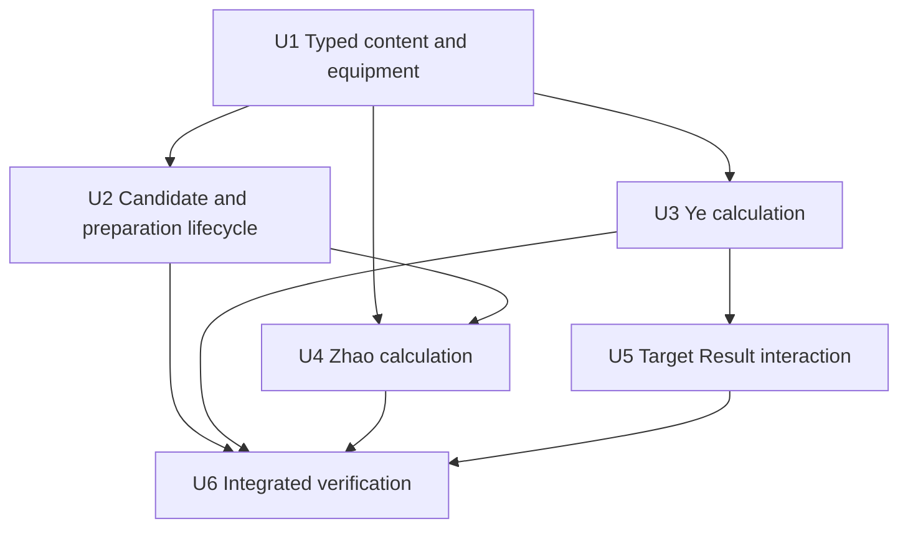
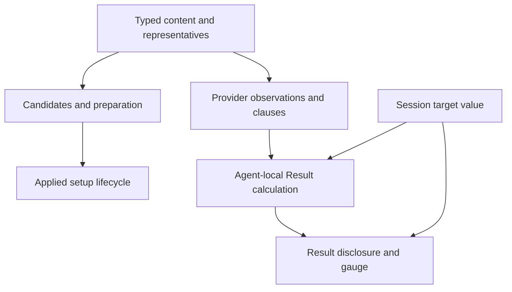

# feat: Add Ye Shunguang and Zhao

## Summary

Extend the existing typed content, preparation, provider, Agent-calculation,
and Result-disclosure paths for Ye Shunguang and Zhao. Keep the new target
value in the Result boundary, reuse current candidate and allocation passes,
and add only one bounded target-source interaction to the existing UI grammar.

---

## Problem Frame

The Version 2.8 roadmap reaches its final established general-damage/support
vertical, but Ye introduces the first capped replacement of an enemy Stun DMG
Multiplier and Zhao combines Initial-HP relationships with Ether Veil and Quick
Assist provider behavior. The implementation must add those visible outcomes
without turning either case into a generic enemy model, optimizer, resource
simulation, or Agent catalogue.

---

## Requirements

- Preserve the admitted identities, completed retained stats, formula
  participation, qualification, Mindscape boundaries, and excluded raw/resource
  facts in origin R1-R10 and R18-R22.
- Add the complete Ye and Zhao W-Engine and Drive Disc candidate packages,
  pool-local representatives, main stats, same-effect identities, and zero-count
  effective-substat starts in origin R11-R17 and R23-R27.
- Preserve the permanent preparation order across authored/contextual candidates,
  allocation, selected-input pressure, mains/substats, and zero initialization
  in origin R28-R30.
- Project exact Ye and Zhao Result consumers, the bounded target editor, source
  disclosure, and visible acceptance in origin R31-R33.
- Satisfy origin AE1-AE6 through mechanism-oriented tests, the full repository
  check, original-asset inspection, and desktop/narrow browser verification.

**Origin acceptance examples:** AE1 (content and representatives), AE2
(composed lifecycle), AE3 (Ye calculation), AE4 (Zhao calculation), AE5
(target UI), AE6 (repository and browser gates).

---

## Scope Boundaries

- No enemy panel, target catalogue, stage preset, target profile, resistance
  input, or additional target setting.
- No Qingming Sword Force, Bearer, Frostbite, Lantern Wish, Decibel, healing,
  survival, uptime, cadence, rotation, raw damage, or raw Daze model.
- No Ye M6 additional-damage coefficient projection and no personal-damage
  setup role or CRIT setup inputs for Zhao.
- No runtime equipment scoring, HP/CRIT optimizer, exact Disc-line model, or
  hidden supplied substat counts.
- No broad normalization of Honed Edge into Physical for unrelated party
  qualification; the relationship applies only where effect applicability or
  calculation needs it.
- No generalization of Zhao-local Defense equipment choices, contextual Quick
  Assist policy, or settled Stun allocation outcomes.

---

## Context & Research

### Relevant Code and Patterns

- `src/workbench/content/types.ts`, `agents.ts`, `setup-options.ts`,
  `engines.ts`, `discs.ts`, `representatives.ts`, and `retained-values.ts` form
  the typed content admission path; exhaustive records make missing registration
  compile-visible.
- `src/workbench/preparation.ts`, `candidates.ts`, `party-conditions.ts`, and
  `state.ts` own contextual membership, same-effect exposure, allocation, party
  Apply, changed-Agent preparation, and invalid-selection clearing.
- `src/workbench/provider-effects.ts` and `calculate.ts` own the ordered provider
  and recipient composition. Lucia supplies the closest Initial-HP/gauge and
  Wellspring non-stacking pattern; Trigger supplies the closest Stun multiplier
  contribution and its current hard-coded recipient contrast.
- `src/components/ResultPanel.tsx` already displays a raw gauge basis while
  clamping only the fill. `src/components/AgentSetup.tsx` supplies a useful but
  intentionally different local numeric-draft pattern.
- Required Agent, W-Engine, and Drive Disc assets already exist under
  `src/assets/`; no asset import or catalogue work is needed outside current
  typed consumers.

### Institutional Learnings

- `docs/solutions/workflow-issues/prevent-secondary-requirements-from-validating-themselves-2026-08-12.md`
  requires permanent-owner support before tests, separate equipment package and
  Result-projection checks, the complete preparation order in one flow, and
  present/absent/reapplied selected-input lifecycle evidence.
- `docs/solutions/workflow-issues/preserve-interaction-fidelity-in-ui-explorations-2026-08-05.md`
  requires the full input interaction envelope and semantic-state verification
  before layout judgment; original portrait inspection remains separate from
  rendered browser comparison.

---

## Key Technical Decisions

- Keep the committed Target Stun DMG Multiplier in `App` session state and pass
  it through a small calculation context. It is not `WorkbenchState`, a setup
  input, or a general provider clause, so preparation cannot reset or consume it
  and non-Ye recipients cannot inherit it.
- Give the external target basis one bounded Result-source locus/tone while
  retaining Ye as the calculation owner. This preserves the current source
  shape without falsely linking the target value to Ye's Agent card or Setup.
- Extend the existing formula applicability, same-effect relationship,
  contextual Quick Assist, and exhaustive Agent switch mechanisms. Do not add
  registries, evaluators, or per-Agent framework layers.
- Calculate Zhao's stepped CRIT and Additional gauge from an explicit Initial-HP
  observation only. Combat/Fully HP contributions remain visible on their own
  surfaces and cannot feed back into Initial relationships.
- Treat equipment candidate membership and exact Result projection separately:
  complete package copy remains visible even when an inactive clause contributes
  no Result value.

---

## Alternative Approaches Considered

- Put the target value in `WorkbenchState`: rejected because party preparation
  constructs and reconciles setup state, while the approved value is persistent
  Result-only session context.
- Deliver the target basis as generic enemy context: rejected because it would
  risk changing ordinary non-Ye Stun multiplier Results.
- Reuse the ordinary calculation source tone: rejected because it cannot express
  the approved local source-row/editor/gauge relationship and may imply Agent or
  Setup ownership.
- Add a generic Quick Assist or equipment optimizer registry: rejected because
  current shared and Qingyi-local predicates already have exact consumers, and
  representatives remain authored rather than runtime-scored.

---

## Implementation Units

- U1. **Admit typed content and complete equipment packages**

**Goal:** Register both Agents, Honed Edge applicability, retained source facts,
equipment identities, candidates, compressed copy, and deterministic pool
representatives.

**Requirements:** Origin R1-R3, R11-R17, R23-R27, R33; AE1.

**Dependencies:** None.

**Files:**
- Modify: `src/workbench/content/types.ts`
- Modify: `src/workbench/content/agents.ts`
- Modify: `src/workbench/content/setup-options.ts`
- Modify: `src/workbench/content/retained-values.ts`
- Modify: `src/workbench/content/engines.ts`
- Modify: `src/workbench/content/discs.ts`
- Modify: `src/workbench/content/representatives.ts`
- Modify: `src/workbench/effects.ts`
- Modify: `src/workbench/calculation/initial-atk.ts`
- Modify: `src/components/PartyWorkbench.tsx`
- Modify: `src/components/agentPortraits.ts`
- Test: `src/workbench/content/equipment-effects.test.ts`
- Test: `src/workbench/preparation.test.ts`
- Test: `src/components/AgentSetup.test.tsx`
- Test: `src/App.party.test.tsx`

**Approach:**
- Add only retained Agent values and source labels with current consumers.
- Correct Cloudcleave's Veil-activated DMG/CRIT DMG to broad affected scope
  while keeping holder activation separate.
- Add Street Superstar, Half-Sugar Bunny, and White Water Ballad complete facts
  and accessible package descriptions.
- Extend the two existing same-effect identity list with White Water/Fanged and
  Bunny/Yunkui, then author the exact pool and representative records.
- Keep Zhao's main-stat inputs HP% except for the legal Slot 6 Energy Regen
  alternative, and limit effective substats to HP% and flat HP. Retain the
  authored Astral Voice and Swing Jazz 4-piece candidates plus the Energy Regen
  and ATK 2-piece identities; do not admit CRIT main or substat inputs.

**Patterns to follow:** Existing Caesar typed admission, Cloudcleave equipment
facts, Lucia HP inputs, and current exact-identity relationship records.

**Test scenarios:**
- Covers AE1. Happy path: each pool exposes exactly the authored W-Engines and
  prepares the required engine/refinement, 4-piece/2-piece, mains, and zero
  effective-substat counts.
- Happy path: selected and candidate equipment descriptions expose the same
  complete usable and inactive clauses, including Street charges, broad
  Cloudcleave activation, Half-Sugar non-stacking party values, and exact Disc
  identities.
- Edge case: Billy and Nekomata keep Cloudcleave Physical RES Ignore but do not
  receive its holder-activated broad DMG/CRIT DMG.
- Integration: Honed Edge accepts Physical-scoped equipment effects without
  changing unrelated teammate Attribute qualification.

**Verification:** All typed records are exhaustive; both prepared setups are
complete at zero counts; current equipment consumers retain their prior package
and projection behavior.

---

- U2. **Extend contextual candidates and preparation lifecycle**

**Goal:** Reuse the current candidate and preparation passes for new same-effect
identities and Zhao's shared plus Qingyi-local Quick Assist opportunities.

**Requirements:** Origin R16, R26, R28-R30; AE1-AE2.

**Dependencies:** U1.

**Files:**
- Modify: `src/workbench/preparation.ts`
- Modify: `src/workbench/party-conditions.ts`
- Modify: `src/workbench/candidates.ts`
- Test: `src/workbench/candidates.test.ts`
- Test: `src/workbench/preparation.test.ts`
- Test: `src/workbench/state.test.ts`

**Approach:**
- Add Zhao to the established repeated Quick Assist predicate and to Qingyi's
  separate local opportunity, without merging the two meanings.
- Let the existing same-effect compressor and reducer reconciliation own
  identity exposure and invalid-selection clearing.
- Preserve the authored/contextual candidate, holder allocation, selected
  pressure, mains/substats, and zero-initialization order in one composed flow.
- Leave Ye + Zhao + one Stun on the existing one-King allocation path; Zhao's
  Bunny package introduces no King/Astral collision.

**Patterns to follow:** Existing Astra/Pan repeated Quick Assist lifecycle,
Qingyi local Astral predicate, exact-identity state tests, and the composed Stun
allocation journey.

**Test scenarios:**
- Covers AE2. Integration: adding, removing, and reapplying Zhao exposes,
  clears, and restores contextual Astral membership for one shared consumer and
  Qingyi without restoring a prior direct selection.
- Edge case: removing an identity exposed only by the former 4-piece clears the
  invalid 2-piece without fallback and empties Result until the user selects a
  valid replacement; reselecting the original 4-piece restores membership, not
  history.
- Integration: White Water/Fanged and Bunny/Yunkui role swaps compose with the
  retained Hormone/Astral and Swing/Moonlight contrasts.
- Integration: party Apply rebuilds all setups, changed-Agent pool/Mindscape
  preparation changes only that Agent, direct edits remain local, and the
  existing two-Stun allocation cases remain unchanged.

**Verification:** Candidate membership, selection clearing, completeness, and
prepared allocation match the permanent order in both provider-present and
provider-absent flows.

---

- U3. **Project Ye's exact calculation and Veil replacement**

**Goal:** Add Ye's Agent-local Result calculation, corrected provider routing,
and capped raw-to-output Veil Vulnerability composition.

**Requirements:** Origin R4-R10, R12, R14, R31; AE3.

**Dependencies:** U1.

**Files:**
- Create: `src/workbench/calculation/agents/ye-shunguang.ts`
- Modify: `src/workbench/calculation/agents/trigger.ts`
- Modify: `src/workbench/provider-effects.ts`
- Modify: `src/workbench/calculate.ts`
- Test: `src/workbench/calculate.mechanics.test.ts`
- Test: `src/workbench/calculate.policies.test.ts`
- Test: `src/workbench/calculate.flows.test.ts`

**Approach:**
- Register Ye in provider observation/delivery and the exhaustive calculation
  switch, following the current Agent-local module boundary.
- Compose Unity, selected equipment, party inbox, and filtered enemy context
  through existing metric/action helpers; keep M2 exact to its two actions.
- Feed the target bonus only to Ye's Fully Enabled Stun multiplier metric,
  preserve the raw value, and attach the M0-M3 or M4 cap/output gauge.
- Replace Trigger's closed Agent-ID lists with formula/CRIT applicability so its
  broad clauses reach current compatible consumers without widening local or
  non-CRIT cases.
- Explicitly omit Ye M6 additional raw coefficients and resource state.

**Patterns to follow:** Trigger and Qingyi enemy-context delivery, current
action hierarchy helpers, Lighter/Evelyn gauges, and Cloudcleave partial-package
contrasts.

**Test scenarios:**
- Covers AE3. Happy path: default `150` yields raw/output `50`; `125` yields
  `25`; `200` yields `100`; `200` plus Trigger M0 yields raw `135` and output
  `110`; M4 raises only the cap/output boundary to `200`.
- Integration: changing the target in a Ye + Trigger + another damage party
  changes only Ye's replacement; Trigger and the other Agent keep their ordinary
  uncapped Stun multiplier rows.
- Happy path: Unity, M1, exact M2 actions, White Water, and holder-activated
  Cloudcleave project on the correct surfaces and scopes.
- Edge case: another holder's Veil does not activate Billy/Nekomata Cloudcleave,
  and local action-only Stun clauses do not enter Ye's broad raw basis.
- Edge case: Ye M6 introduces no partial raw-damage operation.

**Verification:** Ye Result exposes the approved raw basis, clamped output,
exact sources/actions, and no unrelated target or resource state.

---

- U4. **Project Zhao's Initial-HP and party support calculation**

**Goal:** Add Zhao's explicit Initial-HP observation, stepped CRIT relation,
qualified squad gauge, provider clauses, equipment projection, and retained
action operation.

**Requirements:** Origin R18-R25, R32; AE4.

**Dependencies:** U1, U2.

**Files:**
- Create: `src/workbench/calculation/agents/zhao.ts`
- Modify: `src/workbench/provider-effects.ts`
- Modify: `src/workbench/calculate.ts`
- Test: `src/workbench/calculate.mechanics.test.ts`
- Test: `src/workbench/calculate.policies.test.ts`
- Test: `src/workbench/calculate.flows.test.ts`

**Approach:**
- Observe Zhao's Initial HP from base, Core, W-Engine advanced stat, Disc
  2-piece effects, mains, fixed Disc HP, and effective substats before provider
  delivery.
- Derive complete-step Core CRIT and the qualified 15,000-to-27,000 squad-DMG
  gauge from that Initial observation only; M6 scales the Core output but does
  not alter the HP basis or the ordinary CRIT cap.
- Deliver Wellspring, Half-Sugar, M1, and M2 through current recipient,
  applicability, surface, and non-stacking rules.
- Keep Original's unconditional holder HP on its correct later surface, its
  after-attacked Impact inactive, and Final Verdict as the one retained
  max-charge Max-HP operation with exact M4 action CRIT.

**Patterns to follow:** Lucia Initial-HP observation/gauge, Wellspring
equal-origin non-stacking, Astra/provider party ATK delivery, and current action
operation rows.

**Test scenarios:**
- Covers AE4. Happy path: both prepared pools expose correct Initial HP,
  complete-step Core CRIT, zero-count below-cap gauge output, and reachable
  27,000 cap under bounded edited HP investment.
- Edge case: Combat/Fully HP from Original, Half-Sugar party HP, or Wellspring
  does not feed Initial-HP-derived CRIT or Additional output.
- Integration: Zhao + Ye qualifies the Additional Ability, while Zhao + Caesar
  + Focus Yixuan remains applicable but inactive.
- Integration: Zhao/Yidhari/Lucia retain separate equal origins for identical
  Wellspring HP while applying only one value.
- Happy path: Half-Sugar Energy/party package, M1/M2 recipients, exact M4
  actions, and M0/M6 Final Verdict operation project without healing or raw
  damage.

**Verification:** Zhao Result cleanly separates Initial, Combat, and Fully HP;
all derived outputs use the owned basis and cap; no personal-damage setup role
or excluded survival state appears.

---

- U5. **Add the bounded target Result interaction**

**Goal:** Render and manage the approved target editor, neutral source
interaction, raw gauge, and clamped output without changing Setup or generic
Result structure.

**Requirements:** Origin R5-R6, R28, R31, R33; AE2, AE5.

**Dependencies:** U3.

**Files:**
- Modify: `src/App.tsx`
- Modify: `src/components/ResultPanel.tsx`
- Modify: `src/components/sourceInteraction.ts`
- Modify: `src/app.css`
- Test: `src/App.result.test.tsx`

**Approach:**
- Keep one committed session number outside workbench preparation state and one
  local input string draft inside the Ye Result consumer.
- Commit valid whole values at or above 100 immediately; keep the last valid
  Result for invalid drafts, expose the constraint accessibly, and restore the
  committed string on blur or Enter without blurring the input.
- Preserve the expanded-detail order as source matrix, one target-toned editor
  and gauge group, then action outcomes. Put the input label and stable
  `Whole percentage, 100 or higher` constraint immediately above the gauge;
  connect the constraint with `aria-describedby`, set `aria-invalid` only while
  the draft is invalid, and keep the constraint non-live.
- At the narrow breakpoint, stack the editor and gauge group at full width so
  the label, input, constraint, raw basis, and clamped output remain together.
- Render the editor only with Ye's expanded Stun multiplier detail and share a
  neutral target tone among editor, external source row, and gauge. Add the
  Zhao provider tone needed by her cross-Agent party sources; Ye has no current
  cross-Agent source consumer and therefore gets no speculative provider tone.
- Preserve the current disclosure table, raw gauge display, incomplete Result,
  and party/equipment source interactions.

**Patterns to follow:** Result metric disclosure/gauge rendering and the local
numeric-draft discipline in `AgentSetup`, with the origin's distinct focus and
invalid-state requirements taking precedence.

**Test scenarios:**
- Covers AE5. Happy path: the default is `150`; `200` commits immediately,
  retains focus, and renders raw `100 / 110` or `135 / 110` with the correct
  clamped output.
- Edge case: empty, fractional, non-finite, and below-100 drafts expose
  `aria-invalid`, keep the last Result, and restore on blur or Enter; clearing
  and typing `200` through intermediate invalid strings never calculates them.
- Integration: the committed value persists through direct setup edits,
  pool/Mindscape preparation, party/focus Apply, Ye removal/reapplication, and
  compact/expanded transitions without changing setups, candidates,
  completeness, or announcements.
- Integration: target source/editor/gauge use the neutral local tone; Trigger's
  contribution still highlights Trigger; a Zhao party contribution highlights
  Zhao; no non-Ye Result shows the editor.
- Edge case: incomplete setup hides Result and the editor, then restores the
  committed value when completeness returns.

**Verification:** The control has one accessible label and constraint, every
valid edit is Result-only, invalid drafts are non-destructive, and source
highlighting communicates external rather than Setup ownership.

---

- U6. **Verify integrated behavior and visible acceptance**

**Goal:** Prove the full vertical across shared mechanisms, build gates,
original assets, and responsive interaction states before recording completion.

**Requirements:** Origin R28-R33; AE1-AE6.

**Dependencies:** U2, U3, U4, U5.

**Files:**
- Modify: `docs/plans/README.md`
- Test: `src/workbench/preparation.test.ts`
- Test: `src/workbench/state.test.ts`
- Test: `src/workbench/calculate.flows.test.ts`
- Test: `src/App.result.test.tsx`
- Test: `src/App.setup.test.tsx`
- Test: `src/App.party.test.tsx`

**Approach:**
- Run the shared representative flow through both new Agents, contextual Quick
  Assist, exact identities, target-only Result context, and preserved Stun
  allocation in permanent-authority order.
- Run the full repository test/type/build gate and inspect diff hygiene.
- Inspect the original Ye and Zhao portrait assets, then compare each Agent
  expanded and compact at desktop and one narrow viewport in the in-app Browser
  at `127.0.0.1:5173`.
- Exercise selected/candidate copy, both pools, target valid/invalid edits,
  `135 / 110` oversupply, clamped output, neutral/provider highlights, wide
  target values, incomplete Result, and console/layout health.
- After all gates pass, add one compact completed milestone and remove this
  active plan according to `docs/plans/README.md` lifecycle.

**Patterns to follow:** Current cross-vertical journeys, repository `npm run
check`, and the mandatory portrait/browser acceptance in `AGENTS.md`.

**Test scenarios:**
- Covers AE1-AE5. Integration: one party/reducer journey traverses complete
  prepared setups, candidate opportunity changes, exact-identity invalidation,
  Result-only target edits, qualified/inactive provider outcomes, and unchanged
  Stun allocation.
- Covers AE6. Integration: full automated gates pass and browser inspection
  confirms no clipping, overflow, console error, focus loss, or source-tone
  mismatch in required responsive states.

**Verification:** Automated and visible acceptance pass together; the milestone
points to durable owners and no active plan remains.

---

## System-Wide Impact

- **Interaction graph:** Content feeds candidates and provider observation;
  applied setup state remains independent from the target session value; both
  meet only in calculation and Result rendering.
- **Error propagation:** Invalid target drafts remain local and preserve the last
  valid Result; incomplete required setup selections continue to return empty
  Result.
- **State lifecycle risks:** Party Apply and changed-Agent preparation must not
  reset target context; contextual candidate removal must clear invalid setup
  selections without fallback or history restoration.
- **API surface parity:** Exhaustive Agent/content/provider/calculation unions and
  switches must include both Agents; selected and candidate equipment surfaces
  must use identical package facts.
- **Integration coverage:** Shared tests must cover formula delivery, same-effect
  exposure, allocation order, provider-present/absent/reapplied states, and UI
  interaction in combination rather than isolated Agent snapshots.
- **Unchanged invariants:** Three distinct Agents and one valid Focus remain
  required; preparation rebuild rules, zero supplied substats, ordinary non-Ye
  Stun multiplier behavior, and empty Result on incompleteness do not change.

---

## Risks & Dependencies

| Risk | Mitigation |
| --- | --- |
| Trigger's hard-coded recipients hide another current compatible consumer | Replace ID snapshots with existing formula/CRIT applicability and retain positive plus contrasting recipient tests |
| Correcting Cloudcleave content accidentally activates existing holders | Keep holder activation in Agent-local projection and assert Billy/Nekomata remain partial-package consumers |
| Zhao derived values read later HP surfaces | Carry one explicit Initial observation into stepped CRIT and Additional output; test Combat/Fully exclusions |
| Target context leaks into setup preparation or non-Ye Results | Keep it outside `WorkbenchState` and provider clauses; verify same-party isolation and every preparation transition |
| New source tone implies Agent or Setup ownership | Add one target-only locus and the current Zhao provider tone; test local editor/gauge/source linking plus provider contrast |
| Portrait metadata looks wired but is visually wrong | Inspect originals and verify desktop/narrow expanded/compact states before closure |

---

## Documentation / Operational Notes

- The edited permanent owners and bounded requirement remain the durable product
  authority after this plan is removed.
- No migration, rollout flag, persistence layer, or external operational step is
  required.
- Completion updates only the compact milestone index; detailed execution stays
  in Git history per `docs/plans/README.md`.

---

## Sources & References

- **Origin document:**
  `docs/brainstorms/2026-08-15-ye-shunguang-zhao-vertical-requirements.md`
- Permanent owners: `docs/setup-workbench-product-contract.md`,
  `docs/source-fact-boundary.md`, `docs/workbench-ui-design-rules.md`,
  `docs/zzz-formula-mechanics.md`, `docs/zzz-game-vocabulary.md`
- Roadmap: `docs/roadmaps/2026-08-13-vertical-expansion-roadmap.md`
