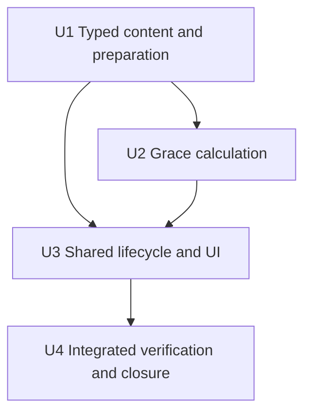
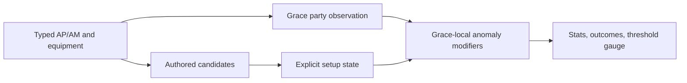

# feat: Add Grace and the first Anomaly Result

## Summary

Extend the typed setup, preparation, provider, calculation, and Result paths for
Grace. Add only the AP, AM, anomaly-damage, and anomaly-buildup meanings that
her current setup consumes, while keeping raw gauge history, reaction sequence,
Abloom arithmetic, and final damage outside the service.

## Problem Frame

The roadmap's first Anomaly vertical cannot reuse only the current
general-damage or Daze metrics. Grace needs two already-owned formula families,
new flat and percentage stat inputs, Shock/Disorder-qualified modifier outcomes,
and one AP threshold gauge. The implementation must preserve the existing
authored-candidate and deterministic-preparation model instead of introducing a
combat simulator or runtime optimizer.

## Requirements

- Admit Grace and her completed AP/AM/ATK/Energy values and formula
  participation (origin R1-R3).
- Project Core, Additional, Potential, M2, and M6 only through the retained
  relationships and operation boundary (origin R4-R9).
- Add complete Anomaly W-Engine packages, independent full/non-limited
  candidates, and deterministic representatives (origin R10-R16).
- Add Anomaly Disc facts, candidate roles, same-effect identity lifecycle,
  mains, and zero-count effective substats (origin R17-R23).
- Preserve party observation, rebuild semantics, exact projection, compressed
  equipment copy, and responsive visual acceptance (origin R24-R28; AE1-AE6).

## Scope Boundaries

- No Shock ticks, raw anomaly gauge, application history, Disorder sequence,
  Abloom calculation, raw coefficient, or final damage.
- No target editor, reaction catalogue, generic anomaly registry, party buildup
  combination, or runtime equipment scoring.
- No general CRIT admission for Anomaly and no Grace-local equipment policy
  generalized to future Anomaly Agents.

## Context And Decisions

- `src/workbench/content/types.ts` and the exhaustive content records are the
  smallest current admission path for AP/AM and three anomaly modifier metrics.
- `src/workbench/calculation/composition.ts` already owns additive stat/effect
  composition, caps, source breakdowns, action hierarchies, and threshold
  gauges. Extend those primitives; do not add an anomaly calculator framework.
- `src/workbench/candidates.ts` already owns exact same-effect exposure and
  invalid-selection clearing. Freedom Blues/Chaos Jazz joins that mechanism
  without a Grace-specific reducer.
- `src/workbench/provider-effects.ts` observes applied-party qualification.
  Grace's Additional and different-Attribute Disorder opportunity remain
  calculation context, not preparation inputs.
- Timeweaver package membership is independent from its exact Result: package
  copy is always complete, while its AP gauge appears only with a current
  different-Attribute party opportunity.

## Rejected Alternatives

- A generic anomaly result engine: rejected because Grace has only two bounded
  source-local outcomes and existing metric/action composition expresses them.
- Persisting target anomaly state: rejected because Fully Enabled already owns
  reachable source state and the product does not reproduce combat history.
- Reusing percentage-only advanced-stat rendering for AP: rejected because AP
  is flat and visible selected/candidate copy must preserve its unit.
- Treating the first Anomaly package as a roster-wide rule: rejected because
  later Assault, CRIT-capable anomaly, and off-field consumers are roadmap
  semantic gates.

## Implementation Units

- U1. **Add typed Anomaly content and prepared setups**

**Goal:** Register Grace, AP/AM inputs, new W-Engine/Disc facts, exact
candidates, same-effect identity, and pool-local prepared starts.

**Requirements:** Origin R1-R3, R10-R23, R27-R28; AE1.

**Dependencies:** None.

**Files:**
- Modify: `src/workbench/content/types.ts`
- Modify: `src/workbench/content/agents.ts`
- Modify: `src/workbench/content/setup-options.ts`
- Modify: `src/workbench/content/retained-values.ts`
- Modify: `src/workbench/content/engines.ts`
- Modify: `src/workbench/content/discs.ts`
- Modify: `src/workbench/content/representatives.ts`
- Modify: `src/workbench/effects.ts`
- Modify: `src/components/AgentSetup.tsx`
- Modify: `src/components/agentPortraits.ts`
- Test: `src/workbench/content/equipment-effects.test.ts`
- Test: `src/workbench/candidates.test.ts`
- Test: `src/workbench/preparation.test.ts`
- Test: `src/components/AgentSetup.test.tsx`

**Approach:**
- Add flat AP and percentage AM to the existing main/substat/advanced-stat
  vocabulary with exact units.
- Register the five authored Anomaly W-Engines and the three new Disc sets with
  complete accessible copy, including unused clauses.
- Add Freedom/Chaos to the current same-effect identity mechanism and prepare
  Thunder/Puffer with AP/PEN/AM and zero AP/ATK counts in both pools.
- Reuse the existing broad pre-PEN pressure for Grace's anomaly-damage DEF/PEN
  consumer, with Freedom/Electric DMG as the prepared replacement package; do
  not introduce a new pressure kind.

**Test scenarios:**
- Happy path: full and non-limited pools expose exact candidates and prepare
  Timeweaver W1 versus Fusion W1 with complete zero-count selections.
- Happy path: selected and candidate descriptions preserve AP/AM units and all
  usable/unused W-Engine and Disc clauses.
- Edge: Freedom/Chaos selected-four-piece lifecycle exposes only the legal
  complement and clears an invalid direct selection without fallback.
- Integration: broad pre-PEN pressure prepares Freedom/Electric DMG, removal
  restores Puffer/PEN membership without history, and reapplication clears an
  invalid direct selection without fallback.
- Contrast: Thunder 2-piece remains absent for Grace while current Electric
  general-damage candidates remain unchanged.

**Verification:** Exhaustive records typecheck; prepared setups are complete;
same-effect and pool behavior pass shared mechanism tests.

- U2. **Project Grace's exact provider and Result calculation**

**Goal:** Add Grace-local AP/AM, Shock/Disorder, buildup, RES, equipment, and M6
operation projection through the existing provider/calculation boundary.

**Requirements:** Origin R3-R16, R24-R27; AE2-AE3.

**Dependencies:** U1.

**Files:**
- Create: `src/workbench/calculation/agents/grace.ts`
- Modify: `src/workbench/provider-effects.ts`
- Modify: `src/workbench/calculate.ts`
- Modify: `src/workbench/calculation/result.ts`
- Modify: `src/workbench/calculation/composition.ts`
- Test: `src/workbench/calculate.mechanics.test.ts`
- Test: `src/workbench/calculate.policies.test.ts`
- Test: `src/workbench/calculate.flows.test.ts`

**Approach:**
- Observe Grace's applied-party Additional qualification and
  different-Attribute Disorder opportunity with typed context flags.
- Compose AP as flat initial/later additions and AM as base-scaled initial input
  plus later flat effects.
- Use source-local Shock and Disorder action targets under one Anomaly DMG Bonus
  row, and Special/EX targets under Anomaly Buildup Bonus.
- Attach Timeweaver's 375 AP threshold gauge to the AP row only when the party
  can produce Disorder; keep all-Electric parties as the no-gauge contrast.
- Project M2 RES and buildup-RES reductions and M6's `2.00×` operation; omit
  resource and raw/final anomaly facts.

**Test scenarios:**
- Happy path: AP/AM initial, combat, and fully values compose from selected
  mains, substats, sets, and every retained W-Engine package.
- Happy path: Core Special/EX buildup, qualified Shock +36, Potential Electric
  DMG, M2 reductions, and M6 scale appear on exact surfaces/outcomes.
- Edge: Timeweaver below/at/above 375 outputs zero/active Disorder bonus only in
  a different-Attribute party; all-Electric has complete copy but no gauge.
- Contrast: a general-damage Agent still ignores AP/AM and anomaly modifiers;
  Abloom and Shock final damage never appear.

**Verification:** Agent/result switches are exhaustive; calculations expose
only exact formula consumers and source-local differences.

- U3. **Prove shared lifecycle and visible Result behavior**

**Goal:** Extend shared integration/UI coverage and calibrate Grace's portrait
without adding new generic interaction structure.

**Requirements:** Origin R23-R28; AE4-AE5.

**Dependencies:** U1, U2.

**Files:**
- Modify: `src/workbench/state.test.ts`
- Modify: `src/workbench/calculate.flows.test.ts`
- Modify: `src/components/ResultPanel.test.tsx`
- Modify: `src/App.result.test.tsx`
- Modify: `src/App.setup.test.tsx`
- Modify: `src/App.party.test.tsx`
- Modify: `src/components/agentPortraits.ts`

**Approach:**
- Traverse pool changes, direct exact-identity edits, broad pre-PEN pressure
  present/absent/reselected, invalid clearing, party Apply qualification,
  changed-Agent-only preparation, and incomplete Result in current shared flows.
- Assert AP/AM and anomaly modifier labels, Shock/Disorder action disclosure,
  accessible Timeweaver gauge, and absence of final-damage/history surfaces.
- Inspect the original Grace portrait and calibrate scale, then head-top, then
  face-x across desktop/narrow expanded/compact states.

**Test scenarios:**
- Integration: a prepared Grace party switches pools and Disc identities,
  clears an invalid two-piece, reapplies a legal complement, and preserves
  unrelated setups.
- Integration: party Apply toggles Additional/Disorder Result opportunity
  without introducing candidates or hidden counts.
- UI: expanded rows expose sources/actions/gauge accessibly; incomplete setup
  keeps Result empty; selected/candidate equipment copy matches.
- Visual: portrait and every new row remain legible without clipping or
  overflow at desktop and narrow widths.

**Verification:** Shared state and App suites pass; original and rendered
portrait evidence satisfy the fixed acceptance matrix.

- U4. **Run integrated gates, review, and close the vertical**

**Goal:** Establish repository-wide fidelity, commit the implementation, then
record the durable milestone and remove the disposable plan.

**Requirements:** Origin AE1-AE6.

**Dependencies:** U3.

**Files:**
- Modify: `docs/plans/README.md`
- Delete after implementation commit: `docs/plans/2026-08-15-002-feat-grace-anomaly-plan.md`

**Approach:**
- Run focused tests continuously, then the full test, TypeScript, production
  build, and diff-hygiene gates.
- Review permanent-owner support separately from requirement fidelity and
  inspect the final diff for unsupported abstractions or widened consumers.
- Commit the implementation with the active plan preserved, add one compact
  milestone, remove the plan body, and commit closure.

**Test scenarios:**
- Full repository tests, typecheck, build, browser console/layout inspection,
  selected/candidate copy, both pools, threshold boundaries, and current
  general-damage contrast all pass together.

**Verification:** Clean worktree at two commits; milestone links the bounded
requirement and permanent owners; no active plan remains.

## System-Wide Impact

- Exhaustive content/provider/calculation switches gain one Agent.
- Existing preparation order and incomplete-selection behavior remain
  unchanged.
- New Effect metrics are additive display vocabulary with current Grace
  consumers, not a formula registry or final-damage model.
- Party qualification changes only provider/result observations after Apply.

## Risks And Mitigations

| Risk | Mitigation |
| --- | --- |
| Flat AP is rendered as a percentage | Extend units end-to-end and test selected/candidate copy |
| AM percentage inputs are added as flat values | Use the permanent percentage-scaled composition order and boundary tests |
| Trigger action is confused with affected outcome | Keep Zap trigger, Shock outcome, and Disorder outcome as separate typed targets |
| Timeweaver membership depends on current party | Keep candidates static and gate only exact Result/gauge projection |
| First Anomaly code grows into a simulator | Exclude raw/final damage and reuse current stat/effect/action helpers only |
| Portrait metadata is wired but visually wrong | Inspect the original and verify all four responsive destinations before commit |

## Sources And References

- Origin: `docs/brainstorms/2026-08-15-grace-anomaly-vertical-requirements.md`
- Permanent owners: `docs/setup-workbench-product-contract.md`,
  `docs/source-fact-boundary.md`, `docs/workbench-ui-design-rules.md`,
  `docs/zzz-formula-mechanics.md`, `docs/zzz-game-vocabulary.md`
- Roadmap: `docs/roadmaps/2026-08-13-vertical-expansion-roadmap.md`
- Learning: `docs/solutions/workflow-issues/prevent-secondary-requirements-from-validating-themselves-2026-08-12.md`
