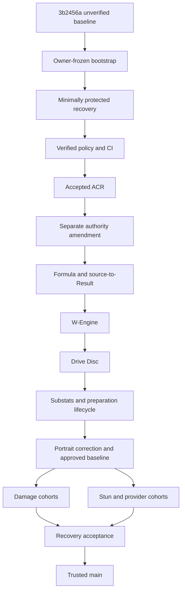
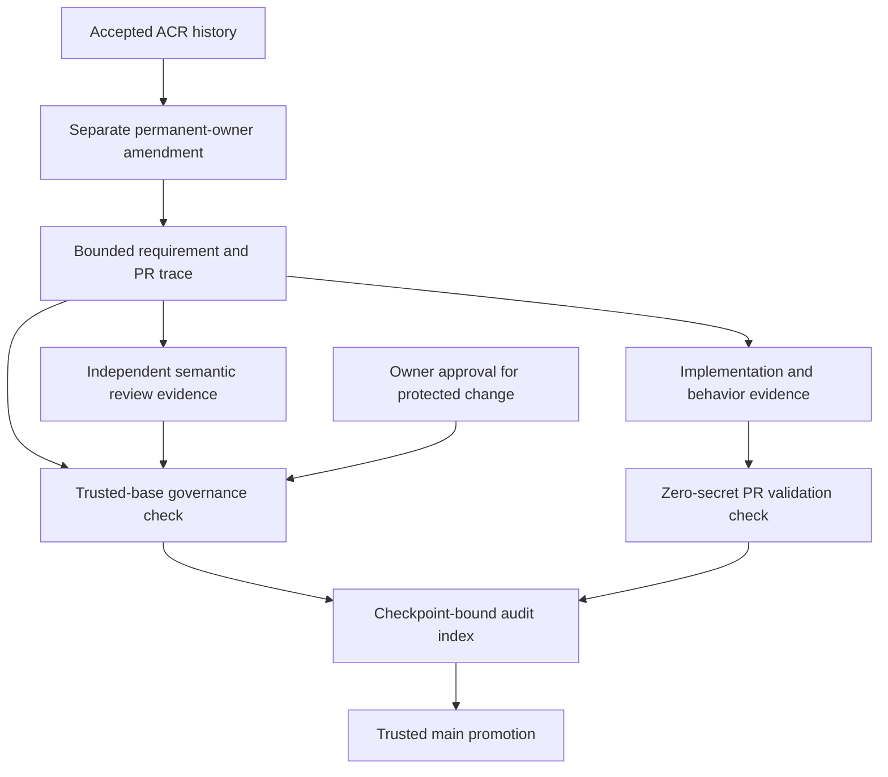

# fix: Establish authority governance and recover existing verticals

## Summary

Preserve `3b2456a` as an immutable unverified baseline, establish enforceable
authority-change, review, CI, and visual-regression boundaries, then recover
common mechanisms and every baseline Agent cohort before creating trusted
`main`.

---

## Problem Frame

The repository already described the intended authority hierarchy, but later
verticals changed permanent meaning, secondary requirements, implementation,
tests, and review from the same unsupported conclusion. This plan turns the
accepted recovery requirements into separate authority, governance, mechanism,
cohort, visual, and promotion changes so passing implementation checks can no
longer validate their own premise.

---

## Requirements

- R1. Preserve commit `3b2456a` and its full history as an explicitly
  unverified baseline; do not infer trust from a clean tree, tests, milestones,
  or the runtime roster.
- R2. Use a protected `recovery` line distinct from the immutable baseline and
  future trusted `main`; admit no new vertical during recovery.
- R3. Audit common mechanisms in the origin's exact order: formula and
  source-to-Result; W-Engine; Drive Disc; finite substats and representatives;
  preparation and selected-pressure lifecycle; portraits and visual regression.
- R4. Apply settled common meanings to all 38 Agent identities present at the
  baseline and retain only a compact cohort/PR/SHA audit index.
- R5. Keep the five direct `docs/*.md` files as the only permanent owners of
  current product and game meaning.
- R6. Add durable one-decision Authority Change Records with the accepted
  lifecycle and without making them another owner.
- R7. Reject a change that mixes permanent-authority amendment with dependent
  requirements, production code, or tests.
- R8. Assign stable identifiers only to the high-risk common rules enumerated
  by the origin.
- R9. Require a trace from each high-risk rule to the exact consumer, nearest
  similar case, contrast, setup consequence, lifecycle, visible consequence,
  and behavior verification.
- R10. Require current product-owner approval for authority, governance/CI,
  shared formula or Result meaning, common preparation/allocation or selector
  semantics, and visual baselines.
- R11. Use the private `Min-DongYoung/zzz-workbench` repository and the installed
  repository-scoped private GitHub App with least privilege and no bypass.
- R12. Make governance policy, behavior tests, type checking, production build,
  and pinned-environment Playwright comparison remote merge gates.
- R13. Permit a routine settled vertical to auto-merge only after its
  independent reviewer-agent evidence targets the current head SHA and all
  required checks pass; protected changes still require fresh owner approval.
- R14. Begin semantic review from permanent owners and established consumers,
  not from the proposed requirement, code, or test.
- R15. Treat tests as fidelity evidence only after the semantic trace survives
  independent review.
- R16. Require original-asset inspection, `scale -> headTopY -> faceX`, four
  responsive destinations, owner-approved initial snapshots, and pinned visual
  comparison for portrait changes.
- R17. Keep the postmortem, governance requirement, and individual ACRs as
  separate subordinate artifacts.
- R18. Promote only the exact recovery SHA that satisfies the complete audit
  index, authority ordering, known-failure closure, independent review, owner
  acceptance, and every required check.

**Origin actors:** A1 Product owner; A2 Controller; A3 Worker; A4 Independent
semantic reviewer; A5 Project GitHub App; A6 Required CI.

**Origin flows:** F1 baseline/recovery bootstrap; F2 existing-vertical audit and
correction; F3 permanent-authority change; F4 settled post-recovery vertical.

**Origin acceptance examples:** AE1 mixed authority/feature rejection; AE2
whole-package equipment gate; AE3 enemy-context classification; AE4 routine
auto-merge; AE5 portrait evidence and baseline approval; AE6 incomplete audit
blocks promotion; AE7 compact cohort index without an Agent catalogue.

---

## Scope Boundaries

- Do not rewrite or discard Git history, publish the repository, or deploy the
  application.
- Do not begin Grace follow-on or another Agent vertical in this plan.
- Do not create a permanent Agent setup, source-fact, guide, or audit-answer
  catalogue, a runtime evidence registry, or a universal equipment optimizer.
- Do not re-source every retained number. Reverify exact facts only when a
  conflict, uncertainty, or newly exposed semantic boundary can change a
  qualifying outcome.
- Do not treat the App private key, installation token, or user credential as a
  repository input, Actions secret, PR payload, or transcript value.
- Do not add a second reviewer App or claim that the selected single-App review
  evidence provides cryptographic reviewer-identity separation.
- Do not broaden the portrait work into a general UI redesign, web-font
  migration, or self-hosted runner project.

### Deferred to Follow-Up Work

- Resume or replace the Version 2.8 expansion sequence only after trusted
  `main` exists and the recovery plan is closed.
- Reconsider a second reviewer identity or external semantic-review service
  only if procedural reviewer-agent independence proves insufficient.

---

## Context & Research

### Relevant Code and Patterns

- `src/workbench/content/types.ts`, `agents.ts`, `setup-options.ts`,
  `engines.ts`, `discs.ts`, and `representatives.ts` are the exhaustive content,
  formula-participation, candidate, and prepared-choice seams.
- `src/workbench/candidates.ts`, `preparation.ts`, and `state.ts` own effective
  candidates, allocation order, preparation, invalidation, and reselection.
- `src/workbench/provider-effects.ts`, `effects.ts`, `calculate.ts`,
  `calculation/composition.ts`, `calculation/result.ts`, and the Agent modules
  own recipient, formula, action, surface, and Result projection.
- `src/components/AgentSetup.tsx` and `ResultPanel.tsx` expose the current Setup
  and Result semantics; `src/components/agentPortraits.ts` and the shared slot
  CSS own portrait source and destination behavior.
- The existing behavior suites are already organized around facts, candidates,
  preparation, reducer lifecycle, formula policy, composition, shared flows,
  Setup, Result, and party interaction. Recovery extends those mechanism suites
  instead of creating one suite per Agent.
- No local `.github/`, CODEOWNERS, CI, policy-script, Playwright, ACR, or
  postmortem convention exists, so those small structures must be introduced
  explicitly.

### Institutional Learnings

- `docs/solutions/workflow-issues/prevent-secondary-requirements-from-validating-themselves-2026-08-12.md`
  supplies the authority-to-consumer-to-consequence review method but is
  subordinate evidence; this plan converts its objective portions into policy
  gates without copying its Agent examples as truth.
- `docs/solutions/workflow-issues/preserve-interaction-fidelity-in-ui-explorations-2026-08-05.md`
  requires semantic and interaction parity before visual judgment; the initial
  portrait baseline follows that order.

### External References

- GitHub Spec Kit separates constitution, specification, plan, tasks, and
  implementation rather than letting a lower artifact redefine the higher one.
- NASA bidirectional traceability guidance supports checking both missing
  derivation and unsupported implementation, narrowed here to high-risk rules.
- GitHub protected-branch, CODEOWNERS, App, and Actions guidance supports the
  private Pro repository, owner-protected paths, least-privilege App, required
  checks, immutable Action references, and no secret exposure to PR code.
- Google SRE postmortem guidance supports blameless causal analysis and action
  closure rather than a prose-only incident record.
- Playwright requires baselines and comparisons to use the same browser and
  environment; a matched pinned Linux container provides the CI oracle while
  the in-app Browser remains the human calibration surface.

---

## Key Technical Decisions

| Decision | Plan treatment | Rationale |
| --- | --- | --- |
| Baseline topology | Lock branch and tag references at `3b2456a`; use `recovery` as the temporary default; create `main` only from accepted recovery | Prevents the old local `main` and the clean-but-unverified snapshot from being mistaken for trust |
| Grace plan | Keep it `frozen-by-recovery`, not completed | Its implementation is audit evidence, not an accepted milestone |
| Current governance | Put agent rules in `AGENTS.md`, repository operations in `CONTRIBUTING.md`, and machine policy in scripts/workflows | The accepted brainstorm scopes the recovery but does not become a sixth permanent product owner |
| Rule identifiers | Add owner-prefixed IDs only to high-risk common rules; never reuse retired IDs | Gives future controllers a stable lookup without identifying every paragraph or Agent fact |
| ACR transaction | One decision per ACR-only PR; after acceptance, amend only the owning permanent authority in a second protected PR; dependent artifacts follow later | Implements F3 literally and prevents the decision record, authority amendment, and implementation from validating one another |
| Trace storage | Use a structured PR description plus external review evidence bound to PR number, base SHA, head SHA, and reviewed diff; retain only cohort scope, mechanism-manifest digest, and immutable merged references in the audit index | Avoids a self-referential evidence file and preserves review detail without a permanent answer catalogue |
| Independent review | A separate reviewer agent re-derives the trace and publishes evidence through the designated PR metadata channel; CI validates provenance fields, shape, and freshness but cannot prove identity independence under one App | Matches the approved single-App procedural choice without overstating its cryptographic guarantee |
| Protected approval | CODEOWNERS protects authority/governance/baseline paths; ambiguous changes to shared semantic-bearing files fail closed as protected until a mechanically provable Agent-local boundary is established | Path ownership and an author-declared class alone cannot safely distinguish registration from common semantics in exhaustive modules |
| CI shape | A trusted-base governance check and a separate zero-secret PR validation check run on every PR; neither uses workflow-level path filters, and each succeeds only after every mandatory outcome is explicitly successful | Prevents a PR from weakening its own policy checker and prevents skipped or neutral jobs from satisfying protection |
| Bootstrap trust state | Move through owner-frozen bootstrap, minimally protected recovery, fully verified protection, and recovery-open; any emergency protection change returns to frozen | Makes the unavoidable empty-repository bootstrap and later repair path explicit rather than silently weakening governance |
| Promotion identity | Mark the recovery plan `promotion-ready`, bind an owner-only finalization run to the exact unchanged recovery head, create `main` at that SHA, then close/delete plans in a protected non-semantic main descendant | Avoids embedding a commit's own unknown SHA while keeping an operative plan visible until promotion actually succeeds |
| Visual oracle | Correct and accept current portraits before committing snapshots; compare only in a matched pinned Playwright package/container environment | Avoids canonizing known-bad pixels and cross-OS rendering noise |
| Audit inventory | Derive the frozen roster from the exact baseline and list names only as cohort coverage | Proves all 38 identities were audited without making the roster product authority |
| Source research | Re-open external facts only on conflict, uncertainty, or a semantic stop | Prevents a full content re-source while preserving exactness where current artifacts disagree |

---

## Open Questions

### Resolved During Planning

- **Private repository controls:** The product owner upgraded the personal
  account to GitHub Pro and created the private empty repository.
- **Bot identity:** The product owner created and installed one private App on
  the repository and stored its PEM outside the repository.
- **Routine semantic review:** Use the approved single-App procedural reviewer
  evidence rather than a second reviewer identity.
- **Branch topology:** Preserve the old local `main` non-destructively under a
  legacy name; do not push it as trusted `main`.
- **Grace lifecycle:** Freeze rather than complete it until its cohort audit.
- **Emergency repair:** Configure no App bypass. If a required check itself
  deadlocks recovery, the owner may temporarily alter protection only to land a
  reviewed repair. Doing so freezes recovery, disables auto-merge and App
  mutation, invalidates outstanding review/approval evidence, and requires
  protection readback plus positive and negative probes before reopening.
- **Credential transport:** Keep the PEM at the owner-controlled external path
  with owner-only ACLs. The launcher reads it only to sign a JWT, narrows the
  installation token to this repository and the operation's permissions, and
  passes the token only in the isolated child environment of an allowlisted
  `git` or `gh` operation. It never accepts an arbitrary command or exposes a
  credential through arguments, remotes, logs, files, or transcripts.

### Deferred to Implementation

- Verify the App installation ID and mint one short-lived token without
  displaying or persisting either the private key or token.
- Resolve the current immutable commit SHAs for GitHub-owned Actions and the
  exact compatible Node/Playwright patch pins at bootstrap time.
- Let each audit determine whether a disputed local fact is already decided,
  needs correction under an existing rule, or must stop for a new ACR.

---

## Output Structure

```text
.github/
  CODEOWNERS
  pull_request_template.md
  workflows/
    trusted-governance.yml
    pr-validation.yml
    visual-baseline.yml
    recovery-finalization.yml
docs/
  authority-changes/
    README.md
    YYYY-MM-DD-NNN-<decision>.md
  audits/
    2026-08-15-existing-vertical-recovery.md
  postmortems/
    2026-08-15-authority-governance-drift.md
scripts/
  github-app/
    run-as-installation.mjs
  governance/
    check-policy.mjs
    check-policy.test.mjs
tests/
  visual/
    workbench-portraits.spec.ts
    workbench-portraits.spec.ts-snapshots/
playwright.config.ts
```

This tree declares the expected artifact locations. Implementation may refine
file names while preserving the responsibility boundaries.

---

## High-Level Technical Design

> *This illustrates the intended approach and is directional guidance for
> review, not implementation specification. The implementing agent should
> treat it as context, not code to reproduce.*



Prose requirements and unit dependencies govern if the diagram differs.

---

## Implementation Units

- U1. **Preserve the baseline and freeze expansion workflow**

**Goal:** Establish the non-destructive branch topology, freeze Grace and the
expansion roadmap without claiming completion, and publish a reviewed
postmortem/conflict inventory before semantic corrections begin.

**Requirements:** R1, R2, R4, R17, R18; F1; AE6.

**Dependencies:** None.

**Files:**
- Modify: `docs/plans/README.md`
- Modify: `docs/plans/2026-08-15-002-feat-grace-anomaly-plan.md`
- Modify: `docs/roadmaps/2026-08-13-vertical-expansion-roadmap.md`
- Modify: `CONTRIBUTING.md`
- Create: `docs/postmortems/2026-08-15-authority-governance-drift.md`

**Approach:**
- Create immutable branch/tag references at `3b2456a`, preserve the existing
  local `main` under an explicit legacy name, and use `recovery` as the remote
  default until promotion.
- Protect the named baseline branch and tag against update, force-push,
  deletion, and bypass; verify both refs still resolve exactly to `3b2456a` by
  API readback.
- Record `frozen-by-recovery` as a non-completion plan state. Do not add a Grace
  milestone or remove its committed plan body yet. Also define
  `promotion-ready` as the recovery plan's still-open terminal-operations state;
  it is not completed and remains visible until trusted `main` exists.
- Suspend the roadmap's automatic continuation and replace CONTRIBUTING's
  obsolete “no CI/visual regression” statement with the accepted recovery
  boundary.
- Write a blameless postmortem covering the repeated self-validation loop,
  deferred safeguards, current-repo incident timeline, affected artifacts, and
  preventive actions mapped to later U-IDs. Keep product decisions out of it.
- Before any permanent-owner change, probe the personal-repository ruleset
  capability and establish a minimal owner-controlled rule that requires PRs
  and blocks direct push, force-push, and deletion on `recovery`. If the native
  CODEOWNER route and the documented policy-gate fallback are both unavailable,
  stop before U13 rather than continuing under advisory protection.
- During this bootstrap state, disable App mutation and auto-merge and require
  one fresh approval from the named product-owner account for every recovery
  PR. Keep that freeze through U13 and U2 until U3's full ruleset readback and
  positive/negative probes succeed.

**Patterns to follow:**
- `docs/plans/README.md` plan lifecycle and compact milestone discipline.
- Existing `docs/solutions/workflow-issues/` learnings for causal vocabulary,
  not for current product conclusions.

**Test scenarios:**
- Operational happy path: the immutable references resolve exactly to
  `3b2456a`, remote `recovery` is the only default, and no trusted remote `main`
  exists.
- Failure path: missing Pro capability, owner authentication, App installation,
  or safe key access stops bootstrap before any claim of protection.
- Protection transition: ruleset readback proves `recovery` is minimally
  protected and both forensic refs are locked before U13; an attempted direct
  update or ref move is rejected.
- Documentation contrast: Grace remains frozen evidence and has no completed
  milestone, while the recovery plan is the sole active plan.

**Verification:**
- The private remote visibly distinguishes baseline, recovery, and absent
  trusted main; minimal protection is active and read back; the postmortem is
  reviewed but changes no product owner.

- U13. **Assign stable high-risk rule IDs in an owner-only change**

**Goal:** Give high-risk permanent rules stable lookup identities without
mixing permanent-owner edits with governance or audit artifacts.

**Requirements:** R5, R7, R8, R10; F3; AE1.

**Dependencies:** U1.

**Files:**
- Modify: `docs/setup-workbench-product-contract.md`
- Modify: `docs/source-fact-boundary.md`
- Modify: `docs/workbench-ui-design-rules.md`
- Modify: `docs/zzz-formula-mechanics.md`
- Modify: `docs/zzz-game-vocabulary.md`

**Approach:**
- Define owner-prefixed stable ID namespaces, uniqueness, non-reuse, and
  split/merge/retirement handling without changing existing semantic wording.
- Apply IDs only to the origin's high-risk cross-cutting sections. Do not add
  IDs to Agent facts, examples, or every paragraph.
- Land this as a protected owner-only change. Do not include ACR schema,
  governance instructions, audit index, production code, or tests.

**Patterns to follow:**
- The five owners' existing authority-boundary tables and R8's bounded list.

**Test scenarios:**
- Documentation happy path: every introduced ID has one owning permanent file
  and no Agent-local fact receives an ID.
- Edge case: a split or retired rule preserves the old identifier as history
  and allocates new identifiers without reuse.
- Policy contrast: adding IDs and creating governance records in one PR is
  rejected even though the ID edits do not change meaning.

**Verification:**
- Independent review finds no semantic wording change hidden in the ID-only
  diff; the product owner approves the latest revision under minimal recovery
  protection.

- U2. **Introduce recovery record and trace governance**

**Goal:** Create the minimal ACR, trace, and audit-index structures that refer to
the already-stable owner IDs without modifying permanent authority.

**Requirements:** R4-R10, R17; F2-F3; AE1, AE7.

**Dependencies:** U13.

**Files:**
- Modify: `AGENTS.md`
- Modify: `CONTRIBUTING.md`
- Create: `docs/authority-changes/README.md`
- Create: `docs/audits/2026-08-15-existing-vertical-recovery.md`

**Approach:**
- Define one ACR schema and statuses `proposed`, `accepted`, `rejected`, and
  `superseded`. A record preserves one decision and links its replacement but
  never supplies current meaning.
- Seed the audit index from the baseline Agent identities grouped only by audit
  cohort; it contains status and immutable PR/SHA references, not facts,
  setups, or conclusions.
- Add the structured authority trace contract to repository operations and
  agent instructions without duplicating permanent product rules there. Assign
  the authority-change transaction one governance-prefixed stable ID in
  `AGENTS.md`; reference that ID from CONTRIBUTING and the ACR instructions.

**Patterns to follow:**
- The origin R6/R8/R9 distinction between current meaning, change history, and
  review evidence.

**Test scenarios:**
- Documentation happy path: every trace reference resolves to one stable owner
  ID while neither the ACR nor audit index repeats the rule's meaning.
- Governance identity: the authority-change transaction ID is unique, resolves
  to `AGENTS.md`, and cannot be mistaken for a sixth product/game owner.
- Edge case: rejected and superseded ACRs preserve immutable history and link
  forward without becoming current authority.
- Coverage: the audit index's cohort union names each baseline identity once
  and does not treat the list as Version authority.

**Verification:**
- Independent review and owner approval confirm that the record model changes
  governance only and does not amend a permanent owner.

- U3. **Enforce governance with CI and the App workflow**

**Goal:** Turn objective governance, trace, test, build, review-evidence, and
approval invariants into remote merge gates and use the installed App only for
non-protected branch and PR work.

**Requirements:** R7-R15, R18; F1, F3, F4; AE1, AE4, AE6.

**Dependencies:** U2.

**Files:**
- Create: `.github/CODEOWNERS`
- Create: `.github/pull_request_template.md`
- Create: `.github/workflows/trusted-governance.yml`
- Create: `.github/workflows/pr-validation.yml`
- Create: `.github/workflows/visual-baseline.yml`
- Create: `.github/workflows/recovery-finalization.yml`
- Create: `scripts/governance/check-policy.mjs`
- Create: `scripts/governance/check-policy.test.mjs`
- Create: `scripts/github-app/run-as-installation.mjs`
- Modify: `.gitignore`
- Modify: `package.json`
- Modify: `package-lock.json`
- Modify: `AGENTS.md`
- Modify: `CONTRIBUTING.md`

**Approach:**
- Define an allowed-change matrix for permanent owners, ACRs, governance/CI,
  supporting requirements/plans, production/tests, audit index, and visual
  baselines. Reject forbidden mixtures, especially owner plus dependent code.
- Validate rule-ID existence and uniqueness, ACR shape/status, frozen-roster
  scope, PR trace sections, independent-review evidence for the exact PR/base/
  head/diff state, and fresh owner approval for protected classifications.
- Keep policy truth modest: CI validates objective presence and ordering; it
  never claims the semantic conclusion is correct.
- Run trusted governance from the protected base revision and treat the PR
  diff and GitHub metadata only as data. A `pull_request_target` job may be used
  only for this base-revision evaluator and must never check out or execute PR
  code. Give it only `contents: read`, `pull-requests: read`, `issues: read`, and
  the narrowly required `statuses: write`; the PR-code workflow stays read-only.
- Run behavior, type/build, and visual applicability against the PR merge state
  in a separate `pull_request` workflow with no secrets and read-only token.
  Both workflows run on every PR without workflow-level path filters and expose
  stable, unique required check names.
- Establish the stable visual result in U3. Until U9 lands the accepted
  Playwright baseline, the required job returns an explicit policy-verified
  not-applicable result only when the repository path classifier finds no
  `visual-baseline` input. Pre-U9 semantic or interaction changes in ordinary
  production/test paths remain subject to their normal protected review,
  behavior checks, and applicable in-app Browser verification; they are not
  snapshot inputs before an accepted oracle exists. Portrait metadata and
  assets, shared CSS, Playwright configuration, and visual tests remain blocked
  until U9. U9 fills the existing job without changing its required name or
  reopening branch protection.
- Make each required result fail closed: failed, cancelled, absent, skipped,
  neutral, or duplicate-name mandatory outcomes cannot yield success. “Visual
  not applicable” is an explicit policy result, never an omitted job.
- Pin GitHub-owned Actions immutably. Do not enable merge queue for this private
  personal repository; if that scope changes later, add and verify the
  `merge_group` trigger before enabling it.
- Use the external PEM only through a local allowlisted launcher. It verifies
  the expected App, installation, and repository; mints a repository- and
  permission-narrowed installation token; passes it only through the isolated
  child environment for an allowlisted `git` or `gh` operation; revokes it when
  supported; and redacts every failure. The App has Contents and Pull Request
  write access plus read-only Checks and Commit statuses access for the exact
  current-head merge preflight. It has no Actions, workflow, administration,
  Checks or Commit statuses write, secret, or bypass capability.
- Invoke absolute executable paths with exact subcommand/argument schemas and a
  scrubbed environment. Disable repository/user Git hooks, credential helpers,
  aliases, pagers, editors, and `gh` extensions; validate the GitHub host; use a
  controlled credential broker; and revoke the token in guaranteed cleanup.
- Bootstrap checks under owner control, observe their status names, activate
  final rules, capture and read back the active ruleset and expected check
  sources, and prove enforcement before beginning semantic correction.
- Publish reviewer evidence as one versioned, structured PR issue comment after
  independent review. The normalized payload records reviewer-run provenance,
  PR, reviewed base, head, diff digest, traced rule IDs, and consumer paths. A
  trusted API-only workflow re-evaluates on comment create/edit/delete, PR
  synchronize/ready/reopen, and applicable base changes, binds the current
  payload digest to the head status, and the allowlisted merge operation checks
  that digest once more immediately before enabling auto-merge. Under the
  approved single-App model this proves freshness, not author/reviewer identity
  separation.
- Require branches to be current for code/CI. An unrelated base advance reruns
  validation but may preserve semantic evidence only when its head, reviewed
  diff, rule/consumer digests, and common-mechanism manifest are unchanged;
  any applicable authority, governance, mechanism, or consumer change
  invalidates the evidence and requires re-review.
- Create an owner-only `workflow_dispatch` finalization path. It accepts an
  exact candidate SHA, rejects any actor other than the named product owner,
  verifies that SHA is the current `recovery` tip, executes the trusted policy
  and zero-secret validation at that exact object, and records the run as the
  external promotion attestation. It does not expose the App credential.

**Patterns to follow:**
- Existing `npm run check` as the local behavior/type/build basis.
- GitHub's least-privilege App, immutable Action, stale-approval, and required-
  check guidance.

**Test scenarios:**
- Covers AE1. Permanent-owner plus production/test changes fail policy; an
  ACR-only change and a later owner-only authority amendment are separately
  allowed; combining them fails.
- Covers AE4. A harmless App-authored governance fixture PR with current
  PR/base/head/diff reviewer evidence receives every required check and
  auto-merges without owner approval. Preserve its immutable PR/SHA reference.
- Classification realism: the policy fixture models Agent-local additions in
  the real exhaustive registration/content seams and a nearest shared-semantic
  edit. The local form can auto-merge; the shared contrast remains protected.
  Do not add a real Agent or vertical merely to prove policy.
- Protected contrast: a protected-class fixture remains blocked until the
  owner approves the latest revision, then merges with its own immutable trace.
- Error path: missing, malformed, wrong-channel, stale-head, stale-diff, or an
  applicable stale-base semantic review fails. Every base update reruns code/CI
  and the trusted delta check; replacing, editing, or deleting green evidence
  re-evaluates and withdraws the prior bound head status.
- Error path: a protected classification without the owner's approval of the
  latest revision fails; a later push invalidates prior approval.
- Fail-closed checks: failed, cancelled, absent, skipped, neutral, and duplicate
  child outcomes fail; a PR with no visual change emits explicit not-applicable
  success from policy rather than a missing Pending check.
- Pre-U9 applicability contrast: a planned semantic Setup component and its
  behavior test receive the explicit not-applicable success, while portrait
  metadata/assets, shared CSS, Playwright configuration, and visual-test inputs
  fail until U9 establishes and the owner accepts the first baseline.
- Trust-boundary attack: a PR replaces its copy of `check-policy.mjs` with an
  unconditional pass, but the protected-base evaluator still rejects the
  forbidden diff.
- Security: PR jobs cannot read the App PEM or installation token; the local
  launcher rejects another repository, installation, permission, or arbitrary
  subprocess and leaves no credential in arguments, remotes, logs, worktree,
  or transcript.
- Promotion: a non-owner dispatch, SHA other than current `recovery`, or a
  candidate missing any mandatory outcome fails without creating an attestation.
- Integration: direct push, force-push, deletion, failed checks, and unresolved
  review cannot update `recovery`.

**Verification:**
- Positive and negative fixture PRs prove F4 and protection; ruleset/API
  readback names the stable policy, validation, and visual result sources; a
  dry finalization proves exact-SHA binding; the App cannot alter workflows,
  protection, or the target branch directly.

- U4. **Record the disputed authority decisions**

**Goal:** Decide the survival/shield Result boundary and Agent-supplied generic
`DMG Taken` boundary in two durable ACR-only changes before amending authority.

**Requirements:** R5-R7, R9, R10, R14, R17; F3; AE1, AE3.

**Dependencies:** U3.

**Files:**
- Create: `docs/authority-changes/2026-08-15-001-shield-result-boundary.md`
- Create: `docs/authority-changes/2026-08-15-002-agent-damage-taken-source-boundary.md`

**Approach:**
- Reconstruct each decision from the owning rule, current supported consumer,
  nearest similar case, contrast, and user-visible consequence; use current
  code/tests only as impact inventory.
- Treat the written outcomes below as proposals to falsify, not conclusions
  validated by this plan. The current owners explicitly admit Ben's shield
  Result exception and Caesar's Agent-supplied generic `DMG Taken`, so correcting
  dependent artifacts directly would violate R5-R7; an owner decision is
  required.
- State the proposed shield decision: complete Setup/package facts may retain a
  shield clause when its own gate needs it, but generic Result and positive
  damage/setup axes exclude survival value.
- State the proposed source decision: the conceptual target-side formula
  component remains available for enemy/stage mechanics, but recipient locus
  alone does not admit an Agent source as generic `DMG Taken`.
- Land one ACR per protected PR with no permanent-owner, requirement, plan,
  production, or test edits. The product owner's latest-revision approval and
  merge make the record accepted; rejection leaves the existing owner current.
- If evidence defeats a proposal or the owner rejects it, stop and revise U14,
  U5, and the affected success condition before any dependent work. Rejection
  is a valid decision outcome but cannot silently fall through the prewritten
  correction path or permit promotion with an unresolved known failure.

**Patterns to follow:**
- The owners' one-way dependency and single-retention boundaries.
- Current supported Stun DMG Multiplier and Veil Vulnerability consumers as
  contrasts, not as generic DMG Taken precedents.

**Test scenarios:**
- Test expectation: none -- these PRs record decisions only; policy and
  independent review prove transaction shape, not implementation fidelity.
- Review case: a rejected ACR leaves the existing owner current and dependent
  correction blocked.
- Supersession case: a later decision creates a new ACR and links the old one
  without rewriting its approval history.

**Verification:**
- Each accepted ACR PR has one decision, current-head owner approval, no owner
  or dependent files, and an independently reconstructed impact list.

- U14. **Amend permanent authority from accepted ACRs**

**Goal:** Apply each accepted decision to its owning permanent documents in
separate owner-only protected changes before any dependent correction begins.

**Requirements:** R5-R7, R10, R17; F3; AE1, AE3.

**Dependencies:** U4.

**Files:**
- Modify in its own protected amendment: `docs/setup-workbench-product-contract.md`
- Modify in its own protected amendment: `docs/source-fact-boundary.md`
- Modify in its own protected amendment: `docs/zzz-formula-mechanics.md`

**Approach:**
- Create one protected authority-amendment PR per affected permanent owner,
  even when one accepted ACR affects multiple owners. Cite the same immutable
  accepted record and the amended owner's current Rule ID in every such PR;
  change exactly that one permanent-owner document and no other owner or
  dependent artifact.
- Complete `ACR-2026-08-15-001` through three separate amendments: `SW-013` in
  `docs/setup-workbench-product-contract.md`, `SF-003` in
  `docs/source-fact-boundary.md`, and `FM-009` in
  `docs/zzz-formula-mechanics.md`. Treat all three merged amendments as one
  prerequisite gate: no shield/Proto requirement, plan, production, test, or
  audit-completion correction begins after only a subset has merged.
- Preserve shield package-copy meaning while excluding survival as a generic
  Result or positive setup axis.
- Preserve conceptual target mechanics while excluding unsupported
  Agent-supplied generic `DMG Taken`; retain Stun DMG Multiplier and Veil
  Vulnerability as distinct owned consumers.
- Do not include requirements, plans, production code, tests, or audit-index
  completion. A rejected or stale ACR blocks its amendment.

**Patterns to follow:**
- The five owners' one-way dependency and single-retention boundaries.
- F3's record -> owner amendment -> later dependent change ordering.

**Test scenarios:**
- Transaction shape: an owner amendment without an accepted ACR fails; an ACR
  and owner amendment in the same PR also fails.
- Owner isolation: an amendment PR that changes two permanent owners fails even
  when both changes cite the same accepted ACR; three ACR-001 amendment PRs
  changing only `SW-013`, `SF-003`, and `FM-009` respectively pass this shape.
- Ordering: each amendment cites an already-merged accepted ACR, and later ACR
  supersession cannot silently rewrite the merged record. Dependent ACR-001
  correction remains blocked until all three owner amendments have merged.
- Content contrast: the amendment preserves exact Stun Multiplier and Veil
  Vulnerability owners without using them as generic DMG Taken precedents.

**Verification:**
- The owner approves each latest authority-only revision, policy proves each PR
  changes exactly one permanent owner with no dependent artifacts, and
  independent review confirms that amendment exactly realizes its accepted ACR
  for the cited current Rule ID. ACR-001 dependent work remains frozen until
  the accepted merged set contains separate `SW-013`, `SF-003`, and `FM-009`
  amendments.

- U5. **Correct formula and source-to-Result consumers**

**Goal:** Apply the restored boundaries to current requirements, formula/source
consumers, Results, and behavior tests before equipment policy is re-audited.

**Requirements:** R3, R4, R9, R14, R15; F2; AE3, AE6.

**Dependencies:** U14.

**Files:**
- Modify: applicable supporting requirements under `docs/brainstorms/`
- Modify: `docs/plans/README.md`
- Modify: `src/workbench/content/types.ts`
- Modify: `src/workbench/content/retained-values.ts`
- Modify: `src/workbench/formula-policy.ts`
- Modify: `src/workbench/effects.ts`
- Modify: `src/workbench/calculate.ts`
- Modify: `src/workbench/calculation/composition.ts`
- Modify: `src/workbench/calculation/result.ts`
- Modify: affected files under `src/workbench/calculation/agents/`
- Test: `src/workbench/formula-policy.test.ts`
- Test: `src/workbench/effects.test.ts`
- Test: `src/workbench/calculate.mechanics.test.ts`
- Test: `src/workbench/calculate.policies.test.ts`
- Test: `src/workbench/calculate.flows.test.ts`
- Test: `src/components/ResultPanel.test.tsx`
- Test: `src/App.result.test.tsx`

**Approach:**
- Inventory every shield, Shield Effect, generic `dmgTaken`, enemy-recipient,
  damage-bonus, Stun Multiplier, and Vulnerability path before editing.
- Correct bounded requirements in place, then remove shield operations from
  Result and generic positive candidate pressure while retaining exact
  compressed Setup facts that remain part of a package.
- Remove unsupported Agent generic-DMG-Taken delivery. Reverify a conflicting
  exact source fact before mapping it to an already-owned consumer; omit the
  projection and stop if that fact remains unresolved.
- Correct disputed milestone wording so the milestone index no longer presents
  the invalid conclusion as current authority.
- Add mechanism tests around formula/recipient/action contrasts, not suites per
  affected Agent.

**Execution note:** Add characterization coverage for every disputed current
projection before changing the shared metric and delivery paths.

**Patterns to follow:**
- `src/workbench/effects.ts` applicability and recipient resolution.
- Existing formula-policy and shared calculation-flow tests.

**Test scenarios:**
- Covers AE3. Enemy context does not rename attacker damage dealt as generic
  DMG Taken; exact ordinary modifier consumers remain in their owned regions.
- Shield case: Ben/Caesar and equipment shield facts remain visible only where
  Setup/package comparison requires them and create no Result operation.
- Contrast: Stun DMG Multiplier and Veil Vulnerability retain their exact rows,
  cap/replacement behavior, and recipients.
- Regression: all current formula families ignore unsupported Agent generic
  DMG Taken while target conceptual mechanics remain representable.
- Integration: a complete party recalculates without stale removed rows or
  incomplete source mappings.

**Verification:**
- The authority trace precedes corrected requirements and code; focused and
  full behavior/type/build gates pass with no generic Agent DMG Taken or shield
  Result consumer.

- U6. **Recover W-Engine candidate and selector meaning**

**Goal:** Correct the shared W-Engine gate and known selector failures through
affected paths plus representative contrasts; leave exhaustive identity
application to U10-U11.

**Requirements:** R3, R4, R9, R10, R14, R15; F2; AE2, AE6.

**Dependencies:** U5.

**Files:**
- Modify: applicable supporting requirements under `docs/brainstorms/`
- Modify: `src/workbench/content/engines.ts`
- Modify: `src/workbench/content/representatives.ts`
- Modify: `src/workbench/effects.ts`
- Modify: `src/components/AgentSetup.tsx`
- Test: `src/workbench/content/equipment-effects.test.ts`
- Test: `src/workbench/candidates.test.ts`
- Test: `src/workbench/preparation.test.ts`
- Test: `src/workbench/calculate.policies.test.ts`
- Test: `src/components/AgentSetup.test.tsx`
- Test: `src/App.setup.test.tsx`

**Approach:**
- For each candidate touched by a known failure or chosen as a mechanism
  sentinel, trace holder eligibility and passive activation,
  exact role/formula/action/operation consumer, origin, nearest same-pool
  same-axis competitor, complete Base ATK/advanced/passive package, unused
  clauses, finite opportunity cost, pool-local membership, representative,
  lifecycle, and separate Result projection.
- Re-compare full and non-limited pools independently rather than filtering a
  full-pool ranking.
- If the retained requirement assigned an unsupported role merely from a
  Specialty, stat, or formula fact, correct that upstream role before judging
  packages. Re-run the affected W-Engine representative and every dependent U7
  Disc/representative conclusion together; a merged U6 transaction does not
  preserve a downstream conclusion whose role premise has failed.
- Remove selector-level `Inactive` prefixes and specialty-status prose. Show the
  same compressed whole package on selected and candidate surfaces regardless
  of the holder; Result applies only compatible clauses.
- Apply the permanent compression rule to routine triggers, stack acquisition,
  durations, cooldowns, recipient, action, Attribute, and magnitude-changing
  thresholds before changing typography or geometry.
- Remove supported numerically positive but dominated packages in the affected
  and sentinel paths; do not claim population-wide completion, target a
  candidate count, or turn the audit into runtime scoring.

**Patterns to follow:**
- Permanent W-Engine Package Inspection and W-Engine availability-pool rules.
- Current selected/candidate accessible-description parity tests.

**Test scenarios:**
- Covers AE2. A partial package survives only when its usable portion remains a
  material same-pool alternate after unused opportunity cost.
- Ineligible contrast: advanced stat and complete passive copy remain visible,
  but incompatible passive clauses do not enter Result and receive no
  `Inactive` selector status.
- Pool contrast: a non-limited candidate is independently competitive in that
  pool and also appears in full without needing to defeat the limited
  representative head to head.
- Compression: selected and candidate surfaces expose identical concise
  recipient/action/threshold meaning and omit routine activation prose.
- Integration: pool change prepares only the changed Agent; direct engine edit
  keeps unrelated inputs and applies exact current pressure without ranking.

**Verification:**
- Every changed or sentinel package has a review trace and pool-local
  consequence; Setup contains no unapproved compatibility status and Result
  remains exact. Its planned semantic `AgentSetup` copy change receives the
  explicit pre-U9 not-applicable visual result only because no U9-owned visual
  input changes; behavior and in-app Browser verification remain mandatory.
  U10-U11 own exhaustive identity completion.

- U7. **Recover Drive Disc routing, dominance, and allocation**

**Goal:** Correct shared Disc routing/allocation and every currently identified
Proto failure through affected paths and representative contrasts; leave the
remaining identity-by-identity application to U10-U11.

**Requirements:** R3, R4, R9, R14, R15; F2; AE2, AE6.

**Dependencies:** U6, including any holder-local U6 correction discovered
before U7 closure. When that correction changes the role premise, its dependent
U7 candidate and representative outcomes are reverified in the same bounded
unit before U7 can close.

**Files:**
- Modify: applicable supporting requirements under `docs/brainstorms/`
- Modify: `src/workbench/content/discs.ts`
- Modify: `src/workbench/content/representatives.ts`
- Modify: `src/workbench/candidates.ts`
- Modify: `src/workbench/preparation.ts`
- Modify: affected files under `src/workbench/calculation/agents/`
- Test: `src/workbench/content/equipment-effects.test.ts`
- Test: `src/workbench/candidates.test.ts`
- Test: `src/workbench/preparation.test.ts`
- Test: `src/workbench/calculate.policies.test.ts`
- Test: `src/workbench/calculate.flows.test.ts`
- Test: `src/workbench/state.test.ts`

**Approach:**
- Classify each 2-piece and 4-piece clause by effect family and exact current
  leaf, keep eligibility/scope/identity orthogonal, then recombine one set's
  complete package before membership or representative decisions.
- Re-audit every currently identified Proto Punk candidate with shield charged
  as unused survival
  opportunity rather than a damage/setup axis. A legal Assist trigger cannot
  preserve a package dominated by the nearest usable party-facing comparator.
- Preserve general Attack ATK/Attribute alternatives, Rupture Attribute versus
  HP conversion policy, King/Astral/Shockstar/Moonlight allocation, contextual
  Puffer/Astral admission, and exact same-effect identity only where their
  current owners and consumers still support them.
- Keep candidate membership, prepared representative, selected exact identity,
  contextual addition, and non-stacking holder allocation as separate outcomes.
- Verify adjacent allocation passes in their permanent dependency order and
  retain direct-edit duplicate behavior with Result non-stacking.

**Patterns to follow:**
- Permanent Drive Disc Inspection Routing and Complete Setup Selection.
- Existing shared candidate, preparation, and state lifecycle tests.

**Test scenarios:**
- Proto case: no current holder gains Proto from shield or trigger legality
  alone; each surviving or removed membership names the same-pool comparator
  and complete package.
- Attack/Rupture contrast: ordinary Attack retains formula-valid ATK and
  matching Attribute alternatives while Rupture rejects standalone HP 2-piece
  and PEN but can retain HP inside a competitive 4-piece package.
- Allocation: King resolves first for a crit-capable Focus, then compatible
  party packages, then Shockstar under its authored field-time boundary.
- Same-effect lifecycle: Swing/Moonlight and Hormone/Astral expose one legal
  exact identity, swap correctly, clear invalid selections without fallback,
  and do not restore history.
- Context lifecycle: Puffer/Astral pressure present, absent, and reselected
  updates membership without overwriting direct edits; an unaffected consumer
  remains stable.

**Verification:**
- Shared composition flows pass in authority order; no changed/sentinel Proto
  conclusion relies on shield or trigger legality alone, and no local
  allocation rule is generalized beyond its consumer. U10-U11 own exhaustive
  Disc membership coverage.

- U8. **Recover finite investment, representatives, and session lifecycle**

**Goal:** Correct the shared finite-investment and preparation lifecycle through
affected paths and representative contrasts at zero supplied counts; leave
exhaustive identity application to U10-U11.

**Requirements:** R3, R4, R9, R14, R15; F2; AE2, AE6.

**Dependencies:** U7.

**Files:**
- Modify: applicable supporting requirements under `docs/brainstorms/`
- Modify: `src/workbench/content/setup-options.ts`
- Modify: `src/workbench/content/representatives.ts`
- Modify: `src/workbench/candidates.ts`
- Modify: `src/workbench/preparation.ts`
- Modify: `src/workbench/state.ts`
- Test: `src/workbench/candidates.test.ts`
- Test: `src/workbench/preparation.test.ts`
- Test: `src/workbench/state.test.ts`
- Test: `src/workbench/calculate.flows.test.ts`
- Test: `src/App.setup.test.tsx`
- Test: `src/App.party.test.tsx`

**Approach:**
- Require each effective substat to remain a material use of finite tuning
  opportunity after current fixed supply, cap, threshold, conversion, and
  stronger alternatives; positive numeric contribution alone is insufficient.
- Keep visible counts at zero. Use the conservative eight-count authoring
  heuristic only for its bounded capped-provider and crit-capable-damage cases,
  never as current investment, an attainable Disc distribution, or a runtime
  optimizer.
- Re-author affected and sentinel capped/single-axis providers before fixed
  supply, crit-capable
  damage around cap opportunity, and ordinary multi-axis damage after its
  pool-specific W-Engine package.
- Reconstruct the complete preparation order and prove selected-pressure
  present, absent, and reselected lifecycle, including invalid clearing without
  fallback and zero-history recreation for optional substat inputs.
- Freeze the baseline roster during recovery; a new Agent ID fails policy rather
  than entering an audit cohort.

**Patterns to follow:**
- Permanent Effective Substat Candidate Gate, Competitive Candidate Set, and
  Prepared Starting Setup.
- Existing shared preparation/state tests rather than Agent-specific suites.

**Test scenarios:**
- Capped provider: Astra/Pan-type single-axis opportunity reserves bounded
  future substats before fixed supply and initializes all offered counts at
  zero.
- Damage contrast: Corin-type ordinary multi-axis authoring resolves the engine
  first, while a crit-capable direction rebalances fixed CRIT supply before
  discarding a useful substat.
- Stun contrast: a selected-King holder can offer zero CRIT counts below the
  threshold because future opportunity exists; an unrelated Stun setup gains no
  personal-damage substats.
- Oversupply: a fixed package that trivializes the useful residual axis changes
  representative balance; a superficially similar multi-axis package does not
  shrink the candidate set around current counts.
- Composed Phase-2 exit flow: begin with a pool-specific whole W-Engine
  representative and zero supplied substats, traverse Drive Disc membership
  and party allocation, then selected pressure present -> absent -> reselected.
  The invalid dependent clears without fallback, the changed Agent alone
  rebuilds for Mindscape/pool changes, an unaffected party consumer remains
  stable, and Result stays empty until every required selection is repaired.

**Verification:**
- Every changed or sentinel prepared choice belongs to its effective set at its
  resolution point; zero never means absent opportunity, and no runtime score
  or hidden fallback exists. U10-U11 own exhaustive representative coverage.

- U9. **Correct portraits and establish approved visual regression**

**Goal:** Correct the known portrait framing regressions through the permanent
calibration method, then establish the first owner-approved snapshots in a
stable Playwright environment without replacing human browser review.

**Requirements:** R12, R16, R18; F2; AE5, AE6.

**Dependencies:** U8.

**Files:**
- Modify: `package.json`
- Modify: `package-lock.json`
- Create: `playwright.config.ts`
- Modify: `.github/workflows/pr-validation.yml`
- Modify: `.github/workflows/visual-baseline.yml`
- Create: `tests/visual/workbench-portraits.spec.ts`
- Create: `tests/visual/workbench-portraits.spec.ts-snapshots/`
- Modify: `src/components/agentPortraits.ts`
- Modify when shared destination correction is proven: `src/app.css`
- Modify after U9 acceptance: `docs/audits/2026-08-15-existing-vertical-recovery.md`
- Test: `src/App.party.test.tsx`
- Test: `src/App.setup.test.tsx`

**Approach:**
- Treat Pulchra, Nekomata, Ben, and Koleda `headTopY`, plus Zhao `scale`, as
  provisional diagnoses rather than prescribed edits. For each Agent, inspect
  the original asset, name a nearby comparator, evaluate the scale envelope,
  then compare `headTopY` with scale frozen, then `faceX` with scale and vertical
  registration frozen. Retain or change each input only after that ordered
  evidence; never use a later coordinate to hide an earlier calibration error.
- Repeat controller comparison at desktop and narrow widths with each changed
  Agent expanded and compact, against nearby accepted portraits and the shared
  destination frame.
- Scope the initial snapshots to the five corrected Agents plus named nearby
  unchanged contrasts across the four destinations. Do not turn the frozen
  38-Agent implementation roster into a portrait catalogue or claim that
  unchanged metadata received new source calibration.
- Pin the Playwright package and matched Linux container/browser environment,
  use one Chromium worker, and cover exactly the four required destinations.
- Generate candidate snapshots only in the pinned environment, upload expected,
  actual, diff, and report artifacts, and add snapshots only after the product
  owner accepts the rendered evidence. Never update baselines in ordinary CI.
- Bind visual acceptance to the exact PR head, pinned environment/container
  digest, committed snapshot checksums, original-asset references, and the four
  immutable Windows Browser evidence artifacts for every changed Agent and
  named contrast. A generic latest-revision approval is insufficient.
- Keep the Windows in-app Browser check mandatory because the current font stack
  can render differently from Linux snapshots.
- After U5-U9 are accepted, land a separate index-only transaction that records
  their ordered merge SHAs and a generation digest as the common-mechanism
  checkpoint manifest. Reopening U5 invalidates U6-U9; reopening U6 invalidates
  U7-U9; reopening U7 invalidates U8-U9; reopening U8 or any transitive render
  input invalidates U9. No new generation exists until the ordered downstream
  gates and visual approval are renewed.

**Patterns to follow:**
- Permanent portrait responsibilities and fixed calibration order.
- Existing party/slot interactions rather than a static visual-only fixture
  that drops current behavior.

**Test scenarios:**
- Covers AE5. DOM metadata wiring without original-asset and four-destination
  evidence cannot pass acceptance.
- Baseline protection: an ordinary PR cannot update snapshots; a snapshot change
  without latest owner approval fails policy.
- Visual regression: a known metadata delta fails comparison and uploads
  inspectable expected/actual/diff artifacts without regenerating expected.
- Interaction: the real party surface reaches each expanded/compact state with
  readable names, no clipping, and no horizontal overflow.
- Accessibility: pointer and keyboard traversal reach each covered expanded and
  compact destination at desktop and narrow widths, preserve visible focus,
  and expose the current Agent's accessible name plus selected/expanded state.
- Environment contrast: Windows browser review and Linux snapshot comparison
  are both recorded and neither claims to replace the other.
- Freshness: a later change to any covered portrait, shared destination frame,
  font/rendering input, or expected snapshot invalidates the affected U9 owner
  approval and blocks promotion until the four-destination evidence is renewed.

**Verification:**
- The owner approves the corrected five-Agent evidence and initial snapshots at
  the latest revision; the pinned required visual job passes from a clean CI
  checkout; the subsequent index-only change records the complete U5-U9
  mechanism-checkpoint manifest without adding product conclusions.

- U10. **Audit damage-family Agent cohorts**

**Goal:** Apply every recovered common mechanism to the baseline Rupture,
Anomaly, and Attack Agents through review-sized cohort PRs and record accepted
coverage without retaining per-Agent answers.

**Requirements:** R3, R4, R9, R14, R15, R18; F2; AE2, AE3, AE6, AE7.

**Dependencies:** U9.

**Files:**
- Modify only when audit finds a supported correction: applicable files under
  `docs/brainstorms/`, `src/workbench/content/`, `src/workbench/calculation/agents/`,
  and shared mechanism tests
- Modify only in a serialized post-merge index PR:
  `docs/audits/2026-08-15-existing-vertical-recovery.md`

**Approach:**
- Use four independently reviewable PRs:
  1. Rupture: Yixuan, Yidhari, Manato, Banyue, Starlight Billy.
  2. Anomaly: Grace.
  3. Attack A: Anby: Soldier 0, Seed, Cissia, Evelyn, Corin, Hugo, Ellen.
  4. Attack B: Soldier 11, Zhu Yuan, Orphie & Magus, Asaba Harumasa,
     Nekomata, Billy Kid, Ye Shunguang.
- For every high-risk conclusion, reconstruct owner -> exact consumer -> nearest
  similar case -> contrast -> candidate/representative -> lifecycle -> visible
  Setup/Result -> verification. Do not accept the existing requirement, code,
  test, or prior audit as the premise.
- Bind every cohort review to the latest accepted common-mechanism checkpoint
  manifest. Read-only audits may overlap. Code/CI always rebases onto the
  current recovery base; semantic review repeats only when the reviewed head or
  diff, referenced rule/consumer digests, or applicable mechanism manifest
  changes.
- Reverify exact source facts only when current retained artifacts conflict or
  the audit reaches a semantic stop.
- A no-defect cohort still receives independent review and one audit-index
  entry. After the cohort PR merges, land a separate serialized index-only PR
  that records its already-known PR number, merge SHA, and mechanism-manifest
  digest; the cohort PR never attempts to record its own SHA. A newly exposed
  shared meaning stops the cohort and returns to the
  appropriate ACR/authority/mechanism sequence. All entries based on an affected
  earlier checkpoint become incomplete until re-reviewed; cohort merges pause
  until the new checkpoint is accepted.

**Patterns to follow:**
- Existing Agent-local calculation modules and mechanism-oriented tests.
- Permanent formula-family consequences and equipment/substat gates.

**Test scenarios:**
- Rupture: DEF/PEN exclusion, HP conversion opportunity, CRIT-capable versus
  ordinary multi-axis balance, and exact action/recipient contrasts survive.
- Grace: anomaly damage versus buildup, AP/AM, CRIT exclusion, Disorder
  qualification, and W-Engine/Disc package policy are independently re-derived
  rather than inherited as the first Anomaly precedent.
- Attack: selected-equipment-only stat pressure is distinguished from an
  independent Agent relationship; action-scoped and broad modifiers preserve
  their different candidate and Result consequences.
- Lifecycle: at least one contextual candidate and one unaffected consumer
  traverse pressure present, absent, and reselected states.
- Audit-only: a supported no-change cohort passes review and index coverage
  without creating content assertions.

**Verification:**
- Four accepted PR/SHA entries cover all 20 named baseline identities once,
  cite one current mechanism-checkpoint manifest, and every correction
  follows already-current authority or the full preceding ACR/amendment order.

- U11. **Audit Stun, Support, and Defense Agent cohorts**

**Goal:** Apply recovered common mechanisms to all remaining baseline Agents,
with special attention to Daze, capped providers, non-stacking allocation,
selected King pressure, and residual personal-damage exclusions.

**Requirements:** R3, R4, R9, R14, R15, R18; F2; AE2, AE3, AE6, AE7.

**Dependencies:** U9; read-only audit may proceed after U10 begins. Code/CI
rebases on the current recovery base, while semantic review is invalidated only
by a changed reviewed diff or applicable rule/consumer/mechanism input. Index-
only PRs remain serialized.

**Files:**
- Modify only when audit finds a supported correction: applicable files under
  `docs/brainstorms/`, `src/workbench/content/`, `src/workbench/calculation/agents/`,
  and shared mechanism tests
- Modify only in a serialized post-merge index PR:
  `docs/audits/2026-08-15-existing-vertical-recovery.md`

**Approach:**
- Use four independently reviewable PRs:
  1. Stun A: Dialyn, Trigger, Ju Fufu, Lighter, Pulchra, Qingyi.
  2. Stun B: Lycaon, Koleda, Anby Demara.
  3. Support: Lucia, Astra Yao, Soukaku, Lucy, Nicole.
  4. Defense/provider: Pan Yinhu, Ben Bigger, Caesar King, Zhao.
- Reconstruct each high-risk outcome with the same R9 trace and separate
  candidate membership from prepared allocation and Result projection.
- Bind every review to the current common-mechanism manifest. Rebase and rerun
  code/CI after another cohort merges; repeat semantic review only when its
  traced inputs changed. Do not put audit-index edits in a cohort PR.
- Exercise two-Stun King/Astral/Shockstar composition across the two Stun
  subcohorts; do not validate allocation passes only in isolation.
- Preserve capped-provider future opportunity and W-Engine/Disc package
  comparisons without turning resource or survival clauses into damage axes.
- Apply the same no-defect, semantic-stop, and invalidated-index treatment as
  U10. A shared discovery pauses all cohort mutations, returns through the
  applicable ACR/authority/mechanism order, and invalidates every affected
  earlier mechanism-manifest generation before work resumes.

**Patterns to follow:**
- Permanent Stun/provider Drive Disc routing, allocation precedence, and capped
  provider authoring.
- Existing party-allocation and shared flow suites.

**Test scenarios:**
- Two-Stun composition: King is allocated once, Astral goes to a legal flexible
  holder when available, Shockstar is used only under its local field-time
  boundary, and a direct duplicate remains editable with Result non-stacking.
- Three-Stun contrast: no Focus-eligible party is invented merely to exercise
  allocation.
- Support/provider: capped ATK/HP axes reserve finite future opportunity; Energy
  or party-facing packages remain separate from survival clauses.
- Formula/recipient: enemy context, Focus steering, all-party delivery, and
  holder self-application retain distinct consumers without generic DMG Taken.
- Selector: whole W-Engine package remains compressed and source-owned for both
  compatible and incompatible holders, with exact Result application only.

**Verification:**
- Four accepted PR/SHA entries cover all 18 remaining baseline identities once
  at the same current mechanism manifest; each was recorded by a later index-
  only PR, and composed allocation and preserved contrasts pass shared tests.

- U12. **Accept recovery and promote trusted main**

**Goal:** Bind the exact recovered SHA to complete audit, authority ordering,
closed preventive actions, owner-approved visuals, and all remote gates, then
create and protect trusted `main` without erasing forensic refs.

**Requirements:** R1-R18; F1-F4; AE1-AE7.

**Dependencies:** U10, U11.

**Files:**
- Modify: `docs/audits/2026-08-15-existing-vertical-recovery.md`
- Modify: `docs/postmortems/2026-08-15-authority-governance-drift.md`
- Modify: `docs/plans/README.md`
- Modify before promotion: `docs/plans/2026-08-15-003-fix-authority-governance-recovery-plan.md`
- Delete only in post-promotion protected housekeeping:
  `docs/plans/2026-08-15-002-feat-grace-anomaly-plan.md`
- Delete only in post-promotion protected housekeeping:
  `docs/plans/2026-08-15-003-fix-authority-governance-recovery-plan.md`

**Approach:**
- Create a repository acceptance checkpoint that records the complete cohort
  union and one current mechanism-manifest generation, merged ACR -> authority
  amendment -> dependent-correction ordering, closed known failures, review
  results, approved visual baseline, and remaining non-blocking limits. It does
  not attempt to embed its own unknown commit SHA. Mark this plan
  `promotion-ready`, which remains an open operational state rather than a
  completed milestone.
- Reject promotion when an ACR is proposed without resolution, a mechanism or
  identity is missing, cohort entries mix mechanism-manifest generations, a prior
  cohort or visual approval was invalidated, a known failure remains, or any
  required status is absent.
- With the acceptance checkpoint as the unchanged `recovery` tip, the product
  owner invokes `recovery-finalization.yml` with that exact SHA. The owner actor,
  current ref, trusted policy, zero-secret validation, visual freshness, and
  complete audit must all match; the workflow run is the external attestation.
  Any later recovery commit invalidates it.
- Configure protection for the `main` target, create `main` directly at that
  externally accepted SHA, verify protection by API/UI readback, then make it
  default and freeze `recovery` while retaining the immutable unverified refs.
- Only after trusted `main` exists, land one protected housekeeping PR on main:
  add the compact recovery milestone, preserve both plan bodies in prior Git
  commits, and delete the frozen Grace and recovery plans without a separate
  trusted Grace milestone. This non-semantic descendant does not change the
  historical fact that `main` was created at the attested recovery SHA.
- If a defect appears after promotion, fix forward through protected `main` and
  add a postmortem amendment when the safeguard failed; do not reset to or
  relabel the unverified baseline.

**Patterns to follow:**
- `docs/plans/README.md` completed-plan lifecycle and compact milestone form.
- The origin R18 promotion conditions.

**Test scenarios:**
- Covers AE6. One missing mechanism/cohort entry or failed status blocks the
  promotion check despite all current application tests passing.
- Covers AE7. Complete coverage links immutable PR/SHA references but contains
  no per-Agent setup or fact answer.
- Authority ordering: every dependent correction references an authority change
  whose accepted ACR and separate owner amendment merged earlier; a mixed or
  reversed sequence fails acceptance.
- Visual: the current covered snapshot inputs still match the latest owner
  approval; a later shared-frame, font/rendering, portrait, or regenerated
  baseline change blocks promotion until renewed.
- Identity: a non-owner dispatch, a supplied SHA other than current recovery,
  or a later recovery commit fails finalization; `main` is created at the
  attested SHA before any housekeeping descendant exists.
- Operational: trusted `main` becomes default only after protection is active;
  baseline and recovery refs remain readable and non-default; the plan remains
  `promotion-ready` until post-promotion housekeeping closes it.

**Verification:**
- The owner finalization run, required outcomes, frozen recovery head, and
  initial `main` creation resolve to one exact SHA. The subsequent protected
  housekeeping head descends from it, `main` is protected/default, no active or
  promotion-ready plan remains, and the worktree is clean.

---

## System-Wide Impact



- **Interaction graph:** Permanent owners govern supporting requirements and PR
  traces only after an accepted ACR and separate amendment when meaning changes;
  reviewer evidence and owner approval converge at the trusted policy gate,
  while untrusted implementation is evaluated only by the zero-secret gate.
- **Error propagation:** Missing meaning stops authoring; policy/CI failures
  block merge; incomplete or mixed-generation audit blocks promotion. Ambiguous
  shared-file changes fail closed as protected. No failure silently selects a
  fallback rule, equipment choice, baseline, or branch.
- **State lifecycle risks:** A review becomes stale after head, base, or reviewed
  diff changes; a contextual selection clears without fallback; a common change
  invalidates dependent cohort checkpoints; a protection bypass freezes
  recovery and invalidates outstanding evidence; a frozen plan cannot count as
  completed; any post-attestation commit blocks promotion.
- **API surface parity:** There is no product API. Repository operations, local
  npm gates, GitHub checks, and in-app Browser acceptance must express the same
  governance boundary without sharing credentials.
- **Integration coverage:** A trusted-checker tampering PR, positive routine
  auto-merge, protected contrast, composed preparation/allocation flow, pinned
  snapshots, checkpoint invalidation, and exact-SHA promotion prove seams that
  isolated unit tests cannot.
- **Unchanged invariants:** The workbench remains a three-Agent static setup
  service, not a combat simulator, source archive, runtime optimizer, or content
  catalogue.

---

## Alternative Approaches Considered

- **Private GitHub Free plus advisory CI:** Rejected because it cannot enforce
  the protected private-branch and owner-review boundary that motivated the
  recovery.
- **One correction PR for authority, requirements, code, and tests:** Rejected
  because it recreates the self-validating transaction prohibited by R7.
- **Full permanent traceability matrix:** Rejected because it duplicates Agent
  answers and expands beyond the high-risk rule/consumer links that currently
  need protection.
- **Capture the current UI as the first visual baseline:** Rejected because the
  current baseline contains known framing defects.
- **Second reviewer App:** Deferred because the user selected one App plus
  procedural independent-review evidence and accepted its identity-separation
  limit.
- **Owner approval on every future routine PR:** Rejected because it prevents
  the accepted settled-vertical auto-merge flow without adding semantic
  correctness beyond the protected-change boundary.

---

## Success Metrics

- A mixed permanent-owner and dependent-feature PR is blocked remotely.
- Every high-risk change references an existing owner rule and independent
  review bound to the current PR, base, head, and diff; protected changes also
  have fresh owner approval.
- The known shield/Proto, generic Agent DMG Taken, selector status/compression,
  and five portrait failure families are corrected before promotion; an
  unresolved authority fact stops recovery rather than being normalized into
  tests or counted as closure.
- All 38 baseline Agent identities appear exactly once in accepted cohort scope
  under one current common-mechanism manifest generation.
- A visual regression or baseline edit without owner approval fails CI.
- The owner finalization run and initial trusted `main` resolve to the same
  recovery SHA; the later plan-cleanup head is a protected descendant and all
  forensic refs remain intact.

---

## Phased Delivery

### Phase 1: Preservation and enforcement

- U1, U13, U2, and U3 establish minimal protection, stable rule IDs in an
  owner-only change, the record model, App boundary, trusted policy, PR
  validation, and full branch protection before semantic correction.

### Phase 2: Common semantic recovery

- U4 and U14 separate accepted decision records from owner amendments; U5-U8
  then correct formula, W-Engine, Disc, finite investment, representative, and
  lifecycle consumers in owner order.

### Phase 3: Visual and cohort recovery

- U9 establishes the corrected visual oracle; U10-U11 audit all baseline Agent
  identities through review-sized formula/Specialty cohorts. Read-only review
  may overlap; cohort code/CI rebases while semantic evidence invalidates only
  on applicable traced inputs, and index-only PRs serialize on one manifest;
  a shared discovery pauses merges, reopens the common sequence, invalidates
  affected entries, and requires re-review.

### Phase 4: Acceptance

- U12 proves the conjunction of all recovery conditions and promotes the exact
  accepted SHA.

---

## Risks & Dependencies

| Risk | Likelihood | Impact | Mitigation |
| --- | --- | --- | --- |
| Single App cannot prove reviewer identity independence | Certain | High | State the accepted residual limit, validate external reviewer-run provenance and exact reviewed state, and keep owner approval for protected changes |
| Bootstrap precedes required checks | High | High | Enter owner-frozen state, establish minimal rules before owner edits, observe stable checks, then activate/read back full rules and run both enforcement probes |
| Path ownership misses shared semantic changes in mixed files | High | High | Protect ambiguous shared-file edits by default; downgrade only with a mechanically provable local boundary and independent classification |
| PR changes its own policy checker | High | High | Run policy from the protected base revision and treat PR diff/metadata only as data; test an unconditional-pass tampering change |
| CI policy is treated as semantic proof | Medium | High | Limit automation to objective form/order invariants; retain independent authority reconstruction |
| A known-bad screenshot becomes canonical | High | High | Correct and manually accept portraits before adding snapshot files |
| Linux snapshot differs from Windows product rendering | High | Medium | Pin Linux comparison and retain mandatory Windows in-app Browser acceptance |
| Recovery audit becomes an Agent catalogue | Medium | High | Store only cohort identity scope and immutable merged references; keep detailed traces in PR review |
| A cohort exposes a new shared meaning | Medium | High | Stop, run ACR then owner amendment and common correction, rebuild the causally ordered U5-U9 manifest, invalidate affected cohorts, and re-review before resuming |
| Required check deadlocks branch | Low | High | Freeze recovery and App mutation, capture/restore the ruleset around the smallest owner repair, rerun readback and both probes; App never bypasses |
| PEM or installation token is exposed | Low | Critical | Owner-only external ACL, allowlisted repository/operation launcher, narrowed short-lived child-environment token, redaction, immediate installation suspension and forensic review |
| Actions minutes or artifacts exceed plan allowance | Low | Medium | Keep one Chromium worker, bounded artifacts, short retention, and owner billing limits |

---

## Documentation / Operational Notes

- The postmortem records causal and preventive work, not product meaning.
- ACRs are immutable decision history after merge; current meaning stays in the
  five permanent owners.
- PR traces are durable review evidence in GitHub; the repository audit index
  keeps only immutable coverage links.
- App private-key rotation or revocation is an owner operation. Suspected
  compromise first suspends the installation and freezes bot merges; the owner
  then generates a replacement, deletes the compromised key, revokes known
  tokens, inspects branches/PRs/workflows from the earliest exposure, verifies
  permissions and enforcement, and only then unsuspends. No fallback user token
  is stored in the repository.
- Emergency protection repair records the pre-change ruleset, disables
  auto-merge and App mutation, lands only the reviewed repair, restores and
  reads back protection, reruns positive/negative probes, and records the
  incident before recovery reopens. Abandoning the repair restores the captured
  ruleset rather than leaving a bypass active.
- Baseline-update automation produces candidate artifacts only. It never
  commits or approves expected screenshots automatically.
- The prior blanket expansion authorization is not executed inside this plan;
  post-recovery continuation begins only after U12 closes and uses trusted
  `main` as its starting authority state.

---

## Sources & References

- **Origin document:** `docs/brainstorms/2026-08-15-authority-governance-recovery-requirements.md`
- **Permanent owners:** `docs/setup-workbench-product-contract.md`,
  `docs/source-fact-boundary.md`, `docs/workbench-ui-design-rules.md`,
  `docs/zzz-formula-mechanics.md`, `docs/zzz-game-vocabulary.md`
- **Workflow owners:** `AGENTS.md`, `CONTRIBUTING.md`, `docs/plans/README.md`
- **Current roadmap:** `docs/roadmaps/2026-08-13-vertical-expansion-roadmap.md`
- **Institutional learning:**
  `docs/solutions/workflow-issues/prevent-secondary-requirements-from-validating-themselves-2026-08-12.md`
- **UI learning:**
  `docs/solutions/workflow-issues/preserve-interaction-fidelity-in-ui-explorations-2026-08-05.md`
- **GitHub Spec Kit:** https://github.com/github/spec-kit
- **NASA traceability:** https://swehb.nasa.gov/spaces/SWEHBVD/pages/102695427/SWE-052%2B-%2BBidirectional%2BTraceability
- **GitHub protected branches:** https://docs.github.com/en/repositories/configuring-branches-and-merges-in-your-repository/managing-protected-branches
- **GitHub CODEOWNERS:** https://docs.github.com/en/repositories/managing-your-repositorys-settings-and-features/customizing-your-repository/about-code-owners
- **GitHub App permissions:** https://docs.github.com/en/apps/creating-github-apps/registering-a-github-app/choosing-permissions-for-a-github-app
- **GitHub Actions secure use:** https://docs.github.com/en/actions/reference/security/secure-use
- **Google SRE postmortems:** https://sre.google/sre-book/postmortem-culture/
- **Playwright visual comparisons:** https://playwright.dev/docs/test-snapshots
- **Playwright CI:** https://playwright.dev/docs/ci
- **Playwright Docker:** https://playwright.dev/docs/docker
