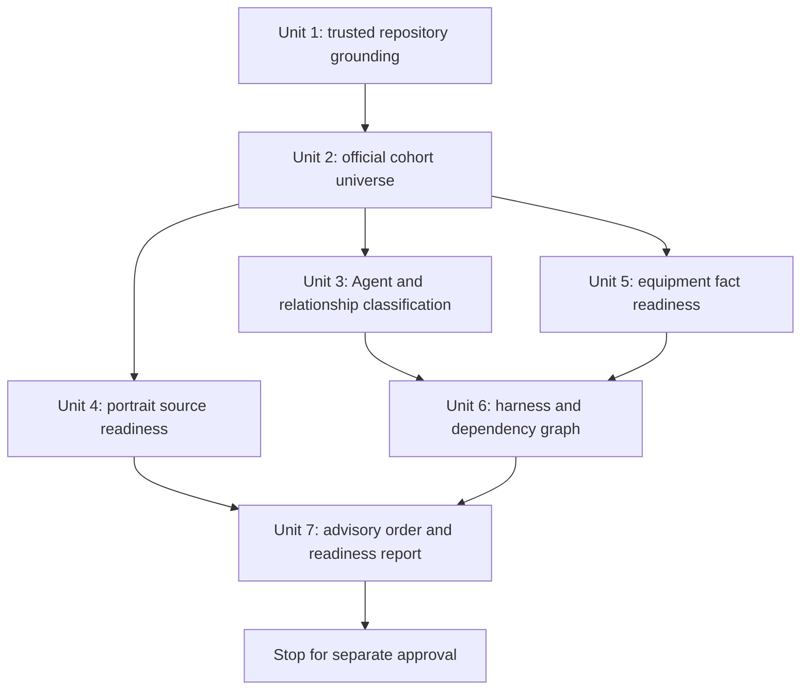

# Through-2.8 Anomaly Expansion Preflight Plan

## Objective

Execute one neutral, read-only preflight that establishes the complete
through-2.8 Anomaly expansion cohort, direct non-Anomaly enablers,
source and asset readiness, equipment-fact readiness, harness dependencies,
and a defensible rolling vertical order. Deliver one advisory report and stop
before writing the first vertical's requirements or changing product behavior.

This is a research execution plan for the approved preflight. It is not a
vertical implementation plan, a content-admission transaction, or permission
to mutate GitHub.

## Starting Gate

Do not begin Unit 1 until all of the following are true:

- the checkout is the intended trusted `main` worktree;
- `HEAD`, the local `main` ref, and `origin/main` resolve to the same exact
  commit, and ancestry confirms that identity;
- the index and worktree are clean;
- the approved origin requirements and this plan are present in that trusted
  revision; and
- no other active plan exists under `docs/plans/`.

If any condition fails, stop and report the observed refs and dirtiness. Do not
stash, reset, commit, pull, or otherwise repair the checkpoint as part of this
plan.

## Authority And Evidence Boundary

Use the five permanent owners first:

- `docs/setup-workbench-product-contract.md`: `SW-001` through `SW-016`, with
  particular use of `SW-003` through `SW-010`, `SW-012`, `SW-013`, and
  `SW-015` for finite investment, candidates, representatives, pools, party
  distribution, visible Results, and lifecycle.
- `docs/zzz-formula-mechanics.md`: `FM-001` through `FM-011` for current formula
  regions, base components, stat consequences, pressure, conversions,
  thresholds, caps, and excluded arithmetic.
- `docs/source-fact-boundary.md`: `SF-001` through `SF-004` for retention,
  qualifying outcomes, minimal current meaning, and reachable enabled states.
- `docs/zzz-game-vocabulary.md`: `GV-001` through `GV-009` for equipment
  eligibility, fixed Disc values, identities, stats, action scope, same-effect
  identity, and Anomaly terminology.
- `docs/workbench-ui-design-rules.md`: `UI-001` through `UI-004`, especially
  portrait acceptance, equipment presentation, and candidate information.

The approved origin requirements record the accepted local preflight outcome;
they do not become a sixth permanent authority. Current code and behavior tests
prove landed consumers and implementation behavior, not product meaning.
Plans, the suspended roadmap, milestone summaries, solutions, ACRs, audit
records, and the recovery postmortem retain their narrower governance or
workflow roles.

Do not inspect predecessor repositories, archived sessions, prior Codex tasks,
or prior controller reports. Do not treat this plan's hypotheses as evidence.

## Evidence Standard

For each external claim, retain its source URL, publication identity, date or
version scope, the exact claim supported, and a reliability classification:

1. official identity/version evidence;
2. official mechanic or equipment evidence;
3. high-quality secondary evidence corroborated by a primary source;
4. secondary-only evidence that cannot independently settle a product outcome;
5. conflicting or unresolved evidence.

Official release announcements and current official kit text take precedence
for release identity and current facts. A guide may help locate a setup pattern,
but its conclusion must be reconstructed from kit, formula, field-time,
teammate, and equipment evidence. Record misinformation or version mixing as a
reliability defect.

For an Agent or equipment item first introduced by Version 2.8, use its current
released facts, including later progression or balance revisions that change a
qualifying current outcome. Exclude Agents and equipment items first introduced
after Version 2.8 and any team or setup conclusion that depends on them.

## High-Level Flow

Units 3, 4, and 5 may proceed independently once Unit 2 fixes the eligible
universe. A blocker in one row does not prevent unrelated rows from being
researched, but it lowers the affected vertical or whole preflight readiness.

## Execution Units

### Unit 1 — Re-establish the trusted current consumer baseline

**Requirements:** R1, R4, R14, R17

**Read:**

- `AGENTS.md` in full;
- all five permanent owners in full;
- `docs/plans/README.md` and the approved origin requirements;
- the current applicable Grace, applied-party, calculation-module, lifecycle,
  and UI supporting requirements;
- the closed recovery postmortem and complete recovery audit index only to
  confirm harness/governance completion, not to derive product meaning;
- applicable workflow learnings under `docs/solutions/`; and
- current content, candidate, representative, preparation, state, provider,
  calculation, Setup, Result, portrait, and behavior-test consumers.

**Actions:**

- Reconstruct the landed roster and confirm whether Grace remains the only
  admitted Anomaly consumer.
- Trace a small repository-only sentinel set from permanent Rule ID through
  retained fact or relationship, exact consumer, candidate/representative
  consequence, preparation/direct-edit lifecycle, and visible Setup/Result.
- Include a nearest superficially similar case and a contrasting case for each
  sentinel. Cover at least Grace's Anomaly directions, pool-local complete
  package preparation at zero supplied substats, broad pressure on/off/reselect,
  and completeness-to-Empty-Result behavior.
- Record the literal current preparation nesting and current provider/
  calculation phase order. Flag documentation drift without correcting it.

**Output:** A private evidence ledger of current symbols and observable
boundaries used by later units. Do not persist an answer catalogue.

**Verification:** Every reusable-harness claim names one permanent owner and
one distinct current behavior-bearing consumer. Tests may establish the current
behavior but may not validate the semantic conclusion.

**Test expectation:** None — this unit changes no product behavior.

### Unit 2 — Establish and partition the complete official through-2.8 universe

**Requirements:** R2-R5

**Depends on:** Unit 1

**Actions:**

- Start from official release announcements for every release through Version
  2.8 rather than from the roadmap's named list.
- Use the complete identity universe as an ephemeral omission checklist, then
  place every Agent in exactly one category:
  - landed Anomaly baseline;
  - remaining eligible Anomaly consumer;
  - direct non-Anomaly enabler;
  - excluded, with a version or relationship reason.
- For each eligible Agent, record release version, current Attribute,
  Specialty, identity, and the current kit operation that could affect setup or
  Result classification.
- Correct version misconceptions explicitly. For example, verify Aria's
  Version 2.6 introduction independently rather than confusing a later rerun
  with her debut.
- Keep Velina, Remielle, and every other post-2.8 debut outside the cohort.

**Direct-enabler gate:** A non-Anomaly Agent enters the bounded cohort only when
the evidence establishes this complete chain:

`exact source/qualification -> eligible Anomaly recipient -> material
candidate, preparation, Setup, or Result consequence`.

Popularity, common-team frequency, chronology, or a guide roster is
insufficient.

**Output:** Detailed rows for all included Agents, disputed or
relationship-rejected near-boundary cases, and post-2.8 examples likely to
contaminate current guides. Keep unrelated through-2.8 rows ephemeral; report
their checklist count and omission method rather than preserving an exhaustive
negative catalogue.

**Verification:** Cross-check the partition against the official full release
universe so that an unnamed eligible Agent cannot disappear silently. Every
inclusion and detailed near-boundary exclusion must state its rule and evidence;
grouped unrelated rows must reconcile to the ephemeral checklist count.

**Test expectation:** None — this unit changes no product behavior.

### Unit 3 — Classify Agent-local formula and relationship demands

**Requirements:** R3-R8, R14-R17

**Depends on:** Unit 2

**Actions:**

- For each included Anomaly Agent, record one primary setup direction and zero
  or more materially dependency-bearing secondary mechanisms from:
  - standard anomaly damage and buildup;
  - threshold or cap dependent;
  - stat conversion dependent;
  - Disorder or cross-Attribute dependent;
  - off-field or reaction dependent; or
  - general-damage-led exception, only when current kit evidence supports it.
- Separate damage per Anomaly from buildup/application frequency and from
  Disorder or Agent-local mechanics.
- Use AP-first only as the approved rebuttable screening premise for a standard
  case. Do not infer an Agent's candidate membership or representative from
  the stat label. Record contrary conditions such as a stronger complete
  package, thresholds, conversions, unusable clauses, or a distinct formula
  direction.
- For every direct non-Anomaly enabler, trace source, recipient, trigger or qualification,
  delivery phase, exact consumer, and visible consequence. Identify any
  received-effect-derived outgoing dependency separately from ordinary
  provider delivery or final projection.
- Give each proposed vertical its nearest current consumer and a contrasting
  consumer. Grace-local outcomes remain local unless a permanent rule and a
  second current consumer establish reusable meaning.

**Output:** One row per included Agent containing primary direction, secondary
mechanisms, relationship chain, reusable mechanism, new semantic demand,
nearest current case, contrast, and blocker class.

**Verification:** Reject any row that relies only on a guide conclusion, Grace
analogy, Agent Specialty label, or roadmap placement.

**Test expectation:** None — tests are listed only as evidence of existing
mechanisms.

### Unit 4 — Inventory portrait source readiness without visual admission

**Requirements:** R9-R10, R17

**Depends on:** Unit 2

**Read:** Existing portrait files, `src/components/agentPortraits.ts`, current
party ordering, `UI-003`, and the existing portrait visual specification.

**Actions:**

- For every included Agent, record authoritative original source, normalized
  identity/name, local-file presence, and unresolved source or identity gaps.
- Inspect original assets only as needed to confirm that the file depicts the
  intended Agent and is technically usable as a future input.
- Do not import assets, create provenance metadata, assign `scale`, `headTopY`,
  or `faceX`, or open the local server/browser.
- Treat intended roster position as unresolved when no permanent owner or
  accepted bounded outcome determines it. Do not derive ordering from current
  append order, release order, alphabetic order, or the suspended roadmap.

**Output:** A readiness matrix with independent fields for authoritative source
located, local asset present, identity match verified, roster position settled,
and visual calibration deferred. Reserve `blocked` for disputed or unavailable
source/identity facts; a source-located but locally absent asset is not the same
state as missing provenance. No row may be called visually ready.

**Verification:** Every row that records both source and local-asset readiness
has an authoritative source and matching local identity. Every ordering
assertion names its owner; otherwise it is a product-decision blocker.

**Test expectation:** None — visual acceptance is deferred to the mutating
Agent vertical, where desktop/narrow and expanded/compact browser checks are
mandatory.

### Unit 5 — Inventory the finite through-2.8 equipment fact universe

**Requirements:** R11-R13, R16-R17

**Depends on:** Unit 2

**Read:** Current typed equipment facts, candidates, representatives, Setup
copy consumers, equipment behavior tests, and relevant dormant asset names.

**Actions:**

- Establish the finite set before fact inspection: every Anomaly-Specialty
  S-Rank and A-Rank W-Engine first introduced by Version 2.8, plus every Drive
  Disc set first introduced by Version 2.8. Exclude B-Rank W-Engines,
  post-2.8 equipment identities, and conclusions that depend on them. Use
  current released revisions of eligible items where `SF-001` applies.
- For every in-scope W-Engine, record exact identity, release version, rank,
  limited/non-limited pool status, Base ATK, advanced stat, refinement
  progression, every passive clause, trigger, holder/recipient or Attribute
  restriction, controllability, and unused-clause risk.
- For every in-scope Disc set, record 4-piece and 2-piece effects independently,
  trigger and condition, same-effect/exact-identity relationships, slot
  opportunity, and controllability.
- Record fixed Slot 4/5/6 main-stat supply and legal substat supply only where
  they affect a bounded comparison.
- Record the facts needed for a future vertical to judge the full pool and
  non-limited-S-rank pool independently, including supplier substitutability,
  fixed package supply, potentially unused clauses, slot cost,
  thresholds/caps/conversions, and the conservative finite effective-substat
  opportunity. Do not perform the competitive judgment here; never treat zero
  initialized counts as absent opportunity or eight counts as a cap.
- Distinguish a reusable source fact from candidate membership, representative
  selection, and Setup compression. The latter three remain unset for each
  future vertical.
- Treat dormant images or filenames only as discovery hints. They do not prove
  identity, fact values, pool membership, or competitive value.

**Output:** A finite fact-readiness ledger for the exact R11 universe, with
likely future consumer surfaces noted only for routing. It is not a candidate,
representative, ranking, or Setup-copy catalogue.

**Verification:** Each fact has source reliability and a proposed consumer.
Each equality or same-effect claim satisfies `GV-007`/`SF-003`. For each future
vertical, record that pool-specific whole-package inspection, a same-axis
comparator, a contrary condition, and finite opportunity remain mandatory
authoring work; do not select those comparators or decide their outcomes here.

**Test expectation:** None — no facts are added to production content in this
preflight.

### Unit 6 — Map harness reuse, gaps, and dependency edges

**Requirements:** R6-R8, R14-R17

**Depends on:** Units 3 and 5

**Actions:**

- Map each proposed vertical to the existing content-admission seams: identity,
  retained values, formula participation, mains/substats, W-Engines, Discs,
  candidates, two-pool representatives, portraits, provider context,
  preparation/state, Agent-local calculation, Setup, and Result.
- Mark each seam as:
  - directly reusable current mechanism;
  - Agent-local content/consumer work;
  - first new bounded semantic mechanism;
  - external-fact blocker;
  - product-decision or permanent-authority blocker; or
  - stale supporting-document blocker.
- Reconstruct the literal current preparation call order. For a proposed new
  pass, name only the affected existing lifecycle/provider boundary, the
  dependency that makes it new, the current contrast, and the vertical that
  must author it. Defer exact nesting, precedence, and pass design to that
  separately approved vertical.
- Distinguish ordinary local provider effects and final recipient projections
  from received-effect-derived outgoing effects. Flag the known stale exact
  two-pass supporting wording only for a vertical that would touch that phase
  surface; do not invent a solver or broader abstraction.
- Express sequencing first as edges:
  - `must precede` for semantic or relationship prerequisites;
  - `recommended before` for useful contrasts or reusable evidence;
  - `independent` where either order is safe; and
  - `blocked` where an unresolved decision prevents the vertical.
- Re-evaluate the basic and advanced roadmap hypotheses only after these edges
  exist. If one member of a proposed paired vertical is blocked, report a split
  only as an advisory option.

**Output:** A per-vertical harness-gap matrix and dependency graph. Each row
must also identify, without settling an Agent-local outcome:

- the exact source/relationship and proposed visible consumer boundary;
- the affected candidate-bearing input;
- whether full-pool and non-limited-pool authoring may diverge;
- party preparation and target-only rebuild consequences;
- pressure present/absent/reselected applicability;
- direct-edit, invalid-selection, and completeness/Empty-Result lifecycle; and
- the visible Setup/Result consequence.

Use `unsettled until vertical authoring` or a blocker classification where the
preflight cannot decide a field; do not omit it.

**Verification:** Every edge cites the exact source relationship or consumer
that creates it. Chronology, popularity, and shared asset presence cannot
create an edge.

**Test expectation:** None — future vertical plans will select shared mechanism
tests and representative user journeys according to their actual changes.

### Unit 7 — Produce the advisory cohort and ordering report, then stop

**Requirements:** R17-R18

**Depends on:** Units 4 and 6

**Actions:**

- Deliver one conversation report containing:
  - trusted checkpoint and repository-baseline result;
  - complete included cohort, detailed near-boundary exclusions, grouped
    post-2.8 contamination examples, and reconciled ephemeral-checklist counts;
  - source reliability and conflicts;
  - per-Agent formula/relationship classification;
  - portrait and equipment readiness;
  - nearest current consumer and contrast for each proposed vertical;
  - exact reusable harness seams and first-new mechanism risks;
  - per-vertical candidate-bearing, full/non-limited pool, preparation,
    target-rebuild, direct-edit, invalid-selection, and visible consequences,
    explicitly left unsettled where Agent-local authoring is required;
  - dependency edges followed by a recommended rolling order;
  - semantic, external-fact, supporting-document, product-decision, and
    permanent-authority blockers kept separate; and
  - a stage-qualified assessment of whether the preflight is complete and which
    verticals are ready only to enter bounded requirements discussion.
- Explain which independent verticals can enter bounded requirements discussion
  despite a localized blocker. No readiness label authorizes implementation or
  a vertical plan.
- Identify the smallest bounded questions that require product-owner discussion
  before the first vertical requirements are authored.

**Persistence boundary:** Keep the advisory report in conversation. No current
owner requires a durable cohort catalogue, source registry, readiness matrix,
or roadmap replacement. Persisting any settled outcome requires a separate
decision about its proper owner.

**Readiness rubric:** Apply the labels only to preflight completion and entry
into bounded requirements discussion, never to implementation authorization:

- `ready`: the cohort and dependency evidence is complete, and no blocker
  prevents the first recommended vertical from entering bounded requirements
  discussion;
- `conditionally ready`: the complete boundary is established, localized
  blockers remain, and at least one independent vertical can still enter
  bounded requirements discussion; and
- `not ready`: the cohort/version boundary or dependency order remains
  unresolved, or every viable first vertical is blocked from requirements
  discussion.

Also report each vertical's own discussion readiness separately so one
localized blocker cannot be mistaken for a cohort-wide implementation verdict.

**Stop condition:** Do not draft a vertical requirement, open a new vertical
plan, edit production/content/assets/tests, start a server, calibrate portraits,
stage, commit, push, open a PR, or mutate GitHub. Wait for separate advisory
approval.

**Verification:** Audit the final report against R1-R18. Every proposed order
has evidence-backed edges, every blocker has one class, and every readiness
claim distinguishes source availability from semantic and visual readiness.

**Test expectation:** None — the deliverable is read-only research.

## Requirements Traceability

| Requirement | Execution owner |
| --- | --- |
| R1 | Unit 1 |
| R2 | Unit 2 |
| R3-R5 | Units 2-3 |
| R6-R8 | Units 3 and 6 |
| R9-R10 | Unit 4 |
| R11-R13 | Unit 5 |
| R14-R16 | Units 1, 3, 5, and 6 |
| R17 | Units 1 and 3-7 |
| R18 | Unit 7 |

## System-Wide Impact

This plan changes no runtime system. Its read-only analysis must nevertheless
cover the whole future admission path so sequencing does not hide a shared
dependency:

`official/retained fact -> typed content -> candidates and pool-local
representatives -> preparation and state reconciliation -> provider phases and
Agent projector -> Setup/Result/portrait consumers`.

No data persistence, API, background job, caching, authentication, dependency,
build configuration, migration, or deployment surface is involved.

## Verification And Safety

- Record commands and source URLs used for evidence, but do not create generated
  repository artefacts.
- Use read-only Git inspection only. Do not fetch, pull, switch branches, or
  repair local state.
- Do not run product tests merely to manufacture confidence. Existing tests may
  be read as current behavior evidence; there is no changed behavior to test.
- Do not run a dev server or browser. No portrait metadata or UI is changed.
- Recheck `git status --short` at the end. The preflight itself must leave the
  checkout unchanged.
- When evidence cannot settle a meaning, classify the gap and stop dependent
  conclusions. Do not fill it with analogy, guide consensus, or test behavior.

## Risks And Controls

| Risk | Control |
| --- | --- |
| Dormant asset treated as admitted content or provenance | Require official source plus matching identity; defer calibration and admission. |
| Equipment inventory becomes a catalogue or universal recommendation | Require a cohort consumer; separate facts from Agent-local candidate, representative, and copy decisions. |
| Grace outcome becomes generic Anomaly policy | Require permanent owner plus current contrast; keep Grace-specific packages and AP-first screening bounded. |
| Post-2.8 content leaks into the cohort | Partition from official full release universe and record explicit exclusions. |
| Current guide mixes revisions or later teammates | Use eligible Agent's current facts but discard conclusions dependent on later-debut entities. |
| Roadmap or team popularity determines order | Derive dependency edges from exact relationships and current consumers first. |
| Zero substats are misread as no finite opportunity | Preserve fixed/future opportunity composition and the non-cap meaning of the conservative eight-count allowance. |
| A new calculation phase is hidden inside an Agent vertical | Classify received-effect-derived outgoing dependencies before sequencing and expose stale documentation. |
| Roster ordering is invented | Require a current owner or report a product-decision blocker. |
| Partial blocker freezes all research or is silently ignored | Continue independent rows; lower affected readiness and stop only dependent conclusions. |

## Rejected Alternatives

- **Begin with Anton and Rina immediately.** Rejected because the full official
  cohort, direct-enabler boundary, shared equipment facts, and dependency edges
  would remain unverified.
- **Prepare every Agent's complete content and copy in advance.** Rejected
  because it creates consumerless facts, candidate judgments, and a speculative
  catalogue.
- **Make the suspended roadmap current.** Rejected because it is a hypothesis,
  not authority or current evidence.
- **Create a generic Anomaly calculation framework first.** Rejected because
  the workbench retains only distinctions required by current bounded
  consumers and is not a simulator.
- **Batch-calibrate all portraits during preflight.** Rejected because source
  readiness is reusable while visual framing must be accepted in each Agent's
  actual desktop/narrow and expanded/compact surfaces.
- **Turn AP-first into permanent generic meaning here.** Rejected because the
  approved preflight permits it only as a rebuttable authoring aid; a permanent
  rule would require the `GOV-001` authority transaction.

## External Reference Seeds

- Official HoYoLAB Version 2.6 Update Announcement, including Aria's initial
  release identity: <https://www.hoyolab.com/article/43642066>
- User-supplied community calculation reference for independently checking
  Anomaly formula notation and numeric normalization; secondary evidence only:
  <https://docs.google.com/document/d/e/2PACX-1vSB_gaua-DY-JlsGt1-CpI5Ik3jiCeSmBfQKQdpx1dX2o0ZH9DJ0hbeWdIK05uUc_eyu4yLfHSt2AaD/pub>

These are starting references, not a complete evidence set and not product
authorities. Unit 2 must independently locate the official release universe,
and Units 3 and 5 must verify the exact current kit and equipment facts used by
their conclusions.

## Completion Contract

The plan is complete only when Unit 7's report satisfies R1-R18, records its
own possible error sources, confirms no repository mutation from execution,
and stops for advisory review. Completion does not certify that any new Agent
is ready for implementation, authorize the first vertical, or settle any
candidate, representative, Setup copy, portrait calibration, or permanent
authority change.
