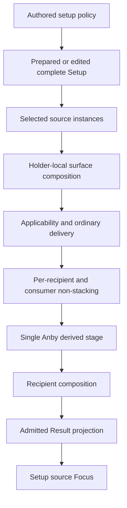
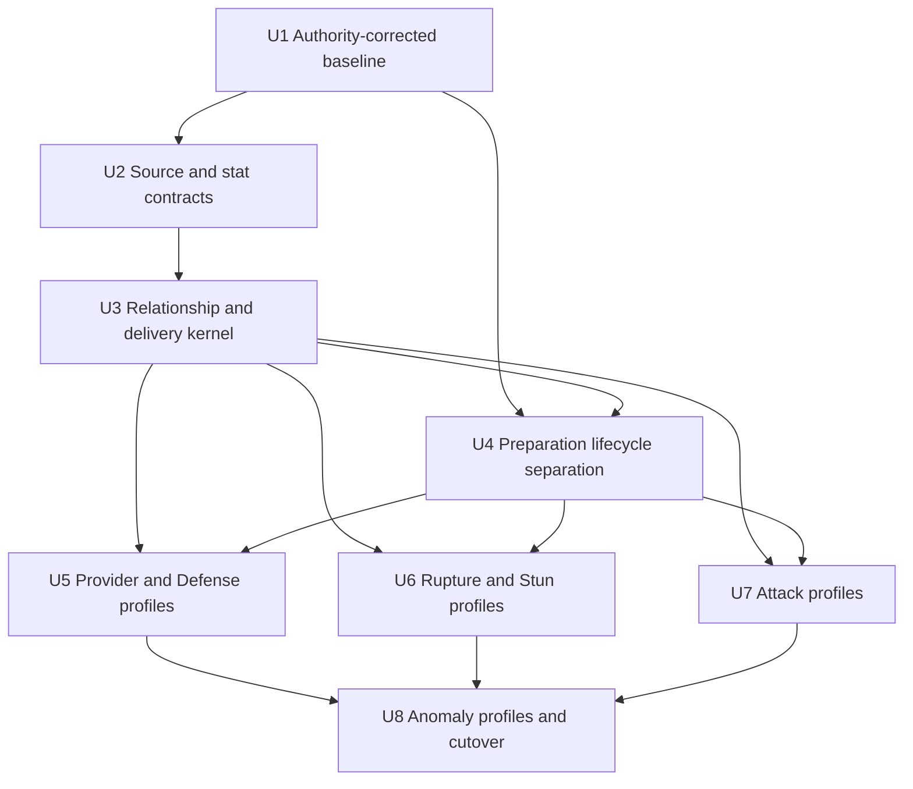
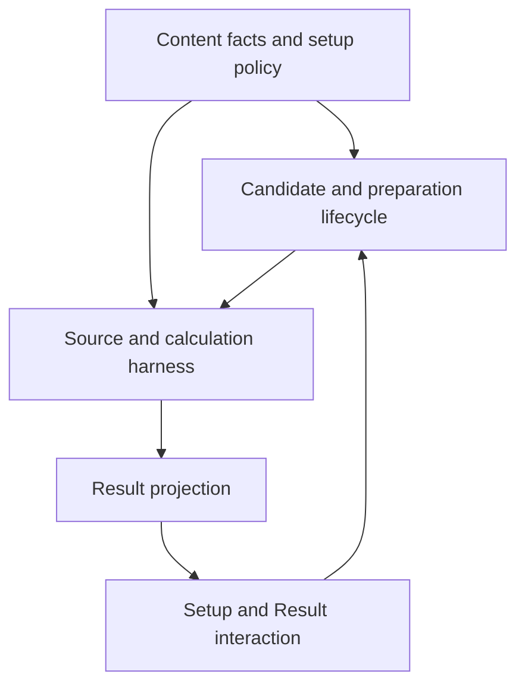

# Shared Source And Calculation Harness Refactor

## Summary

Replace the current Agent-dispatched calculation verticals with one typed source,
stat-composition, delivery, preparation, and Result harness. Build the common
mechanisms first, migrate all 41 current Agents as declarative content in bounded
cohorts, then switch the production entry point once and remove the superseded
runtime and catalogue-style tests.

---

## Problem Frame

The current workbench repeats shared stat, equipment, provider, Mindscape,
action, and projection meanings through Agent-local calculators and large
Agent-named test families. That shape makes ordinary content look like a new
mechanism and has also preserved subordinate formula and retention claims that
conflict with permanent authority.

---

## Requirements

- R1. Migrate all six current Specialty verticals—Attack, Rupture, Stun,
  Support, Defense, and Anomaly—and all 41 admitted Agents to the shared
  harness, with no completed legacy/new dual execution path.
- R2. Keep authored candidate, contextual, representative, Focus, and direction
  policy separate from retained Agent source definitions.
- R3. Treat Agent/Core, cumulative Mindscape tiers, W-Engines, Drive Discs,
  fixed and variable main stats, and supplied substat hits as independent source
  contributors to one downstream flow.
- R4. Use the five permanent authorities and independently supported current
  consumers as the migration baseline; correct conflicting subordinate
  requirements, code, and tests.
- R5. Own fixed main-stat values and legality once, including automatic completed
  Slot 1/2/3 inputs and editable authored Slot 4/5/6 choices.
- R6. Own each effective-substat hit value once and store only the supplied
  integer count; prepare at zero and retain the common 0-36 editing boundary.
- R7. Compose every stat on Initial, Combat, and Fully Enabled through common
  base, percentage, and flat regions without compounding Combat into Fully.
  Treat Energy Regen the same way and automatic recovery as a separate operation.
- R8. Keep calculation-only inputs such as base values, W-Engine Base ATK, and
  fixed Slot 1/2/3 inputs out of Result disclosure.
- R9. Support only the current bounded relationship meanings: stat contribution,
  continuous stat-derived relation, action modifier, gauge, replacement or
  complete operation, and provider delivery.
- R10. Evaluate retained basis scaling continuously and linearly. Add threshold
  or cap bounds only to the exact relationship that owns one; do not introduce a
  generic step, floor, clamp, callback, formula DSL, or dependency graph.
- R11. Preserve stable source definition and selected source-instance identity,
  including holder, trigger performer, recipient, formula consumer, action or
  Attribute applicability, and visible source-tone destination.
- R12. Read independent provider amounts from the holder's live local
  pre-delivery surface. Preserve only the bounded Anby: Soldier 0 post-delivery
  CRIT-DMG-to-Aftershock derivation and prevent feedback or another phase.
- R13. Add unrelated applicable effects and reconcile only explicit same-game-
  effect non-stacking identities per recipient and consumer, preserving equal
  winning origins in disclosure.
- R14. Project only admitted stat, action, operation, and gauge consumers. Show
  direct provider sources on recipients and their determining inputs on holders;
  no-consumer facts create no hidden state or generic row.
- R15. Preserve local competitive candidate and complete representative
  authoring; do not build a runtime catalogue, scorer, or optimizer.
- R16. Preserve the established authored/contextual candidate, selected-pressure,
  allocation, preparation, zero-count, and reconciliation dependencies.
- R17. Party Apply prepares all three, pool or Mindscape rebuild prepares one
  against two established holders, and direct edits prepare none. Invalid
  selections clear without fallback or history, and incomplete parties have no
  Result.
- R18. Retain only facts that change a current candidate, prepared or editable
  choice, condition, calculation, applicability, breakdown, or visible Result.
- R19. Preserve Yuzuha Slot 4 AP 92 as a local residual editable choice after
  ATK%, without base AP 93, AP equipment/substats, a personal AP Result, or final
  Disorder calculation.
- R20. Verify shared mechanisms and a small set of composed cross-vertical
  journeys, retaining Agent/item-specific regressions only for genuinely unique
  mechanisms or materially distinct visible failures.

**Origin actors:** A1 (workbench user), A2 (content author/controller), A3
(shared harness)

**Origin flows:** F1 (Apply and prepare a party), F2 (edit an applied setup), F3
(author or migrate a content unit)

**Origin acceptance examples:** AE1-AE10, including fractional linear scaling,
Mindscape source delivery and Focus, live provider recalculation, per-consumer
non-stacking, pressure lifecycle, party-versus-target preparation, Yuzuha's
residual Slot 4 choice, incomplete Result, ordinary content admission without an
Agent suite, and the single Anby derived phase.

---

## Scope Boundaries

- No runtime equipment ranking, package optimizer, farming model, or catalogue
  of all legal combinations.
- No final damage or Daze totals, rotation or uptime simulation, anomaly
  application-count model, or combat-state simulator.
- No arbitrary formula callbacks, expression DSL, general dependency graph,
  cycle solver, or generic post-delivery hook.
- No source archive, explanation payload, retained research trail, dormant
  no-consumer schema, or generic uncertainty model.
- No generalization of Yuzuha Slot 4 AP into a role, substat, equipment, or
  Result family.
- No compatibility bridge or permanently mixed old/new calculator dispatch.
- No Agent-by-Agent roster snapshots, value catalogues, or outcome-replication
  tests where a mechanism and representative journey establish the behavior.
- No unrelated UI or portrait redesign. Browser verification covers only source
  Focus and Setup/Result behavior affected by the harness.
- No tests whose purpose is to assess which Codex model performed a unit; model
  routing is validated through the same product gates as controller-authored
  work.

---

## Context & Research

### Relevant Code and Patterns

- `src/workbench/effects.ts` already carries source loci, selected setup inputs,
  effect applicability, recipient delivery, and equipment source helpers, but
  currently combines several responsibilities that need explicit boundaries.
- `src/workbench/calculation/composition.ts` already demonstrates surface-aware
  stat/action composition and equal-origin disclosure, and is the closest seam
  to extend into the common kernel.
- `src/workbench/provider-effects.ts` currently combines holder observation,
  party qualification, provider clauses, delivery, and candidate pressure behind
  two Agent switches; those responsibilities must be separated rather than moved
  together.
- `src/workbench/calculate.ts` is the atomic production cutover seam: it owns the
  41-way calculator dispatch, the current Anby derived phase, and shared Result
  postprocessors.
- `src/workbench/preparation.ts`, `src/workbench/candidates.ts`, and
  `src/workbench/state.ts` establish the current Party Apply, target-only rebuild,
  direct-edit, zero-count, and reconciliation lifecycle.
- `src/workbench/content/setup-options.ts`, `src/workbench/content/engines.ts`,
  `src/workbench/content/discs.ts`, and
  `src/workbench/content/representatives.ts` already own reusable fixed facts and
  local authored policy that the migration must preserve rather than optimize.
- `src/components/AgentSetup.tsx`, `src/components/ResultPanel.tsx`, and
  `src/components/sourceInteraction.ts` are the current Setup/Result source-Focus
  boundary.

### Institutional Learnings

- `docs/solutions/workflow-issues/prevent-secondary-requirements-from-validating-themselves-2026-08-12.md`
  requires independent owner/consumer support, complete-package opportunity
  analysis, zero-count versus finite opportunity separation, composed lifecycle
  coverage, and mechanism tests rather than Agent catalogues.
- `docs/solutions/workflow-issues/preserve-interaction-fidelity-in-ui-explorations-2026-08-05.md`
  requires semantic and interaction parity before visual judgment, including all
  existing values, actions, and states when source Focus wiring changes.

### External References

- None. Permanent authorities and current repository consumers fully determine
  this refactor; external patterns would not authorize product or formula
  meaning.

---

## Key Technical Decisions

| Decision | Chosen boundary | Reason |
| --- | --- | --- |
| Production migration | Build one testable profile evaluator and source profiles off the production entry, then make `calculateParty` adopt that same evaluator in one atomic cutover | Avoids a compatibility bridge while exercising the exact future runtime before cutover |
| Source ownership | Stable definitions plus selected runtime instances | Same definition on different holders or selections must remain independently focusable and disclosable |
| Agent content | Declarative source profiles plus separate authored setup policy | Removes formula branches without turning candidate policy into a runtime optimizer |
| Formula model | Typed stat surfaces and a bounded linear relationship vocabulary | Covers current consumers without callbacks, a DSL, or a general graph |
| Provider phases | Local pre-delivery evaluation, ordinary delivery, one named Anby derivation, recipient composition | Preserves the only supported dependency while ruling out feedback and speculative phases |
| Non-stacking | Exact identity after recipient and consumer applicability | Prevents global same-axis deduplication from suppressing unrelated or unreachable effects |
| Lifecycle | Preparation chooses; reconciliation only clears | Preserves Apply/target/direct-edit semantics and prevents fallback or edit-history restoration |
| Verification | Shared mechanism suites plus a few cross-vertical journeys | A different Agent name, Attribute, or threshold amount does not create a new mechanism |

### Execution Routing

| Work kind | Default route | Controller boundary |
| --- | --- | --- |
| Settled fact movement, declarative profile conversion, and duplicate-test deletion | `gpt-5.6-luna`, low or medium | Controller supplies exact owner, consumer, files, contrast, and acceptance before dispatch |
| Shared types, stat composition, delivery, and ordinary cohort integration | `gpt-5.6-terra`, medium; high only for measured complexity | Controller reviews every diff and runs shared gates before the next cohort |
| Authority correction, complex lifecycle/formula decisions, Anby phase, and final cutover | Controller or `gpt-5.6-sol` at high reasoning only where unresolved | These meanings are not delegated until settled; final integration remains controller-owned |

Use only one mutating worker in the shared checkout. Route each bounded unit
independently; success on a mechanical cohort does not lower the route for a
later formula, lifecycle, visual, or final-review unit.

---

## Open Questions

### Resolved During Planning

- Does the migration include Defense? Yes. The approved full-current-cohort
  scope includes Pan Yinhu, Ben, Caesar, and Zhao; their omission from the first
  R1 enumeration was corrected in the origin requirement.
- Is a general post-delivery provider phase needed? No. Preserve only Anby:
  Soldier 0's exact current derived relationship as a named bounded stage.
- Is literal `AP / 100` part of the current calculation scope? No. The current
  product has no literal final-damage consumer; remove secondary overclaim and
  require a future permanent-authority amendment before adding one.
- Does Yuzuha Slot 4 AP require retained base AP 93 or a personal AP Result? No.
  Candidate membership uses the shared Slot 4 value 92 and local opportunity
  policy; base AP 93 remains excluded.
- Are model-specific tests required? No. Tests verify product mechanisms and
  observable flows, while controller review verifies delegated work.

### Deferred to Implementation

- Exact grouping of declarative Agent source files may be adjusted within the
  planned cohort directory if a file becomes unreadably large. It must not
  recreate Agent calculator dispatch or mix setup policy into source facts.
- A current relationship that cannot fit the approved bounded vocabulary stops
  its cohort for controller review. Implementation must not fill the gap with a
  callback or a new generic relation by analogy.

---

## Output Structure

    src/workbench/
      content/
        agent-sources/
          provider-defense.ts
          rupture-stun.ts
          attack.ts
          anomaly.ts
        mindscapes.ts
        source-definitions.ts
        setup-policies.ts
      calculation/
        source-instance.ts
        stat-composer.ts
        relationships.ts
        delivery.ts
        profile-harness.ts
        derived/
          anby-soldier-0-aftershock.ts

This is a directional grouping. Existing `engines.ts`, `discs.ts`, setup option,
representative, action, result, and UI modules remain their current durable
owners where the plan does not explicitly move a responsibility.

---

## High-Level Technical Design

> *This flow is directional guidance for review, not implementation
> specification. Permanent authority and the origin requirements govern if the
> eventual implementation exposes a conflict.*

The stat composer receives calculation-only base inputs and selected source
instances categorized into base, percentage, and flat regions at their earliest
surface. Each surface is recomposed from its authoritative basis; display
rounding never feeds calculation. Relationships may emit stat atoms, scoped
action atoms, gauges, complete operations, or provider clauses. Delivery first
resolves holder, trigger, recipient, formula, Attribute, and action applicability;
only then may an exact non-stacking identity choose the highest reachable value.

Preparation remains a separate policy flow. Party Apply simultaneously authors
all three packages and resolves shared allocations; pool or Mindscape rebuild
authors only its target against the other two current holders; direct edits do
not invoke preparation. Effective candidates and selected pressure determine
which inputs remain legal, zero initialization supplies newly prepared finite
input keys, and reconciliation clears invalid selections without choosing a
replacement.

---

## Implementation Units

- U1. **Establish the authority-corrected baseline**

**Goal:** Close the already-identified subordinate overclaims and duplicated
policy tests before architectural migration so the new harness does not encode
known-wrong behavior.

**Requirements:** R4, R10, R18, R19, R20

**Dependencies:** None

**Files:**
- Modify: applicable current `docs/brainstorms/*-vertical-requirements.md`
- Modify: `src/workbench/calculation/agents/*.ts`
- Modify: `src/workbench/calculation/composition.ts`
- Modify: `src/workbench/effects.ts`
- Modify: `src/workbench/content/retained-values.ts`
- Modify: `src/workbench/content/types.ts`
- Modify: `src/workbench/preparation.ts`
- Modify: `src/components/AgentSetup.tsx`
- Test: `src/workbench/calculate.mechanics.test.ts`
- Test: `src/workbench/calculation/composition.test.ts`

**Approach:**
- Preserve the accepted continuous-linear corrections and remove integer-step
  presentation language from calculation behavior.
- Remove unsupported AP-normalization prose and unused retained values without
  denying AP's supported multiplicative formula region.
- Preserve Yuzuha Slot 4 AP 92 only as local authored candidate content and keep
  personal AP/Disorder projection absent.
- Delete Agent-named assertions that merely repeat the shared rule; retain or
  move only distinct mechanism and visible-failure coverage.

**Execution note:** Controller-owned semantic unit. Do not delegate authority
classification; settled mechanical edits within the unit may use Luna medium
after exact boundaries are supplied.

**Patterns to follow:**
- `docs/source-fact-boundary.md` consumer qualification.
- Existing shared action/composition tests that use synthetic or cross-vertical
  sources rather than freezing complete Agent outputs.

**Test scenarios:**
- Happy path: a retained per-basis relationship at a fractional basis delta
  contributes the matching fraction on its owned surface.
- Edge case: an Agent-local stack or resource determines a fully enabled effect
  but does not create a generic Result row for the local state.
- Integration: a selected legal main-stat input with no admitted aggregate may
  remain visible in Setup while Result stays limited to actual consumers.

**Verification:**
- No current calculator floors or integer-steps a relationship owned as
  continuous; no current subordinate requirement claims literal AP/100; no dead
  Yuzuha base AP remains; `git diff --check`, type, and focused shared tests are
  clean during execution.

---

- U2. **Introduce selected source instances and the shared stat composer**

**Goal:** Establish the calculation-only input, stable source definition,
selected source instance, fixed investment fact, and three-surface stat contracts
used by every later profile.

**Requirements:** R3, R5-R8, R11, R18

**Dependencies:** U1

**Files:**
- Create: `src/workbench/content/source-definitions.ts`
- Create: `src/workbench/content/mindscapes.ts`
- Create: `src/workbench/calculation/source-instance.ts`
- Create: `src/workbench/calculation/stat-composer.ts`
- Modify: `src/workbench/content/types.ts`
- Modify: `src/workbench/content/setup-options.ts`
- Modify: `src/workbench/content/engines.ts`
- Modify: `src/workbench/content/discs.ts`
- Modify: `src/workbench/content/retained-values.ts`
- Modify: `src/workbench/effects.ts`
- Test: `src/workbench/content/equipment-effects.test.ts`
- Test: `src/workbench/calculation/source-harness.test.ts`

**Approach:**
- Give fixed Slot 1/2/3 inputs, variable main-stat values, and effective-substat
  hit values one shared owner; selected setups store variable choices and counts.
- Model Mindscape tiers like other independently selected sources: the selected
  rank enables retained tiers at or below it, each with its own source locus.
- Carry holder slot and selected occurrence separately from stable source
  definition so equal sources on different holders never collapse by label.
- Recompose Initial, Combat, and Fully surfaces from calculation-only bases plus
  cumulative percentage and flat atoms. Keep automatic Energy recovery outside
  the stat aggregate.
- Keep Base ATK and fixed Slot 1/2/3 inputs available to calculation while
  suppressing their individual Result disclosure.

**Execution note:** The controller fixes the identity and surface contracts;
delegate settled fixed-fact relocation and declarative Mindscape conversion to
Luna medium. Use Terra medium for the composer and integration.

**Patterns to follow:**
- Existing source loci and equipment source helpers in `src/workbench/effects.ts`.
- Existing surface and breakdown structures in
  `src/workbench/calculation/composition.ts`.

**Test scenarios:**
- Happy path: fixed slots, an engine advanced stat, a variable main, and supplied
  percentage/flat hits produce the expected Initial/Combat/Fully progression.
- Edge case: the same source definition selected by two party holders yields two
  distinct instances and source-tone destinations.
- Edge case: Mindscape 4 enables retained tiers 1 through 4 but no higher tier.
- Integration: fixed inputs change a stat aggregate without individual Result
  source rows, while the selected variable main does receive a Setup/Result link
  when its aggregate is admitted.

**Verification:**
- One stat composer supports ATK, HP, DEF, Impact, Energy Regen, CRIT, AP, AM,
  and other admitted stats without per-stat calculation modes; fixed values and
  source identities have one owner and no label-derived identity.

---

- U3. **Build the bounded relationship, delivery, and projection kernel**

**Goal:** Evaluate every current shared relationship through typed continuous
composition, live holder observation, recipient-aware delivery, exact
non-stacking, the single Anby derivation, and admitted Result projection.

**Requirements:** R7, R9-R14, R20

**Dependencies:** U2

**Files:**
- Create: `src/workbench/calculation/relationships.ts`
- Create: `src/workbench/calculation/delivery.ts`
- Create: `src/workbench/calculation/profile-harness.ts`
- Create: `src/workbench/calculation/derived/anby-soldier-0-aftershock.ts`
- Modify: `src/workbench/calculation/composition.ts`
- Modify: `src/workbench/calculation/result.ts`
- Modify: `src/workbench/formula-policy.ts`
- Modify: `src/workbench/calculation/initial-atk.ts`
- Modify: `src/workbench/calculation/rupture.ts`
- Modify: `src/workbench/actions.ts`
- Modify: `src/workbench/effects.ts`
- Modify: `src/workbench/party-conditions.ts`
- Test: `src/workbench/calculation/source-harness.test.ts`
- Test: `src/workbench/calculation/composition.test.ts`
- Test: `src/workbench/calculate.mechanics.test.ts`

**Approach:**
- Define closed relation variants for stat atoms, continuous stat-derived atoms,
  scoped action atoms, gauges, complete operations/replacements, and providers.
- Resolve party conditions and holder eligibility before local evaluation;
  resolve recipient, formula, Attribute, and action applicability before
  non-stacking.
- Recalculate provider amounts from the current holder setup on every complete
  calculation and retain only the direct delivered source on recipient
  breakdowns.
- Expose one profile-driven evaluator that accepts complete workbench state and
  produces the existing Party Result concepts. Cohort tests call this exact
  future runtime; U8 connects `calculateParty` to it without adding an adapter or
  second evaluation path.
- Implement Anby's post-delivery read as one named adapter after independent
  delivery. It cannot feed its own basis or register another phase.
- Project a metric, action, operation, or gauge only when a current consumer is
  admitted; do not synthesize rows for source-local state.

**Execution note:** Terra high or controller-owned because formula regions,
phase ordering, non-stacking, and provenance interact. Do not delegate an
unsettled relation-kind decision.

**Patterns to follow:**
- Current composition/action hierarchy and equal-origin notation in
  `src/workbench/calculation/composition.ts`.
- Current exact Anby phase in `src/workbench/calculate.ts`, narrowed rather than
  generalized.

**Test scenarios:**
- Happy path: a live Initial-stat-derived provider changes after a direct holder
  edit and updates eligible recipients without preparation.
- Edge case: two equal explicit non-stacking winners apply once but preserve both
  origins; two unrelated same-axis atoms add.
- Edge case: two origins have different reach across two recipients and action
  consumers, so highest-only resolution and equal-origin disclosure are
  independently correct per recipient and consumer rather than globally.
- Edge case: an Attribute- or action-scoped clause reaches only the compatible
  consumer, without adding one test for every Attribute or Agent.
- Integration: Anby reads a 213% post-delivery Fully CRIT DMG basis, emits 74.55%
  to compatible Aftershock outcomes once, and remains slot/provider-order
  independent.
- Error path: an unrecognized relationship variant is rejected at the typed
  content boundary rather than evaluated through a fallback callback.

**Verification:**
- The kernel covers every approved relation kind with mechanism tests, the
  production-equivalent profile evaluator is executable before cutover, and no
  generic post-delivery registry, formula callback, global same-axis dedupe, or
  no-consumer Result path exists.

---

- U4. **Separate setup policy, candidate pressure, preparation, and reconciliation**

**Goal:** Remove the current responsibility cycle while preserving exact Party
Apply, target rebuild, direct-edit, zero-count, allocation, and incompleteness
semantics.

**Requirements:** R2, R15-R17, R20

**Dependencies:** U1, U3

**Files:**
- Create: `src/workbench/content/setup-policies.ts`
- Create: `src/workbench/candidate-context.ts`
- Modify: `src/workbench/candidates.ts`
- Modify: `src/workbench/preparation.ts`
- Modify: `src/workbench/state.ts`
- Modify: `src/workbench/provider-effects.ts`
- Modify: `src/workbench/content/setup-options.ts`
- Modify: `src/workbench/content/representatives.ts`
- Test: `src/workbench/preparation.test.ts`
- Test: `src/workbench/state.test.ts`

**Approach:**
- Keep base and contextual candidate references and pool representatives in local
  setup policy; obtain selected-input pressure from selected source instances and
  party relationships without invoking provider calculation.
- Move the complete current selected-pressure descriptor set into the
  candidate-context boundary before production preparation stops using
  `provider-effects.ts`. Later source profiles reference those stable definitions
  instead of redeclaring pressure meaning.
- Preserve accepted complete-package and finite-opportunity authoring as policy
  references. Migration does not rank arbitrary packages; a changed membership
  or representative still requires its separate authority-grounded authoring
  proof.
- Preserve the literal authored balance, Focus engine/King, competitive
  King/Astral, fallback, contextual Cissia, Astra/Pan, collision, and Moonlight
  dependency sequence through explicit preparation passes.
- Make Party Apply create simultaneous selections and holder snapshots at the
  established stage; make target rebuild consume the other two current holders;
  make direct edits bypass preparation.
- Initialize only the effective supplied-substat keys of the final prepared
  package at zero, then reconcile invalid required selections without fallback
  or edit-history restoration.
- Treat an initialized zero supplied-substat count as complete. Keep all-party
  Result empty only when a required setup selection or structurally required
  effective-substat key is missing; count bounds remain a separate edit rule.

**Execution note:** Terra high because composed lifecycle order is user-visible.
Once the controller freezes exact pass ownership, settled map movement may use
Luna medium.

**Patterns to follow:**
- Current `preparePartySelections` versus `prepareTargetSelection` distinction.
- Current reducer separation between preparation transitions, direct edits, and
  `reconcileEffectiveSelections` clearing.

**Test scenarios:**
- Happy path: Party Apply allocates competing equipment in authored order and
  prepares all three complete zero-count packages.
- Happy path: pool or Mindscape change prepares only the target against two
  established edited holders and recalculates all Results when complete.
- Edge case: pressure on clears an invalid selected main/disc/substat without
  fallback; pressure off restores membership but not selection or history;
  explicit reselection behaves as a direct edit.
- Edge case: a newly appearing effective substat starts at zero, while a removed
  key is discarded rather than restored later.
- Integration: a zero-count representative remains complete while its authored
  finite future opportunity still affects package policy rather than runtime
  scoring or prepared counts.
- Integration: an incomplete selection empties the whole Result and leaves an
  unaffected contrasting Sheer consumer's candidate set unchanged.

**Verification:**
- Candidate derivation no longer imports provider calculation, provider delivery
  no longer owns candidate pressure, all existing pressure definitions are
  present before the production preparation switch, and one composed suite
  proves preparation, zero initialization, reconciliation, and calculation
  precedence.

---

- U5. **Migrate provider-oriented Support and Defense source profiles**

**Goal:** Convert the first nine Agents to declarative source profiles and prove
that capped providers, holder/recipient differences, derived base stats, Focus,
operations, and residual action/Daze outputs use the new mechanisms.

**Requirements:** R1-R3, R8-R15, R18, R20

**Dependencies:** U3, U4

**Cohort:** Lucia, Astra Yao, Soukaku, Lucy, Nicole, Pan Yinhu, Ben, Caesar,
Zhao.

**Files:**
- Create: `src/workbench/content/agent-sources/provider-defense.ts`
- Modify: `src/workbench/content/mindscapes.ts`
- Modify: `src/workbench/content/setup-policies.ts`
- Modify: `src/workbench/content/retained-values.ts`
- Test: `src/workbench/calculation/source-harness.test.ts`
- Test: `src/workbench/calculate.flows.test.ts`

**Approach:**
- Move retained Core, Additional, Mindscape, equipment, action, provider, and
  gauge relationships into definitions using shared fact references.
- Keep capped Initial ATK/HP/DEF-derived amounts as linear relationships with an
  exact local cap, not special calculator modes.
- Preserve recipient distinctions such as Focus, all party, other party, and
  formula/action applicability without flattening provider ancestry.
- Leave each Agent's candidate and representative outcome in setup policy; do
  not copy equipment values into the profile.
- Keep the profiles off the production `calculateParty` entry point until U8.
  Exercise them through U3's exact profile evaluator rather than a cohort-local
  adapter.

**Execution note:** Meaning is settled after U1-U4. Delegate declarative
conversion to Luna medium one bounded cohort at a time; controller reviews each
source against owner, consumer, contrast, and visible consequence.

**Patterns to follow:**
- Shared capped metric composition and provider delivery from U3.
- Existing equipment fact tables and source-instance constructors from U2.

**Test scenarios:**
- Happy path: one capped holder-derived provider reaches a different recipient
  and Result source focus highlights the provider holder slot.
- Edge case: a provider's determining base inputs appear only on the holder,
  while the recipient sees the direct delivered clause once.
- Integration: a representative three-Agent party drawn from the migrated cohort
  covers stat, operation, Focus, and formula applicability through the exact
  profile evaluator without separate tests for all nine Agents.

**Verification:**
- All nine profiles execute through the future runtime, have reference integrity,
  and map every retained relation to a shared mechanism or an explicit no-Result
  calculation input; no new Agent-named calculator or test family is introduced.

---

- U6. **Migrate Rupture and Stun source profiles**

**Goal:** Convert fourteen Agents while proving common Sheer conversion,
Impact/Daze, action sub-output, threshold/gauge, provider, equipment condition,
and exact non-stacking behavior.

**Requirements:** R1-R3, R7-R15, R18, R20

**Dependencies:** U3, U4

**Cohort:** Yixuan, Yidhari, Manato, Banyue, Starlight Billy, Dialyn, Trigger,
Lycaon, Ju Fufu, Lighter, Pulchra, Qingyi, Koleda, Anby Demara.

**Files:**
- Create: `src/workbench/content/agent-sources/rupture-stun.ts`
- Modify: `src/workbench/content/mindscapes.ts`
- Modify: `src/workbench/content/setup-policies.ts`
- Modify: `src/workbench/content/retained-values.ts`
- Modify: `src/workbench/party-conditions.ts`
- Test: `src/workbench/calculation/source-harness.test.ts`
- Test: `src/workbench/calculate.flows.test.ts`

**Approach:**
- Express all five Rupture Agents through the shared Max HP/ATK-to-Sheer
  composition and action/result vocabulary rather than repeated calculators.
- Express all nine Stun Agents through shared Impact, Daze, action, provider,
  operation, and gauge relationships; Specialty and action damage remain
  independent meanings.
- Use the same source applicability model for Agent effects, W-Engine passives,
  and Disc 4-piece clauses. Different threshold numbers or Attributes populate
  data and do not create new evaluator branches or test suites.
- Preserve exact King and other non-stacking identities only where current game
  relationships own them.
- Keep profiles off the production entry point until U8.
  Exercise them together with U5 profiles through U3's exact evaluator.

**Execution note:** Use Terra medium because Sheer, Daze, action hierarchy, and
equipment applicability interact. Escalate only an unrepresentable relationship
to controller/high reasoning.

**Patterns to follow:**
- Existing shared Rupture helper and action hierarchy, replaced by U2/U3
  contracts where they overlap.
- U3 per-recipient/consumer non-stacking and typed gauges/operations.

**Test scenarios:**
- Happy path: three Rupture consumers recompose from their own current stats
  through one Sheer mechanism.
- Happy path: one Stun Agent contributes Daze at action level without the action
  redefining the Agent's primary formula role.
- Edge case: an active-field equipment passive does not apply during an
  off-field interval, while a compatible holder passive does.
- Edge case: two explicit King origins resolve highest/equal behavior per
  recipient, while a different-axis four-piece remains independent.
- Integration: one cumulative U5/U6 Rupture/Stun/provider party exercises a
  cross-cohort provider-recipient relationship, equipment, action, gauge, and
  source Focus without Agent-by-Agent output snapshots.

**Verification:**
- All fourteen profiles execute with U5 profiles through the future runtime and
  use shared stat, relation, equipment, action, and Result mechanisms; no
  threshold-, Attribute-, or local-state-specific evaluator is added by Agent
  name.

---

- U7. **Migrate Attack and action-heavy source profiles**

**Goal:** Convert all fourteen Attack Agents, including party-partner selection,
canonical action trees, selected pressure, target operations, and Anby's unique
derived consumer, without recreating an Attack dispatcher.

**Requirements:** R1-R4, R7-R18, R20

**Dependencies:** U3, U4

**Cohort:** Anby: Soldier 0, Seed, Cissia, Evelyn, Corin, Hugo, Ellen, Soldier
11, Zhu Yuan, Orphie & Magus, Asaba Harumasa, Nekomata, Billy Kid, Ye Shunguang.

**Files:**
- Create: `src/workbench/content/agent-sources/attack.ts`
- Modify: `src/workbench/content/mindscapes.ts`
- Modify: `src/workbench/content/setup-policies.ts`
- Modify: `src/workbench/content/retained-values.ts`
- Modify: `src/workbench/party-conditions.ts`
- Modify: `src/workbench/actions.ts`
- Test: `src/workbench/calculation/source-harness.test.ts`
- Test: `src/workbench/calculate.flows.test.ts`

**Approach:**
- Encode canonical parent/child action scopes and target operations through the
  shared action vocabulary, projecting only material differences from the
  nearest visible parent.
- Keep named bounded party relationships such as Vanguard selection and exact
  qualification as typed party facts, not arbitrary profile callbacks.
- Express selected broad pressure through the shared candidate-context path and
  its actual selected source instances.
- Bind Anby's source profile to the U3 named derived adapter; do not add a
  profile-level phase hook.
- Keep profiles off the production entry point until U8.
  Exercise them with required U5/U6 providers and recipients through U3's exact
  evaluator.

**Execution note:** Use Terra medium for ordinary declarative actions and high
for partner selection, target replacement, or Anby phase integration. The
controller owns any new semantic distinction and the final cohort review.

**Patterns to follow:**
- Existing canonical action identities and nearest-visible-parent projection.
- U3 named Anby adapter and U4 selected-pressure lifecycle.

**Test scenarios:**
- Happy path: common and child action modifiers project only changed canonical
  outcomes and preserve their direct selected sources.
- Edge case: selected partner resolution uses current Initial inputs and stable
  tie rules, then recalculates after a direct edit without preparation.
- Edge case: broad pressure affects only formula-compatible recipients and leaves
  a Sheer contrast unchanged.
- Integration: the Anby party journey proves ordinary provider delivery, one
  derived phase, scoped Aftershock delivery, and no feedback.

**Verification:**
- All fourteen Attack profiles execute through the future runtime with their
  required cross-cohort partners and map to shared relation kinds or named
  current party facts; no Agent calculator, generic action branch, or provider-
  phase extension is introduced.

---

- U8. **Migrate Anomaly-adjacent profiles, cut over production, and retire the legacy harness**

**Goal:** Convert the remaining four profiles, atomically connect all 41 Agents
to the new harness, delete superseded runtime branches and catalogue tests, and
verify the visible Setup-to-Result experience.

**Requirements:** R1-R20

**Dependencies:** U5, U6, U7

**Cohort:** Grace, Piper, Yuzuha, Burnice.

**Files:**
- Create: `src/workbench/content/agent-sources/anomaly.ts`
- Modify: `src/workbench/calculate.ts`
- Modify: `src/workbench/provider-effects.ts`
- Modify: `src/workbench/effects.ts`
- Modify: `src/workbench/content/mindscapes.ts`
- Modify: `src/workbench/content/setup-policies.ts`
- Delete: superseded `src/workbench/calculation/agents/*.ts`
- Delete or reduce: `src/workbench/calculate.policies.test.ts`
- Reduce: `src/workbench/calculate.flows.test.ts`
- Reduce: `src/workbench/calculate.mechanics.test.ts`
- Reduce: `src/workbench/preparation.test.ts`
- Reduce: `src/workbench/state.test.ts`
- Modify: `src/components/AgentSetup.tsx`
- Modify: `src/components/ResultPanel.tsx`
- Modify: `src/components/sourceInteraction.ts`
- Test: `src/workbench/calculation/source-harness.test.ts`
- Test: `src/workbench/content/reference-integrity.test.ts`
- Test: `src/workbench/calculate.flows.test.ts`
- Test: `src/components/AgentSetup.test.tsx`
- Test: `src/components/ResultPanel.test.tsx`

**Approach:**
- Express Grace, Piper, and Burnice through the shared ATK/AP/AM, Anomaly damage,
  buildup, action, provider, operation, and gauge mechanisms; migrate Yuzuha's
  capped ATK/AM provider relationships while keeping Slot 4 AP as setup-only
  local policy.
- Confirm that no current relationship needs literal AP/100 or a final anomaly-
  damage calculation before deleting the old modules.
- Replace the production Agent/provider switches with one profile-driven source
  evaluation and shared projection path only after all 41 profiles pass reference
  integrity and mechanism coverage. Route `calculateParty` through the already-
  exercised U3 evaluator and delete old branches in the same unit.
- Add a non-catalogue structural invariant that every `ADMITTED_AGENTS` entry
  resolves to exactly one source profile and one setup-policy record. It checks
  references and uniqueness, not values, rosters, or prepared outcomes.
- Classify every old Agent-named assertion as shared mechanism, retained small
  cross-vertical journey, genuinely unique regression, or deletion. Do not copy
  value catalogues into the new suite.
- Keep the assertion classification and shared-fact ownership/dead-field sweep
  as ephemeral execution audits, not repository catalogues. Before deletion,
  every removed test block identifies its surviving shared mechanism or why the
  old assertion encoded unsupported/duplicated behavior; before cutover, profiles
  contain no inline copies of shared equipment or investment values.
- Connect runtime source instances to existing Setup/Result Focus behavior,
  ensuring source replacement or re-preparation removes stale links atomically.

**Execution note:** Terra high for Anomaly formula/projection and production
cutover; controller owns the final deletion inventory, full diff review, and
visible integration. Settled duplicate-test deletion may use Luna medium only
after the controller records each surviving mechanism.

**Patterns to follow:**
- Shared formula participation and anomaly/buildup projection owned by permanent
  formula rules and U2/U3 contracts.
- Existing source tone and focus-return interaction, preserving UI structure.

**Test scenarios:**
- Happy path: AP, ATK, AM, buildup bonus, and automatic Energy operations occupy
  their correct independent regions and surfaces across a small Anomaly/provider
  journey.
- Edge case: Piper's internal Power remains invisible while its fully enabled
  Physical buildup effect projects; Yuzuha's selected Slot 4 AP remains Setup-
  visible without a personal AP Result.
- Edge case: incomplete equipment or main-stat selection empties all three
  Results after production cutover; a structurally missing required effective-
  substat key does the same, while an initialized zero count remains complete.
- Integration: pressure present, absent, reselected, invalid-clear, Party Apply,
  target rebuild, and direct edit all pass through the single new runtime with an
  unaffected contrasting consumer.
- Integration: keyboard focus and pointer hover on a Result source highlight its
  owning local Setup locus or, for a cross-holder contribution, the provider
  Agent slot without auto-expanding it. Source replacement, invalid clearing,
  and pool re-preparation remove stale highlighting.
- Integration: fixed calculation-only inputs and no-consumer sources remain
  undisclosed, while equal winning non-stacking origins remain readable in the
  direct numeric breakdown without recursively flattening provider ancestry.

**Verification:**
- No production imports, dispatch cases, provider switches, or tests depend on
  `src/workbench/calculation/agents/`; all 41 admitted Agents have source and
  setup-policy coverage; full behavior, type, build, and applicable visual gates
  pass. When UI wiring changes, record an explicit in-app Browser scenario at
  desktop and narrow widths covering local-locus and provider-slot tone linking,
  direct source replacement, invalid clearing, and stale-highlight removal;
  component wiring alone is insufficient.

---

## System-Wide Impact

- **Interaction graph:** Party/draft reducers, preparation, candidate selectors,
  selected equipment and Mindscape sources, provider delivery, Result projection,
  and source Focus all change ownership boundaries while retaining their visible
  behavior.
- **Error propagation:** Unsupported relation kinds fail at typed content
  authoring; incomplete selections return an empty party Result; invalid current
  choices are cleared by reconciliation without calculation fallback.
- **State lifecycle risks:** Reordering pressure, zero initialization, or
  reconciliation can restore stale edits, lose newly created finite input keys,
  or calculate an incomplete party. U4 owns the composed lifecycle proof.
- **API surface parity:** The React components continue to consume the existing
  Result concepts—metrics, actions, operations, gauges, and sources—even if
  internal source-instance types change. No external API or persistence schema
  is introduced.
- **Integration coverage:** Shared unit tests cannot alone prove Apply versus
  target rebuild, live provider edits, atomic source replacement, Anby phase
  ordering, and keyboard/pointer Focus. The retained cross-vertical journeys and
  browser checks cover these boundaries.
- **Unchanged invariants:** Three distinct applied Agents, one eligible Focus,
  two availability pools, deterministic complete representatives, direct edit
  ownership, empty incomplete Result, candidate competitiveness, and current UI
  information architecture remain unchanged.

---

## Alternative Approaches Considered

- **Continue adding helpers around Agent calculators:** Rejected because the
  Agent switches would remain the ownership boundary and ordinary content would
  continue to replicate shared formula and tests.
- **Introduce a generic formula DSL or dependency graph:** Rejected because the
  current relation set is bounded and only one exact post-delivery dependency is
  supported. General evaluation would add speculative capability and cycle risk.
- **Run old and new calculators together for parity comparison:** Rejected because
  current implementation is not authority and a compatibility bridge would
  preserve duplicated behavior. The plan uses isolated mechanism verification
  and one atomic production cutover.
- **Rewrite all 41 profiles and lifecycle code in one undivided unit:** Rejected
  because source identity, formula, preparation, and content errors would be
  inseparable. Cohorts share a kernel but retain bounded review and rollback
  points before cutover.
- **Keep one comprehensive Agent snapshot suite:** Rejected because it validates
  content catalogues rather than shared principles and makes every future Agent
  appear mechanically unique.

---

## Success Metrics

- All 41 admitted Agents calculate through the single shared source/profile
  entry path, and no superseded Agent calculation/provider dispatch remains.
- Shared stat, linear relation, provider, non-stack, action, operation, gauge,
  completeness, preparation, and Focus mechanisms each have one primary test
  home plus only necessary integration journeys.
- Agent-named tests remain only for Anby's bounded derived phase or another
  demonstrably unique mechanism/visible failure; different values, thresholds,
  Attributes, or Agent names alone do not qualify.
- Adding an ordinary future Agent requires retained facts, setup policy, and
  declarative bounded relationships—not a calculator, provider switch, or new
  test family.
- Fixed values and retained facts have qualifying current consumers, while
  calculation-only inputs remain undisclosed and no-consumer values are absent.
- Party Apply, target rebuild, direct edit, invalid clearing, incompleteness, and
  source Focus remain visibly correct across representative specialties.

---

## Risks & Dependencies

| Risk | Likelihood | Impact | Mitigation |
| --- | --- | --- | --- |
| Declarative profiles reproduce wrong current behavior | Medium | High | U1 fixes authority conflicts first; each profile traces owner, consumer, contrast, and visible consequence rather than snapshot parity |
| A general abstraction hides an unsupported relationship | Medium | High | Closed relation vocabulary; stop the cohort on an unrepresentable meaning instead of adding callbacks or a DSL |
| Temporary dual runtime becomes permanent | Low | High | Keep profiles/kernel off the production entry until U8; cut over once and delete old dispatch in the same unit |
| Preparation pass order drifts during separation | Medium | High | U4 preserves explicit stages and composed on/off/reselect plus Party/target/direct-edit journeys |
| Source provenance collapses equal holders or stale selections | Medium | High | Stable definition plus selected holder occurrence; source replacement and pool reprepare integration coverage |
| Test deletion removes a genuinely unique failure | Medium | Medium | Classify assertions by mechanism before deletion and retain only unique relation/visible-failure cases with controller review |
| Cohort files become new monoliths | Medium | Medium | Split declarative data only for readability, while retaining one relation interpreter and no Agent dispatch |
| UI wiring changes without visual interaction proof | Low | Medium | Component behavior tests plus in-app Browser checks at desktop and narrow widths when source destinations change |

---

## Documentation / Operational Notes

- Keep permanent meaning in the five authorities and bounded outcomes in the
  approved origin requirement; do not add an implementation answer catalogue.
- Correct affected secondary requirements in place when U1 or a migration cohort
  finds current prose that contradicts an owner.
- Update `docs/plans/README.md` with one compact completed milestone only after
  implementation and verification. Retain this plan through its checkpoint
  commit before later lifecycle removal.
- No database, network, deployment, dependency-installation, or production data
  migration is involved.
- Final execution uses the repository's shared behavior/type/build gates and
  in-app Browser only where visible source interaction changed. Portrait
  calibration is not in scope.

---

## Sources & References

- **Origin document:** [docs/brainstorms/2026-08-21-shared-source-calculation-harness-requirements.md](../brainstorms/2026-08-21-shared-source-calculation-harness-requirements.md)
- **Permanent authorities:** [docs/setup-workbench-product-contract.md](../setup-workbench-product-contract.md), [docs/zzz-formula-mechanics.md](../zzz-formula-mechanics.md), [docs/source-fact-boundary.md](../source-fact-boundary.md), [docs/zzz-game-vocabulary.md](../zzz-game-vocabulary.md), [docs/workbench-ui-design-rules.md](../workbench-ui-design-rules.md)
- **Plan lifecycle:** [docs/plans/README.md](README.md)
- Related code: `src/workbench/calculate.ts`,
  `src/workbench/provider-effects.ts`, `src/workbench/effects.ts`,
  `src/workbench/calculation/composition.ts`, `src/workbench/preparation.ts`,
  `src/workbench/candidates.ts`, `src/workbench/state.ts`,
  `src/components/AgentSetup.tsx`, `src/components/ResultPanel.tsx`
- Relevant learnings:
  `docs/solutions/workflow-issues/prevent-secondary-requirements-from-validating-themselves-2026-08-12.md`,
  `docs/solutions/workflow-issues/preserve-interaction-fidelity-in-ui-explorations-2026-08-05.md`
