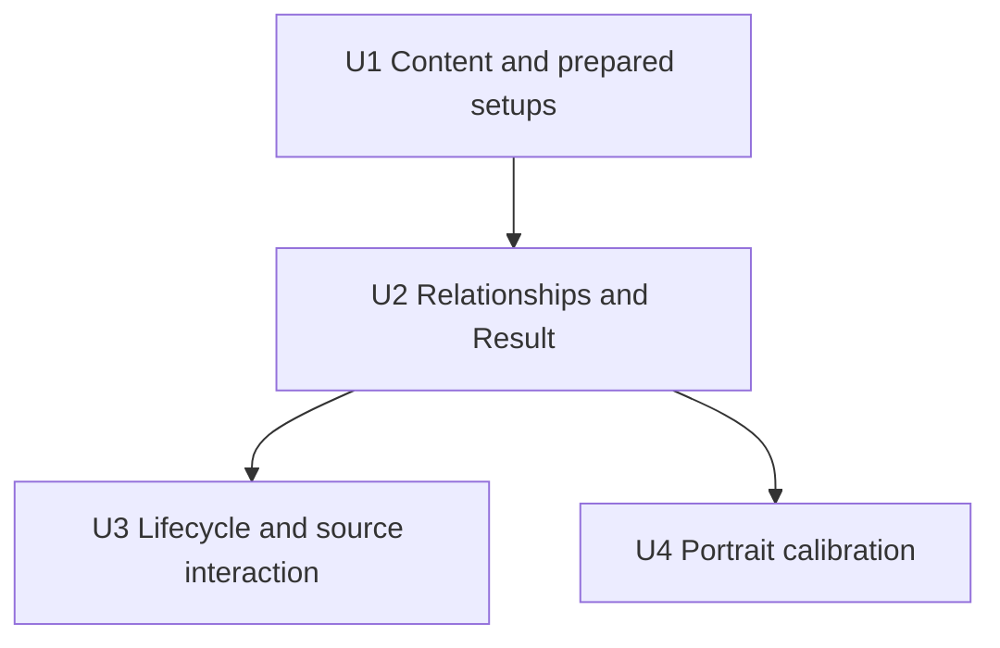

# feat: Add Yanagi and Alice anomaly setups

## Summary

Extend the existing shared Agent content, Anomaly relationship harness,
preparation lifecycle, source interaction, and portrait surfaces for Yanagi and
Alice. Keep every Polarity-related meaning in existing stat, provider,
operation, action, and Fully Enabled condition primitives; introduce no
Polarity-specific calculation layer.

---

## Problem Frame

The workbench already owns the reusable setup-to-Result mechanisms needed by
both Agents, but neither identity, competitive setup, retained relationship, or
visible projection is connected to those mechanisms. The implementation must
add those consumers without copying equipment facts, treating source prose as
final damage, or regressing party preparation and source interaction.

---

## Requirements

- R1-R4. Admit Yanagi's identity, local Electric/stance/Core relationships,
  Disorder provider operation, and retained Mindscape outcomes.
- R5-R8. Author Yanagi's pool candidates, complete representatives, Disc/main/
  substat directions, Timeweaver threshold, and pre-PEN pressure behavior.
- R9-R13. Admit Alice's identity, Physical buildup, maximum Disorder operation,
  one-way AM-to-AP relationship, and exact Mindscape recipient/action scopes.
- R14-R17. Author Alice's pool candidates, complete representatives, and Disc/
  main/substat directions.
- R18-R20. Reuse the one-pass relationship and preparation pipelines, preserve
  incomplete Result, and keep selected/candidate accessible summaries and
  source hover/focus destinations coherent through replacement.
- R21. Calibrate both original portraits across desktop/narrow and expanded/
  compact destinations.

**Origin flows:** F1 (prepared Yanagi or Alice), F2 (Polarity-related Result)

**Origin acceptance examples:** AE1-AE8

---

## Scope Boundaries

- Do not calculate final anomaly damage, buildup progress, anomaly history,
  duration averages, resources, rotations, or uptime.
- Do not retain raw Polarity, Polarized Assault, Physical DoT, or Alice M6
  extra-hit coefficients.
- Do not create a Polarity abstraction, reaction registry, new delivery
  condition schema, second derived-delivery pass, Agent calculator, or runtime
  candidate scorer or rejected-item catalogue.
- Keep Freedom Blues as a competitive Setup-only direction; its shared
  Attribute-scoped Result correction remains deferred until the complete
  Anomaly damage/buildup track closes.
- Do not admit later Anomaly Agents, Miyabi, Anton, or Rina in this unit.
- Do not add Agent-catalogue tests or freeze researched source values merely
  because the two identities are new.

### Deferred to Follow-Up Work

- Correct Freedom Blues' shared Attribute-scoped Result projection when the
  Anomaly damage/buildup track closes.
- Continue the remaining through-2.8 Anomaly damage/buildup Agents, then Miyabi,
  then the separate Anton/Rina Shock-state general-damage closure.

---

## Context & Research

### Relevant Code and Patterns

- `src/workbench/content/types.ts`, `agents.ts`, `setup-options.ts`,
  `engines.ts`, `discs.ts`, `representatives.ts`, and `setup-policies.ts` own
  identity, candidate membership, pool representatives, and prepared pressure.
- `src/workbench/content/retained-values.ts` owns retained Agent values and
  source labels; W-Engine and Drive Disc values remain in their equipment
  owners.
- `src/workbench/content/agent-sources/anomaly.ts` already projects Grace,
  Piper, Yuzuha, Burnice, and Jane through common stat, provider, operation,
  action, equipment, and gauge relationships.
- `src/workbench/calculation/profile-harness.ts` evaluates local linear
  relationships before ordinary provider delivery. Alice can therefore use the
  generic one-way linear relationship without entering a named derived pass.
- `src/workbench/state.ts`, `preparation.ts`, and `candidates.ts` already own
  Party Apply, target-only rebuild, pressure, zero-count initialization,
  reconciliation, and incomplete selection.
- `src/App.tsx`, `src/components/sourceInteraction.ts`, `AgentSetup`, and
  `ResultPanel` own source tone and accessible Setup/Result interaction.
- `src/components/agentPortraits.ts` and
  `tests/visual/workbench-portraits.spec.ts` own portrait metadata and visual
  coverage.

### Institutional Learnings

- `docs/solutions/workflow-issues/prevent-secondary-requirements-from-validating-themselves-2026-08-12.md`:
  trace each local outcome through current consumers and test shared mechanisms,
  not Agent catalogues or copied equipment values.
- `docs/solutions/workflow-issues/preserve-interaction-fidelity-in-ui-explorations-2026-08-05.md`:
  preserve selected/candidate, hover/focus, expanded/compact, and responsive
  interaction states before judging visual geometry.

### External References

- Current Yanagi and Alice kit/build records were checked against Prydwen and
  the current nanoka game-data snapshot while authoring the origin requirement.
  These sources inform the local content outcome but are not copied into tests.

---

## Key Technical Decisions

- Extend existing typed content tables and the Anomaly profile switch. A new
  Agent registry or Polarity layer would add structure without a distinct
  current consumer.
- Model Yanagi's Core and Alice's maximum Core effect as separate Disorder
  operations. They share the canonical Disorder target but retain independent
  sources and operation identities.
- Model Alice's excess-AM conversion as one local generic linear relationship
  over selected Fully Enabled AM. It runs before provider delivery and cannot
  feed AP back into AM.
- Model Alice M2 as two effects: an unconditional all-party Assault action
  modifier for anomaly recipients, and a Disorder action modifier whose
  Physical-anomaly enemy state is a source-local Fully Enabled qualifier. Do
  not use recipient Attribute filtering; a non-Physical Anomaly Agent can
  trigger the qualifying Disorder.
- Reset active source interaction when the selected source tree changes. This
  is a shared UI coherence fix required by the new replacement/rebuild flow,
  not an Agent-specific source system.

---

## Open Questions

### Resolved During Planning

- **Does Alice M2 require a new target-condition schema?** No. The workbench's
  Fully Enabled surface intentionally assumes a reachable enemy state; the
  existing canonical action plus source detail preserves the visible condition
  without misclassifying recipient Attribute.
- **Does Yanagi still prepare Freedom over Phaethon's Melody?** Yes. The
  complete Chaos/Freedom package supplies 341 AP at zero counts and reaches the
  Timeweaver threshold in four AP hits; Phaethon supplies 11.84 additional AM
  but leaves 311 AP and needs the full bounded eight-hit opportunity. Phaethon
  remains a candidate; Freedom remains the deterministic first choice.

### Deferred to Implementation

- **Exact portrait triples:** determine `scale`, `headTopY`, and `faceX` only by
  comparing the original assets in the live desktop/narrow and expanded/
  compact destinations.

---

## Implementation Units

- U1. **Connect identities, candidates, and prepared packages**

**Goal:** Add both Agents to every existing content owner needed for legal,
complete, pool-specific prepared Setup without copying W-Engine or Disc facts.
U1 is staged together with U2 and the pair lands as one calculation-capable
admission; adding an identity to `ADMITTED_AGENTS` is not an independently green
or committable intermediate state.

**Requirements:** R1, R5-R9, R14-R17; F1; AE3-AE4

**Dependencies:** None

**Files:**
- Modify: `src/workbench/content/types.ts`
- Modify: `src/workbench/content/agents.ts`
- Modify: `src/workbench/content/setup-options.ts`
- Modify: `src/workbench/content/engines.ts`
- Modify: `src/workbench/content/discs.ts`
- Modify: `src/workbench/content/representatives.ts`
- Modify: `src/workbench/content/setup-policies.ts`
- Modify: `src/workbench/content/retained-values.ts`
- Test: `src/workbench/lifecycle.test.ts`

**Approach:**
- Add typed identity, Specialty/Attribute/faction/Focus metadata, formula
  participation, legal main stats, effective substats, and operating interval.
- Extend only Agent-to-equipment membership and prepared identity tables; leave
  all numeric equipment clauses in current W-Engine and Disc fact owners.
- Author full and non-limited representatives exactly as the origin requires,
  including different legal 4-piece/2-piece identities and zero supplied
  substats.
- Reuse broad pre-PEN replacement policy for Slot 5 and Puffer-only identity
  pressure. Preserve Yanagi's Freedom and Alice's Phaethon 2-piece directions;
  do not add Agent-specific preparation branches.

**Patterns to follow:**
- Grace, Burnice, and Jane content entries in the same files.
- `SAME_EFFECT_TWO_PIECE_RELATIONSHIPS` for Chaos/Freedom substitution.

**Test scenarios:**
- Happy path: generic content/reference sweeps can enumerate and calculate both
  Agent setups in full and non-limited pools without dangling identities.
- Happy path: Party Apply prepares Yanagi as
  Timeweaver/Chaos/Freedom/AP/PEN/AM and Alice as
  Practiced/Fanged/Phaethon/AP/PEN/AM with all offered substats at zero.
- Edge case: non-limited preparation selects Weeping for Yanagi and Fusion for
  Alice while retaining the same complete Disc/main-stat packages.
- Edge case: Chaos/Freedom exact same-effect substitution never selects the same
  Disc identity in both piece roles.

**Verification:**
- Complete this verification only with U2: every admitted candidate and
  representative then resolves through existing typed calculation consumers,
  and no equipment value appears in an Agent-local table.

---

- U2. **Project Yanagi and Alice through the shared Anomaly harness**

**Goal:** Complete the atomic U1/U2 admission by adding retained local
relationships, provider delivery, operations, action scopes, equipment
applicability, and gauges without a new calculation stage.

**Requirements:** R2-R4, R10-R13, R18, R20; F2; AE1-AE2, AE5

**Dependencies:** U1

**Files:**
- Modify: `src/workbench/content/agent-sources/anomaly.ts`
- Test: `src/workbench/calculation/profile-harness.test.ts`
- Test: `src/workbench/calculate.integration.test.ts`

**Approach:**
- Add base observations, source labels, action scope trees, metrics, and
  relationship branches inside the existing Anomaly profile.
- Extend current equipment applicability only where the retained package is
  usable: Practiced Physical damage for Alice, Yanagi Timeweaver threshold,
  and deferred Freedom Result exclusion for both.
- Use generic local `linear` for Alice's selected AM-to-AP relationship before
  ordinary provider delivery. Do not use or expand Jane's named derived pass.
- Deliver Yanagi's +250 Disorder coefficient operation to compatible Anomaly
  recipients on `DISORDER_TARGET`; keep Alice's local +180 operation distinct.
- Represent Alice M2 Assault and Disorder scopes independently. Preserve the
  Physical-anomaly enemy condition as source detail on Fully Enabled Disorder,
  never as a recipient Attribute predicate.

**Patterns to follow:**
- Grace Timeweaver post-delivery gauge, Yuzuha M6 provider operation, Jane
  Assault action projection, Burnice enemy-context DEF-region delivery, and the
  generic linear relationship evaluator.

**Test scenarios:**
- Covers AE1. Yanagi M0 Timeweaver shows 341/375 with no Disorder bonus; four AP
  counts show 377 and activate it; eight counts show 413 and keep it active; M1
  at zero counts shows 421 and activates it.
- Covers AE2. With Alice as Focus, Yanagi's +250 provider operation reaches her
  Disorder outcome while Alice's own +180 operation remains a separate source.
- Happy path: qualified full Alice composes 255.96 AM then 395.536 AP once;
  qualified non-limited Alice composes 195.96 AM then 374.536 AP once.
- Edge case: removing the Anomaly/Support qualifier removes only derived AP;
  selected AM and Alice's local Core/equipment effects remain.
- Covers AE5. At M2, a Physical Anomaly recipient receives Assault and Disorder
  modifiers, Yanagi receives the qualifying Disorder modifier without an
  incorrect recipient-Attribute filter, and a general-damage-only contrast
  receives neither anomaly action. The Assault source has no enemy-state detail;
  only the Disorder source retains the Physical-anomaly Fully Enabled detail.
- Edge case: M1 enemy DEF Reduction reaches only formula-compatible recipients;
  M4 Physical RES Ignore and enhanced-Basic buildup remain correctly scoped.
- Error guard: no raw Polarity percentage, Physical DoT, Blade Etiquette,
  remaining-duration input, Polarized Assault coefficient, or Alice M6 extra
  hit enters Result.

**Verification:**
- `evaluateProfileParty` produces the required stats, modifiers, operations,
  action rows, gauges, and breakdown sources with no named Yanagi/Alice
  calculator or second delivery pass.

---

- U3. **Verify composed lifecycle and source interaction**

**Goal:** Prove preparation and direct-edit precedence end to end and keep
accessible source meaning coherent when candidate or selected source trees
change.

**Requirements:** R18-R20; F1-F2; AE3-AE6, AE8

**Dependencies:** U1, U2

**Files:**
- Modify if needed: `src/App.tsx`
- Test: `src/workbench/lifecycle.test.ts`
- Test: `src/workbench/calculate.integration.test.ts`
- Test: `src/App.integration.test.tsx`
- Test if a generic projection gap is found: `src/components/ResultPanel.test.tsx`

**Approach:**
- Keep state/preparation code unchanged unless a shared mechanism defect is
  demonstrated; extend representative cross-vertical flows instead of adding
  Agent-specific reducers.
- Treat target-only rebuild and global reconciliation separately: established
  holders keep edited identities/counts unless the changed shared context makes
  one independently invalid.
- Clear pointer/focus source tone when selected source identities, candidate
  context, completeness, or target preparation changes. Reuse existing source
  interaction callbacks and tones.
- Assert equivalent accessible compressed summaries on both selected and
  candidate W-Engine and Drive Disc surfaces.

**Patterns to follow:**
- Existing selected-pressure present/absent/reselected lifecycle tests.
- Existing App selected/candidate equipment summary and source-connection
  tests.

**Test scenarios:**
- Covers AE3-AE4. Broad pre-PEN pressure prepares Electric/Physical DMG and
  removes incompatible PEN/Puffer choices; pressure removal restores
  membership but not the cleared selection or edit history.
- Edge case: after manual reselection, reapplying pressure clears the invalid
  choice again without fallback; surviving effective-substat counts remain and
  newly effective counts initialize to zero.
- Integration: Party Apply rebuilds all three packages, while pool/Mindscape
  target rebuild uses the other two established holders and does not reprepare
  their still-valid edits.
- Integration: an invalidated required choice keeps the complete party Result
  empty after reconciliation, and a valid manual reselection restores Result.
- Edge case: qualified → unqualified → qualified Party Apply removes and
  restores Alice's derived AP exactly once without stale AM or provider state.
- Covers AE8. Pointer and keyboard focus connect Yanagi provider, Alice derived
  AP, and equipment sources to Setup; direct replacement, candidate change,
  incomplete Result, and target rebuild clear stale tones.
- Accessibility: selected and unselected candidate W-Engine and Drive Disc
  controls expose equivalent compressed package descriptions.
- Contrast: one current non-Anomaly consumer preserves its preparation,
  calculation, and source-link behavior.

**Verification:**
- The shared composed flows pass without an Agent-local lifecycle branch, stale
  source tone, hidden fallback, history restoration, or partially calculated
  party.

---

- U4. **Calibrate original portraits and close visible verification**

**Goal:** Wire and visually calibrate both original assets in every current
portrait destination.

**Requirements:** R21; AE7

**Dependencies:** U2

**Files:**
- Modify: `src/components/agentPortraits.ts`
- Modify: `tests/visual/workbench-portraits.spec.ts`
- Test: `src/App.integration.test.tsx`

**Approach:**
- Inspect each 2048×2048 original before choosing one shared metadata triple per
  Agent.
- Use the existing portrait component and object-position mechanism; do not
  create destination-specific values or edit the raster assets.
- Compare the live app at desktop and one narrow viewport with each Agent both
  expanded and compact, including adjacent compact party context.

**Patterns to follow:**
- Existing calibrated portrait metadata and visual-spec viewport loop.

**Test scenarios:**
- Covers AE7. Yanagi and Alice each render their readable name and balanced face
  plus connected body in desktop/narrow expanded and compact states.
- Visual edge cases: Yanagi's sword and Alice's wide hair/staff do not cause
  control collision, unacceptable clipping, or horizontal overflow.
- DOM guard: both identities resolve to original assets and one metadata triple;
  visual acceptance still requires live browser comparison.

**Verification:**
- Original-asset inspection and browser evidence confirm both Agents across all
  required destinations, with no metadata-only closure.

---

## System-Wide Impact

- **Interaction graph:** typed content feeds candidate preparation; selected
  sources feed local composition and provider delivery; Result breakdowns feed
  Setup source tone; portrait metadata feeds Party and Result destinations.
- **Error propagation:** invalid content references fail shared sweeps; invalid
  selected identities reconcile to incomplete state; incomplete state prevents
  all party calculation.
- **State lifecycle risks:** target rebuild must not reprepare established
  holders, pressure must not restore edit history, and source tone must not
  outlive its selected source tree.
- **API surface parity:** no external API, persistence, migration, or exported
  contract changes; `AgentId` and shared content records expand internally.
- **Integration coverage:** one party flow must traverse content preparation,
  pressure, zero initialization, relationship delivery, projection, source
  interaction, and incomplete Result rather than proving each in isolation.
- **Unchanged invariants:** equipment values remain equipment-owned; Freedom
  Result remains deferred; existing Agent calculations and non-Anomaly setup
  behavior remain unchanged.

---

## Risks & Dependencies

| Risk | Mitigation |
|------|------------|
| Alice M2 is incorrectly filtered by recipient Attribute | Use canonical Disorder action plus source-local Fully Enabled condition and test a non-Physical Anomaly recipient. |
| Alice AP conversion is placed in a named post-delivery branch | Use generic local linear evaluation and assert selected AM composes before one AP emission. |
| Yanagi threshold arithmetic omits one selected Disc 2-piece | Verify complete Chaos/Freedom values at zero, four hits, eight hits, and M1. |
| New content duplicates equipment clauses or Agent tests | Extend equipment membership and shared invariant/integration tests only. |
| Direct replacement leaves a stale source highlight | Key source-tone reset to the selected/candidate source tree and test pointer plus keyboard states. |
| Portrait metadata passes DOM tests but fails visually | Require original inspection and in-app browser comparison before closure. |

---

## Documentation / Operational Notes

- After implementation verification, mark this plan completed, add a compact
  Yanagi/Alice milestone to `docs/plans/README.md`, and preserve the detailed
  plan body through the checkpoint commit before later removal.
- No dependency installation, migration, feature flag, or rollout action is
  required.

---

## Sources & References

- **Origin document:** [docs/brainstorms/2026-08-23-yanagi-alice-anomaly-expansion-requirements.md](../brainstorms/2026-08-23-yanagi-alice-anomaly-expansion-requirements.md)
- Permanent owners: `docs/source-fact-boundary.md`,
  `docs/zzz-game-vocabulary.md`, `docs/zzz-formula-mechanics.md`,
  `docs/setup-workbench-product-contract.md`, and
  `docs/workbench-ui-design-rules.md`
- Shared Anomaly profile: `src/workbench/content/agent-sources/anomaly.ts`
- Shared calculation harness: `src/workbench/calculation/profile-harness.ts`
- Shared lifecycle: `src/workbench/preparation.ts`, `src/workbench/state.ts`
- Current Alice kit wording: https://zzz.nanoka.cc and
  https://www.prydwen.gg/zenless/characters/alice
- Current Yanagi kit/build context:
  https://www.prydwen.gg/zenless/characters/yanagi
