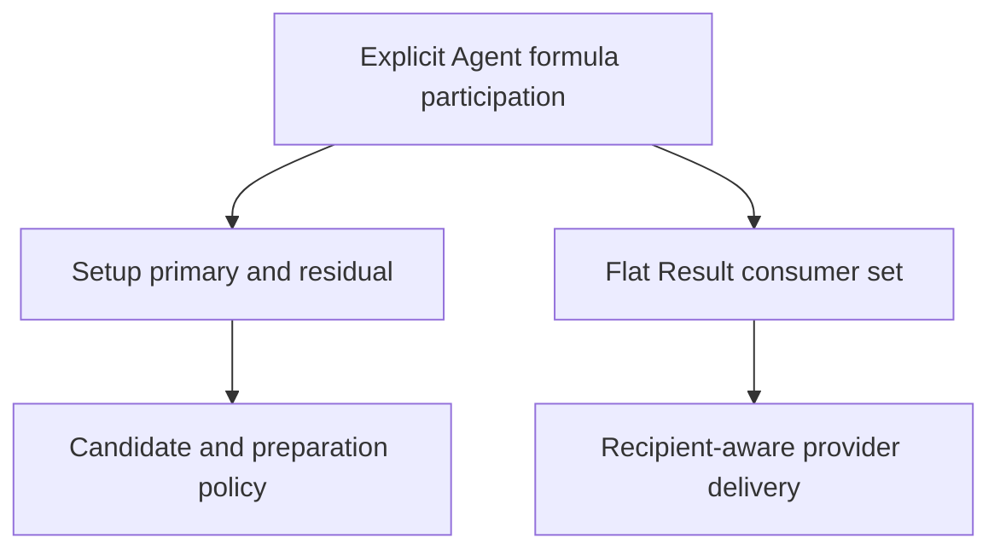

# refactor: Separate Setup and Result formula participation

## Summary

Replace the overloaded Agent formula-participation map with one explicit
carrier whose Setup and Result relations are authored separately, then cut
every current policy and delivery consumer over without a compatibility path.
The implementation preserves existing Setup choices while correcting Cissia's
Setup premise and independently correcting formula-scoped Result delivery for
the current entries whose old flattened Setup union was too broad or too
narrow. Qingyi, Grace, Pan Yinhu, and Astra retain the required contrasts.

---

## Problem Frame

One current map supplies both setup investment policy and recipient-aware
Result delivery even though those consumers answer different questions. That
coupling lets a local action outcome look like a setup investment axis and lets
inbound provider scope appear capable of authoring a recipient's Result
participation. R21 and R22 settle the semantic boundary; this plan performs the
smallest atomic production cutover needed to represent it.

---

## Requirements

- R21. Independently author Setup primary/residual formula participation and a
  flat Result recipient-consumer set, with no fallback or inference between
  them. Candidate and preparation policy consumes only Setup; provider delivery
  uses Result only for formula-scoped modifier and operation applicability.
  Direct stat delivery continues to use the recipient's independently admitted
  stat projector and does not require formula-family membership. (see origin:
  `docs/brainstorms/2026-08-21-shared-source-calculation-harness-requirements.md`)
- R22. Keep setup roles limited to damage contributor, daze contributor, and
  buffer, but add no role metadata when no current shared consumer queries it.
  Specialty, one action, provider scope, or equipment pressure cannot create a
  role. (see origin: `docs/brainstorms/2026-08-21-shared-source-calculation-harness-requirements.md`)
- Preserve Cissia as a general-damage contributor and Electric buffer. Corrode
  Bone remains a Result-only Daze action and creates neither a daze-contributor
  role nor Impact/Daze setup investment. (see origin:
  `docs/brainstorms/2026-08-09-seed-cissia-astra-vertical-requirements.md` R2)
- Preserve Qingyi's primary Daze Setup participation plus residual general
  damage for the admitted variable-main-stat exception, while both families
  remain admitted Result consumers.
- Preserve Grace's anomaly-damage and anomaly-buildup participation in both
  relations as the unchanged same-set contrast.
- Correct the current overloaded-map outcomes established by the bounded
  migration audit: remove Setup-only residual Result membership from Dialyn,
  Ju Fufu, Pulchra, Koleda, Anby, and Pan Yinhu; add Result-only general-damage
  membership for Piper and Jane's admitted action outcomes. Preserve the old
  ordered union only for every independently verified unaffected entry.

**Origin actors:** A1 (workbench user), A2 (content author/controller), A3
(shared harness)

**Origin flows:** F2 (edit an applied setup), F3 (author or migrate a content
unit)

**Origin acceptance examples:** AE13 (Cissia/Qingyi split), AE14 (Grace and
ordinary-damage contrast)

---

## Scope Boundaries

- Do not reopen the completed R1-R20 shared-harness migration.
- Do not change W-Engine, Drive Disc, main-stat, substat, candidate, contextual
  pressure, representative, Focus, allocation, or lifecycle policy.
- Do not add an Agent role catalogue, setup-driving inventory, local-outcome
  map, runtime participation derivation, compatibility alias, or fallback from
  Result participation to Setup participation.
- Do not derive participation from Specialty, Attribute attacks, inbound
  providers, selected equipment, current Result values, or current UI rows.
- Do not add a synthetic production Agent or participation case. Pan Yinhu's
  nonempty Setup and empty Result relations, and Cissia's Result-only Daze,
  already prove both forbidden fallback directions.
- Do not change Setup or Result information architecture, source interaction,
  styling, portraits, or visual baselines.
- Do not begin the next Anomaly Agent expansion in this unit.

---

## Context & Research

### Relevant Code and Patterns

- `src/workbench/content/setup-options.ts` owns the current complete Agent
  participation map and is the correct single content carrier to replace.
- `src/workbench/formula-policy.ts`, `src/workbench/candidate-context.ts`, and
  `src/workbench/preparation.ts` establish the existing Setup-only policy path:
  primary plus residual for broad DEF-region pressure, and primary alone for
  focused preparation decisions.
- `src/workbench/calculation/profile-harness.ts` currently flattens the Setup
  relation into recipient contexts; `src/workbench/calculation/delivery.ts`
  applies source-authored formula scope to those recipient contexts while
  independently preserving direct stat delivery when the recipient projects
  that stat.
- `src/workbench/content/agent-sources/attack.ts` independently projects
  Cissia's Corrode Bone Daze action. `src/workbench/content/agent-sources/rupture-stun.ts`
  independently projects Qingyi's damage and Daze actions.
  `src/workbench/content/agent-sources/anomaly.ts` independently projects
  Grace's anomaly-damage and anomaly-buildup outcomes.
- The bounded entry audit identified three asymmetric classes that the old map
  cannot express: Cissia/Piper/Jane have admitted Result-only action families;
  Dialyn/Ju Fufu/Pulchra/Koleda/Anby/Pan Yinhu have Setup-only residual
  families; and Qingyi/Grace/ordinary damage contributors preserve overlapping
  Setup and Result families.
- `src/workbench/formula-policy.test.ts` is the shared policy-test home.
  `src/workbench/calculation/profile-harness.test.ts` is the shared recipient
  and delivery-test home. `src/workbench/calculate.integration.test.ts` holds a
  small cross-vertical Result journey set.

### Institutional Learnings

- `docs/solutions/workflow-issues/prevent-secondary-requirements-from-validating-themselves-2026-08-12.md`
  requires permanent-owner and current-consumer derivation before tests, one
  nearest case plus a contrast, and shared mechanism coverage instead of
  Agent catalogues. The approved R21/R22 review supplies that upstream proof;
  Cissia, Qingyi, Grace, and Astra bound the implementation verification.
- UI exploration guidance is not active because no UI or interaction surface
  changes in this plan.

### External References

- None. The repository has direct, current patterns for every affected layer;
  external framework research would not resolve a product or architectural
  question here.

---

## Key Technical Decisions

| Decision | Chosen boundary | Rejected alternative and reason |
| --- | --- | --- |
| Participation carrier | Keep one Agent-keyed carrier with separate `setup` and `result` relations | Two parallel Agent maps duplicate the same identity boundary and make atomic review harder |
| Formula-family type | Use one neutral formula-family type across setup policy, source scope, and recipient delivery | Retaining a Setup-named type or compatibility alias preserves the semantic overload |
| Result authoring | Store an explicit flat ordered set for every Agent | Runtime derivation from profile metrics/actions, Specialty, providers, or UI rows reverses SW-001 dependency order |
| Entry migration | Independently preserve or correct each flat Result set from its admitted local calculation, action/target, or formula-owned parent Result consumer; keep the proof ephemeral and persist only the settled carrier | Copying the old Setup union would let the overloaded implementation validate itself; persisting an outcome catalogue would duplicate local requirements |
| Roles | Add no production role carrier | No current shared consumer queries a complete role assignment; a catalogue would fail SF-001 |
| Verification | Use cross-vertical shared policy, delivery, and one visible Result sentinel | Per-Agent snapshots would reproduce content outcomes rather than test the new boundary |

---

## Open Questions

### Resolved During Planning

- Must Setup and Result use separate top-level catalogues? No. One co-located
  carrier preserves atomic Agent coverage while keeping the two relations
  independently named and consumed.
- Must role metadata be introduced to implement R22? No. The current shared
  consumers do not query Agent setup roles, so the correct implementation is
  to avoid adding a carrier and to remove the false Cissia Daze premise from
  Setup participation.
- How are Result sets migrated? An ephemeral current-entry audit established
  each set before implementation. The only old-union differences are removals
  for Dialyn, Ju Fufu, Pulchra, Koleda, Anby, and Pan Yinhu; additions for Piper
  and Jane; and Cissia's Setup-only correction while her Result stays general
  plus Daze. All other verified entries preserve their order.
- How is formula scope different from direct stat delivery? Formula-scoped
  modifiers and operations consume the flat Result set. A formula-scoped stat
  still reaches a recipient that independently projects that stat; Astra's ATK
  is the retained empty-formula contrast.

### Deferred to Implementation

- Exact local interface and selector names may change if the implementation
  finds a clearer neutral name, provided there is one carrier, no compatibility
  alias, and every consumer has an explicit Setup or Result path.

---

## High-Level Technical Design

> *This illustrates the intended approach and is directional guidance for
> review, not implementation specification. The implementing agent should
> treat it as context, not code to reproduce.*

Neither branch may read or reconstruct the other.

---

## Implementation Units

- U1. **Cut over the participation carrier and all production consumers**

**Goal:** Replace the overloaded schema and constant in one breaking migration,
populate every admitted Agent, and route Setup and Result consumers to their
independent relations.

**Requirements:** R21, R22, AE13, AE14

**Dependencies:** None

**Files:**

- Modify: `src/workbench/content/types.ts`
- Modify: `src/workbench/content/setup-options.ts`
- Modify: `src/workbench/formula-policy.ts`
- Modify: `src/workbench/candidate-context.ts`
- Modify: `src/workbench/calculation/relationships.ts`
- Modify: `src/workbench/calculation/delivery.ts`
- Modify: `src/workbench/calculation/profile-harness.ts`
- Modify: `src/workbench/content/agent-sources/anomaly.ts`
- Test: `src/workbench/formula-policy.test.ts`
- Test: `src/workbench/calculation/profile-harness.test.ts`

**Approach:**

- Rename the formula-family type to a neutral shared name and introduce no old-
  name alias.
- Replace the old Setup-only carrier shape with one explicit Agent entry that
  contains Setup primary/residual participation and flat Result participation.
- Populate every `AgentId` in the same change. Cissia receives the approved
  asymmetric sets; Piper and Jane add action-local general damage; Dialyn,
  Ju Fufu, Pulchra, Koleda, Anby, and Pan Yinhu omit unsupported Setup-only
  residual families; Qingyi and Grace encode the overlapping contrasts; every
  other independently verified Result set preserves its existing order.
- Keep formula classification and special general/anomaly metric overlap
  unchanged. Only the origin of recipient formulas changes.
- Route broad candidate pressure and focused preparation helpers through Setup
  fields. Route recipient contexts and formula-scoped modifier/operation
  delivery through Result fields. Preserve the independent stat-projector
  exception for stat effects. Do not provide a default, fallback, or runtime
  union.
- Do not introduce role metadata. R22 is enforced by the corrected authored
  Setup premise and by retaining the absence of an unconsumed catalogue.

**Patterns to follow:**

- Exhaustive `Record<AgentId, ...>` ownership in
  `src/workbench/content/setup-options.ts`.
- Explicit consumer-specific selectors in `src/workbench/formula-policy.ts`.
- Source-scope matching in `src/workbench/calculation/delivery.ts`.

**Test scenarios:**

- Happy path: Cissia's Setup relation contains only general damage while her
  Result relation contains general damage and Daze buildup.
- Contrast: Qingyi keeps primary Daze plus residual general damage for Setup
  and both families for Result; Setup primary-only helpers do not start treating
  her as a CRIT/general-damage primary.
- Contrast: Grace contains anomaly damage and anomaly buildup in both relations
  and retains the existing general/anomaly shared-region applicability.
- Reverse contrast: Pan Yinhu keeps residual Setup Daze but an empty Result set,
  so a formula-scoped Daze modifier or operation cannot fall back to Setup.
- Direct-stat contrast: Astra's empty formula set does not block a scoped ATK
  effect because her Result independently projects ATK.
- Integration: a Daze-scoped provider can reach Cissia's admitted Result
  consumer even though Daze is absent from her Setup relation.
- Integration: Piper and Jane can receive applicable general-damage action
  modifiers without acquiring a general-damage Setup direction.

**Verification:** Every old carrier/type reference is gone, TypeScript requires
both relations for every Agent, setup policy still consumes primary/residual
with its established distinction, formula-scoped modifier/operation delivery
consumes only the flat Result set, and direct stat delivery still follows the
independent stat projector.

---

- U2. **Prove the visible boundary without an Agent catalogue**

**Goal:** Add the minimum cross-layer regression that proves the new relation
split preserves the qualifying visible action and existing composed flows.

**Requirements:** R21, R22, AE13, AE14; Cissia R2

**Dependencies:** U1

**Files:**

- Modify: `src/workbench/formula-policy.test.ts`
- Modify: `src/workbench/calculation/profile-harness.test.ts`
- Modify: `src/workbench/calculate.integration.test.ts`

**Approach:**

- Keep sentinel assertions grouped by the shared participation mechanism, not
  by Agent vertical.
- Use Cissia to prove Result-only Daze survives; Pan Yinhu to prove a nonempty
  Setup relation cannot backfill an empty Result set; Qingyi to prove Setup
  residual remains different from primary; Grace to prove the split does not
  force artificial differences; Piper/Jane to prove action-local Result
  families do not create Setup policy; and Astra to preserve direct stat
  delivery without formula membership.
- Extend one existing cross-vertical journey to confirm Cissia's Corrode Bone
  Daze action remains visible while her setup policy no longer claims Daze
  investment. Do not snapshot exact candidate rosters or retained values.
- Rely on the existing shared lifecycle suite for Party Apply, target rebuild,
  direct edit, pressure clearing, and incomplete Result behavior because this
  change introduces no lifecycle stage or ordering change.

**Patterns to follow:**

- Synthetic shared-source delivery tests in
  `src/workbench/calculation/profile-harness.test.ts`.
- Small representative user journeys in
  `src/workbench/calculate.integration.test.ts`.

**Test scenarios:**

- Covers AE13. A complete Cissia party still projects Corrode Bone Daze as an
  action outcome after the Setup relation drops Daze participation.
- Covers AE13. Qingyi policy assertions distinguish Setup primary/residual from
  the flat Result set without adding an Agent role assertion.
- Covers AE14. Grace preserves identical Setup and Result formula families.
- Error boundary: an all-party Daze-scoped modifier aimed at Pan produces no
  generic Result row because Pan has no independent Result formula consumer,
  despite residual Setup Daze.
- Stat boundary: a formula-scoped ATK provider aimed at Astra still contributes
  to her admitted ATK row without creating a Result formula family.
- Regression: the existing representative party matrix remains calculable and
  no candidate, representative, or selected-input lifecycle expectation is
  changed to make the new tests pass.

**Verification:** Shared mechanism coverage fails if a consumer reads the wrong
relation, while no new test freezes an exhaustive Agent roster, candidate list,
or source-value catalogue.

---

## System-Wide Impact

- **Interaction graph:** Static content feeds Setup policy and formula-scoped
  Result delivery through two explicit branches; direct stat projection remains
  an independent delivery path. Neither UI nor state reducers change.
- **Error propagation:** Exhaustive TypeScript records make a missing Agent or
  relation a compile-time failure. Runtime fallback is intentionally absent.
- **State lifecycle risks:** No state shape or transition changes. Party Apply,
  target-only rebuild, direct edit, reconciliation, and completeness retain
  their existing tests and ordering.
- **API surface parity:** The internal exported content facade exposes the new
  neutral type and carrier; every old internal import must move in the same
  change.
- **Integration coverage:** Shared delivery coverage plus one visible Cissia
  action journey proves the cross-layer cutover. Existing lifecycle and
  representative-matrix coverage supplies the unaffected contrast.
- **Unchanged invariants:** Candidate membership, representatives, selected
  equipment, source relationships, formula math, Result presentation, source
  interaction, and UI layout do not change.

---

## Risks & Dependencies

| Risk | Mitigation |
| --- | --- |
| A stale consumer continues reading Setup for delivery | Remove the old carrier/type names and require explicit branch access everywhere |
| The migration silently preserves or invents another Agent family | Use the completed ephemeral current-entry proof, encode only its settled sets, and cover one removal, one addition, one same-set case, and both fallback directions |
| Cissia loses visible Corrode Bone Daze | Cover both shared delivery and the existing action projection in a cross-layer Result test |
| Tests become another Agent catalogue | Keep one mechanism suite with Cissia/Qingyi/Grace/Astra as contrasting sentinels and avoid value/roster snapshots |
| A role registry is added by analogy | Treat the current absence of a shared role consumer as a retention boundary and reject new metadata during diff review |

---

## Documentation / Operational Notes

- The approved origin requirements already own the product meaning; no
  permanent-authority or requirement amendment is planned.
- This is a protected shared semantic/type change. Its final PR requires an
  exact-head independent review, complete Authority trace, fresh owner approval,
  and the repository's six required contexts.
- No browser or visual-baseline update is required because no UI, CSS, source-
  interaction, asset, or portrait input changes.
- If implementation contradicts the completed entry audit or discovers another
  Result-family consequence, stop and return to product review rather than
  infer or mechanically copy it.
- After verified implementation, follow `docs/plans/README.md`: add one compact
  completed milestone and remove the committed active plan in a follow-up
  checkpoint rather than retaining it as policy.

---

## Sources & References

- **Origin document:** `docs/brainstorms/2026-08-21-shared-source-calculation-harness-requirements.md`
- **Corrected Agent requirement:** `docs/brainstorms/2026-08-09-seed-cissia-astra-vertical-requirements.md`
- Permanent owners: `docs/setup-workbench-product-contract.md` (SW-001,
  SW-003, SW-004, SW-007), `docs/zzz-formula-mechanics.md` (FM-002, FM-007),
  `docs/source-fact-boundary.md` (SF-001, SF-003)
- Relevant current consumers: `src/workbench/content/setup-options.ts`,
  `src/workbench/formula-policy.ts`, `src/workbench/candidate-context.ts`,
  `src/workbench/preparation.ts`, `src/workbench/calculation/profile-harness.ts`,
  `src/workbench/calculation/delivery.ts`
- Related merged requirements PR: #80
