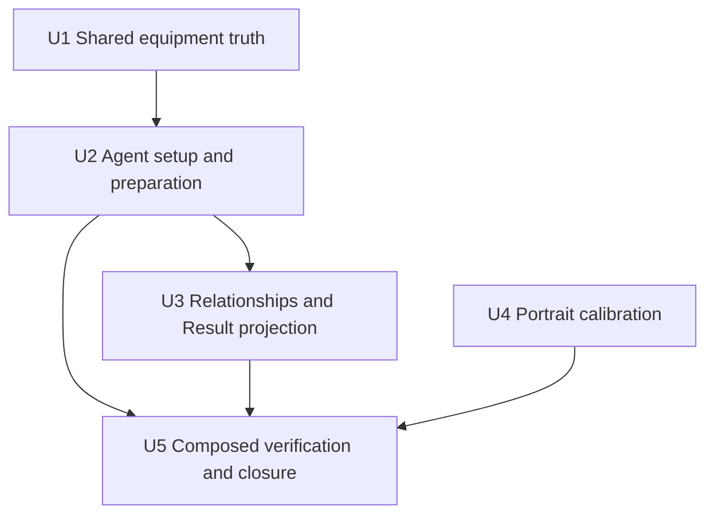

# Sunna And Nangong Yu Bounded Anomaly Expansion Plan

## Summary

Extend the current shared content, preparation, relationship, Result, source-
interaction, and portrait mechanisms for Sunna and Nangong Yu. Correct the
encountered Simmering Pot activation/scope translation in the same protected
unit, without introducing an Agent calculator, equipment registry, runtime
optimizer, or named-Agent test catalogue.

---

## Problem Frame

This is the final paired production unit before the Anomaly damage/buildup
track-closing audit. Sunna is a Support provider whose ATK and Energy setup has
no personal damage formula Result. Nangong is a Stun Agent whose retained
AM/AP package participates in anomaly damage, anomaly buildup, and Daze and
whose Initial AM supplies flat Combat Impact. The implementation must preserve
those different meanings while using the same preparation and calculation
harness as every current Agent.

The shared equipment correction is deliberately narrow. Simmering Pot uses
Assist Follow-Up as activation for a broad holder effect; Setup continues to
show its source-owned competitive package, while Result projects only clauses
the current holder can consume. The completed re-inspection keeps Lycaon
admitted and Anby/Koleda excluded; contrary evidence stops this unit instead of
silently reopening those outcomes.

---

## Requirements

- Implement R1-R22 and F1-F4 from the origin requirement.
- Preserve AE1-AE8, including incomplete Result, target-only rebuild, direct-
  edit, collision, source-focus, and four-destination portrait behavior.
- Keep equipment numbers in shared W-Engine facts. Agent profiles may read
  those facts but may not copy their values.
- Complete Sunna and Nangong portrait calibration in this unit; only earlier
  admitted portrait recalibration remains deferred.

---

## Key Technical Decisions

1. Sunna extends the current Support/provider profile; Nangong extends the
   current Stun profile. Their Specialty owners remain separate even though
   they qualify one another and compose in the same party.
2. Neon Fantasies is one shared W-Engine fact. Simmering Pot keeps an explicit
   Assist Follow-Up activation and broad effect scope. Setup summaries remain
   source-owned; holder applicability is resolved only in relationship
   consumers.
3. Nangong's AM-to-Impact conversion is one linear relationship that reads
   Initial AM and emits flat Combat Impact. Its visible gauge uses the threshold
   as an open-ended boundary and never labels that threshold as a cap. It does
   not add a derived calculation pass.
4. Sunna joins the existing Moonlight collision policy with authored keeper
   precedence `0.5`; no new allocation algorithm is introduced.
5. Existing shared lifecycle and reference-integrity coverage remains the
   primary test owner. New assertions are limited to the corrected
   activation-versus-scope behavior, the new derived relationship surface,
   the composed representative journey, and the new portrait destinations.

---

## Alternative Approaches Considered

- **Put both Agents in the Anomaly profile:** rejected because Specialty and
  source ownership would become false; only Nangong's setup/result families
  participate in Anomaly formulas.
- **Filter W-Engine Setup copy per holder:** rejected because `UI-001` makes
  the competitive passive summary source-owned and preserves unused clauses as
  whole-package opportunity cost.
- **Add a second pass for Nangong's derived Impact:** rejected because the
  current one-way relationship and surface composer already own this order.
- **Persist rejected equipment or numeric proof payloads:** rejected because
  requirements own local authoring outcomes and shared equipment facts own
  runtime values.
- **Defer the two new portrait calibrations:** rejected because `UI-003`
  requires original-asset and rendered four-destination acceptance before new
  source metadata can close.

---

## High-Level Technical Design

The following dependency graph describes plan structure, not implementation
code:

---

## Implementation Units

- U1. **Correct and extend shared equipment facts**

**Goal:** Add Neon Fantasies and correct Simmering Pot's activation/scope,
Lycaon's broad-Daze projection, and compressed source-owned Setup copy without
changing unrelated equipment.

**Requirements:** R5, R14-R15, R21; AE2, AE4

**Dependencies:** None

**Files:**
- Modify: `src/workbench/content/types.ts`
- Modify: `src/workbench/content/engines.ts`
- Modify: `src/workbench/content/agent-sources/rupture-stun.ts`
- Test: `src/workbench/content/agent-sources/equipment.test.ts`
- Test: `src/workbench/calculate.integration.test.ts`
- Test: `src/App.integration.test.tsx`

**Approach:** Keep activation metadata and effect scope distinct in the shared
fact. Preserve complete selected/candidate Setup summaries, and adjust existing
Stun/Support relationship consumers so inactive or unsupported clauses do not
reach Result.

**Patterns to follow:** `W_ENGINE_FACTS`, `W_ENGINES`,
`equipmentEffectMaximumValue`, shared selected/candidate equipment rendering,
and holder-local engine switches in the two existing profile owners.

**Testing delta:** Existing generic equipment reference tests own value access,
and App integration owns selected/candidate summary parity. Change one shared
Setup-copy assertion for Simmering compression and one existing-consumer
assertion that its Assist Follow-Up activation yields broad Lycaon Daze rather
than an Assist-only action child. The eventual Nangong broad-Daze/broad-DMG
contrast belongs to U3 after her identity and consumer exist. Do not add an
engine-value catalogue or per-holder suite. The regression is replaceable: it
proves activation-versus-scope separation for any equivalent equipment fact,
not the named values themselves.

**Test scenarios:**
- Happy path: Simmering's shared fact retains Assist Follow-Up activation and a
  broad holder Daze/DMG scope.
- Existing consumer: the same fact selected for Lycaon yields broad Daze but
  no personal DMG Result or Assist-only child row.
- Integration: selected and candidate summaries show the same compressed broad
  Daze/DMG package without routine trigger or duration prose.

**Verification:** One shared equipment fact owns each value; Setup and Result
cross the source/consumer boundary described by `UI-001`.

---

- U2. **Add bounded identities, candidates, representatives, and preparation**

**Goal:** Admit both Agents with competitive full/non-limited packages and
prepare them through existing pressure, collision, zero-count, and target-only
rebuild mechanisms.

**Requirements:** R1, R5-R9, R14, R16-R19; AE1, AE3, AE5-AE6

**Dependencies:** U1

**Files:**
- Modify: `src/workbench/content/types.ts`
- Modify: `src/workbench/content/agents.ts`
- Modify: `src/workbench/content/setup-options.ts`
- Modify: `src/workbench/content/engines.ts`
- Modify: `src/workbench/content/discs.ts`
- Modify: `src/workbench/content/representatives.ts`
- Modify: `src/workbench/content/setup-policies.ts`
- Test: `src/workbench/lifecycle.test.ts`

**Approach:** Extend the existing content maps. Encode only admitted candidate
and representative outcomes. Add Sunna's existing-policy Moonlight alternative
with precedence `0.5`; preserve all existing preparation passes and direct-edit
behavior.

**Patterns to follow:** Current Yanagi/Alice and Vivian/Aria/Promeia content
entries, Yuzuha's Support main-stat/substat shape, and existing authored disc-
collision alternatives.

**Testing delta:** Generic reference integrity already proves every admitted
identity has complete content, and lifecycle coverage enumerates every
Moonlight pair. Admitting the new identities automatically extends those loops,
so U2 adds no new lifecycle or named representative assertion.

**Test scenarios:**
- Happy path: Party Apply prepares both pools' exact complete packages at zero
  supplied effective-substat counts.
- Edge case: Sunna loses or keeps Moonlight according to the existing holder's
  authored precedence and keeps a legal full package.
- Lifecycle: pool/Mindscape target rebuild preserves other holders; direct edit
  clears an invalid selection without fallback; incomplete selection empties
  Result.

**Verification:** Both Agents are selectable, every candidate reference is
legal in its pool, prepared packages are complete, and no new preparation pass
exists.

---

- U3. **Project Agent, Mindscape, party, action, and gauge relationships**

**Goal:** Add the retained Sunna and Nangong consumers through the current
linear, provider, modifier, operation, action-projection, and gauge mechanisms.

**Requirements:** R1-R4, R9-R13, R18-R21; AE1, AE3, AE5, AE7

**Dependencies:** U1, U2

**Files:**
- Modify: `src/workbench/content/retained-values.ts`
- Modify: `src/workbench/content/agent-sources/sources.ts`
- Modify: `src/workbench/content/agent-sources/provider-defense.ts`
- Modify: `src/workbench/content/agent-sources/rupture-stun.ts`
- Modify: `src/workbench/content/agent-sources/anomaly.ts`
- Modify: `src/workbench/content/setup-options.ts`
- Modify: `src/workbench/calculation/relationships.ts`
- Modify: `src/workbench/calculation/result.ts`
- Modify: `src/workbench/calculation/profile-harness.ts`
- Modify: `src/components/ResultPanel.tsx`
- Test: `src/workbench/calculation/profile-harness.test.ts`
- Test: `src/components/ResultPanel.test.tsx`
- Test: `src/workbench/calculate.integration.test.ts`

**Approach:** Reuse local observation followed by ordinary provider delivery.
Emit Sunna's cap as the current capped gauge. Emit Nangong's AM-derived flat
Combat Impact once through an open-ended threshold gauge, retain canonical
action differences and exact added-Abloom operation, and omit all local
resources/base arithmetic without a consumer.

**Patterns to follow:** Yuzuha's capped ATK provider, Promeia's one-way Initial-
AM relationship, Vivian's added-Abloom operation, and current qualified party
providers in the two selected profile owners.

**Testing delta:** Shared harness tests already own relationship variants,
surface order, delivery, operations, capped gauges, source replacement, and
no-consumer omission. Add one shared relationship/UI assertion for an uncapped
progressing threshold because that visible boundary is new; it must expose the
current basis, threshold, and output without a cap label. Add no named numeric
catalogue. One content-level assertion
derives its expectations from the selected shared Neon/Hellfire facts and proves
that Nangong reads Initial AM, emits flat Combat Impact, preserves percentage-
Impact ordering, and composes exactly once; this wiring failure is not proven by
the generic relationship fixture alone. Extend one existing composed journey to
prove cross-profile Support/Stun delivery, ordinary versus Chain Attack buildup,
an equivalent general-damage rejection, and the independent Sunna-M1 trigger-
performer predicate. These failures remain meaningful with equivalent facts,
providers, and recipients rather than freezing their named values.

**Test scenarios:**
- Happy path: Sunna/Nangong/Aria qualifies both Additional Abilities and Aria
  receives only formula-applicable delivered effects.
- Equipment contrast: Nangong consumes Simmering's broad Daze and broad DMG,
  while Lycaon's existing consumer retains broad Daze without personal DMG.
- Contrast: a current general-damage consumer does not gain anomaly-only
  effects, and removing the qualifier removes only Additional Ability sources.
- Independent condition: keep Sunna's Additional Ability qualified while
  removing the Attack-or-Anomaly trigger performer; only the M1 DEF Reduction
  source disappears. M6 Sunna restores that trigger route.
- Action scope: a compatible anomaly-buildup recipient exposes the ordinary
  stunned-enemy contribution and the additional Chain Attack contribution as
  separate canonical outcomes.
- Surface composition: expectations derived from selected equipment facts show
  Nangong's Initial AM produces one flat Combat Impact contribution and that
  percentage Impact uses Initial Impact before the flat value, with no second
  pass.
- Visibility: local stacks/resources/base coefficients have no row, while the
  exact added-Abloom operation and current gauges do.

**Verification:** Calculation follows relationship ownership and every visible
source has a current Result consumer and stable focus destination.

---

- U4. **Calibrate the two new portraits**

**Goal:** Add portrait wiring and accept Sunna and Nangong source metadata under
the full `UI-003` calibration procedure.

**Requirements:** R22; AE8

**Dependencies:** None

**Files:**
- Modify: `src/components/agentPortraits.ts`
- Modify: `src/components/PartyWorkbench.tsx`
- Modify: `tests/visual/workbench-portraits.spec.ts`
- Update: `tests/visual/workbench-portraits.spec.ts-snapshots/`

**Approach:** Inspect original assets, compare nearby admitted portraits, and
author scale, then `headTopY`, then `faceX`. Reuse the shared responsive frames;
do not add per-surface exceptions.

**Patterns to follow:** Existing portrait source map and four-destination
Playwright capture parties.

**Testing delta:** Portrait metadata is visual input, so DOM wiring is
insufficient. Add exactly one party capture covering the two new Agents at
desktop/narrow and expanded/compact; no new item-specific layout test. This is
the intentional identity-specific exception because each original asset owns
distinct optical source inputs.

**Test scenarios:**
- Visual: both new Agents retain readable face and connected-body balance in
  all four destinations beside an admitted comparison Agent.
- Edge case: compact names and controls remain clear, no meaningful clipping
  or horizontal overflow occurs, and the same metadata survives every frame.

**Verification:** Controller repeats original-asset and in-app browser
comparison for both Agents before accepting screenshots.

---

- U5. **Verify the composed product flow and close the bounded unit**

**Goal:** Prove the complete Setup-to-Result flow, review the final diff, and
prepare the protected exact-head transaction.

**Requirements:** F1-F4; R18-R22; AE1-AE8

**Dependencies:** U2, U3, U4

**Files:**
- Modify only if verification finds a defect in an already-owned file.
- Update: `docs/plans/README.md`
- Delete after committed checkpoint: this active plan file

**Approach:** Run targeted tests continuously, then the full behavior, type,
build, visual, and browser gates. Inspect source interactions, selected and
candidate equipment copy, pressure/collision lifecycle, incomplete Result, and
one unaffected consumer. Complete milestone and plan-lifecycle edits before
freezing the final head and PR Authority trace. Then obtain one qualified
independent exact-head review, fresh owner approval, all six current required
contexts, and the launcher preflight before protected merge; any later head or
trace change invalidates and repeats the affected evidence. Perform one
controller diff review plus only the domain review triggered by shared semantic
and portrait changes.

**Patterns to follow:** Current protected PR Authority trace and exact-head
review/evidence flow under `GOV-001`.

**Testing delta:** No new test is planned in this unit. It runs and evaluates
the shared tests changed in U1-U4; any discovered regression is fixed at the
mechanism owner rather than frozen as a named-Agent value assertion.

**Test scenarios:**
- Integration: pressure present, absent, and reselected; Party Apply versus
  target-only rebuild; invalid clearing; zero-count initialization; incomplete
  Result; and an unaffected contrasting consumer remain coherent together.
- Interaction: local and delivered source hover/focus destinations follow
  `UI-002` and clear stale links.
- Setup geometry: open the affected W-Engine selector at desktop and narrow
  widths and inspect the longest changed selected and candidate summaries,
  accessible descriptions, keyboard focus visibility, readable type,
  clipping, collision, and horizontal overflow.
- Visual: desktop and narrow browser checks agree with the accepted baselines.

**Verification:** All required gates pass on the final exact head, no
requirement or implementation difference remains unexplained, and the branch
is ready for protected review and merge.

---

## System-Wide Impact

- **Interaction graph:** shared equipment facts feed candidate Setup copy and
  holder relationship consumers; local relationships feed ordinary delivery;
  prepared content feeds the existing party and target rebuild lifecycle.
- **State lifecycle risks:** a new identity automatically participates in
  generic reference and collision loops. No persistent state or migration is
  introduced.
- **API surface parity:** selected and candidate equipment descriptions use the
  same source-owned lines; pointer and keyboard source focus share the current
  reducer path.
- **Integration coverage:** one composed Sunna/Nangong/Aria journey crosses
  preparation, qualification, delivery, Result, and source interaction.
- **Unchanged invariants:** Result stays empty for incomplete selections;
  direct edits do not reprepare; target rebuild preserves established holders;
  equipment values remain source-owned; no final-damage calculator exists.

---

## Risks & Dependencies

| Risk | Mitigation |
| --- | --- |
| Simmering's corrected broad scope reopens a settled roster | Verify Lycaon remains admitted and Anby/Koleda remain excluded; contrary evidence is an authoring stop, not permission to alter them here. |
| Nangong's derived Impact is composed at the wrong surface | Use the existing one-way relation, existing stat-composer test, and calculated-output inspection to verify Initial basis plus flat Combat emission without adding a named value test. |
| W-Engine Setup becomes holder-filtered | Keep `passiveLines` source-owned and test selected/candidate parity separately from Result. |
| Content expansion recreates catalogue tests | Apply each unit's Testing delta and add assertions only for new mechanisms or distinct failures. |
| New portrait metadata is accepted provisionally | Complete original-asset and four-destination rendered calibration before closure. |

---

## Scope Boundaries

### Deferred to Follow-Up Work

- Anomaly damage/buildup track-closing audit and Freedom Blues correction.
- Miyabi, then Anton/Rina.
- Fine recalibration of previously admitted portraits.

### Not Included

- Final damage, buildup progress, anomaly history, rotation, uptime, field-time
  simulation, local resource state, or healing Result.
- A new Agent calculator, second delivery/derived pass, equipment registry,
  runtime setup scorer, rejected-item registry, or copied equipment values.
- A named-Agent test suite or exact candidate/value catalogue.

---

## Sources & References

- **Origin document:** `docs/brainstorms/2026-08-24-sunna-nangong-anomaly-expansion-requirements.md`
- Permanent owners: `docs/source-fact-boundary.md`,
  `docs/zzz-game-vocabulary.md`, `docs/zzz-formula-mechanics.md`,
  `docs/setup-workbench-product-contract.md`, `docs/workbench-ui-design-rules.md`
- Current consumers: `src/workbench/content/engines.ts`,
  `src/workbench/content/setup-policies.ts`,
  `src/workbench/content/agent-sources/provider-defense.ts`,
  `src/workbench/content/agent-sources/rupture-stun.ts`,
  `src/workbench/calculation/profile-harness.ts`,
  `src/components/AgentSetup.tsx`, `src/components/ResultPanel.tsx`, and
  `tests/visual/workbench-portraits.spec.ts`
