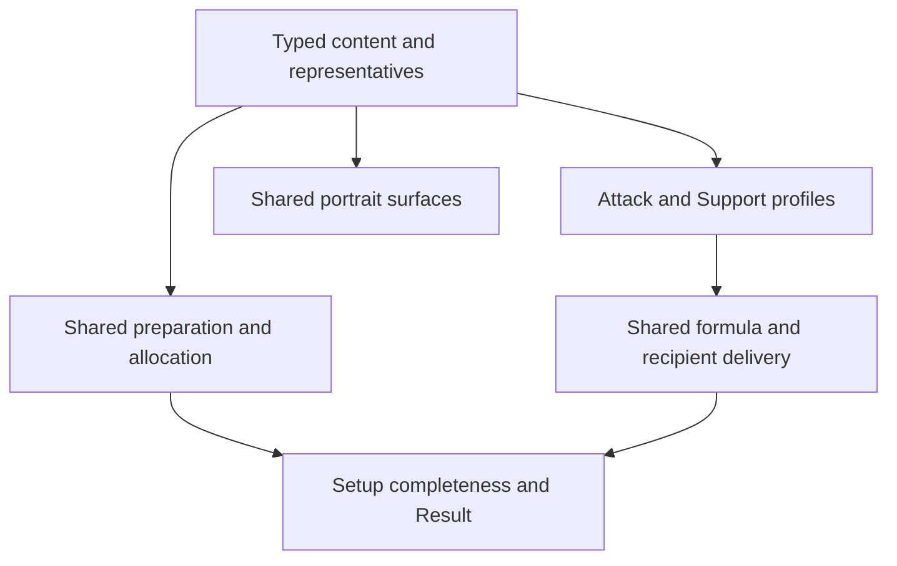

# feat: Add Anton and Rina Shock-state setup

## Summary

Extend the existing typed content, Attack profile, Support provider, prepared
setup, and portrait paths for Anton and Rina. Reuse current formula delivery,
gauge, operation, lifecycle, and allocation mechanisms; add only the generic
formula-delivery coverage that the current harness does not yet prove.

---

## Problem Frame

Anton and Rina close the accepted through-2.8 sequence, but Shock state does
not give them a shared personal formula. The implementation must preserve
Anton's general-damage actions and Rina's provider-only setup without
reopening anomaly classification or turning their content into a runtime
Shock model.

The settled content decisions are: Anton's qualified operation is `Original
Shock DMG` at `×0.45`; Rina's Slot 4 offers Anomaly Proficiency as the
prepared residual Shock direction or ATK% as the distinct direct-plus-Shock
residual alternative, with no effective substats or personal formula. CRIT is
excluded as not competitive in the zero-substat support package. Anton
locally admits contextual Puffer Electro 4pc when Dialyn supplies a received
Ultimate, with canonical Ultimate DMG Bonus action projection; this is not a
global general-damage default (Harumasa is nearest; Miyabi's exclusion and
Hugo's M0/M2 admission boundary are contrasts).

---

## Assumptions

*This plan is being authored inside an already-approved autonomous execution
flow. The item below is a plan-time placement decision rather than a new
product conclusion.*

- The TD2 equivalent fixture belongs in the shared calculation harness beside
  current recipient/formula filtering, not in a named Anton/Rina integration
  snapshot or a new formula-policy suite.

---

## Requirements

- R1-R3. Register Anton as the Focus-eligible A-Rank Electric Attack identity,
  retain only his current general-damage/action/operation/provider outcomes,
  and omit consumer-free rotation, Shield, cadence, and stack history.
- R4-R7. Author Anton's settled pool candidates, representatives, Disc and
  main/substat directions, including pool-specific CRIT recomposition and the
  existing broad pre-PEN consequence.
- R8-R12. Register Rina as the non-Focus S-Rank Electric Support identity and
  project her Initial-PEN Core/Potential providers, qualified Shock/Electric
  outcomes, automatic Energy, and current Mindscape outcomes without a
  personal damage formula.
- R13-R16. Author Rina's settled Weeping/Kaboom, Moonlight/Astral/Puffer,
  required main-stat, and shared Moonlight allocation outcomes without a new
  interval or allocation mechanism.
- R17-R20a. Preserve shared Party Apply, target-only rebuild, selected-pressure,
  reconciliation, incomplete-selection, Setup compression, and Result
  admission behavior.
- R21. Wire and visually calibrate the existing Anton and Rina original
  portraits and Electric/Specialty marks across all current portrait states.
- TD1-TD5. Add only the equivalent-fixture formula-delivery assertion; reuse
  existing shared coverage for content registration, action/operation/gauge,
  lifecycle, Weeping Energy, and source facts; update the required portrait
  visual baselines.

---

## Scope Boundaries

- No new formula family, Shock accumulation/history, rotation, cadence,
  runtime optimizer, or generic final-damage row.
- No copied equipment values or consumer-free trigger, duration, stack,
  interval, or action schema.
- No Weeping/Rina interval guard, named equipment or Agent catalogue test, or
  existing candidate/representative re-audit.
- No existing portrait metadata, shared portrait geometry, or layout change.

---

## Context & Research

### Relevant Code and Patterns

- `src/workbench/content/types.ts`, `agents.ts`, `setup-options.ts`,
  `engines.ts`, `discs.ts`, `representatives.ts`, and `setup-policies.ts` own
  typed registration and deterministic prepared policy.
- `src/workbench/content/agent-sources/attack.ts` already composes exact Attack
  action targets, qualified providers, holder-local operations, selected
  equipment, and Result admission.
- `src/workbench/content/agent-sources/provider-defense.ts` already composes
  Support basis stats, capped gauges, recipient delivery, automatic Energy,
  and operation rows for Agents with empty personal formula participation.
- `src/workbench/calculation/delivery.ts` and `src/workbench/formula-policy.ts`
  already own the ordinary-region compatibility between general and anomaly
  damage.
- `src/workbench/preparation.ts`, `src/workbench/state.ts`, and
  `src/workbench/lifecycle.test.ts` own whole-party versus target-only
  preparation, pressure, allocation, zero counts, and reconciliation.
- `src/components/agentPortraits.ts` owns portrait identity and calibration
  inputs; `PartyWorkbench.tsx` and `PartyEditor.tsx` consume that shared map
  without Agent-local branches, and `tests/visual/workbench-portraits.spec.ts`
  owns the applied expanded/compact baselines.

### Institutional Learnings

- `docs/solutions/workflow-issues/prevent-secondary-requirements-from-validating-themselves-2026-08-12.md`
  requires eligibility-first complete-package comparison, zero rather than a
  penalty for unused clauses, finite future opportunity, and the selected
  pressure lifecycle before implementation.
- `docs/solutions/workflow-issues/preserve-interaction-fidelity-in-ui-explorations-2026-08-05.md`
  requires desktop/narrow and expanded/compact visual evidence; clean metadata
  wiring alone is insufficient.

### External References

- Recent Anton build comparisons from
  [Icy Veins](https://www.icy-veins.com/zenless-zone-zero/anton-guide-best-builds)
  and [Mobalytics](https://mobalytics.gg/zzz/characters/anton) informed the
  bounded package directions but do not own candidate membership.
- Current character/profile facts from
  [Prydwen Anton](https://www.prydwen.gg/zenless/characters/anton) and
  [Prydwen Rina](https://www.prydwen.gg/zenless/characters/rina) were
  reconciled into the accepted requirement before planning. Game8 is not used
  as a recommendation source.

---

## Key Technical Decisions

- Extend exact identity dispatch instead of selecting calculators by
  Specialty: Anton enters the existing Attack builder and Rina the existing
  provider/Defense builder.
- Keep all new numerical kit facts in `retained-values.ts`; selected equipment
  continues to read shared facts through the current relationship mappers.
- Represent Anton's Original Shock DMG scale and Rina's Shock-duration distinction
  as existing operation rows. Do not add a Shock state carrier or base/final
  damage arithmetic.
- Express Rina's Core and Potential through existing Initial-PEN gauges with
  distinct `other-party` and `all-party` emissions. Empty personal formula
  participation remains independent from those provider consumers.
- Add Rina to the existing Moonlight holder policy. Whole-party allocation
  uses precedence, while target-only rebuild preserves established holder
  snapshots; no new pass is introduced.
- Keep the TD2 assertion mechanism-level and replaceable by equivalent
  fixtures. All local candidate and representative outcomes stay in content
  and requirements rather than snapshots.

---

## Open Questions

### Resolved During Planning

- Does Weeping require a new off-field guard for Rina? No. Every current legal
  Support holder is outside Focus in the fixed observation; no reachable
  holder contrast changes selection or Result. This does not generalize
  `focusEligible: false` to Stun or Defense.
- Does Rina's PEN disappear under broad pre-PEN pressure? No. It is a provider
  basis while her personal formula participation is empty.
- Does the new formula-delivery test need named Agents? No. The failure remains
  meaningful with equivalent general/anomaly recipients and metrics.

### Deferred to Implementation

- Final portrait metadata values are visual calibration outputs and must be
  settled from the running shared surfaces, not guessed in the plan.

---

## Implementation Units

- U1. **Register identities and competitive setup policy**

**Goal:** Add Anton and Rina to every closed typed identity and setup-policy map
with the settled candidate sets, representatives, formula participation,
main/substat choices, and Rina allocation policy.

**Requirements:** R1, R4-R8, R13-R18

**Dependencies:** None

**Files:**
- Modify: `src/workbench/content/types.ts`
- Modify: `src/workbench/content/agents.ts`
- Modify: `src/workbench/content/engines.ts`
- Modify: `src/workbench/content/discs.ts`
- Modify: `src/workbench/content/setup-options.ts`
- Modify: `src/workbench/content/representatives.ts`
- Modify: `src/workbench/content/setup-policies.ts`
- Verify: `src/workbench/lifecycle.test.ts` shared coverage; edit only if
  implementation exposes a genuinely new shared branch.

**Approach:**
- Extend exhaustive records and reuse existing pool filtering, candidate
  pressure, representative, and prepared-disc policy structures.
- Keep Anton's full/non-limited CRIT recomposition and Rina's provider-only PEN
  package explicit in content. Prepare Rina with residual Slot 4 AP while
  retaining ATK%, and locally authorize Anton's received-Ultimate Puffer case
  without generating a general-damage roster. Do not add equipment facts,
  scoring, or runtime candidate logic.
- Give Rina Moonlight precedence 5 and the accepted Astral/Puffer alternative;
  rely on current Party Apply and established-holder target rebuild behavior.

**Patterns to follow:**
- Miyabi and Harumasa for general-damage content registration.
- Sunna/Astra/Nicole for empty-formula Support setup and Moonlight allocation.

**Test scenarios:**
- Integration reuse: exhaustive typed maps and current all-Agent calculation
  loop accept both new identities without special fallback dispatch.
- Lifecycle reuse: Anton's optional PEN/Puffer follows existing DEF-region
  pressure while Rina's provider PEN/Puffer remains authored.
- Allocation reuse: Party Apply keeps exactly one Moonlight holder by rigid or
  precedence policy; target-only rebuild preserves established other slots.

**Verification:** Both Agents have complete prepared setups in both pools with
zero supplied substats, and every selection references an admitted shared fact.

---

- U2. **Project Anton through the Attack profile**

**Goal:** Add Anton's retained stats, qualification, exact action modifiers,
party CRIT provider, Original Shock DMG operation, selected equipment, and
Result admission without anomaly classification.

**Requirements:** R1-R3, R17-R20a, TD1

**Dependencies:** U1

**Files:**
- Modify: `src/workbench/content/agent-sources/attack.ts`
- Modify: `src/workbench/content/agent-sources/agent-profile-registry.ts`
- Modify: `src/workbench/content/retained-values.ts`
- Verify: `src/workbench/calculate.integration.test.ts` shared all-Agent and
  cross-profile coverage without adding a named Anton case.
- Verify: `src/workbench/calculation/profile-harness.test.ts` shared action,
  operation, and provider coverage; U4 owns its sole planned edit.

**Approach:**
- Add source-local Piledriver, Drill, Burst Basic, and Burst Dodge Counter
  targets inside the current Attack builder.
- Include a canonical Ultimate DMG projection so a directly selected
  Dialyn-context Puffer package exposes only its action-local difference.
- Reuse same-Attribute/faction qualification, ordinary modifier/provider, and
  holder-local operation relationships.
- Retain fully enabled maxima only; do not materialize hit counters, cadence,
  Shield, or Shock history.

**Patterns to follow:**
- Soldier 11 for exact Basic/Dash distinctions and qualification.
- Billy/Nekomata for current Mindscape action projection and holder-local
  operation admission.

**Test scenarios:**
- Shared coverage reuse: the complete profile evaluator admits Anton's normal
  and action-local metrics without an `anomaly_damage` row.
- Shared coverage reuse: qualification changes the Original Shock DMG
  operation; M4 independently adds its party CRIT source. Neither changes
  formula family or recipient identity.
- Edge reuse: incomplete Anton setup keeps the entire party Result empty.

**Verification:** Anton's selected engine/discs and local kit compose on the
same Initial/Combat/Fully Enabled surfaces as existing Attack profiles.

---

- U3. **Project Rina through the Support provider profile**

**Goal:** Add Rina's Initial-PEN Core and Potential gauges, qualified Shock and
Electric party outcomes, Mindscape Energy/DMG providers, and selected equipment
without a personal damage formula.

**Requirements:** R8-R20, TD1, TD3, TD4

**Dependencies:** U1

**Files:**
- Modify: `src/workbench/content/agent-sources/provider-defense.ts`
- Modify: `src/workbench/content/agent-sources/agent-profile-registry.ts`
- Modify: `src/workbench/content/retained-values.ts`
- Verify: `src/workbench/calculation/profile-harness.test.ts` shared gauge,
  automatic-Energy, operation, and delivery coverage; U4 owns its sole planned
  edit.
- Verify: `src/workbench/lifecycle.test.ts` shared pressure, allocation, and
  rebuild coverage without adding a named Rina/Weeping case.

**Approach:**
- Compose base and Potential PEN on Initial, then emit capped Core PEN to
  other-party and capped Potential ATK to all-party through current gauge
  transforms.
- Reuse current Attribute/faction qualification, local operation, ordinary
  Attribute provider, and automatic-Energy relationships.
- Omit Potential DEF, M2 personal damage, doll duration/cadence, and a Rina
  interval entry because none changes a current admitted consumer.

**Patterns to follow:**
- Astra and Sunna for basis-stat gauges with party emissions.
- Zhao for recipient-specific provider delivery and completed-stat surfaces.
- Promeia for a qualified anomaly-state duration operation without a state
  engine.

**Test scenarios:**
- Shared coverage reuse: Rina's selected PEN package changes both visible
  gauges and delivers their distinct outputs to the correct recipient sets.
- Shared coverage reuse: M1 changes the capped Core transform, while M4 adds
  automatic Energy after percentage composition and M6 adds Electric DMG.
- Contrast: Rina remains calculable with an empty personal formula list and
  preserves PEN candidates under an external broad pre-PEN source.

**Verification:** Rina shows only PEN/Energy and current gauges/operations,
while compatible recipients receive the declared provider sources once.

---

- U4. **Cover the shared ordinary-region delivery gap**

**Goal:** Prove the existing formula delivery boundary that Rina relies on
without encoding Anton, Rina, Grace, or exact content values as policy.

**Requirements:** R11, R20, TD2

**Dependencies:** U2, U3

**Files:**
- Modify: `src/workbench/calculation/profile-harness.test.ts`

**Approach:**
- Extend the nearest generic recipient/formula fixture with one ordinary
  `general_damage` provider, one general recipient, and one anomaly recipient.
- Assert delivery of shared ordinary metrics to both, and rejection of a
  non-shared or incompatible effect. Do not change production formula policy
  unless the test exposes a requirement contradiction and execution stops.

**Patterns to follow:**
- The existing Result-participation versus direct-stat projection fixture in
  `profile-harness.test.ts`.

**Test scenarios:**
- Happy path: ordinary DMG/ATK/PEN-region supply reaches a general-damage
  recipient and the matching shared region of an anomaly-damage recipient.
- Edge case: a non-shared metric or exact formula-only operation does not cross
  from general to anomaly.
- Isolation: the provider does not deliver to an unrelated formula recipient.

**Verification:** The test still expresses the same contract when every named
fixture identity and numeric value is replaced.

---

- U5. **Wire and calibrate portrait surfaces**

**Goal:** Add Anton and Rina to existing portrait and identity-mark maps and
verify their artwork in the required applied expanded/compact surfaces.

**Requirements:** R21, TD5

**Dependencies:** U1

**Files:**
- Modify: `src/components/agentPortraits.ts`
- Modify: `src/components/PartyWorkbench.tsx` identity-mark map only; do not
  change component behavior or layout.
- Inspect only: `src/components/PartyEditor.tsx`; it consumes the shared
  portrait map and requires no Agent-local branch or layout change.
- Modify: `tests/visual/workbench-portraits.spec.ts`
- Create: `tests/visual/workbench-portraits.spec.ts-snapshots/anton-desktop-expanded-chromium-linux.png`
- Create: `tests/visual/workbench-portraits.spec.ts-snapshots/anton-desktop-compact-chromium-linux.png`
- Create: `tests/visual/workbench-portraits.spec.ts-snapshots/anton-narrow-expanded-chromium-linux.png`
- Create: `tests/visual/workbench-portraits.spec.ts-snapshots/anton-narrow-compact-chromium-linux.png`
- Create: `tests/visual/workbench-portraits.spec.ts-snapshots/rina-desktop-expanded-chromium-linux.png`
- Create: `tests/visual/workbench-portraits.spec.ts-snapshots/rina-desktop-compact-chromium-linux.png`
- Create: `tests/visual/workbench-portraits.spec.ts-snapshots/rina-narrow-expanded-chromium-linux.png`
- Create: `tests/visual/workbench-portraits.spec.ts-snapshots/rina-narrow-compact-chromium-linux.png`

**Approach:**
- Reuse the tracked original portrait assets and shared Electric/Attack/Support
  identity marks.
- Calibrate scale, then vertical head registration, then optical face anchor.
  Preserve Rina's companion composition unless it obscures controls or marks.

**Patterns to follow:**
- Miyabi and the recent anomaly cohort portrait registrations and visual
  baseline cases.

**Test scenarios:**
- Visual: each Agent renders applied expanded and compact at desktop and narrow
  widths without clipping names, marks, controls, or focal faces.
- Contrast: nearby unchanged portraits retain their existing framing and
  shared geometry.

**Verification:** In-app Browser inspection and the visual baseline job agree
on the accepted original-asset framing for both Agents.

---

## System-Wide Impact

- **Interaction graph:** Party Edit and pool/Mindscape changes reach the new
  identities through current candidate, preparation, profile, and Result entry
  points; no new public entry point is added.
- **Error propagation:** Exhaustive records and profile registry fail at type
  check if any identity surface is omitted. Incomplete selections continue to
  return no Result rather than partial output.
- **State lifecycle risks:** The main risk is confusing whole-party precedence
  with established-holder target rebuilds or treating Rina's provider PEN as
  personal DEF pressure.
- **API surface parity:** UI selectors, Setup, Result, and Party Editor consume
  the same admitted identity maps without a local component change; no API or
  storage migration exists.
- **Integration coverage:** Root tests must calculate every admitted Agent;
  browser verification must cover expanded and compact portrait states at
  desktop and narrow widths.
- **Unchanged invariants:** Equipment facts remain shared, candidates remain
  authored rather than optimized, source-owned Setup keeps complete packages,
  and Result projects only current consumable relationships.

---

## Risks & Dependencies

| Risk | Mitigation |
| --- | --- |
| Shock prose accidentally creates anomaly formula participation | Keep formula registration explicit and verify no anomaly rows enter Anton/Rina profiles |
| Rina provider gauges read the wrong PEN surface or recipient | Build on Initial-PEN gauge patterns and inspect other-party versus all-party sources in Result |
| Candidate content becomes an unreviewed catalogue | Implement only the requirement identities; stop on any unsupported substitute or external fact conflict |
| Allocation differs between Party Apply and target-only rebuild | Reuse the current two entry paths and verify established slot identity remains unchanged |
| Portrait metadata hides Rina's companions or controls | Inspect original assets and all desktop/narrow expanded/compact states in the in-app Browser |

---

## Documentation / Operational Notes

- The origin requirement remains the bounded product outcome. The active plan
  is execution-only and follows `docs/plans/README.md` lifecycle after a
  committed checkpoint preserves it.
- No rollout, migration, feature flag, or production monitoring change is
  required.

---

## Sources & References

- **Origin document:**
  [docs/brainstorms/2026-08-25-anton-rina-shock-general-damage-expansion-requirements.md](../brainstorms/2026-08-25-anton-rina-shock-general-damage-expansion-requirements.md)
- Permanent owners: `docs/setup-workbench-product-contract.md`,
  `docs/zzz-formula-mechanics.md`, `docs/source-fact-boundary.md`,
  `docs/workbench-ui-design-rules.md`, and `docs/zzz-game-vocabulary.md`
- Related implementation: `src/workbench/content/agent-sources/attack.ts`,
  `src/workbench/content/agent-sources/provider-defense.ts`,
  `src/workbench/calculation/delivery.ts`, `src/workbench/preparation.ts`, and
  `src/components/agentPortraits.ts`
