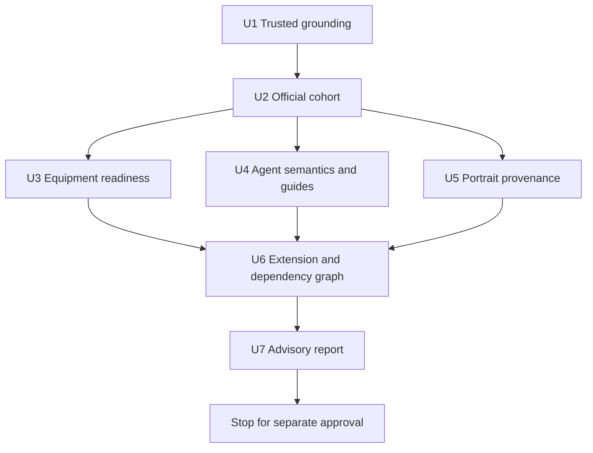
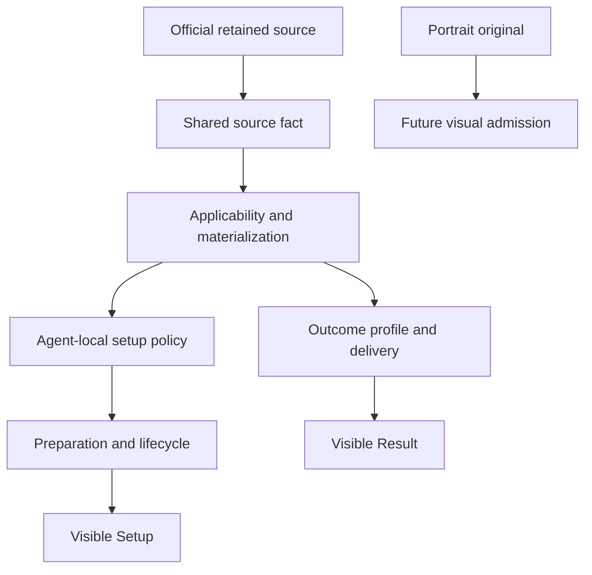

# Through-3.1 Content Expansion Preflight Plan

## Summary

Execute one read-only research preflight for the approved Version 3.0 and 3.1
cohort. Reconstruct official source facts, test them against the current
source-to-Setup/Result consumers, isolate genuine semantic or operation gaps,
and deliver a dependency-aware advisory vertical order without admitting or
implementing any content.

This is a research-execution plan. It is not an Agent vertical implementation
plan and does not authorize candidate, representative, source-fact, authority,
asset, production, test, UI, Git, or GitHub mutation.

---

## Problem Frame

The current workbench has a content-extension path for shared equipment facts,
ordinary effect materialization, Agent-local setup policy, exact outcome
profiles, lifecycle, and visible Setup/Result projection. The through-3.1
cohort must falsify that path before any vertical assumes it is reusable,
especially where the source introduces Wind or Lumiflux meanings not currently
owned by the permanent authorities.

---

## Requirements

- R1. Begin from a clean trusted `main` checkpoint and re-ground all five
  permanent owners, applicable current requirements and learnings, the plan
  index, current behavior-bearing consumers, and a bounded operational
  sentinel set.
- R2. Reconstruct exactly the five-Agent Version 3.0/3.1 cohort and exclude all
  later Agents.
- R3. Reconstruct exactly the six S-Rank/A-Rank W-Engines and exclude B-Rank
  and later W-Engines.
- R4. Reconstruct exactly the four Version 3.0/3.1 Drive Disc sets, preserving
  independent 2-piece and 4-piece source clauses.
- R5. Keep inventory, source readiness, semantic applicability, product
  admission, and implementation as separate gates.
- R6. Verify each retained W-Engine's complete current source package and
  compressed Setup consequence without duplicating a permanent fact store.
- R7. Verify each retained Drive Disc clause independently before classifying
  the complete set package.
- R8. Classify equipment clauses as ordinary current relationships,
  established unique operations, missing exact edges, or genuinely new common
  concepts without using identity as an implementation discriminator.
- R9. Use current guides only for discovery and interpretation, recording page
  freshness separately from the build or calculation version actually covered.
- R10. Inspect only bounded nearest existing packages needed to define a later
  vertical's comparison horizon; do not perform candidate admission or rebuild
  an equipment catalogue.
- R11. Derive each Agent's direction, role, formula participation, operating
  interval, actions, resources, external outcomes, Focus eligibility, and
  exclusions from exact facts and current consumers rather than identity
  metadata.
- R12. Leave Wind and Lumiflux unresolved until official facts plus permanent
  authority establish every retained formula, Attribute, anomaly, equipment,
  and visible consequence; stop dependent work at an exact `GOV-001` boundary.
- R13. Apply `SF-005` separately to proposed new terms and relationships and
  retain no speculative capability, release, registry, or payload structure.
- R14. Falsify the ordinary content-extension path for every proposed vertical
  and name the exact operation, fact grammar, consumer, or abstraction gap when
  it fails.
- R15. Derive vertical order from semantic dependencies, useful contrasts,
  party/equipment relationships, and bounded risk rather than chronology,
  popularity, Specialty, or signature association.
- R16. Defer W-Engine, Disc, main-stat, effective-substat, representative, and
  selected-input lifecycle conclusions to each separately approved Agent
  vertical.
- R17. Inventory portrait provenance and source availability without admitting
  assets or performing visual calibration.
- R18. Deliver one advisory report with scope, readiness, classifications,
  dependency order, first-sentinel recommendation, and exact blockers, then
  stop for separate approval.

**Origin flows:** F1 (bounded cohort reconstruction), F2 (source and semantic
readiness), F3 (rolling-vertical handoff)

**Origin acceptance examples:** AE1-AE2 (cohort and Rank exclusion), AE3-AE4
(ordinary equipment and independent clauses), AE5 (stale guide omission), AE6
(Wind/Lumiflux authority stop), AE7 (semantic rather than release ordering)

---

## Scope Boundaries

- No Agent, W-Engine, or Drive Disc first introduced after Version 3.1.
- No B-Rank W-Engine research or source-fact work.
- No Agent or equipment admission, candidate or representative conclusion,
  source-fact mutation, vertical requirement, vertical implementation plan,
  production code, test, asset import, UI change, or portrait calibration.
- No permanent cohort/release field, equipment catalogue, semantic evidence
  registry, runtime optimizer, universal effect graph, or Named-Agent decision
  tree.
- No broad re-audit of already admitted content beyond the nearest current
  consumer, contrast, and bounded comparison horizon required by one proposed
  vertical.
- No authority inference from current arrays, implementation, tests, guide
  rankings, signature association, Specialty, Attribute label, or previous
  task conclusion.
- No test, build, dev-server, or browser run. Existing tests are read only as
  evidence of established consumers and mechanisms.
- No commit, push, pull request, or GitHub mutation during preflight execution.

### Deferred to Follow-Up Work

- Each Agent's candidate, representative, main-stat, substat, lifecycle,
  portrait-calibration, and visible Setup/Result work: its separately approved
  vertical after advisory review.
- Any permanent authority decision exposed by a retained Wind, Lumiflux,
  formula, recipient, action, interval, or operation consequence: the separate
  `GOV-001` transaction before dependent authoring.
- Any shared source grammar or consumer extension proven necessary by the
  preflight: a bounded requirement and plan after its semantics are approved.

---

## Context & Research

### Relevant Code and Patterns

- `src/workbench/content/types.ts`, `agents.ts`, `engines.ts`, and `discs.ts`
  define the current closed identities and shared source-fact shapes.
- `src/workbench/content/agent-setup-candidates.ts`, `representatives.ts`, and
  `setup-policies.ts` own Agent-local setup policy and pool preparation rather
  than equipment facts.
- `src/workbench/content/agent-sources/equipment-effect-materializer.ts`,
  `w-engine-effect-materializer.ts`, and `drive-disc-effect-materializer.ts`
  provide the ordinary source-to-relationship path.
- `src/workbench/content/agent-sources/w-engine-relationships.ts` and
  `drive-disc-relationships.ts` show the remaining dedicated operation or
  derived-gauge boundary; their existence does not justify a new identity case.
- `src/workbench/content/agent-equipment-effect-applicability.ts` is the sparse
  Agent-local restriction boundary when ordinary source/capability derivation
  is intentionally narrower.
- `src/workbench/content/agent-profiles/registry.ts` and the outcome-family
  profiles establish formula participation by exact retained meaning rather
  than Specialty dispatch.
- `src/workbench/candidate-context.ts`, `candidates.ts`, `preparation.ts`, and
  `state.ts` establish selected pressure, pool/Mindscape rebuild, direct edit,
  reconciliation, invalid clearing, zero-substat initialization, and
  incomplete-selection behavior.
- `src/workbench/calculation/delivery.ts`, `profile-harness.ts`, and the visible
  `src/components/AgentSetup.tsx` and `ResultPanel.tsx` consumers establish the
  current source-to-visible boundary that later verticals must preserve.
- `src/components/agentPortraits.ts` and current portrait assets establish the
  future admission seam, not source provenance or visual readiness.

### Institutional Learnings

- `docs/solutions/workflow-issues/prevent-secondary-requirements-from-validating-themselves-2026-08-12.md`
  requires operational sentinels, exact current consumers, contrasting cases,
  complete source packages, finite opportunity, lifecycle, and independent
  authoring review before a vertical plan exists.
- The same learning prohibits guide ranking, current implementation, tests, or
  a secondary requirement from proving its own candidate or representative
  conclusion and keeps bounded evidence ephemeral.
- `docs/solutions/workflow-issues/preserve-interaction-fidelity-in-ui-explorations-2026-08-05.md`
  becomes applicable only in later portrait/UI verticals; the preflight does
  not run a visual experiment.

### External Reference Seeds

- Official Version 3.0 update announcement:
  <https://www.hoyolab.com/article/45488578>
- Official Version 3.1 preview/update source:
  <https://www.hoyolab.com/article_pre/18014398241022648>

These are starting references, not a complete evidence set or product
authorities. Execution must independently verify current official kit and
equipment text and record source date/version scope for every retained claim.

---

## Key Technical Decisions

- Keep the preflight output advisory and transient. Use bounded unit worksheets
  and the final report under `test-results/post-3-1-content-preflight/`; do not
  promote them into `docs/` or another permanent registry.
- Establish the complete finite cohort before inspecting value or vertical
  order so guide-first and current-array omissions cannot silently narrow the
  search.
- Inspect equipment clauses before packages and applicability before value.
  An unusable clause is zero for a later Agent comparison, but preflight still
  preserves it as part of the complete source package and Setup consequence.
- Treat current materializers and profile joins as falsification targets, not
  authorities. A successful virtual routing demonstrates structural reach;
  only an actual admitted consumer would establish reachable product behavior.
- Separate Agent semantic readiness, equipment readiness, portrait provenance,
  and vertical discussion readiness. No combined `ready` label may hide a
  localized gap.
- Continue independent rows after U6 proves a blocker is localized and the
  other rows do not consume its unresolved scope. Otherwise block the affected
  ordering scope; stop the entire preflight when the cohort boundary or
  dependency order itself cannot be established.

---

## Open Questions

### Resolved During Planning

- **Is this a vertical implementation plan?** No. It plans only the approved
  read-only preflight and ends before any vertical requirement or implementation.
- **Where do detailed worksheets live?** In ignored `test-results/` artifacts,
  not in a permanent requirements, authority, catalogue, or evidence registry.
- **Do current tests need to run?** No. There is no behavior change; tests may
  be read only to locate current shared mechanism coverage.
- **Does a new label require an authority change?** No. An authority stop occurs
  only when an exact retained consequence requires a relationship current
  owners cannot decide.

### Deferred to Execution

- The actual vertical order and first sentinel remain evidence outcomes of
  Units U3-U6 rather than planning assumptions.
- Whether Wind or Lumiflux creates a retained authority gap remains unresolved
  until official facts and exact current consumer consequences are joined.
- Guide availability, freshness, disagreement, and exact calculation versions
  are recorded during source research rather than assumed here.
- Exact portrait provenance and source availability remain evidence findings;
  visual framing stays deferred even when an original is located.

---

## High-Level Technical Design

> *This illustrates the intended approach and is directional guidance for
> review, not implementation specification. The executing controller should
> treat it as context, not a process to reproduce mechanically.*

U3, U4, and U5 may run independently after U2 fixes the finite universe because
they own separate transient artifacts. A blocker remains attached to one
vertical only after U6 proves unrelated rows do not consume its unresolved
scope.

---

## Implementation Units

- U1. **Re-establish the trusted authority and consumer baseline**

**Goal:** Prove the executing controller can apply the current permanent rules
to the source-to-visible flow before accepting any new source meaning.

**Requirements:** R1, R5, R13-R14

**Dependencies:** None

**Files:**
- Read: `AGENTS.md`
- Read: all five permanent owners under `docs/`
- Read: `docs/plans/README.md`, the origin requirements, applicable current
  supporting requirements, and applicable `docs/solutions/`
- Read: current source facts, setup policy, candidates, representatives,
  preparation, state, calculation, Setup, Result, portrait, and shared tests
- Create (ignored): `test-results/post-3-1-content-preflight/baseline.md`

**Approach:**
- Require checked-out `HEAD`, local `main`, and `origin/main` to resolve to the
  same exact trusted SHA, then record that SHA, ancestry, index cleanliness,
  and tracked worktree cleanliness. Stop before consumer inspection rather
  than repair any mismatch.
- Read every permanent owner completely and apply Rule IDs before drawing a
  conclusion. Use requirements and code only for bounded local outcomes and
  current consumers.
- Trace a small operational sentinel set spanning: an ordinary equipment-only
  stat; an independent Agent relationship; an established unique equipment
  operation; shared source facts versus Agent-local candidate policy; a
  pool-specific representative at zero supplied substats with finite future
  opportunity; selected pressure present/absent/reselected; and incomplete
  selection to Empty Result.
- Give every sentinel a nearest similar and contrasting current case. Record
  drift or unsupported edges without correcting them.

**Patterns to follow:**
- Controller re-grounding and authoring rules in `AGENTS.md`
- Operational sentinel guidance in the applicable workflow learning

**Test scenarios:**
- Test expectation: none -- this unit changes no behavior and reads tests only
  to identify distinct current consumers.

**Verification:**
- Every claimed reusable mechanism names an owning Rule ID, one exact current
  consumer, a nearest similar case, and a contrast.
- `HEAD`, local `main`, and `origin/main` are identical to the recorded trusted
  SHA; any mismatch stopped the unit before consumer inspection.
- The baseline records no product conclusion derived from a current array,
  test expectation, or prior task.

---

- U2. **Reconstruct the official Version 3.0 and 3.1 universe**

**Goal:** Establish the finite five-Agent, six-W-Engine, and four-Disc inventory
before any applicability, value, or sequencing work.

**Requirements:** R2-R5; covers AE1-AE2

**Dependencies:** U1

**Files:**
- Create (ignored): `test-results/post-3-1-content-preflight/cohort.md`
- Read: official Version 3.0/3.1 release, kit, equipment, and progression sources
- Read for contrast only: `src/workbench/content/types.ts`, `agents.ts`,
  `engines.ts`, and `discs.ts`

**Approach:**
- Start from the official release universes, not current repository IDs or
  guide lists. Reconcile every identity to one retained or excluded row.
- Retain only Velina, Norma, Pyrois, Remielle, and Sigrid as Agents; Joyau Dore,
  Chief Sidekick, Sol Exuvia, Boisterous Echoes, Ode of Resurrected Wings, and
  Knight's Extolment as S/A W-Engines; and Wuthering Salon, The Sky Ablaze,
  Feathered Fate, and Thorned Rose as Drive Discs.
- Explicitly exclude B-Rank W-Engines and post-3.1 identities. Record current
  released Rank, Attribute, Specialty, faction/party qualification,
  progression, and version scope without treating an identity as admitted.
- Preserve source URL, publisher, page-update date, actual game/build scope,
  exact supported claim, and reliability class for every row.

**Patterns to follow:**
- Finite-universe omission check from the prior through-2.8 preflight, without
  inheriting its roster or semantic conclusions

**Test scenarios:**
- Test expectation: none -- source attestation has no runtime behavior.

**Verification:**
- The inventory reconciles to exactly 5 Agents, 6 S/A W-Engines, and 4 Discs.
- Every excluded near-boundary item has a Rank or release-version reason, and
  no current repository membership or guide silence supplies that reason.

---

- U3. **Classify equipment source and ordinary-materialization readiness**

**Goal:** Determine whether each new W-Engine effect and each Disc clause can be
expressed by current source grammar and applicability joins without an
identity-specific branch.

**Requirements:** R6-R10, R14; covers AE3-AE5

**Dependencies:** U2

**Files:**
- Create (ignored): `test-results/post-3-1-content-preflight/equipment-readiness.md`
- Read: `src/workbench/content/engines.ts`, `discs.ts`, and
  `setup-source-policy.ts`
- Read: ordinary and dedicated equipment materializers/relationships under
  `src/workbench/content/agent-sources/`
- Read: `src/workbench/content/agent-equipment-effect-applicability.ts`
- Read: equipment Setup and Result consumers and shared equipment tests

**Approach:**
- For each W-Engine, decompose Rank/pool identity, Base ATK, advanced stat,
  rank-default refinement, and every passive clause with activation,
  progression, holder/Specialty/Attribute/recipient/action/formula/interval,
  stack/cap, and Setup surface.
- For each Disc, inspect 2-piece and 4-piece clauses independently with the
  same relationship grammar, including same-effect identity and complete-set
  legality.
- Classify each clause's source grammar and virtual materialization as ordinary
  current materialization, established unique operation, exact missing
  source/relationship edge, or genuinely new concept. Leave Agent-joined
  reachability and comparison horizons to U6 after U4 establishes each Agent's
  exact usable axes and exclusions.
- Verify compressed Setup meaning separately from consumer-specific Result
  applicability; do not add Result-policy metadata merely to remove a switch.

**Patterns to follow:**
- `materializeEquipmentEffects` and source-specific materializers for ordinary
  relationships
- Existing dedicated operation handlers only when ordinary stat/modifier/
  provider projection cannot represent the retained operation

**Test scenarios:**
- Test expectation: none -- current shared tests are inspection evidence only;
  a future vertical owns any Testing delta for a genuinely new mechanism.

**Verification:**
- All W-Engine clauses and all Disc 2-piece/4-piece clauses have one source-
  grammar readiness classification and an established materialization
  predecessor, contrast, or explicit gap.
- No equipment identity, signature association, or legal clause creates a
  handler, candidate, or representative conclusion by itself.

---

- U4. **Classify Agent semantics, guide limitations, and comparison horizons**

**Goal:** Derive each Agent's exact retained setup and Result demands without
settling its future setup candidates.

**Requirements:** R2, R9-R13, R16; covers AE5-AE6

**Dependencies:** U2

**Files:**
- Create (ignored): `test-results/post-3-1-content-preflight/agent-readiness.md`
- Read: current Agent facts, action/operation meanings, formula participation,
  outcome profiles, delivery, and visible Result consumers
- Read: current official kit/progression sources and two independent current
  build guides per Agent where credible

**Approach:**
- Use full released Potential as the default source profile. Inspect a lower
  Potential only when it changes an exact retained semantic, comparison, or
  proposed vertical edge.
- For each Agent, derive direction, role, supported actions, formula families,
  operating interval, basis/threshold/conversion relationships, delivery
  topology, role resources, external outcomes, Focus eligibility, party
  qualification, and explicit exclusions.
- Treat Specialty and Attribute only as clause gates. They do not establish
  formula family, direction, candidate value, or a new shared concept.
- Record each guide's page date separately from its calculation/build version,
  Potential, team, access, and equipment assumptions. Use guide inclusion,
  omission, or disagreement only to open a bounded source/comparison question.
- Identify the nearest established and contrasting current consumers for each
  retained relationship. Construct a countermodel for every inferred edge;
  unresolved edges stop only dependent classification.
- Record the Agent-side formula, action, interval, role, and usable-axis inputs
  U6 needs for equipment reachability and bounded comparison horizons. Do not
  join or rank equipment here; candidate membership, complete-package value,
  finite opportunity, compression, and both representatives remain unresolved.

**Patterns to follow:**
- Exact identity dispatch into established outcome families rather than
  Specialty-selected formula behavior
- Source/relationship -> exact consumer -> future local consequence, with the
  local consequence explicitly left for vertical authoring

**Test scenarios:**
- Test expectation: none -- this unit produces semantic readiness evidence,
  not a behavior change or Agent-specific regression suite.

**Verification:**
- Every Agent row names official facts, current consumer joins, a nearest case,
  a contrast, guide freshness/build scope, and an exact unresolved edge where
  applicable.
- No row uses guide ranking, current candidate membership, release association,
  or a positive clause as semantic or competitive proof.

---

- U5. **Inventory portrait provenance without visual admission**

**Goal:** Determine whether an authoritative original input exists for every
Agent while keeping visual calibration in the future owning vertical.

**Requirements:** R17

**Dependencies:** U2

**Files:**
- Create (ignored): `test-results/post-3-1-content-preflight/portrait-readiness.md`
- Read: `src/components/agentPortraits.ts` and existing portrait assets
- Read: official current Agent art/source pages

**Approach:**
- Record authoritative source, normalized identity/name, original availability,
  local-file presence, and source or identity conflict independently.
- Do not import an asset or assign scale, head, face, crop, roster-order, desktop,
  narrow, expanded, or compact presentation values.
- Treat a located source, a local asset, and visually accepted rendering as
  three distinct states.

**Patterns to follow:**
- `UI-003` original-input and fixed-port vertical acceptance boundary

**Test scenarios:**
- Test expectation: none -- no asset or portrait metadata changes in preflight.

**Verification:**
- Each Agent independently records authoritative-source status, original-input
  availability, local-file presence, and source/identity conflict status; no
  combination of those fields is called visually ready.

---

- U6. **Build the content-extension and vertical dependency graph**

**Goal:** Combine source, equipment, Agent, and portrait findings into exact
reuse/gap classifications and a defensible order for later vertical discussion.

**Requirements:** R12-R17; covers AE3-AE7

**Dependencies:** U3, U4, U5

**Files:**
- Read: `test-results/post-3-1-content-preflight/baseline.md`
- Read: `test-results/post-3-1-content-preflight/cohort.md`
- Read: `test-results/post-3-1-content-preflight/equipment-readiness.md`
- Read: `test-results/post-3-1-content-preflight/agent-readiness.md`
- Read: `test-results/post-3-1-content-preflight/portrait-readiness.md`
- Create (ignored): `test-results/post-3-1-content-preflight/synthesis.md`
- Read: current setup policy, materialization, provider/delivery, candidate,
  preparation/state, Setup, Result, and portrait admission seams

**Approach:**
- For each proposed vertical, map the future path from retained source facts
  through holder/Attribute/action/interval/recipient/formula applicability,
  Agent-local policy, preparation/reconciliation, and visible Setup/Result.
- Join U3's source-grammar classifications to U4's Agent-side axes here. Record
  current reachable consumer concordance separately from virtual mapper reach,
  and define only the bounded W-Engine, Disc, main-stat, and substat comparison
  horizons the later vertical must inspect.
- Classify every seam as direct current reuse, ordinary Agent-local content,
  established unique operation, missing source/consumer edge, genuine new
  common concept, external-source conflict, or permanent-authority blocker.
- Test content-extension closure conceptually: an ordinary new equipment clause
  must not need an item-ID branch; an ordinary Agent outcome must reach an
  existing outcome family without Specialty-driven formula invention.
- Record dependency edges as `must precede`, `recommended before`, `independent`,
  or `blocked`. Only exact retained relationships create edges.
- Before calling a blocker localized or another vertical independent, record
  the unresolved source scope and prove that the other vertical's current
  consumer path does not depend on it. If that non-dependence cannot be shown,
  mark the affected ordering scope blocked and withhold an independence claim.
- Recommend a first sentinel only after its complete path proves established
  meaning and gives a useful contrast. Do not pick it from release order or
  ease-of-implementation metadata.
- Identify each future vertical's required candidate/representative completion
  gate and lifecycle surfaces without settling those outcomes.

**Patterns to follow:**
- Source facts -> ordinary applicability/materialization -> Agent-local policy
  -> preparation/lifecycle -> visible Setup/Result
- `GOV-001` stop only after an exact retained consequence first exposes an
  owner decision current authority cannot answer

**Test scenarios:**
- Test expectation: none -- the graph describes future admission dependencies;
  later plans own tests only for their new relationship or observable failure.

**Verification:**
- Every dependency edge cites an exact retained source relationship and current
  consumer or an explicit absence.
- Every vertical has independent source, semantic, equipment, portrait, and
  discussion-readiness states.
- Wind/Lumiflux is neither mapped by analogy nor declared a blanket blocker
  without a retained dependent consequence.

---

- U7. **Deliver the advisory report and stop**

**Goal:** Give the product owner one reviewable preflight conclusion without
authorizing or starting the first vertical.

**Requirements:** R18; covers F1-F3 and AE1-AE7

**Dependencies:** U6

**Files:**
- Create (ignored): `test-results/post-3-1-content-preflight/advisory-report.md`
- Read: `test-results/post-3-1-content-preflight/synthesis.md` and the five
  bounded unit worksheets it reconciles

**Approach:**
- Report the exact checkpoint; reconciled 5/6/4 cohort; source reliability and
  conflicts; W-Engine and Disc clause readiness; per-Agent semantic and guide
  readiness; portrait provenance; current consumers and contrasts; dependency
  graph; proposed order; first sentinel; and exact blockers.
- Separate preflight completeness from each vertical's eligibility to enter
  bounded requirements discussion. Neither state means implementation-ready.
- Record possible error sources, source gaps, and any verticals proven
  independent enough to proceed to requirements discussion despite localized
  blockers.
- Audit the report against R1-R18, confirm tracked repository cleanliness, and
  stop. Do not draft a vertical requirement or plan.

**Patterns to follow:**
- Advisory report boundary from the earlier through-2.8 preflight, without
  carrying forward any old candidate, comparator, guide, or formula conclusion

**Test scenarios:**
- Test expectation: none -- the deliverable is read-only research.

**Verification:**
- Every retained identity and every origin R/F/AE is represented or explicitly
  scoped out with a reason.
- Every blocker has one exact class and dependent edge; every proposed ordering
  edge has positive evidence and a reversing countercase.
- `git status --short` shows no tracked execution mutation. Only the ignored
  bounded worksheets, synthesis, and advisory report may be created.

---

## Requirements Traceability

| Origin requirement | Execution owner |
| --- | --- |
| R1 | U1 |
| R2 | U2, U4 |
| R3-R5 | U2 |
| R6-R8 | U3 |
| R9-R10 | U3-U4 |
| R11-R13 | U1, U4, U6 |
| R14 | U1, U3, U6 |
| R15-R16 | U4, U6 |
| R17 | U5-U6 |
| R18 | U7 |

---

## System-Wide Impact

This plan changes no runtime system. Its read-only analysis spans the future
admission path so one convenient vertical cannot conceal a shared dependency:

- **Interaction graph:** The preflight inspects source facts, setup policy,
  materialization, preparation/state, outcome delivery, and visible consumers
  without invoking or changing them.
- **Error propagation:** Missing or contradictory evidence remains attached to
  the exact dependent vertical; it cannot be converted into fallback semantics.
- **State lifecycle risks:** No state is mutated. Future selected-input and
  rebuild surfaces are inventoried only as vertical completion gates.
- **API surface parity:** No API, CLI, persistence, or external integration is
  changed.
- **Integration coverage:** Existing integration and lifecycle tests may locate
  established flows but are not executed or extended.
- **Unchanged invariants:** Current admitted content, candidates,
  representatives, Setup copy, Result rows, assets, and behavior remain exactly
  unchanged.

---

## Risks & Dependencies

| Risk | Mitigation |
| --- | --- |
| Guide or current-array omission narrows discovery | Establish the complete official cohort first and reconcile every row. |
| Source facts become a permanent catalogue | Keep values in transient worksheets and persist only the advisory classification. |
| A novel label is mapped to a familiar formula | Require explicit source relationships, permanent rules, current consumers, and a countermodel. |
| A novel label becomes a premature blanket blocker | Require an exact retained candidate/Setup/Result consequence before invoking `GOV-001`. |
| Equipment identity creates a new handler | Decompose clauses and test ordinary grammar before considering a unique operation. |
| Virtual mapper reach is mistaken for user reachability | Report expressibility and current reachable consumer concordance separately. |
| Guide freshness is confused with calculation freshness | Record page date and actual build/calculation version independently. |
| Portrait source availability is mistaken for visual readiness | Defer all calibration and browser acceptance to the owning vertical. |
| A localized blocker freezes unrelated work | Prove non-dependence before continuing another row; otherwise block the affected ordering scope. |
| Preflight begins implementing the convenient first Agent | U7 ends with advisory approval and explicitly forbids follow-on authoring. |

---

## Alternative Approaches Considered

- **Begin a Norma, Pyrois, or Sigrid vertical immediately:** Rejected because a
  convenient ordinary-looking Agent could conceal cohort-wide source,
  Attribute, equipment, or portrait dependencies.
- **Prepare all five Agents and ten equipment items as production facts first:**
  Rejected because it creates unadmitted content and consumerless carrying cost.
- **Use a generated capability graph or runtime optimizer:** Rejected because
  current consumers need bounded source/applicability inspection, not a
  catalogue or scoring system.
- **Treat Wind and Lumiflux as existing Attributes by analogy:** Rejected because
  formula, anomaly, equipment, and visible consequences require explicit owned
  relationships.
- **Stop the entire cohort as soon as one new concept appears:** Rejected because
  independent established-meaning verticals may still enter requirements
  discussion while the dependent edge waits for authority.
- **Persist every rejected comparator and guide calculation:** Rejected because
  only the final local vertical outcome and nearest boundary comparator have a
  durable authoring consumer.

---

## Success Metrics

- The advisory report reconciles exactly five Agents, six S/A W-Engines, and
  four Discs while excluding B-Rank and post-3.1 content.
- Every equipment clause and Agent relationship has a source, an exact current
  consumer or explicitly classified consumer gap, a nearest case, a contrast,
  and a readiness or blocker classification.
- Every proposed vertical has a dependency-aware position and exact entry gate
  for later Agent-centered authoring.
- The first recommended sentinel can begin a bounded requirements discussion
  without inventing cohort, source, formula, equipment, portrait, or sequence
  policy.
- Preflight execution leaves all tracked repository content unchanged.

---

## Documentation / Operational Notes

- The active plan and its approved origin are durable planning artifacts. The
  bounded worksheets, synthesis, and report are ignored controller handoffs,
  not product authority.
- Plan preservation, milestone indexing, and later body deletion belong to a
  separate post-preflight plan-administration transaction under
  `docs/plans/README.md`. They are not part of this read-only execution and do
  not relax U7's tracked-cleanliness requirement.
- No rollout, migration, monitoring, dependency, build, or browser operation is
  involved.

---

## Sources & References

- **Origin document:**
  `docs/brainstorms/2026-08-30-through-3-1-content-expansion-preflight-requirements.md`
- **Permanent owners:** `docs/setup-workbench-product-contract.md`,
  `docs/source-fact-boundary.md`, `docs/zzz-formula-mechanics.md`,
  `docs/zzz-game-vocabulary.md`, `docs/workbench-ui-design-rules.md`
- **Plan lifecycle:** `docs/plans/README.md`
- **Institutional learning:**
  `docs/solutions/workflow-issues/prevent-secondary-requirements-from-validating-themselves-2026-08-12.md`
- **Structural predecessor only:**
  `docs/brainstorms/2026-08-19-through-2-8-anomaly-expansion-preflight-requirements.md`
- **Official release seeds:** <https://www.hoyolab.com/article/45488578>,
  <https://www.hoyolab.com/article_pre/18014398241022648>

---

## Completion Contract

The plan is complete only when U7's advisory report satisfies R1-R18, records
its own uncertainty and possible error sources, confirms no tracked execution
mutation, and stops for product-owner review. Completion does not admit any
content, certify a vertical as implementation-ready, authorize a candidate or
representative, settle Wind/Lumiflux, or permit the first vertical to begin.
