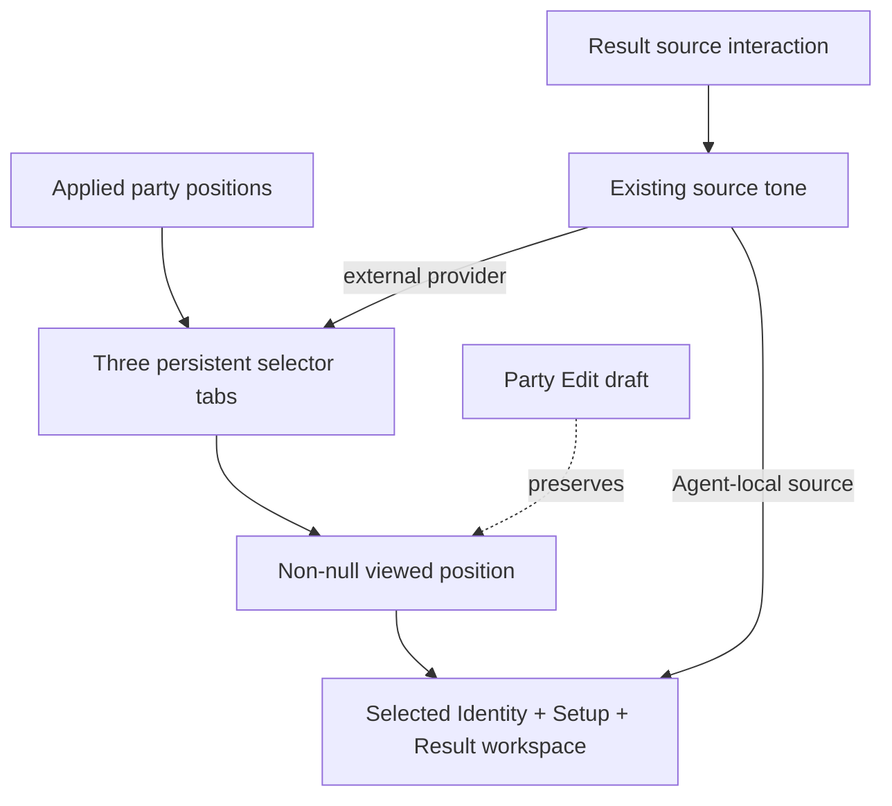

# feat: Establish the persistent party selector workspace

## Summary

Align the supporting UI records with the current permanent owner, then reshape the existing `viewedSlot` presentation into three persistent equal selectors above one selected-Agent workspace. Reuse the current source-tone, Setup, Result, portrait, and Party Edit mechanisms rather than introducing a parallel state model.

---

## Problem Frame

The production UI still makes the viewed party slot expand around Identity, Setup, and Result while the other two slots compact. That obsolete topology changes party geometry, permits an empty overview state, and can move another Agent's source target away from the Result being inspected.

---

## Requirements

- R1. Show all three applied-party selectors in one row, with equal allocation and stable party order, at desktop and narrow supported viewports (`UI-005`; origin R-001).
- R2. Keep exactly one viewed Agent and one separate Identity, Setup, and Result workspace; re-selecting the current selector is idempotent and ordered keyboard navigation never creates an empty workspace (`UI-005`; replaces origin R-002 through R-004 and R-008).
- R3. Changing the viewed Agent remains presentation-only and preserves Focus, party order, applied Setup, candidates, calculation, and Result meaning (`UI-005`; origin state-and-flow contract).
- R4. Preserve viewed, Focus, incomplete, pointer/keyboard focus, and external provider-source states without shifting selector identity; provider highlighting must not change `aria-selected` or the workspace Agent (`UI-002`, `UI-005`; origin R-006).
- R5. Preserve the current shared Identity/Setup background relationship, current full-art portrait source contract, and Identity-to-Setup-to-Result reading order while recalibrating only destination geometry (`UI-003`, `UI-004`; origin R-005 and Setup/Result requirements).
- R6. Keep current Party Edit presentation and reducer lifecycle unchanged; Cancel returns to the same viewed selector and workspace (`UI-006`, `SW-016`).
- R7. Retain every unaffected Setup selector, Result row/disclosure, action scope, gauge, source interaction, accessible label, and incomplete-state behavior while changing the shell. Remove the expanded/compact close-view meaning and update only party-selector labels and states to the persistent-tab contract (`UI-001`, `UI-002`; origin R-009 through R-035).
- R8. Verify the current implementation worktree at `127.0.0.1:5173` using the existing `1440x1000` desktop and `750x900` narrow destinations, responsive breakpoint edges, and the `320px` CSS viewport floor that also bounds browser-zoom reflow. Require one-row selector continuity, no horizontal page overflow, readable long names, and selected/Focus/incomplete/focus/source-linked state coexistence (`UI-004`, `UI-005`; origin R-036 through R-039).

---

## Scope Boundaries

- Do not add selector-specific upper-body portraits or change `scale`, `headTopY`, or `faceX`; that requires a separate `UI-003` decision.
- Do not redesign Party Edit or resolve the existing `SW-016`/`UI-006` disagreement about applied Result visibility while editing.
- Do not change candidate membership, preparation, reducer semantics, Setup values, calculation, Result projection, or source meaning.
- Do not copy Candidate C fixture markup, sample data, exact colors, or dimensions into production as authority.
- Do not perform unrelated CSS cleanup or create a general selector/layout abstraction.

### Deferred to Follow-Up Work

- Selector-specific upper-body asset sourcing and calibration: separate `UI-003` authority transaction and visual acceptance.
- Party Edit composition and edit-time applied Result visibility: separate product/authority resolution before implementation.

---

## Context & Research

### Relevant Code and Patterns

- `src/App.tsx#App` already owns `viewedSlot` as presentation state outside the workbench reducer and clears stale source interaction when the viewed identity changes.
- `src/components/PartyWorkbench.tsx#PartyWorkbench` owns ordered tab navigation, slot focus return, Focus/incomplete markers, current expanded/compact composition, and the selected workspace shell.
- `src/components/sourceInteraction.ts#agentSlotTone` and `src/components/ResultPanel.tsx#sourceTone` already bind external providers to stable applied-party positions.
- `src/components/PartyEditor.tsx#PartyEditor` and `src/workbench/state.ts#workbenchReducer` keep draft composition separate from the applied viewed position.
- `src/App.integration.test.tsx`, `src/components/ResultPanel.test.tsx`, and `tests/visual/workbench-portraits.spec.ts` provide the nearest behavioral, source-mapping, and rendered-layout coverage.

### Institutional Learnings

- `docs/solutions/workflow-issues/preserve-interaction-fidelity-in-ui-explorations-2026-08-05.md` requires Candidate C to remain a visual target while production retains every real value and interaction state.
- `docs/solutions/workflow-issues/prevent-secondary-requirements-from-validating-themselves-2026-08-12.md` requires current permanent owners and consumers—not the fixture or revised tests—to define the result.

### External References

- None. The repository has direct current patterns for every affected state and interaction boundary, and the product owner already selected the visual direction.

---

## Key Technical Decisions

- Make `viewedSlot` non-nullable instead of adding another selector state. The current presentation state already has the correct semantic isolation.
- Replace the expanded/compact component split with one uniform selector surface and one workspace identity surface. Selector tabs own party-position selection; workspace Identity owns Agent-local source linkage.
- Preserve `agentSlotTone` and Result source mapping unchanged. The layout consumes the existing tone identity rather than translating or duplicating it.
- Keep Party Edit's existing rendering branch for this unit. It may temporarily use its current compact applied identities, but it must preserve and restore the same viewed position.
- Recompose CSS around content-first selector and workspace frames. Exact dimensions are implementation-time calibration, bounded by one-row continuity and readable content.

---

## Open Questions

### Resolved During Planning

- Should the current all-collapsed overview remain? No; `UI-005` requires exactly one viewed Agent and no all-unselected workspace state.
- Should the selector use Candidate C upper-body assets now? No; current `UI-003` retains shared portrait sourcing until a separate accepted decision.
- Should provider-source focus select the provider Agent? No; it highlights the provider selector while leaving viewed selection unchanged.

### Deferred to Implementation

- Exact selector height, name wrapping threshold, diagonal cut, and narrow typography require browser comparison against real long-name parties; they cannot be settled from DOM structure alone. The displayed Agent-image viewport is the selector-height floor, every selector shares that fixed height, and full Agent identity remains available through its accessible name when visible wrapping is constrained.
- Whether a focused component test is clearer than extending the integration suite depends on the final component boundary; coverage obligations remain fixed either way.

---

## High-Level Technical Design

> This illustrates the intended approach and is directional guidance for review, not implementation specification. The implementing agent should treat it as context, not code to reproduce.

---

## Implementation Units

- U1. **Correct supporting UI records**

**Goal:** Remove stale expanded/compact ordinary-view language and describe the accepted selector/workspace outcome without changing unrelated Setup or Result requirements.

**Requirements:** R1–R8

**Dependencies:** Accepted `ACR-2026-09-03-002`, accepted `ACR-2026-09-03-003`, and the merged `UI-005`/`UI-006` owner amendment.

**Files:**
- Modify: `docs/brainstorms/2026-08-02-agent-slot-setup-result-ui-requirements.md`
- Modify: `docs/brainstorms/2026-08-03-zzz-style-and-integrated-slot-direction.md`

**Approach:**
- Replace only ordinary-view topology, terminology, acceptance examples, and deferred calibration references that conflict with the permanent owner.
- Retain all unaffected Setup, Result, gauge, action, source, and visual-philosophy decisions.

**Patterns to follow:**
- Current `UI-005` and `UI-006` wording in `docs/workbench-ui-design-rules.md`.

**Test scenarios:**
- Test expectation: none — this unit corrects subordinate documentation and is verified by Rule-ID governance plus exact diff review.

**Verification:**
- Neither supporting record claims that an applied party slot expands or that narrow viewports stack the three selectors.

---

- U2. **Separate selector behavior from the selected workspace**

**Goal:** Render three persistent tabs and one workspace while preserving all unaffected Setup, Result, editing, navigation, and source-link behavior as the obsolete collapse/overview interaction is replaced.

**Requirements:** R1–R7

**Dependencies:** U1

**Files:**
- Modify: `src/App.tsx`
- Modify: `src/components/PartyWorkbench.tsx`
- Modify: `src/App.integration.test.tsx`
- Test: `src/components/PartyWorkbench.test.tsx` if a focused component seam materially improves coverage

**Approach:**
- Make the viewed position always valid and remove nullable rendering branches.
- Remove the `ExpandedIdentity`/`CompactSlot` ordinary-view split and the selected-slot action that closes the workspace; do not preserve labels or tests that describe that deleted interaction.
- Give each equal selector one shared tab structure, direct keyboard navigation, Focus/incomplete state, and applied-position source tone. Generate its Agent name from the current slot data, expose selection through `aria-selected`, and use persistent-view wording rather than selected-versus-compact action wording.
- Move the expanded Identity and existing Setup/Result children into one tabpanel workspace after the selector list.
- Preserve the current Party Edit branch and unchanged draft/applied state boundary.

**Execution note:** Add or update behavior coverage before removing the collapse path so the retained view-only and source-link semantics stay observable.

**Patterns to follow:**
- Existing `navigateSlots`, focus-return effect, `identityTones`, and `agentSlotTone` consumption in `PartyWorkbench`.
- Existing provider-slot derivation in `ResultPanel.test.tsx`.

**Test scenarios:**
- Happy path: initial render exposes three ordered tabs, exactly one selected tab, and one workspace for that Agent.
- Happy path: edit a Setup value for one position, select another position, return to the original position, and confirm its edit remains while neither Agent's applied Setup was mutated by view selection.
- Edge case: re-selecting the current tab leaves it selected and keeps the workspace mounted.
- Accessibility: every selector exposes its current Agent dynamically, exactly one selector is selected, and no label advertises closing or collapsing the workspace.
- Edge case: Arrow, Home, and End navigation move directly among all three tabs, including wraparound, with no missing tabpanel.
- Integration: hovering and keyboard-focusing an external provider source highlights the provider selector while the original viewed tab remains selected.
- Integration: pointer leave and keyboard blur clear that provider tone without changing the viewed selector or workspace; closing or unmounting the owning disclosure clears it through the existing teardown path.
- Integration: changing the viewed selector while a provider source is active clears the stale tone, for both pointer and keyboard activation; changed-party Apply also clears it when the viewed identity key changes.
- Integration: activating an Agent-local source by pointer and keyboard terminates its tone at the workspace Identity locus, does not select or falsely highlight another selector, and clears on interaction end.
- Integration: open Party Edit, change at least one draft party selection, then cancel; the same selected tab/workspace returns, applied party and Setup remain unchanged, and no draft Agent appears in the restored workspace.
- Integration: applying a changed party while viewing position two retains position two and displays the newly applied Agent there.

**Testing delta:**
- New mechanism or materially distinct visible failure: persistent non-null tab selection, provider highlight without selection, and Cancel restoration after removing expanded geometry.
- Nearest existing coverage: the opening and source-link flows in `src/App.integration.test.tsx`, plus provider tone derivation in `src/components/ResultPanel.test.tsx`.
- Exact uncovered failure: existing tests permit closing the selected slot, do not prove external provider tone terminates at a persistent selector, and do not prove Cancel returns to the same workspace.
- Name/value independence: assertions use tab roles, applied positions, unchanged selection, and state preservation, so equivalent Agent fixtures remain meaningful.
- Test change: replace collapse assertions and add the three mechanism flows above.

**Verification:**
- Ordinary viewing always has three tabs and one tabpanel; no interaction changes workbench semantic state unless it already did before this unit.

---

- U3. **Recompose the ZZZ-inspired selector and workspace frames**

**Goal:** Apply the accepted Candidate C structural direction to production CSS while retaining readable content and the current shared Identity/Setup backdrop.

**Requirements:** R1, R4, R5, R7, R8

**Dependencies:** U2

**Files:**
- Modify: `src/app.css`
- Modify: `tests/visual/workbench-portraits.spec.ts`
- Modify: visual snapshot artifacts owned by that spec when the reviewed result changes

**Approach:**
- Remove view-position and ordinary overview grid variants; keep the selector rail at three equal columns on desktop and narrow viewports.
- Transfer the expanded-slot chassis to the separate workspace and retain Identity/Setup as one backdrop with Result materially distinct.
- Give all three selectors one fixed frame whose height cannot be lower than its displayed Agent-image viewport; states never resize a selector.
- Compose selected as the stable base state, Focus and incomplete as reserved identity markers, keyboard focus as an outer focus-visible treatment, and source-active as the existing tone treatment. All applicable states remain simultaneously visible and exposed through existing selection/state semantics without moving names or portraits.
- Calibrate with real content and current portrait assets; do not shrink all typography to preserve obsolete dimensions.

**Patterns to follow:**
- Existing content-first sizing and controlled-penetration rules in `UI-004`.
- Current identity portrait metadata and source-active tone classes.

**Test scenarios:**
- Happy path: desktop and narrow captures show three selectors in one row and one Identity/Setup/Result workspace with no page-level horizontal overflow.
- Edge case: a long-name party remains identifiable without covering status markers or adjacent selectors.
- Edge case: viewed, Focus, and external provider-source states on different slots remain visually distinguishable.
- Edge case: selected + Focus + source and selected + incomplete + focus-visible remain simultaneously perceptible on one fixed-size selector without collision or geometry shift.
- Responsive boundary: verify `1440x1000`, `750x900`, both sides of affected CSS breakpoints, and the `320px` CSS viewport floor. Treat CSS viewport reflow as the browser-zoom geometry boundary rather than maintaining a separate pixel-zoom layout.
- Integration: workspace extraction preserves the shared Identity/Setup background, portrait clipping boundary, and readable Setup/Result content.
- Accessibility: keyboard focus is visible on each selector and does not rely on color alone.

**Testing delta:**
- New mechanism or materially distinct visible failure: the visual destination changes from expanded/compact slots to a persistent narrow selector plus detached workspace at two viewport families.
- Nearest existing coverage: `tests/visual/workbench-portraits.spec.ts` expanded/compact portrait destinations.
- Exact uncovered failure: existing snapshots cannot detect selector stacking, workspace seam breakage, or marker collisions in the new topology.
- Name/value independence: the visual cases exercise long/short identity footprints and distinct state combinations rather than freezing one Agent's values.
- Test change: replace obsolete topology captures with selector/workspace desktop and narrow cases; retain source metadata only as unchanged input.

**Verification:**
- Reject any pre-existing listener on port `5173`, start this implementation worktree's strict-port dev server, and verify the served module identity before browser or Playwright review.
- Browser review then accepts desktop, narrow, breakpoint-edge, and minimum-CSS-viewport composition, interaction states, and overflow behavior without portrait metadata changes.

---

- U4. **Close the bounded implementation plan**

**Goal:** Preserve only durable requirements, code/tests, and a compact completed milestone before the immutable final-head governance cycle.

**Requirements:** R1–R8

**Dependencies:** U1–U3

**Files:**
- Modify: `docs/plans/README.md`
- Delete after a committed checkpoint: `docs/plans/2026-09-03-001-feat-persistent-party-selector-plan.md`

**Approach:**
- Commit the active plan before implementation detail is removed.
- Run provisional local behavior, build, and browser verification after U1–U3.
- Then add one compact milestone and delete the completed plan body.
- Only after that final content commit, run the complete final-head behavior, type, build, visual, independent-review, governance-evidence, and owner-approval sequence against the immutable PR head.

**Test scenarios:**
- Test expectation: none — completion is verified by repository status, the milestone link set, and the completed implementation gates.

**Verification:**
- No active plan remains, the milestone points to current UI authorities, supporting requirements, and production consumers, and every protected gate binds the resulting final head.

---

## System-Wide Impact

- **Interaction graph:** selector activation changes local viewed position; that position chooses workspace inputs and Result; existing source tones independently highlight either a party selector or workspace locus.
- **Error propagation:** no new error path; invalid party or calculation state remains owned by existing reducer and Result rendering.
- **State lifecycle risks:** nullable overview removal, Party Edit preservation, and stale source-tone clearing are the only state-sensitive seams.
- **API surface parity:** no external API, persistence, schema, or agent content change.
- **Integration coverage:** view selection, provider source linkage, Cancel restoration, and changed-party Apply cross App, PartyWorkbench, ResultPanel, PartyEditor, and reducer boundaries.
- **Unchanged invariants:** all Setup inputs, candidates, prepared choices, calculations, Result values, disclosure hierarchy, source meaning, and portrait metadata remain unchanged.

---

## Risks & Dependencies

| Risk | Mitigation |
| --- | --- |
| Three narrow selectors collide with long names and multiple markers | Reserve marker geometry, test a long-name party, and calibrate desktop/narrow separately without stacking the rail |
| Moving Identity breaks the shared Identity/Setup backdrop or portrait clipping | Transfer the existing chassis responsibilities as one workspace and verify the seam visually |
| External source hover accidentally changes viewed selection | Keep tone state independent and assert `aria-selected` plus workspace identity during hover and focus |
| Party Edit work expands into this unit | Preserve the current edit branch and test only same-view Cancel restoration |
| Candidate C fixture incompleteness leaks into production | Inventory current production interactions and retain existing children rather than copying fixture markup |

---

## Documentation / Operational Notes

- This shared UI change is protected and requires an exact Authority trace, independent exact-head review evidence, successful behavior/type/build/visual contexts, and fresh owner approval.
- `npm run check` does not include Playwright visual tests; visual verification remains a separate completion gate.

---

## Sources & References

- **Origin document:** `docs/brainstorms/2026-08-02-agent-slot-setup-result-ui-requirements.md`
- Supporting design record: `docs/brainstorms/2026-08-03-zzz-style-and-integrated-slot-direction.md`
- Permanent owners: `docs/workbench-ui-design-rules.md` (`UI-001` through `UI-006`) and `docs/setup-workbench-product-contract.md` (`SW-016`)
- Accepted decisions: `docs/authority-changes/2026-09-03-002-party-selector-workspace.md`, `docs/authority-changes/2026-09-03-003-party-edit-view-restoration.md`
- Current consumers: `src/App.tsx`, `src/components/PartyWorkbench.tsx`, `src/components/ResultPanel.tsx`, `src/components/PartyEditor.tsx`, `src/components/sourceInteraction.ts`, `src/workbench/state.ts`
