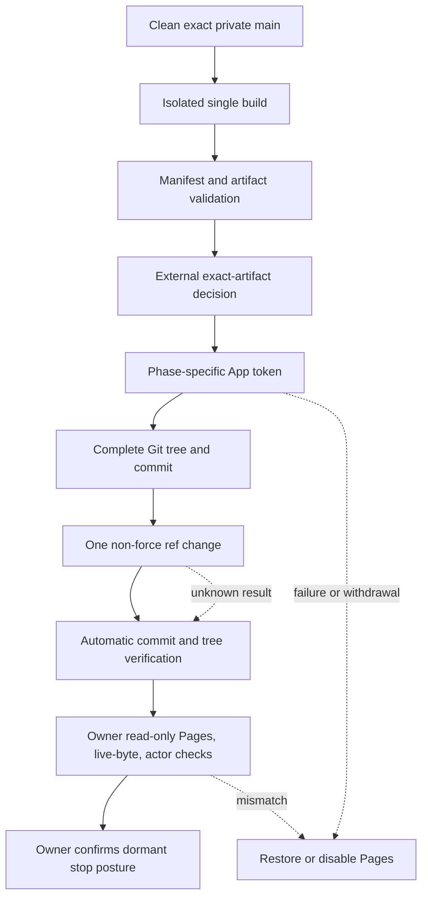
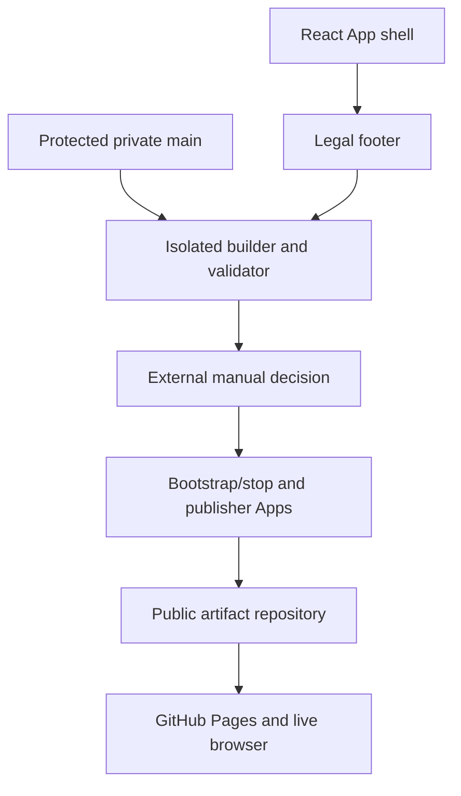

# feat: Add privacy-preserving public static RC delivery

## Summary

Add the shared legal footer and a private, local release controller that builds
one exact `main` artifact, validates every emitted byte, binds it to a fresh
manual release decision, and publishes it through separate least-privilege
GitHub Apps. The implementation stops at dry-run and local/browser proof until
the owner supplies the neutral Organization/App configuration and accepts the
exact artifact for public release.

---

## Problem Frame

The client is already statically buildable, but neither the private source
repository nor the operator's personal GitHub identity may become part of the
public product surface. Public delivery also needs an exact-artifact legal gate,
atomic destination updates, and a tested stop path; a passing Vite build alone
does not establish any of those properties.

---

## Requirements

- PR1. Preserve the neutral Organization and artifact-only public repository
  boundary, including App-only public mutation and release metadata limited to
  the configured neutral Apps plus explicitly accepted provider service actors.
- PR2. Build once from a clean exact `main` checkout with Node 24 and the current
  lockfile, then derive a deterministic private manifest and artifact-tree
  digest without publishing private source identity or release evidence.
- PR3. Reject any output outside the minimum static tree, including source maps,
  symlinks, unexpected paths or types, credentials, personal/private identity,
  absolute local paths, and external resource or request targets.
- PR4. Require a fresh repository-external manual decision bound to the exact
  artifact, manifest, footer wording, operator/use model, and served
  jurisdictions before any public write; never infer rights from filenames,
  notices, or tests.
- PR5. Keep bootstrap/stop authority separate from the contents-only routine
  publisher, read each fresh key only after non-credential gates pass, scope the
  installation token, and confirm revocation after every outcome.
- PR6. Publish one complete artifact snapshot with one non-force branch-ref
  change bound to the inspected tip and verify the exact commit and tree before
  reporting content success. Keep Pages, live bytes, and allowed public actors
  open until the owner completes the read-only checklist.
- PR7. Provide fixed, phase-specific bootstrap, steady publication, restore, and
  Pages-disable operations plus a read-only/manual verification guide, without a
  generic administrator or automated repository delete/recreate command.
- PR8. Render one readable, non-interactive legal attribution footer after the
  application content in initial Party Edit and applied-workbench states, while
  preserving Setup, Result, party lifecycle, and fresh-session behavior.
- PR9. Prove the delivery and stop mechanisms with generic tests and a no-network
  mock transport; prove the footer and built/live client at desktop and narrow
  viewports without creating an Agent or asset catalogue.
- PR10. Keep the live first publication, private App/key rotation, exact-artifact
  legal acceptance, public identity inspection, and Beta announcement as
  explicit owner-controlled gates after implementation.

**Origin actors:** A1 (product owner), A2 (private release controller), A3
(neutral bootstrap/stop App), A4 (neutral publisher App), A5 (GitHub Pages),
A6 (public visitor).

**Origin flows:** F1 (neutral delivery bootstrap), F2 (candidate build and
release gate), F3 (one-way publication), F4 (RC verification and Beta
announcement), F5 (failed or withdrawn release).

**Origin acceptance examples:** AE1 (artifact and identity rejection), AE2
(exact-artifact manual gate), AE3 (bootstrap and publisher separation), AE4
(shared client/footer/network boundary), AE5 (same-URL RC and Beta), AE6
(credential cleanup, emergency stop, and manual incident recovery).

---

## Scope Boundaries

- Do not publish, mirror, clone, or expose the private source repository or its
  history in the public destination.
- Do not add GitHub Actions secret-based deployment, a custom domain, backend,
  account, persistence, storage, service worker, analytics, telemetry, feedback
  UI, Issue template, RC/Beta client mode, or Copy/URL sharing feature.
- Do not reuse or generalize the existing private-repository PR launcher into a
  shared credential path; the public Apps keep separate identities, permissions,
  and command schemas.
- Do not store an artifact manifest, release decision, private source revision,
  operational configuration, key, or token in the public tree.
- Do not encode asset rights in a permanent registry or infer legal acceptance
  from a successful validator, footer presence, or repository ownership.
- Do not let the stop or manual recovery path claim that it retracts forks, clones, archives,
  caches, or other external copies.

### Deferred to Follow-Up Work

- Live public bootstrap and the first RC write: perform only after the owner has
  created the neutral Organization and two Apps, supplied fresh external
  credentials/configuration, reverified current provider behavior, and accepted
  the exact built artifact under Origin R7-R10.
- Public Beta announcement and community feedback operation: perform only after
  the same live RC passes the defined browser, identity, credential-retirement,
  and dormant-stop checks.

---

## Context & Research

### Relevant Code and Patterns

- `src/App.tsx#App` owns the single shell around both initial Party Edit and the
  applied workbench, so the footer belongs once after `main` rather than in
  either state-specific component.
- `src/styles/production/layout.css` owns final page geometry. The footer should
  remain in document flow without reducing the existing independently scrolling
  workspace regions. The document scroll owns footer reachability; reaching it
  must not change the scroll offsets or focus state of those internal regions.
- `src/App.integration.test.tsx` already exercises both application states and
  is the nearest behavior-test surface for one shared `contentinfo` region.
- `tests/visual/workbench-controls.spec.ts` and
  `tests/visual/support/workbench-page.ts` provide fixed-port desktop/narrow
  browser fixtures, runtime-failure capture, and fresh-session navigation.
- `package.json#build` and `.github/workflows/pr-validation.yml` establish Node
  24, `npm ci --ignore-scripts`, TypeScript, and Vite as the current production
  build boundary. `vite.config.ts` has no alternate base, matching a root Pages
  repository.
- `scripts/github-app/run-as-installation.mjs` demonstrates short App JWTs,
  absolute external PEM validation, exact checkout proof, scoped token minting,
  `finally` revocation, fixed operation schemas, and reconciliation. Its fixed
  private-repository identity and PR permissions are intentionally not reused.
- `scripts/governance/check-policy.mjs#categoryForPath` classifies only
  `scripts/github-app/**` as an allowed governance path for this tooling; a new
  `scripts/release/**` tree would fail closed as unknown.

### Institutional Learnings

- `docs/solutions/workflow-issues/prevent-secondary-requirements-from-validating-themselves-2026-08-12.md`
  requires permanent-owner and current-consumer checks before tests; build,
  requirement, and test agreement cannot establish the release boundary.
- `docs/solutions/workflow-issues/preserve-interaction-fidelity-in-ui-explorations-2026-08-05.md`
  requires semantic and interaction parity before visual polish, including
  desktop/narrow, focus, overflow, and current open/closed UI states.

### External References

- [GitHub REST API versions](https://docs.github.com/en/rest/about-the-rest-api/api-versions?apiVersion=2026-03-10)
  establishes `2026-03-10` as the current pinned API version.
- [Generating a GitHub App JWT](https://docs.github.com/en/apps/creating-github-apps/authenticating-with-a-github-app/generating-a-json-web-token-jwt-for-a-github-app)
  and [installation access tokens](https://docs.github.com/en/apps/creating-github-apps/authenticating-with-a-github-app/generating-an-installation-access-token-for-a-github-app)
  define short JWTs, narrowed installation tokens, and the variable-length 2026
  token format.
- [Git database endpoints](https://docs.github.com/en/rest/git?apiVersion=2026-03-10)
  support blobs, complete trees, commits, and one non-force ref update.
- [Repository rulesets](https://docs.github.com/en/rest/repos/rules?apiVersion=2026-03-10)
  support an `Integration` bypass actor while keeping deletion,
  non-fast-forward, and direct-update protection active.
- [GitHub Pages endpoints](https://docs.github.com/en/rest/pages/pages?apiVersion=2026-03-10)
  support branch-root Pages configuration, build inspection, and fail-closed
  unpublishing.
- [GitHub REST best practices](https://docs.github.com/en/rest/using-the-rest-api/best-practices-for-using-the-rest-api)
  require serialized mutations and bounded handling of rate limits and retries.

---

## Key Technical Decisions

| Decision | Rationale |
| --- | --- |
| Keep the footer inline in `App` | It has one consumer and no state; a separate component or runtime legal configuration would add indirection and risk a second client variant. |
| Extract the verified commit object into a temporary build root | Reading blobs from the exact verified Git tree, rather than copying the mutable checkout, closes the clean-check time-of-check/time-of-use gap and proves pre-existing `node_modules` and `dist` cannot participate. |
| Emit and validate a restrictive document CSP | Literal output scans and representative browser flows cannot close dynamically constructed cross-origin requests. The one client therefore admits document and runtime resources only from its own origin, with the minimum data-image allowance already required by emitted assets. |
| Keep operational configuration and manual release evidence in exact-schema files at external absolute paths | The controller needs resumable, digest-bound handoffs across owner actions, but neither public output nor the repository should become a release registry. The versioned decision record canonically binds accepted/rejected state, private source and build identity, artifact/manifest/footer digests, operator/use model, served jurisdictions, reviewed-guidance identity, issuer, and issue time; freshness is exact equality with every current release input and an explicit confirmation that no R10 invalidator has changed. |
| Use a versioned SHA-256 artifact identity | Canonical UTF-8 framing length-delimits each normalized path, file mode, byte size, and raw-file SHA-256. Unknown versions or algorithms fail in decision, publication, reconciliation, and restore flows. |
| Implement public delivery under a separate `scripts/github-app/` family | It preserves the public/private App boundary and fits the trusted path classifier without widening governance for a new top-level script category. A parent mints the token only after preflight and passes it through the narrow environment of one fixed publishing child; the token never enters command arguments or a general inherited environment. |
| Use Git Data objects and one ref mutation | Per-file Contents commits would expose partial trees; a complete tree plus one non-force update makes one public commit the artifact identity. |
| Split the workflow into narrow resumable phases | Organization/App setup, live RC checks, key rotation, and permission removal are owner actions separated in time; one long-running mutable process cannot safely span them. |
| Treat ambiguous mutation or revocation as a reconciliation state, never success | Network failure after a write can leave accepted bytes live or a credential active. Blind retry could fork history, publish twice, or conceal an exposed token. |
| Pin current provider contracts but keep live capability probes fail-closed | GitHub supports the planned endpoints today, while the contents-only publisher's automatic branch-Pages trigger still requires a live bootstrap proof and must not be solved by silently widening permissions. |

---

## Open Questions

### Resolved During Planning

- How does the controller consume the manual Origin R7-R10 decision? A fresh external
  versioned exact-schema receipt canonically binds approval state, source/build
  identity, artifact-tree, manifest, and footer wording digests, operator/use
  model, the actual unrestricted worldwide GitHub Pages reach, immutable
  reviewed-guidance identifiers/content digests, issuer, issue time, and an
  explicit `notAfter`. It is fresh only while all bound release inputs remain
  exactly equal, the current time is not after that reviewer-selected boundary,
  and the owner supplies a phase-local revalidation that no Origin R10
  invalidator has changed. A jurisdiction subset cannot authorize globally
  reachable Pages; null, empty, malformed, rejected, expired, stale, or
  mismatched input stops before key access. Restore requires its own still-current
  receipt, and Beta readiness requires a new phase-local revalidation rather
  than treating the RC decision as perpetually current.
- How does bootstrap resume across private owner actions? Each narrow phase
  revalidates the same external configuration, receipt, destination state, and
  expected public tip rather than trusting repository-local mutable state.
- How is a prior artifact selected for restore? The operator supplies its own
  still-current external acceptance receipt and public commit/tree binding; Git
  history or an old build alone cannot establish continuing support.
- How is the publisher App installed before the destination exists? Preserve the
  origin's dedicated-Organization design: the publisher App is installed for
  all current and future repositories while the Organization is empty, and
  Origin R2 constrains that grant to the single eventual destination.
- How is the first branch created in an empty repository? Create the destination
  privately, use the bootstrap App to establish one private root commit
  containing only the allowed `.nojekyll` host file, then create the complete
  accepted artifact commit as its parent-bound successor. Revalidate the final
  tree and ruleset before making the repository public, so no partial tree is
  ever public or served and the bootstrap history contains no non-runtime file.

### Deferred to Implementation

- Which inert dependency diagnostic URL strings appear in the exact built
  bundle? Discover them from the one generated artifact, require a specific
  non-requesting justification, and keep the exception minimal rather than
  predicting bundle contents in the plan.
- Can a contents-only App ref update trigger branch-based Pages on the live
  destination under current provider behavior? The local implementation keeps
  the narrow permission model; the live bootstrap probe must pass or public
  publication stops for a new product/governance decision.
- Which public provider/system actors appear in the first real Pages deployment?
  The owner must accept a fixed observed allowlist after current unauthenticated
  inspection; accepting every account of type `Bot` is not sufficient.
- How are eventually consistent public event/contributor surfaces closed? The
  live verifier returns a resumable pending result until every required surface
  is observable through the current documented propagation bound. An empty or
  incomplete response does not prove absence; expiry of that bound without
  inspectable evidence fails the gate.

---

## Output Structure

    scripts/github-app/
      public-release-artifact.mjs
      public-release-artifact.node.mjs
      public-release-github.mjs
      public-release-github.node.mjs
      public-release.mjs
      public-release.node.mjs
    tests/visual/
      public-release.spec.ts

---

## High-Level Technical Design

> *This illustrates the intended approach and is directional guidance for
> review, not implementation specification. The implementing agent should treat
> it as context, not code to reproduce.*

Every phase before `Auth` is non-credentialed. Every mutating phase uses one
fixed command schema, revalidates its expected state, and ends only after token
revocation is confirmed. Private receipts and revision bindings remain outside
the public tree.

---

## Implementation Units

- U1. **Add the shared legal attribution footer**

**Goal:** Render one candidate legal statement in both application states as a
readable, visually subordinate, non-interactive page footer without changing
the workbench's existing controls or scroll geometry.

**Requirements:** PR8, PR9; F4; AE4.

**Dependencies:** None.

**Files:**
- Modify: `src/App.tsx`
- Modify: `index.html`
- Modify: `src/styles/production/layout.css`
- Modify: `src/styles/production/skin.css`
- Test: `src/App.integration.test.tsx`
- Create/Test: `tests/visual/public-release.spec.ts`

**Approach:**
- Place one semantic `footer` after `main` inside the shared shell and render the
  current candidate wording in a fixed hierarchy: the required English
  unofficial/non-commercial, non-sponsorship/endorsement/approval, copyright,
  and trademark statement first; a concise Korean explanatory summary second.
  Both passages remain children of the same `footer`.
- Keep the footer in normal document flow, with no focusable or clickable
  descendants. The page/document scroll reaches it while the current desktop
  pane scroll offsets and focused control remain unchanged.
- Add an early restrictive CSP to `index.html`: no remote default, connection,
  script, style, font, media, object, frame, worker, or form target; permit only
  the exact same-origin and data-image needs demonstrated by the built client.
  Artifact validation owns the exact directive admission check.
- Treat the checked-in text as the exact wording candidate whose built bytes
  still require Origin R8 acceptance before publication.

**Patterns to follow:**
- `src/App.tsx#App` shared-shell composition.
- `src/styles/production/layout.css` responsive geometry and
  `src/styles/production/skin.css` final visual hierarchy.

**Testing delta:** New visible mechanism: a persistent legal `contentinfo`
boundary shared by initial and applied states. Nearest coverage:
`src/App.integration.test.tsx` state transitions and
`tests/visual/workbench-controls.spec.ts` desktop/narrow geometry. Existing
coverage cannot prove footer uniqueness, DOM order, non-interactivity,
readability, or overflow. Assertions remain meaningful with any equivalent
party fixture and do not name an Agent.

**Test scenarios:**
- Covers AE4. Happy path: initial Party Edit and an applied party each render
  exactly one `contentinfo` after `main` with identical complete wording.
- Accessibility: the footer contains no link, button, form control, positive
  tab index, or other tabbable descendant.
- Visual integration: at desktop and narrow widths, initial and applied views
  keep the footer readable below content with no horizontal overflow or control
  overlap.
- Interaction: document scrolling reaches the footer and returns to the
  workbench without changing internal Setup/Result pane offsets or focus;
  keyboard traversal and existing party controls remain reachable, and applying
  a party changes the workbench but not footer identity or content.
- Geometry: bounded anchors for the masthead, `main`, party controls, workspace,
  and existing pane rectangles are unchanged above the main/footer seam; the
  footer begins at or after the `main` boundary rather than displacing it.

**Verification:** Setup/Result output and party behavior remain unchanged, while
the footer is present once on all four required visual surfaces.

---

- U2. **Build and validate one exact public artifact**

**Goal:** Produce a deterministic private release bundle from a clean exact
`main` source, with a complete manifest and digest, while rejecting any byte
outside the public static-client boundary.

**Requirements:** PR2, PR3, PR4, PR9; F2; AE1-AE2.

**Dependencies:** U1, because footer bytes participate in the artifact and its
manual decision.

**Files:**
- Create: `scripts/github-app/public-release-artifact.mjs`
- Create/Test: `scripts/github-app/public-release-artifact.node.mjs`
- Modify: `vite.config.ts`

**Approach:**
- Verify the trusted controller path, expected private remote, clean branch, and
  exact `origin/main`, then extract build inputs directly from that immutable
  verified Git commit object into a temporary root. Verify the extracted tree
  identity before installation; never copy build bytes from the mutable checkout.
- Require Node 24, seal the absolute `npm-cli.js` plus the canonical complete
  regular-file npm package tree that it loads, reject symlinks and unsupported
  entries, and execute that CLI through the sealed Node executable with
  `shell: false`; install the exact npm
  lockfile with lifecycle scripts disabled, run the production build once, then
  add only the fixed host control file. Give Git and npm distinct exact minimal
  environments so ambient Git repository/config overrides, Node preload options,
  npm user/global configuration, credentials, and private release values never reach a
  direct child process; reject a project `.npmrc` from the extracted source.
- Walk regular output files in canonical path order; reject symlinks, path
  ambiguity, unexpected locations/extensions, source maps, suspicious secret or
  private identity content, absolute paths, and external resource/request
  targets.
- Require and parse the exact CSP before admitting output; reject missing,
  duplicate, relaxed, or remote-capable directives and prove a dynamically
  constructed cross-origin request is browser-blocked.
- Disable Vite's module-preload polyfill for the current single-chunk client so
  generated output does not carry an otherwise unused executable `fetch` path;
  do not misclassify it as an inert diagnostic exception.
- Compute separate canonical manifest and artifact-tree digests with the
  versioned SHA-256 framing contract: UTF-8 encode and length-delimit every
  normalized path, regular-file mode, byte size, and raw-file SHA-256 in sorted
  canonical-path order. Produce a private candidate receipt/decision template
  plus a separate current trusted-controller commit/tree, Git, Node, complete
  npm package tree, child, and destination seal outside the public tree. Unknown identity versions or digest
  algorithms fail closed everywhere the identity is consumed.

**Patterns to follow:**
- `package.json#build` and `.github/workflows/pr-validation.yml` for the build
  boundary.
- Pre-key checkout proof and error redaction in
  `scripts/github-app/run-as-installation.mjs`.

**Testing delta:** New mechanism: generated-tree admission and exact-artifact
binding. Nearest coverage is the CI production build, which cannot prove build
isolation, complete output admission, private-data rejection, deterministic
ordering/digests, or manual-decision matching. Tests use generic temporary files
and remain valid when every named game asset changes.

**Test scenarios:**
- Covers AE1. Happy path: a minimal `index.html`, hashed same-origin JS/CSS/image
  tree, and fixed host file yields stable sorted manifests and digests.
- Error paths: source map, symlink, traversal/backslash/case collision,
  unexpected root file/type, private URL or identity, credential-like text,
  absolute user path, or external resource/request target fails validation.
- Edge case: an inventoried inert diagnostic URL is accepted only by an exact
  documented non-requesting exception and remains visible in the private report.
- CSP: the required policy is unique and exact; a relaxed `connect-src`, omitted
  directive, or dynamically constructed cross-origin request fails admission or
  is blocked by the browser.
- Build orchestration: dirty/stale/wrong-remote/wrong-branch/wrong-Node checkout,
  pre-existing dependency participation, failed install, or second build attempt
  fails before any key-read callback.
- Covers AE2. Manual gate: absent, rejected, stale, manifest-mismatched,
  artifact-mismatched, or footer-mismatched external decision cannot advance;
  exact accepted input can.
- Legal reach/freshness: a jurisdiction subset, unknown guidance identity,
  mismatched guidance digest, expired `notAfter`, or missing phase-local owner
  revalidation fails before authentication; the unrestricted worldwide host
  reach is the only accepted delivery scope for this architecture.

**Verification:** The accepted bundle contains only derived runtime output and
the host file; no source revision, manifest, receipt, or operational value is
inside it.

---

- U3. **Add separate App authentication and atomic artifact publication**

**Goal:** Mint narrowly scoped tokens for the configured public Apps and publish
an exact artifact tree without sharing the private PR launcher's identity or
permissions.

**Requirements:** PR1, PR5, PR6, PR9; F3; AE3.

**Dependencies:** U2.

**Files:**
- Create: `scripts/github-app/public-release-github.mjs`
- Create/Test: `scripts/github-app/public-release-github.node.mjs`

**Approach:**
- Validate one external exact-schema operational configuration containing the
  neutral destination, App/installation identities, bot identities, actor
  allowlists, forbidden private identifiers, and absolute external key paths.
- Pin GitHub REST `2026-03-10`, verify App ownership/installation/permissions,
  mint a phase-minimum token without assuming a fixed token length, and redact
  all credential-bearing failures.
- Pass the token only in the narrow environment of one fixed publishing child.
  The parent retains no general credential environment, and both parent and
  child own a bounded revocation fallback for error, timeout, or interruption.
- Upload blobs, create a complete tree without inheriting a base tree, create a
  root or one-parent commit with no custom personal author/committer, and perform
  one non-force ref creation/update after rechecking the expected destination
  tip.
- Always attempt immediate token revocation; signal or timeout paths become an
  explicit failed/reconcile-required result until remote state and revocation
  are proven.

**Patterns to follow:**
- JWT, external PEM, token scope, cleanup, and reconciliation principles from
  `scripts/github-app/run-as-installation.mjs`, implemented independently for
  the public Apps.
- GitHub Git Data API complete-tree semantics and bot-authored commits.

**Testing delta:** New security mechanism: phase-scoped public App tokens and
one-ref exact-tree publication. Nearest coverage is
`scripts/github-app/run-as-installation.node.mjs`, which is fixed to private PR
operations and cannot prove public App separation, complete-tree replacement,
stale-tip rejection, bot-only metadata, or variable-length tokens. Mocked tests
remain identity-generic through injected fixtures.

**Test scenarios:**
- Authentication: wrong App owner/ID, installation target, repository scope, or
  broader/insufficient permissions fails without exposing the key, JWT, or
  token.
- Happy path: bootstrap and publisher fixtures each mint only their allowed
  permissions, write all blobs/tree/commit, change one ref, re-read the exact
  commit/tree, and confirm revocation.
- Concurrency: changed destination tip or non-fast-forward result aborts without
  rebuilding against the new tip or force-updating it.
- Unknown result: a timed-out ref update reconciles only when the exact expected
  commit/tree is observed; any other state remains failed.
- Cleanup: success, known failure, thrown error, and simulated interruption all
  attempt revocation; unconfirmed revocation makes the operation fail.

**Verification:** Only the fixed publishing child receives the token, and only
through its narrow environment; no argument, general inherited environment,
log, public commit, or artifact receives a credential or private-source
identity, and one public commit maps to one complete accepted tree.

---

- U4. **Orchestrate bootstrap, steady publication, and manual live handoff**

**Goal:** Expose only fixed phase commands that create/harden the destination,
publish accepted artifacts, restore accepted artifacts, and disable Pages,
while keeping live/public identity verification explicit and read-only.

**Requirements:** PR1, PR4-PR7, PR9-PR10; F1, F3-F4; AE3-AE5.

**Dependencies:** U2, U3.

**Files:**
- Create: `scripts/github-app/public-release.mjs`
- Create/Test: `scripts/github-app/public-release.node.mjs`

**Approach:**
- Provide exact-schema phases for candidate preparation, initial bootstrap,
  steady publish, restore, and Pages disable. Live RC, dormant transition, and
  Beta readiness remain explicit owner-run read-only checks against current
  GitHub and browser state rather than caller-authored snapshots.
- Bootstrap a private empty root repository, create the initial accepted tree,
  first establish the allowed private `.nojekyll` root required by GitHub's
  empty-repository ref constraint, then create the complete accepted successor
  tree. Install an active branch ruleset whose sole routine update bypass is the
  publisher App, switch to public, re-read protection, enable branch-root Pages,
  and verify the resulting repository commit and tree before reporting content
  success. Do not report live RC readiness from this mutation result.
- Provide an owner-run read-only checklist for repository/org membership,
  commit author/committer, contributor, Pages-build pusher, provider-run actor,
  and relevant release event surfaces against exact configured identities;
  keep community Issue authors outside the release-actor assertion.
- Treat incomplete eventually consistent contributor/event evidence as an open
  manual gate. The owner waits for the documented observation window and blocks
  announcement if evidence remains absent or uninspectable.
- Require the owner to compare the exact Pages build commit and every private-
  manifest URL at the final root URL, including status, bytes, and same-origin
  runtime requests.
- Require the owner to recheck tip, digest, deployment, live files, manual
  decision, dormant stop posture, Issues intake, discussion surfaces, and the
  exact owner-reviewed announcement candidate immediately before Beta.

**Patterns to follow:**
- Fixed operation-schema dispatch and preflight-before-key ordering in
  `scripts/github-app/run-as-installation.mjs`.
- Existing root-relative Vite output and `tests/visual/support/workbench-page.ts`
  navigation behavior.

**Testing delta:** New state transition: absent destination to verified content
publication, steady update, restore dispatch, and Pages disable, plus a manual
handoff that cannot claim RC or Beta readiness. No existing test covers the
public repository/Pages state. A no-network transport with generic
organization/App fixtures proves mutation and inspection helpers without
encoding future operational names.

**Test scenarios:**
- Covers AE3. Bootstrap: absent fixed destination plus exact accepted artifact
  creates one private host-file root and one complete accepted successor,
  establishes publisher-only normal bypass, makes only that completed state
  public, enables root Pages, and reports only repository-content success; the
  owner-run public-state checklist remains open.
- Mutation error paths: existing unexpected repository, dirty/stale source,
  changed tool/config/child identity, missing ruleset bypass, or ambiguous
  provider write fails closed or requires reconciliation. Actor, Pages-build,
  and live-byte findings remain owner checklist outcomes and are never reported
  as controller success.
- Eventual consistency: the owner keeps empty event/contributor evidence open
  through the documented observation window; unexpected or still-uninspectable
  identities block the announcement manually.
- Lifecycle: incomplete key/permission rotation leaves the dormant-state owner
  checklist open; a confirmed dormant stop posture allows later contents-only
  publication but never routine content mutation by the bootstrap/stop App.
- Covers AE5. The runbook permits Beta announcement only when the owner has
  rechecked the same URL/tip/digest/client, current live deployment and manual
  decision, Issues intake, unintended discussion surfaces, and announcement
  copy containing the stable URL, approved feedback keywords (`UI`, `Setup`,
  `Result`, `source`, `operation`), public third-party-channel disclosure,
  identifier warning, and screenshot-redaction reminder.
- Platform probe: the owner confirms that a contents-only publisher update
  triggers the expected branch Pages build; failure stops later publication
  without adding Pages or Administration permission to the publisher.

**Verification:** Every command has one bounded authority and one expected-state
transition; no generic GitHub administrator or manual personal-account fallback
is reachable.

---

- U5. **Implement fail-closed stop and manual incident recovery guidance**

**Goal:** Restore a still-supported artifact when possible and otherwise disable
Pages, stop automation, and guide an explicitly confirmed manual incident
response with credential and irreversible-disclosure handling explicit.

**Requirements:** PR5-PR7, PR9-PR10; F5; AE6.

**Dependencies:** U3, U4.

**Files:**
- Modify: `scripts/github-app/public-release.mjs`
- Modify/Test: `scripts/github-app/public-release.node.mjs`
- Modify: `CONTRIBUTING.md`

**Approach:**
- Permit restore only from an explicitly supplied still-accepted historical
  candidate/decision whose exact commit/tree exists and remains reachable from
  current clean private `main`. Keep the artifact bound to that historical source,
  but load the credentialed fixed child from current verified `main` and seal the
  current Git and Node identities so a restore cannot revive superseded privileged
  code. The fixed child reports only destination content commit/tree success; the
  owner chooses Pages disable when restore is unavailable.
- Keep the retained artifact candidate phase-neutral. Its initially emitted
  decision template is a convenience handoff, while each publish or restore call
  requires a fresh phase-local owner decision over the same immutable bytes.
- Keep the sole break-glass command limited to Pages disable with an exact
  current trusted-controller binding and explicit destination confirmation.
  No controller command deletes or recreates a repository. After Pages is
  verified disabled, the runbook requires a fresh exact-target diagnosis and
  owner confirmation before any manual private-Organization deletion; later
  recreation returns to the one-time bootstrap flow.
- Report external forks, clones, archives, and caches as irreversible exposure
  requiring owner follow-up, never as completed deletion.
- Add a durable operator runbook for prerequisites, phase handoffs, token/key
  cleanup, ambiguous-result reconciliation, stop/manual-recovery selection, and the
  manual legal/public-identity/browser gates. Include one exact Beta-announcement
  handoff/checklist containing the stable URL, five feedback keywords, public
  third-party channel disclosure, identifier warning, screenshot-redaction
  reminder, no-personal-account public moderation boundary, and pause/escalation
  procedure. The tooling identifies this owner-reviewed draft but never posts it.
- Treat bootstrap-key retirement and dormant posture as owner-only manual gates.
  The controller does not claim provider-side key deletion, App permission
  reduction, live readiness, or dormant readiness from local state.

**Patterns to follow:**
- `CONTRIBUTING.md` operational guidance and the repository's fixed-schema App
  launcher safety language.

**Testing delta:** New failure transition: accepted restore versus unpublish and
manual incident handoff. No existing test distinguishes these outcomes. Generic
destination fixtures prove the mechanism without cataloguing an actual public
repository or asset.

**Test scenarios:**
- Covers AE6. A still-accepted historical candidate whose commit/tree remains
  reachable from current clean `main` restores one exact complete tree through
  the publisher and reports only content commit/tree success. The owner then
  verifies Pages/live state, actors, and credential retirement manually.
- Missing, stale, unreachable, or unsupported historical acceptance prevents restore and uses the
  bootstrap/stop App to disable Pages.
- Contamination rehearsal disables Pages and stops with the exact manual
  incident checklist; it performs no delete/recreate request and does not report
  forks or caches retracted.
- Error paths: Pages disable or token revocation with an unknown result remains
  blocked pending reconciliation.

**Verification:** The stop App cannot target either repository for deletion,
cannot publish in dormant posture, and cannot claim global erasure.

---

- U6. **Close integrated local and browser verification**

**Goal:** Demonstrate the complete non-live implementation against the current
private client and release boundaries, leaving only explicitly manual/live gates
open.

**Requirements:** PR2-PR10; F2-F5; AE1-AE6.

**Dependencies:** U1-U5.

**Files:**
- Modify/Test: `tests/visual/public-release.spec.ts`
- Modify: `CONTRIBUTING.md`
- Verify: existing behavior, governance, type, production-build, and visual
  suites.

**Approach:**
- Run the shared app behavior suite, public-release Node tests, type check,
  production build, and the visual baseline from the fixed 5173 server.
- Serve the accepted built artifact locally as a separate browser target and
  validate direct navigation, every manifest URL, footer placement, keyboard
  traversal, document-to-footer scrolling with preserved pane offsets/focus,
  bounded unchanged workbench geometry, no overflow, no runtime error,
  same-origin-only requests, CSP enforcement, and fresh reload at desktop and
  narrow widths.
- Audit source and emitted JavaScript for cookie, Web Storage, IndexedDB, Cache
  Storage, service-worker, analytics, telemetry, beacon, and request APIs. Before
  and after representative initial/applied interactions and reload, assert no
  application cookie, local/session storage entry, IndexedDB database, Cache
  Storage entry, or service-worker registration exists.
- Rehearse every controller phase with the no-network transport, including
  ambiguous mutation and emergency stop, then confirm no production Setup,
  Result, candidate, calculation, preparation, or reducer file changed.

**Patterns to follow:**
- `package.json#check`, `playwright.config.ts`, and
  `tests/visual/support/visual-test.ts` for current gates and runtime error
  capture.

**Testing delta:** This unit adds no new isolated assertion family; it composes
U1-U5's mechanism tests through one accepted artifact and one representative
initial/applied browser flow. The nearest suites test source/Vite and UI
separately and cannot prove their release-boundary composition. The flow remains
valid with equivalent party fixtures and a completely different asset roster.

**Test scenarios:**
- Integration: one exact prepared artifact passes the decision gate, mocked
  publish/reconcile/verify flow, and built-client browser checks without another
  build or a live network mutation.
- Contrast: one forbidden output, stale manual decision, unexpected actor, or
  live-byte mismatch stops before the next privilege/mutation boundary.
- Regression: existing Setup, Result, Party Edit, applied-state, and reload
  behavior remains unchanged apart from the shared footer.

**Verification:** All repository gates pass; the implementation reports the
neutral Organization/App setup, exact-artifact legal decision, live capability
probe, public metadata inspection, key rotation, and actual RC publication as
still-manual blockers rather than silently simulating completion.

---

## System-Wide Impact

- **Interaction graph:** `App` gains one passive child; release tooling reads a
  clean private checkout, writes only temporary/private release material, then
  interacts with the one configured public repository and Pages. It does not
  enter workbench state or calculation paths.
- **Error propagation:** Validation, decision, authentication, mutation,
  reconciliation, Pages, live-byte, actor, and revocation failures remain
  distinct failed outcomes. Later phases cannot convert an earlier unknown or
  failed state into success.
- **State lifecycle risks:** The only durable public state is repository tip,
  ruleset, and Pages configuration. External configuration/receipts enable
  resumable owner handoffs; no mutable release state is stored in source or the
  public artifact.
- **API surface parity:** Local, RC, and Beta use the same generated client.
  Phase commands are operator-only CLI surfaces and create no browser API.
- **Data integrity:** Complete trees prevent stale artifact files; child-internal authenticated-tip
  checks prevent lost updates; restore requires current manual acceptance.
- **Observability:** Private structured summaries may report digests, phase, and
  resource identities, but logs redact credentials and private-source identity
  from any material that could be copied to the public repository.

---

## Risks & Dependencies

| Risk | Mitigation |
| --- | --- |
| Personal identity appears in public GitHub metadata despite private membership | Require current official-capability review and unauthenticated pre/post inspection; stop with no personal-account fallback. |
| Current assets or legal wording are not supportable in all served jurisdictions | Keep publication blocked until the owner accepts the exact artifact under Origin R7-R10; rebuild and re-review after any byte or wording change. |
| App credential leaks through build dependencies, arguments, environment, logs, or exceptions | Finish and admit the isolated build before the repository-owned minting module opens the external key; pass no release config, receipt, key path, key, or token to build tools; use one fixed publishing child with a narrow token-only environment, strict redaction, no secret arguments or general inherited token environment, and confirmed revocation/owner rotation. A stronger OS account/container network-and-filesystem sandbox is not assumed by this plan and remains a residual operator hardening option. |
| Public tip changes concurrently or an API timeout hides a completed mutation | Serialize mutations, bind to the inspected tip, use non-force updates, reconcile exact remote state, and never blind-retry an unknown write. |
| Contents-only publisher does not trigger branch Pages | Treat the live bootstrap probe as mandatory and stop for a new decision rather than broadening permissions. |
| GitHub API or metadata behavior changes | Pin the current API version, verify official docs and observed public surfaces at bootstrap/release, represent documented eventual consistency as resumable pending, and fail closed on unsupported or still-uninspectable paths after the observation bound. |
| Footer increases page height or obscures narrow controls | Keep it in document flow, preserve internal workbench geometry, and verify initial/applied desktop+narrow plus keyboard and overflow behavior. |
| Contaminated history remains outside the controlled origin | Disable Pages, stop automation, and require exact-target manual incident handling while explicitly treating forks/clones/archives/caches as irreversible exposure requiring separate owner/provider response. |
| Local package-manager availability differs from CI | Keep npm/`package-lock.json` authoritative; use the bundled Node with repository-local tool entrypoints for sandbox verification rather than switching package managers. |

---

## Documentation / Operational Notes

- Extend `CONTRIBUTING.md` with the durable public-release runbook; do not leave
  stop, manual incident recovery, or key-rotation procedures only in this disposable plan.
- Keep concrete Organization/repository names, App/installation IDs, bot names,
  personal/private deny strings, public actor allowlists, keys, and release
  receipts outside version control.
- The final implementation PR is protected and needs an exact-head Authority
  trace for `SW-022`, independent semantic/security review evidence, the six
  required contexts, and fresh product-owner approval.
- This coding pass must not perform a live public write. The owner will authorize
  the separate manual bootstrap only after inspecting the exact artifact and
  operational prerequisites.

---

## Sources & References

- **Origin document:**
  `docs/brainstorms/2026-09-06-public-static-release-candidate-requirements.md`
- **Permanent owners:** `docs/setup-workbench-product-contract.md#SW-022`,
  `docs/source-fact-boundary.md#SF-005`, and applicable rules in
  `docs/workbench-ui-design-rules.md`
- **Current consumers:** `src/App.tsx#App`, `package.json#scripts.build`,
  `vite.config.ts#defineConfig`, `src/main.tsx#createRoot`,
  `src/workbench/state.ts#workbenchSessionReducer`,
  `src/components/agentPortraits.ts#AGENT_PORTRAITS`,
  `src/workbench/content/engines.ts#W_ENGINES`, and
  `src/workbench/content/discs.ts#DRIVE_DISCS`
- **Related accepted change:** PR #199 and accepted
  `ACR-2026-09-06-002` / `ACR-2026-09-06-003`

---

## Alternative Approaches Considered

- Publish the private repository or a source mirror: rejected because it exposes
  private history and creates a public development surface rather than the
  artifact-only product.
- Deploy from GitHub Actions with repository secrets: rejected because it puts
  publisher authority into third-party workflow execution and crosses the
  private/public repository boundary.
- Keep one permanently broad App for bootstrap, publishing, and emergency stop:
  rejected because routine content updates do not need Pages authority and
  compromise would gain an unnecessary stop capability.
- Extend the private PR launcher into a configurable general launcher: rejected
  because its personal private-repository identity, permissions, and operations
  are intentionally incompatible with neutral public delivery.
- Commit per-file through the Contents API: rejected because intermediate commits
  expose partial artifact trees and stale files can survive an update.
- Add RC/Beta runtime configuration or legal text fetched at deployment: rejected
  because all stages must use one client and the exact footer bytes must be part
  of the reviewed artifact.
- Automate legal acceptance from asset names or notices: rejected because neither
  tests nor a disclaimer can determine redistribution rights or jurisdictional
  support.

---

## Success Metrics

- Generic artifact tests reject every defined forbidden output and produce the
  same manifest/tree digest for the same bytes without any named asset list.
- A dry-run accepted artifact traverses prepare, App token, exact tree/ref,
  bootstrap, update, restore, and Pages-disable paths; unit tests exercise the
  read-only inspection helpers, while the runbook keeps live verification and
  dormant transition as explicit owner gates. Every automated failure remains
  fail-closed and every token revocation is accounted for.
- Initial Party Edit and applied views each expose exactly one non-interactive
  footer after main, with no horizontal overflow or control obstruction at
  desktop and narrow widths.
- Existing behavior, type, build, governance, and visual gates pass without
  changes to Setup, Result, candidates, calculation, preparation, or reducer
  behavior.
- No public write is possible without exact external operational configuration
  and a fresh artifact-matching manual decision, and this implementation run
  performs no live mutation.
