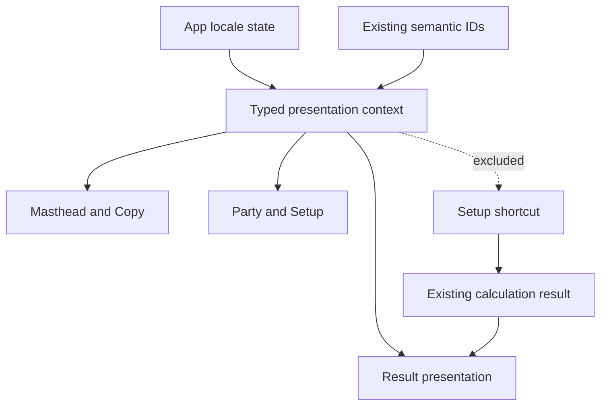

# Korean and English Language Toggle Implementation Plan

## Summary

Add a Korean-default, page-local presentation state and translate the complete
current workbench without changing setup identity, calculation, candidate
membership, source ownership, Result surfaces, or shortcut serialization. The
feature is developed on the exact Copy-feature head in an isolated worktree,
kept local until that prerequisite PR merges, and then replayed onto current
`main` for its own review and PR.

## Visible Outcome and Preserved Contrast

- The masthead presents `세팅 복사` followed by a compact `한국어 | EN`
  segmented control; English presents `Copy setup` with the same control.
- Switching language updates visible and assistive presentation in place while
  preserving every live editor, selector, disclosure, focus, Setup, and Result
  state.
- A reload, new tab, or copied Setup entry starts in Korean and the shortcut
  remains byte-for-byte language-neutral.
- Party Edit candidates sort by the selected display language, while applied or
  draft party order and Focus remain unchanged.
- Result operations remain surface-free, source category/detail remain distinct,
  and the three existing surfaces retain their calculation meaning.

## Authority and Meaning Closure

- `GV-005` and `GV-006` constrain official game terms and action identity.
- `SW-010` constrains the exact Full/non-limited pool distinction.
- `SW-013` constrains Result projection and surface-free operations.
- `SW-016` and `SW-022` constrain session replacement, shortcut identity, and
  the absence of persisted presentation state.
- `UI-002`, `UI-005`, and `UI-006` constrain source rows, viewed-Agent
  continuity, and Party Edit interaction state.
- `FM-001` owns Initial, Combat, and Fully Enabled calculation surfaces.

The transient sentinel set closes presentation-only behavior as follows:

1. An equipment-only stat contribution must keep the same source key, value,
   and surface after translation; a changed value or candidate falsifies this.
2. An Agent relationship operation must still render without a surface column;
   any added Combat or Fully marker falsifies this.
3. A source category and source-local detail must remain two semantic values in
   one row; merging them into one lookup key falsifies this.
4. A shortcut round-trip must exclude locale and recreate the same Setup with
   Korean presentation; any locale field or language-specific URL falsifies this.
5. A Party Edit language switch may reorder the unoccupied candidate pool but
   must not reorder draft slots or Focus; either state mutation falsifies this.

No source, candidate/preparation, Setup, Result, or lifecycle meaning changes.
Every sink is therefore `no change` except localized presentation and
language-dependent candidate display ordering.

## Technical Design

Use one small typed localization boundary rather than an external runtime i18n
framework. `Locale` and semantic presentation keys live in a dedicated module;
React context owns the current page-local locale. Existing domain IDs are reused
for Agents, W-Engines, Drive Discs, stats, actions, metrics, attributes, and
specialties. Display-only facts without an existing stable identity receive a
meaningful presentation key at their current authored declaration.

English remains the defensive runtime fallback. Type-level records plus a
generic reachable-content test prove both languages cover the current
presentation surface. Calculation outputs retain semantic IDs and English
baseline labels for compatibility with calculation tests; components localize
from stable identity and structured source keys at render time. No component is
keyed by locale, so switching language does not remount the workbench.

## Rejected Alternatives

- An English-string replacement table is rejected because copy edits would
  silently change identity and source/detail composition would remain ambiguous.
- A new i18n dependency is rejected because two frozen local languages, no
  persistence, and a finite typed presentation surface do not need routing,
  runtime loading, plurals infrastructure, or external synchronization.
- Locale in the shortcut or browser storage is rejected because language is not
  part of Setup identity and every new entry must start in Korean.
- A locale-keyed workbench subtree is rejected because it would remount controls
  and lose editing, disclosure, and keyboard-focus state.
- A duplicate translated content catalogue is rejected; current domain IDs and
  declarations remain the sole content identity.

## Implementation Units

### U1. Typed localization and page-session boundary

**Ownership:** `src/localization/**`, `src/App.tsx`, localization-focused tests.

**Work:**

- Define `Locale`, structured UI copy keys, formatting helpers, English fallback,
  and a provider/hook with Korean as the initial value.
- Update `document.documentElement.lang` on language change without storage or
  URL mutation.
- Keep locale outside `WorkbenchSessionState` and the shortcut payload; reset it
  to Korean only for actual hash-entry session replacement, not for Copy itself.
- Add a generic completeness assertion over declared current translation maps.

**Testing delta:** New shared tests are required because no current test covers a
presentation-only state transition or locale exclusion. Assert Korean default,
English switch, document language, no URL/storage mutation, and fallback or
completeness behavior without enumerating named content.

**Dependencies:** None.

### U2. Stable domain and source presentation mappings

**Ownership:** `src/localization/**`, narrowly required presentation identity
fields in `src/workbench/actions.ts`, `src/workbench/content/source-definitions.ts`,
and calculation result presentation adapters.

**Work:**

- Add verified Korean values for every currently reachable Agent, W-Engine,
  Drive Disc, stat, attribute, specialty, canonical action, source category,
  action-local outcome, metric, gauge label, operation label, and source detail.
- Reuse existing IDs. Add stable presentation keys only where the current model
  exposes an unstructured label with no identity.
- Preserve source owner/locus/detail separation and render category/detail in the
  accepted order without translated text participating in source identity.
- Freeze values locally; perform no runtime terminology fetch.

**Testing delta:** Add one generic reachability/completeness test across the
current exported content and presentation-key sets. Preserve calculation tests'
semantic assertions and avoid one assertion per Agent or item.

**Dependencies:** U1.

### U3. Party, Identity, and Setup localization

**Ownership:** `src/components/PartyEditor.tsx`,
`src/components/PartyWorkbench.tsx`, `src/components/AgentSetup.tsx`, related
component/integration tests.

**Work:**

- Localize every visible and accessible Party Edit, Identity, Setup, validation,
  constraint, selector, filter, and status string.
- Compute candidate/filter ordering from the selected locale at render time;
  preserve candidate membership, draft/applied order, Focus, targets, and filter
  selection.
- Preserve open selectors and focused controls when only presentation changes.
- Apply the approved natural Korean product terminology and the exact accessible
  explanation for the `상시` W-Engine range.

**Testing delta:** Extend shared Party Edit and App flows to switch language with
  a target/filter or selector open and assert the same semantic state and focus.
  Add one locale-sensitive ordering assertion based on derived display names,
  not a fixed roster list.

**Dependencies:** U1, U2.

### U4. Result, gauges, actions, and operations localization

**Ownership:** `src/components/ResultPanel.tsx`, localization adapters, related
Result and integration tests.

**Work:**

- Localize Result headings, metrics, source rows, action outcomes, status and
  constraint copy, operation labels, and all accessible descriptions.
- Map the existing surfaces to `초기`, `전투 입장`, and `최종` with accessible
  descriptions that preserve their permanent-owner meanings.
- Retain English `Current`, `Threshold`, `Cap`, and `Active` gauge structure in
  both languages while localizing the surrounding presentation.
- Keep operations surface-free and source category/detail distinct in one row.

**Testing delta:** Extend Result component coverage for both languages using one
  representative metric, one action/source detail, one gauge, and one operation.
  Assert unchanged numeric values and absence of operation surface columns.

**Dependencies:** U1, U2.

### U5. Masthead language control and responsive integration

**Ownership:** `src/App.tsx`, `src/styles/production/layout.css`, App and visual
tests.

**Work:**

- Place Copy immediately left of one current-language menu trigger in the
  existing masthead action group.
- Localize Copy idle/progress/success/failure and announcements without changing
  its single-flight, disabled, focus, or reset behavior.
- Use the existing dark-paper, thin-line, yellow-accent ZZZ visual grammar with
  the approved icon-led rounded utility form: concise labels on desktop and
  equal circular icon controls on narrow layouts. The menu keeps the selected
  locale visually and accessibly explicit and uses its approved narrower mobile
  width.
- Close the language menu on selection, outside activation, and Escape; support
  keyboard entry and movement while returning focus to its trigger on a
  committed selection or Escape.
- Verify title centering and narrow-layout fit without language-specific font
  shrinking or horizontal page scroll.

**Testing delta:** Extend App integration tests for localized Copy states and
  locale switching. Add representative desktop and narrow visual coverage for
  both languages rather than screenshots per content item.

**Dependencies:** U1, U3, U4.

### U6. Integrated verification and local checkpoint

**Ownership:** cross-feature tests, plan lifecycle documentation, local branch.

**Work:**

- Run governance tests, Vitest, TypeScript build, production build, and focused
  Playwright visual/browser verification on port 5173.
- Exercise fresh entry, initial Party Edit, applied workbench, copied shortcut,
  same-page hash replacement, Copy feedback, and both responsive layouts.
- Confirm no storage access, locale serialization, semantic/candidate change,
  page overflow, untranslated reachable copy, or operation surface regression.
- Commit the implementation locally. Do not push or open a PR until Copy PR
  #217 merges; then replay only these commits onto current `main` and obtain a
  new exact-head review.

**Testing delta:** This unit composes the unit-level checks into the two required
  cross-surface flows. It adds no Agent-specific catalogue tests.

**Dependencies:** U3, U4, U5.

## System-Wide Impact

- **State:** Adds only presentation state at the App boundary. Workbench reducer,
  candidate lifecycle, calculation context, and shortcut schema remain intact.
- **Content:** Adds frozen Korean display values keyed by current semantic
  identity. English source facts remain available as baseline/fallback.
- **Calculation:** No formula, delivery, relationship, surface, source, or
  operation changes; localization happens after result derivation.
- **Accessibility:** Document language, labels, descriptions, live regions,
  constraints, and selected toggle state update together.
- **Layout:** Only the masthead utilities and text-fit behavior change; the
  established desktop and narrow workspace composition remains authoritative.

## Verification Gates

1. `npm test`
2. `npm exec -- tsc -b`
3. `npm run build`
4. `npm run test:governance`
5. Focused Playwright and manual browser checks at desktop and narrow widths on
   the fixed local port 5173.
6. `git diff --check` and a clean review of files against this plan's ownership.

## Non-Goals

- Languages beyond Korean and English.
- Locale persistence, routing, URL parameters, or shortcut fields.
- Runtime translation services or automatic source synchronization.
- Future/unreachable content catalogue work.
- Calculation, candidate, representative, equipment, operation, or source
  semantic changes.
- Copy shortcut redesign, release workflow changes, or broad visual redesign.

## Completion and Handoff

Keep this plan active through the first committed language implementation. Once
the feature is verified and later merged, add one compact milestone to
`docs/plans/README.md` and delete this plan in a follow-up commit so Git history
retains the detailed execution record.
